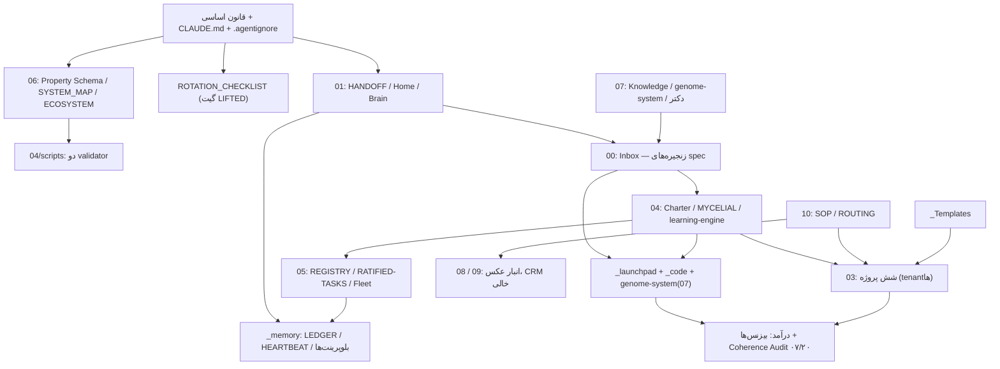

# نقشهٔ روابط کامل vault — v4

> خواستهٔ آری: «گزارش کامل از تمام ارتباطات بین تمام فایل‌های پوشهٔ بکاپ با خواندن دوبارهٔ همه — کامل‌ترین؛ ارتباطات و مستقلات هر بخش، رودمپ‌طور.»
> روش: ۸ خوانندهٔ موازی (هر بخش یک ایجنت، جمعاً ۲۹۷ خواندن) → سنتز؛ + گراف **برنامه‌ای** wikilinkها (نه حدسی). جانشین [[04 - Architect System/architect/02-Research/Report - Vault Relationship Map 2026-07-04 v3|نقشهٔ v3]] پس از verdict آری.

## ۰. اعداد سختِ گراف (استخراج برنامه‌ای، نه ادعا)

- **۶۹۱ نوت، ۲۰۱۳ یال wikilink** (بدون `_Duplicates`/`.git`/`.claude`/venv).
- **ستون‌های ورودی (in-degree):** `architect/PROJECT.md` **۷۲** · `ROTATION_CHECKLIST` **۵۷** · Crypto/PROJECT ۳۶ · CHARTER ۳۲ · هیپنوتیزم/PROJECT ۳۲ · HANDOFF ۲۹ · AGENT_REGISTRY ۲۷ · Property Schema ۲۳.
- **ستون خروجی:** HANDOFF با **۸۴ لینک خروجی** — ستون فقرات جهت‌یابی کل vault.
- **شریان‌های بین‌بخشی:** `Inbox↔04` (۱۲۵+۸۷) · `Inbox→03` (۸۵) · `04→03` (۴۹) · `Dashboard→Inbox` (۴۶) — یعنی Inbox واقعاً قلب تپندهٔ ورودی است، همان‌طور که قانون اساسی می‌خواهد.
- **orphanها (نه ورودی نه خروجی):** ۰۷ = ۶۴ (عمدتاً genome-system؛ عمدی) · `_code` = ۵۵ (عمدی) · ۰۴ = ۴۴ (گزارش‌های ۸پاسهٔ fusion-audit؛ نیمه‌عمدی) · ۰۳ = ۲۲ (کاریابی/external-research؛ دریفت) · Inbox = ۱۲ (seed کیت؛ عمدی).
- **کشف جانبی:** یک کپی کهنهٔ کامل vault (~۵۱۱ نوت) داخل `.claude/worktrees/hopeful-elgamal-6febe8` — کاندید پاکسازی با verdict.

## ۱. نمای ۳۰ثانیه‌ای

vault پنج لایه دارد که هر لایه فقط روی لایهٔ بالایی می‌ایستد: **(۱) قانون اساسی و زبان مشترک** — [[_PROJECT_INSTRUCTIONS]] + `CLAUDE.md` + `.agentignore` + [[06 - Architecture Maps/Property Schema|Property Schema]] که با دو validator در `04/scripts` اجرا می‌شوند؛ **(۲) حافظه** — [[01 - Dashboard/HANDOFF|HANDOFF]] (اولین خواندنی هر جلسه)، [[_memory/EXPERIENCE-LEDGER|EXPERIENCE-LEDGER]]/[[_memory/HEARTBEAT|HEARTBEAT]] (runtime-state ناوگان) و بخش‌های Active Context هر PROJECT.md؛ **(۳) عملیات** — Inbox (اتاق فکر propose-only با چهار زنجیرهٔ طراحی زنده)، ۶ پروژهٔ 03، رجیستری ایجنت‌های 05 و لایهٔ مادر 04؛ **(۴) کد** — مغز دوم زندهٔ `_launchpad/second-brain-live`، آرشیو read-only `_code` و genome-system در 07؛ **(۵) درآمد** — پنج بیزنس + تنها ددلاین زندهٔ vault یعنی [[00 - Inbox/2026-07-06 1410 COHERENCE-AUDIT-PITCH-draft|Coherence Audit]] (۰۷/۲۰، $3k–5k) که فعلاً بی‌متولی است. همه‌چیز پشت verdict انسانی آری است و شاه‌کلید امنیتی [[ROTATION_CHECKLIST]] (گیت LIFTED) است.

---

## ۲. بخش‌به‌بخش

### ریشه + 01 - Dashboard + 02 - Life OS (لایه حاکمیت)
**نقش:** قانون اساسی، برج مراقبت و ریتم مرور — بقیه یا از اینجا فرمان می‌گیرند یا به اینجا گزارش می‌دهند.

| گره | نقش |
|---|---|
| [[_PROJECT_INSTRUCTIONS]] | قانون اساسی ۱۲بخشی، فقط‌خواندنی |
| [[ROTATION_CHECKLIST]] | جدول ۲۴ credential؛ گیت LIFTED؛ پرارجاع‌ترین فایل حاکمیتی (۵۷ یال ورودی) |
| [[01 - Dashboard/HANDOFF\|HANDOFF]] | حافظهٔ بین‌جلسه‌ای (۹۰KB — متورم) |
| [[01 - Dashboard/Home\|Home]] · [[01 - Dashboard/Brain\|Brain]] | نقطهٔ ورود ناوبری · مغز زندهٔ overwrite-مجاز |
| [[02 - Life OS/Weekly Review\|Weekly Review]] | چک‌لیست مرور هفتگی/ماهانه |

- **درونی:** CLAUDE.md قانون اساسی را با `@` embed می‌کند؛ مثلث Home⇄HANDOFF⇄Brain؛ Home دو `.base` را embed می‌کند؛ `.gitignore` آینهٔ `.agentignore` و گره‌خورده به ردیف ۶ چرخش.
- **بیرونی (می‌خواند →):** Property Schema و ECOSYSTEM (06)، ۸ PROJECT.md (03/04/07)، SOP/ROUTING (10)، دو validator (04)، لجر/HEARTBEAT (_memory)، ده‌ها سند Inbox، _launchpad. **(خوانده می‌شود ←):** همهٔ ایجنت‌ها و بخش‌ها.
- **مستقل‌ها:** `Untitled.base` ریشه [دریفت]؛ SYSTEM-DASHBOARD.html [عمدی-بازنشسته]؛ _Index Life OS [عمدی-placeholder]؛ «لاگ اجراها»ی Weekly Review خالی [دریفت خفیف].
- **شکاف‌ها:** سه داشبورد یک روز عقب از گیت LIFTED؛ ارجاع به `secrets-export/` ناموجود؛ §۰ قانون به `_Archive` ناموجود (خارج vault از ۰۷-۰۴) اشاره می‌کند؛ §۱۰ به چک‌لیست قدیمی 04 لینک می‌دهد نه ریشه؛ ناوگان fireAt یک‌باره = مغز بی‌نبض پس از تخلیهٔ صف.

### 00 - Inbox
**نقش:** دروازهٔ ورودی و اتاق فکر — چهار زنجیرهٔ طراحی زنده (MASTER-SPEC، دکتر تکاملی، PROBE→HYBRID، پایلوت ۳۰روزه) اینجا propose-only منتظر verdict اند.

| گره | نقش |
|---|---|
| [[00 - Inbox/2026-07-06 1821 STATE-MAP — چهار جریان موازی و آشتی با طرح قبلی\|STATE-MAP]] | هاب آشتی؛ ۸ تعارض + ۷ verdict فوری |
| [[00 - Inbox/2026-07-06 1450 HYBRID-SPEC — ژنوم واحد\|HYBRID-SPEC]] | فیوژن سه ژنوم روی PersonalGenome در _launchpad |
| [[00 - Inbox/2026-07-06 0245 MASTER-ARCHITECTURE-SPEC-v1.4-draft\|MASTER-SPEC v1.4]] | سر زنجیرهٔ v1.1→v1.3→v1.4 (یافته‌های F4/C16 باز) |
| [[00 - Inbox/2026-07-06 1410 COHERENCE-AUDIT-PITCH-draft\|COHERENCE-AUDIT-PITCH]] | تنها ددلاین درآمدی: ۰۷/۲۰؛ §۶ blank |
| [[00 - Inbox/AGENT_QUESTIONS\|AGENT_QUESTIONS]] | کانال escalation؛ بلاکر git worktree اینجاست |
| [[00 - Inbox/DOCTOR-SYNTHESIS\|DOCTOR-SYNTHESIS]] · [[00 - Inbox/2026-07-06 PROBE-MERGE\|PROBE-MERGE]] | سنتز تحقیق دکتر · رکورد ۵ کاوشگر |

- **درونی:** زنجیره‌های supersede صریح (MASTER-SPEC، Learning Engine v1→v1.1)؛ خانوادهٔ دکتر (AUDIT→پرامپت‌ها→SYNTHESIS→HYBRID)؛ زنجیرهٔ استراتژی COWORK→PROBE→PITCH→GENOME→PANEL→HYBRID→STATE-MAP؛ حلقهٔ build خودکار (AUTONOMOUS-RUN→۹ proposal)؛ scout-digests با consolidator شبانه.
- **بیرونی →:** 04 (GOVERNOR-MUSE، learning-engine، MYCELIAL)، _memory (لجر، TWO-BRAIN)، 07 (genome-system، _doctor-research)، _launchpad (کد گراند HYBRID/GENOME-SPEC)، 05، 06، 03. **←:** HANDOFF/Brain (ده‌ها لینک)، AGENT_REGISTRY، FRANKENSTEIN، PROJECT.mdها.
- **مستقل‌ها:** Checklist-150 [دریفت — wired نشده]؛ research-prompt-pack [عمدی]؛ پرامپت «روز عملیاتی‌سازی» نیمه‌منسوخ [دریفت]؛ پرامپت INGEST زمان انجام‌شده [دریفت]؛ دوقلوی marketing-agent-tooling [دریفت]؛ seed کیت replication [عمدی].
- **شکاف‌ها:** دوپارگی سر خانوادهٔ دکتر (دو نسخهٔ ~۹۵٪ بدون supersede)؛ ARCHITECTURE-PATTERNS-REPORT بی‌فرانت‌متر؛ SELF-LEARNING-LOOP-SPEC غایبِ ارجاع‌شده؛ ۵+ فایل گذشته از سقف ۷ روز؛ ۵ عدد بودجهٔ ناسازگار و ۳ «دکتر» موازی (STATE-MAP §۴)؛ ددلاین ۰۷/۲۰ بی‌متولی.

### 03 - Projects
**نقش:** قلب عملیاتی/درآمدی — ۶ پوشه (۵ area + Project-F) با «کیت مغز» استاندارد، همه tenant زیر 04.

| گره | نقش |
|---|---|
| [[03 - Projects/_Index - Projects\|_Index - Projects]] | MOC ۸ پروژه |
| [[03 - Projects/Lead-نقاشی/PROJECT\|Lead/PROJECT]] + AiFarm/ARCHITECTURE_MASTER | درآمد اصلی + الگوی INV-1..3 |
| [[03 - Projects/Crypto - etoro/PROJECT\|Crypto/PROJECT]] | risk:critical؛ رجیستری پوزیشن خالی = صفر autonomy |
| [[03 - Projects/Accounting/docs/Ecosystem-Rollout-Plan\|Ecosystem-Rollout-Plan]] | پل مالی: جریان پول ۵ پروژه → Accounting |
| [[03 - Projects/Ziman Galerry/ZIMAN-SYSTEM-MAP\|ZIMAN-SYSTEM-MAP]] | هاب سیستم زندهٔ زیمان |
| Project-F: PROJECT + CLAUDE.md محلی | فاز validation، قفل GATE 0؛ تنها پروژه با CLAUDE.md محلی |

- **درونی:** الگوی INDEX→PROJECT→DecisionLog→OpenQuestions→لاگ تلگرام در هر ۶؛ Accounting مصرف‌کنندهٔ مالی همه؛ Crypto↔Mining هم‌خانواده در بات‌ها.
- **بیرونی →:** هر ۶ PROJECT به [[04 - Architect System/MYCELIAL-MASTER-SPEC|MYCELIAL-MASTER-SPEC]] و Charter؛ به ROTATION_CHECKLIST؛ به _memory (LIVING-BRAIN، TWO-BRAIN)؛ به `_code` (کد منتقل‌شده جلسه ۱۷). **←:** 04 (tenantخوانی)، 01، 05، 06، 10 (مقصد route)، scout-digestها.
- **مستقل‌ها:** PDFها/عکس‌ها/xlsxها [عمدی یا بک‌لاگ NONMD]؛ یادداشت‌های خام Mining/Rigs، files.zip و `__pycache__` کریپتو، دو پوشهٔ خالی Accounting [دریفت].
- **شکاف‌ها:** لینک‌های شکسته پس از انتقال کد (Mining «Ai bots»، Accounting «app/»، Lead «کاریابی/bot»، رانبوک‌های زیمان)؛ نام کهنهٔ «ziman-live»؛ اتصال 03→07 عملاً صفر (areaها هرگز دانش استخراج نمی‌کنند)؛ سه رجیستری کلیدی خالی.

### 04 - Architect System
**نقش:** لایهٔ مادر — منشور حاکمیت، ستون ساخت، موتور خودجهش‌ده و validatorهای کل vault؛ همه propose-only.

| گره | نقش |
|---|---|
| [[04 - Architect System/architect/ARCHITECT_CHARTER\|ARCHITECT_CHARTER]] | قانون immutable؛ §Security Gate، kill-switch |
| [[04 - Architect System/MYCELIAL-MASTER-SPEC\|MYCELIAL-MASTER-SPEC]] | ستون ساخت (canon_rank 1)؛ رجیستری اتصال ۸ پروژه |
| [[04 - Architect System/GOVERNOR-MUSE-SYSTEM-INDEX\|GOVERNOR-MUSE-SYSTEM-INDEX]] | MOC سیستم همیشه‌روشن پنتا |
| learning-engine/ (ENGINE-PROMPT + LEARNING-STATE.json) | موتور خودجهش‌ده؛ STATE مقدم بر CONTRACT |
| scripts/ (دو validator + genome_guard/budget_gate/governor_shadow) | بازوی اجرایی §۱۱ و Property Schema + گاردهای نو |

- **درونی:** Charter ریشهٔ همه؛ زنجیرهٔ لنز زیستی MYCELIAL→L-Survival-v3→SURVIVAL؛ BIO-SYNTHESIS-MAP بافندهٔ لنزها؛ GOVERNOR+MUSE دریفت‌های D1/D3 را در learning-engine اعمال کرد.
- **بیرونی →:** ROTATION_CHECKLIST، ۸ PROJECT.md، [[05 - Agents/RATIFIED-TASKS|RATIFIED-TASKS]]، _memory (لجر/HEARTBEAT)، `_ops/budget/budgets.yaml`، `_code/ai-farm`. **←:** ۶+۱ PROJECT (بنر ستون)، HANDOFF/Brain، رجیستری 05، ده‌ها سند Inbox.
- **مستقل‌ها:** _intake-photos [عمدی-خالی]؛ doctor_lite [عمدی نیمه‌مستقل]؛ `mycelial-arch.v-final.md` (استرَی ۲۲KB بی‌فرانت‌متر) [دریفت]؛ versions/ خالی [دریفت خفیف].
- **شکاف‌ها:** git vault init نشده (تنها rollback واقعی، پیش‌شرط L2+)؛ متون قدیمی هنوز «تا rotation فقط MOCK» می‌گویند در برابر گیت LIFTED؛ دو-لجری جهش؛ بلوک منشور GOVERNOR/MUSE هنوز در Charter پیست نشده؛ `_ops` نیمه‌ساخته.

### 05 - Agents + 06 - Architecture Maps
**نقش:** رجیستری autonomy + زبان مشترک — [[05 - Agents/AGENT_REGISTRY|AGENT_REGISTRY]]/[[05 - Agents/RATIFIED-TASKS|RATIFIED-TASKS]] جفت خودترمیمی (restore فقط ۶ تسک ratified)؛ [[06 - Architecture Maps/Property Schema|Property Schema]] تک‌منبع فرانت‌متر که validator اجرایش می‌کند.

| گره | نقش |
|---|---|
| AGENT_REGISTRY (۲۷ یال ورودی) | جدول ratified = قلب خودترمیمی |
| RATIFIED-TASKS | متن کامل پرامپت‌ها؛ لنگر restore |
| [[05 - Agents/Research Scout Fleet\|Research Scout Fleet]] · [[05 - Agents/Mycelium Scout\|Mycelium Scout]] | پروتکل ناوگان ⇄ طراحی زیست‌الگو |
| Property Schema (۲۳ یال) · [[06 - Architecture Maps/SYSTEM_MAP\|SYSTEM_MAP]] · [[06 - Architecture Maps/ECOSYSTEM\|ECOSYSTEM]] | schema · نقشهٔ حاکمیتی · دیاگرام برگ |

- **بیرونی →:** ROTATION_CHECKLIST، Charter (04)، لجر/HEARTBEAT (_memory)، scout-digests (00)، PROJECT دامنه‌ها. **←:** قانون اساسی §۱ و §۶، Fleet هر تسک زمان‌بندی، replication-kit، MASTER-SPECها.
- **مستقل‌ها:** هیچ فایل کاملاً یتیم؛ ECOSYSTEM بدون لینک خروجی [عمدی-قابل‌بهبود]؛ SYSTEM_MAP در MOC بخش خودش فهرست نشده [دریفت].
- **شکاف‌ها:** تناقض شمارش ناوگان (۸/۲۰/۱۹ در سه سند در برابر ۶ ratified واقعی)؛ **مسیر hardcode شدهٔ `C:\Users\Armin\Desktop\backup` در همهٔ پرامپت‌های restore (vault در `F:\backup` است!)**؛ learning-engine-loop خارج از جدول ratified ولی داخل تک‌منبع بازسازی؛ ECOSYSTEM بدون Project-F و ناوگان زنده.

### 07 - Knowledge
**نقش:** دانش ماندگار — چهار زیر-اکوسیستم: genome-system (کدی، propose-only)، Time-Architecture (نظری)، هیپنوتیزم/فیوژن، خط‌لولهٔ _doctor-research.

| گره | نقش |
|---|---|
| [[07 - Knowledge/genome-system/INDEX\|genome-system/INDEX]] + HANDOFF + values.yaml | نقشهٔ canonical + قرارداد ایجنت‌ها + هستهٔ فریز |
| [[07 - Knowledge/Time-Architecture/theory\|Time-Architecture/theory]] | منبع مقدس P1..P14؛ سه سنتز مشتق |
| [[07 - Knowledge/هیپنوتیزم  و خودآگاهی/PROJECT\|هیپنوتیزم/PROJECT]] | پرلینک‌ترین hub بخش (۳۲ یال ورودی)؛ node ستون MYCELIAL |
| [[07 - Knowledge/_doctor-research/_INDEX\|_doctor-research/_INDEX]] | ۸ ستون تحقیق ↔ ۷ تصمیم باز §۹ |

- **درونی:** Time-Architecture⇄هیپنوتیزم cross-link حول HRV؛ «دو رژیم لینک»: ۵۲ فایل فیوژن صفر wikilink (فقط ارجاع backtick).
- **بیرونی →:** MYCELIAL (04)، TWO-BRAIN/FRANKENSTEIN (_memory)، پرامپت‌های دکتر (00). **←:** HANDOFF، METABOLIC-GOVERNOR، DOCTOR-SYNTHESIS، تسک «Genome loop».
- **مستقل‌ها:** _backups/tar.gz و reports دمو [عمدی]؛ «تحقیق مخفی.txt»، عکس یتیم، یتیم‌های Marathon [دریفت]؛ بستهٔ _audit [عمدی-snapshot]؛ «۱۰ رویکرد فلسفی» [نیمه-دریفت].
- **شکاف‌ها:** MAPهای کهنهٔ هیپنوتیزم (P4..P7 در واقع ساخته شده)؛ لینک شکستهٔ ROTATION در هیپنوتیزم (نام کامل «ROTATION_CHECKLIST - هیپنوتیزم»)؛ `.git` تودرتوی genome-system مرده‌زاد؛ **PII ژنتیکی ~۶۰MB داخل vault**؛ ۸/۸ verdict دکتر pending.

### _memory + _Templates + 10 + 08 + 09
**نقش:** حافظهٔ عملیاتی و زیرساخت جانبی — لجر/نبض، بلوپرینت‌های کنترل، قالب‌های اجباری، ایستگاه تلگرام، انبار عکس، داربست CRM.

| گره | نقش |
|---|---|
| [[_memory/EXPERIENCE-LEDGER\|EXPERIENCE-LEDGER]] · [[_memory/HEARTBEAT\|HEARTBEAT]] | حافظهٔ append-only + watchdog — runtime-state کل سیستم |
| [[_memory/TWO-BRAIN-CONTROL-BLUEPRINT\|TWO-BRAIN]] · [[_memory/FRANKENSTEIN-BUILD-PLAN\|FRANKENSTEIN]] | مدل کنترل دو مغز + نقشهٔ ساخت ۸ اندام |
| [[_memory/CONNECTIONS-MAP\|CONNECTIONS-MAP]] · [[_memory/LIVING-BRAIN-BLUEPRINT\|LIVING-BRAIN]] | ~۱۷۴ لینک کاندید · معماری هرمی مغز زنده |
| [[10 - Telegram processing/SOP\|SOP]] · [[10 - Telegram processing/ROUTING\|ROUTING]] | الگوریتم triage + جدول هشتگ→مقصد |
| [[_Templates/project\|_Templates/project]] | پایهٔ قاعدهٔ حافظه §۸ |

- **بیرونی →:** Inbox (سنگین‌ترین شریان)، 04/learning-engine، 05، 01، ROTATION_CHECKLIST. **←:** کل ناوگان خودکار در هر اجرا؛ قانون §۴/§۶ به SOP/ROUTING/_Templates.
- **مستقل‌ها:** گزارش ChatExport [عمدی]؛ EXCLUDED/recon [عمدی-بسته]؛ کل 09 [عمدی-داربست خالی]؛ اکثریت ۰۸ بدون embed [نیمه‌عمدی]؛ handoff.md قالب [عمدی].
- **شکاف‌ها:** 🔴 `_memory/SYSTEM-STATE.md` ناموجود در حالی که TWO-BRAIN/FRANKENSTEIN تسک ۲ساعته رویش تعریف کرده‌اند؛ 🔴 جدول لجر از ردیف ۶۸ به بعد از هم پاشیده (parse ماشینی می‌شکند)؛ 🔴 حافظهٔ Project-F دو نسخه بدون canonical؛ 🟠 پوشهٔ `Raw/` تلگرام ناموجود (پایپ‌لاین capture هرگز اجرا نشده)؛ 🟠 مسیرهای کهنهٔ Desktop\backup در BUILD-PROMPT/REVIEW؛ 🟡 قالب برای typeهای report/prompt/moc نیست.

### لایه CODE — _launchpad + _code + genome-system(run)
**نقش:** لایهٔ اجرایی زنده: مغز دوم v2 چهارلایه در `_launchpad/second-brain-live`، آرشیو read-only `_code`، دو entry point ژنوم (`run.py`, `research_loop.py`).

| گره | نقش |
|---|---|
| ARCHITECTURE.md · INVENTORY.md · README-FA.md | سند حاکم v2 · ممیزی دارایی‌ها · runbook مالک |
| control-brain/core (gateway/memory/contracts/approval) | تک‌درب LLM + core.db + صف approve-first |
| adapters/business/base.py (PersonalGenome) | ژنوم عملیاتی per-business — لنگر HYBRID-SPEC |
| evolution/brain.py | پیشنهاد→کارت ادمین→CHANGELOG+برنچ |
| `_code/` | آرشیو ۵ پروژه؛ طبق `.agentignore` فقط فهرست |

- **درونی:** بوت START-HERE→wizard→.env→app.py→projects.yaml (۴ ماژول)؛ ۴۷ تست؛ genome-system plan-gated با STATUS.json.
- **بیرونی →:** INVENTORY به `_code` (منبع بازیافت)؛ PATTERNS-QUICK-REFERENCE به اسناد ratified vault؛ دو استک LLM جدا (DeepSeek/Fugu در برابر Anthropic — تعارض #۳ STATE-MAP، عمداً باز). **←:** HANDOFF (سنگین‌ترین وابسته)، ۵ PROJECT.md، Prompt مهندسی کدبیس، METABOLIC-GOVERNOR.
- **مستقل‌ها:** KILL-ALL-BRAIN.bat، sample_project، core.db/state.db، autostart [عمدی]؛ PROJECT_STRUCTURE.pdf و staging کهنهٔ _backups [دریفت].
- **شکاف‌ها:** لینک کهنهٔ «ziman-live»؛ Project-F هیچ لینک به projectf-agent/GATE.yaml ندارد؛ Lead/Accounting از fork زندهٔ launchpad بی‌خبرند؛ تلهٔ نامی `ANTHROPIC_API_KEY` حامل کلید DeepSeek؛ alias بازنشستهٔ deepseek-chat در اسناد؛ هر دو `.git` مرده → ادعاهای rollback بی‌substrate.

---

## ۳. ستون فقرات (رودمپ)

**زنجیرهٔ ورود ایجنت تازه (اجباری، به ترتیب):**
1. `CLAUDE.md` ← که [[_PROJECT_INSTRUCTIONS]] را embed می‌کند + `.agentignore` (مرزهای ممنوع)
2. [[06 - Architecture Maps/Property Schema|Property Schema]] — زبان داده؛ enforce با `validate_frontmatter.py`
3. [[01 - Dashboard/HANDOFF|HANDOFF]] — وضعیت جلسات؛ سپس [[01 - Dashboard/Brain|Brain]] برای عکس لحظه‌ای
4. PROJECT.md همان پروژه (Active Context/Progress) — قاعدهٔ §۸
5. کار → پایان: آپدیت Active Context + بازنویسی HANDOFF + دو validator

**زنجیرهٔ ساخت (build spine):**
[[00 - Inbox/2026-07-06 1450 HYBRID-SPEC — ژنوم واحد|HYBRID-SPEC]] (ژنوم واحد، گراند روی `base.py` در _launchpad) ↔ [[04 - Architect System/GOVERNOR-MUSE-SYSTEM-INDEX|GOVERNOR-MUSE]] (سیستم همیشه‌روشن + learning-engine) ↔ [[07 - Knowledge/genome-system/INDEX|genome-system]] (هستهٔ propose-only؛ تعارض استک #۳ باز) ↔ [[00 - Inbox/2026-07-06 PANEL-SPEC-ادمین-و-شرکا|PANEL-SPEC]] (پنل ادمین/شرکا) ↔ [[00 - Inbox/2026-07-06 1410 COHERENCE-AUDIT-PITCH-draft|Coherence-Audit]] (**۰۷/۲۰** — نقطهٔ پول). لنگر آشتی همه: [[00 - Inbox/2026-07-06 1821 STATE-MAP — چهار جریان موازی و آشتی با طرح قبلی|STATE-MAP]].

---

## ۴. مستقل‌های کل vault

**عمدی:** replication-kit/seed (بستهٔ export)؛ scout-digests خام (evaporating)؛ research-prompt-pack؛ KILL-ALL-BRAIN.bat، sample_project، autostart، DBهای runtime؛ بستهٔ _audit (07)؛ _backups ژنوم و reports دمو؛ گزارش ChatExport؛ EXCLUDED/recon (بسته)؛ کل 09 - People (داربست)؛ اکثر ۰۸ (انبار)؛ _Templates/handoff؛ SYSTEM-DASHBOARD.html (بازنشستهٔ رسمی)؛ _intake-photos؛ doctor_lite؛ PDFهای quote و پیوست‌های architect.

**دریفت:** `Untitled.base` ریشه؛ `mycelial-arch.v-final.md` استرَی؛ Checklist-150 دکتر (wired نشده)؛ دوقلوی marketing-agent-tooling؛ پرامپت‌های نیمه‌منسوخ (روز عملیاتی‌سازی، INGEST زمان)؛ یادداشت‌های خام Mining/Rigs و `__pycache__`/zipهای Crypto؛ دو پوشهٔ خالی Accounting؛ «تحقیق مخفی.txt» و یتیم‌های Marathon و عکس هیپنوتیزم؛ staging کهنهٔ `_backups/.staging-…`؛ PROJECT_STRUCTURE.pdf در launchpad؛ لاگ اجراهای خالی Weekly Review؛ worktree کهنهٔ `.claude/worktrees/hopeful-elgamal` (~۵۱۱ نوت کپی).

---

## ۵. ۱۰ شکاف/دریفت برتر که رودمپ باید ببندد

1. **git واقعی راه بیفتد** — `core.worktree` مردهٔ vault + `.git` مرده‌زاد genome-system: تا حل نشود همهٔ ادعاهای rollback/برنچ (پروتکل ژنوم، evolution/brain.py، checkpoint §۰) بی‌مکانیزم است. اجرا فقط سمت Windows توسط مالک.
2. **لجر تجربه تعمیر شود** — جدول [[_memory/EXPERIENCE-LEDGER|EXPERIENCE-LEDGER]] از ردیف ۶۸ پاشیده و ردیف ۷۸ وسط کلمه بریده؛ parse ماشینی ledger_cursor موتور یادگیری می‌شکند.
3. **ددلاین ۰۷/۲۰ متولی بگیرد** — §۶ pitch (۳ مخاطب) blank و هیچ جریانی رویش کار نمی‌کند.
4. **re-arm ناوگان زمان‌بندی** — همهٔ تسک‌ها fireAt یک‌باره‌اند؛ پس از تخلیهٔ صف، Brain/فوکوس‌بورد بی‌نبض می‌شوند + تسک perception-refresh به مقصد ناموجود (`_memory/SYSTEM-STATE.md`) می‌نویسد.
5. **مسیر hardcode شدهٔ restore** — پرامپت‌های [[05 - Agents/RATIFIED-TASKS|RATIFIED-TASKS]] به `C:\Users\Armin\Desktop\backup` اشاره می‌کنند؛ vault در `F:\backup` است — خودترمیمی الان تسک شکسته می‌سازد.
6. **verdictهای supersede** — دو نسخهٔ ~۹۵٪ خانوادهٔ دکتر، دوقلوی marketing-agent-tooling، دو mycelial vfinal، دو حافظهٔ Project-F: هر جفت یک head اعلام شود.
7. **لینک‌های شکستهٔ پس از انتقال کد** — Mining «Ai bots»، Accounting «app/»، Lead «کاریابی/bot»، رانبوک‌های زیمان + نام «ziman-live»→«second-brain-live» + لینک ساختاری Project-F→projectf-agent.
8. **آشتی گیت LIFTED با متون قدیمی** — Domains Status، CONTROL-PANEL، BUILD-BACKLOG/SURVIVAL («فقط MOCK»)، BUILD-PROMPT همگی با [[ROTATION_CHECKLIST]] هم‌راستا شوند؛ ارجاع §۱۰ قانون هم به فایل ریشه بچرخد.
9. **زیرساخت غایبِ ارجاع‌شده** — `_Archive` (مقصد قاعدهٔ ۱، دیگر وجود ندارد)، پوشهٔ `Raw/` تلگرام (مبنای dedup، هرگز ساخته نشده)، `_ops/budget+backup` نیمه‌کاره، تعیین تکلیف `secrets-export/`.
10. **رژیم حافظه سبک شود** — HANDOFF ۹۰KB (باید wikilink-only بماند؛ جلسات قدیمی → نوت خواهر) + سقف ۷ روز Inbox روی ۵+ پرامپت کهنه + قالب‌های غایب (report/prompt/moc/scout-digest) به _Templates تا آنارشی فرانت‌متر (۱۸ مقدار status) جمع شود.

## منابع

۸ نقشهٔ بخشی Workflow (transcript: `subagents/workflows/wf_800bdd92-3b3`) · گراف برنامه‌ای linkgraph (۶۹۱ نوت/۲۰۱۳ یال) · [[04 - Architect System/architect/02-Research/Report - Vault Relationship Map 2026-07-04 v3]] · [[00 - Inbox/2026-07-06 1821 STATE-MAP — چهار جریان موازی و آشتی با طرح قبلی]] · [[01 - Dashboard/HANDOFF]]
