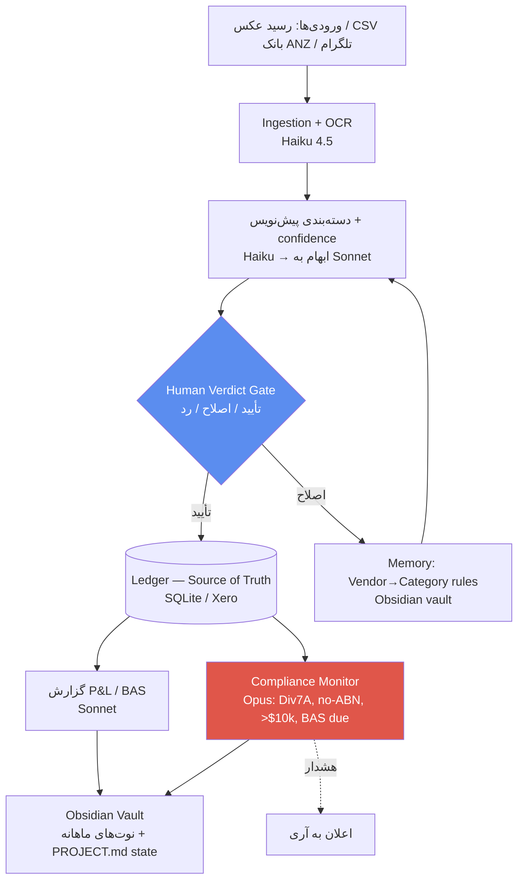

> ⚠️ محدوده‌ی مجاز طبق PROJECT.md: این معماری **read-only + human-verdict** است. ایجنت هرگز به ATO/ASIC چیزی lodge نمی‌کند و هیچ پولی جابه‌جا نمی‌کند. همه‌ی قواعد مالیاتی `[Unverified — accountant to confirm]`.

# معماری عامل حسابداری + پرامپت تحقیقاتی

بازطراحی سیستم Accounting شما به‌عنوان یک **agent مهندسی‌شده** — با پوشش دقیقِ چیزهایی که یک پروژه‌ی AI/Agent باید داشته باشد: **Model selection, Memory, Tool design, Cost, Monitoring, Evaluation, Security**.

---

## ۱. خلاصه سریع (Quick Summary)

الان سیستم شما یک **بات تلگرام + دو داشبورد Node/SQLite** است که داده را «دستی» می‌گیرد. مشکل: داده‌ی واقعی شما از **export بانک ANZ (CSV)** می‌آید، نه تایپ دستی در تلگرام — پس ابزار با واقعیت نمی‌خواند. این سند سه چیز می‌دهد: (الف) یک **پرامپت تحقیقاتی قابل‌استفاده‌ی مجدد**، (ب) فهرست **بهبودها**، (ج) یک **معماری agent بهتر** که Xero را به‌عنوان هسته‌ی منطبق (compliant core) نگه می‌دارد و Claude را به‌عنوان «لایه‌ی هوشمند» رویش می‌گذارد.

---

## ۲. تحلیل (Problem / Goal / Constraints / Assumptions / Risks)

| بُعد | تعریف |
|---|---|
| **Problem** | داده‌ی مالی پراکنده و دستی؛ ریسک انطباق (Div 7A، دستمزد نقدی)؛ ابزار فعلی با منبع واقعی داده (CSV بانک) هم‌راستا نیست |
| **Goal** | دفاتر **audit-ready** با کمترین کار دستی، تا آری قرارداد بزرگ‌تر بگیرد (tenant #1) |
| **Constraints** | تک‌کاربر، بودجه‌ی کوچک، read-only، human-verdict اجباری، داده‌ی حساس مالی روی دستگاه محلی |
| **Assumptions** | Xero فعال است (`[Verified از داده: شارژ Xero]`)؛ آری مدیر/سهامدار است؛ حجم پایین (~۱۰۰ رسید/ماه) |
| **Risks** | خطای دسته‌بندی → BAS غلط؛ نشت PII؛ اتکای بیش‌ازحد به LLM به‌جای منبع حقیقت ساختاریافته؛ vendor lock-in |

---

## ۳. بخش الف — پرامپت تحقیقاتی قابل‌استفاده‌ی مجدد

این را می‌توانی مستقیم به skill `deep-research` بدهی. با **role + context + scope + constraints + output + verification** ساخته شده تا خروجی، «قابل‌اتکا و قابل‌راستی‌آزمایی» باشد نه توهمِ مطمئن.

```text
ROLE
You are a senior Australian tax & finance research analyst specialising in small
Pty Ltd companies in the building/painting trade in NSW (Sydney).

CONTEXT (my business)
- Structure: Pty Ltd, sole director/shareholder, trade = painting/renovation, Sydney NSW.
- Scale: ~AUD $250k annual turnover, GST-registered, quarterly BAS, likely base-rate entity.
- Reality: 1–2 workers (employee/contractor status unclear); director draws cash;
  personal & business funds currently mixed; uses Xero.
- Current financial year context: verify what FY it is at time of research and use
  the correct year's figures.

OBJECTIVE
Produce a decision-grade briefing on: {INSERT SPECIFIC QUESTION, e.g.
"the most tax-effective and compliant way for the director to take money out"}.

SCOPE — answer each with current figures:
1. The exact ATO/ASIC rule and the number/threshold/rate for the CURRENT financial year.
2. How it specifically applies to a business with the context above.
3. The concrete compliance action required and the deadline.
4. The penalty/risk if done wrong.
5. Any legal tax-minimisation lever available (with eligibility conditions).

CONSTRAINTS (non-negotiable)
- Cite a PRIMARY source for every figure: ato.gov.au, asic.gov.au, or legislation.
  No blogs as the sole source for a number.
- State the financial year each figure applies to; flag if a rule changed recently.
- If a figure could be outdated, say so — do NOT present a stale rate as current.
- Mark anything you cannot verify as [UNVERIFIED] and list what a registered tax
  agent must confirm. You are not giving tax advice; you are gathering information.
- Distinguish "must" (law) from "should" (best practice) from "could" (optimisation).

OUTPUT FORMAT
- A short answer first (3–5 sentences).
- Then a table: Rule | Current figure (FY) | Applies to me because… | Action | Deadline | Source.
- Then "Red flags in my situation" and "Questions for my accountant".

VERIFICATION (do this before finalising)
- Re-check every number against the primary source; if two sources disagree, show both.
- Adversarially ask: "what would make this answer wrong or outdated?" and address it.
```

**چرا این پرامپت خوب است:** منبع اولیه اجباری، سال مالی صریح، جداسازی «قانون/بهترین‌روش/بهینه‌سازی»، برچسب `[UNVERIFIED]`، و یک مرحله‌ی **خودراستی‌آزمایی adversarial** — دقیقاً چیزی که جلوی «اطمینانِ توهمی» را می‌گیرد.

---

## ۴. بخش ب — بهبودهای سیستم فعلی (Quick Wins → Structural)

| # | بهبود | چرا (از روی داده‌ی واقعی) | تلاش |
|---|---|---|---|
| 1 | **Importer برای CSV بانک ANZ** به‌جای تایپ دستی در تلگرام | داده‌ی شما «PS Export» از ANZ است؛ تایپ دستی اتلاف است | کم |
| 2 | **استخراج خودکار رسید از عکس** (feature ای که README «آینده» گذاشته) | عکس‌ها الان بی‌ساختار در پوشه‌اند | متوسط |
| 3 | **نقشه‌ی Vendor→Category که یاد می‌گیرد** (Woolworths→Personal، Bunnings→Materials) | تکرار زیاد فروشنده‌ها در داده | کم |
| 4 | **Compliance monitor خودکار**: Div 7A، BAS due، پرداخت بدون ABN، تراکنش > $10k | ریسک‌های واقعیِ همین پوشه | متوسط |
| 5 | **یکی‌کردن نرم‌افزار**: Xero یا MYOB (نه هر دو) | هر دو در داده شارژ شده‌اند = هزینه‌ی دوبل | کم |
| 6 | **Backup خودکار SQLite + جداسازی secrets** | داده‌ی مالی حساس؛ فقط `.gitignore` کافی نیست | کم |
| 7 | **جداسازی سخت‌گیرانه‌ی شخصی/بیزنس** در لایه‌ی داده | قاطی‌شدن، بزرگ‌ترین پرچم قرمز ممیزی | کم |

---

## ۵. بخش ج — معماری بهتر Agent

**اصل طراحی:** منبعِ حقیقت (source of truth) یک **دفتر ساختاریافته (Xero/SQLite)** است، نه حافظه‌ی LLM. Claude فقط لایه‌ی «استخراج + پیشنهاد + پایش + گزارش» است و هر نوشتن، **gate انسانی** دارد.



### ۵.۱ انتخاب مدل (Model Selection / Tiering)

| وظیفه | مدل | چرا | قیمت (per M tok, in/out) |
|---|---|---|---|
| OCR + استخراج فیلد رسید | **Haiku 4.5** | حجم بالا، ساختاریافته، ارزان | $1 / $5 |
| دسته‌بندی تراکنش (پیش‌نویس) | **Haiku** → موارد مبهم به **Sonnet** | ۹۰٪ کارها ساده‌اند | $1/$5 → $3/$15 |
| گزارش P&L/BAS و توضیح انسانی | **Sonnet** | استدلال + نگارش | $3 / $15 |
| تحلیل ریسک انطباق (Div7A، contractor، آستانه‌ها) | **Opus 4.8** | high-stakes، اشتباهش گران است | $5 / $25 |
| پرسش‌وپاسخ روی vault | **Sonnet** | تعادل | $3 / $15 |

`[Verified: platform.claude.com/pricing, جولای ۲۰۲۶]` · با **prompt caching** (۹۰٪ تخفیف روی context تکراری) و **batch** (۵۰٪ ارزان‌تر) هزینه پایین می‌آید.

### ۵.۲ استراتژی حافظه (Memory Strategy)

- **Source of truth (ساختاریافته):** Ledger در Xero/SQLite — نه LLM. LLM هرگز «عدد» را از حافظه‌اش نمی‌گوید؛ همیشه از دفتر می‌خواند.
- **Long-term memory:** خودِ Obsidian vault — `PROJECT.md` (state/تصمیم‌ها)، فایل «Vendor→Category rules»، و verdictهای قبلی.
- **Working memory:** context جلسه؛ vault کوچک است پس **مستقیم فایل بخوان** (RAG/embeddings الان لازم نیست — از over-engineering پرهیز کن؛ اگر vault خیلی بزرگ شد آن‌وقت RAG سبک اضافه کن).
- **Continual learning ارزان:** هر اصلاح انسانی → به فایل rules اضافه شود → پیش‌نویس‌های بعدی بهتر می‌شوند (بدون fine-tuning).

### ۵.۳ طراحی ابزار (Tool Design) با Human-in-the-loop

```
extract_receipt(image)      -> {date, vendor, amount, gst, abn?}   # read
suggest_category(txn)       -> {category, confidence, reason}      # read
compute_bas(quarter)        -> {G1, 1A, G10, G11, G18, netGST}     # read
compliance_scan()           -> [flags: div7a, no_abn>$75, cash>$10k, bas_due]  # read
generate_report(period)     -> markdown note                       # read
--- GATED (نیاز به تأیید انسانی) ---
write_ledger(txn)           # فقط پس از verdict
--- هرگز (طبق PROJECT.md + قوانین سیستم) ---
lodge_to_ato()  |  move_money()  |  pay()      # وجود ندارند
```

### ۵.۴ برآورد هزینه (Cost Estimation) — حجم واقعی شما

فرض: ~۱۰۰ رسید + ~۳۰ تراکنش بانکی در ماه + ۱ گزارش ماهانه.

| بخش | مدل | برآورد ماهانه |
|---|---|---|
| استخراج ۱۰۰ رسید | Haiku | ~$۰.۵ |
| دسته‌بندی + موارد مبهم | Haiku/Sonnet | ~$۱–۲ |
| گزارش ماهانه + Q&A | Sonnet | ~$۱–۳ |
| اسکن انطباق ماهانه | Opus | ~$۱–۳ |
| **جمع API (Claude)** | | **~$۵–۱۵/ماه** |
| نرم‌افزار (Xero Ignite/Grow) | | $۳۵–۷۵/ماه |

نتیجه: **گلوگاه هزینه، مدل نیست؛ اشتراک نرم‌افزار است.** با این حجم، استفاده از Opus برای «فقط» تحلیل ریسک کاملاً به‌صرفه است.

### ۵.۵ پایش و لاگ (Monitoring & Logging)

- **هر پیش‌نویس + verdict انسانی (accept/edit/reject) را لاگ کن** — همین می‌شود دیتاستِ eval تو.
- KPIها (از PROJECT.md): فاصله‌ی رسید→دسته‌بندی (<۷ روز)، ٪ تراکنش‌های دسته‌بندی‌شده، BAS بدون جریمه، **دقت دسته‌بندی**.
- هشدارها: منفی‌شدن حساب بیزنس، نزدیک‌شدن سررسید BAS، سررسید بازپرداخت Div7A (۳۰ ژوئن)، پرداخت بدون ABN.

### ۵.۶ چارچوب ارزیابی (Evaluation Framework)

- **Golden set:** ۵۰–۱۰۰ رسید/تراکنش واقعی با دسته‌ی تأییدشده‌ی انسانی.
- **متریک‌ها:** دقت دسته‌بندی (هدف > ۹۰٪)، دقت استخراج فیلد، و مهم‌تر: **recall پرچم‌های انطباق** (نبود false-negative حیاتی است — یک Div7A ازدست‌رفته خطرناک است).
- Regression: با هر تغییر prompt/مدل، روی golden set دوباره اجرا کن (می‌توانی از harness در skill `skill-creator` استفاده کنی).

### ۵.۷ امنیت و Guardrails

- Secretها (bot token) خارج از کد — الان در `.gitignore` هست ✓؛ اما به secret manager منتقل کن.
- **PII:** داده‌ی مالی محلی بماند؛ به مدل فقط کمترین context لازم داده شود.
- **Read-only پیش‌فرض**؛ نوشتن فقط با verdict؛ هرگز lodge/pay.
- **DR/Backup:** چون داده‌ی مالیِ ماندگار داری، backup خودکار روزانه‌ی `.db` + نسخه‌ی offsite.

---

## ۶. مقایسه‌ی گزینه‌های معماری (Trade-offs، امتیاز ۱–۱۰)

| گزینه | Cost | Complexity | Scalability | Maintainability | Security | Time-to-implement |
|---|:--:|:--:|:--:|:--:|:--:|:--:|
| **A) نگه‌داشتن بات Node فعلی** | 9 | 4 | 4 | 4 | 5 | 9 |
| **B) Xero هسته + لایه‌ی Agent Claude** ✅ | 7 | 6 | 8 | 8 | 8 | 6 |
| **C) Agent کامل جایگزین Xero** | 5 | 9 | 7 | 4 | 5 | 2 |

**توصیه (بیشترین ROI): گزینه B.** بگذار **Xero** کارِ منظم‌شده (BAS، STP، payroll — که همین حالا compliant است) را بکند، و **Claude** لایه‌ی هوشمند باشد (استخراج رسید، دسته‌بندی، پایش red-flag، گزارش‌های زبان‌ساده در vault). چرا نه C؟ چون بازسازیِ منطق انطباقِ ATO از صفر، هم گران است هم پرریسک. چرا نه A؟ چون با واقعیت داده (CSV بانک) هم‌راستا نیست و هوش ندارد. **Vendor lock-in:** Xero خروجی کامل می‌دهد (CSV/API)، پس قفل‌شدگی کم است.

---

## ۷. نقد و سخت‌سازی معماری (Red-Team — v1.1)

v1 را عمداً adversarial نقد کردم. این‌ها ضعف‌های واقعی‌اند؛ چند مورد مستقیم از داده‌ی خودت بیرون می‌زند و اگر نادیده گرفته شوند **BAS را خراب می‌کنند**.

### ۷.۱ ضعف‌های بحرانی + اصلاح

| # | ضعف در v1 | شاهد از داده‌ی تو | اصلاح (patch) |
|---|---|---|---|
| 1 | **GST را flat ۱۰٪ گرفته بودم** (همان باگ بات فعلی: `amount*0.10`) | داده‌ی بانک/رسید معمولاً **GST-inclusive** است؛ ضمناً بهره‌ی بانکی، حقوق و خرید خارجی (Temu، `2co.com Amsterdam`) GST ندارند | GST **per-transaction**: اگر inclusive ⟵ `GST = total/11`؛ اگر GST-free/overseas ⟵ `0` |
| 2 | **بدون dedup/idempotency** برای import مکرر CSV | ستون **ID** در ANZ export یکتاست (مثل `1130808067`) | همان ID = کلید یکتا؛ import دوباره ⟵ آپدیت، نه رکورد تکراری |
| 3 | **بدون کنترل مغایرت‌گیری (reconciliation)** | ANZ export ستون **Closing Balance** دارد | هر ماه: `Σ ledger == Δ Closing Balance`؛ عدم‌تطابق ⟵ پرچم |
| 4 | **Div7A فقط یک flag کلیدواژه‌ای بود** | «Payment to Armin/Maliheh/Sume/Behzad» — باید بدانی کدام associate است | **Associates Registry** + **زیر-دفتر وام مدیر** (مانده‌ی در حال انباشت)، نه صرفاً تطبیق متن |
| 5 | **Human-verdict gate می‌تواند خودش گلوگاه شود** | ~۱۳۰ قلم در ماه؛ تأیید تک‌تک = همان کار دستی که می‌خواستیم حذف کنیم | **batch-approve** برای high-confidence + **صف بازبینی** فقط برای مبهم‌ها |
| 6 | **بدون PII redaction قبل از inference** | داده‌ها نام کامل، حواله‌ی خانوادگی به ایران و مانده‌ی حساب دارد | برای دسته‌بندی نام لازم نیست ⟵ قبل از ارسال به مدل، نام‌ها/مراجع را tokenize کن |
| 7 | **متریک eval غلط بود (accuracy)** | پرچم‌های انطباق **نادر**اند ⟵ accuracy گمراه‌کننده | روی کلاس نادر **recall/precision** بسنج + drift monitoring |
| 8 | **بدون مدیریت چندارزی (FX)** | تراکنش‌های خارجی (Amsterdam) | نرخ تبدیل + مبلغ AUD در لحظه‌ی تراکنش ثبت شود |
| 9 | **DR فقط «backup» بود** | داده‌ی مالی ماندگار | **3-2-1** + **تست restore واقعی** (backup بدون restore-drill = توهم امنیت) |

### ۷.۲ چند patch مشخص

**سیاست routing (به‌جای «مبهم‌ها به Sonnet»ِ مبهم):**
```python
if confidence >= 0.85 and vendor in known_map and abs(amount) < 2000:
    action = "auto_draft"        # می‌رود به batch-approve
else:
    action = "review_queue"      # Sonnet پیشنهاد می‌دهد، انسان verdict می‌دهد
```

**GST درست (اصلاح باگ اصلی):**
```python
GST_FREE = {"bank_interest", "wages", "gov_charge", "overseas"}
if category in GST_FREE or country != "AU":
    gst = 0
elif amount_is_gst_inclusive:      # داده‌ی بانک/رسید = مبلغ کل پرداختی
    gst = round(amount / 11, 2)    # نه amount * 0.10
else:
    gst = round(amount * 0.10, 2)
```

**کنترل مغایرت‌گیری (خط دفاعی که خطای OCR/دسته‌بندی را می‌گیرد):**
```
برای هر حساب و هر ماه:
  مانده‌ی محاسبه‌شده از ledger  ==  Δ(Closing Balance بانک) ؟
  اگر نه ⟵ alert: «ledger با بانک نمی‌خواند»
```
این reconciliation مهم‌ترین کنترلِ کیفیت است: بدون آن، هر خطای دسته‌بندی **بی‌صدا** وارد BAS می‌شود.

### ۷.۳ خلاصه‌ی تغییر v1 → v1.1
منبع حقیقت همان می‌ماند، ولی سه لایه‌ی دفاعی اضافه شد: **(۱) idempotency در ورودی، (۲) reconciliation در خروجی، (۳) redaction در مسیر مدل** — به‌علاوه اصلاح باگ GST که در خودِ بات فعلی هم وجود دارد.

---

## ۸. قدم‌های بعدی (Next Steps)

1. **این هفته:** یک importer برای CSV بانک ANZ + نقشه‌ی Vendor→Category بساز (بزرگ‌ترین کاهش کار دستی).
2. **این هفته:** Compliance monitor را روی سه چیز روشن کن: Div7A drawings، پرداخت بدون ABN، BAS due.
3. **این ماه:** golden set ۵۰‌تایی برای eval دسته‌بندی درست کن.
4. **این ماه:** MYOB را قطع کن، فقط Xero.
5. **پیش از هر lodgment:** خروجی را به Registered Tax Agent بده (طبق PROJECT.md، هیچ‌چیز بدون او نهایی نیست).

---

## منابع (Sources)

- [Claude Platform — Pricing](https://platform.claude.com/docs/en/about-claude/pricing)
- [Xero AU — Pricing plans](https://www.xero.com/au/pricing-plans/)
- [ATO — Division 7A benchmark rate](https://www.ato.gov.au/tax-rates-and-codes/division-7a-benchmark-interest-rate)

*نوت‌های مرتبط: [[03 - Projects/Accounting/PROJECT|PROJECT]] · [[03 - Projects/Accounting/docs/Tax-and-Loan-Guide|راهنمای مالیات و وام]] · [[03 - Projects/Accounting/app/README|R