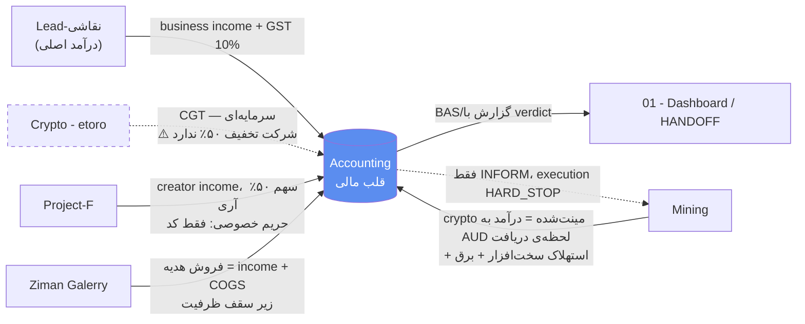

> ⚠️ دو قید مقدم: (۱) طبق [[04 - Architect System/architect/ARCHITECT_CHARTER|ARCHITECT_CHARTER]] §Security Gate الان **بسته** است → همه‌ی ایجنت‌ها read-only. (۲) همه‌ی قواعد مالیاتی `[Unverified — accountant to confirm]`. ایجنت هرگز lodge/پرداخت نمی‌کند.

# نقشه‌راه اجرایی — Accounting به‌عنوان قلبِ مالیِ اکوسیستم

Accounting = **tenant #1**؛ لایه‌ای که درآمد **همه‌ی** پروژه‌های دیگر در آن تجمیع و برای ATO آماده می‌شود. این سند مرحله‌مرحله، عملی و متصل به بقیه‌ی پروژه‌هاست.

---

## ۱. واقعیت حاکمیتی که همه‌چیز را قید می‌زند (اتصال به `architect`)

قبل از هر قدم حسابداری، این چهار قید از لایه‌ی مادر جاری‌اند:

| قید | منبع | اثر روی Accounting |
|---|---|---|
| **§Security Gate بسته** (۴ ردیف CRITICAL باز: Monero seed، Bybit، OKX، Anthropic) | [[ROTATION_CHECKLIST]] + CHARTER §2 | تا باز شدن گیت، Accounting فقط **draft** می‌سازد؛ هیچ نوشتن/ارسال خودکار |
| **Human-verdict (D-01)** | CHARTER §1 | نرم‌افزار فقط پیشنهاد می‌دهد؛ تأیید در تلگرام؛ timeout = **DENY** |
| **Budget (D-25)** | CHARTER §5 | اشتراک فلت Cowork (~AU$300/ماه) کارِ سنگین؛ بات‌های متری **hard-stop AU$30/ماه**. برآورد API حسابداری (~$۵–۱۵) داخل این سقف جا می‌شود ✅ |
| **Anchor Ledger + Kill-switch** | CHARTER §4 | هر verdict/ثبت = لاگ append-only؛ در ابهام، fail-closed |

**نتیجه‌ی عملی:** فاز ۰ اصلاً کار حسابداری نیست — بازکردن گیت است. تا آن‌موقع فقط کارهای read-only/draft (فاز ۱) مجازند.

---

## ۲. نقشه‌ی جریان پول (اتصال به بقیه‌ی پروژه‌ها)

| پروژه | نوع درآمد | رفتار ATO `[Unverified]` | نکته‌ی اتصال |
|---|---|---|---|
| **Lead-نقاشی** | درآمد نقاشی/renovation | business income + GST ۱۰٪ | منبع اصلی؛ لید→quote→کار→فاکتور→دفتر |
| **Mining** | کریپتوی استخراج‌شده | **درآمد کسب‌وکار** به ارزش AUD **در لحظه‌ی دریافت** + استهلاک rig/پنل (IAWO $20k) + برق | financial execution **HARD_STOP (D-10)** — Accounting فقط ثبت می‌کند، نه اجرا |
| **Crypto - etoro** | معاملات eToro/Bybit/OKX | **CGT** (سرمایه‌ای) — ⚠️ **شرکت‌ها تخفیف ۵۰٪ CGT ندارند** | احتمالاً باید **شخصی** بماند نه داخل Pty Ltd؛ کلیدها off-box (D-11) |
| **Project-F** | درآمد creator | income؛ فقط **سهم ۵۰٪** آری؛ آستانه‌ی GST جدا | حریم خصوصی CHARTER §6: در دفتر/گزارش فقط «Project-F»، بدون نام پلتفرم/پارتنر |
| **Ziman Galerry** | فروش هدیه | income + COGS | زیر **سقف ظرفیت** (D4) — درآمد فراتر از ظرفیت معنی ندارد |

**سؤال ساختاریِ بزرگ برای حسابدار:** آیا همه‌ی این‌ها زیر **یک** Pty Ltd می‌روند یا **جدا**؟ ماینینگ + نقاشی + Project-F زیر یک شرکت = ریسک مسئولیت و آبروییِ درهم‌تنیده. این تصمیم، ساختار کل دفاتر را عوض می‌کند → **قبل از هر چیز با حسابدار حل شود.**

---

## ۳. مرحله‌مرحله (Phased Rollout)

### فاز ۰ — رفع انسداد (فقط مالک) · گیت مشترک کل اکوسیستم
هدف: باز کردن §Security Gate. این قدم مالِ Accounting نیست، ولی **پیش‌نیاز هر خودکارسازی** است.
1. چرخش ۴ ردیف **CRITICAL**: Monero seed (مشترک با Mining)، Bybit + OKX (مشترک با Crypto)، Anthropic keys (مشترک با Lead + Mining + Crypto).
2. ستون وضعیت در [[ROTATION_CHECKLIST]] → `ROTATED`.
3. آری با verdict صریح، گیت را برمی‌دارد (ثبت در Anchor Ledger).
> تا این‌جا Accounting فقط read-only است. **هیچ importer/monitor خودکار روشن نمی‌شود.**

### فاز ۱ — تمیزکاری هسته (بی‌خطر · همین حالا در حالت draft قابل انجام)
1. **باگ GST** را در `1/bot.js` + `1/database.js` درست کن: مبلغِ GST-inclusive ⟵ `GST = total/11` (نه `amount*0.10`). خارجی/بهره/حقوق ⟵ `0`.
2. **جداسازی حساب شخصی/بیزنس** (مالک) — بزرگ‌ترین پرچم قرمز ممیزی.
3. **انتخاب Registered Tax Agent** (بلاکر مالک؛ بدون او هیچ قاعده تأیید نمی‌شود).
4. **ANZ CSV importer** بساز: dedup روی ستون **ID**، مغایرت‌گیری با **Closing Balance**؛ خروجی = draft به `00 - Inbox` برای verdict.
5. **قطع MYOB** — فقط Xero (در داده هر دو شارژ شده‌اند).
6. **Associates Registry** بساز (Armin، Maliheh، Sume Asadi، Behzad) → پایه‌ی تشخیص Div 7A.
> اتصال به vault: هر رسید/CSV اول به `00 - Inbox` می‌رود (قانون Inbox-اولِ `_PROJECT_INSTRUCTIONS` §۳).

### فاز ۲ — اتصال جریان‌های درآمد (سیم‌کشی cross-project)
1. یک **Chart of Accounts مشترک** بساز که هر پروژه یک دسته‌ی درآمد + رفتار مالیاتیِ خودش دارد (جدول بخش ۲).
2. در هر `PROJECT.md` خواهر یک «tax touchpoint» تعریف کن: هنگام درآمد، یک خط append در لاگ همان پروژه + ارجاع به Accounting.
3. رفتار ویژه‌ی هر جریان را قفل کن: Mining (ارزش لحظه‌ی دریافت)، Crypto (CGT شخصی)، Project-F (privacy + ۵۰٪).
> هیچ‌کدام قبل از پاسخِ «یک شرکت یا چند شرکت؟» نهایی نمی‌شود.

### فاز ۳ — Compliance Monitor + گزارش (بعد از باز شدن گیت)
1. اسکن ماهانه: **Div 7A drawings، پرداخت بدون ABN (>$75)، تراکنش >$10k، BAS due**.
2. گزارش ماهانه‌ی P&L/BAS → با **verdict** به `01 - Dashboard/HANDOFF` و هشدار تلگرام از طریق **Chief Orchestrator** (CHARTER §1).
3. هر ثبت خودکار = ورودی **Anchor Ledger** + احترام به kill-switch؛ داخل بودجه‌ی **AU$30/ماه**.

### فاز ۴ — داشبورد مالیِ یکپارچه‌ی اکوسیستم
1. **P&L تجمیعی** همه‌ی جریان‌ها در `01 - Dashboard` (نقاشی + ماینینگ + Project-F + Ziman؛ کریپتوی شخصی جدا).
2. گزارش ماهانه‌ی «سلامت مالیِ اکوسیستم» به‌عنوان ورودی تصمیم architect.

---

## ۴. مالک در برابر ایجنت (به‌خاطر Human-verdict)

| فقط مالک (آری) | ایجنت مجاز است (بعد از گیت) | ایجنت هرگز |
|---|---|---|
| چرخش secretها، برداشتن گیت | استخراج/دسته‌بندی draft، تولید گزارش | lodge به ATO/ASIC |
| انتخاب حسابدار، تصمیم ساختار شرکت | اسکن انطباق، پیشنهاد دسته | پرداخت/جابه‌جایی پول |
| هر verdict نهایی، هر پرداخت | append به لاگ پروژه، به‌روزرسانی HANDOFF | تغییر CHARTER/مجوزها |

---

## ۵. قدم‌های همین هفته (concrete)

1. **مالک:** چرخش ۴ CRITICAL → گیت باز شود (کل اکوسیستم را unblock می‌کند، نه فقط Accounting).
2. **مالک:** انتخاب حسابدار + طرح سؤال «**یک Pty Ltd یا چند شرکت** برای نقاشی/ماینینگ/Project-F؟».
3. **من (در جلسه‌ی Cowork، مجاز):** باگ GST را کد کنم + اسکلت **ANZ CSV importer** (dedup+reconciliation) را به‌صورت draft بسازم — بدون روشن‌کردن هیچ اتوماسیونِ نوشتنی تا گیت باز شود.

---

## ۶. اتصال به قواعد vault (چک‌لیست انطباق نوت)

- رسید/ورودی → **`00 - Inbox` اول**، بعد بایگانی طبق درخت تصمیم.
- هر ثبت = **append تاریخ‌دار** در لاگ پروژه (هرگز بازنویسی مخرب).
- پایان جلسه: به‌روزرسانی **Active Context/Progress** + **[[01 - Dashboard/HANDOFF|HANDOFF]]** + یک ورودی لاگ.
- frontmatter طبق **Property Schema**؛ کلید جدید اختراع نکن.
- اعتبارسنجی: `validate_frontmatter.py` و `find_broken_links.py` (dry-run) قبل از «تمام».

---

## نوت‌های مرتبط

- [[03 - Projects/Accounting/PROJECT|PROJECT — Accounting]] · [[03 - Projects/Accounting/docs/Tax-and-Loan-Guide|راهنمای مالیات و وام]] · [[03 - Projects/Accounting/docs/Agent-Architecture-and-Research-Prompt|معماری ایجنت + پرامپت تحقیقاتی]]
- حاکمیت: [[04 - Architect System/architect/ARCHITECT_CHARTER|ARCHITECT_CHARTER]] · [[ROTATION_CHECKLIST|ROTATION_CHECKLIST]]
- پروژه‌های متصل: [[03 - Projects/Lead-نقاشی/PROJECT|Lead-نقاشی]] · [[03 - Projects/Mining/PROJECT|Mining]] · [[03 - Projects/Crypto - etoro/PROJECT|Crypto - etoro]] · [[03 - Projects/اونلی فنز/PROJECT|Project-F]] · [[03 - Projects/Ziman Galerry/PROJECT|Ziman Galerry]]
- ایندکس: [[03 - Projects/_Index - Projects|ایندکس پروژه‌ها]]

## مرتبط

<!-- Tier A · CONNECTIONS-MAP (_memory) · اعمال 2026-07-04 -->
- [[06 - Architecture Maps/ECOSYSTEM|ECOSYSTEM]]
- [[06 - Architecture Maps/Property Schema|Property Schema]]
- [[03 - Projects/Crypto - etoro/Crypto - etoro|Crypto - etoro]]
- [[03 - Projects/Lead-نقاشی/Lead-نقاشی|Lead-نقاشی]]
