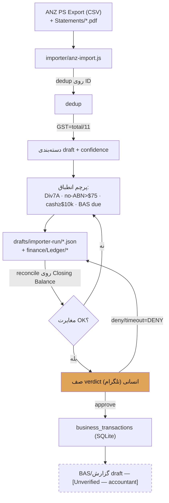

# 02 · Data Flow & Lineage

> از سند بانکی خام تا BAS draft — هر مرحله draft/[Unverified] تا verdict.

## جریان اصلی (bank → draft ledger → verdict)

## جریان پول cross-project (اتصال به Octopus)
منبع: [[../docs/Ecosystem-Rollout-Plan|Ecosystem-Rollout-Plan §2]] + [[../contracts/adapter|adapter.yaml]].

| پروژه | رویداد trigger | ثبت در دفتر Accounting |
|---|---|---|
| Lead-نقاشی | فاکتور/دریافت | business income + GST ۱۰٪ (منبع اصلی) |
| Mining | کوین مینت‌شده | درآمد به AUD لحظهٔ دریافت + استهلاک + برق — **INFORM only، HARD_STOP** |
| Crypto-eToro | معامله بسته‌شد | رویداد CGT (شخصی، نه Pty Ltd — منتظر تصمیم ساختاری) |
| Project-F | credit پلتفرم | creator income، فقط سهم ۵۰٪ آری، کد «Project-F» (حریم خصوصی) |
| Ziman | فروش هدیه | income + COGS |

## وضعیت داده (شواهد واقعی)
- `finance/Ledger/reconciliation-meta-2026-07-13.json`: **۵ statement** ANZ، **۳۱۶ tx یکتا**، پیوستگی چند بازه `null` (gap دار) — یعنی export کامل نیست.
- کشف کلیدی (`finance/README`): نام حساب = «MASTER PAINTING AND MAINTENANCE AND DESIGN **PTY LTD**» → شاهدِ بانکی برای سؤال ساختار (C3/A1).
- `data/حساب کتاب/*.xlsx`: ۶ شیت خام خانواده/associate (PII).

## نقاط رخنهٔ داده (data gaps)
1. export ANZ ناقص (فقط ۵ statement، بازه‌های missing) → دفتر کامل نیست.
2. صفر رسید واقعی (۴ عکس = اسکرین‌شات، قرنطینه).
3. واگرایی نسخهٔ ledger/transactions → [[../finance/_RECONCILE-ledger-variants/README-RECONCILE|RECONCILE]].

## قواعد lineage (قفل)
هر عدد باید **برنامه‌ای و قابل بازتولید** باشد · `_events/*.jsonl` **append-only** (هرگز ویرایش نشود) · dedup روی `txn_id`/`ID`.
