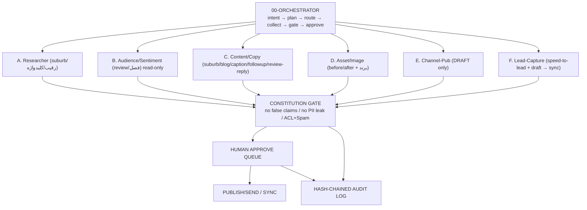

# BLUEPRINT — Brushline

> معماریِ مفهومی و تصمیم‌های load-bearing. نقطهٔ ورودِ معماری؛ جزئیات در KBها. (نام: Brushline؛ معماری: reuse از LANGAR.)

---

## ۰. خلاصهٔ اجرایی
Brushline سیستمِ چندایجنتیِ marketing/lead-gen برای نقاشیِ ساختمان (داخلی/بیرونی) در سیدنی است که محتوا/پاسخ/follow-up را **draft** می‌کند و به ServiceM8/Tradify وصل می‌شود — بدونِ بازسازیِ آن‌ها. از LANGAR (خواهر) reuse می‌کند، نه از صفر.

## ۱. قاب‌بندی
- **Problem:** نقاشِ سیدنی به lead نیاز دارد؛ owned channel ندارد؛ پل‌های اجاره‌ای (hipages) گران و shared؛ follow-up/review/پاسخ دستی و کند.
- **Goal:** دستیارِ چندایجنتیِ ارزان که owned channel بسازد، draft بدهد، review/follow-up مدیریت کند، و به job-management وصل شود.
- **Constraints:** ارزان؛ دست‌بخوردهٔ AI (سرچ+sentiment+تولید)؛ قانونِ AU؛ integrate با ابزارِ trade.
- **Assumptions:** کسب‌وکارِ نقاشیِ سیدنی، residential + strata/PM، ABN دارد.
- **Risks:** runaway spend؛ نقضِ Spam Act/ACL؛ ban سوشال؛ privacy دادهٔ مشتری؛ تله‌ی زمینِ اجاره‌ای.

## ۲. تصمیم‌های load-bearing (قفل)
۱. خواهرِ LANGAR (reuse)، نه از صفر. ۲. `draft → human approval → publish/send`. ۳. owned-first؛ rented فقط پل. ۴. integrate, don't duplicate (ServiceM8/Tradify). ۵. هزینهٔ Brushline core ~AUD ۱۵–۶۵/ماه (جدا از trade subscription و Ads).

## ۳. معماری (00-Orchestrator)

## ۴. Governance-Risk (غیرقابل‌حذف)
۱. Kill switch. ۲. per-action/per-day spend cap. ۳. hash-chained audit. ۴. constitution-gate (no false claims — ACL). ۵. Spam Act guard (consent، sender-ID/ABN، unsubscribe، no cold DM/auto-post). ۶. پیامِ اولِ مشتری human-approved. ۷. دادهٔ حساس در AU، نه LANGAR.

سه Invariant: INV-1 (no publish/spend/پیام بدونِ approval) · INV-2 (PII/مالی هرگز در LANGAR/memory) · INV-3 (auto-execution = kill switch + spend cap + audit).

## ۵. مدل‌ها و هزینه (KB-02)
cheap-first router: ~۹۰٪ Haiku، escalate به Sonnet برای کپیِ کلیدی. تصویر: tier ارزان (enhancement). جدولِ کاملِ AUD↔credit در CONFIG/KB-02 (config-محور، نه hard-code).

## ۶. قدم بعدی
ROADMAP برای فازبندی؛ PROJECT_MANIFEST برای فهرست؛ شروعِ فاز ۰ پس از گیتِ آمادگی.
