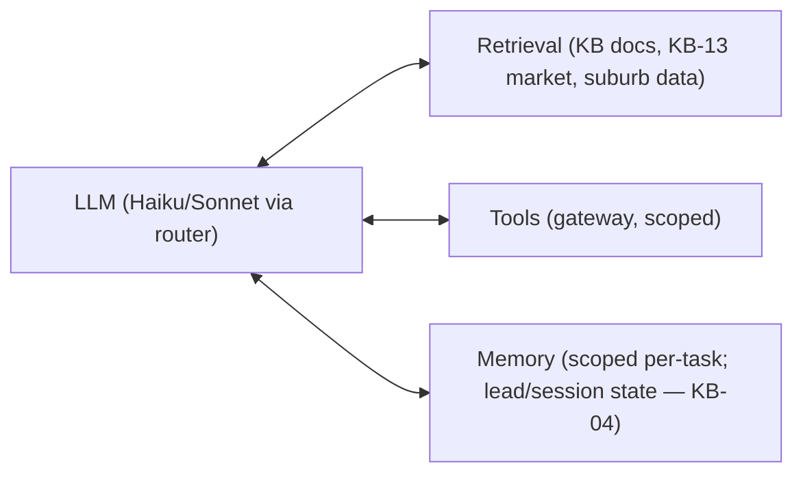
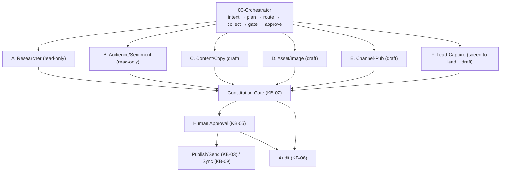
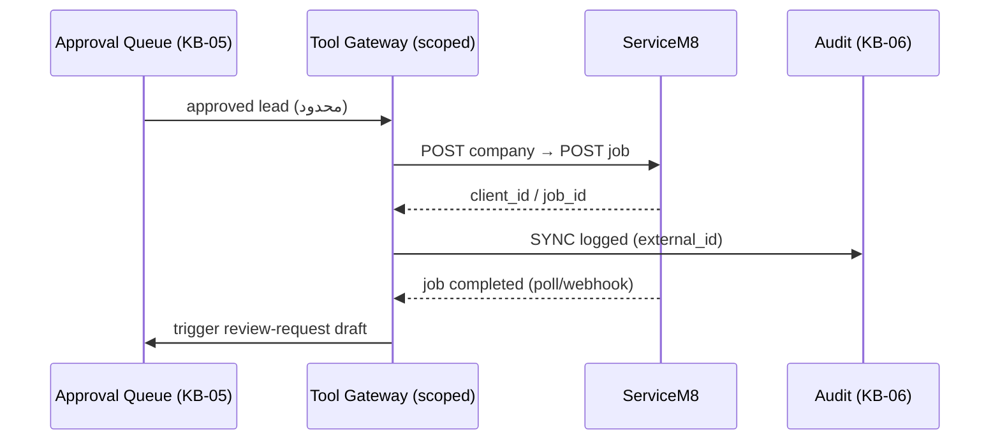

# KB-01 — Architecture, Tool Registry & Integration

> WP-A. معماریِ workflow-driven برای Brushline؛ پنج الگوی Anthropic؛ Augmented-LLM؛ Tool Registry در هفت namespace؛ و integration با ServiceM8/Tradify بر اصلِ «integrate, don't duplicate».
> اصلِ طلایی (Anthropic): تا وقتی workflow کافی است، agent نساز. MVP = مسیرِ کدِ ثابت، نه تصمیمِ آزادِ LLM.

---

## ۰. خلاصهٔ سریع

Brushline یک سیستمِ **augmented-LLM + workflow** است: یک 00-Orchestrator کارها را به Workers A–F می‌فرستد، خروجی از Constitution Gate و Human Approval رد می‌شود، و کنش‌های بیرونی فقط از یک tool-gateway با scope محدود اجرا می‌شوند. ابزارها کم و high-impact‌اند، در هفت namespace، و هرکدام مرزِ INV-2 را رعایت می‌کنند.

---

## ۱. هدف
تثبیتِ ستونِ معماری تا KBهای دیگر روی آن بنشینند: الگوها، بلوکِ پایه، رجیستریِ ابزار، و مرزِ integration.

---

## ۲. بلوکِ پایه — Augmented LLM

---

## ۳. پنج الگوی Anthropic → نگاشتِ Brushline

| الگو | کاربردِ Brushline |
|---|---|
| Prompt Chaining | research → copy → asset (تولید suburb page به‌صورت توالیِ ثابت) |
| Routing | cheap-first: ساده→Haiku، کلیدی→Sonnet (نقشه در CONFIG) |
| Parallelization | فقط محتوای conversion-critical (مثلِ quote follow-up مهم) با voting |
| Orchestrator-Workers | «کمپین ماهانه بچین» → تقسیمِ داینامیکِ subtask به A–F |
| Evaluator-Optimizer | **همان Constitution Gate (KB-07)**؛ نقد→بازنویسی تا pass (بدونِ duplication) |

---

## ۴. Tool Registry — هفت namespace

اصول (Anthropic «Writing effective tools»): کم و high-impact؛ `search_x`/`do_x` نه `list_all`؛ namespacing؛ `response_format` enum (concise/detailed)؛ توضیحِ هر tool با مثال و edge case؛ pagination/truncation روی پاسخِ بزرگ.

| namespace | نمونه | mode | مرز |
|---|---|---|---|
| `research_*` | search_suburb, search_competitor, search_keyword_intent, search_market_pricing | read-only | خروجی برچسب‌دار (منبع/تخمین) |
| `content_*` | draft_suburb_page, draft_caption, draft_followup, draft_review_response, draft_gbp_post, draft_capital_works_assessment | draft-only | no auto-publish |
| `compliance_*` | check_acl_claims, check_spam_consent, check_sender_id, check_privacy_leak, check_data_sovereignty | gate | block/flag (KB-07) |
| `approval_*` | submit_for_approval, get_approval_status, record_approval_decision | HITL | INV-1 |
| `sync_*` | sync_lead_to_servicem8, sync_lead_to_tradify, get_job_status | integration | فقط فیلدِ محدود (INV-2) |
| `audit_*` | append_entry, verify_chain, query | append-only | hash chain (KB-06) |
| `gov_*` | kill_switch, get_spend_status | governance | INV-3 |

> هر tool از یک **gateway** عبور می‌کند (اصلِ ۴ حاکمیتی): scoped key، no anonymous reach، اجرای ابزار در sandbox.

---

## ۵. Integration — ServiceM8 / Tradify

| محور | ServiceM8 | Tradify |
|---|---|---|
| auth (MVP) | Private App / API-Key (`X-API-Key`) | اغلب via Zapier/Make |
| auth (بعداً) | OAuth 2.0 (multi-tenant) | — |
| scopeهای لازم | read/manage_customers, create/read_jobs, read_feedback | معادل |
| pricing | AUD $0/29/79/149/349 (per-job) | ~$48/user (per-user) |
| lock-in | بالا → mitigation: Brushline دادهٔ خودش را نگه دارد | بالا |

**Brushline می‌فرستد:** name، phone، (email با consent)، suburb، service_type، source_channel، consent_status، notes.
**هرگز نمی‌فرستد:** دادهٔ مالیِ حساس، PII فراتر از نیاز، محتوای draft.
**می‌خواند:** job status، completion date، feedback (برای trigger و sentiment).

---

## ۶. نگاشتِ حاکمیتی (۷ اصل)
budget→`gov_*`+CONFIG cap؛ HITL→`approval_*`؛ observability→`audit_*`+tracing؛ tool-gateway→§۴/۵؛ no-SPOF→separation A–F + Gate + Human؛ counter-leverage→orchestrator/worker + override انسانی؛ eval→KB-08 روی toolها.

## ۷. قواعدِ سخت
۱. agent خودمختار در MVP نه؛ workflow ثابت. ۲. هر کنشِ بیرونی از gateway scoped. ۳. هیچ tool مستقیم publish/send/sync بدونِ Approval. ۴. Gate ≡ Evaluator-Optimizer (یکی، نه دوتا).

## ۸. قدم بعدی
CONFIG (routing map، caps) → WP-G1؛ KB-03/KB-09 روی این registry. DoD: ✅ ۷ namespace، ✅ مرزِ داده، ✅ نگاشتِ ۷ اصل، ✅ بدونِ کد.
