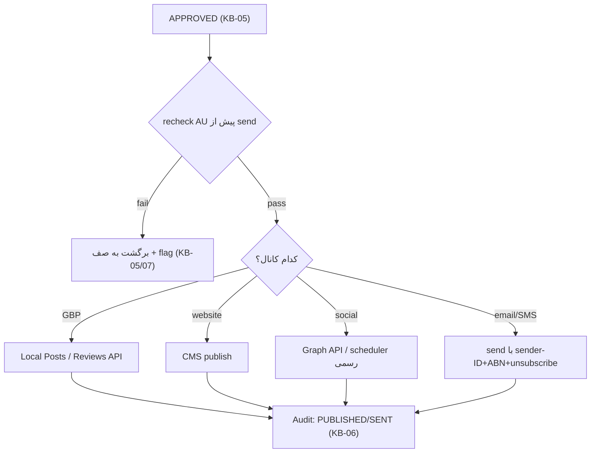

# KB-03 — Publishing & AU Governance

> WP-B. مسیرِ امنِ انتشار/ارسال **پس از** approval، با AU compliance دومرحله‌ای (Gate در KB-07 + recheck پیش از send). کانال‌ها: GBP، website، social، email/SMS.
> اصل: publish لایهٔ اجراست، نه تصمیم. هیچ‌چیز بدونِ human approval بیرون نمی‌رود (INV-1).

---

## ۰. خلاصهٔ سریع

پس از APPROVED در صف، KB-03 محتوا را به کانالِ درست می‌فرستد و **بلافاصله قبل از send یک recheckِ AU** (sender-ID/ABN، unsubscribe، consent، no-false-claim) اجرا می‌کند (defense-in-depth). GBP و email/SMS بیشترین ریسکِ قانونی را دارند؛ social فقط via API رسمی (نه bot غیررسمی).

---

## ۱. هدف
تعریفِ «چطور و کجا» منتشر می‌شود، با کمترین ریسکِ Spam Act/ACL و کمترین vendor lock-in.

---

## ۲. کانال‌ها × قواعد (ground‌شده)

| کانال | مسیرِ فنی | قاعدهٔ AU | lock-in / alt |
|---|---|---|---|
| **GBP** | Local Posts API (create/recurring) + Reviews reply API. **Q&A API از نوامبر ۲۰۲۵ حذف → دستی.** OAuth + تأییدِ Google. | ادعای ACL ممنوع؛ پاسخِ review مالکانه نه دفاعی | مستقیم API یا via Buffer/Make؛ lock-in کم |
| **Website (suburb pages)** | publish به CMS (WordPress / Astro/Next استاتیک) | no false claim؛ proof محلی واقعی | کم |
| **Social (IG/FB/LinkedIn)** | **فقط Instagram/Meta Graph API رسمی** یا scheduler رسمی | no activity-based/password-sharing bot (ban-risk) | Buffer (free/$5 per-channel)، Metricool (free/~€14)، Meta Business Suite (free) |
| **Email/SMS** | provider با sender-ID | **consent + sender ID/ABN + unsubscribe ۵-روزه + suppression** | متعدد؛ کم |

> social: همهٔ schedulerهای معتبر از Graph API رسمی استفاده می‌کنند؛ ابزارِ غیررسمی = خطرِ suppression اکانت. این دقیقاً همان «no password-sharing/activity-based» در اساسنامه است.

---

## ۳. جریانِ انتشار (دومرحله‌ای)

---

## ۴. قواعدِ سخت (AU)
۱. هیچ auto-post (INV-1)؛ social = draft + scheduler/دستی، نه bot.
۲. email/SMS فقط با consent؛ هر پیام sender-ID + ABN + unsubscribe ۵-روزه؛ opt-out → suppression فوری.
۳. هیچ ادعای دروغ/اثبات‌نشده (ACL) — recheck قبل از send.
۴. cold DM/email بدونِ consent = block.
۵. پاسخِ review: مثبت = تشکرِ شخصی؛ منفی = مالکیت + تعهد، بدونِ افشای PII.

## ۵. نگاشتِ حاکمیتی (۷ اصل)
budget→cap بر تعداد ارسال؛ HITL→منشأ از Approval؛ observability→هر send لاگ؛ tool-gateway→ارسال از gateway scoped؛ no-SPOF→Gate+recheck دولایه؛ counter-leverage→override انسانی؛ eval→نرخِ engagement/شکایت در KB-08.

## ۶. تعاملِ ماژول‌ها
KB-05 (منبعِ APPROVED) → KB-03 → KB-06 (لاگ). recheck از قواعدِ KB-07. consent/suppression از KB-09. پارامترها (unsubscribe window، sender template) در CONFIG.

## ۷. قدم بعدی
KB-09 برای consent/suppression؛ CONFIG برای sender template. DoD: ✅ هر کانال نگاشتِ AU + lock-in، ✅ recheck دومرحله‌ای، ✅ no-auto-post، ✅ بدونِ کد.
