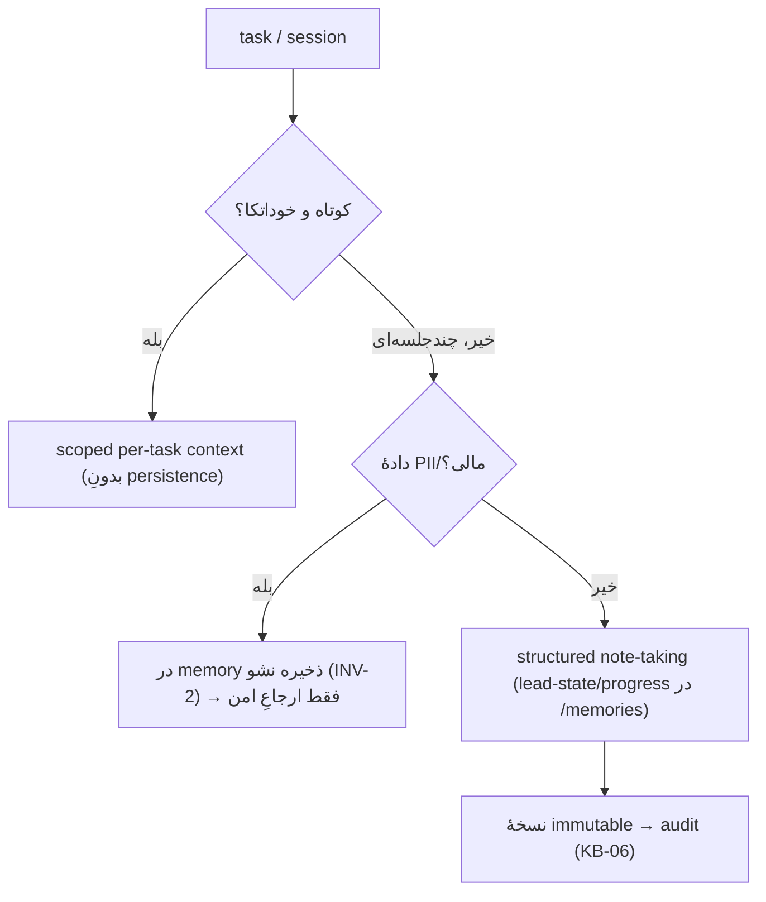

# KB-04 — Agent Memory

> WP-D. استراتژیِ memory که با INV-2 (هیچ PII در memory) و KB-06 (audit) سازگار است. گراند‌شده روی Anthropic memory tool و context-engineering.

---

## ۰. خلاصهٔ سریع

پیش‌فرضِ Brushline = **scoped per-task context** (نه memoryِ دائمی). persistence فقط برای lead-state و session-progress، با structured note-taking (الگوی NOTES.md). memory به‌صورتِ filesystem (`/memories`، با path-traversal protection). **هیچ PII/مالی در memory** (INV-2). چهار مسئلهٔ memory — scope/freshness/conflict/provenance — هرکدام یک قاعده دارند.

---

## ۱. هدف
حافظه‌ای که عاملِ drift و نشت نشود؛ فقط آن‌قدر که lead/کمپین را پیش ببرد.

---

## ۲. تصمیمِ scoped vs persistent

> یافتهٔ گراند‌شده: memory tool روی Messages API (GA)، filesystem metaphor، handler سمتِ client با path validation به `/memories`. Managed Agents Memory (beta): immutable memory versions = audit trail + point-in-time recovery، provenance per entry، conflict با `content_sha256` precondition.

---

## ۳. چهار مسئلهٔ memory → چهار قاعده

| مسئله | قاعدهٔ Brushline |
|---|---|
| **scope** | memory workspace/lead-scoped؛ نشت بین tenant/lead ممنوع |
| **freshness** | داده‌ها TTL/برچسبِ زمان دارند؛ بازارِ KB-13 ممکن است کهنه شود → verify |
| **conflict** | به‌روزرسانی با precondition (content hash)؛ آخرین تصحیحِ انسانی برنده |
| **provenance** | هر entry منشأ دارد (agent/human/tool)؛ بدونِ provenance، entry ground-truth فرض نشود (جلوگیری از poisoned memory) |

---

## ۴. چه چیزی در memory می‌رود / نمی‌رود

| می‌رود | نمی‌رود |
|---|---|
| lead-state (مرحله، service، suburb) | شمارهٔ کارت/بانک (INV-2) |
| session progress / NOTES | PII اضافیِ غیرضروری |
| تصحیحِ انسانیِ سبک (preference عملیاتی) | محتوای حساسِ مشتری در memoryِ مشترک |
| ارجاعِ امن (path/id) به دادهٔ حساس | خودِ دادهٔ حساس |

## ۵. pricing / lock-in
memory tool = استانداردِ توکن (بدونِ هزینهٔ اضافه) ولی ~۲٫۵K توکن سیستمِ tool؛ prompt caching mitigation. alt: Mem0 / supermemory (interface مشترک) → lock-in کم.

## ۶. نگاشتِ حاکمیتی (۷ اصل)
budget→توکنِ memory در cap؛ HITL→تصحیحِ انسانی بالاتر؛ observability→immutable versions قابلِ inspect؛ tool-gateway→نوشتن از handler امن؛ no-SPOF→memory منبعِ یکتای حقیقت نیست؛ counter-leverage→provenance/conflict؛ eval→کیفیتِ recall در KB-08.

## ۷. قواعدِ سخت
۱. PII/مالی هرگز در memory (INV-2). ۲. هر entry provenance دارد. ۳. تصحیحِ انسانی > memoryِ قبلی. ۴. memory ground-truth نیست؛ freshness/conflict چک شود.

## ۸. قدم بعدی
KB-06 (نسخه‌گذاریِ immutable)، KB-09 (lead-state)، CONFIG (TTL/scope). DoD: ✅ مرزِ PII، ✅ ۴ قاعده، ✅ نگاشتِ audit، ✅ بدونِ کد.
