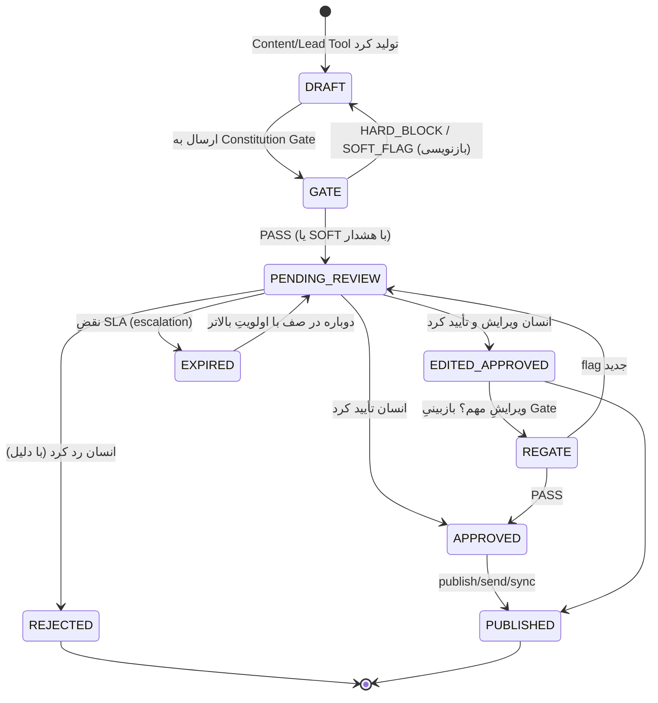
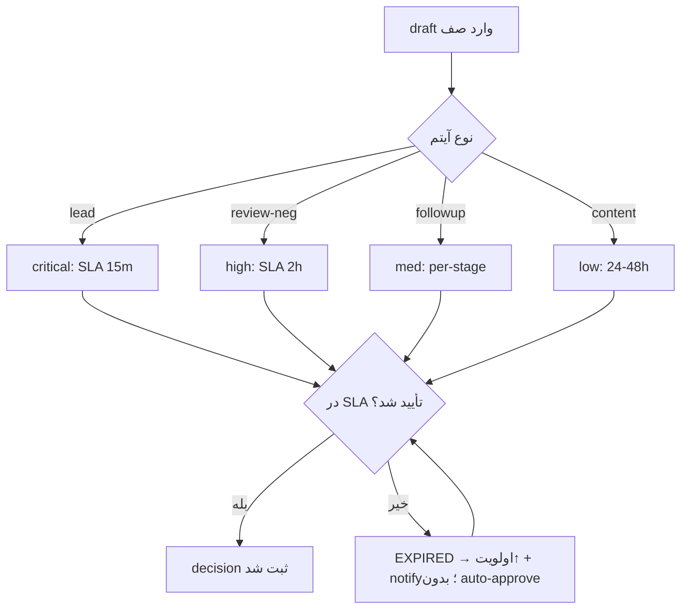
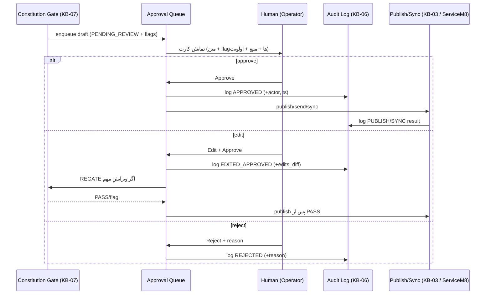

# KB-05 — Human Approval Queue (صف تأیید انسانی)

> هدف: منطق و رابطِ مفهومیِ صفِ بررسیِ انسانی؛ نمایشِ draftهای AI، عملیاتِ approve/edit/reject، اولویت‌بندی و SLA، و ثبتِ هر کنش برای Audit.
> جایگاه: مقصدِ draftهای عبورکرده از Constitution Gate (KB-07)؛ تنها نقطه‌ای که publish/send/sync از آن مجاز می‌شود (Invariant-1).
> اصل: human-in-the-loop **اجباری**. هیچ خروجی بدون تصمیمِ صریحِ انسانی به دنیا نمی‌رود.

---

## ۰. خلاصهٔ سریع

هر draft یک چرخهٔ حالت دارد: `DRAFT → PENDING_REVIEW → (APPROVED | EDITED_APPROVED | REJECTED)`. انسان سه کنش دارد: **تأیید**، **ویرایش (با ثبتِ diff)**، **رد (با دلیل)**. صف اولویت‌بندی و SLA دارد تا leadهای حساس‌به‌زمان (speed-to-lead) عقب نیفتند. هر کنش → Audit Log (KB-06).

---

## ۱. ماشینِ حالت (State Machine)

> نکتهٔ امنیتی: اگر ویرایشِ انسان «مهم» باشد (تغییرِ ادعا/متنِ تجاری)، draft دوباره از Gate رد می‌شود (`REGATE`) تا انسان نتواند سهواً یک ادعای ACL-ناقص را وارد کند. ویرایشِ جزئی (تایپی) نیاز به regate ندارد.

---

## ۲. کنش‌های انسانی و ثبت

| کنش | ورودی لازم | ثبت در Audit (KB-06) |
|---|---|---|
| **Approve** | تأییدِ صریح | `APPROVED` + actor + ts |
| **Edit + Approve** | متنِ جدید | `EDITED_APPROVED` + **edits_diff** (قبل/بعد) + actor |
| **Reject** | دلیلِ متنی | `REJECTED` + reason + actor |

هر سه، یک `APPROVAL_ACTION` می‌سازند که دقیقاً یک `AUDIT_ENTRY` می‌نویسد (رابطهٔ ۱:۱ در ER، KB-00 §۴).

---

## ۳. اولویت‌بندی و SLA

اقلامِ صف یک‌جور نیستند؛ speed-to-lead «نقطهٔ مرگ یا زندگی» است (KB-13 §۴).

| نوع آیتم | اولویت | SLA پیشنهادی | منطق |
|---|---|---|---|
| lead follow-up (speed-to-lead) | **بحرانی** | < ۱۵ دقیقه | پاسخِ زیر ۲۴ساعت = برندهٔ کار؛ هرچه سریع‌تر بهتر |
| پاسخ به review منفی | بالا | < ۲ ساعت | مدیریتِ شهرت |
| quote follow-up روز ۲/۵/۱۰ | متوسط | < روزِ همان مرحله | زمان‌بندیِ از پیش‌تعیین‌شده |
| social caption / GBP post | پایین | < ۲۴ ساعت | غیر-فوری، batchable |
| suburb page / blog | پایین | < ۴۸ ساعت | محتوای پایه |

رفتارِ نقضِ SLA: آیتم `EXPIRED` می‌شود، اولویتش بالا می‌رود و notification به Operator. هرگز auto-approve با انقضای SLA (Invariant-1 شکسته نمی‌شود).

---

## ۴. گردشِ کارِ Human ↔ AI

---

## ۵. رابطِ مفهومیِ کارتِ صف (UI، بدون پیاده‌سازی)

هر آیتمِ صف یک «کارت» است که نشان می‌دهد:

- نوع draft (suburb page / caption / follow-up / review response / lead-sync / capital-works assessment)
- متنِ کامل (با قابلیتِ ویرایشِ inline)
- **flagهای Gate** (ACL/Spam/Privacy) به‌صورت برجسته با دلیل
- منبع/راوی (کدام agent، با چه intent)
- اولویت + تایمرِ SLA
- سه دکمه: Approve / Edit / Reject (+ فیلدِ دلیل برای reject)
- برای lead: پیش‌نمایشِ دادهٔ sync (name/phone/suburb/service/consent) قبل از ServiceM8

> اصلِ طراحی: انسان باید در «چند ثانیه» تصمیم بگیرد. flagها و دادهٔ کلیدی بالا؛ جزئیات قابل‌بازشدن. این مستقیماً گلوگاهِ مقیاس (KB-02 §۶: approval throughput) را کاهش می‌دهد.

---

## ۶. تعامل با سایر ماژول‌ها

| ماژول | رابطه |
|---|---|
| KB-07 Constitution Gate | تنها منبعِ ورودیِ صف؛ flagها از Gate می‌آیند؛ REGATE پس از ویرایشِ مهم |
| KB-01 Content/Lead Tools | تولیدکنندهٔ draft؛ پس از reject ممکن است دوباره تولید کند |
| KB-06 Audit Log | هر کنشِ صف یک AUDIT_ENTRY می‌نویسد (tamper-evident) |
| KB-03 Publishing | فقط پس از APPROVED اجرا می‌شود؛ AU checks دوباره |
| KB-09 Leads | sync به ServiceM8 فقط برای آیتمِ lead پس از approve + consent |

## ۷. قواعدِ سخت
۱. هیچ آیتم بدون تصمیمِ انسانی منتشر نمی‌شود (no auto-approve، حتی با SLA expiry).
۲. ویرایشِ مهم → REGATE.
۳. هر کنش (approve/edit/reject) با actor و ts و diff/reason ثبت می‌شود.
۴. پیش‌نمایشِ دادهٔ lead قبل از sync اجباری است (شفافیتِ Privacy).

## ۸. قدم بعدی
schema دقیقِ APPROVAL_ACTION → KB-06. تعریفِ آستانهٔ «ویرایشِ مهم» (config). متریکِ زمانِ approval برای KB-08.
