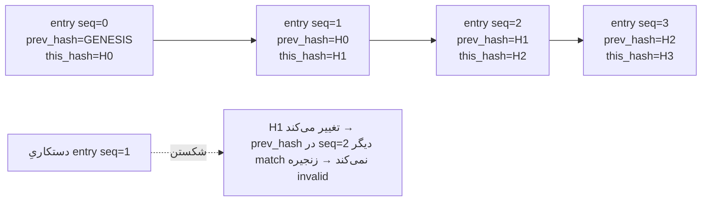
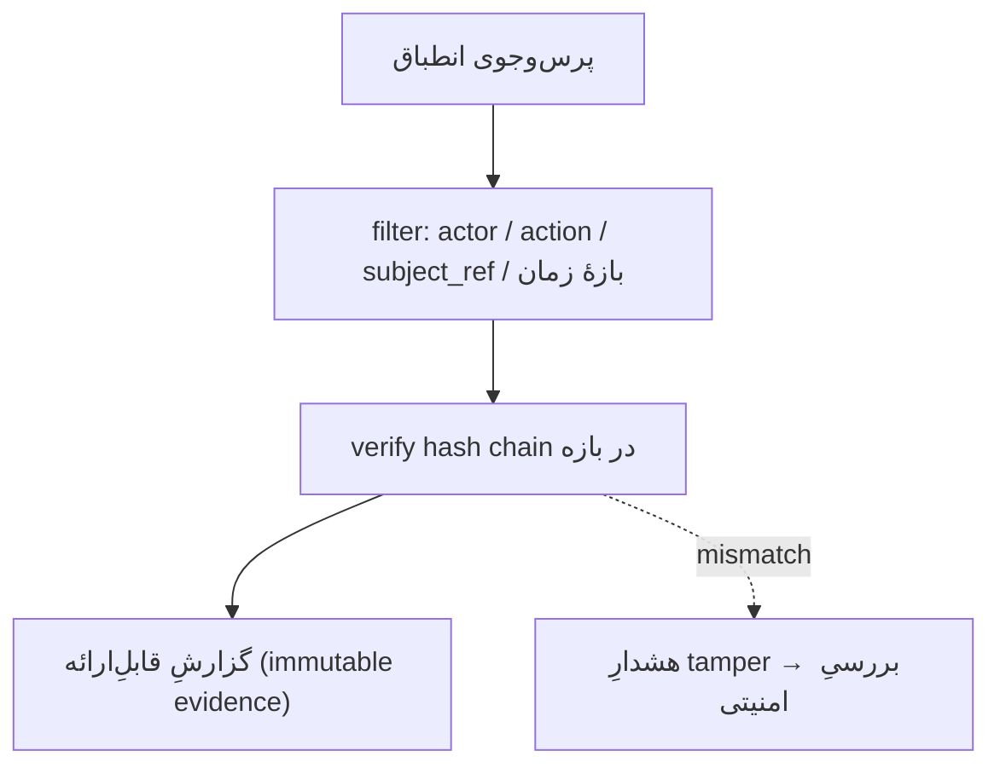
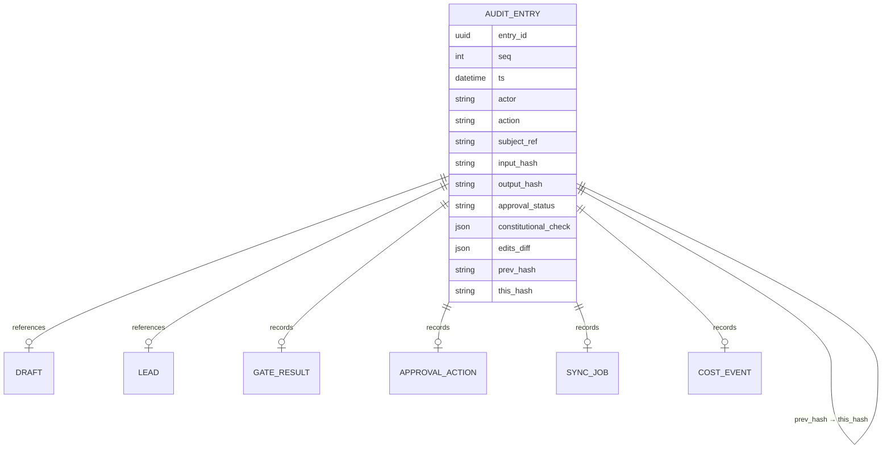
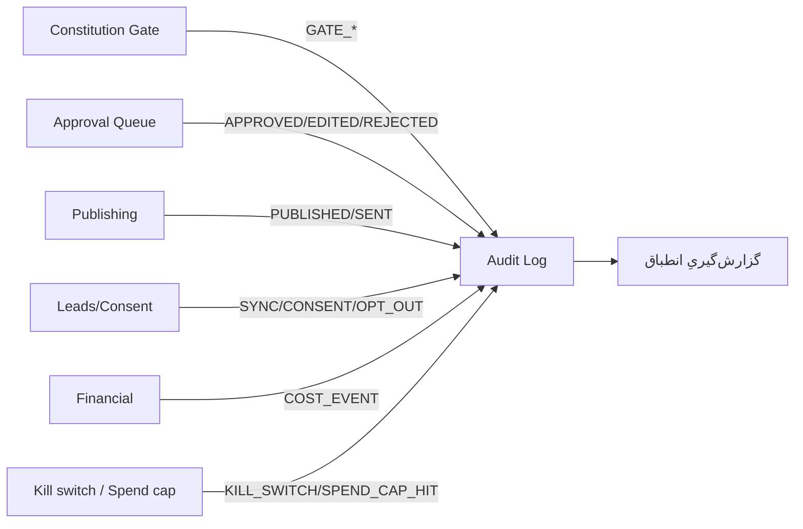

# KB-06 — Audit Log (لاگ ممیزیِ ضدِ دستکاری)

> هدف: ساختارِ داده برای ثبتِ هر تصمیمِ AI و هر اقدامِ انسانی به‌صورت tamper-evident؛ الزاماتِ ثبتِ تغییرناپذیر (hash chain / append-only)؛ و جست‌وجو/گزارش‌گیری برای اثباتِ انطباق در صورتِ شکایت.
> جایگاه: مقصدِ نهاییِ هر کنش از Gate (KB-07)، Queue (KB-05)، Sync (KB-09)، و COST_EVENTها (KB-02). یکی از سه invariant (hash-chained audit log).
> اصل: append-only. هیچ رکورد ویرایش/حذف نمی‌شود؛ فقط رکوردِ جدید اضافه می‌شود.

---

## ۰. خلاصهٔ سریع

هر رویدادِ معنادار یک `AUDIT_ENTRY` تغییرناپذیر می‌سازد که با hash به رکوردِ قبلی زنجیر می‌شود. هر دستکاریِ یک رکوردِ میانی، زنجیرهٔ hash را می‌شکند و قابل‌کشف می‌شود (tamper-evident). این لاگ، مدرکِ «human-approved بودن و رعایتِ ACL/Spam/Privacy» در صورتِ شکایتِ ACMA/OAIC/ACCC است.

---

## ۱. ساختارِ رکورد (schema مفهومی)

| فیلد | توضیح |
|---|---|
| `entry_id` | شناسهٔ یکتا (UUID) |
| `seq` | شمارهٔ ترتیبیِ افزایشی (append-only) |
| `ts` | timestamp دقیق (UTC + tz) |
| `actor` | `agent:<id>` یا `human:<user_id>` |
| `action` | نوعِ رویداد (جدول §۲) |
| `subject_ref` | ارجاع به draft_id / lead_id / sync_id / cost_id |
| `input_snapshot` | عکسِ ورودی (یا hash آن اگر حجیم/حساس) |
| `output_snapshot` | عکسِ خروجی (یا hash) |
| `approval_status` | pending / approved / edited_approved / rejected / n-a |
| `constitutional_check` | نتیجهٔ Gate: `{acl, spam, privacy, sender, sovereignty, level}` |
| `edits_diff` | برای کنشِ ویرایش: قبل/بعد |
| `prev_hash` | hash رکوردِ قبلی در زنجیره |
| `this_hash` | `hash(این رکورد بدونِ this_hash + prev_hash)` |

> دادهٔ حساس: برای فیلدهای حاوی PII/مالی، به‌جای متنِ خام، **hash + ارجاعِ امن** ذخیره شود (Invariant-2). لاگ باید integrity را اثبات کند، نه اینکه خودش به منبعِ نشت تبدیل شود.

---

## ۲. انواعِ رویدادِ ثبت‌شونده

| action | منبع | چه چیزی اثبات می‌کند |
|---|---|---|
| `TOOL_INPUT` | KB-01 | چه taskی با چه ورودی شروع شد |
| `GATE_PASS` / `GATE_REJECT` | KB-07 | بررسیِ انطباق انجام و نتیجه‌اش |
| `ENQUEUED` | KB-05 | draft به صفِ انسانی رفت |
| `APPROVED` / `EDITED_APPROVED` / `REJECTED` | KB-05 | تصمیمِ انسانی + actor + diff/reason |
| `PUBLISHED` / `SENT` | KB-03 | چه چیزی، کِی، کجا منتشر/ارسال شد |
| `SYNC` | KB-09 | چه دادهٔ leadی به ServiceM8/Tradify رفت |
| `CONSENT_CAPTURED` / `OPT_OUT` | KB-09 | رکوردِ consent (Spam Act دفاع) |
| `COST_EVENT` | KB-02 | مصرفِ توکن/API + هزینهٔ AUD |
| `KILL_SWITCH` / `SPEND_CAP_HIT` | governance | توقفِ اضطراری/سقفِ خرج |

---

## ۳. زنجیرهٔ hash (tamper-evidence)

**verification:** بازخوانیِ زنجیره از genesis؛ برای هر رکورد `this_hash` بازمحاسبه و با `prev_hash`ِ رکوردِ بعدی مقایسه می‌شود. اولین mismatch = نقطهٔ دستکاری.

> تقویتِ اختیاری (آینده): anchoring دوره‌ایِ آخرین hash در یک منبعِ مستقل (مثلاً امضای زمان‌دار) تا backdating کلِ زنجیره هم سخت شود. در MVP، hash chain + append-only storage کافی است.

---

## ۴. الزاماتِ تغییرناپذیری

| الزام | پیاده‌سازیِ مفهومی |
|---|---|
| append-only | هیچ UPDATE/DELETE؛ فقط INSERT |
| ترتیب | `seq` یکنواخت افزایشی، بدونِ gap |
| integrity | hash chain؛ verification دوره‌ای |
| دسترسی | write فقط از سرویس‌های مجاز؛ read برای گزارش |
| نگه‌داری (retention) | مطابق الزامِ consent/شکایت (Spam Act: نگه‌داریِ consent record) |

---

## ۵. جست‌وجو و گزارش‌گیریِ انطباق

سناریوهای واقعیِ کسب‌وکارِ نقاشیِ سیدنی:

| سناریو | پرس‌وجو | خروجی |
|---|---|---|
| شکایتِ Spam (ACMA) | همهٔ `SENT` به یک شماره/ایمیل + `CONSENT_CAPTURED`/`OPT_OUT` مرتبط | اثباتِ consent + sender-ID + احترام به opt-out |
| شکایتِ ACL (ادعای دروغ) | همهٔ `GATE_*` + `PUBLISHED` برای یک draft | اثباتِ اینکه ادعا از Gate رد شده و human-approved بوده |
| شکایتِ Privacy (OAIC) | همهٔ `SYNC`/`TOOL_INPUT` شاملِ یک lead_id | اثباتِ مرزِ داده و عدمِ نشت |
| ممیزیِ هزینه | تجمیعِ `COST_EVENT` در بازه | گزارشِ AUD per channel/model (ورودی KB-02/KB-08) |

---

## ۶. مدلِ داده و رابطه با ماژول‌ها (Component/ER)

---

## ۷. قواعدِ سخت
۱. append-only؛ هیچ ویرایش/حذف.
۲. هر کنشِ بیرونی (publish/send/sync/spend) **باید** قبل از اجرا/در لحظهٔ اجرا لاگ شود.
۳. PII/مالی فقط به‌صورت hash/ارجاعِ امن.
۴. verification زنجیره دوره‌ای؛ mismatch = هشدار.
۵. retention مطابق الزامِ Spam Act/شکایت.

## ۸. قدم بعدی
تعریفِ تابعِ hash و فرمتِ canonical رکورد (config). اتصال COST_EVENT به KB-02 و KB-08. تستِ tamper-evidence (DoD فاز ۳ در ROADMAP).
