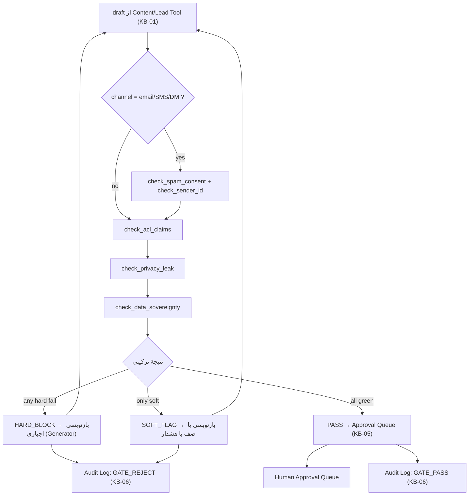
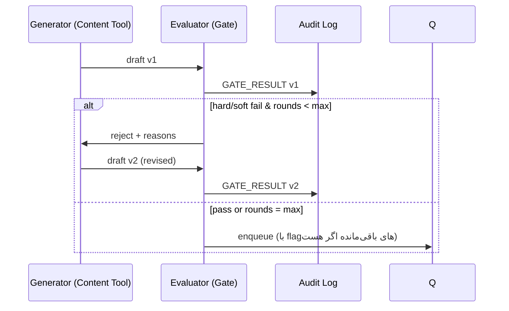

# KB-07 — Constitution Gate (دروازهٔ انطباق و اساسنامه)

> هدف: قواعد اکتشافی (heuristics) و checkpointهایی که هر خروجیِ AI را پیش از رسیدن به انسان/کانال بررسی می‌کنند تا با قوانین استرالیا (ACL، Spam Act 2003، Privacy Act/APP 7) و اساسنامهٔ پروژه سازگار بمانند.
> جایگاه: بین Content/Lead Tools (KB-01) و Human Approval Queue (KB-05). معادلِ الگوی Evaluator-Optimizer در KB-01 §۲.۵.
> اصل: Gate رد می‌کند یا flag می‌زند؛ **هرگز خودش publish/send نمی‌کند**. تأیید نهایی همیشه انسانی است (Invariant-1).

---

## ۰. خلاصهٔ سریع

Gate چهار خانوادهٔ بررسی دارد که روی هر draft اجرا می‌شوند: **ACL (no false claims)**، **Spam Act (consent + sender-ID + unsubscribe)**، **Privacy/APP 7 (no PII leak)**، و **Data Sovereignty**. خروجیِ Gate یک `GATE_RESULT` است (pass / soft-flag / hard-block) که به Approval Queue و Audit Log می‌رود.

> Gate سخت‌گیر است: «صداقت قربانیِ ادب نمی‌شود». ادعای اثبات‌نشده، consent مبهم، یا PII در متن = block، حتی اگر کاربر اصرار کند.

---

## ۱. یافته‌های انطباقی (مبنای قواعد)

از KB-12 (به‌صورت فریم؛ ارقام جریمه «verify»):

- **ACL (Australian Consumer Law):** ادعای gمراه‌کننده/خلاف‌واقع ممنوع. «بهترین نقاش سیدنی»، «#1»، «warranty» بدون مدرکِ مشخص = ریسک قانونی.
- **Spam Act 2003:** هر email/SMS/IM/DM تجاری نیاز به consent دارد (express یا inferred در محدودهٔ رابطهٔ تجاریِ مرتبط)؛ هر پیام باید **sender ID + ABN** و **unsubscribe کارکردیِ ۵-روزه** داشته باشد. cold DM/email بدون consent = block.
- **Privacy Act / APP 7:** استفادهٔ direct marketing از دادهٔ شخصی نیاز به reasonable expectation/consent دارد؛ opt-out ساده الزامی. دادهٔ sensitive → consent صریح.
- **Data Sovereignty:** دادهٔ حساسِ مالی/شخصیِ مشتری نباید وارد ابزارهای عمومیِ AI یا LANGAR شود (Invariant-2)؛ ترجیحاً ذخیره در استرالیا.

---

## ۲. خانواده‌های بررسی (checkpoints)

این‌ها همان compliance toolهای KB-01 §ج هستند، اینجا با heuristic مشخص:

### ۲.۱ `check_acl_claims` — ادعای اثبات‌نشده
flag/block اگر draft شامل این الگوها بدون مدرکِ پیوست باشد:

| الگو | اقدام | اصلاحِ پیشنهادی |
|---|---|---|
| «best / #1 / number one / top-rated» (مطلق) | hard-block | تبدیل به ادعای قابل‌اثبات یا حذف |
| «guaranteed / warranty / lifetime» بدون شرطِ کتبیِ مشخص | hard-block | ارجاع به شرایط گارانتیِ واقعی |
| «cheapest / lowest price» | soft-flag | نیاز به مدرک؛ بازنویسی |
| «۱۰۰٪ / always / never» (مطلق‌های ریسکی) | soft-flag | تلطیف با واقعیت |
| testimonial بدون منبع/رضایت | soft-flag | فقط review واقعیِ منتشرشده |

### ۲.۲ `check_spam_consent` — رضایت بازاریابی
block اگر کانال = email/SMS/DM و یکی از این‌ها:

- consent record موجود نیست یا `opted_out = true` → **hard-block**
- پیام cold به آدرسِ بدونِ رابطهٔ تجاریِ مرتبط → **hard-block**
- پیام بدونِ `sender_id + ABN` → **hard-block** (نقص §۲.۳)
- پیام بدونِ unsubscribe کارکردی → **hard-block**

> توجه: follow-up به مشتریِ enquiry که خودش consent/داده داده، معمولاً در محدودهٔ رابطهٔ تجاری است → pass (با sender-ID/unsubscribe). پیامِ اولِ بدونِ تأیید به مشتری → block تا human approve.

### ۲.۳ `check_sender_id` — هویت فرستنده
هر پیامِ خروجی باید `[business name] + ABN` و راهِ unsubscribe داشته باشد. نبود = block. (config: قالبِ ثابتِ امضا با ABN.)

### ۲.۴ `check_privacy_leak` — نشت PII
block اگر خروجی شامل دادهٔ شخصیِ شناسایی‌کننده فراتر از نیاز باشد، یا دادهٔ مشتری در جایی غیرمجاز (مثلاً متنِ عمومیِ social) ظاهر شود. دادهٔ حساس مالی هرگز در draft عمومی.

### ۲.۵ `check_data_sovereignty` — مرزِ داده
block اگر مسیر، دادهٔ شخصی/حساسِ مشتری را به LANGAR یا ابزارِ عمومیِ خارج از مرزِ مجاز بفرستد.

---

## ۳. خروجیِ Gate و سطوح تصمیم

| سطح | معنی | مسیر |
|---|---|---|
| `PASS` | همهٔ checkها سبز | → Approval Queue (PENDING_REVIEW) |
| `SOFT_FLAG` | ریسکِ قابل‌اصلاح | → Generator برای بازنویسی، یا → Queue با هشدارِ برجسته |
| `HARD_BLOCK` | نقضِ قانونی/اساسنامه | → Generator (اجبار به اصلاح)؛ هرگز به کانال |

`GATE_RESULT` که ثبت می‌شود: `{ gate_id, draft_id, passed, checks{acl,spam,privacy,sender,sovereignty}, reason, level }` → به KB-06 (Audit) و KB-05 (Queue).

---

## ۴. فلوچارت تصمیم‌گیری

---

## ۵. حلقهٔ Evaluator-Optimizer

Gate یک حلقهٔ بستهٔ نقد→بازنویسی است؛ تعداد دورها محدود (مثلاً ۳) تا loop بی‌پایان رخ ندهد. بعد از سقفِ دور، draft با flagهای باقی‌مانده به صف می‌رود و انسان تصمیم می‌گیرد (هرگز auto-publish).

---

## ۶. تعامل با سایر ماژول‌ها

| ماژول | رابطه |
|---|---|
| KB-01 Content/Lead Tools | منبعِ draft؛ Gate بینِ tool و publish/send می‌نشیند |
| KB-05 Approval Queue | مقصدِ draftهای PASS/SOFT؛ flagها روی کارتِ صف نمایش داده می‌شوند |
| KB-06 Audit Log | هر GATE_RESULT (pass/flag/block) با snapshot ثبت می‌شود |
| KB-12 AU Compliance | منبعِ قواعد؛ Gate = اجراییِ KB-12 |
| KB-03 Publishing | پس از approval، KB-03 دوبارهٔ sender-ID/unsubscribe را قبل از send تأیید می‌کند (defense in depth) |
| KB-10 Prompt Library | promptهای C-series (Red-Team/Skeptic) منطقِ Gate را در سطحِ تولید هم تقویت می‌کنند |

---

## ۷. قواعدِ سخت (non-negotiable)

۱. Gate هرگز publish/send نمی‌کند.
۲. هیچ HARD_BLOCK با اصرارِ کاربر دور زده نمی‌شود؛ فقط با اصلاحِ محتوا.
۳. هر تصمیمِ Gate ثبت می‌شود (حتی pass) برای forensics.
۴. پیامِ اولِ بدونِ تأیید به مشتری = block.
۵. دادهٔ شخصی/حساس در مسیرِ عمومی = block.

## ۸. قدم بعدی
ورودی به KB-05 (نمایش flag روی کارت) و KB-06 (schema ثبت). تستِ پوششِ heuristic با promptهای C-series (KB-10) به‌عنوان red-team set.
