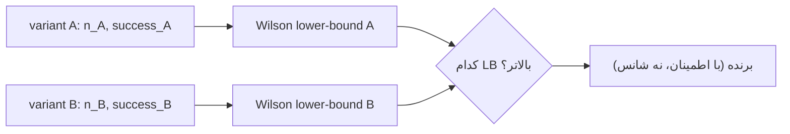
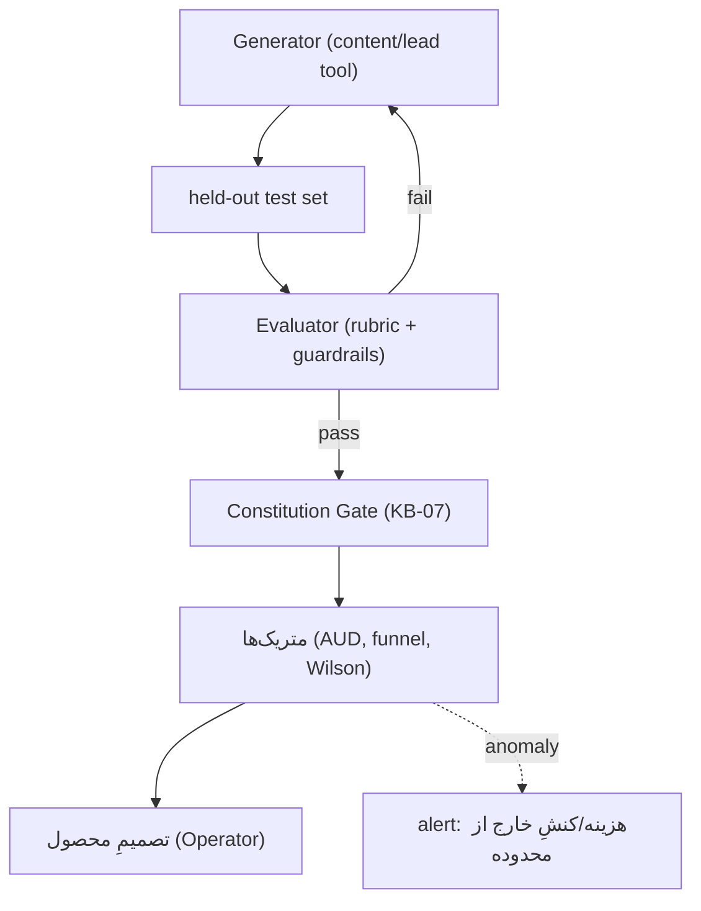

# KB-08 — Evaluation

> WP-E. چارچوبِ سنجش: eval-driven (نه vibes-shipping)، held-out test set، متریک‌های مالی/قیف، A/B با **Wilson lower-bound** (نه pass-rate خام)، و eval-harness + guardrails + anomaly alert.

---

## ۰. خلاصهٔ سریع

هیچ قابلیتی بدونِ ردِ آزمونی منتشر نمی‌شود. متریکِ شمالِ مالی = **cost-per-booked-job (AUD)**، نه cost-per-lead. برای مقایسهٔ A/B، کرانِ پایینِ Wilson استفاده می‌شود تا با نمونهٔ کوچک گول نخوریم. guardrails ورودی/خروجی + هشدارِ آنومالی (هزینه/کنشِ خارج از محدوده) فعال‌اند.

---

## ۱. هدف
تصمیمِ محصول روی دادهٔ واقعی، نه حدس؛ و جلوگیری از regressionِ کیفیت/هزینه/انطباق.

---

## ۲. متریک‌ها

| متریک | تعریف | منبع |
|---|---|---|
| cost-per-lead (AUD) | هزینهٔ کل / lead | KB-02 + KB-06 COST_EVENT |
| **cost-per-booked-job (AUD)** | هزینهٔ کل / booked job | متریکِ حاکم |
| funnel | enquiry→quote→job rate | KB-09 |
| review rate | درخواست→ثبتِ review | KB-09/03 |
| suburb-page rank | رتبهٔ local | KB-13 |
| queue reject-rate | rejected / submitted | KB-05 |
| gate block-rate | hard-block / drafts | KB-07 |

---

## ۳. A/B با Wilson lower-bound

برای مقایسهٔ دو variant (مثلِ دو follow-up)، نه pass-rate خام، بلکه **کرانِ پایینِ بازهٔ اطمینانِ Wilson** برای نرخِ موفقیت ملاک است؛ این با نمونهٔ کوچک محافظه‌کارانه‌تر و پایدارتر است.

> منطق: variantی که با کم‌ترین نمونه «شانسی» جلو افتاده، LB پایین دارد؛ Wilson این را تنبیه می‌کند. (محاسبه = تعریفِ ریاضی؛ بدونِ کد در این سند.)

---

## ۴. حلقهٔ eval

## ۵. ابزار (alt / lock-in)
eval-harness: promptfoo / DeepEval / Braintrust؛ guardrails: NeMo Guardrails / Guardrails AI. interface مشترک → lock-in کم. هزینه: عمدتاً توکنِ run (در CONFIG cap).

## ۶. نگاشتِ حاکمیتی (۷ اصل)
budget→هزینهٔ eval در cap؛ HITL→تصمیم با Operator؛ observability→anomaly alert؛ tool-gateway→eval روی toolهای scoped؛ no-SPOF→held-out مستقل از train؛ counter-leverage→Wilson به‌جای cherry-pick؛ **eval = خودِ اصلِ ۷**.

## ۷. قواعدِ سخت
۱. no vibes-shipping؛ held-out اجباری. ۲. A/B با Wilson lb، نه pass-rate خام. ۳. متریکِ حاکم = cost-per-booked-job. ۴. anomaly → alert، نه ادامهٔ خاموش.

## ۸. قدم بعدی
اتصالِ COST_EVENT (KB-06/02)، تعریفِ rubricها، آستانهٔ anomaly در CONFIG. DoD: ✅ Wilson تعریف‌شده، ✅ متریکِ مالی وصل، ✅ guardrails، ✅ بدونِ کد.
