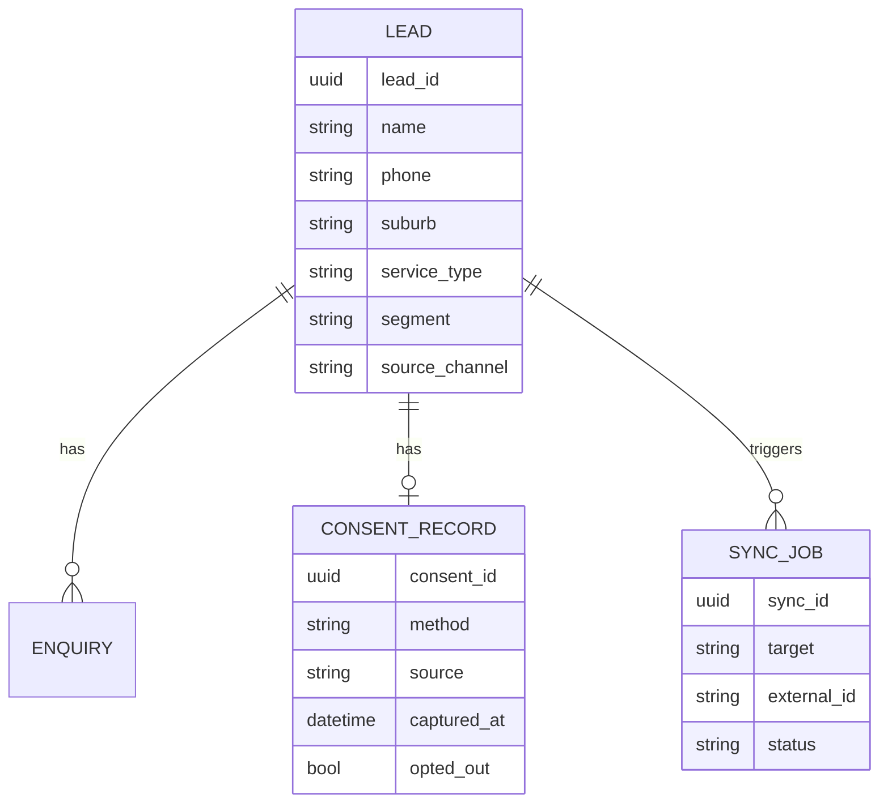
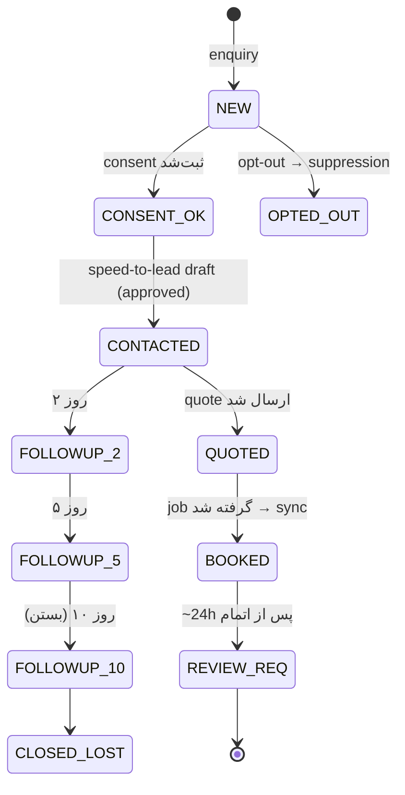
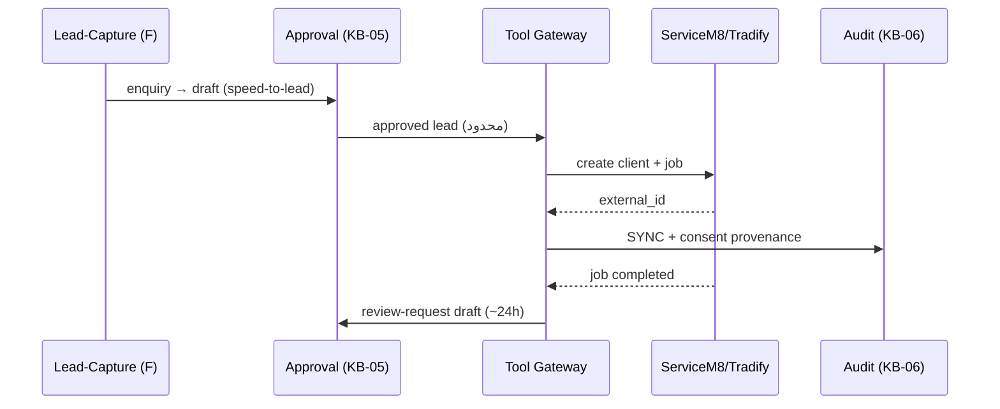

# KB-09 — Leads, Consent & CRM Integration

> WP-C. چرخهٔ کاملِ lead: capture → consent → speed-to-lead → follow-up(۲/۵/۱۰) → sync → review request. با مرزِ INV-2 و provenanceِ consent به KB-06.

---

## ۰. خلاصهٔ سریع

هر enquiry یک LEAD می‌سازد؛ consent ثبت و provenance‌دار می‌شود؛ speed-to-lead (< ۱۵ دقیقه) یک draftِ پاسخ تولید می‌کند؛ follow-up روز ۲/۵/۱۰؛ پس از approval، فیلدِ محدود به ServiceM8/Tradify sync می‌شود؛ پس از اتمامِ job، review request (~۲۴h). دادهٔ مالی/PII اضافی هرگز sync نمی‌شود.

---

## ۱. هدف
تبدیلِ enquiry به booked job با کمترین اصطکاک و کاملِ AU compliance، بدونِ بازسازیِ CRM.

---

## ۲. مدلِ داده (هم‌تراز KB-00 ER)

---

## ۳. چرخهٔ حالتِ lead

---

## ۴. Consent (Spam Act / APP 7)

| محور | قاعده |
|---|---|
| نوع | express یا inferred (در محدودهٔ رابطهٔ تجاریِ مرتبط — مثلِ enquiry خودِ مشتری) |
| ثبت | method + source + captured_at → CONSENT_CAPTURED در KB-06 |
| opt-out | ساده؛ → OPT_OUT + suppression فوری؛ هیچ ارسالِ بعدی |
| sensitive | consent صریح (APP 7) |
| cold | پیامِ اولِ cold بدونِ consent = block (KB-07) |

> follow-up به مشتریِ enquiry معمولاً در محدودهٔ رابطهٔ تجاری است → مجاز، با sender-ID/ABN/unsubscribe. پیامِ اولِ هر lead باز هم human-approved.

---

## ۵. CRM Integration (integrate, don't duplicate)

فیلدِ sync: name/phone/(email با consent)/suburb/service/source/consent/notes. **نه** دادهٔ مالی، **نه** PII اضافی.

## ۶. نگاشتِ حاکمیتی (۷ اصل)
budget→cap بر پیام/sync؛ HITL→پیامِ اول approved؛ observability→consent + sync لاگ؛ tool-gateway→sync از gateway؛ no-SPOF→capture جدا از send؛ counter-leverage→override؛ eval→enquiry→quote→job در KB-08.

## ۷. قواعدِ سخت
۱. INV-2: دادهٔ مالی/PII اضافی هرگز sync/ذخیرهٔ نادرست. ۲. opt-out → suppression فوری و دائمی. ۳. consent provenance ثبت (دفاعِ Spam Act). ۴. پیشِ‌نمایشِ دادهٔ sync قبل از ارسال (KB-05).

## ۸. قدم بعدی
KB-03 (مسیرِ send)، CONFIG (SLA/window)، KB-08 (متریکِ قیف). DoD: ✅ ER هم‌تراز، ✅ consent مدل‌شده، ✅ مرزِ sync، ✅ بدونِ کد.
