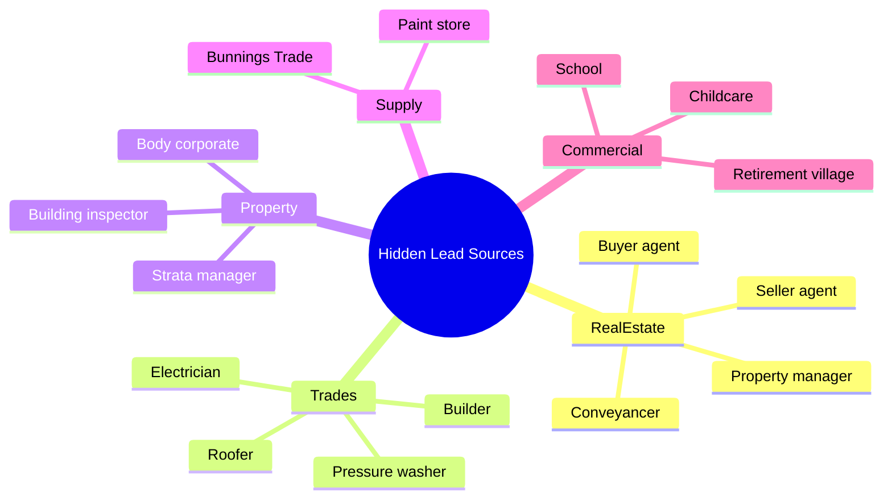
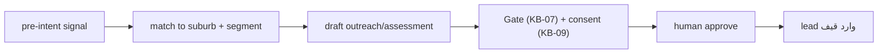

# KB-14 — Ecosystem Mapping, Lead Signals & Capital Works

> WP-F. نقشهٔ hot-spotهای سیدنی، فرکانسِ coastal، hidden lead sources، و **pre-intent signals**. Capital Works به‌عنوان سگمنتِ strata (نه محصولِ جدا).

---

## ۰. خلاصهٔ سریع

مشتریِ نقاشی به‌ندرت فقط «رنگ» می‌خواهد؛ یک تحولِ احساسی (شرم→افتخار، فروش→سود) می‌خواهد. بزرگ‌ترین اهرم = گرفتنِ **pre-intent signal** قبل از اینکه مشتری Google کند. شبکهٔ ارجاع (real estate, trades, strata) و سیگنال‌های زودهنگام (DA، scaffold، فروشِ اخیر، **بازنگریِ برنامهٔ ۱۰سالهٔ strata**) قلبِ این KB‌اند.

---

## ۱. هدف
نقشهٔ «کجا و کِی» تقاضای نقاشی متولد می‌شود، و چطور Brushline زودتر از رقبا آنجا باشد.

---

## ۲. hot-spots و فرکانس (از KB-13)

| محور | نمونه‌ها |
|---|---|
| turnover بالا (pre-sale) | Parramatta, Liverpool, Blacktown, Penrith, Campbelltown |
| renovation | Mosman, Randwick/Coogee, Marrickville/Newtown, Chatswood |
| strata غلیظ | CBD, Wolli Creek, Rhodes/Wentworth Point, Zetland |
| coastal (repaint ۵–۷ سال) | Northern Beaches, Eastern Suburbs, Cronulla |

---

## ۳. Hidden Lead Sources (شبکهٔ ارجاع)

---

## ۴. Pre-intent Signals (بزرگ‌ترین اهرم)

| سیگنال | منبع | اقدام |
|---|---|---|
| House listed for sale | Domain/RE | pre-sale paint → seller agent |
| DA application lodged | Council DA | renovation paint |
| Scaffolding installed | drive-by | exterior paint (door-knock) |
| Roof replacement done | trade network | exterior repaint |
| House sold (settlement) | buyer agent | pre-move-in paint |
| **Strata 10-year plan review** | strata manager | capital works paint forecast |

---

## ۵. Capital Works (سگمنتِ strata — ground‌شده)

از ۱ آوریل ۲۰۲۶، هر strata در NSW هنگام تهیه/بازنگریِ برنامهٔ ۱۰سالهٔ capital works باید از **standard form اجباری** (Strata Hub) استفاده کند؛ بازنگری ≥ هر ۵ سال؛ exterior paint قلمِ capital works؛ نبودِ برنامهٔ سالم = red flag روی Section 184.

- **محصول:** `draft_capital_works_assessment` (PDF ۲–۳ صفحه: وضعیت، ریسکِ تأخیر، زمانِ مناسب، برآورد، عکس) — یک نوع draft در KB-01، نه محصولِ جدا.
- **هدف:** strata manager، در مرحلهٔ بودجه‌ریزی (نه bidding).
- **هشدارِ صادقانه:** outreach به مدیران = **cold B2B** زیر Spam Act → باید از همان Gate + consent + sender-ID/ABN/unsubscribe رد شود (KB-07/KB-03). نه exception.

## ۶. روان‌شناسیِ خریدار (خلاصه)
owner-occupier: کیفیت‌محور، احساسی، loyalty بالا. investor: ROI/قیمت‌محور، منطقی، چرخهٔ کوتاه‌تر. premium: وقت‌محور، «کِی شروع می‌کنی؟»، referral بالا. پیام را به سگمنت تطبیق بده.

## ۷. نگاشتِ حاکمیتی (۷ اصل)
budget→outreach در cap؛ HITL→هر outreach approved؛ observability→سیگنال→lead لاگ؛ tool-gateway→research read-only؛ no-SPOF→چند منبعِ سیگنال؛ counter-leverage→تطبیقِ سگمنت؛ eval→نرخِ سیگنال→job در KB-08.

## ۸. قواعدِ سخت
۱. Capital Works = سگمنتِ strata، نه brand جدا. ۲. هر outreachِ cold از Gate/consent. ۳. هر سیگنال یک مسیرِ اقدامِ مشخص دارد.

## ۹. قدم بعدی
KB-09 (تبدیلِ سیگنال به lead)، KB-02 (اقتصادِ Capital Works)، ROADMAP (سگمنت فاز ۵+). DoD: ✅ Capital Works خانه‌دار، ✅ هر سیگنال اقدام‌دار، ✅ بدونِ کد.

## مرتبط

<!-- Tier A · CONNECTIONS-MAP (_memory) · اعمال 2026-07-04 -->
- [[06 - Architecture Maps/ECOSYSTEM|ECOSYSTEM]]
