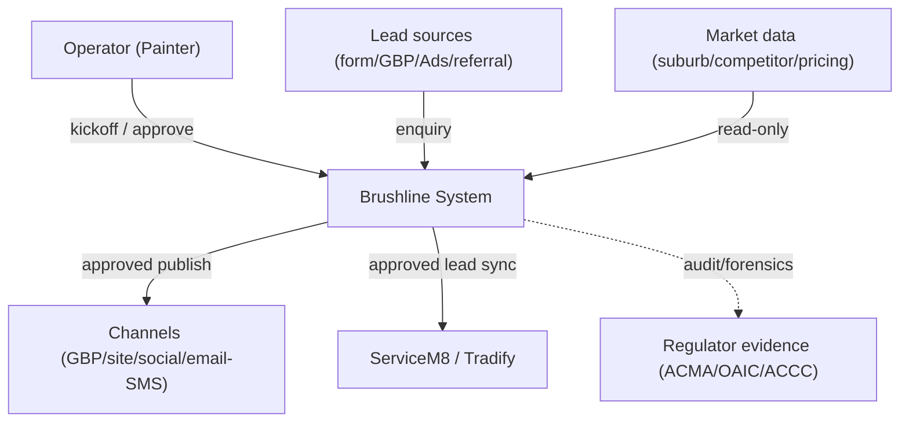
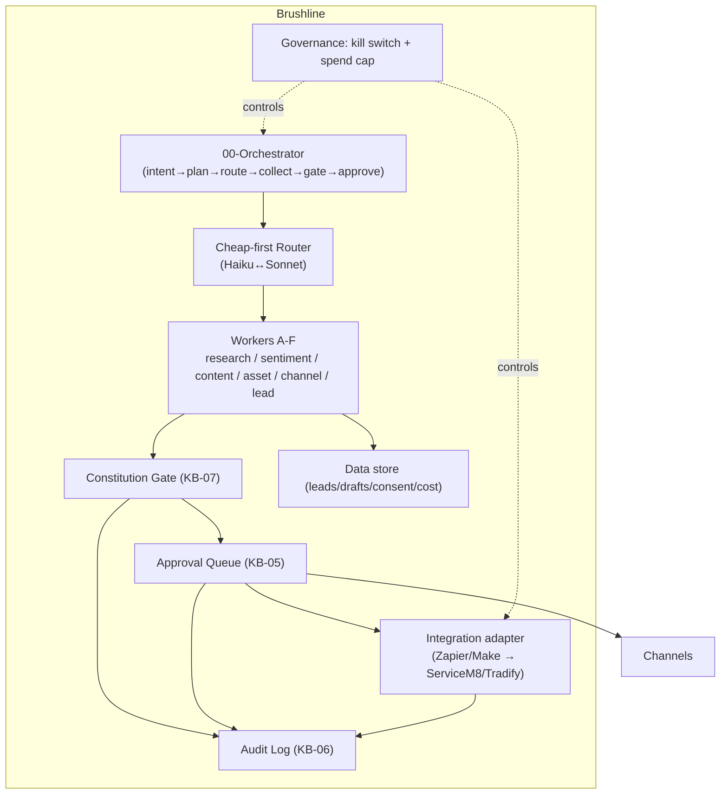
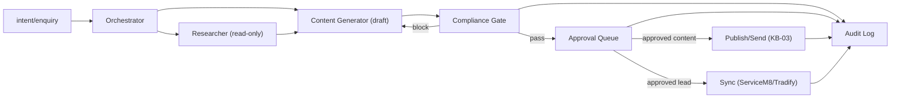
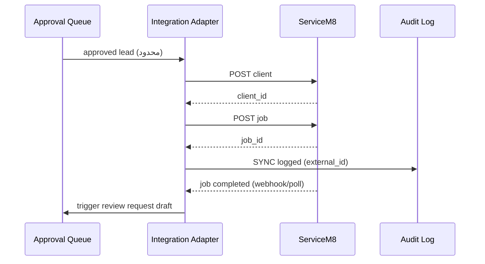

# MVP System Requirements — Brushline

> هدف: تبدیلِ Master Synthesis (KB-00) و ماژول‌های دانش به یک سندِ نیازمندیِ سیستمِ MVP. **هیچ کدی نیست**؛ فقط تعریفِ سیستم: functional spec، تعاملِ خارجی، مدلِ داده، سطحِ UI/API، معماری، و user storyها.
> دامنه: نقاشیِ ساختمان سیدنی. معماری reuse از LANGAR. سه invariant حاکم.
> منطبق با DoD فازهای ROADMAP (فاز ۰ تا ۵).

---

## ۰. خلاصهٔ سریع

MVP یک سیستمِ **workflow-driven** (نه agent خودمختار) است که: lead/intent می‌گیرد، با router ارزان draft تولید می‌کند، از Constitution Gate رد می‌کند، به Human Approval Queue می‌برد، پس از تأییدِ انسانی منتشر/ارسال/sync می‌کند، و همه‌چیز را در Hash-chained Audit Log ثبت می‌کند. ServiceM8/Tradify از طریق integration وصل می‌شوند (نه بازسازی).

---

## ۱. معماریِ سطحِ‌بالا (C4-style block diagram)

### ۱.۱ Context (L1)

### ۱.۲ Container (L2)

---

## ۲. Functional Spec (به‌تفکیکِ کامپوننت)

### ۲.۱ 00-Orchestrator
- ورودی: intent/kickoff از Operator، یا enquiry از lead source.
- وظیفه: تشخیصِ نوعِ task، planِ ثابت (workflow، نه تصمیمِ آزادِ LLM)، routing، جمع‌آوریِ خروجی‌ها، هدایت به Gate.
- قید: مسیرِ ثابت و قابلِ‌پیش‌بینی (KB-01 §۱). هیچ auto-execution بدونِ Gate+Approval.

### ۲.۲ Researcher Triggers (Worker A, read-only)
- triggerها: درخواستِ محتوای suburb، تحلیلِ رقیب/کلیدواژه/قیمت؛ و **pre-intent signals** (KB-14): DA approval، نصبِ داربست، فروشِ اخیرِ ملک، و (لایهٔ Capital Works) بازنگریِ برنامهٔ ۱۰سالهٔ strata.
- خروجی: دادهٔ برچسب‌دار (منبع یا «تخمین»). هیچ ادعای بدونِ برچسب.
- قید: read-only؛ خروجی باید از Gate رد شود.

### ۲.۳ Content Generator (Workers C/D)
- تولیدِ draft: suburb page، caption، quote follow-up (۲/۵/۱۰)، review response، blog outline، GBP post، asset (before/after)، و (Capital Works) `capital_works_assessment`.
- همه draft-only؛ هیچ auto-publish.

### ۲.۴ Compliance Gate (KB-07)
- اجرای check_acl_claims / check_spam_consent / check_sender_id / check_privacy_leak / check_data_sovereignty.
- خروجی: PASS / SOFT_FLAG / HARD_BLOCK + ثبت در Audit.

### ۲.۵ Approval Queue (KB-05)
- نمایشِ کارت، کنش approve/edit/reject، اولویت/SLA، REGATE برای ویرایشِ مهم، ثبتِ هر کنش.

### ۲.۶ Lead-Capture + Sync (Worker F → KB-09)
- enquiry → speed-to-lead draft + follow-up؛ پس از approve + consent، sync دادهٔ محدود (name/phone/suburb/service/source/consent) به ServiceM8/Tradify.

### ۲.۷ Governance (cross-cutting)
- kill switch (توقفِ کلِ سیستم)، per-action/per-day spend cap (AUD)، hash-chained audit. غیرقابل‌حذف (Invariant-3).

---

## ۳. تعاملِ خارجی (Integrate, don't duplicate)

| سیستم | جهت | داده | مرز |
|---|---|---|---|
| ServiceM8 | write | ایجاد client + job از lead | فقط name/phone/suburb/service/source/consent/notes |
| ServiceM8 | read | job status, completion date, feedback | trigger برای review request |
| Tradify | write/read | معادل، API محدودتر (اغلب via Zapier/Make) | همان |
| اتصال | — | Zapier/Make به‌عنوان adapter | بدونِ گره به ساختارِ دادهٔ یک vendor |

> Brushline هرگز quoting/scheduling/invoicing را بازنمی‌سازد. آن‌ها در ServiceM8/Tradify می‌مانند.

---

## ۴. مدلِ داده (مفهومی)

ارجاع به ER کاملِ KB-00 §۴. موجودیت‌های MVP:

`LEAD`, `ENQUIRY`, `CONSENT_RECORD`, `DRAFT`, `GATE_RESULT`, `APPROVAL_ACTION`, `AUDIT_ENTRY`, `SYNC_JOB`, `COST_EVENT`.

روابطِ کلیدی:
- یک LEAD ← چند ENQUIRY، یک CONSENT_RECORD، چند SYNC_JOB.
- یک DRAFT ← یک GATE_RESULT، چند APPROVAL_ACTION.
- هر APPROVAL_ACTION / GATE_RESULT / SYNC_JOB / COST_EVENT ← دقیقاً یک AUDIT_ENTRY.

> قیدِ داده: PII/مالی جدا و امن؛ هرگز در LANGAR یا draftِ عمومی (Invariant-2).

---

## ۵. سطحِ UI (مفهومی، بدون پیاده‌سازی)

| صفحه | کاربر | محتوا |
|---|---|---|
| Kickoff | Operator | شروعِ task با intent + فاز جاری |
| Approval Queue | Operator | لیستِ کارت‌ها با اولویت/SLA/flag؛ approve/edit/reject |
| Lead detail | Operator | enquiry + consent + پیش‌نمایشِ sync |
| Audit/Report | Operator | جست‌وجوی انطباق + verify زنجیره |
| Cost dashboard | Operator | COST_EVENT تجمیعی (AUD) + spend cap status |

---

## ۶. سطحِ API (مفهومی، بدون پیاده‌سازی)

| دسته | عملیات (نمونه) | مرز |
|---|---|---|
| research_* | search_suburb / search_competitor / search_keyword_intent | read-only، برچسب‌دار |
| content_* | draft_suburb_page / draft_followup / draft_review_response / draft_capital_works_assessment | draft-only |
| compliance_* | check_acl / check_spam_consent / check_sender_id / check_privacy / check_sovereignty | gate |
| approval_* | submit_for_approval / record_decision / get_status | HITL |
| sync_* | sync_lead_to_servicem8 / sync_lead_to_tradify / get_job_status | محدود |
| audit_* | append_entry / verify_chain / query | append-only |
| gov_* | kill_switch / get_spend_status | governance |

> اصلِ Tool design (KB-01): کم و high-impact؛ search_x/do_x نه list-all؛ namespacing واضح؛ response_format enum (concise/detailed).

---

## ۷. User Stories (MVP)

| # | به‌عنوان | می‌خواهم | تا |
|---|---|---|---|
| US-1 | Operator | enquiryِ جدید فوراً یک draftِ پاسخ بسازد | speed-to-lead زیر ۱۵ دقیقه را بزنم |
| US-2 | Operator | هر draft قبل از ارسال flagهای ACL/Spam را نشان دهد | از ریسکِ قانونی جلوگیری کنم |
| US-3 | Operator | draft را inline ویرایش و تأیید کنم | کنترلِ نهایی دستِ من باشد |
| US-4 | Operator | leadِ تأییدشده خودکار به ServiceM8 برود | دوباره دستی وارد نکنم |
| US-5 | Operator | follow-up روز ۲/۵/۱۰ خودکار draft شود | پیگیری را از دست ندهم |
| US-6 | Operator | پس از اتمامِ job، یک review request draft شود | شهرت بسازم (لینکِ مستقیم) |
| US-7 | Operator | suburb page محلیِ یکتا تولید شود | local SEO رشد کند |
| US-8 | Operator | هیچ پیام/پست بدون تأیید من نرود | invariant حفظ شود |
| US-9 | Operator | هزینهٔ AUD و سقفِ خرج را ببینم | runaway spend رخ ندهد |
| US-10 | Operator | لاگِ تغییرناپذیر برای شکایت داشته باشم | انطباق را اثبات کنم |
| US-11 (Capital Works) | Operator | برای یک strata یک paint assessment (PDF) draft شود | در مرحلهٔ بودجه‌ریزی وارد شوم |

---

## ۸. Non-functional / قیدها

| قید | الزام |
|---|---|
| HITL | اجباری؛ no auto-publish/send/sync |
| Spam Act | consent + sender-ID/ABN + unsubscribe ۵-روزه |
| ACL | no false/unsubstantiated claims |
| Privacy/APP 7 | opt-out ساده؛ no PII leak |
| Data sovereignty | دادهٔ حساس در AU؛ نه در LANGAR/AI عمومی |
| Governance | kill switch + spend cap + hash-chained audit |
| Cost | Brushline core ~AUD ۱۵–۶۵/ماه (KB-02)؛ spend cap از روز اول |
| Integrate | ServiceM8/Tradify؛ no duplicate |

---

## ۹. نگاشت به DoD فازهای ROADMAP

| فاز | کار | gate/DoD |
|---|---|---|
| ۰ | scaffold + reuse interfaceهای LANGAR | تستِ «هیچ LANGAR» با JOIN جدولِ شخصی |
| ۱ | Researcher + Audience (read-only) | رد شدنِ خروجیِ سورس‌دار از Gate |
| ۲ | Content/Copy + Asset (draft) | همه در صف؛ هیچ انتشار |
| ۳ | Approval Queue + Audit Log (hash-chain) | tamper-evidence تست‌شده |
| ۴ | Publish/Send + kill switch + spend cap | اصلاحِ AU |
| ۵ | Lead-Capture + sync + speed-to-lead + متریک | cost-per-booked-job؛ پیامِ اول human-approved؛ consent |

## ۱۰. قدم بعدی
۱. تثبیتِ config: FX rate، spend cap (AUD)، آستانهٔ «ویرایشِ مهم»، قالبِ sender-ID/ABN.
۲. شروعِ فاز ۰ (scaffold + reuse) پس از تأییدِ این spec.
۳. تصمیمِ Operator دربارهٔ ورودِ لایهٔ Capital Works (KB-00 §۵) به‌عنوان سگمنتِ فاز ۵+.
