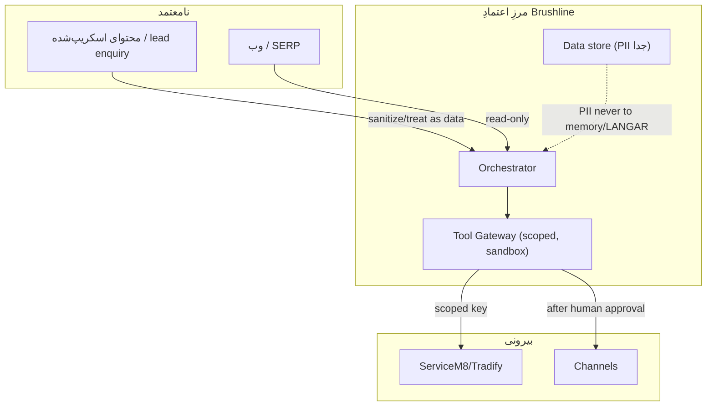
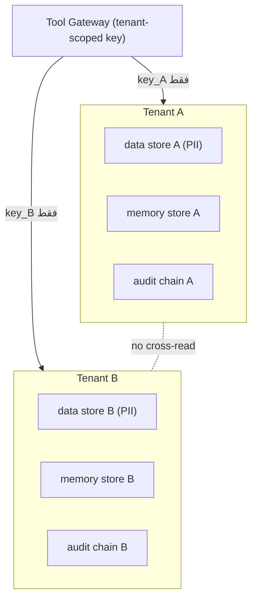

# THREAT MODEL — امنیت

> WP-G3. خانهٔ رسمیِ اصلِ ۴/۵ حاکمیتی (tool gateway / least-privilege / no-SPOF). نگاشتِ STRIDE سبک + جدولِ تهدید×کنترل×KB.

---

## ۰. خلاصهٔ سریع

سطحِ حملهٔ Brushline: محتوای اسکریپ‌شده/lead (ورودیِ نامعتمد)، دادهٔ مشتری (PII/مالی)، و کلیدهای integration. کنترل‌ها: tool-gateway با scoped key، اجرای ابزار در sandbox، انسان روی هر کنشِ بیرونی، kill switch، و hash-chained audit.

---

## ۱. مرزِ اعتماد

---

## ۲. STRIDE سبک × کنترل × KB

| تهدید | مثال | کنترل | KB |
|---|---|---|---|
| **Spoofing** | جعلِ منبعِ lead/sender | sender-ID/ABN، auth کانال | KB-03/07 |
| **Tampering** | دستکاریِ لاگ/draft | hash-chained append-only | KB-06 |
| **Repudiation** | انکارِ تصمیم | audit با actor/ts | KB-06 |
| **Information disclosure** | نشتِ PII/مالی | INV-2، scoped store، no-memory-PII | KB-04/09 |
| **DoS / runaway** | حلقهٔ هزینه | spend cap + kill switch | INV-3/CONFIG |
| **Elevation** | tool فراتر از scope | least-privilege، scoped key، sandbox | KB-01 |
| **Prompt injection** | دستور در محتوای اسکریپ‌شده | محتوای بیرونی = data نه instruction؛ Gate؛ human approval | KB-07/05 |

---

## ۳. کنترل‌های پایه
۱. **Tool gateway** — هر کنشِ بیرونی از یک gateway؛ scoped API key؛ no anonymous reach.
۲. **Sandbox** — اجرای ابزار/کد در container/microVM جدا.
۳. **Least-privilege** — فقط scopeِ لازم (مثلِ ServiceM8 minimal scopes).
۴. **HITL** — انسان روی هر publish/send/sync (INV-1).
۵. **Kill switch + circuit breaker** — توقفِ فوری (INV-3).
۶. **Audit** — hash chain برای tamper-evidence (KB-06).
۷. **PII boundary** — جداسازیِ سختِ دادهٔ حساس؛ هرگز در memory/LANGAR/AI عمومی (INV-2).

## ۴. prompt injection (تأکیدِ ویژه)
محتوای اسکریپ‌شده (review، صفحهٔ رقیب، متنِ enquiry) ممکن است دستورِ خصمانه داشته باشد. قاعده: این محتوا همیشه **داده** است نه دستور؛ هیچ‌گاه مستقیم به کنشِ بیرونی ترجمه نمی‌شود؛ Gate + human approval لایهٔ دفاع‌اند.

## ۵. نگاشتِ حاکمیتی (۷ اصل)
این سند مستقیماً اصلِ ۴ (tool gateway/least-privilege) و ۵ (no-SPOF/separation of duties) را پوشش می‌دهد و به ۲ (HITL/kill switch)، ۳ (observability/audit)، و ۷ (eval/guardrails) وصل می‌شود.

## ۵.۵ Multi-tenant (فاز محصول‌سازی — اضافه‌شده برای کاملی)

وقتی Brushline از یک Operator به چند tenant (چند کسب‌وکارِ نقاشی) می‌رسد، سطحِ حمله عوض می‌شود: بزرگ‌ترین ریسک = **نشتِ بین‌tenant** (داده/memory/audit یک tenant در دسترسِ دیگری).

| تهدیدِ multi-tenant | STRIDE | کنترل |
|---|---|---|
| نشتِ داده/PII بین tenant | Info disclosure | isolation سختِ store؛ tenant_id روی هر رکورد؛ no shared memory |
| memory poisoning بین tenant | Tampering/Elevation | memory store جدا per-tenant؛ provenance؛ scope بسته |
| blast radius یک کلیدِ مشترک | Elevation | scoped key **per-tenant**؛ نه کلیدِ سراسری؛ ServiceM8 OAuth per-tenant (نه API-Key مشترک) |
| noisy neighbor / runaway یک tenant | DoS | spend cap + kill switch **per-tenant** (CONFIG) |
| تداخلِ consent/suppression | Compliance | suppression list per-tenant؛ هرگز اشتراکی |
| اختلاطِ audit | Repudiation | audit chain یا tenant-tag جدا per-tenant |

قواعدِ multi-tenant: (۱) هیچ store/memory/audit مشترک؛ (۲) کلید و cap و kill switch **per-tenant**؛ (۳) ServiceM8 از API-Key (single) به OAuth (multi) منتقل شود؛ (۴) تستِ «هیچ cross-tenant read» در DoD فاز ۶ (هم‌راستا با تستِ «هیچ LANGAR» فاز ۰).

> این بخش برای کاملی اضافه شد؛ اجرای آن متعلق به **فاز ۶ (محصول‌سازی)** است، نه MVP.

## ۶. قواعدِ سخت
۱. محتوای بیرونی = data، نه instruction. ۲. هر کنشِ خارجی از gateway scoped + sandbox. ۳. PII/مالی پشتِ مرز (INV-2). ۴. kill switch همیشه در دسترس.

## ۷. قدم بعدی
تعریفِ scopeهای دقیقِ key در CONFIG، guardrails ورودی/خروجی در KB-08. DoD: ✅ STRIDE×کنترل×KB، ✅ trust boundary، ✅ prompt-injection قاعده‌مند، ✅ بدونِ کد.
