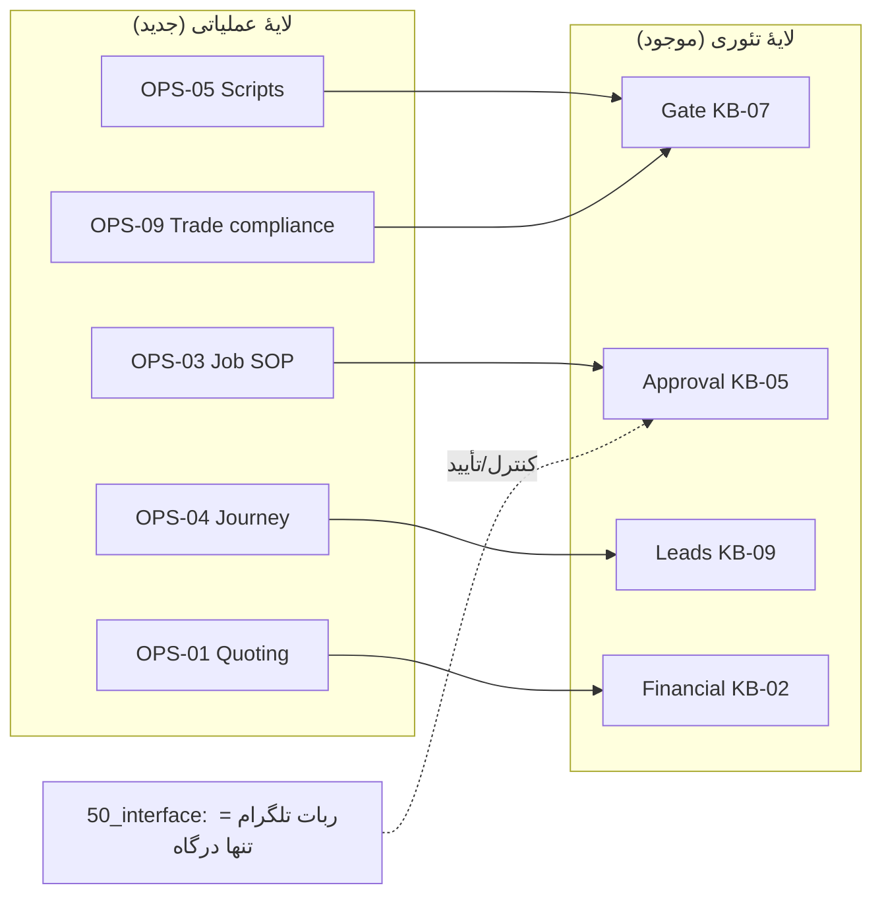

# OPS-00 — Operations Layer Index (لایهٔ عملیاتیِ کسب‌وکارِ نقاشی)

> **چرا این پوشه اضافه شد:** لایهٔ تئوریِ Brushline (KB-00..KB-14) ~۸۰٪ دربارهٔ *سیستمِ AI، حاکمیت، انطباق و بازار* است. این پوشه آن ۲۰٪ گم‌شده را پر می‌کند: *عملیاتِ واقعیِ خودِ کسب‌وکارِ نقاشی* — چیزی که ربات باید draft و مدیریت کند.
> **قاعده:** بدونِ کد؛ فقط تئوری/تعریف. نام‌ها از `GLOSSARY`؛ پارامترها از `CONFIG`. هر عدد/ادعای حقوقی تگِ **[verify-NSW]** دارد و نیاز به تأییدِ محلی.
> **پوشش:** هر ۵ سگمنت با وزنِ یکسان — `residential` · `strata` · `property-manager` · `builder` · `commercial`.

---

## فهرستِ ماژول‌های عملیاتی

| سند | موضوع | تغذیه‌کنندهٔ کدام agent/KB |
|---|---|---|
| **OPS-01** | Quoting & Estimation Framework | Estimation agent · KB-02 · `content_draft_quote` |
| **OPS-02** | Site Inspection Checklist | Operations agent · Worker A/F |
| **OPS-03** | Job Workflow SOP (دریافت lead تا warranty) | Operations agent · KB-05/09 |
| **OPS-04** | Customer Journey (۵ سگمنت) | Sales/CS agent · KB-09 |
| **OPS-05** | Sales Scripts & Objection Handling | Sales agent · KB-10 · KB-07 gate |
| **OPS-06** | Marketing & Content System | Marketing agent · KB-03/13/14 |
| **OPS-07** | Website / Landing / GBP Structure | Copywriting agent · KB-03/13 |
| **OPS-08** | CRM Pipeline & Lead Stages | CS/Automation agent · KB-09 |
| **OPS-09** | NSW Operational Compliance (trade-level) | Compliance agent · KB-12 |

## نگاشت به اسکلتِ موجود

> هر سندِ OPS «محتوای کاری» تولید می‌کند که همان مسیرِ تئوری را طی می‌کند: **draft → Gate (KB-07) → Human approve via Telegram (KB-05) → publish/sync → audit (KB-06)**. هیچ خروجیِ عملیاتی این سه دروازه را دور نمی‌زند.
