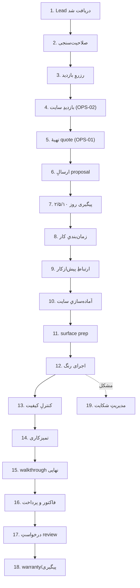

# OPS-03 — Job Workflow SOP (دریافتِ lead تا warranty)

> SOPهای گام‌به‌گامِ کلِ چرخهٔ کار. هر مرحله مشخص می‌کند: trigger، اقدام، خروجی، و کدام agent/KB درگیر است. بدونِ کد.
> اصلِ حاکم: هیچ پیام/ارسال/sync بدونِ تأییدِ Operator از طریقِ ربات تلگرام (INV-1 / KB-05 / TG-01).

---

## نقشهٔ کلی

---

## SOP-1 — Lead دریافت شد
**Trigger:** enquiry از فرمِ سایت/GBP/Ads/ارجاع. **اقدام:** ساختِ LEAD (KB-09)، ثبتِ consent + provenance، شروعِ تایمرِ speed-to-lead (<۱۵ دقیقه). **خروجی:** draftِ پاسخِ اول → Gate → تلگرام برای تأیید. **هرگز** پیامِ اول بدونِ تأیید نرود.

## SOP-2 — صلاحیت‌سنجیِ Lead
**اقدام:** سگمنت؟ نوعِ کار؟ suburd در محدودهٔ سرویس؟ بودجه/فوریت؟ واقعی یا time-waster؟ **خروجی:** برچسبِ کیفیت + مسیر (بازدید / رد مودبانه / nurture). جزئیات در OPS-05.

## SOP-3 — رزروِ بازدید
**اقدام:** پیشنهادِ ۲–۳ بازهٔ زمانی؛ تأیید؛ یادآور. **خروجی:** بازدیدِ ثبت‌شده در تقویم (ServiceM8). پیامِ تأیید از تلگرام تأیید شود.

## SOP-4 — بازدیدِ سایت
**اقدام:** OPS-02 را اجرا کن؛ m²، prep، ریسک، عکس. **خروجی:** دادهٔ ساختاریافته → OPS-01.

## SOP-5 — تهیهٔ quote
**اقدام:** OPS-01؛ scope + exclusions + فرض + بازهٔ قیمت + placeholderهای قانونی. **خروجی:** quote draft → Gate (no false claim/fake warranty) → تلگرام.

## SOP-6 — ارسالِ proposal
**اقدام:** پس از تأییدِ Operator، proposal با sender-ID/ABN ارسال (اگر ایمیل/SMS، شرایطِ Spam Act — KB-03). برای کار >AUD ۵٬۰۰۰ یادآوریِ قراردادِ کتبی. **خروجی:** PUBLISHED/SENT لاگ (KB-06).

## SOP-7 — پیگیری روز ۲/۵/۱۰
**اقدام:** follow-up draft در روز ۲ (سؤال؟)، ۵ (تنظیمِ scope؟)، ۱۰ (بستن). هر کدام از Gate + تلگرام. **خروجی:** اکثرِ رقبا پیگیری نمی‌کنند — این تمایزِ شماره‌یکِ توست (KB-13 §۴).

## SOP-8 — زمان‌بندیِ کار
**اقدام:** پس از پذیرش: قراردادِ کتبی (>$۵k)، سپرده ≤۱۰٪، تاریخ، وابستگی به هوا (بیرونی). **خروجی:** job در ServiceM8؛ هیچ quoting/scheduling در Brushline بازسازی نمی‌شود (integrate).

## SOP-9 — ارتباطِ پیش‌از‌کار
**اقدام:** یادآورِ تاریخ، آماده‌سازیِ ساکن (جابه‌جاییِ مبلمان، دسترسی، حیوان)، انتظارات. **خروجی:** پیامِ pre-job (draft → تأیید).

## SOP-10 — آماده‌سازیِ سایت
**اقدام (دستیِ Operator):** پوششِ کف/مبلمان، masking، تهویه، چیدنِ تجهیزات، scaffold اگر لازم (WHS — OPS-09). *Brushline اینجا فقط checklist/یادآور می‌دهد.*

## SOP-11 — Surface prep
**اقدام (دستی):** شست‌وشو، filling، sanding، scraping، prime، رفعِ کپک/رطوبت. *برای سطحِ پیش‌از ۱۹۹۷: روالِ lead-safe (OPS-09).* prep = پایهٔ کیفیت؛ کم‌کاری اینجا = شکایتِ بعدی.

## SOP-12 — اجرای رنگ
**اقدام (دستی):** coatها طبقِ spec، رعایتِ زمانِ خشک‌شدن، شرایطِ هوا (بیرونی). *Brushline نقشِ admin دارد نه کار (KB-13 §۷).* 

## SOP-13 — کنترلِ کیفیت
**اقدام:** بازبینیِ coverage، لبه‌ها/cut-in، یکنواختی، تمیزیِ trim، نبودِ drip. checklist استاندارد. **خروجی:** اگر ایراد → اصلاح پیش از walkthrough.

## SOP-14 — تمیزکاری
برداشتِ masking، تمیزیِ کف، دفعِ ایمنِ ضایعات/رنگ (OPS-09)، تحویلِ تمیزِ فضا.

## SOP-15 — Walkthrough نهایی
**اقدام:** بازبینیِ مشترک با مشتری؛ ثبتِ هر اصلاحِ جزئی؛ تأییدِ رضایت. **خروجی:** عکسِ after (برای KB-03 before/after).

## SOP-16 — فاکتور و پرداخت
**اقدام:** فاکتور از ServiceM8/Tradify (نه Brushline)؛ شرایطِ پرداخت طبقِ قرارداد؛ برای کارِ بزرگ progress payment. **خروجی:** trigger برای SOP-17.

## SOP-17 — درخواستِ review
**Trigger:** ~۲۴h پس از اتمامِ job (از job-completed در ServiceM8). **اقدام:** review request draft با لینکِ مستقیمِ Google → Gate → تلگرام. **خروجی:** بزرگ‌ترین اهرمِ owned-channel (KB-13).

## SOP-18 — Warranty / پیگیری
**اقدام:** ثبتِ گارانتیِ قانونی (NSW: ۲ سال نقصِ جزئی مثلِ رنگ — OPS-09)؛ یادآورِ maintenance (coastal/strata سالانه)؛ nurture برای کارِ تکراری. 

## SOP-19 — مدیریتِ شکایت
**اقدام:** مالکیت + پاسخِ سریع (نه دفاعی)؛ بازدیدِ اصلاحی؛ مستندسازی. برای review منفی: KB-10 B4 + Gate (no PII leak). **هرگز** انکار/تأخیر — شهرت = دارایی.

---

## نگاشتِ مسئولیت
- **Brushline (AI):** SOP ۱،۲،۳،۵،۶،۷،۹،۱۷،۱۸،۱۹ (admin/communication/draft).
- **Operator (انسان):** تأییدِ همه + SOP ۴،۸،۱۰–۱۶ (کارِ فیزیکی و تصمیم).
- **ServiceM8/Tradify:** scheduling، invoicing، job record (integrate).
