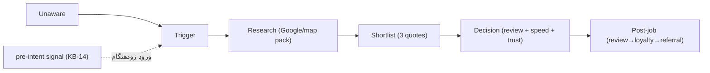

# OPS-04 — Customer Journey (۵ سگمنت، وزنِ یکسان)

> سفرِ مشتری از «هنوز نمی‌داند به نقاش نیاز دارد» تا «مشتریِ تکراری/مُعرّف». هر سگمنت سفرِ متفاوتی دارد. ورودیِ Sales/CS agent و KB-09.

---

## ۰. مدلِ کلیِ ۶ مرحله
`Unaware → Trigger → Research → Shortlist → Decision → Post-job (loyalty/referral)`

بزرگ‌ترین اهرم‌ها (از KB-13/14): **pre-intent signal** (ورود قبل از Research)، **speed-to-lead** (در Shortlist)، **review** (در Decision)، **follow-up** (در Post-job).

## ۱. Residential (owner-occupier)
- **Trigger:** خانهٔ کهنه، آماده‌سازیِ مهمانی، پیش‌از فروش، احساسِ «شرم→افتخار».
- **روان‌شناسی:** کیفیت‌محور، احساسی، loyalty بالا (KB-14 §۶).
- **نقاطِ درد:** ترسِ از بی‌نظمی/خرابی، نقاشِ بی‌مسئولیت، قیمتِ مبهم.
- **اهرمِ Brushline:** پاسخِ سریع + before/after واقعی + review + ارتباطِ شفاف.
- **لحظهٔ کلیدی:** «نتیجه را نشانم بده» — گالریِ محلی مهم‌تر از ارزان‌ترین قیمت.

## ۲. Strata / Body Corporate
- **Trigger:** بازنگریِ برنامهٔ ۱۰سالهٔ capital works (≥هر ۵ سال؛ standard form از ۱ آوریل ۲۰۲۶)، AGM، تعمیراتِ دوره‌ای.
- **روان‌شناسی:** committee تصمیم می‌گیرد؛ فرایندِ رسمی، چند تصمیم‌گیر، حساس به مستندسازی.
- **نقاطِ درد:** بودجه‌بندی، هماهنگیِ ساکنان، گزارشِ شفاف.
- **اهرمِ Brushline:** `draft_capital_works_assessment` (PDF) در مرحلهٔ **بودجه‌ریزی نه bidding** (KB-14) — ورودِ کم‌رقابت.
- **هشدار:** outreach به مدیرِ strata = cold B2B زیرِ Spam Act → Gate + consent + sender-ID/ABN/unsubscribe (KB-07/12). نه استثنا.

## ۳. Property Manager / Real Estate
- **Trigger:** رنگ پیش از فروش/اجاره، turnover، آماده‌سازیِ ملک.
- **روان‌شناسی:** مکرر، سریع، رابطهٔ بلندمدت‌محور؛ قیمتِ رقابتی و قابلِ‌اتکا.
- **نقاطِ درد:** نیاز به turnaround سریع، چند ملک، فاکتورِ تمیز.
- **اهرمِ Brushline:** پاسخِ فوری، rate شفافِ per-property، رابطهٔ تکرارشونده، پیگیریِ منظم.
- **نکتهٔ انطباق:** OAIC sweep روی real estate agents از ژانویه ۲۰۲۶ (KB-12) — این شرکای ارجاع تحتِ نظارتند؛ مدیریتِ دادهٔ تمیز.

## ۴. Builder / Renovator
- **Trigger:** پروژهٔ ساخت/بازسازی که به sub-contractِ نقاشی نیاز دارد.
- **روان‌شناسی:** قیمت‌محور، برنامه‌محور، قابلیتِ اتکا به زمان‌بندی.
- **نقاطِ درد:** هماهنگی با مراحلِ ساخت، تأخیر = هزینه.
- **اهرمِ Brushline:** rate per m²/per-stage، ارتباطِ سریع، اعتمادِ حرفه‌ایِ تکرارشونده.

## ۵. Commercial
- **Trigger:** بازسازیِ فضای تجاری، نگه‌داریِ دوره‌ای، rebrand.
- **روان‌شناسی:** قیمت‌محورتر، تحویلِ به‌موقع حیاتی، اغلب after-hours/فصلی.
- **نقاطِ درد:** حداقلِ اختلال در کسب‌وکار، زمان‌بندیِ دقیق.
- **اهرمِ Brushline:** پیشنهادِ مرحله‌ای، گزینهٔ night/weekend، گزارشِ پیشرفت.

## ۶. نقاطِ تماسِ Brushline در کلِ سفر

| مرحله | اقدامِ Brushline | KB/OPS |
|---|---|---|
| pre-intent | سیگنال→outreach (approved) | KB-14 |
| Research | suburb page + GBP + review (owned) | OPS-06/07 |
| Shortlist | speed-to-lead <۱۵ دقیقه | KB-09 / OPS-03 |
| Decision | review + quote شفاف + اعتماد | OPS-01/05 |
| Post-job | review request + maintenance + referral | OPS-03 SOP-17/18 |

> همهٔ این نقاط محتوای کاری تولید می‌کنند که از Gate + تأییدِ تلگرام رد می‌شوند. هیچ اتوماسیونِ بی‌نظارت روی ارتباطِ مشتری.
