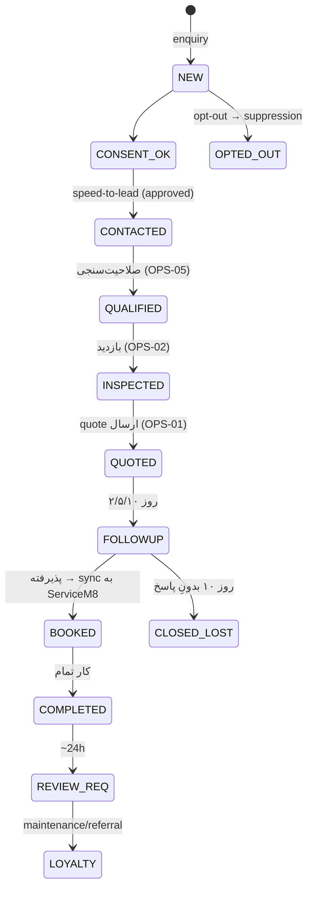

# OPS-08 — CRM Pipeline & Lead Stages

> پایپ‌لاینِ CRM و مراحلِ lead. Brushline دادهٔ خودش را نگه می‌دارد و به ServiceM8/Tradify **sync** می‌کند (integrate, don't duplicate). تئوری، نه کد. منبع: KB-09/01/05.

---

## ۰. اصل
Brushline یک CRM کامل بازنمی‌سازد. job/scheduling/invoicing در ServiceM8/Tradify می‌مانند. Brushline فقط **مرحلهٔ lead تا booked** را مدیریت می‌کند و در نقطهٔ booked، دادهٔ محدود را sync می‌کند.

## ۱. مراحلِ پایپ‌لاین (از KB-09 state machine)

## ۲. فیلدهای هر Lead (مدلِ داده — KB-09)
`lead_id, name, phone, (email با consent), suburb, service_type, segment, source_channel, stage, consent_status, notes`.
⚠️ **هرگز:** دادهٔ مالیِ حساس، PII اضافی، شمارهٔ کارت/بانک (INV-2).

## ۳. مرزِ Sync (در نقطهٔ BOOKED)
ارسال به ServiceM8/Tradify: name / phone / (email با consent) / suburb / service / source / consent / notes. **نه** بیشتر. پیش‌نمایشِ دادهٔ sync پیش از ارسال اجباری است (KB-05 §۵) — Operator در تلگرام تأیید می‌کند.

## ۴. اولویت و SLA (KB-05 §۳)
| مرحله | اولویت | SLA |
|---|---|---|
| NEW (lead جدید) | بحرانی | <۱۵ دقیقه |
| review منفی | بالا | <۲ ساعت |
| FOLLOWUP | متوسط | روزِ مرحله (۲/۵/۱۰) |
| محتوا | پایین | ۲۴–۴۸h |

## ۵. Consent & Suppression (Spam Act / APP 7)
- هر lead: consent با method + source + captured_at (KB-09).
- opt-out → suppression **فوری و دائمی**؛ هیچ ارسالِ بعدی.
- provenance ثبت در audit (KB-06) — دفاعِ Spam Act.

## ۶. متریک‌های پایپ‌لاین (KB-08)
enquiry→quote rate · quote→job rate · cost-per-booked-job (متریکِ شمال) · review rate · queue reject-rate. **نه** vanity metrics. A/B با Wilson lower-bound.

## ۷. اتصال
lead/consent: KB-09. approval/SLA: KB-05. sync/integration: KB-01 §۵. audit: KB-06. ابزارِ خارجی: ServiceM8/Tradify. درگاهِ Operator: TG-01.
