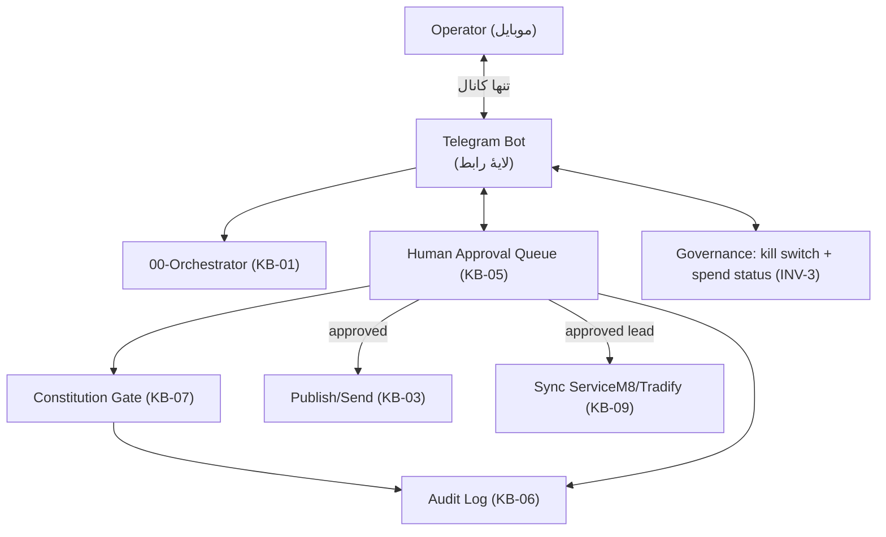

# TG-01 — Telegram as the Single Operator Channel (طراحیِ تئوری)

> تصمیمِ معماریِ جدیدِ Operator: **ربات تلگرام = تنها درگاهِ ارتباطیِ بین Operator و Brushline.** این سند تئوریِ آن را تعریف می‌کند و به اسکلتِ موجود وصل می‌کند.
> ⚠️ **بدونِ کد** (طبقِ تصمیمِ پروژه تا فاز ۰). این فقط *طراحیِ مفهومی* است؛ پیاده‌سازیِ Bot API در فازِ ساخت.
> این سند جایگزینِ «سطحِ UI» در `MVP_system_requirements §۵` می‌شود (UIِ وب → رابطِ تلگرام).

---

## ۰. تصمیمِ load-bearing (پیشنهاد برای ثبت در BLUEPRINT/Decision Record)
> **تصمیمِ ۸ (جدید):** رابطِ Operator از طریقِ یک ربات تلگرام است — تنها کانال. هیچ داشبوردِ وب در MVP. همهٔ kickoff/approve/edit/reject/گزارش از تلگرام.

دلیل: ساده، موبایل-اول (نقاش در محل/سرِ کار است)، notification فوری برای speed-to-lead، صفرهزینهٔ زیرساخت. ریسک: تلگرام یک نقطهٔ اتکا و یک سطحِ حمله می‌شود → §۵ امنیت.

## ۱. تلگرام کجای معماری می‌نشیند



> تلگرام **جایگزینِ Gate/Audit/Store نمی‌شود** — فقط *نمایش و دریافتِ تصمیم* است. منطقِ INV-1/2/3 سرِ جایش است. تلگرام = «شیشهٔ جلوِ» Approval Queue.

## ۲. کارهایی که Operator از تلگرام انجام می‌دهد

| کار | نگاشت به |
|---|---|
| **Kickoff** یک task/فاز | Orchestrator (KB-01) |
| دیدنِ **کارتِ صف** (متن + flagهای Gate + منبع + اولویت/SLA) | KB-05 §۵ |
| **Approve / Edit / Reject** (با دلیل) | KB-05 §۲ (هر سه → audit) |
| پیش‌نمایشِ **دادهٔ sync** پیش از ServiceM8 | KB-05 §۵ / KB-09 |
| دیدنِ **هزینه/spend cap** و وضعیت | KB-02 / gov_* |
| **Kill switch** فوری | INV-3 |
| دریافتِ **notificationِ lead جدید** (<۱۵ دقیقه) | speed-to-lead (KB-09) |

## ۳. الگوی کارتِ تأیید در تلگرام (مفهومی)
هر آیتمِ صف به‌صورتِ یک پیام با دکمه‌های inline:
```
[نوعِ draft] · اولویت: بحرانی · SLA: 12m مانده
─────────────
متنِ draft (قابلِ ویرایش)
─────────────
⚠️ Flagهای Gate: [ACL ok] [Spam: consent ✓] [Privacy ok]
منبع: agent C (intent: speed-to-lead)
─────────────
[✅ Approve] [✏️ Edit] [❌ Reject]
```
- **Edit:** Operator متنِ جدید می‌فرستد → اگر «ویرایشِ مهم» (تغییرِ ادعا/متنِ تجاری) → **REGATE** (KB-05/07) پیش از انتشار.
- **Reject:** دلیل می‌خواهد → ثبت در audit.
- اصل: تصمیم در «چند ثانیه» (کاهشِ گلوگاهِ approval throughput — KB-02 §۶).

## ۴. سه Invariant روی تلگرام
- **INV-1:** هیچ publish/send/sync بدونِ زدنِ Approve در تلگرام. تلگرام نقطهٔ اعمالِ HITL است. **هیچ auto-approve** حتی با انقضای SLA (فقط اولویت↑ + notify).
- **INV-2:** پیام‌های تلگرام ممکن است PII داشته باشند (نام/تلفنِ lead). → دادهٔ مالیِ حساس هرگز در پیام؛ PII حداقلی؛ ذخیرهٔ اصلی در AU، نه در تاریخچهٔ چت. تلگرام «نمایش» است نه «منبعِ ذخیره».
- **INV-3:** kill switch و spend status از تلگرام در دسترس؛ هر دستور لاگ می‌شود.

## ۵. امنیت (THREAT_MODEL extension)

| تهدید | کنترل |
|---|---|
| دسترسیِ غیرمجاز به ربات | فقط **chat_id مجازِ Operator** پاسخ بگیرد؛ allow-list؛ هیچ دستور از chatِ ناشناس |
| ربودنِ توکنِ ربات | توکن در secret store (نه در کد/چت)؛ چرخش؛ کمترین scope |
| نشتِ PII در تاریخچهٔ چت | PII حداقلی؛ دادهٔ حساس فقط ارجاع/لینکِ امن؛ ذخیرهٔ اصلی در AU (INV-2) |
| prompt injection از محتوای lead نمایش‌داده‌شده | محتوای lead = **data نه instruction**؛ Operator فقط دکمه می‌زند، ربات از متنِ نمایش دستور نمی‌گیرد (THREAT_MODEL §۴) |
| جعلِ دستور | هر کنشِ بیرونی از tool-gateway scoped؛ تلگرام فقط *درخواست* می‌دهد، اجرا از gateway |
| از دست رفتنِ دسترسیِ تلگرام | kill switch مستقل؛ مسیرِ پشتیبانِ Operator (تک‌کانال = ریسکِ SPOF؛ در فازِ بعد mitigations) |

> ⚠️ **هشدارِ صادقانه:** «تک‌کانال» راحت است ولی یک **single point of failure** می‌سازد. اگر تلگرام/ربات قطع شود، Operator نه می‌تواند تأیید کند نه kill بزند. توصیه: یک مسیرِ اضطراریِ kill switch مستقل از تلگرام (مثلِ یک سوییچِ سمتِ سرور) در فازِ ۴.

## ۶. چه چیزی تلگرام **نیست**
- منبعِ ذخیرهٔ داده نیست (INV-2).
- Gate نیست — قانون در KB-07 اجرا می‌شود، نه در ربات.
- جای auto-execution نیست — فقط HITL.
- جای دادهٔ مالی/قراردادِ حساس نیست — آن در ServiceM8/Tradify.

## ۷. نگاشت به فازهای ROADMAP
- رابطِ تلگرام جایگزینِ «UI» در فاز ۳ (Approval Queue) می‌شود.
- DoD افزوده: «هیچ کنشِ بیرونی بدونِ Approve از chat_id مجاز»؛ «kill switch از تلگرام کار می‌کند»؛ «هیچ PII حساس در تاریخچهٔ چت».

## ۸. قدم بعدی (پیش از کد)
۱. ثبتِ «تصمیمِ ۸» در BLUEPRINT Decision Record.
۲. تعریفِ `allowed_operator_chat_ids` و `telegram_bot_token` در CONFIG (به‌عنوان secret، verify).
۳. تصمیم: مسیرِ پشتیبانِ kill switch مستقل از تلگرام.
۴. به‌روزرسانیِ MVP §۵ (UI → Telegram).
