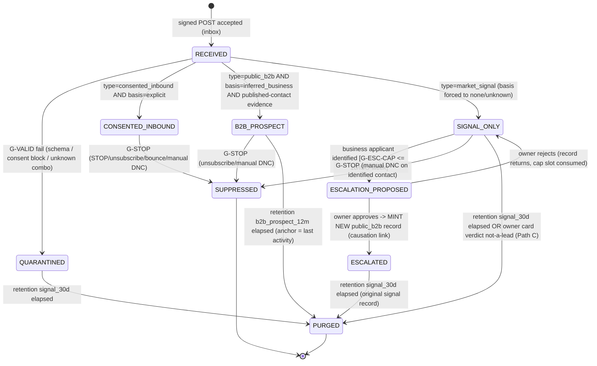
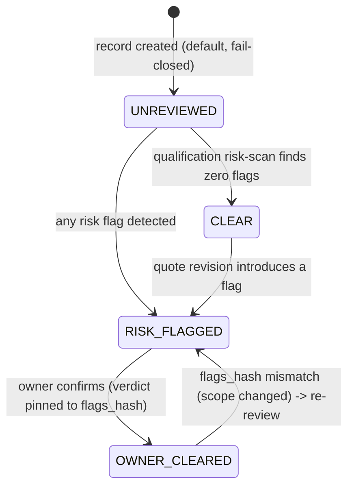

# 05 — CONSENT & COMPLIANCE STATE MACHINE (Trust Engine P0, Phase B)
**Version:** 1.0 · **Date:** 2026-07-21 · **Status:** DESIGN — propose-only، تا تأییدِ مالک هیچ کدی نوشته نمی‌شود
**Governing docs:** `00_MASTER_BLUEPRINT.md` §4/§9 · `lead_inbox/LEAD_INBOX_SPEC.md` §1–§3/§8 · `OPUS_MISSION_PROMPT.md` (invariants) · `RUNTIME-TRUTH-RECONCILE-2026-07-21.md`
**Ground truth:** firewallِ رضایت امروز **صفر occurrence** در `_ops/*.py` دارد (RUNTIME-TRUTH §0) — این سند طراحیِ greenfieldِ همان دیوارِ باربر است، ولی هر نقطهٔ enforcement روی artifactِ موجودِ file:line پین شده تا بازاختراع نشود.

---

## 0. اصولِ حاکم (غیرقابل مذاکره)

1. **Fail-closed در هر شاخه.** نبودِ داده = رد. خطا = رد. flag خاموش = رد. مهم: قراردادِ رایجِ codebase «flag خاموش → no-op» است (`lead_outcome_recorder.py:43`، `verdict_recorder.py:109`)؛ برای ماژولِ **اجازه‌دهنده** این قرارداد باید **وارونه** شود: `may_draft()`/`may_release()` با flag خاموش **`(False, "flag-off")`** برمی‌گردانند، نه skip.
2. **`market_signal` هرگز و از هیچ مسیری `outreach_allowed=true` نمی‌شود** — سه‌لایه: schema CHECK + بازمحاسبهٔ کد + تست. escalation یک رکوردِ **جدید** می‌سازد، رکوردِ signal را mutate نمی‌کند (§5).
3. **Suppression از همه‌چیز جان به در می‌برد** — از purge، از escalation، از رضایتِ جدیدِ ادعایی. چکِ suppression **قبل از هر draft** است، نه فقط قبل از send.
4. **فقط سه actor حقِ transition دارند:** `inbox` (کد، خودکار، طبق قواعدِ قطعی)، `owner` (رأیِ تلگرامی/دستور)، `retention-job` (beatِ گیت‌شده). producerها (n8n، /lead، هر بیرونی) **هیچ** transition‌ای نمی‌نویسند — فقط payload تحویل می‌دهند. (سابقهٔ همین الگو: `attribution.py:8-10` — CONFIRMED را فقط `reconcile-job` می‌نویسد.)
5. **رأیِ مالک روی کارت ≠ اجازهٔ ارسال.** مسیرِ فعلیِ `prop:` (`live_loop.py:308-315`) عمداً از schemeِ `app:` جداست و measurement-only است (`verdict_recorder.py:9-17`). ماشینِ consent فقط **predicate** به ماشینِ funnel (سند 06) می‌دهد؛ ارسال همیشه از verdict→LANGAR→EffectorGate (`chrono.py:397-414`, دست‌نخورده) می‌گذرد.
6. **stdlib-only، append-only، ASCII identifiers، پشتِ flagهای default-off.**

---

## 1. ماشینِ اصلی — consent_state (per lead record)

### 1.1 States

| state | معنی | absorbing? | outreach_allowed |
|---|---|---|---|
| `RECEIVED` | submissionِ امضاشده پذیرفته شد؛ هنوز کلاس‌بندی نشده (transient — فقط داخلِ تراکنشِ inbox) | نه | 0 (پیش‌فرضِ سخت) |
| `QUARANTINED` | payload نامعتبر/غیرقابل‌راستی‌آزمایی؛ هرگز silent-drop (SPEC §0) | نیمه (فقط → PURGED) | 0 |
| `CONSENTED_INBOUND` | `candidate_type=consented_inbound` + `consent_basis=explicit` | نه | 1 (پس از derive، §4.1) |
| `B2B_PROSPECT` | `candidate_type=public_b2b` + `consent_basis=inferred_business` + evidenceِ contactِ منتشرشدهٔ role-relevant | نه | 1 مشروط (فقط مسیرِ گیت‌شده/capped مادول ۱) |
| `SIGNAL_ONLY` | `candidate_type=market_signal`؛ سوخت targeting/digest. **A signal is not a lead.** | نه | 0 — ساختاراً غیرممکن است 1 شود |
| `ESCALATION_PROPOSED` | signal با آدرسِ بیزنسیِ منتشرشده؛ در کارتِ digest هفتگی منتظرِ رأی مالک | نه | 0 (هنوز signal است) |
| `ESCALATED` | مالک approve کرد → رکوردِ **جدیدِ** `public_b2b` mint شد؛ رکوردِ signal بسته | بله | 0 (روی رکوردِ signal برای همیشه) |
| `SUPPRESSED` | STOP / unsubscribe / bounce / manual DNC روی contactِ این رکورد | بله (خروج فقط عملیاتِ owner روی جدولِ suppression، نه این رکورد — §6.3) | 0 |
| `PURGED` | retention منقضی؛ محتوا tombstone شد، شناسه/هش/eventها ماندند | بله | 0 |

### 1.2 Diagram



قاعدهٔ سراسری (در دیاگرام تکرار نشده تا شلوغ نشود): **هیچ** یالی به‌سوی «outreach» وجود ندارد — outreach حالت نیست، **predicate** است (§4) و فقط ماشینِ funnel (06) آن را مصرف می‌کند.

### 1.3 Transition table (exhaustive — هر جفتِ خارج از این جدول = invalid و راise/alert)

| # | from | to | trigger | guard(s) | actor (تنها نویسندهٔ مجاز) | event emitted |
|---|---|---|---|---|---|---|
| T1 | `[*]` | `RECEIVED` | POST امضاشده از مرزِ `/api/v1/lead-candidates` پذیرفته شد | HMAC+ts+nonce+idempotency+allowlist (سند 07) | `inbox` | `lead.candidate.received` |
| T2 | `RECEIVED` | `QUARANTINED` | schema fail / consent block ناقص / ترکیبِ ناشناخته | G-VALID (§4.2) — هر ابهام = این شاخه | `inbox` | `lead.candidate.rejected` + `consent.quarantined` |
| T3 | `RECEIVED` | `CONSENTED_INBOUND` | کلاس‌بندی | G-VALID pass + `type=consented_inbound` + `basis=explicit` + evidence موجود | `inbox` | `consent.classified` |
| T4 | `RECEIVED` | `B2B_PROSPECT` | کلاس‌بندی | G-VALID pass + `type=public_b2b` + `basis=inferred_business` + `evidence=office_contact_conspicuously_published` | `inbox` | `consent.classified` |
| T5 | `RECEIVED` | `SIGNAL_ONLY` | کلاس‌بندی | `type=market_signal` → basis به `none|unknown` **اجبار** می‌شود؛ contactِ residential اگر همراه بود، فقط hash نگه داشته می‌شود | `inbox` | `consent.classified` |
| T6 | `SIGNAL_ONLY` | `ESCALATION_PROPOSED` | digestِ هفتگی: applicant/builder = بیزنسِ قابل‌شناسایی با contactِ منتشرشده | **G-ESC-CAP**: شمارِ `consent.escalation.proposed` در ISO-weekِ جاری < 10؛ سقف پر → refuse + alert card (بدونِ صف‌شدنِ خودکار برای هفتهٔ بعد) | `inbox` (تولیدِ کارت) | `consent.escalation.proposed` |
| T7 | `ESCALATION_PROPOSED` | `ESCALATED` | رأی approve مالک روی کارتِ digest | verdict idempotent (اولین تصمیم برنده — الگوی `live_loop.py:429-446`) | `owner` | `consent.escalation.approved` + `lead.candidate.received` (رکوردِ نوی public_b2b با `causation_id` = event تأیید) |
| T8 | `ESCALATION_PROPOSED` | `SIGNAL_ONLY` | رأی reject مالک | idempotent | `owner` | `consent.escalation.rejected` |
| T9 | `CONSENTED_INBOUND` \| `B2B_PROSPECT` \| `SIGNAL_ONLY` | `SUPPRESSED` | STOP reply / unsubscribe / hard bounce / `/dnc` مالک / complaint | G-STOP (§6) — **بدونِ گیتِ مالک** اجرا می‌شود (جهتِ fail-closed: سلب توانایی نیاز به تأیید ندارد) + insert در جدولِ `suppression` | `inbox` (خودکار) یا `owner` (دستور) | `consent.suppressed` |
| T10 | `SIGNAL_ONLY` \| `QUARANTINED` \| `ESCALATED` | `PURGED` | anchor + 30 روز (signal_30d)؛ یا Path C: verdict «not a lead» → purge فوری | G-RETENTION (§7)؛ STOP/halt/pause مقدم (الگوی `wiring.py:1815-1822`) | `retention-job` | `consent.retention.purged` |
| T11 | `B2B_PROSPECT` | `PURGED` | آخرین activity + 12 ماه (b2b_prospect_12m) | G-RETENTION | `retention-job` | `consent.retention.purged` |
| T12 | `SUPPRESSED` | `SUPPRESSED` (content purge درجا) | retention همان کلاسِ قبلی | ردیفِ suppression **هرگز** purge نمی‌شود؛ فقط محتوای رکوردِ لید tombstone می‌شود (`purged=1`) | `retention-job` | `consent.retention.purged` |

**Transitionهای ممنوعِ صریح (تستِ نگهبان دارد):** `SIGNAL_ONLY→CONSENTED_INBOUND`، `SIGNAL_ONLY→B2B_PROSPECT` (فقط از راهِ T6/T7 با mintِ رکوردِ نو)، `B2B_PROSPECT→CONSENTED_INBOUND` (بیزنسِ عمومی هرگز رضایتِ residential نمی‌شود — تستِ الزامیِ #8 در OPUS prompt)، `SUPPRESSED→هر چیزی`، `PURGED→هر چیزی`، و هر transition با actorِ غیرمجاز.

---

## 2. ماشینِ overlay — compliance_state (orthogonal، per lead record)

مرجع: R4 بلوپرینت + §9.6 (licence >$5k residential، lead paint، asbestos، waterproofing، electrical، plumbing، working-at-heights/rope، mould — **flagged، هرگز auto-cleared**).

### 2.1 States & diagram



### 2.2 Transition table

| # | from | to | trigger | guard | actor | event |
|---|---|---|---|---|---|---|
| C1 | `[*]` | `UNREVIEWED` | ساختِ رکورد | — (پیش‌فرضِ سخت: UNREVIEWED = send blocked) | `inbox` | (در `consent.classified` گنجانده) |
| C2 | `UNREVIEWED` | `CLEAR` | risk-scanِ qualification صفر flag | لیستِ flag قطعی/deterministic — LLM هرگز flag برنمی‌دارد، فقط می‌تواند اضافه کند | `inbox` (qualification leg) | `compliance.cleared_scan` |
| C3 | `UNREVIEWED`/`CLEAR` | `RISK_FLAGGED` | هر flagِ risk: `licence_over_5k_residential`, `lead_paint`, `asbestos`, `waterproofing`, `electrical`, `plumbing`, `working_at_heights`, `mould` | detection deterministic — هستهٔ موجود: `lead_quote.lead_to_intake` (`lead_quote.py:107-110` — heritage/lead_paint/asbestos) که این لیست آن را **گسترش** می‌دهد؛ ابهام (مثلاً ارزشِ کار unknown و residential external) = flag `licence_uncertain` → همین شاخه (fail-closed) | `inbox` | `compliance.flagged` (payload: flags + `flags_hash`) |
| C4 | `RISK_FLAGGED` | `OWNER_CLEARED` | verdictِ صریحِ مالک روی کارتِ hold («مجوز دارم / این scope مجاز است») | verdict به `flags_hash` پین می‌شود؛ idempotent | `owner` | `compliance.cleared` (payload: flags_hash, reference) |
| C5 | `OWNER_CLEARED` | `RISK_FLAGGED` | revisionِ quote → flags تغییر (`flags_hash` جدید) | re-scan روی هر `revise_quote` (`lead_quote.py:214`) | `inbox` | `compliance.flagged` |

**اثر:** drafting و کارتِ مالک **مجازند** در هر compliance state (کارت وضعیتِ hold را نشان می‌دهد: `quote_status=REQUIRES_LICENCE_REVIEW`)؛ **releaseِ اثرِ بیرونی فقط در `CLEAR` یا `OWNER_CLEARED`** (predicate §4.4). این دقیقاً برانچِ fail-closedِ R4 است: «uncertain → REQUIRES_LICENCE_REVIEW، external send blocked until Owner confirms».

---

## 3. Storage (الگوی موجودِ `_ops` — SQLite/WAL + append-only + idempotency)

فایل: `_ops/state/lead-trust/consent.db` — مسیر env-first مثل `outcome_store._default_path` (`outcome_store.py:59-62`). سبک: همان `outcome_store.py:65-107` — `PRAGMA journal_mode=WAL`، `threading.RLock` single-writer، `INSERT OR IGNORE` روی `idempotency_key UNIQUE`، `schema_version`، `close()` صریح (ضدِ نشتِ WAL ویندوز، `wiring.py:1795`).

```sql
-- append-only: تنها منبعِ حقیقت؛ consent_current از این بازساختنی است (replay)
CREATE TABLE IF NOT EXISTS consent_events(
  event_id        TEXT PRIMARY KEY,
  idempotency_key TEXT UNIQUE NOT NULL,          -- "<lead_id>|<event_type>|<to_state>|<flags_hash?>"
  lead_id         TEXT NOT NULL,
  event_type      TEXT NOT NULL,                  -- consent.* | compliance.* (allowlist در کد، الگوی outcome_store.py:27-28)
  from_state      TEXT, to_state TEXT,
  actor           TEXT NOT NULL CHECK(actor IN ('inbox','owner','retention-job')),
  occurred_at     TEXT NOT NULL, recorded_at TEXT NOT NULL,
  causation_id    TEXT, correlation_id TEXT,
  schema_version  INTEGER NOT NULL,
  payload_json    TEXT);

-- materialized current-state: چکِ سریعِ predicateها؛ هر ردیف با replay قابلِ بازسازی
CREATE TABLE IF NOT EXISTS consent_current(
  lead_id            TEXT PRIMARY KEY,
  candidate_type     TEXT NOT NULL CHECK(candidate_type IN ('consented_inbound','public_b2b','market_signal')),
  consent_basis      TEXT NOT NULL CHECK(consent_basis IN ('explicit','inferred_business','none','unknown')),
  consent_evidence   TEXT,
  compliance_reason  TEXT,
  consent_state      TEXT NOT NULL CHECK(consent_state IN
      ('RECEIVED','QUARANTINED','CONSENTED_INBOUND','B2B_PROSPECT','SIGNAL_ONLY',
       'ESCALATION_PROPOSED','ESCALATED','SUPPRESSED','PURGED')),
  compliance_state   TEXT NOT NULL DEFAULT 'UNREVIEWED' CHECK(compliance_state IN
      ('UNREVIEWED','CLEAR','RISK_FLAGGED','OWNER_CLEARED')),
  risk_flags_json    TEXT NOT NULL DEFAULT '[]',
  flags_hash         TEXT,
  outreach_allowed   INTEGER NOT NULL DEFAULT 0 CHECK(outreach_allowed IN (0,1)),
  retention_class    TEXT NOT NULL CHECK(retention_class IN ('consented_customer','b2b_prospect_12m','signal_30d')),
  retention_anchor_at TEXT NOT NULL,
  source_channel     TEXT NOT NULL,               -- شامل 'synthetic_test' (G-SYNTH)
  purged             INTEGER NOT NULL DEFAULT 0,
  updated_at         TEXT NOT NULL,
  -- ═══ THE STRUCTURAL FIREWALL (لایهٔ ۱ از ۳) ═══
  CHECK (NOT (candidate_type='market_signal'          AND outreach_allowed=1)),
  CHECK (NOT (consent_basis IN ('none','unknown')     AND outreach_allowed=1)),
  CHECK (NOT (consent_state IN ('SUPPRESSED','PURGED','QUARANTINED','RECEIVED',
              'SIGNAL_ONLY','ESCALATION_PROPOSED','ESCALATED') AND outreach_allowed=1)),
  CHECK (NOT (candidate_type='public_b2b' AND consent_basis<>'inferred_business' AND outreach_allowed=1)));

-- suppression: هرگز purge نمی‌شود؛ lift فقط ستونِ nullable + eventِ append-only
CREATE TABLE IF NOT EXISTS suppression(
  channel_value_norm TEXT PRIMARY KEY,             -- phone نرمال‌شده (E.164) یا email lowercase
  channel_kind       TEXT NOT NULL CHECK(channel_kind IN ('phone','email')),
  reason             TEXT NOT NULL CHECK(reason IN ('stop_reply','unsubscribe','bounce','manual_dnc','complaint')),
  source_event_id    TEXT,
  created_at         TEXT NOT NULL,
  lifted_at          TEXT,                          -- NULL = active؛ فقط owner (§6.3، پشت flag جدا)
  lifted_event_id    TEXT);
```

**Retention/purge = tombstone درجا، نه حذفِ فایل:** purge یعنی فیلدهای محتوایی (contact/scope_text/raw payload/photos-refs) با `{purged_at, retention_class}` جایگزین و `purged=1`؛ event و شناسه‌ها و هش‌ها می‌مانند. این هم قانونِ «هرگز حذف نکن»ِ vault را نگه می‌دارد هم الزامِ privacy بلوپرینت §9.7 را. quarantine store (فایل‌های JSONL خام) هم در همان clock سایدکارِ tombstone می‌گیرد — الگوی `_move_with_sidecar` موجود (`lead_sense.py:104-119`).

---

## 4. Predicates — سطحِ تماسِ consent با بقیهٔ خط لوله (فقط دو تابع)

ماژولِ جدید: `_ops/legs/consent_gate.py` (stdlib-only). **همهٔ** مصرف‌کننده‌ها فقط این دو را صدا می‌زنند؛ هیچ Leg مستقیماً جدول را نمی‌خواند.

### 4.1 derive — `outreach_allowed` هرگز از producer پذیرفته نمی‌شود

```python
def derive_outreach_allowed(rec: dict) -> bool:
    """Recompute from parts; NEVER trust stored/submitted value. Pure, deterministic."""
    t, b = rec.get("candidate_type"), rec.get("consent_basis")
    if t == "consented_inbound" and b == "explicit" and rec.get("consent_evidence"):
        return True
    if (t == "public_b2b" and b == "inferred_business"
            and rec.get("consent_evidence") == "office_contact_conspicuously_published"):
        return True
    return False           # market_signal / none / unknown / هر چیزِ دیگر → False
```
inbox در T3/T4/T5 این را حساب و ذخیره می‌کند؛ فیلدِ ارسالیِ producer فقط برای audit لاگ می‌شود (mismatch → alert). این **لایهٔ ۲** firewall است (لایهٔ ۱ = CHECKهای SQL، لایهٔ ۳ = تست‌های §8).

### 4.2 G-VALID (کلاس‌بندی، fail-closed)
ترکیبِ معتبر فقط سه‌تاست (T3/T4/T5). هر چیزِ دیگر — از جمله `consented_inbound` بدونِ evidence، `public_b2b` با basis غیرِ `inferred_business`، `retention_class` ناسازگار با type — → `QUARANTINED`. جدولِ نگاشتِ اجباریِ retention: `consented_inbound→consented_customer`، `public_b2b→b2b_prospect_12m`، `market_signal→signal_30d` (producer نمی‌تواند کلاسِ بلندتر بخرد).

### 4.3 `may_draft(lead_id)` — قبل از **هر** draft (سؤالِ اصلیِ این سند)

```python
def may_draft(lead_id: str) -> tuple[bool, str]:
    if not flag_on("OCTOPUS_WIRE_CONSENT_FW"): return (False, "flag-off")      # وارونهٔ fail-soft
    rec = load_current(lead_id)
    if rec is None or rec["purged"]:            return (False, "no-record")
    if rec["consent_state"] not in ("CONSENTED_INBOUND", "B2B_PROSPECT"):
        return (False, f"state:{rec['consent_state']}")
    if not derive_outreach_allowed(rec):        return (False, "consent-derivation")
    hit = suppression_hit(rec)                   # نرمال‌سازی phone/email → lookup؛ خطا/ابهام = hit
    if hit:                                      return (False, f"suppressed:{hit}")
    return (True, "ok")
```
**جای‌گذاری (before ANY draft):** (1) صدرِ qualification — در `wiring.lead_discovery_beat` قبل از `scorer.score(lead)` (`wiring.py:1840`)؛ (2) صدرِ `lead_quote.create_quote` (`lead_quote.py:129`) و صدرِ درفتِ first-response (نیمهٔ غایبِ P0-3)؛ (3) دوباره در `may_release` (defense-in-depth). scoring بدونِ pass این predicate اصلاً شروع نمی‌شود — پس متن/PII واردِ هیچ prompt/کارتی هم نمی‌شود.

### 4.4 `may_release(lead_id, effect_kind)` — قبل از ساختِ gated effect

```python
def may_release(lead_id: str, effect_kind: str) -> tuple[bool, str]:
    ok, why = may_draft(lead_id)
    if not ok:                                   return (False, why)
    rec = load_current(lead_id)
    if rec["source_channel"] == "synthetic_test": return (False, "synthetic-hard-block")   # G-SYNTH
    if rec["compliance_state"] not in ("CLEAR", "OWNER_CLEARED"):
        return (False, f"compliance:{rec['compliance_state']}")                            # G-LICENCE
    if not effect_kind.startswith("lead.outbound."): return (False, "kind-not-allowlisted")
    return (True, "ok")
```
این wrapper (`lead_effect_gate.py`، جدید) **تنها** جایی است که کدِ لید حقِ `EffectorGate.request()` دارد؛ خودِ `chrono.EffectorGate` (`chrono.py:344-414`) **دست نمی‌خورد** — settle همچنان LANGAR-append + STOP/FREEZE/halt را fail-closed چک می‌کند (`chrono.py:397-410`). G-SYNTH دولایه است: (a) این wrapper برای `synthetic_test` هرگز effect نمی‌سازد؛ (b) workerِ outboundِ آینده allowlistِ kind دارد و `lead.synthetic.*` در آن نیست — پس حتی اگر رکوردی جعل شود، هیچ effectorای آن type را اجرا نمی‌کند.

---

## 5. Escalation — `market_signal → public_b2b` (owner-gated، سقف 10/هفته)

1. **رکوردِ signal هرگز mutate نمی‌شود.** approve مالک (T7) یک submissionِ **جدید** با `candidate_type=public_b2b` از داخلِ inbox می‌سازد (همان مسیرِ T1→T4، `causation_id` = eventِ approve، contact = فقط آدرسِ بیزنسیِ منتشرشده — نه هیچ دادهٔ homeownerی). رکوردِ نو retention `b2b_prospect_12m` می‌گیرد؛ رکوردِ signal در `ESCALATED` بسته و سرِ 30 روز purge می‌شود.
2. **G-ESC-CAP:** قبل از emit کردنِ `consent.escalation.proposed`، شمارش از خودِ `consent_events` (append-only → قابلِ replay، همان فلسفهٔ `outcome_store.metrics` `outcome_store.py:126-145`): `COUNT(*) WHERE event_type='consent.escalation.proposed' AND iso_week(occurred_at)=current` — نتیجه `>=10` → refuse + کارتِ alert («سقفِ escalation این هفته پر شد»). rejectِ مالک slot را پس **نمی‌دهد** (محافظه‌کارانه، ضدِ churn).
3. مصرف‌کنندهٔ نتیجه: صفِ outreachِ مادول ۱ فقط رکوردهای `B2B_PROSPECT` می‌بیند؛ capهای خودش (5 agency/day و…) جدا و افزوده‌اند.

---

## 6. STOP / unsubscribe / suppression

### 6.1 ورودی‌های suppression (T9)
| منبع | مسیر | actor |
|---|---|---|
| SMS reply «STOP» (وقتی providerِ آینده وصل شد) | provider callback → مرزِ امضاشده → inbox | `inbox` |
| لینکِ unsubscribe در ایمیلِ B2B | همان مرز | `inbox` |
| hard bounce / complaint | همان مرز | `inbox` |
| دستورِ مالک `/dnc <phone|email>` | مسیرِ فرمانِ تلگرامِ موجود (whitelistِ owner در `approval_channel`؛ الگوی dispatch در `langar_bridge.py:128-164`) | `owner` |

suppression insert **گیتِ مالک نمی‌خواهد** (سلبِ capability = جهتِ امن) و **همزمان** consent_state رکورد(های) دارای همان contact را به `SUPPRESSED` می‌برد. چون workerِ outbound امروز MISSING است (RUNTIME-TRUTH ردیف 15)، مسیرِ `/dnc` + bounce دستی از روزِ اول کار می‌کند؛ callbackِ provider بعداً به همان جدول می‌ریزد.

### 6.2 چکِ suppression — placement
- **قبل از هر draft** — داخلِ `may_draft` (§4.3)؛ یعنی قبل از scoring، قبل از prompt، قبل از کارت. (SPEC §2: «checked before ANY proposal is even drafted».)
- دوباره در `may_release` — بین verdict مالک و ساختِ effect (فاصلهٔ زمانیِ کارت-تا-تأیید ممکن است STOP بیاورد).
- مقادیرِ suppression هرگز در کارت/لاگ echo نمی‌شوند — الگوی redactionِ موجود `live_loop._safe_card_text` (`live_loop.py:270-276`).

### 6.3 lift (خروج از suppression)
هیچ مسیرِ خودکاری وجود ندارد. فقط مالک، فقط با فرمانِ صریح، فقط پشتِ `OCTOPUS_WIRE_CONSENT_UNSUPPRESS` (default-off)، و فقط به‌صورتِ `lifted_at` + event (ردیف حذف نمی‌شود). رکوردهای لیدِ قبلاً `SUPPRESSED` برنمی‌گردند — inboundِ جدیدِ همان شخص رکوردِ تازه می‌سازد.

---

## 7. Retention classes & purge

| class | anchor | عمر | purge semantics |
|---|---|---|---|
| `signal_30d` | `received_at` (Path C: بستنِ کارت «not a lead» → فوری) | 30 روز | tombstone محتوایی (§3)؛ aggregate/شمارنده‌های بدونِ PII می‌مانند |
| `b2b_prospect_12m` | آخرین eventِ activity همان lead_id | 12 ماه | tombstone؛ ردیفِ suppression (اگر هست) می‌ماند |
| `consented_customer` | — | تا درخواستِ حذف (فرمانِ مالک) یا پایانِ رابطه؛ auto-purge ندارد | حذفِ درخواستی = همان tombstone + event |

`consent_retention_beat` (در `wiring.py`، دقیقاً الگوی `lead_discovery_beat` `wiring.py:1804-1825`): flag خاموش → None؛ `leg_paused` → None؛ `STOP_ORGANISM/halted` → None؛ سپس `SELECT ... WHERE purged=0 AND retention_due` batch-limited، هر purge یک event. idempotent — اجرای دوباره ردیفِ purged را دوباره لمس نمی‌کند.

---

## 8. Enforcement-point map (کدام مؤلفه کدام guard را اجرا می‌کند)

| Guard | نقطهٔ اجرا | artifactِ موجود که extend می‌شود (file:line) | نوعِ کار |
|---|---|---|---|
| HMAC/nonce/idempotency/allowlist | مرزِ `/api/v1/lead-candidates` | — (MISSING، RUNTIME-TRUTH ردیف 2) | ساختِ نو (سند 07) |
| G-VALID + کلاس‌بندی + quarantine (T2–T5) | LeadInboxLeg | همگراییِ دو inboxِ متناقض: `lead_leg_inbox.py:86` (dead) + `lead_sense.py:76` — طبق RUNTIME-TRUTH §4.3 **یکی** می‌شوند؛ الگوی atomic-write `lead_leg_inbox.py:66-80` و move-with-sidecar `lead_sense.py:104-119` بازمصرف | wiring + گسترش |
| CHECKهای schema (لایهٔ ۱ firewall) | `consent_store.py` (نو) | الگوی کامل: `outcome_store.py:65-107` (WAL/RLock/UNIQUE/INSERT-OR-IGNORE/allowlistِ event) | ساختِ نو با الگوی موجود |
| `derive_outreach_allowed` (لایهٔ ۲) | `consent_gate.py` (نو، pure function) | تست‌پینِ سبکِ `lead_scorer` (تابعِ خالص، `lead_scorer.py:236`) | ساختِ نو |
| G-SUPPRESS pre-draft | صدرِ qualification + صدرِ هر draft | `wiring.py:1840` (قبل از `scorer.score`) · `lead_quote.py:129` (`create_quote`) · نیمهٔ first-responseِ آیندهٔ P0-3 | wiring |
| G-LICENCE detection | qualification/quote | `lead_quote.lead_to_intake` (`lead_quote.py:107-110`) — لیستِ risk از ۳ به ۸ flag گسترش + `flags_hash`؛ re-scan در `revise_quote` (`lead_quote.py:214`) | گسترش |
| G-LICENCE hold on send | `lead_effect_gate.may_release` | کارت hold را نشان می‌دهد — رندرِ کارتِ موجود `live_loop._proposal_card` (`live_loop.py:279`) | ساختِ نو + wiring |
| G-ESC-CAP | digestِ هفتگیِ Path B | شمارش از `consent_events` (فلسفهٔ replayِ `outcome_store.metrics` `outcome_store.py:126`) | ساختِ نو |
| G-STOP intake | فرمانِ `/dnc` + مرزِ امضاشده | dispatchِ فرمانِ تلگرامِ موجود (الگوی `langar_bridge.dispatch` `langar_bridge.py:128`؛ whitelistِ owner از قبل در approval_channel) | wiring |
| G-SYNTH | `lead_effect_gate` + allowlist kindِ workerِ آینده | `chrono.EffectorGate` دست‌نخورده؛ settle fail-closed موجود (`chrono.py:397-414`) | ساختِ نو (wrapper) |
| G-RETENTION | `consent_retention_beat` | الگوی کاملِ گارد-ترتیب: `wiring.py:1815-1822` (flag→pause→STOP→cadence) | ساختِ نو با الگوی موجود |
| جداییِ verdict-سنجشی از تأییدِ اثر | بدونِ تغییر | `verdict_recorder.py:26-33` (allowlist + `_FORBIDDEN_EVENT`) · schemeِ `prop:` جدا از `app:` (`live_loop.py:308-315`) | حفظ — از قبل درست است |
| STOP/FREEZE/halt ارشد بر همه | بدونِ تغییر | `chrono.py:358-367` `force_closed` | حفظ |

**Flagهای جدید (همه default-off، قراردادِ `OCTOPUS_WIRE_*`):** `OCTOPUS_WIRE_CONSENT_FW` (master — خاموش = **deny**، نه skip)، `OCTOPUS_WIRE_CONSENT_RETENTION`، `OCTOPUS_WIRE_CONSENT_ESCALATION`، `OCTOPUS_WIRE_CONSENT_UNSUPPRESS`. هیچ‌کدام واردِ PAPER_FULL_FLAGS نمی‌شوند؛ فعال‌سازی = رأیِ صریحِ مالک (invariant 10).

---

## 9. لایهٔ ۳ firewall — تست‌های نگهبان (حداقلِ الزامی)

| # | تست | پوششِ الزامِ OPUS prompt |
|---|---|---|
| t1 | insertِ `market_signal` با `outreach_allowed=1` → `sqlite3.IntegrityError` | REQUIRED TEST 7 |
| t2 | truth-tableِ کاملِ `derive_outreach_allowed` — همهٔ ۱۶+ ترکیب؛ `none/unknown` همیشه False | REQUIRED TEST 6 |
| t3 | `may_draft` با flag خاموش → `(False,"flag-off")` (تستِ وارونگیِ fail-closed) | invariant fail-closed |
| t4 | contactِ suppressed → `may_draft=False` حتی برای `CONSENTED_INBOUND`؛ بعد از purgeِ رکورد هم ردیفِ suppression پابرجا | §2 SPEC |
| t5 | STOP → insert → کاندیدِ بعدیِ همان phone در همهٔ مسیرها بلاک | compliance §9.1 بلوپرینت |
| t6 | escalation یازدهم در یک ISO-week → refuse + event شمارش‌پذیر | cap 10/wk |
| t7 | `compliance_state=RISK_FLAGGED` → `may_release=False`؛ `OWNER_CLEARED` با `flags_hash` کهنه → False | R4 fail-closed |
| t8 | `public_b2b` بدونِ evidenceِ منتشرشده → outreach False (بیزنس ≠ رضایتِ residential) | REQUIRED TEST 8 |
| t9 | `synthetic_test` تا کارت می‌رود، `may_release=False`؛ هیچ `gated_effect` ساخته نمی‌شود | milestone 1 بلوپرینت |
| t10 | replayِ همان eventِ consent (همان idempotency_key) → یک ردیف | REQUIRED TEST 5-همتا |
| t11 | exhaustiveness: هر transitionِ خارج از جدولِ §1.3/§2.2 یا با actorِ غلط → reject + alert (نه silent) | invariant 11 |
| t12 | purgeِ `signal_30d`: محتوا tombstone، eventها و aggregate می‌مانند؛ اجرای دوم no-op | §7 |
| t13 | بازسازیِ `consent_current` از replayِ `consent_events` == جدولِ زنده (بایت‌به‌بایت روی فیلدهای state) | append-only SoT |
| t14 | تستِ ast/import: هیچ ماژولِ لید به‌جز `lead_effect_gate` حقِ importِ `EffectorGate` ندارد (الگوی نگهبانِ `approval_store.py:37-44` و ناوردیِ ساختاریِ `outcome_store.py:8`) | single send path |

---

## 10. تصمیم‌های باز برای مالک (سند 10 ارجاع می‌دهد)
1. **ذخیرهٔ مقدارِ suppression:** plain نرمال‌شده (استانداردِ صنعتی، لازم برای تطبیق) یا hash-only (privacy بیشتر، تطبیقِ فقط-دقیق)؟ پیش‌فرضِ طراحی: plain + ممنوعیتِ echo.
2. **`OCTOPUS_WIRE_CONSENT_UNSUPPRESS`:** اصلاً ساخته شود یا مسیرِ lift فقط دستی-در-DB بماند؟ پیش‌فرض: ساخته ولی خاموش.
3. **مرزِ هفتهٔ escalation:** ISO-week به وقتِ Sydney؟ پیش‌فرض: بله (`Australia/Sydney`).
4. **rejectِ escalation و slotِ cap:** پس داده شود یا نه؟ پیش‌فرضِ طراحی: نه (محافظه‌کار).
5. **SLAِ حذفِ درخواستیِ `consented_customer`:** فوری در beatِ بعدی؟ پیش‌فرض: بله.

---
*این سند contract است، نه کد. اجرای آن فقط پس از review مالک، در worktree ایزوله، پشتِ flagهای خاموش (Phase C).*
