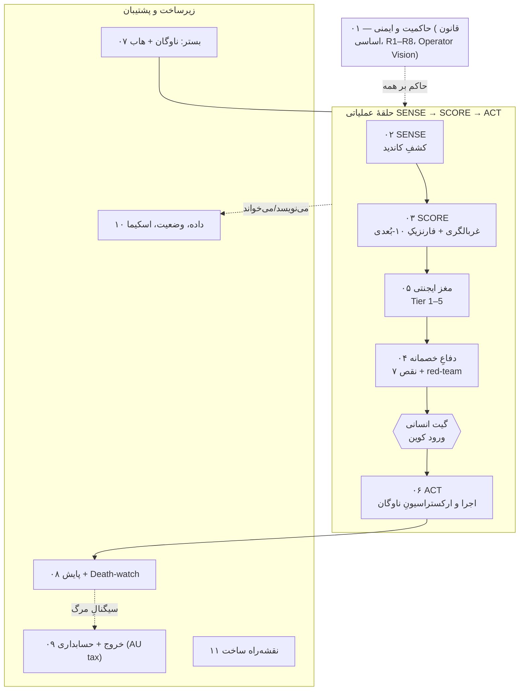

# ۰۰ — MASTER: معماری کاملِ Coin Hunter Bot (Autonomous Accumulator)

> **این سندِ ورودی است.** نقشهٔ کلِ سیستم + آشتیِ دو واقعیت + محورِ Regime هزینه + جریان `SENSE → SCORE → ACT` + ماتریس اتوماسیون + فهرست یازده لایه. هر لایه یک نوتِ خواهر است؛ اینجا فقط لینک و یکپارچگی — کپیِ محتوا نه.

---

## ۱. یک‌خطی و تز

`[FACT]` جمع‌آوریِ سبدی از کوین‌های **تازه‌لانچِ CPU/ARM-mineable با mcap کوچک** و **hold بلندمدت (افق ۷ ساله «Venture Mining»)**، با لبهٔ ساختاریِ **برق تقریباً رایگان** روی ناوگانِ موجود. این یک ربات ترید نیست: **شکار می‌کند، غربال می‌کند، ماین می‌کند، نگه می‌دارد.** `[EST]` ~۹۰٪ کوین‌های frontier به صفر می‌رسند؛ مدل روی **سبد** برنده می‌شود، نه روی یک کوین — و تنها به‌شرطِ یک **فیلترِ بقایِ سخت**. گلوگاه، hashrate نیست؛ **کیفیت غربالگری** است.

---

## ۲. آشتیِ دو واقعیت (چرا این سند لازم شد)

`[FACT]` این پروژه تا امروز **دو لایهٔ موازیِ آشتی‌نکرده** داشت:

| | واقعیتِ A — طراحیِ غنیِ موجود | واقعیتِ B — منشورِ تازهٔ ایمنی (۲۰۲۶-۰۷-۱۴) |
|---|---|---|
| ماهیت | سیستمِ کاملِ «Coin Hunter Bot / Autonomous Accumulator»: حلقهٔ SENSE→SCORE→ACT، مغزِ چندلایهٔ LLM، پایپ‌لاین فنیِ SCOUT-B، هابِ Orange Pi، نقدِ عمیقِ ۷-نقصی | قواعدِ سخت‌گیرانه‌تر: AUD 0/ماه، CPU-only، binary isolation، key hygiene، Survival-Filter اجباری |
| نقصِ ضمنی | زیرساختِ **پولی**: Hetzner VPS + API متری = **‎$80–150/ماه** | فاقدِ جزئیاتِ اجرایی و پایپ‌لاین |

این سند این‌دو را در یک معماریِ واحد ادغام می‌کند: **بدنهٔ فنیِ A** روی **قیدهای ایمنیِ B**.

---

## ۳. محورِ Regime هزینه (تنها تصمیمِ بازِ کلان)

`[OPEN — نیازمند verdict آری]` طراحیِ اصلی روی خرجِ ماهانه بنا شده بود؛ منشورِ امروز صفرِ نقدی را قفل کرده. راهِ حل = **محور Regime** در هر لایه:

- **Regime A — رایگان/AUD-0 (پیش‌فرض و فعلاً binding):** همه‌چیز روی ناوگانِ خودِ اپراتور؛ بدون VPS، بدون API متری، بدون اشتراک، بدون خرید سخت‌افزار/کوین. مدل‌های LLM محلی (Ollama/Qwen) + **Claude تعاملیِ خودِ اپراتور** برای لایه‌های بالا (in-session، نه per-call metered). بکاپ روی سخت‌افزارِ آفلاینِ اپراتور.
- **Regime B — Managed/پولی (owner-gated، خاموش):** طرحِ Hetzner + API پولی؛ آپتایمِ ۲۴/۷ بهتر ولی `$80–150/ماه`؛ **فعال‌سازی = نقضِ R1 → verdict انسانی لازم.**

> قاعده: پیش‌فرض همیشه Regime A؛ هر جزءِ Regime B صریحاً `owner-gated OFF` علامت می‌خورد. هیچ وابستگیِ پولی به‌عنوان مسیرِ پیش‌فرض ارائه نمی‌شود.

---

## ۴. نقشهٔ لایه‌ها (C4-سبک)

`[SPEC]` سه **zoneِ ایزوله** (قلبِ R3/R4): **zone-1 ماشین اصلی/مغز** (فقط تحلیل) ⟂ **zone-2 ناوگانِ ماینینگ** (اجرای باینری، receive-only) ⟂ **zone-3 امضاکنندهٔ air-gapped** (تنها جایی که وجه حرکت می‌کند). هیچ کلید/seed از zone-3 خارج نمی‌شود؛ هیچ باینریِ ناشناخته وارد zone-1 نمی‌شود.

---

## ۵. جریانِ داده: چرخهٔ عمرِ یک کاندید

`[SPEC]` `کشف (۰۲)` → `triage گیت‌های سخت — Tier1 (۰۵)` → `دوسیهٔ شواهد ۱۰-بُعدی — Tier2 (۰۵/۰۳)` → `verdict + survival score — Tier3 (۰۵)` → `تأخیرِ ۷-روزهٔ LIMBO + red-team (۰۴)` → **`گیت انسانی (۰۱)`** → `تخصیصِ hashrate ≤۲۰٪ + sandbox — ACT (۰۶)` → `پایش + Death-watch (۰۸)` → `holding` → **`گیت انسانی خروج`** → `exit + حسابداریِ AU (۰۹)`. وضعیت‌ها در register: `screening → rejected | watchlist | approved → mining → holding → exited` ([[10 - DATA-STATE-and-SCHEMA]]).

---

## ۶. ماتریسِ مرزِ اتوماسیون (چه چیزی خودکار، چه چیزی گیت انسانی)

| اقدام | خودکار | Propose-then-approve | Hard-gate (verdict انسانی) |
|---|---|---|---|
| کشف/scrape/dedup کاندید | ✅ | | |
| triage و فارنزیک و تولید verdict | ✅ (فقط پیشنهاد) | | |
| به‌روزرسانیِ register/dataset/گزارش | ✅ | | |
| تنظیمِ `tactics.yaml`/پرامپت T1/T2 | | ✅ (T4 + approval) | |
| **ورودِ کوینِ جدید به سبد** | | | ⛔ |
| **اجرای هر باینریِ ماینر** | | | ⛔ (sandbox/build-from-source) |
| **هر تراکنش/spend/gas/withdraw** | | | ⛔ |
| **اتصال به کیف/سخت‌افزار** | | | ⛔ (ربات هرگز — R8) |
| **حذف/rename/جابه‌جاییِ فایل** | | | ⛔ (git mv + verdict) |

Kill-switch: هر ناهنجاری (CPU spike، اتصالِ خروجیِ ناشناخته، هشدارِ AV/EDR، رفتارِ عجیبِ wallet) → توقفِ فوریِ اتوماسیون + ثبت در DecisionLog.

---

## ۷. فهرستِ یازده لایه

| # | لایه | تمرکز |
|---|---|---|
| [[01 - GOVERNANCE-and-SAFETY]] | حاکمیت و ایمنی | قانون اساسی، R1–R8، D-rules، شش اصل، Operator Vision، گیت‌ها، kill-switch |
| [[02 - SENSE-Discovery-Layer]] | کشف / SENSE | منابع (CoinGecko، SRBMiner-diff، bitcointalk، MiningPoolStats، minerstat…)، cadence، intake |
| [[03 - SCORE-Screening-and-Forensics]] | غربالگری + فارنزیک | Tier1 گیت‌ها، دوسیهٔ ۱۰-بُعدی A–J، Survival-Filter scorecard، Death-watch |
| [[04 - Adversarial-Defense-and-Antifragility]] | دفاعِ خصمانه | ماتریسِ ۷ نقص→راه‌حل، red-team، ۷-day delay، too-good filter، cross-source triangulation |
| [[05 - AGENT-BRAIN-Decision-Layer]] | مغز ایجنتی | Tier 1–5، مدل per Regime، self-improvement guardrails، drift detection، harness |
| [[06 - ACT-Fleet-Execution-and-Orchestration]] | اجرا / ACT | swarm allocation ≤۲۰٪، بهینه‌سازیِ RK3588، Tailscale/pyinfra/XMRigCC/ESPHome، isolation |
| [[07 - SUBSTRATE-Fleet-Hub-and-Infra]] | بستر | رجیستریِ ناوگان (۱۶–۵۰ Pi + ESP32 + FPGA)، هابِ OPI، Regime infra، برق/حرارت |
| [[08 - MONITORING-Telemetry-and-Deathwatch]] | پایش | Beszel/XMRigCC/tg-ops، Death-watch خودکار، drift alerts، kill-switch |
| [[09 - EXIT-Liquidity-and-Accounting]] | خروج و حسابداری | معیارهای خروج، sizing آگاه به reflexivity، gate نقدینگی، دفترِ مالیاتِ AU |
| [[10 - DATA-STATE-and-SCHEMA]] | داده و اسکیما | outcome dataset (moat)، state machine، جداول، رمزنگاریِ سه‌لایه |
| [[11 - BUILD-ROADMAP-and-Sequencing]] | نقشه‌راه ساخت | توالیِ MVP→کامل، exit criteria هر فاز، گیتِ OQها، نقاطِ سوییچِ Regime |

---

## ۸. واژه‌نامهٔ کوتاه

- **edge-zone:** کوینی که برای ماینرِ متوسط بی‌سود ولی برای اپراتور (برقِ ارزان) سودده است → **سیگنالِ مثبت**.
- **survival score:** احتمالِ بقای کوین (نه پیش‌بینیِ قیمت)؛ معیارِ اصلیِ D2.
- **LIMBO:** حالتِ انتظارِ ۷-روزه برای فرار از bot-herd و پمپِ مصنوعی.
- **مثلثِ ایزوله:** ماشین اصلی ⟂ ناوگان ⟂ امضاکنندهٔ air-gapped.

---

## ۹. تصمیم‌های بازِ کلان (برای verdict آری)

1. **Regime هزینه** — پیش‌فرض A (AUD-0). آیا Regime B (پولی، ۲۴/۷) روزی فعال شود؟ → §۳.
2. **OQ-1..OQ-8** (تعداد واقعیِ ناوگان، بنچ H/s، VM/isolation، هزینهٔ برق، wallet، مالیاتِ AU، آستانه‌های خروج) هنوز باز و گیتِ فازهای [[11 - BUILD-ROADMAP-and-Sequencing]].
3. `04 - Research/Quantum Physics Dataset` — نسبتش با mining `[OPEN]`.

---

## منابع / Sources

- طراحیِ موجود: `01 - Docs/Bot System/{README, COWORK OPERATOR, tier2 forensics}.pdf` · `01 - Docs/Strategy & Roadmap/{CORE PRINCIPLES, roadmap-v3, CRITIQUE DEEP, SUMMARY, handoff, CPU Mining Quantum Resistance Plan}.pdf` · `data.txt`
- پایپ‌لاینِ فنی: [[03 - Projects/Mining/04 - Research/SCOUT-B|SCOUT-B]] (B1–B25، اغلب [Verified])
- بسترِ هاب: `01 - Docs/Orange Pi Automation System - 20 Projects/ARCHITECTURE_v2_Hybrid_Final.md`
- منشور و state: `CLAUDE.md` (منشورِ Mining)، [[03 - Projects/Mining/PROJECT|PROJECT]]، Coin Scouting Framework، Hardware Registry

> **یادداشتِ صداقتی:** این معماری EV منفی را مثبت نمی‌کند؛ کارش (۱) جلوگیری از ضررِ **غیرمالی** (آلودگیِ سیستم، سرقتِ کلید) و (۲) بالابردنِ **کیفیتِ بلیط‌ها**ست. این سند مشاورهٔ مالی/حقوقی/مالیاتی نیست.
