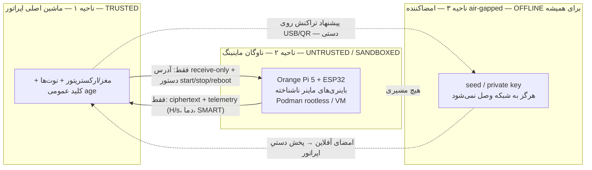
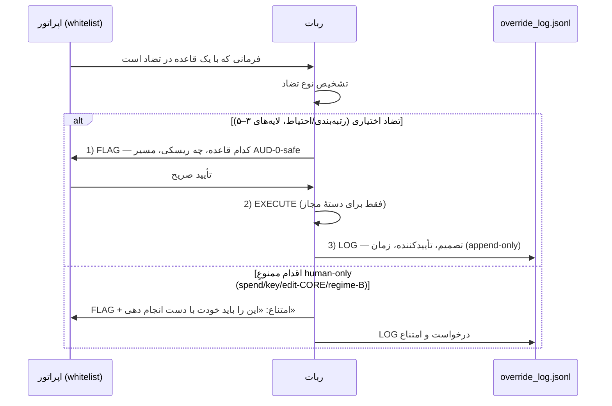

# لایه ۱ — حاکمیت و ایمنی (Governance & Safety) — قانون اساسی شکارچی کوین

این سند **قانون اساسی** سیستم است: منبع واحدِ حقیقت برای «چه چیزی مجاز است، چه چیزی هرگز، و چه کسی تصمیم می‌گیرد». هر لایهٔ دیگر ([[02 - SENSE-Discovery-Layer]]، [[03 - SCORE-Screening-and-Forensics]]، [[04 - Adversarial-Defense-and-Antifragility]]، [[05 - AGENT-BRAIN-Decision-Layer]]، [[06 - ACT-Fleet-Execution-and-Orchestration]]، [[07 - SUBSTRATE-Fleet-Hub-and-Infra]]، [[08 - MONITORING-Telemetry-and-Deathwatch]]، [[09 - EXIT-Liquidity-and-Accounting]]، [[10 - DATA-STATE-and-SCHEMA]]، [[11 - BUILD-ROADMAP-and-Sequencing]]) از این سند ارث می‌برد و **حق نقض آن را ندارد**. اگر طرحی در لایهٔ دیگر با اینجا در تضاد باشد، آن طرح `owner-gated OFF` علامت می‌خورد و مسیر AUD-0-safe جایگزینش می‌شود. [SPEC]

---

## ۰. جایگاه سند، تغییرناپذیری، و ترتیب تقدم

- فایل canonical: `coin_hunter_bot/CORE_PRINCIPLES.md` (immutable) + این نوت به‌عنوان لایهٔ حاکمیتی خوانا. [SPEC]
- **CORE_PRINCIPLES فقط انسان-ویرایش است.** ربات هرگز، تحت هیچ flag یا override، این فایل / کد kelly / کد scout / `output_schema.json` / ساختار ۹-بخشی را تغییر نمی‌دهد. [FACT — CORE_PRINCIPLES]
- **رفتار پیش‌فرض = REJECT.** بار اثبات روی هر سیگنالِ مثبت است، نه روی ردّ. [FACT]
- **ترتیب تقدم (شماره کوچک‌تر برنده است):**

  1. CORE_PRINCIPLES (تغییرناپذیر، انسان-ویرایش)
  2. قوانین سخت R1–R8 (این سند، §۲)
  3. D-rules مخزن (§۴)
  4. شش اصل طراحی (§۳) + guardrailهای COWORK (§۵)
  5. آستانه‌های `tactics.yaml` (پایین‌ترین لایه‌ای که Tier4 حق تنظیمش را دارد — دامنهٔ کاملِ mutation در §۱۱: prompts سطح tier1/tier2 + آستانه‌های `tactics.yaml`)

- override اپراتور (§۸) بالاتر از لایه‌های اختیاری (۳–۵) می‌نشیند اما **CORE و اقدامات ممنوعِ human-only را لمس نمی‌کند** — اپراتور آن‌ها را فقط با دست انسانی خودش انجام می‌دهد، نه از طریق ربات. [SPEC]

---

## ۱. CORE_PRINCIPLES (خلاصهٔ تغییرناپذیر)

- **مأموریت:** شکار کوین‌های CPU-mineable با عمر ≤۹۰ روز و mcap بین ‎$50k–$50M‎؛ تولید **ارزیابیِ بقا مبتنی بر شواهد** (survival)، **نه پیش‌بینی قیمت**. [FACT]
- **لبهٔ اپراتور (سخت‌افزار):** برق < ‎$0.05/kWh‎ یا solar → ماینینگِ کوین‌هایی که برای ماینر متوسط بی‌سود است. پس «average-miner-unprofitable ولی operator-profitable» یک **سیگنال مثبت** است. [FACT]
- **گیت‌های سخت (hard filters):** عمر ≤۹۰d؛ ‎$50k ≤ mcap ≤ $50M‎؛ CPU-mineable قابل‌اثبات (RandomX, Yespower/Yescrypt, AstroBWT, VerusHash, GhostRider, Argon2, Cryptonight variants)؛ ماینر open-source کارآمد موجود؛ سکه‌های مشهور (XMR/BTC/LTC/DOGE/ZEC/DASH/RVN/ETC) هرگز کاندید نیستند. [FACT]
- **Auto-reject:** premine >۱۰٪ به دِو؛ ICO/insider >۱۰٪؛ top-10 holders >۴۰٪؛ repo <۱۰ commit یا single-contributor یا بدون commit در ۳۰d؛ ماینر closed-source؛ anon-founder + premine؛ الگوریتم ASIC-dominated؛ بازاریابیِ «100x». [FACT]
- **انضباط خروجی:** JSON طبق `output_schema.json`؛ هر ادعا یک source؛ confidence صریح LOW/MEDIUM/HIGH؛ فیلدهای verdict دوزبانه. [FACT]

> نکتهٔ لبه‌ای که در گیت‌ها مؤثر است: RandomX دیگر مطلقاً ASIC-proof نیست (Bitmain X5/X9 عرضه شده) → کوین تازه‌ای که «RandomX = CPU only» ادعا کند **پرچم زرد** است؛ yespower/yescrypt/GhostRider را روی دوامِ CPU بالاتر رتبه بده. [EST] (تفصیل در [[02 - SENSE-Discovery-Layer]])

---

## ۲. هشت قانون سختِ قفل‌شده (R1–R8)

| # | قانون | ماهیت | نقض = |
|---|---|---|---|
| **R1** | صفر پول نقدِ تکرارشونده (AUD 0/ماه) | حتی یک gas fee یک **hard-gate** است | HALT + human-gate |
| **R2** | CPU-only، برق free/solar؛ قید ساختاری < ‎$0.05/kWh‎ وگرنه HALT | «رایگان» = صفر نیست: سایش CPU/فن + ریسک امنیتی + زمان در EV شمرده می‌شود | HALT خودکار |
| **R3** | **ایزولاسیون باینری (مهم‌ترین)** | باینری ماینر/daemon ناشناخته فقط روی ناوگان ایزوله یا sandbox/VM اجرا می‌شود، **هرگز** ماشین اصلی؛ checksum/signature یا build-from-source | مسدودسازی اجرا |
| **R4** | بهداشت کلید | seed/private key هرگز در فایل/لاگ/چت؛ بوردها فقط **receive-only**؛ حرکت وجه فقط روی امضاکنندهٔ air-gapped؛ کیف burner صفر-موجودی برای هر قرارداد ناشناخته | ردّ فوری |
| **R5** | بدون نقض ToS/sybil | حداکثر **یک** node هویت‌محورِ DePIN per device/IP؛ بدون کلونِ sybil؛ سقف سلطهٔ hashrate برای پرهیز از آسیب ۵۱٪ | فقط flag، اجرا نکن |
| **R6** | Survival-Filter اجباری | هیچ دارایی بدون عبور از screen وارد سبد نمی‌شود؛ گلوگاه = کیفیت screening، نه hashrate | ردّ ورود |
| **R7** | بدون ویرایش مخرب | هیچ فایلی بدون commit تمیزِ git + verdict انسانی حذف/بازنویسی/جابه‌جا نمی‌شود؛ rename/move فقط `git mv` | rollback |
| **R8** | حدود خودمختاری ربات | ربات **هرگز** ترید نمی‌کند، وجه جابه‌جا نمی‌کند، به سخت‌افزار ماینینگ وصل نمی‌شود، CORE_PRINCIPLES/kelly/scout را تغییر نمی‌دهد | HARD_STOP |

[FACT — منبع: charter + CORE_PRINCIPLES + six-principles + COWORK guardrails]

**گیت‌های اجباریِ انسان قبل از:** ورود کوین جدید، هر spend/withdraw، حذف داده، هر اقدام برگشت‌ناپذیر (فهرست کامل §۷). این مشاورهٔ مالی/حقوقی/مالیاتی نیست؛ رفتار مالیاتی AU **[OPEN]** تا مشورت با مشاور دارای مجوز.

---

## ۳. شش اصل طراحی (روح قانون)

1. **count قابل بازی‌کردن است** → survival filter یک گیت سخت است (نه رتبه‌بندی نرم). [FACT]
2. **آلفا = time-to-deploy** (difficulty arbitrage) → کمینه‌سازی تأخیرِ detection→action. [FACT]
3. **لبه = بارِ منعطف + داده، نه عرضهٔ compute** (بوردهای ARM نمی‌توانند GPU-compute عرضه کنند). [FACT]
4. **شکست حالتِ عادی است** → antifragile، fault-tolerant، self-healing به‌صورت پیش‌فرض. [FACT]
5. **امنیت اول** → ناوگان کدِ untrusted اجرا می‌کند؛ ایزولاسیون غیرقابل‌مذاکره است. [FACT]
6. **خودمختاری کسب می‌شود** → قبل از اعتماد backtest کن؛ خودمختاری را فقط پشت گیت انسانی گشاد کن. [FACT]

---

## ۴. D-rules مخزن (نگاشت به R)

| D-rule | متن | نگاشت |
|---|---|---|
| **D2** | survival-not-payback: معیار = احتمال بقا، **نه** دورهٔ بازگشت سرمایه/ROI | ⟶ R6 + مأموریت CORE |
| **D-10** | financial execution = **HARD_STOP**: هر اجرای مالی (خرید/فروش/انتقال/swap/gas) متوقف و به انسان واگذار می‌شود | ⟶ R1 + R8 |
| **D-11** | **no wallet access**: ربات هیچ دسترسی‌ای به کیف/کلید ندارد؛ فقط آدرس receive-only را می‌بیند | ⟶ R4 |
| **D-20** | **no direct SSH**: ارکستراسیون فقط از طریق mesh (Tailscale/Headscale) + pyinfra (agentless, idempotent) + XMRigCC؛ SSH دستیِ مستقیم از ربات ممنوع | ⟶ R3 + R8 |

D-rules لایهٔ عملیاتیِ R-هاست؛ در کدِ اجرایی به‌صورت گارد قابل‌تست پیاده می‌شوند (نمونه در §۷). [SPEC]

---

## ۵. COWORK Hard Guardrails (انضباط هم‌کاری)

- **propose-don't-execute:** برای هر اقدام برگشت‌ناپذیر، ربات فقط **پیشنهاد** می‌دهد؛ اجرا پشت گیت انسانی. [FACT]
- **بدون ویرایش مخرب** (R7): جابه‌جایی فقط `git mv`، حذف ممنوع، فقط انتقال. [FACT]
- **whitelist تلگرام:** فرمانِ نوشتن/کنترل فقط از user ID مالک (whitelist)؛ TG-OPS پیام‌های دیگر را فقط می‌خواند. [FACT]
- **sandbox هر daemon** (R3): هیچ کد untrusted بیرون ناحیهٔ ۲ اجرا نمی‌شود. [FACT]
- **log-everything:** هر تصمیم/override/HALT در لاگِ append-only ثبت می‌شود. [SPEC]

---

## ۶. سه ناحیهٔ ایزوله — و چرا R3 خطرِ شمارهٔ یک است

خطر اصلیِ این حوزه **قیمت نیست؛ یک ماینرِ مسموم / cryptojacker است.** کوین‌های frontier عمداً باینری‌های ماینرِ منتشرنشده و بی‌امضا دارند؛ اجرای یکی از آن‌ها روی ماشین اصلی می‌تواند کلیدها، نوت‌ها و کل هویت اپراتور را لو بدهد. به همین دلیل R3 در ترتیب تقدم بالای هر سیگنال سودآوری قرار دارد. [FACT]



**قواعد مرزی ناحیه‌ها:**
- ناحیهٔ ۲ **هرگز** به ناحیهٔ ۳ وصل نمی‌شود (خط قرمز روی نمودار). [SPEC]
- ناحیهٔ ۱ فقط **دستور** به ناحیهٔ ۲ می‌دهد و فقط **ciphertext/telemetry** پس می‌گیرد — نه اجرای کدِ ناوگان روی خودش. [SPEC]
- انتقال بین ناحیهٔ ۱ و ۳ فقط **air-gap دستی** (USB/QR)، هرگز شبکه. [FACT — R4]
- verify پیش از اجرا: checksum/signature یا build-from-source (`-mcpu=cortex-a76`)؛ اگر verify نشد → اجرا مسدود. [SPEC]

جزئیات پیاده‌سازی sandbox و رمزنگاری لایه‌ای در [[10 - DATA-STATE-and-SCHEMA]] و [[07 - SUBSTRATE-Fleet-Hub-and-Infra]].

---

## ۷. فهرست human-gate و kill-switch

### ۷.۱ گیت‌های انسانیِ اجباری

| گیت | چه چیزی متوقف می‌شود | مرجع |
|---|---|---|
| G1 | ورود هر **کوین جدید** به سبد | R6, R8 |
| G2 | هر **spend/withdraw/انتقال/swap** وجه (شامل gas) | R1, D-10 |
| G3 | **حذف** هر داده / اقدام برگشت‌ناپذیر روی فایل | R7 |
| G4 | فلیپ به **Regime B** (حالت پولی) | §۱۰ |
| G5 | فلیپ هر flag فعال‌سازیِ خودمختاری فراتر از دامنهٔ Tier4 | §۱۱ |
| G6 | **خرید سخت‌افزار** (خروج نقدی) | R1 |
| G7 | اتصال فیزیکی به سخت‌افزار ماینینگ | R8 |
| G8 | ویرایش CORE_PRINCIPLES / kelly / scout / schema / ساختار ۹-بخشی | R8, §۰ |

پیکربندی به‌صورت داده (نه کدِ سخت) تا قابل‌ممیزی باشد:

```yaml
# coin_hunter_bot/governance/human_gates.yaml
gates:
  G1_new_coin:      {default: BLOCK, release: human_verdict}
  G2_spend:         {default: HARD_STOP, release: human_only_offline}   # ربات هرگز آزاد نمی‌کند
  G3_delete:        {default: BLOCK, release: human_verdict, note: "git mv only, R7"}
  G4_regime_b:      {default: BLOCK, release: dated_signed_owner_verdict}
  G5_autonomy_flag: {default: BLOCK, release: human_verdict}
  G6_hw_purchase:   {default: BLOCK, release: human_only}
  G7_hw_connect:    {default: BLOCK, release: human_only}
  G8_edit_core:     {default: HARD_STOP, release: human_edit_by_hand}
```

### ۷.۲ Kill-switch (HALT سراسری)

یک شستیِ توقفِ سراسری با دو منبع فعال‌سازی — دستی و خودکار:

```python
# coin_hunter_bot/governance/kill_switch.py  (اسکلت)
def master_halted() -> bool:
    return HALT_FILE.exists()          # وجود فایل = HALT (fail-closed)

AUTO_HALT_TRIGGERS = [
    "electricity_price >= 0.05_kWh",   # R2
    "DATA_INTEGRITY_ALERT",            # واگرایی >۳۰٪ منابع — [[04 - Adversarial-Defense-and-Antifragility]]
    "tier4_drift == HIGH",             # توقف توصیه‌های جدید
    "thermal_or_security_event",       # HEALTHD ناحیه ۲
    "regime==A and any_cash_outflow_detected",  # R1
]

def on_beat():
    if master_halted() or any(t.fired for t in AUTO_HALT_TRIGGERS):
        freeze_new_recommendations()   # هیچ verdict جدیدی
        idle_fleet_allocation()        # swarm_orchestrator → idle
        alert_operator_telegram()      # فقط اطلاع، نه اقدام
        # ماینینگِ جاری صرفاً idle می‌شود؛ هیچ withdraw/انتقالی رخ نمی‌دهد (D-11)
```

- **دستی:** اپراتور whitelist از تلگرام فرمان `/halt` می‌فرستد → فایل HALT ساخته می‌شود؛ `/resume` فقط با تأیید مالک. [SPEC]
- **fail-closed:** در تردید، سیستم به‌سمت HALT می‌رود، نه ادامه. [SPEC]
- kill-switch **هرگز** خودش وجه جابه‌جا نمی‌کند؛ فقط توصیه/تخصیص را منجمد و ناوگان را idle می‌کند (D-11). [SPEC]

---

## ۸. پروتکل override اپراتور — flag / execute / log

اپراتور (آری) **اقتدار مطلق** دارد. اما این اقتدار از راه دستِ خودِ انسان اعمال می‌شود، نه با واداشتن ربات به شکستن قانون سخت.



- **FLAG:** ربات دقیقاً می‌گوید کدام R/D نقض می‌شود، ریسک EV چیست، و مسیر AUD-0-safe کدام است. [SPEC]
- **EXECUTE:** فقط برای تضادهای اختیاری (مثلاً «این کوینِ زردپرچم را با confidence پایین‌تر نگه‌دار») — نه برای G2/G6/G7/G8. [SPEC]
- **LOG:** هر override رکوردِ append-only با schema ثابت (`ts, operator_id, rule, decision, rationale`). [SPEC]
- برای اقدامات ممنوع، override معتبر **وجود ندارد**؛ ربات flag می‌زند و به انسان واگذار می‌کند. [FACT — R8]

---

## ۹. مرز ToS / sybil (R5)

- **حداکثر یک** node هویت‌محورِ DePIN per device/IP؛ ساختنِ کلونِ sybil ممنوع. [FACT]
- **سقفِ تخصیصِ ناوگان:** ‎≤۲۰٪‎ از کل ناوگان روی هر کوین (تنوع + استتار هویت) — اجرا در [[06 - ACT-Fleet-Execution-and-Orchestration]]. [FACT]
- **سقفِ سلطهٔ شبکه (ضدّ-۵۱٪):** سهمِ ناوگان از hashrate کلِ هر کوینِ هدف زیر آستانهٔ سلطه نگه داشته می‌شود (یک سقف جداگانه از سقف تخصیص؛ سقف تخصیصِ ناوگان به‌تنهایی سهمِ شبکه را محدود نمی‌کند)؛ محاسبه و اعمال در [[06 - ACT-Fleet-Execution-and-Orchestration]]. [SPEC]
- ترجیح استخرهای کوچک/solo بر استخر غالب (پرهیز از هدف‌گیریِ chain-analysis). [FACT]
- هر الگویی که ToS یک پروتکل/صرافی را نقض کند ⟶ **فقط flag، اجرا نکن** (R5). ربات مرزِ «قانونی ولی ضدّ-ToS» را تشخیص می‌دهد و آن را به گیت انسانی می‌فرستد. [SPEC]

---

## ۱۰. حاکمیتِ رژیم هزینه — A binding / B owner-gated

تنها fork اجتناب‌ناپذیرِ کل معماری، **رژیم هزینه** است. حاکمیت آن به‌صورت داده اعمال می‌شود:

```yaml
# coin_hunter_bot/governance/cost_regime.yaml
cost_regime: A            # BINDING پیش‌فرض (طبق charter، Hard Rule 1)
regime_b_authorized: false
regime_b_verdict: null    # نیازمند نوت مالکِ تاریخ‌دار + امضا (G4)
```

- **Regime A (AUD-0، BINDING):** همه‌چیز روی ناوگانِ موجودِ اپراتور؛ بدون VPS، بدون API متری per-call، بدون subscription پولی، بدون خرید کوین/سخت‌افزار. Tierهای بالا روی مدل local (Ollama/Qwen) + Claudeِ interactiveِ خودِ اپراتور (in-session، نه متری) اجرا می‌شوند. بکاپ روی سخت‌افزار آفلاین. [FACT — charter]
- **Regime B (پولی، owner-gated OFF):** طرح اولیهٔ Plan v0.1 (Hetzner + API پولی، ~‎$80–150/ماه‎ [EST]) — **این مسیر پیش‌فرض نیست.** خودمختاریِ ۲۴/۷ بهتر، اما **R1 را نقض می‌کند** ⟶ فقط با verdict صریحِ مالک (G4) که R1 را به‌طور موقت و مستند کنار می‌گذارد. [SPEC]
- **قاعده:** هیچ لایه‌ای وابستگیِ پولی را به‌عنوان مسیر پیش‌فرض ارائه نمی‌دهد؛ هر عنصر Regime-B صریحاً `owner-gated OFF` علامت می‌خورد و مسیر AUD-0-safe کنارش می‌آید. تضادهای شناخته‌شده (Plan v0.1 «AUD 2–3k/ماه»، «coin purchases») در [[00 - MASTER-ARCHITECTURE]] فهرست و به‌طور پیش‌فرض غیرفعال‌اند. [SPEC]

---

## ۱۱. حاکمیت خودبهبودی (mutation bounds)

- **Tier4 (Meta)** فقط اجازهٔ ویرایشِ prompts سطح tier1/tier2 و آستانه‌های `tactics.yaml` را دارد. [FACT]
- Tier4 **نمی‌تواند** CORE_PRINCIPLES، هستهٔ orchestrator، `output_schema.json`، یا ساختار ۹-بخشی را تغییر دهد. [FACT]
- هر self-mod باید حمل کند: `hypothesis` / `metric` / `rollback_condition` / `review_date`. [FACT]
- **auto-rollback** اگر precision@6mo بیش از ۲۰٪ روی پنجرهٔ متحرکِ ۳۰ روزه افت کند. [FACT]
- «infinite-regress»: هیچ‌چیز drift خودِ Tier4 را نمی‌بیند → پایشِ آن **وظیفهٔ انسان** است (نه ربات)؛ به Tier5 Mentor و Weekly Review وصل می‌شود. [SPEC] (تفصیل در [[04 - Adversarial-Defense-and-Antifragility]])

---

## ۱۲. TEMPLATE — بیانیهٔ چشم‌انداز اپراتور (immutable)

لنگرِ ضدّ-خودفریبی برای **Flaw #7** (خودفریبیِ طراح): پروفایل ریسکِ ادعاشده ممکن است با رفتار واقعی نخواند. این فایل **تغییرناپذیر و ۵-ساله** است؛ فقط انسان با دست، با تاریخ و امضا، به‌روزش می‌کند. ربات فقط آن را **می‌خواند** تا self-image-gap را ردیابی کند.

```markdown
# coin_hunter_bot/OPERATOR_VISION.md   (immutable — 5-year)

## ۰. متادیتا
- تاریخ نگارش: 2026-__-__      امضا: ______
- بازبینی بعدی (هر ۳ ماه): 2026-__-__

## ۱. من بدون این پروژه کی هستم؟
> (اگر فردا این پروژه صفر شود، چه چیزی از «من» باقی می‌ماند؟)
___

## ۲. هدف واقعی (صادقانه یکی را انتخاب و توضیح بده)
- [ ] ثروت — اگر این است، چرا این ابزار و نه index/املاک/بیزنس؟ ___
- [ ] بازی (play) — پذیرفته، صادقانه بنویس. ___
- [ ] آزادی — اگر این است، این پیچیدگی لازم نیست. ___
- [ ] هویت («لبهٔ کاپیتان» / کسی که frontier crypto را می‌فهمد) — ___

## ۳. پروفایل ریسک واقعی (نه ادعاشده)
- drawdown‌ای که واقعاً مرا می‌شکند: ____%   (نه عدد قهرمانانه)
- تناقض قابل‌مشاهده: اگر ریسک‌پذیریِ واقعی بالا بود، چرا Kelly ۲۵٪؟ ___
- آیا حاضرم رباتْ کوینی را توصیه کند که می‌داند ~۷۰٪ به صفر می‌رود؟ [ ] بله [ ] خیر
  - اگر «خیر»، این یک قید طراحی است، نه یک ضعف. ___

## ۴. تعهد قابل‌سنجش ۵-ساله
- income basket جدا از asymmetric-tail bet نگه داشته می‌شود.        [ ]
- تصمیم نهاییِ accumulate/reject همیشه با من است، نه ربات.          [ ]
- خط قرمزِ نقدی (R1): هیچ AUD تکرارشونده بدون verdict مکتوبِ خودم.   [ ]

## ۵. Self-image-gap tracker (پرکردنِ ربات، تأییدِ انسان)
| سه‌ماهه | ادعا | رفتار واقعیِ ثبت‌شده | فاصله |
|---|---|---|---|
| Q_ | ___ | ___ | ___ |

## ۶. اصل ثابت
> «Identity > Strategy. Trust, but verify — even myself, even the bot.»
```

- Tier5 Mentor (نقش D'Amato/Toynbee) این بیانیه را هفتگی/ماهانه دوباره به اپراتور یادآوری می‌کند و چالشِ Toynbee ماهانه صادر می‌کند. [SPEC]
- «WP» (قدرتِ جرأت / power of daring) متغیر یازدهمِ غیرقابل‌اندازه‌گیری است و عمداً بیرون از منطقِ ربات می‌ماند — به انسان تعلق دارد. [SPEC]

---

## منابع / Sources

- **charter 2026-07-14** — Hard Rule 1 (AUD 0)، Regime A/B، هشت قانون R1–R8، cost-regime axis.
- **CORE_PRINCIPLES (immutable)** — مأموریت، default REJECT، لبهٔ سخت‌افزار، hard filters، auto-reject، mutation bounds، operator override (flag/execute/log).
- **SIX DESIGN PRINCIPLES** — اصول ۱–۶ (§۳).
- **COWORK guardrails** — propose-only، بدون ویرایش مخرب، whitelist تلگرام، sandbox، log-everything (§۵).
- **repo D-rules** — D2 (survival-not-payback)، D-10 (financial HARD_STOP)، D-11 (no wallet access)، D-20 (no direct SSH) (§۴).
- **ADVERSARIAL DEFENSES** — DATA_INTEGRITY_ALERT، مبنای auto-HALT (§۷).
- **SEVEN STRUCTURAL FLAWS (deep critique) — Flaw #7** — Operator Vision Statement، self-image-gap، Identity > Strategy (§۱۲).
- **SCOUT-B / SUMMARY.txt** — قید < ‎$0.05/kWh‎، هشدار ASIC روی RandomX، رمزنگاری لایه‌ای (ارجاع به [[10 - DATA-STATE-and-SCHEMA]]).
- **INGEST: critique §7** — تضادهای AUD-0 (Plan v0.1 «monthly contribution»، «coin purchases») که در §۱۰ owner-gated OFF شدند.
