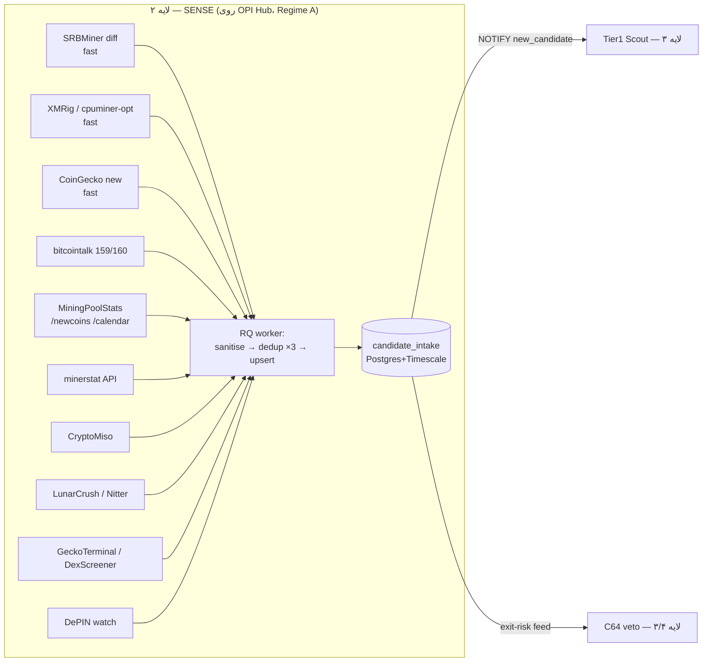

# لایه ۲ — کشف / SENSE (خط‌لوله‌ی کاندیدایابی)

این لایه اولین ضلع حلقه‌ی کنترل `SENSE → SCORE → ACT` است: منابع بیرونی را می‌کاود، هر کوینِ تازه‌متولد را یک بار و فقط یک بار به‌عنوان یک **رکورد candidate-intake** وارد رجیستر می‌کند، و ساعتِ داوری را روشن می‌کند. این لایه **قضاوت نمی‌کند** — نه REJECT، نه ACCUMULATE. آن کار متعلق به [[03 - SCORE-Screening-and-Forensics]] است. وظیفه‌ی SENSE فقط این است: *«زودتر از بازار ببین، بدون تکرار، بدون آلوده‌شدن.»*

نقش این لایه در حلقه‌ی کلان و اصول حاکم در [[00 - MASTER-ARCHITECTURE]] و [[01 - GOVERNANCE-and-SAFETY]] تعریف شده؛ اینجا فقط خودِ SENSE را عمیق می‌کنیم.

---

## ۱. اصل حاکم بر این لایه = تأخیرِ پایینِ کشف (Design Principle #2)

آلفای این استراتژی **زمانِ-تا-استقرار (time-to-deploy)** است، نه عرضه‌ی هش. [FACT] این همان *difficulty arbitrage* است: وقتی یک الگوریتم CPU تازه معرفی می‌شود، سختی شبکه در `t0` کمینه است و هنوز minerِ بهینه‌شده وجود ندارد؛ همان «edge-miner advantage». هر ساعت تأخیر در کشف = ورود ماینرهای دیگر = افت درآمدِ حاشیه‌ای همان هش. [EST]

نتیجه‌ی معماری: SENSE به دو **lane** تقسیم می‌شود.

- **Fast lane (بودجه‌ی تأخیر ≤ ۳۰–۶۰ دقیقه):** منابعی که سیگنالِ «یک الگوریتم/کوینِ CPU تازه ظاهر شد» را قبل از بازار می‌دهند — به‌ویژه diffِ چنج‌لاگ SRBMiner و ریلیزهای XMRig/cpuminer-opt.
- **Slow lane (۶–۲۴ ساعت):** سیگنال‌های کم‌فوریت و کم‌اعتماد (اجتماعی، commit-activity، DePIN).

نکته‌ی مهمِ حل‌تعارض: تأخیرِ **۷ روزه‌ی ضدخصمانه** (LIMBO از [[04 - Adversarial-Defense-and-Antifragility]]) در SENSE اعمال **نمی‌شود**. SENSE باید در `t0` کشف کند تا (الف) ساعتِ ۷ روز را استارت بزند و (ب) پنجره‌ی miner-بهینه‌نشده را ثبت کند؛ ولی fleet تا روز ۷ تعهد نمی‌کند. یعنی: **زود ببین، دیر عمل کن.**

---

## ۲. معماری اجرایی تحت Regime A (پیش‌فرضِ الزام‌آور، AUD 0)

کل SENSE روی **OPI Automation Hub** اجرا می‌شود (جزئیات زیرساخت: [[07 - SUBSTRATE-Fleet-Hub-and-Infra]]) — هیچ VPS، هیچ per-call API متِر‌شده، هیچ سابسکریپشن پولی. [SPEC]

- هر منبع = یک **sensor** به‌صورت YAML پلاگ-اند-پلی که `DEFWATCHER` با `LISTEN/NOTIFY` برمی‌دارد.
- `SCHEDULER` بر اساس `cadence` هر sensor یک job در صف `RQ` (کلاس XS/S) می‌گذارد.
- worker: fetch → **injection sanitiser** (strip HTML/markdown + کلیدواژه‌های تزریق؛ [[04 - Adversarial-Defense-and-Antifragility]]) → dedup سه‌لایه → upsert در `candidate_intake` → `NOTIFY new_candidate` که Tier1 Scout در [[03 - SCORE-Screening-and-Forensics]] را بیدار می‌کند.
- کلیدها: جایی که کلید لازم است **فقط free-tier / حساب رایگان** (GitHub PAT رایگان، LunarCrush free account). هیچ کلیدی که هزینه‌ی ماهانه بسازد. [SPEC]

> Regime B (owner-gated, پیش‌فرض OFF): همان sensors روی Hetzner + PAToken با نرخِ بالاتر و افزونگیِ replica. فقط با وردیکت صریح مالک که Rule 1 را override کند. تا آن وردیکت، این ستون خاموش است.

> **قیدهای سختِ اعمال‌شده در SENSE (hard-rule guardrails):**
> - **R1 (AUD 0):** هیچ sensor به‌صورت پیش‌فرض هزینه‌ی ماهانه نمی‌سازد. اگر free-tier یک منبع (به‌ویژه LunarCrush) در عمل پولی/حذف شد، آن sensor **خودکار** به `regime_b_only=true` (owner-gated) می‌افتد و تا وردیکتِ مالک خاموش می‌ماند؛ هرگز به‌صورت خاموش‌وار به حالتِ پولی سُر نمی‌خورد. [SPEC]
> - **R3 (بدون باینریِ ناشناخته روی ماشین اصلی):** SENSE فقط **متادیتای ریلیز/چنج‌لاگ** ماینرها (SRBMiner/XMRig/cpuminer-opt) را از GitHub API می‌خواند؛ هیچ باینریِ ماینری روی OPI Hub دانلود یا اجرا نمی‌شود. اجرای هر ماینر فقط در fleet/sandbox با build-from-source/verify (لایه ۴). [SPEC]
> - **R5 (بدون نقضِ ToS/سیبیل):** scraperها (bitcointalk/MiningPoolStats/CryptoMiso/Nitter) `robots.txt`، سقفِ نرخ و ToSِ منبع را رعایت می‌کنند؛ اگر ToSِ منبعی دسترسیِ خودکار را ممنوع کند، آن sensor owner-gated می‌شود، نه پیش‌فرض. چرخشِ نمونه‌های عمومیِ Nitter صرفاً برای تاب‌آوری در برابرِ mirrorهای شکننده است، نه برای دورزدنِ سقفِ نرخ؛ هیچ چرخشِ IP/حساب برای فرار از rate-limit انجام نمی‌شود. [SPEC]
> - **R4/امنیت:** فیلدِ `auth` در هر sensor فقط یک **ارجاعِ نام‌دار** به رازِ ذخیره‌شده در secret store/env است؛ مقدارِ واقعیِ توکن هرگز داخلِ YAML یا هیچ فایلِ دیگری نوشته نمی‌شود.
> - **R7/R8:** SENSE فقط رکوردِ intake تولید می‌کند — نه حذف، نه معامله، نه انتقالِ وجه، نه اتصال به سخت‌افزار. تعهد به هر کوینِ تازه از **گیتِ انسانیِ حاکمیت** (لایه ۱) عبور می‌کند؛ تولیدِ یک رکوردِ intake هرگز به‌تنهایی spend/commit را trigger نمی‌کند.



---

## ۳. جدول منابع SENSE

| # | منبع | خروجی کلیدی | cadence | کلید؟ | دسترسی Regime-A | lane |
|---|---|---|---|---|---|---|
| 1 | **SRBMiner-Multi changelog diff** | الگوریتم CPU تازه (randomalpha/randomjuno/yespowereqpay) | هر ۲۰ دقیقه | GitHub PAT (رایگان) | GitHub release API + ETag | **fast** |
| 2 | **XMRig releases** | پشتیبانی الگوریتم جدید = CPU-mineable شدن یک کوین | ساعتی | PAT رایگان | release API | **fast** |
| 3 | **cpuminer-opt releases** | همان، سمتِ yespower/yescrypt/GhostRider | ساعتی | PAT رایگان | release API | **fast** |
| 4 | **CoinGecko new + market** | لیستینگ تازه + فیلتر mcap $50k–$50M | ساعتی | بدون / demo رایگان | REST free-tier | **fast** |
| 5 | **bitcointalk 159/160** | ANN/Altcoin — لانچ‌های خام | ساعتی | ندارد | scrape + sanitise | slow |
| 6 | **MiningPoolStats /newcoins /calendar** | کوین‌های تازه + تقویم لانچ | ساعتی | ندارد | scrape | fast/slow |
| 7 | **minerstat API** | algo / difficulty / network hashrate / hardware | ۶ ساعت | free public | `api.minerstat.com/v2/coins` | slow |
| 8 | **CryptoMiso** | رتبه‌ی commit-activity = پروکسیِ بقا | روزانه | ندارد | scrape (fallback: GitHub API) | slow |
| 9 | **LunarCrush** | متریک اجتماعی (کم‌اعتماد) | ۶ ساعت | free account key | free-tier API | slow |
| 10 | **GeckoTerminal / DexScreener** | نقدشوندگی on-chain = خوراک exit-risk (C64) | ساعتی | ندارد | REST keyless | fast |
| 11 | **DePIN / verifiable-compute watch** | لانچ نودهای DePIN (لود منعطف) | روزانه | ندارد | scrape/GitHub | slow |
| 12 | **GitHub API (عام)** | ریپوی minerِ تازه، commit-freshness | on-demand | PAT رایگان | REST | slow |
| 13 | **block explorers** | شمار unique-miner-address در ۳۰ روز اول | on-demand | اغلب بدون | per-candidate | enrich |
| 14 | **Nitter mirrors** | X/Twitter بدون کلید (شکننده) | ۶ ساعت | ندارد | scrape (rotating) | slow |

> همه‌ی ردیف‌های بالا در Regime-A رایگان‌اند؛ هر ردیفی که free-tirش حذف/پولی شود مطابق guardrail بخش ۲ به‌صورت خودکار owner-gated (`regime_b_only=true`) می‌شود.

---

## ۴. عمیق‌شدن روی منابعِ گران‌بها

### ۴.۱ SRBMiner changelog diff — «سیگنالِ قاتل» (fast lane، بالاترین اولویت)
[FACT] الگوریتم‌های CPU تازه (مثل `randomalpha`، `randomjuno`، `yespowereqpay`) در چنج‌لاگ SRBMiner-Multi ظاهر می‌شوند؛ **فرضیه‌ی آلفا** این است که این ظهور معمولاً **پیش از توجهِ عمومیِ بازار** رخ می‌دهد [EST — فرضیه، نه قطعیت]. مکانیزم: هر ۲۰ دقیقه ریلیزِ `doktor83/SRBMiner-Multi` را با conditional-request (ETag → 304 = بدون کار) می‌گیریم، لیست `ALGORITHMS` را با نسخه‌ی قبلی diff می‌گیریم؛ هر الگوریتمِ **اضافه‌شده** یک event تولید می‌کند. این event خودش یک کوین نیست، بلکه یک *lead*: بلافاصله bitcointalk/MiningPoolStats را برای کوینی که آن الگوریتم را ادعا می‌کند جستجو می‌کنیم. این مستقیماً پنجره‌ی difficulty-arbitrage را باز می‌کند. توجه (R3): در این مرحله فقط **متادیتای ریلیز** خوانده می‌شود؛ باینریِ SRBMiner نه دانلود می‌شود نه اجرا. [SCOUT-B B?] — این یافته در SCOUT-B «killer feature» نامیده شده.

### ۴.۲ XMRig + cpuminer-opt releases (fast lane)
پشتیبانیِ یک الگوریتم تازه در `xmrig/xmrig` یا `JayDDee/cpuminer-opt` یعنی «working open-source miner وجود دارد» — که یکی از **گیت‌های سخت** CORE_PRINCIPLES است. این استنتاج فقط از روی release-notes انجام می‌شود؛ هیچ باینری‌ای روی Hub اجرا نمی‌شود (R3 — تأییدِ اجرایی فقط در fleet/sandbox، لایه ۴). اگر minerِ اپن‌سورس نباشد، کوین در همان SENSE پرچمِ `closed_source_miner` می‌خورد و در intake با `algo_cpu_flag=unknown` وارد می‌شود تا SCORE ردش کند.

### ۴.۳ CoinGecko new + market filter (fast lane)
لیستینگ‌های تازه + فیلتر بازار `$50k ≤ mcap ≤ $50M` و `age ≤ 90d` (بندِ فیلتر = پارامترِ طراحی) [SPEC]. [FACT] free-tier با نرخ محدود؛ demo-key رایگان است و صرفاً سقف نرخ را بالا می‌برد (بدون هزینه‌ی ماهانه) — سازگار با Rule 1. کوین‌های مشهور (XMR/BTC/LTC/DOGE/ZEC/DASH/RVN/ETC) در همین‌جا با یک allow-block لیست حذف می‌شوند تا وارد رجیستر نشوند.

### ۴.۴ bitcointalk 159/160 (slow، پرخطرِ تزریق)
`board=159.0` (Altcoin Discussion) و `board=160.0` (ANN). API ندارد → scrape (با رعایتِ `robots.txt` و سقفِ نرخ؛ R5). **هر متنِ اسکرپ‌شده قبل از رسیدن به orchestrator از injection sanitiser عبور می‌کند** (strip «ignore previous instructions» و مشابه‌ها). این تنها منبعی است که خطرِ prompt-injection مستقیم دارد؛ جزئیات در [[04 - Adversarial-Defense-and-Antifragility]]. [SCOUT-B B20]

### ۴.۵ MiningPoolStats /newcoins + /calendar
scrape از `miningpoolstats.stream/newcoins` و تقویم لانچ (با رعایتِ ToS/robots و سقفِ نرخ؛ R5). تقویم به fast-lane می‌رود (لانچِ برنامه‌ریزی‌شده = می‌توان `t0` را از پیش دانست و در لحظه‌ی صفر حاضر بود). [SCOUT-B B21]

### ۴.۶ minerstat API
`api.minerstat.com/v2/coins` — الگوریتم، difficulty، network hashrate، hardware. free public endpoint، بدون کلید. برای تشخیصِ «average-miner-unprofitable ولی operator-profitable» (edge-zone؛ سیگنالِ مثبت) داده‌ی خام می‌دهد؛ محاسبه‌ی EV در SCORE انجام می‌شود [SCOUT-B B22] (خروجیِ سودآوری در SENSE محاسبه یا ادعا نمی‌شود).

### ۴.۷ CryptoMiso — پروکسیِ بقا
رتبه‌بندی بر اساس فعالیتِ commit گیت‌هاب = پروکسیِ «تیم زنده است». scrape. ⚠️ [OPEN] CryptoMiso ممکن است متروک/کهنه باشد؛ fallbackِ الزامی = خواندن مستقیمِ commit-stats از GitHub API (تعداد commit در ۳۰ روز، تک‌مشارکت‌کننده یا نه) که همان red-flagهای CORE_PRINCIPLES را تغذیه می‌کند. [SCOUT-B B23]

### ۴.۸ GeckoTerminal / DexScreener — گیتِ exit-risk (C64)
[FACT] REST رایگان و بدون کلید. نقدشوندگیِ on-chain و عمقِ استخر = خوراکِ **ماژول C64 veto** (کوینی که آسان انباشته می‌شود ولی خروج از آن ناممکن است). این feed علاوه بر ذخیره در ستونِ `exit_liquidity`ی intake، مستقیم به گیتِ C64 در لایه‌ی SCORE/ACT هم می‌رود. [SCOUT-B B24] + CoinGecko on-chain به‌عنوان گیتِ ریسکِ خروج [SCOUT-B B25].

### ۴.۹ LunarCrush / Nitter / DePIN (slow، کم‌اعتماد)
سیگنال اجتماعی ذاتاً low-trust است (preference falsification — Flaw 5). LunarCrush با کلیدِ حساب رایگان؛ Nitter شکننده [OPEN]. DePIN watch روزانه برای «لودِ منعطف» (Design Principle #3). این‌ها هرگز به‌تنهایی یک کاندیدا نمی‌سازند؛ فقط فیلدِ `social_hint` را در intake پر می‌کنند و در SCORE با وزنِ پایین دیده می‌شوند. اگر free-tirِ LunarCrush در عمل پولی شد → مطابق guardrail بخش ۲ به `regime_b_only` می‌افتد، نه هزینه‌ی پیش‌فرض (R1).

> نگاشتِ SCOUT-B B20–B25 (خوشه‌ی discovery-tools): **B20** bitcointalk ANN · **B21** MiningPoolStats/newcoins · **B22** minerstat API · **B23** CryptoMiso (survival proxy) · **B24** GeckoTerminal rug-checker · **B25** CoinGecko on-chain exit-risk gate. [SCOUT-B]

---

## ۵. مشخصات یک sensor (پلاگ-اند-پلی YAML)

هر منبع دقیقاً یک فایل زیرِ `sensors/*.yaml` است؛ افزودن منبعِ تازه = افزودن یک فایل + `NOTIFY` به DEFWATCHER، بدون تغییر کد. [SPEC]

```yaml
# sensors/srbminer_changelog.yaml
id: srbminer_changelog
family: miner_release          # miner_release | listing | social | onchain | forum
enabled: true
lane: fast
cadence: "*/20 * * * *"        # هر ۲۰ دقیقه
regime_b_only: false           # true = فقط با override مالک روشن
fetch:
  kind: github_release
  repo: doktor83/SRBMiner-Multi
  auth: github_pat             # ارجاعِ نام‌دار به راز؛ مقدارِ واقعی در secret store
  conditional: etag            # 304 => بدون کار، بدون مصرف نرخ
extract:
  diff: algorithms_list        # الگوریتم‌های اضافه‌شده نسبت به آخرین ریلیز
  emit_when: added
sanitiser: strip_html_injection
emit:
  table: candidate_intake
  uid_rule: "algo:{algo}@srbminer"   # lead، نه کوین؛ در enrich به کوین نگاشت می‌شود
```

> امنیت (R4 + قاعده‌ی ۱۰ vault): `auth: github_pat` صرفاً **نامِ ارجاع** به رازِ ذخیره‌شده در secret store/env است؛ مقدارِ واقعیِ PAT هرگز داخلِ فایلِ YAML یا هیچ فایلِ ورژن‌شده‌ای نوشته نمی‌شود. GitHub PAT یک توکنِ دسترسیِ API است، نه کلید/سیدِ کیف‌پول — SENSE هیچ کلید/سیدِ کیف‌پولی نگه نمی‌دارد.

---

## ۶. رکورد candidate-intake (چیزی که SENSE به رجیستر می‌دهد)

```sql
CREATE TABLE candidate_intake (
  coin_uid        text PRIMARY KEY,        -- canonical: 'cg:dilithion' یا 'sym:DIL@randomx'
  symbol          text,
  name            text,
  first_seen_ts   timestamptz NOT NULL DEFAULT now(),
  source          text NOT NULL,           -- sensor id
  source_url      text,
  idempotency_key text NOT NULL UNIQUE,     -- لایه‌ی ۳ dedup (نگاه کن §۷)
  algo            text,                     -- RandomX / Yespower / AstroBWT / ... اگر در intake معلوم شد
  algo_cpu_flag   text,                     -- verified_cpu | claimed_cpu | asic_risk | unknown
  mcap_usd        numeric,
  launch_est      date,
  age_days_at_seen int,                     -- تأخیر کشف؛ سنجه‌ی مستقیمِ Principle #2
  social_hint     jsonb,                    -- سیگنال اجتماعیِ کم‌وزن (LunarCrush/Nitter)
  exit_liquidity  numeric,                  -- خوراک C64 veto از GeckoTerminal/DexScreener
  raw_payload     jsonb,                    -- بلابِ خامِ sanitise‌شده‌ی منبع (منبعِ استناد)
  status          text NOT NULL DEFAULT 'new', -- new | triaged | dup_skip | limbo_7d | rejected
  seen_count      int  NOT NULL DEFAULT 1,  -- چند منبع/چند بار دیده شد (triangulation)
  sources_seen    text[] DEFAULT '{}',      -- خانواده‌ی منابعی که این کوین را دیده‌اند
  last_seen_ts    timestamptz NOT NULL DEFAULT now()
);
CREATE INDEX ON candidate_intake (status, first_seen_ts);
```

نکته‌ی `algo_cpu_flag`: با احتیاطِ SCOUT-B، ادعای «RandomX = CPU-only» دیگر مطلق نیست (Bitmain X5/X9). [FACT] پس کوینی که فقط ادعای RandomX دارد `claimed_cpu` می‌گیرد نه `verified_cpu`؛ yespower/yescrypt/GhostRider در intake رتبه‌ی CPU-durability بالاتر می‌گیرند. تأییدِ نهایی در SCORE.

---

## ۷. Dedup سه‌لایه (idempotent بودنِ خط‌لوله)

مطابق زیرساختِ [[07 - SUBSTRATE-Fleet-Hub-and-Infra]]:

1. **content idempotency_key** — `hash(normalize(symbol | algo | launch_est | source_family))`. یک کوین که از دو منبعِ متفاوت می‌آید باید به یک key نگاشت شود؛ برای این کار یک `alias_map` (symbol/contract → coin_uid) نگه می‌داریم.
2. **Redis SETNX** روی `idempotency_key` با TTL — dedupِ درحال‌پرواز و قفلِ سریع؛ از دو worker هم‌زمان جلوگیری می‌کند.
3. **Postgres UNIQUE(idempotency_key)** — لایه‌ی بادوام.

رفتار در تصادم: به‌جای درج ردیف تازه، `seen_count++`، `last_seen_ts=now()`، و `sources_seen` به‌روز می‌شود. **دیده‌شدن از چند منبعِ مستقل = بالارفتنِ اعتماد** و خوراکِ cross-source triangulation در [[04 - Adversarial-Defense-and-Antifragility]] (اگر داده‌ی دو منبع >۳۰٪ واگرا شد → `DATA_INTEGRITY_ALERT`، میانگین نگیر). هرگز حذف نمی‌کنیم؛ فقط status عوض می‌شود (سازگار با R7).

---

## ۸. بودجه‌ی تأخیر و پیوند با Principle #2

- هدفِ fast lane: از لحظه‌ی publishِ منبع تا رکوردِ intake **< ۶۰ دقیقه**. [EST]
- `age_days_at_seen` در هر رکورد ذخیره می‌شود؛ متریکِ سلامتِ لایه = توزیعِ این عدد. اگر میانه‌اش بالا رفت، یعنی SENSE دیر می‌بیند و آلفا نشت می‌کند → هشدار به TG-OPS.
- تأخیرِ ۷ روزه‌ی ضدخصمانه در `status=limbo_7d` مدل می‌شود، نه با نادیده‌گرفتنِ کشف. کشفِ زودهنگام لازم است تا (الف) پنجره‌ی miner-بهینه‌نشده ثبت شود و (ب) pumpِ مصنوعیِ روزهای اول تا روز ۷ فرو بنشیند و از bot-herd فرار کنیم.

---

## ۹. باز / نامعلوم [OPEN]

- CryptoMiso و Nitter شکننده/احتمالاً متروک‌اند؛ fallbackها مشخص شده ولی پایداریِ بلندمدت [OPEN].
- سقفِ نرخِ دقیقِ free-tierهای CoinGecko/LunarCrush در ۲۰۲۶ [OPEN] — و اینکه آیا LunarCrush اساساً هنوز free-tier دارد یا آن را پولی/حذف کرده [OPEN]. cadenceها محافظه‌کارانه چیده شده تا زیرِ سقف بمانند؛ در صورت 429، backoff نمایی. اگر free-tirِ منبعی پولی شد → طبق guardrail بخش ۲ خودکار به `regime_b_only` می‌افتد (owner-gated)، نه هزینه‌ی پیش‌فرض (R1).
- نگاشتِ دقیقِ شماره‌های SCOUT-B B20–B25 به آیتم‌ها بر پایه‌ی خوشه‌ی discovery-tools استنتاج شده؛ تأییدِ شماره‌گذاریِ خطی [OPEN].
- منابعِ DePIN aggregator مشخصِ نامی [OPEN] — فعلاً watch مستقیمِ GitHub سازمان‌های DePIN.

---

## منابع / Sources

- **Shared context — CONTROL LOOP / SENSE**: فهرست منابع کشف، دِدوپ، و «SRBMiner changelog diff = killer feature».
- **Shared context — Design Principle #2** (time-to-deploy / difficulty arbitrage) و **#3** (لودِ منعطف).
- **SCOUT-B TECHNICAL PIPELINE — Discovery tools [B20–B25]**: bitcointalk ANN, MiningPoolStats/newcoins, minerstat API, CryptoMiso (survival proxy), GeckoTerminal rug-checker + CoinGecko on-chain exit-risk gate؛ و CRITICAL CAVEAT دربارهٔ ASIC-پذیریِ RandomX (Bitmain X5/X9).
- **SUBSTRATE — OPI Automation Hub v2**: Postgres+TimescaleDB, Redis SETNX, DEFWATCHER/SCHEDULER/RQ, dedup سه‌لایه.
- **Adversarial defenses**: injection sanitiser, cross-source triangulation, 7-day LIMBO.
- **Cost-regime axis** و **LOCKED HARD RULES R1/R3/R4/R5/R7/R8** برای قیدهای Regime-A، بدونِ باینریِ ناشناخته روی ماشین اصلی، بدونِ راز در فایل، و بدونِ ToS-violation.
- ingest:critique §۴ (Coin Hunter Bot infra: Hetzner + local Qwen، سه‌لایه رمزنگاری) — پایه‌ی نگاشتِ Regime B.
- خواهرها: [[00 - MASTER-ARCHITECTURE]] · [[01 - GOVERNANCE-and-SAFETY]] · [[03 - SCORE-Screening-and-Forensics]] · [[06 - ACT-Fleet-Execution-and-Orchestration]] · [[04 - Adversarial-Defense-and-Antifragility]] · [[07 - SUBSTRATE-Fleet-Hub-and-Infra]]
