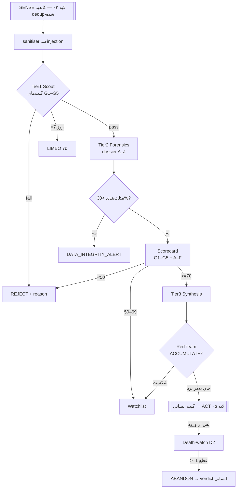

# لایه ۳ — غربالگری و فارنزیک / SCORE (موتور بقا)

> جایگاه در حلقه کنترل: [[02 - SENSE-Discovery-Layer]] کاندیدهای خام و dedup-شده را می‌دهد → **این لایه (SCORE)** آن‌ها را از سه Tier عبور می‌دهد و یک «حکم بقا» می‌سازد → فقط حکم‌های `ACCUMULATE` به [[06 - ACT-Fleet-Execution-and-Orchestration]] می‌رسند، آن هم پشت گیت انسانی. متا/drift و mentor در [[05 - AGENT-BRAIN-Decision-Layer]]؛ sizing در [[09 - EXIT-Liquidity-and-Accounting]]؛ قواعد سخت و ایمنی در [[01 - GOVERNANCE-and-SAFETY]].
>
> اصل حاکم بر کل لایه: **رفتار پیش‌فرض = REJECT.** [FACT] گلوگاه سیستم «کیفیت غربال» است نه hashrate (اصل طراحی ۱ و ۶). شمارشِ بدونِ گیت بقا = زباله دیجیتال.

## ۰. محور رژیم هزینه در این لایه

- **Regime A (پیش‌فرض، الزام‌آور طبق منشور):** Tier1/Tier2 روی مدل‌های محلی (Ollama/Qwen 7B و 14B) اجرا می‌شوند؛ Tier3 روی مدل محلی بزرگ‌تر **یا** Claude تعاملیِ اپراتور (in-session از اشتراک موجود، نه per-call متری — هیچ جریان نقدیِ نوِ AUD-0 ایجاد نمی‌کند). صفر جریان نقدیِ نو. منابع دادهٔ فارنزیک (§۲) فقط روی **free-tier**؛ هر tier پولی یا کلید API متری = Regime B (owner-gated). [SPEC]
- **Regime B (owner-gated، OFF):** همان معماری روی VPS + API متری (Claude Opus/Sonnet روی call). فقط با verdict صریح مالک که Rule 1 را override کند. هر جای این سند که «Opus/Sonnet» می‌آید، مسیر AUD-0-safe = مدل محلی یا Claude تعاملی است. [SPEC]

## ۱. Tier1 — Scout (غربال سریع؛ گیت‌های سخت خودکار)

- **مدل/کادنس:** Qwen 7B محلی، هر ساعت، روی هر کاندید تازه از SENSE. هدف = latency پایین detection→action (اصل طراحی ۲: alpha = time-to-deploy). [SPEC]
- **پیش‌پردازش امنیتی (اجباری، قبل از هر متن اسکرپ‌شده):** sanitiser در `scout_forensics` — strip کردن HTML/markdown و کلیدواژه‌های injection (مثل «ignore previous instructions») پیش از رسیدن متن به orchestrator. متنِ اسکرپ‌شده = **داده، نه دستور**. [SPEC]
- **کار Tier1 = فقط اعمال گیت‌های سخت** (تصمیم باینری pass/REJECT، بدون قضاوت کیفی):

```yaml
tier1_hard_gates:   # هر کدام fail شد → REJECT فوری، لاگ دلیل، پایان
  G1_age:        launch_days <= 90
  G2_mcap:       50_000 <= mcap_usd <= 50_000_000
  G3_cpu_mine:   algo in [RandomX, RandomWOW, Yespower*, Yescrypt, AstroBWT,
                          VerusHash, GhostRider, Argon2, CryptoNight*]
                 AND open_source_miner_exists == true
  G4_not_famous: ticker not in [XMR, BTC, LTC, DOGE, ZEC, DASH, RVN, ETC]
  G5_no_autoreject:  # هر یک از این‌ها = REJECT
    - premine_to_dev_pct > 10
    - ico_insider_pct   > 10
    - top10_holders_pct > 40
    - repo_commits < 10  OR  single_contributor  OR  no_commit_30d
    - closed_source_miner
    - anon_founder AND has_premine
    - rug_pump_dump_signature
    - algo_verifiably_asic_dominated   # کامودیتی-ASIC موجود
```

- **تأخیر ضدحمله ۷ روزه (LIMBO):** کوینی که کمتر از ۷ روز از listing/first-commit گذشته، حتی با pass همه گیت‌ها، به Tier2 **نمی‌رود**؛ در وضعیت `LIMBO` می‌ماند. منطق: pump مصنوعی تا روز ۷ فروکش می‌کند و از bot-herd فرار می‌کنیم. [SPEC]
- **خروجی Tier1:** یا `REJECT{reason}` یا candidate با تگ `tier1_pass` به صف Tier2.

## ۲. Tier2 — Forensics (پرونده شواهد ۱۰-بُعدی A–J)

- **مدل/کادنس:** Qwen 14B محلی، هر ۶ ساعت، فقط روی بازماندگان Tier1. [SPEC]
- **قاعده طلایی:** Tier2 **فقط واقعیت جمع می‌کند، قضاوت نمی‌کند.** هر claim باید source داشته باشد. خروجی = dossier ساخت‌یافته که به scorecard (§۳) و Tier3 (§۴) خوراک می‌دهد.

| بُعد | چه جمع می‌کند | منابع نمونه (از [[02 - SENSE-Discovery-Layer]]) |
|---|---|---|
| **A** technical spec | الگوریتم، scratchpad size، block time، supply schedule، دوامِ CPU الگو | whitepaper، minerstat API، SRBMiner changelog |
| **B** code provenance | commit activity، #contributors، آخرین commit، open-source بودن miner | GitHub API، CryptoMiso (رتبه commit = پروکسی بقا) |
| **C** economic structure | premine، توزیع اولیه، dev-tax، fair-launch بودن، halving | whitepaper، block explorer |
| **D** on-chain forensics | #unique miner addresses (۳۰ روز اول)، توزیع holder، difficulty adjustment، `wallet_correlation_index` | block explorer، CoinGecko onchain |
| **E** mining economics | H/s و coin/day روی فلیت، سپس EV در **هر دو** ساختار هزینه (زیر) + `edge_zone_flag` | minerstat، MiningPoolStats، اندازه‌گیری فلیت خودمان |
| **F** market microstructure | نقدشوندگی، عمق بازار، مسیر خروج (exit feasibility)، reflexivity/سهم بازار خودمان | DexScreener، GeckoTerminal rug-checker، CoinGecko |
| **G** community forensics | dev واقعی؟ کانال‌ها زنده؟ بحث فنی vs hype؟ (وزنِ کم — نگاه کن §۸ falsification) | bitcointalk ANN، Nitter mirrors، LunarCrush |
| **H** red-flag scan | اسکن مجدد پرچم‌های قرمز + هر anomaly ساختاری | همه بالا |
| **I** positive-signal scan | novelty الگو، quantum-resistance (بونس)، difficulty صحیح، >۱۰۰ miner، لیست در SRBMiner/XMRig | همه بالا |
| **J** comparable hints (شامل مرده‌ها) | کوین‌های مشابه — **اجباراً شامل کوین‌های مُرده با سیگنال اولیه مشابه** | dead_coins dataset (§۸)، CoinGecko |

> نکته AUD-0 (§۰): همه منابع بالا در Regime A فقط روی سهمیهٔ **free-tier** مصرف می‌شوند؛ هیچ کلید API متری/پولی به‌صورت پیش‌فرض فعال نیست — آن مسیر = Regime B (owner-gated).

### بُعد E — اقتصاد ماینینگ در هر دو ساختار هزینه (هسته لبه)

```text
E_avg  = EV در $0.12/kWh  (میانگین ماینر)
E_edge = EV در $0.05/kWh  (لبه اپراتور؛ سولار = حاشیه ~صفر)
edge_zone_flag = (E_avg <= 0)  AND  (E_edge > 0)
```
- `edge_zone_flag == true` یک **سیگنال مثبت** است، نه منفی: [EST] در این حالت اپراتور می‌تواند کوینی را سودآور ماین کند که برای ماینر متوسط زیان‌ده است — منطقه‌ای با رقابت کم؛ اما این نتیجه **مشروط به درستیِ ورودی‌های [EST]** است (watt واقعی را قبل از اعتماد اندازه بگیر، caveat زیر).
- caveat: «رایگان» صفر نیست — سایش CPU/فن + ریسک امنیتی + زمان در EV حساب می‌شوند (R2). همه اعداد profitability پیش‌فرض [EST] و vendor/pool-biased‌اند؛ watt را قبل از اعتماد اندازه بگیر.

### مثلث‌بندی متقاطع منابع (Data-Integrity)

```text
if abs(source_A - source_B) / max(source_A, source_B) > 0.30:
    # مثلاً CoinGecko در برابر DEX-scanner
    DO NOT average
    emit DATA_INTEGRITY_ALERT{dimension, source_A, source_B}
    dossier.confidence = LOW
```
واگرایی >۳۰٪ = هشدار یکپارچگی داده، نه میانگین‌گیری. [SPEC]

## ۳. کارت امتیاز بقا (Survival-Filter Scorecard)

پس از عبور از گیت‌های سخت Tier1 و ساخت dossier Tier2، امتیاز عددی محاسبه می‌شود. **گیت‌ها باینری‌اند؛ محورها وزنی.**

### گیت‌های G1–G5 (باینری — همان §۱، پیش‌شرط ورود به امتیازدهی)
اگر هر گیت fail باشد، امتیاز اصلاً محاسبه نمی‌شود → `REJECT`.

### محورهای وزنی A–F (هر کدام 0–100)

| محور | چه می‌سنجد | ورودی از dossier | وزن |
|---|---|---|---|
| A | دوام فنی و سختیِ CPU الگو (yespower/yescrypt/GhostRider > RandomX) | بُعد A + caveat ASIC | 0.20 |
| B | provenance کد و توسعه (commit، contributors) | بُعد B (+ G جزئی) | 0.20 |
| C | ساختار اقتصادی و عدالت توزیع | بُعد C | 0.15 |
| D | سلامت on-chain و عدم‌تمرکز ماینر | بُعد D | 0.15 |
| E | اقتصاد ماینینگ + `edge_zone_flag` | بُعد E | 0.15 |
| F | ریزساختار بازار + **امکان خروج (C64 veto)** | بُعد F | 0.15 |

```text
survival_score = Σ ( weight_i × axis_i )        # 0..100
# ابعاد H (red-flag) و I (positive-signal) به‌صورت modifier عمل می‌کنند
# نه یک محور مستقل؛ بُعد J کل امتیاز را کالیبره می‌کند (survivorship correction).
```

### آستانه‌ها
| بازه | حکم |
|---|---|
| **>= 70** | **Tier-A** — کاندید ورود (هنوز پشت گیت انسانی) |
| **50–69** | **Watchlist** — نگه‌داری و پایش، ورود نه |
| **< 50** | **REJECT** |

### فیلتر «too-good» (پادزهر honeypot)
اگر بُعد H **صفر** نقص ساختاری/فنی پیدا کند **و** `survival_score` خیلی بالا باشد → **یک Tier تنزل** (مثلاً Tier-A → Watchlist). منطق: پروژه بی‌هیچ نقص = ریسک engineered/honeypot. [SPEC]

## ۴. Tier3 — Synthesis (حکم بقا)

- **مدل/کادنس:** روزانه، روی بازماندگان Tier2. Regime A = مدل محلی بزرگ یا Claude تعاملی؛ Regime B (OFF) = Claude Opus متری. [SPEC]
- **وظیفه:** از dossier واقعیت‌محور یک **حکم verdict-grade** بساز؛ `survival_score` و `edge_zone_flag` را نهایی کن؛ confidence صریح بده.
- **الزام ضدسوگیری بقا (Flaw 1):** Tier3 باید **کوین‌های مُردهٔ مشابه** (بُعد J) را هم نگاه کند، نه فقط بازماندگان. اگر dossier فقط بازمانده آورده → حکم به LOW confidence تنزل و درخواست مجدد dead-comparable. [SPEC]
- **Red-team تخاصمی (Flaw 6، alignment-faking):** هر حکم `ACCUMULATE` **باید** از یک عاملِ دومِ «دادستان» عبور کند که کارش شکستن حکم است («چرا این یک اسکم است»). فقط حکمی که از دیالوگ تخاصمی جان به‌در ببرد به مالک می‌رسد. [SPEC]
- **توافق دو-مدلی (صرفه‌جویانه):** ارسال به مدل دوم (مثلاً GPT-4o در Regime B، یا مدل محلی دوم در Regime A) **فقط وقتی** یک Sentinel Warning فعال شود — نه روی هر حکم. [SPEC]
- **آگاهیِ reflexivity (Flaw 3):** Tier3 سهم بازار خودِ bot را مدل می‌کند؛ برای mcap کوچک (مثلاً $200k) یک خرید ما قیمت را تکان می‌دهد → این در sizing تا می‌شود (جزئیات: [[09 - EXIT-Liquidity-and-Accounting]]).
- **ماهیت خروجی (R8):** حکم Tier3 یک **ابزار پشتیبان‌تصمیمِ داخلیِ اپراتور** است — نه توصیه مالی/حقوقی/مالیاتی و نه دستور اجرا. bot خودش هیچ‌گاه معامله نمی‌کند، وجه/دارایی منتقل نمی‌کند و به سخت‌افزار وصل نمی‌شود؛ هر `ACCUMULATE` فقط پشت گیت انسانی به [[06 - ACT-Fleet-Execution-and-Orchestration]] می‌رود. [SPEC]

## ۵. Death-watch — معیار قطع پس از ورود (D2)

پس از اینکه یک کوین وارد سبد شد، هر هفته re-score می‌شود. معیار **قطع** فقط این‌هاست (پرداخت‌ناپذیری یا نقدنشدنیِ ماه‌های اول، به‌تنهایی، دلیل قطع نیست):

```markdown
## Death-watch (D2 — فقط این‌ها قطع می‌کنند)
- [ ] dev مرده: > ۸ هفته بدون commit/release            [EST آستانه]
- [ ] زنجیره متوقف / تولید بلوک نامنظم
- [ ] جامعه/شبکه عملاً خالی (کانال مرده، نودِ شبکه < آستانه)
- [ ] فروپاشی نقدشوندگی / trading halt (کیس Wownero: ~۲۲ روز halt، حجم ~صفر → exit-liquidity risk) [EST]
- [ ] جهش تمرکز holder / خروج ناگهانی dev-wallet
→ فقط اگر ≥۱ چک‌باکس قطعی شد: پیشنهاد ABANDON با evidence → **verdict انسانی (D-10)**
```
- bot هرگز خودش خروج/فروش نمی‌کند (R8). فروش سکه‌های mined = تصمیم مالی → همیشه گیت انسانی.
- کیس‌های caveat مرجع: Wownero (halt/نقد صفر)، Dilithion («AI-assisted، NOT audited» در whitepaper خودش → پرچم قرمز H). [FACT]

## ۶. output_schema — شیء حکم (JSON)

هر خروجی Tier3 دقیقاً این شکل را دارد (مرجع کامل: `output_schema.json`؛ ساختار ۹-بخشی و schema **قابل ویرایش خودکار نیست** — فقط انسان، R8/Tier4 guardrails).

```json
{
  "coin_id": "string",
  "ticker": "string",
  "run_ts": "ISO-8601",
  "cost_regime": "A | B",
  "verdict": "ACCUMULATE | WATCHLIST | REJECT | ABANDON | LIMBO",
  "verdict_fa": "انباشت | فهرست‌پایش | رد | رهاسازی | لیمبو",
  "tier_reached": "1 | 2 | 3",
  "survival_score": 0,
  "score_band": "Tier-A | Watchlist | Reject",
  "edge_zone_flag": false,
  "confidence": "LOW | MEDIUM | HIGH",
  "gates": { "G1": true, "G2": true, "G3": true, "G4": true, "G5": true },
  "axes": { "A": 0, "B": 0, "C": 0, "D": 0, "E": 0, "F": 0 },
  "mining_economics": { "E_avg_usd_day": 0.0, "E_edge_usd_day": 0.0, "note": "[EST]" },
  "red_flags": [ { "code": "string", "evidence": "string", "source": "url" } ],
  "positive_signals": [ { "code": "string", "evidence": "string", "source": "url" } ],
  "dead_comparables": [ { "coin": "string", "why_died": "string", "shared_signal": "string" } ],
  "skin_in_game": {
    "price_30d": null, "holders_60d": null, "hashrate_90d": null,
    "note": "پیش‌بینی measurable؛ بعداً track و در ranking وزن می‌شود (Flaw 6 fix)"
  },
  "data_integrity_alerts": [ { "dimension": "F", "source_a": 0, "source_b": 0 } ],
  "too_good_downgrade": false,
  "redteam_survived": false,
  "reflexivity_market_share_pct": null,
  "rationale_en": "string (هر claim با citation)",
  "rationale_fa": "string",
  "sizing_ref": "see [[09 - EXIT-Liquidity-and-Accounting]]",
  "human_gate_required": true,
  "review_date": "ISO-8601"
}
```

قواعد schema: هر claim باید source داشته باشد؛ confidence صریح؛ عدم‌قطعیت اعلام شود؛ فیلدهای verdict دوزبانه. profitability/hashrate پیش‌فرض [EST].

## ۷. یادداشت Kelly (جزئیات → [[09 - EXIT-Liquidity-and-Accounting]])

- این لایه sizing نمی‌کند؛ فقط `survival_score`، `edge_zone_flag` و `reflexivity_market_share` را به لایه ۹ می‌دهد.
- ثابت‌های موروثی که ۹ اعمال می‌کند: **Kelly در ~۲۵٪ full-Kelly**، سقف سخت **۲٪ سرمایه per coin**. [FACT] هدف sizing = **بقا نه رشد** (پاسخ به non-ergodicity، Flaw 2). ورود همیشه پشت گیت انسانی و tranche‌ای.

## ۸. نگاشت هفت نقص ساختاری → محل رفع در این لایه

| نقص | رفع در SCORE |
|---|---|
| ۱ survivorship bias | بُعد J اجباریِ dead-coins + `dead_coins` hidden test-set (امتیاز = نرخ REJECT صحیحِ کوین‌های مرده‌ای که روزی bullish بودند) + کالیبراسیون امتیاز |
| ۲ non-ergodicity | sizing زیر-Kelly برای بقا (لایه ۹)؛ SCORE فقط احتمال بقا می‌دهد نه بازده |
| ۳ reflexivity | `reflexivity_market_share_pct` در schema + fold در sizing |
| ۴ r-strategy trap | anti-correlation discipline (region/algo/use-case) — عمدتاً لایه ۹؛ SCORE تگ‌های تنوع را در dossier می‌گذارد |
| ۵ preference falsification | وزنِ کمِ بُعد G (social = شواهد low-trust)؛ verify در برابر on-chain/hashrate/holder سخت |
| ۶ alignment faking | red-team دادستان روی هر ACCUMULATE + `skin_in_game` predictions قابل track |
| ۷ operator self-deception | خارج از SCORE — گیت انسانی + Operator Vision در [[01 - GOVERNANCE-and-SAFETY]]؛ mentor در [[05 - AGENT-BRAIN-Decision-Layer]] |

نقاط کور ساختاری (روابط شخصی dev، انگیزه واقعی، سیگنال فرهنگی/ژئوپولیتیک، معاملات OTC) — bot فقط تحلیلگرِ شواهدِ **آنلاین** است؛ این‌ها را **انسان** حل می‌کند، نه این لایه. [OPEN]

## ۹. جریان داده (Mermaid)



## منابع / Sources

- Shared authoritative context: CORE_PRINCIPLES (hard filters، auto-reject، positive signals، output discipline)، SCORE multi-tier brain (Tier1–Tier3)، ADVERSARIAL DEFENSES (sanitiser، triangulation، 7-day delay، too-good، dual-model)، SEVEN STRUCTURAL FLAWS + mitigations، cost-regime axis.
- ingest:roadmap-v3 — نقد عمیق ۷ نقص (survivorship §۶.۶ dead-coins، red-team §۶.۴، skin-in-game §۶.۵، reflexivity §۶.۲).
- ingest:critique — Survival-filter primary gate، C64 veto/exit feasibility، Death-watch، Wownero halt caveat، Dilithion NOT-audited caveat، Kelly-25%/2%-cap.
- وضعیت موجود vault: [[03 - Projects/Mining/Coin Scouting Framework]] (Death-watch D2 اصل + قالب لاگ)، [[03 - Projects/Mining/04 - Research/SCOUT-B]] (دوامِ CPU الگوریتم‌ها، ادعای «RandomX=CPU-only» = پرچم زرد).
- Cross-links: [[01 - GOVERNANCE-and-SAFETY]] · [[02 - SENSE-Discovery-Layer]] · [[05 - AGENT-BRAIN-Decision-Layer]] · [[06 - ACT-Fleet-Execution-and-Orchestration]] · [[09 - EXIT-Liquidity-and-Accounting]].
