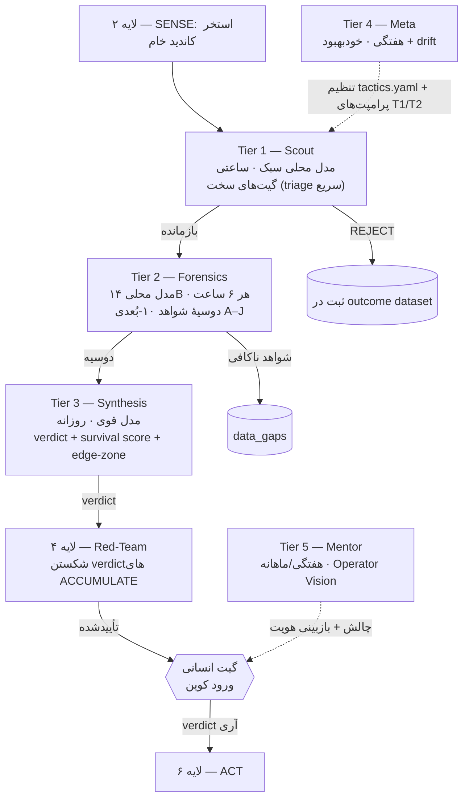

# لایه ۵ — مغز ایجنتی و تصمیم (Agent Brain / Decision Layer)

> این لایه «مغزِ» شکارچی است: زنجیرهٔ چندلایهٔ LLM که خروجی [[02 - SENSE-Discovery-Layer]] (کاندیدهای خام) را می‌گیرد، از [[03 - SCORE-Screening-and-Forensics]] و [[04 - Adversarial-Defense-and-Antifragility]] عبور می‌دهد، و یک **verdict قابل‌ممیزی** تولید می‌کند که ورودیِ گیتِ انسانیِ ورود کوین در [[06 - ACT-Fleet-Execution-and-Orchestration]] است. مغز **هرگز خودش اجرا نمی‌کند** — طبق R8 در [[01 - GOVERNANCE-and-SAFETY]]، ربات نه ترید می‌کند، نه وجه جابه‌جا می‌کند، نه به سخت‌افزار وصل می‌شود.

---

## ۰. اصل حاکم بر این لایه

`[FACT — CORE_PRINCIPLES]` رفتار پیش‌فرض = **REJECT**. بار اثبات روی هر verdictِ مثبت است. مغز یک ماشینِ «چرا این کوین را رد کنیم» است، نه «چرا بخریم».

`[FACT]` سه اصل طراحی که مستقیماً این لایه را شکل می‌دهند: (اصل ۱) count قابل بازی‌کردن است → survival یک گیت سخت است نه رتبهٔ نرم؛ (اصل ۲) آلفا = time-to-deploy → تأخیر detection→verdict را کمینه کن؛ (اصل ۶) خودمختاری کسب می‌شود → هیچ tierـی قبل از backtest شدن، verdict خودکار به ACT نمی‌دهد.

---

## ۱. توپولوژی چندلایه (Tier 1 → Tier 5)

هر tier یک **قیف** است: حجم زیاد و ارزان بالا، تحلیل عمیق و گران پایین. هر tier فقط بازماندگانِ tier قبل را می‌بیند.



| Tier | نقش | مدل (Regime A پیش‌فرض / Regime B) | چرخه | خروجی |
|---|---|---|---|---|
| **T1 Scout** | triage سریع مقابل گیت‌های سخت | Qwen 2.5 7B محلی (Ollama) / همان | هر ۱ ساعت | pass/reject + دلیل |
| **T2 Forensics** | جمع‌آوری شواهد، **نه قضاوت** | Qwen 2.5 14B محلی / همان | هر ۶ ساعت روی بازماندگان | دوسیهٔ ۱۰-بُعدی JSON |
| **T3 Synthesis** | verdict نهایی + survival score | Claude تعاملیِ اپراتور (in-session) یا مدل محلیِ بزرگ / Claude Opus (API پولی) | روزانه روی بازماندگان T2 | verdict object |
| **T4 Meta** | خودبهبود + drift detection | Claude تعاملی یا مدل محلی / Claude Sonnet | هفتگی (یکشنبه) | proposalهای git-commit |
| **T5 Mentor** | نقش D'Amato: بازبینی Operator Vision + چالش Toynbee | انسان + مدل | هفتگی/ماهانه | چالش + گزارش gap هویت |

`[SPEC]` **گرهِ Regime در این لایه:** طبق R1 (AUD-0) در [[01 - GOVERNANCE-and-SAFETY]]، مسیر **پیش‌فرض** استفاده از **API متری‌شدهٔ پولی نیست**. T3/T4 در Regime A روی مدل محلیِ بزرگ‌تر (اگر RAM ناوگان اجازه دهد) یا از طریق **Claude تعاملیِ خودِ اپراتور** (که همین حالا در اختیار است، per-session نه per-call metered) اجرا می‌شوند. Regime B (Opus/Sonnet با budget cap و `max_budget_usd`) یک سوییچ **owner-gated و خاموش** است — فعال‌سازی‌اش نقض R1 است و verdict انسانی می‌خواهد.

---

## ۲. Tier 1 — Scout (غربال سریع)

- ورودی: رکورد کاندید از [[02 - SENSE-Discovery-Layer]] (name/ticker/algo/age/mcap/source).
- کار: فقط **گیت‌های سخت** را چک می‌کند (عمر ≤۹۰d؛ `$50k ≤ mcap ≤ $50M`؛ الگوریتم CPU-mineable قابل‌اثبات؛ ماینر open-source موجود؛ سکهٔ مشهور نباشد). هر fail → `REJECT` فوری + ثبت در outcome dataset ([[10 - DATA-STATE-and-SCHEMA]]).
- خروجی: `{coin_id, pass: bool, failed_gate?: str, confidence}` — کوتاه، ارزان، پرحجم.
- `[SPEC]` هدف طراحی اصل ۲: از لحظهٔ detection تا triage باید **دقیقه‌ای** باشد تا پنجرهٔ difficulty-arbitrage باز بماند؛ ولی گیتِ **۷-روزهٔ LIMBO** ([[04 - Adversarial-Defense-and-Antifragility]]) کوین‌های زیر ۷ روز را در حالت انتظار نگه می‌دارد — سرعتِ تشخیص با احتیاطِ deploy تعارض ندارد چون سرعت برای *دیدن* است، نه *اجرا*.

## ۳. Tier 2 — Forensics (دوسیهٔ شواهد ۱۰-بُعدی)

`[FACT — tier2_forensics_prompt]` T2 **فقط جمع‌آوری واقعیت** می‌کند و **قضاوت نمی‌کند**؛ «top-10 مالک ۴۷٪ دارند» یک مشاهده است، «این خیلی متمرکز است» قضاوتِ T3 است. برای هر بُعد: مشاهدهٔ خام + منبع (URL/commit/block height) + confidence + caveat.

ابعاد A–J (تفصیل کامل در [[03 - SCORE-Screening-and-Forensics]]): **A** technical spec · **B** code provenance (fork/rebrand؟ diff با upstream؟ آیا کامپایل می‌شود؟) · **C** economic structure (premine روی‌زنجیره، نه ادعای پروژه) · **D** on-chain forensics (top holders، clustering، genesis، premine outflow) · **E** mining economics در **دو** ساختار هزینه (ماینر متوسط `$0.12/kWh` و لبهٔ اپراتور `$0.05/kWh` روی Orange Pi 5) با فلگ `edge_zone` · **F** market microstructure (نقدینگی، slippage یک sell 1k$ و 10k$) · **G** community forensics · **H** red-flag scan · **I** positive-signal scan · **J** comparable coins **شامل مرده‌ها** (ضدِ survivorship bias — [[04 - Adversarial-Defense-and-Antifragility]]).

## ۴. Tier 3 — Synthesis (verdict قابل‌ممیزی)

- ورودی: دوسیهٔ T2. کار: تحلیلِ سطحِ verdict، تولید counter-narrative، و محاسبهٔ **survival score** + فلگ **edge-zone**.
- `[FACT]` T3 موظف است **به comparableهای شکست‌خورده هم نگاه کند**، نه فقط بازماندگان (ضدِ survivorship bias).
- خروجی = `verdict object` طبق `output_schema.json` (تغییرناپذیر). فیلدهای کلیدی:

```json
{
  "coin_id": "…",
  "verdict": "STRONG_ACCUMULATE | CAUTIOUS_ACCUMULATE | WATCH | REJECT",
  "survival_score_0_100": 0,
  "edge_zone": true,
  "edge_zone_explanation": "…",
  "confidence": "LOW | MEDIUM | HIGH",
  "evidence_chain": [ { "claim": "…", "source": "…" } ],
  "counter_narrative": "قوی‌ترین دلیلِ رد این کوین",
  "kill_reasons": [],
  "rationale_fa": "…", "rationale_en": "…",
  "human_gate_required": true
}
```

- `[FACT — CORE never-do]` هر ادعا باید یک **زنجیرهٔ شواهدِ منبع‌دار** داشته باشد؛ بدون منبع → confidence: LOW. ربات هرگز پیش‌بینی قیمت نمی‌دهد، زبان hype به‌کار نمی‌برد، و از verdictهای قبلی خودش به‌عنوان شاهدِ verdict جدید استفاده نمی‌کند (منعِ استدلال دوّار).
- `human_gate_required` همیشه `true` است: verdictِ ACCUMULATE فقط یک **پیشنهاد** به آری است؛ ورود واقعی کوین گیتِ انسانی می‌خواهد (R8).

## ۵. Tier 4 — Meta (خودبهبود + drift detection)

`[FACT — CORE self-improvement guardrails]` T4 **فقط** اجازه دارد `tier1_scout_prompt.md`، `tier2_forensics_prompt.md` و آستانه‌های `tactics.yaml` را تغییر دهد. **هرگز**: `CORE_PRINCIPLES.md`، هستهٔ orchestrator، `output_schema.json`، یا ساختار ۹-بخشی.

**جریان تأیید (approval flow):**
1. T4 پیشنهاد را در `pending_changes/PROPOSAL-ID/` می‌نویسد، شاملِ: `hypothesis` / `metric` / `rollback_condition` / `review_date` (حداکثر ۳۰ روز).
2. هر proposal در یک شاخهٔ git commit می‌شود.
3. اپراتور خلاصهٔ هفتگی را می‌بیند و برای اعمال، `auto_apply: true` را در `tactics.yaml` می‌گذارد.
4. **auto-rollback اجباری:** اگر precision@6mo نسبت به baseline بیش از **۲۰٪** در پنجرهٔ متحرکِ ۳۰-روزه افت کند، تغییر خودکار برگردانده می‌شود.

**Drift detection هفتگی (پنج محور):** mission creep (تحلیلِ کوینِ خارج از scope) · hype contamination (زبانِ کم‌شک‌تر) · confirmation bias (پیشنهادِ بیش‌ازحد) · edge neglect (فراموشیِ مزیتِ برق) · adversarial erosion (نساختنِ counter-narrative). `[SPEC]` هشدارِ drift با شدت **HIGH** → پیشنهادهای جدید تا بازبینیِ اپراتور **pause** می‌شوند.

## ۶. Tier 5 — Mentor (لنگرِ ضدِ خودفریبی)

`[SPEC — از نقد عمیق، نقص #۷]` نقشِ D'Amato: نه cheerleader، نه stalker. هفتگی **Operator Vision Statement** (تغییرناپذیر، در [[01 - GOVERNANCE-and-SAFETY]]) را در برابر تصمیمات هفته چک می‌کند؛ ماهانه یک **چالش Toynbee** صادر می‌کند تا اپراتور از zone راحتی بیرون بیاید؛ و **self-image gap** (فاصلهٔ خود-تصور و واقعیت) را ردیابی می‌کند. اصلِ راهنما: **Identity > Strategy**. این لایه ربات‌محور نیست — انسان‌محور است؛ ابزاری که مانع fusion هویتِ اپراتور با پروژه می‌شود.

---

## ۷. مجموعهٔ فایل‌های پرامپت و کد harness

`[FACT — README + CORE]` جدول تغییرپذیری:

| فایل | نقش | تغییرپذیری |
|---|---|---|
| `CORE_PRINCIPLES.md` | مأموریت، لبه، گیت‌های سخت، never-do | **IMMUTABLE (فقط آری)** |
| `orchestrator_prompt.md` | مغزِ Tier 3 | Protected (ساختار قفل) |
| `tier1_scout_prompt.md` | triage T1 | Mutable via T4 + approval |
| `tier2_forensics_prompt.md` | جمع‌آوری شواهد T2 | Mutable via T4 + approval |
| `tier4_meta_prompt.md` | لایهٔ خودبهبود | Protected |
| `output_schema.json` | schema سخت‌گیرِ verdict | **IMMUTABLE (ابزارهای پایین‌دست وابسته‌اند)** |
| `tactics.yaml` | وزن‌ها و آستانه‌های heuristic | Mutable via T4 + approval |

**چیدمان harness (buildable):**
```
coin_hunter_bot/
├── CORE_PRINCIPLES.md         (immutable)
├── orchestrator_prompt.md · tier1/tier2/tier4 prompts
├── output_schema.json · tactics.yaml
├── harness/  orchestrator.py · tier1_runner.py · tier2_runner.py · tier3_runner.py · tier4_runner.py
├── adapters/ coingecko.py · github.py · explorers/ · srbminer_changelog.py   (→ لایه ۲)
├── storage/  sqlcipher_state.py · minio_warm.py                              (→ لایه ۱۰)
├── tests/fixtures/            (dead-coins backtest set → لایه ۴)
└── pending_changes/           (proposalهای T4 در انتظار تأیید)
```

## ۸. ارکستراسیون: حلقهٔ SENSE → SCORE → ACT

`orchestrator.py` زمان‌بندی tierها را با cron/interval اداره می‌کند، budget cap (Regime B) را اعمال می‌کند، و بین لایه‌ها state رد و بدل می‌کند. `[SPEC]` قرارداد بین‌لایه‌ای: هر tier یک رکورد در `task_runs` می‌نویسد ([[10 - DATA-STATE-and-SCHEMA]])؛ verdict نهاییِ T3 به صف «در انتظار گیت انسانی» می‌رود و **هرگز مستقیم به ACT نمی‌رود**. autonomy فقط برای اقدامات کم‌ریسکِ برگشت‌پذیر و فقط بعد از backtest شدنِ scorer باز می‌شود (اصل ۶؛ توالی در [[11 - BUILD-ROADMAP-and-Sequencing]]).

---

## ۹. معیارهای موفقیت (که T4 با آن‌ها سنجیده می‌شود)

`[FACT — README success criteria]` در ارزیابی ۶-ماهه: **precision** (STRONG_ACCUMULATE) ≥ ۶۰٪ هنوز زنده؛ **false-positive** < ۲۵٪ در ۹۰ روز مرده؛ **cadence** ۵–۱۰ پیشنهاد در ماه؛ **edge capture** ≥ ۳۰٪ پیشنهادها در edge-zone؛ **drift** صفر HIGH؛ بارِ اپراتور < ۴ ساعت در هفته. کارِ ربات **بیشینه‌کردنِ تعداد پیشنهاد نیست**؛ بیشینه‌کردنِ precision با recall قابل‌قبول است.

---

## منابع / Sources

- `01 - Docs/Bot System/README.pdf` (معماری چهارلایه، cadence، success criteria)
- `01 - Docs/Strategy & Roadmap/CORE PRINCIPLES.pdf` (never-do، self-improvement guardrails، output discipline)
- `01 - Docs/Bot System/tier2 forensics prompt.pdf` (ابعاد ۱۰-گانهٔ A–J)
- `01 - Docs/Bot System/COWORK OPERATOR PROMPT.pdf` (لایهٔ PM انسانی، شش اصل)
- `01 - Docs/Strategy & Roadmap/CRITIQUE DEEP.pdf` + `data.txt` (Tier 5 mentor، Operator Vision، هفت نقص)
- هم‌لایه‌ها: [[01 - GOVERNANCE-and-SAFETY]] · [[03 - SCORE-Screening-and-Forensics]] · [[04 - Adversarial-Defense-and-Antifragility]] · [[10 - DATA-STATE-and-SCHEMA]] · [[11 - BUILD-ROADMAP-and-Sequencing]]

> `[EST]` همهٔ اعداد سودآوری/hashrate با سوگیریِ vendor/pool → پیش‌فرض `[EST]`؛ منبع اولیه را ترجیح بده.
