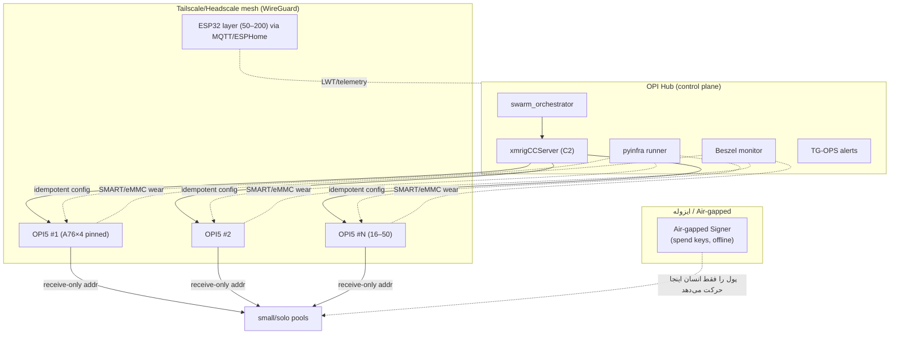
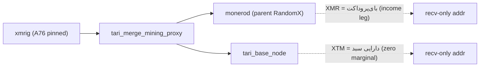
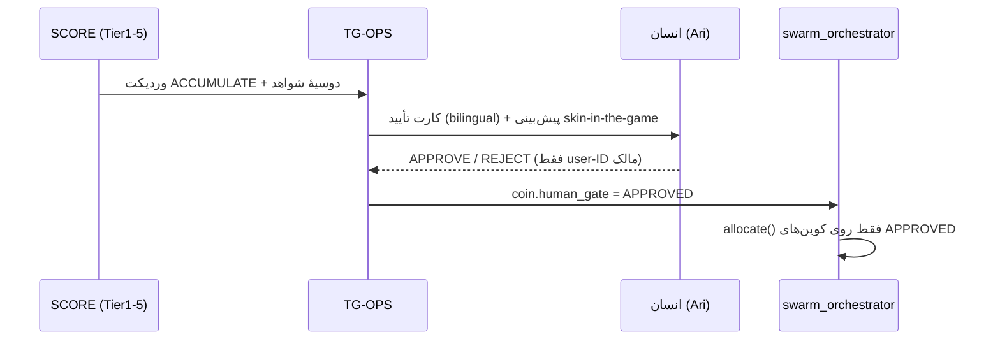

# لایه ۶ — اجرا و ارکستراسیون ناوگان (ACT)

این لایه سومین ضلع حلقهٔ کنترل **SENSE → SCORE → ACT** است: بعد از اینکه [[02 - SENSE-Discovery-Layer]] کاندید را کشف کرد و [[05 - AGENT-BRAIN-Decision-Layer]] وردیکت `ACCUMULATE` صادر کرد و **گیت انسانی** ورود را تأیید کرد، این لایه تعیین می‌کند که **هش‌پاور واقعاً چطور روی ناوگان اجرا می‌شود**. اینجا جایی است که «مغز» به «عضله» وصل می‌شود. اصول سخت R1–R8 در [[01 - GOVERNANCE-and-SAFETY]] بر تک‌تک بندهای این سند حاکم‌اند؛ هرجا طرح مبدأ با آن‌ها تصادم داشت، مسیر AUD-0-safe جایگزین شده است.

> اصل راهبر این لایه (Principle 3 از roadmap): **گلوگاه، کیفیت غربال است نه هش‌ریت.** بنابراین ACT عمداً «کند و امن» طراحی شده؛ سرعت را در SENSE می‌خریم، نه در اجرا. [SPEC]

## ۰. محور رژیم هزینه در این لایه

- **Regime A (پیش‌فرض، قفل‌شده — owner-confirmed 2026-07-18، binding طبق D-006):** کل orchestration روی ناوگان موجود اپراتور اجرا می‌شود. Tailscale free-tier یا Headscale سلف‌هاست، pyinfra/XMRigCC/Beszel/ESPHome همه open-source و رایگان. C2 روی یک Orange Pi هاب (نه VPS). صفر جریان نقدی. [FACT]
- **Regime B (owner-gated، پیش‌فرض OFF):** جایگزین‌های پولی — Tailscale تیمی پولی، یک C2 server ابری، یا نود همیشه‌روشن اجاره‌ای برای autonomy بهتر ۲۴/۷. هر کدام صریحاً با تگ `owner-gated OFF` علامت خورده و بدون وردیکت مالک که Rule 1 را override کند فعال نمی‌شود. [SPEC]

هیچ عنصر Regime-B در این سند مسیر پیش‌فرض نیست؛ Regime B خفته و owner-gated **OFF** می‌ماند و فعال‌سازی‌اش نیازمند یک وردیکت **جدید** مالک است (قفلِ D-006 فقط Regime A را تثبیت کرد، نه B).

## ۱. توپولوژی ناوگان



- **ACTIVE:** ۱۶–۵۰× Orange Pi 5 (RK3588 = 4×Cortex-A76 + 4×A55) لایهٔ اصلی هش. تعداد دقیق [OPEN] (منابع 16–50 و 17 را reconcile نکرده‌اند). + ۵۰–۲۰۰× ESP32 لایهٔ کم‌مصرف/توزیع‌شده. [FACT]
- **PARKED:** ۲× QMTECH Artix-7 200T + ۱× Artix-7 100T. allocator به‌صورت پیش‌فرض FPGA را **حذف** می‌کند مگر یک کوین صریحاً به FPGA پاداش دهد (آن‌وقت هم owner-gate). [FACT]
- ESP32 عملاً RandomX نمی‌کند؛ نقشش لایهٔ تله‌متری + background BTC-lottery (احتمال نزدیک صفر، پذیرفته‌شده) است — از طریق ESPHome + MQTT + LWT + LittleFS offline buffer مدیریت می‌شود. [FACT]

## ۲. swarm_orchestrator — تخصیص هش‌پاور

هستهٔ ACT. کارش: گرفتن سبد کوین‌های تأییدشده (خروجی SCORE + گیت انسانی) و توزیع هش‌ریت ناوگان با رعایت دو سقف و ترجیح استخر.

### دو سقف سخت
1. **سقف داخلی ناوگان (استتار هویت + تنوع):** هیچ کوینی بیش از **۲۰٪ کل هش‌ریت ناوگان** نگیرد. این مانع می‌شود کل ناوگان روی یک کوین «امضای» یکسان بدهد و chain-analysis آن را به‌عنوان یک بازیگر واحد شناسایی کند. [FACT، از shared context]
2. **گارد سهم-شبکه (anti-51% / R5):** اگر هش‌ریت ناوگان از یک آستانهٔ سهم از **کل هش‌ریت شبکهٔ آن کوین** فراتر رود، throttle. آستانهٔ نرم `NET_SHARE_SOFT = 2%`، throttle سخت در `NET_SHARE_HARD = 5%`. داده از minerstat API / block explorer (free/public tier؛ هر منبع پولی → owner-gated Regime-B، R1). اگر سهم‌شبکه نامعلوم بود → محافظه‌کارانه فرض کن بالاست و throttle کن (fail-safe). [SPEC]

### ترجیح استخر (dominant-pool avoidance)
برای هر کوین، از `pools.yaml` استخری انتخاب کن که: (a) استخر غالب **نباشد** (سهم شبکه‌اش زیر آستانه)، (b) small یا solo باشد، (c) receive-only address پشتیبانی کند، (d) fee منطقی. این هم anti-51% است هم ضد chain-analysis targeting. [FACT]

> [OPEN — Round 2] اسکیمای رجیستری استخر (`pools.yaml`) تعریف‌نشده — فیلدها (coin_id، pool_url/port، share_of_network، is_solo، fee، recv_only_support، last_checked)، منبع و کادنس به‌روزرسانی، و قرارداد اعتبارسنجی باید در Round 2 مشخص شوند.

```python
# swarm_orchestrator/allocate.py  —  pseudo-code [SPEC]
FLEET_HS_CAP   = 0.20   # <=20% از کل هش ناوگان روی هر کوین
NET_SHARE_SOFT = 0.02   # anti-51% نرم
NET_SHARE_HARD = 0.05   # anti-51% سخت (throttle اجباری)

def allocate(fleet, approved_coins, net_stats):
    total_hs = sum(b.hashrate for b in fleet if b.class == "RK3588")
    plan = {}
    for coin in approved_coins:               # فقط کوین‌های human-gated
        if coin.human_gate != "APPROVED":     # R8: بدون گیت انسانی، اجرا ممنوع
            continue                          # نه assert — با python -O حذف می‌شود؛ گیت امنیتی نباید ناپدید شود
        cap_internal = FLEET_HS_CAP * total_hs
        # گارد سهم شبکه:
        net_hs = net_stats.get(coin.id, {}).get("network_hs")
        if net_hs is None:                    # نامعلوم → محافظه‌کار
            cap_net = NET_SHARE_SOFT * (coin.est_net_hs or 0)
        else:
            cap_net = NET_SHARE_HARD * net_hs
        target_hs = min(cap_internal, cap_net, coin.desired_hs)
        if net_hs and target_hs > NET_SHARE_SOFT * net_hs:
            emit_alert("NET_SHARE_SOFT_EXCEEDED", coin)  # هشدار نرم؛ سقف سخت HARD همچنان اعمال شد
        pool = pick_pool(coin, net_stats)     # small/solo, non-dominant, recv-only
        if pool is None:                       # هیچ استخر امنی نبود
            emit_alert("NO_SAFE_POOL", coin); continue
        plan[coin.id] = {"hs": target_hs, "pool": pool,
                         "recv_addr": coin.receive_only_addr}  # R4
    return balance_across_boards(plan, fleet)  # پخش روی boardها برای camouflage
```

> [OPEN — Round 2] قرارداد allocator تعریف‌نشده — امضا و خروجی `pick_pool(coin, net_stats)` (معیار انتخاب/رتبه‌بندی استخرِ non-dominant/small/solo/recv-only و رفتار روی no-safe-pool) و `balance_across_boards(plan, fleet)` (الگوریتم پخش هش روی boardها برای camouflage و رعایت سقف ۲۰٪) باید در Round 2 مشخص شوند.

- **merge-mining استثناست:** جریان کاری merge-mined (بخش ۵) از نظر «کار PoW» یک stream است ولی دو کوین می‌دهد؛ سقف ۲۰٪ روی *هدف اصلی* (parent) اعمال می‌شود و XTM به‌عنوان بای‌پروداکت zero-marginal حساب می‌شود. [SPEC]
- خروجی allocator یک **پلن**‌است؛ اعمالش روی boardها از طریق XMRigCC (بخش ۳) انجام می‌شود. allocator هرگز خودش start/stop سخت‌افزار را دور از C2 نمی‌زند. [SPEC]

## ۳. استک بهینه‌سازی per-watt روی RK3588 (از SCOUT-B)

بزرگ‌ترین برد رایگان اینجاست، نه در خرید سخت‌افزار. ترتیب اثر (نزولی):

| بهینه‌سازی | اثر | نکته |
|---|---|---|
| **Huge pages** | تا **+۵۰٪ RandomX** — بزرگ‌ترین برد تکی، رایگان [EST] | 2MB hugepages روی ARM |
| **RAM OC** LPDDR5 → 6400 | برد ثانویه [EST] | پایداری را تست کن |
| **A76 pinning** | حذف نویز A55 روی throughput [EST] | cpu4–7 خوشهٔ big [EST] |
| **Self-compile** `-mcpu=cortex-a76` | باینری بومی سریع‌تر [EST] | هم‌زمان R3 را ارضا می‌کند |
| **governor=performance** | پایداری H/s [EST] | **قبل از اعتماد، وات را اندازه بگیر** |

> **MSR mod روی ARM وجود ندارد** — این ترفند x86 است؛ skip. [FACT]
> **CRITICAL CAVEAT:** RandomX دیگر مطلقاً ASIC-proof نیست (Bitmain X5 ~۲۱۲kH/s، X9 ~۱MH/s در ۲۰۲۴–۲۶). کوین تازه‌ای که ادعای «RandomX = CPU-only» دارد **yellow flag** است؛ در رتبه‌بندی yespower/yescrypt/GhostRider را روی دوام-CPU بالاتر بگذار (این ورودی به [[03 - SCORE-Screening-and-Forensics]] است). [FACT]

```bash
# huge pages (biggest win) — روی هر board، idempotent via pyinfra [SPEC/EST]
sysctl -w vm.nr_hugepages=1280        # 2MB pages؛ مقدار را با آزمون تنظیم کن [EST]
# self-compile xmrig بومی A76 (build-from-source = هم پرفورمنس هم R3) [SPEC]
cmake -DCMAKE_C_FLAGS="-mcpu=cortex-a76" -DCMAKE_CXX_FLAGS="-mcpu=cortex-a76" ..
make -j4
# governor پایداری H/s
for c in 4 5 6 7; do echo performance > /sys/devices/system/cpu/cpu$c/cpufreq/scaling_governor; done
```

```json
// xmrig config.json (بخش مهم) [SPEC]
{
  "cpu": { "enabled": true, "huge-pages": true, "priority": 5,
           "affinity": "0xF0", "rx": [4,5,6,7] },   // فقط خوشهٔ A76 [EST]
  "pools": [{ "url": "SMALL_SOLO_POOL:PORT",
              "user": "RECEIVE_ONLY_ADDRESS",        // R4: هیچ کلید خرجی
              "keepalive": true, "tls": true }],
  "randomx": { "1gb-pages": false, "mode": "auto" }
}
```

## ۴. صفحهٔ ارکستراسیون ناوگان

> این استک روی زیرساخت substrate هاب/ناوگان می‌نشیند؛ جزئیات کامل هاب و infra در [[07 - SUBSTRATE-Fleet-Hub-and-Infra]].

- **Mesh — Tailscale (free) یا Headscale (self-host).** جایگزین SSH دستی؛ WireGuard رمزنگاری‌شده بین همهٔ boardها و هاب. زیر Regime A هر دو رایگان‌اند؛ Headscale اگر مالک نخواهد به سرویس ثالث تکیه کند. [FACT]
- **pyinfra — agentless، idempotent.** پیکربندی boardها (hugepages، governor، systemd unitها، کاربر sandbox، نصب باینری self-compiled) به‌صورت declarative و تکرارپذیر. هیچ agent روی board نصب نمی‌شود؛ pyinfra از روی mesh اجرا می‌کند. [FACT]
- **XMRigCC — C2 بومی ARM.** `xmrigCCServer` روی هاب، `xmrigMiner` روی هر board: start/stop/reboot از راه دور + آلارم hashrate/offline به Telegram ([[01 - GOVERNANCE-and-SAFETY]] whitelist مالک). allocator پلن را به CC push می‌کند؛ CC به minerها اعمال می‌کند. [FACT]
- **ESPHome** لایهٔ ESP32 را مدیریت می‌کند؛ MQTT + LWT (اعلان offline خودکار) + LittleFS بافر آفلاین. [FACT]
- **Beszel** مانیتور فوق‌سبک — از جمله **فرسایش eMMC از طریق SMART**؛ ورودی مهم برای EV (R2: فرسایش سخت‌افزار هزینهٔ واقعی است، «رایگان» صفر نیست). تله‌متری کامل و death-watch در [[08 - MONITORING-Telemetry-and-Deathwatch]] مالکیت دارند. [FACT]
- **systemd watchdog + power-cycle خودکار (PoE / smart-plug)** پایهٔ self-healing (بخش ۶). [FACT]

```python
# pyinfra deploy (excerpt) — idempotent [SPEC]
from pyinfra.operations import server, files, systemd
server.sysctl(key="vm.nr_hugepages", value=1280, persist=True)
files.put(src="build/xmrig", dest="/opt/miner/xmrig", mode="750",
          user="miner", group="miner")          # کاربر بی‌امتیاز
systemd.service("xmrig-sandbox.service", running=True, enabled=True,
                daemon_reload=True, restart=True)  # واحد hardened بخش ۵
```

## ۵. اجرای مشخص R3 (ایزوله باینری) و R4 (بهداشت کلید)

مهم‌ترین اصل این دامنه (Principle 5): ناوگان **کد نامعتمد** اجرا می‌کند؛ خطر اصلی miner مسموم/cryptojacker است، نه قیمت.

**R3 — هر daemon ناشناخته sandbox می‌شود، هرگز روی ماشین اصلی اپراتور:**
- باینری miner ناشناخته **فقط** روی ناوگان ایزوله یا VM/sandbox اجرا می‌شود — **هرگز** روی دستگاه اصلی. [FACT]
- **build-from-source** یا **تأیید checksum/امضا** قبل از اجرا؛ اگر منبع بسته یا checksum غایب بود → auto-reject (این هم یک red-flag در [[03 - SCORE-Screening-and-Forensics]] است: closed-source miner). [FACT]
- هر daemon زیر یک systemd unit سخت‌شده، کاربر بی‌امتیاز، شبکهٔ محدود:

```ini
# /etc/systemd/system/xmrig-sandbox.service  [SPEC]
[Service]
User=miner
NoNewPrivileges=yes
ProtectSystem=strict
ProtectHome=yes
PrivateTmp=yes
ReadWritePaths=/opt/miner/state
CapabilityBoundingSet=            # هیچ capability
SystemCallFilter=@system-service
SystemCallArchitectures=native
RestrictAddressFamilies=AF_INET AF_INET6   # فقط استخر، نه دسترسی محلی
IPAddressAllow=POOL_IP            # allowlist مقصد
MemoryDenyWriteExecute=yes
Restart=always
WatchdogSec=120                   # self-healing (بخش ۶)
```

**R4 — بهداشت کلید، صفر کلید روی board:**
- boardها فقط **receive-only public address** نگه می‌دارند (برای Monero: primary/public address — دریافت به هیچ کلید خرجی نیاز ندارد). حتی private view key هم روی board ذخیره نمی‌شود؛ اگر اسکن تراکنش‌های دریافتی لازم شد، فقط روی یک هاست امن جدا از ناوگان انجام می‌شود، نه روی board (R4: هیچ کلید در هیچ فایل روی board/هاب). [FACT]
- **هیچ seed، private/spend key، در هیچ فایل/لاگ/چت روی board یا هاب نیست.** ([[01 - GOVERNANCE-and-SAFETY]] R4، لایهٔ امنیت [[10 - DATA-STATE-and-SCHEMA]]). [FACT]
- **جابه‌جایی/خرج وجه فقط روی air-gapped signer** و فقط با دست انسان انجام می‌شود. ربات هرگز وجه حرکت نمی‌دهد (R8). هاب می‌تواند آرشیو رمزنگاری‌شده **بنویسد** ولی نمی‌تواند تاریخچهٔ خودش را decrypt کند — این عمداً شعاع انفجار self-modification را می‌بندد. [FACT]
- برای هر قرارداد/dApp ناشناخته: burner wallet با موجودی صفر — هر امضای on-chain انسان-گیت و خارج از ناوگان/air-gapped است، کلید burner روی board/هاب ذخیره نمی‌شود و ربات خودش تراکنش نمی‌فرستد (R4/R8). (این مربوط به DePIN/verifiable-compute است، نه mining خالص.) [FACT]

## ۶. Self-healing / antifragile (Principle 4: شکست حالت نرمال است)

> دفاع adversarial و اصول antifragility در [[04 - Adversarial-Defense-and-Antifragility]] مالکیت دارند؛ این بخش صرفاً اجرای ACT-side آن‌هاست.

- **systemd `WatchdogSec` + `Restart=always`:** miner معلق → ری‌استارت خودکار با backoff. [SPEC]
- **power-cycle سخت‌افزاری:** board که به heartbeat جواب نداد → هاب smart-plug/PoE آن را power-cycle می‌کند (بازیابی از هنگ سخت‌افزاری؛ این کنترل برق زیرساخت موجود است، نه اتصال سخت‌افزار trading/signing — R8). [FACT]
- **backoff + cap:** ری‌استارت متوالی سقف دارد؛ board مکرراً fail → از پلن allocator بیرون گذاشته و به TG-OPS آلارم می‌رود (مبادا loop بی‌نهایت). [SPEC]
- **thermal/eMMC guard:** Beszel فرسایش eMMC و دما را می‌خواند؛ آستانهٔ داغ → throttle یا park آن board. [SPEC]
- **degrade نرم:** از دست رفتن ۱ board = افت جزئی هش، نه توقف؛ هیچ نقطهٔ شکست واحد در مسیر mining نیست (هاب اگر بیفتد، minerها با آخرین کانفیگ ادامه می‌دهند). [SPEC]

## ۷. Merge-mining — تنوع با هزینهٔ حاشیه‌ای صفر

**Tari (XTM) روی Monero (RandomX) merge-mine می‌شود** = قوی‌ترین mine-and-hold: یک دارایی جدید با **صفر هش‌پاور اضافی**. همان کار PoW هم‌زمان به دو زنجیره ثبت می‌شود. [FACT]



- معماری: `xmrig` → `tari_merge_mining_proxy` → هم `monerod` هم `tari_base_node`. proxy کار را به هر دو submit می‌کند. [EST]
- **نکتهٔ اصلی سازگاری با CORE_PRINCIPLES:** XMR در سبد **نیست** (famous coins OUT). اینجا XMR صرفاً **زنجیرهٔ parent / بای‌پروداکت** است — یک «income leg» فانجیبل، نه یک ورودی screen-شدهٔ سبد. دارایی mine-and-hold سبد فقط **XTM** است که با هزینهٔ حاشیهٔ صفر انباشت می‌شود. تصمیم نگه‌داشتن/تبدیل XMR کاملاً owner-gate است (R8). [SPEC]
- انبار RandomX ناوگان (Monero/Tari) لنگرِ کالیبراسیون per-watt هم هست؛ کوین‌های تازهٔ RandomX/RandomWOW (Wownero: 1MB scratchpad، جا در cache) و yespower برای نیمهٔ کم-RAM ناوگان روی همین rig سوار می‌شوند. سقف ۲۰٪ و ترجیح استخر همچنان اعمال می‌شود. [FACT/EST]

## ۸. گیت انسانی ورود کوین جدید (R8)

ACT هرگز خودش تصمیم «وارد یک کوین جدید شو» نمی‌گیرد. جریان:



- بدون `human_gate == APPROVED`، allocator کوین را نادیده می‌گیرد (گارد صریح `if != APPROVED: continue` در بخش ۲ — عمداً نه `assert`، چون `python -O` آن را حذف می‌کند). [SPEC]
- تأخیر adversarial ۷-روزه: کوین جوان‌تر از ۷ روز در LIMBO می‌ماند و حتی بعد از وردیکت وارد پلن اجرا نمی‌شود ([[04 - Adversarial-Defense-and-Antifragility]] / adversarial defenses؛ خانهٔ canonical تأخیر LIMBO آنجاست). [FACT]
- ربات هرگز trade نمی‌کند، هرگز وجه حرکت نمی‌دهد، هرگز به سخت‌افزار mining بیرون از C2 وصل نمی‌شود، هرگز CORE_PRINCIPLES/kelly/scout را ویرایش نمی‌کند. [FACT]

## ۹. کادنس اجرا (runbook)

| کادنس | عمل | ابزار |
|---|---|---|
| پیوسته | mining + watchdog + power-cycle خودکار | systemd, XMRigCC |
| ساعتی | allocator پلن را با net_stats تازه می‌سنجد (سقف‌ها) | swarm_orchestrator, minerstat API (free) |
| روزانه | مرور آلارم‌های offline/hashrate؛ فرسایش eMMC | Beszel, TG-OPS |
| هفتگی (جمعه) | مرور Group One (test-mine)؛ promote/abandon | pyinfra redeploy |
| ماهانه | مرور Group Two long-term + تصمیم procurement | انسان |
| هر تغییر پلن | push کانفیگ idempotent، سپس تأیید hashrate | pyinfra + XMRigCC |

> نکتهٔ reflexivity (نقصِ ساختاریِ Reflexivity / observer effect — روسترِ مرجع: [[04 - Adversarial-Defense-and-Antifragility]]): allocator باید **سهم بازار خودِ ناوگان** را در هر کوین کوچک log کند؛ یک buy/mine روی mcap ~$200k قیمت را حرکت می‌دهد. این متریک به sizing و به [[03 - SCORE-Screening-and-Forensics]] برمی‌گردد. [SPEC]

## ۱۰. نقاط باز

- تعداد دقیق ناوگان (16–50 vs 17) و ESP32 (50–200 vs 130) reconcile نشده. [OPEN]
- شماره‌گذاری خوشهٔ CPU روی این نسخهٔ RK3588 (A76 = cpu4–7 فرض شده) باید با `lscpu`/`cat /sys/.../cpu*/topology` روی سخت‌افزار واقعی تأیید شود. [OPEN]
- مقدار بهینهٔ `vm.nr_hugepages` و پایداری RAM OC وابسته به board، باید بنچ شود. [OPEN]
- سهم-شبکهٔ کوین‌های خیلی تازه اغلب نامعلوم است → allocator باید fail-safe (محافظه‌کار) رفتار کند تا داده معتبر شود. [OPEN]
- تناژ استخرهای small/solo برای هر کوین در `pools.yaml` باید نگه‌داری شود؛ استخر غالب کوین تازه سریع تغییر می‌کند. [OPEN]
- درمان مالیاتی AU برای انباشت mining (XTM/بای‌پروداکت XMR) [OPEN] — منتظر مشاور دارای مجوز؛ نه توصیهٔ مالی/مالیاتی.

---

## منابع / Sources

- **CONTROL LOOP (SENSE→SCORE→ACT) و ACT = fleet execution:** بخش «CONTROL LOOP» و «ACT» از shared context (سقف ۲۰٪ هش‌ریت، ترجیح small/solo pool، receive-only addresses، sandbox daemon، گیت انسانی).
- **SCOUT-B TECHNICAL PIPELINE:** huge pages (+۵۰٪)، RAM OC LPDDR5→6400، A76 pinning، self-compile `-mcpu=cortex-a76`، governor=performance، «MSR روی ARM نیست»، Tailscale/Headscale، pyinfra، XMRigCC، Beszel، ESPHome، systemd watchdog + power-cycle، merge-mining Tari+Monero، Wownero RandomWOW 1MB، caveat ASIC RandomX (Bitmain X5/X9).
- **LOCKED HARD RULES R1–R8** و **SIX DESIGN PRINCIPLES** (بخش ۵ امنیت، بخش ۴ antifragile، بخش ۸ autonomy earned): از shared context.
- **ADVERSARIAL DEFENSES:** dominant-pool avoidance، تأخیر ۷-روزه، reflexivity/market-share tracking.
- **SUBSTRATE (OPI Automation Hub):** TG-OPS whitelist، MQTT/LWT/LittleFS برای ESP32، جایگزینی VPS با Pi محلی زیر Regime A.
- **SECURITY/STORAGE (bot README):** سرور آرشیو می‌نویسد ولی decrypt نمی‌کند (سقف شعاع self-modification).
- **INGEST critique:** هاردور conflict (Cordelia/Armin، تعداد ناوگان، FPGA PARKED vs as-needed)، جدایی سرمایهٔ mining از investment، Two-Group System (Discovery/Long-Term)، Wownero exit-liquidity/«C64 veto».
- **INGEST roadmap-v3:** نقص #3 reflexivity (mcap $200k)، نقص #4 r-strategy trap، نقص #6 alignment-faking (پشتوانهٔ گیت انسانی).
