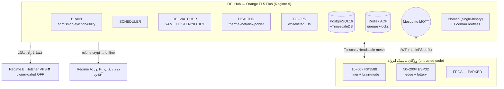

# لایه ۷ — بستر: ناوگان، هاب و زیرساخت (Substrate)

این لایه، «بدن سخت‌افزاری» شکارچی کوین است: رجیستری ناوگان فیزیکی، هاب اتوماسیون OPI که مغز و پایپ‌لاین روی آن اجرا می‌شوند، و قیدهای فیزیکی (توان، حرارت، فرسایش eMMC) که هیچ لایه نرم‌افزاری نمی‌تواند دور بزند. حلقهٔ کنترل SENSE→SCORE→ACT (سیبلینگ) روی این بستر می‌نشیند؛ ایزوله‌سازی باینری (R3) و رمزنگاری سه‌لایه با [[10 - DATA-STATE-and-SCHEMA]] هم‌مرز است؛ بهینه‌سازی فنی ماینینگ RK3588 در [[06 - ACT-Fleet-Execution-and-Orchestration]] عمیق‌تر باز شده. اینجا فقط بستر را می‌سازیم.

> اصل حاکم بر کل لایه: **رژیم هزینه قفل‌شده است**. پیش‌فرض و الزامِ **owner-confirmed / binding (D-006، تأیید مالک ۲۰۲۶-۰۷-۱۸)** = **Regime A (نقد صفر / AUD-0)** طبق Hard Rule 1؛ هر عنصر Regime B (Hetzner + ابر پولی) **خفته و owner-gated OFF** است و فعال‌سازی‌اش به یک **رأی جدید** مالک نیاز دارد؛ هرگز مسیر پیش‌فرض نیست. جزئیات حاکمیتی در [[01 - GOVERNANCE-and-SAFETY]].

---

## ۱. رجیستری سخت‌افزار (Hardware Registry)

منبعِ حقیقتِ واحد برای «چه چیزی داریم و هرکدام چه نقشی دارد». دو سند منبع اعداد ناسازگار می‌دهند؛ رجیستری این ناسازگاری را **پنهان نمی‌کند** بلکه به‌عنوان [OPEN] ثبت می‌کند تا با موجودی فیزیکی مچ شود.

> **این سند = مالکِ canonical شمارشِ ناوگان.** هر ذکر دیگری از تعداد نود در سایر لایه‌ها باید به اینجا ارجاع دهد، نه بازتعریف. تطبیقِ واحد: فرضِ معماری ۱۶–۵۰ Orange Pi 5 + ۵۰–۲۰۰ ESP32 + FPGAِ پارک؛ تحقیقِ solar-swarm ۱۶ Pi + ۱۴۰ ESP32 + ۲ FPGA؛ «۶ نود» کهنهٔ Hcash؛ رقمِ فیزیکیِ نهایی [OPEN] تا رجیستریِ مالک — OQ #۶ به شماره‌گذاریِ نوتِ vault ([[03 - Projects/Mining/OpenQuestions|OpenQuestions]])، D-007؛ در فضای OQ داخلیِ [[11 - BUILD-ROADMAP-and-Sequencing]] همین پرسش OQ-1 است.

### ۱.۱ جدول تطبیق شمارش (canonical view)

| کلاس | نقش | handoff (۱۱ ژوئن) | Plan v0.1 (Cordelia، مه) | canonical | وضعیت |
|---|---|---|---|---|---|
| Orange Pi 5 / RK3588 | miner + brain-node | ۱۶–۵۰× | ۱۷× OPi5 **Pro** | ۱۶–۵۰× [OPEN reconcile] | ACTIVE |
| ESP32 | edge کم‌مصرف / لایهٔ لاتاری | ۵۰–۲۰۰× | ۱۳۰× | ۵۰–۲۰۰× [OPEN] | ACTIVE |
| QMTECH Artix-7 200T | FPGA | ۲× | ۴× | ۲× [OPEN] | PARKED |
| Artix-7 100T | FPGA | ۱× | (شاید داخل ۴) | ۱× [OPEN] | PARKED |
| «۶ نود Hcash» | ؟ (تنظیم قدیمی HSHARE؟) | — | — | ؟ | **[OPEN — با موجودی فیزیکی راستی‌آزمایی شود]** |

- تعداد دقیق ناوگان **UNKNOWN/unreconciled** است [OPEN]؛ کد هرگز نباید عدد hard-code شده فرض کند — همیشه از رجیستری بخواند. [SPEC]
- FPGAها **PARKED**اند: نسل ۲۰۱۰، ابزار Nexus از ۲۰۲۲ فریز، توان رقابت با ASIC مدرن را ندارند [FACT]. نادیده بگیر مگر کوینی صریحاً به FPGA پاداش دهد (شاخهٔ آیندهٔ [OPEN]).
- لبهٔ ساختاری (هر دو سند): برق **زیر ۰٫۰۵ دلار/کیلووات‌ساعت یا خورشیدی** → این ناوگان کوین‌هایی را سودده می‌کند که برای ماینر متوسط زیان‌ده‌اند [FACT as stated]. این «edge zone» یک سیگنال مثبت است، نه حاشیه.

### ۱.۲ اسکیمای رجیستری (Postgres — جدول `host_state` توسعه‌یافته)

```sql
CREATE TABLE hardware_registry (
  node_id        text PRIMARY KEY,        -- مثل rk3588-07 ، esp32-a3
  hw_class       text NOT NULL,           -- rk3588 | esp32 | fpga_artix7
  role           text NOT NULL,           -- miner | brain | edge | hub | backup | parked
  soc            text,                    -- 'RK3588: 4xA76@2.4 + 4xA55'  [FACT]
  ram_gb         numeric,
  storage_kind   text,                    -- emmc | nvme | sdcard | flash
  tailscale_ip   inet,                    -- هویت مش؛ کلید camouflage
  mine_identity  text,                    -- آدرس receive-only فعال (هرگز seed)  R4
  power_source   text,                    -- solar | grid | poe
  max_temp_c     numeric DEFAULT 82,      -- آستانهٔ throttle
  emmc_life_pct  numeric,                 -- از SMART/Beszel
  status         text NOT NULL,           -- active | parked | halted | offline
  updated        timestamptz DEFAULT now()
);
```

- `mine_identity` فقط آدرس **RECEIVE-ONLY** است (R4). seed/private-key هرگز در این جدول، لاگ یا چت نمی‌آید؛ خرج‌کردن فقط روی امضاکنندهٔ air-gapped. [FACT/rule]
- `host_state` بلادرنگ (temp/hashrate/load) از HEALTHD در TimescaleDB hypertable ذخیره می‌شود تا روند فرسایش و حرارت قابل کوئری باشد. [SPEC]

---

## ۲. هاب اتوماسیون OPI — پلتفرمی که شکارچی روی آن می‌دود

نسخهٔ v2 «سیستم ۲۰-پروژه»: یک **Orange Pi 5 Plus** به‌عنوان هاب مرکزی. کوین‌شکار یا به‌عنوان چند task-definition روی همین هاب می‌نشیند، یا نسخهٔ standalone سبک (بخش ۵). دو plane مجزا:



### ۲.۱ Control plane (Python asyncio)
- **BRAIN** — admission / eviction / utility-scorer: تصمیم می‌گیرد کدام task روی کدام slot بنشیند، بر پایهٔ policyهای زندهٔ JSON. [SPEC]
- **SCHEDULER** — صف‌بندی و اجرای دوره‌ای (کِیدنس‌های SENSE/SCORE در بخش ۴).
- **DEFWATCHER** — plug-and-play: هر فایل YAML جدید در پوشهٔ تعریف‌ها + `LISTEN/NOTIFY` پستگرس → task بدون ری‌استارت hot-load می‌شود. [SPEC]
- **HEALTHD** — حسگر حرارت/شبکه/دیسک/**هزینهٔ توان**؛ صادرکنندهٔ رویدادهای HALT (بخش ۶).
- **TG-OPS** — کنترل و آلارم تلگرام، فقط از user ID‌های whitelist مالک (R8؛ ربات هرگز trade/withdraw نمی‌کند).

### ۲.۲ Infra plane
- **PostgreSQL 16 + TimescaleDB** = رجیستری + state + سری‌زمانی سلامت. [FACT stack]
- **Redis 7 (AOF)** = صف‌ها + قفل‌ها (SETNX برای dedup).
- **Mosquitto** = گذرگاه MQTT لبهٔ ESP32.
- **Nomad** (تک‌باینری) + **Podman rootless** = ارکستراسیون کانتینرها؛ rootless برای کاهش شعاع انفجار کد نامطمئن (R3/R5).

### ۲.۳ Workload plane — RQ workers per slot-class
هر slot-class یک استخر RQ است؛ نگاشت به بارِ کوین‌شکار:

| slot | نیمرخ منبع | بار کوین‌شکار (نگاشت به [[00 - MASTER-ARCHITECTURE]]) |
|---|---|---|
| **XS** | ESP32 / heartbeat | حسگرها، LWT، لایهٔ لاتاری، ping ناوگان |
| **S** | سبک I/O-bound | SENSE: پول CoinGecko/SRBMiner-diff/GitHub-releases/bitcointalk + sanitiser تزریق |
| **M** | متوسط CPU | Tier1 Scout (Qwen 7B) triage ساعتی روی فیلترهای سخت |
| **L** | سنگین CPU/RAM | Tier2 Forensics (Qwen 14B) هر ۶ ساعت، دوسیهٔ ۱۰-بُعدی A–J |
| **XL** | خوشه‌ای/طولانی | ارکستراسیون ماینینگ + سنتز Tier3 (Claude تعاملی مالک در Regime A، **نه API متری**) |

- استنتاج محلی Qwen 7B/14B می‌تواند روی چند **brain-node** حکاکی‌شده از خودِ ناوگان RK3588 (۱۶GB) به‌عنوان L/XL اجرا شود، یا روی هاب اگر RAM کافی باشد. RK3588 برای 14B کند اما زیرِ Regime A رایگان است [EST].
- **Regime A**: Tier3/Tier4 روی مدل محلی یا Claude تعاملیِ همین‌جلسهٔ مالک؛ **صفر فراخوان متری**. Regime B مسیر API پولی را باز می‌کند (owner-gated).

### ۲.۴ Dedup سه‌لایه (idempotent pipeline)
مطابق SOP کوین‌شکار: (۱) `idempotency_key` محتوایی → (۲) `Redis SETNX` → (۳) `UNIQUE` پستگرس. هر کاندید کوین که دوباره از منبع دیگر بیاید skip می‌شود؛ triangulation منابع (اختلاف >۳۰٪ → DATA_INTEGRITY_ALERT) در لایهٔ دفاع آدرسری تعریف شده و اینجا فقط زیرساخت idempotency را فراهم می‌کنیم. [SPEC]

### ۲.۵ اسکیمای هستهٔ task
جداول: `task_definitions`, `task_runs`, `task_checkpoints`, `host_state`, `policies` (قواعد JSON زندهٔ قابل‌ویرایش).

```yaml
# defs/coinhunter_tier2_forensics.yaml  — plug-and-play، DEFWATCHER آن را hot-load می‌کند
id: ch_tier2_forensics
slot_class: L
schedule: "0 */6 * * *"          # هر ۶ ساعت روی بازماندگان Tier1
image: localhost/coinhunter:latest
cmd: ["python", "-m", "brain.tier2"]
checkpoint: true                  # نقطهٔ بازیابی برای بقای قطع برق
inputs:  {source: pg://survivors}
outputs: {sink: pg://dossiers}
policy_ref: forensics_v3          # آستانه‌ها در policies (live-editable)
```

---

## ۳. نگاشت slot ↔ ناوگان و پخش هش (anti-51% / camouflage)

- **حداکثر ۲۰٪** کل hashrate ناوگان روی هر کوین (R5 + ضدِ chain-analysis). SCHEDULER این سقف را هنگام تخصیص برای هر `mine_identity` اعمال می‌کند. [SPEC]
- ترجیح استخرهای کوچک/solo بر استخر غالب (dominant-pool avoidance).
- هویت مش با **Tailscale/Headscale** (نه SSH دستی)؛ هر نود IP/هویت مستقل → camouflage و سازگاری با «حداکثر یک نود DePIN هویت‌بند به‌ازای هر device/IP» (R5). [FACT tools]
- استقرار idempotent با **pyinfra** (agentless)؛ C2 ماینر با **XMRigCC** (ARM-native: start/stop/reboot از راه دور + آلارم hashrate/offline تلگرام). [FACT]
- لایهٔ ESP32 با **ESPHome** + MQTT؛ بافر آفلاین **LittleFS** + LWT برای زنده‌ماندن در قطع اتصال. [FACT]

---

## ۴. کِیدنس‌ها (که SCHEDULER روی بستر می‌راند)

| کار | دوره | slot |
|---|---|---|
| Tier1 Scout triage | ساعتی | M |
| Tier2 Forensics | هر ۶h | L |
| Tier3 Synthesis (verdict) | روزانه | XL |
| Tier4 Meta / drift | هفتگی | XL |
| کشف کوین (Friday review) | هفتگی جمعه | S |
| بازبینی Group Two + بکاپ | ماهانه | XL |

منبع کِیدنس‌ها: CORE_PRINCIPLES + Plan v0.1 §7. تصمیم ورود به هر کوین جدید **همیشه human-gate** است (R8).

---

## ۵. گزینهٔ سبک standalone (بدون هابِ کامل)

اگر مالک نخواهد کل پلتفرم ۲۰-پروژه را بالا بیاورد، بیلد حداقلی روی یک تک‌برد:

- **SQLite (WAL)** به‌جای Postgres؛ **APScheduler/cron** به‌جای Nomad/SCHEDULER؛ **filesystem queue** یا Redis سبک به‌جای RQ.
- همان `defs/*.yaml` ولی خوانده‌شده مستقیم توسط یک لوپ asyncio تک‌فایلی (DEFWATCHER-lite با watchdog).
- ذخیرهٔ داغ: **SQLite + SQLCipher** (کلید مشتق‌از-پسورد، هرگز persist نمی‌شود) — مطابق [[10 - DATA-STATE-and-SCHEMA]].
- مسیر ارتقا: وقتی بار از یک برد فراتر رفت، مهاجرت به هابِ کامل بند ۲ بدون تغییر قرارداد YAML. [SPEC]
- محدودیت صادقانه: standalone خودترمیمی و multi-node را از دست می‌دهد؛ برای فاز اعتبارسنجی/بک‌تست خوب است، برای ۲۴/۷ ناوگان کامل نه. [EST]

---

## ۶. قیدهای فیزیکی — توان، حرارت، فرسایش eMMC + قانون HALT

«رایگان صفرِ هزینه نیست»: فرسایش CPU/فن + ریسک امنیتی + زمان، همه در EV می‌آیند (R2).

### ۶.۱ قانون HALT هزینهٔ توان (<$0.05/kWh)
```yaml
# policies: power_cost_guard  (live-editable JSON rule)
rule: power_cost_halt
inputs:  [current_price_kwh, power_source]
predicate: "power_source != 'solar' AND current_price_kwh >= 0.05"
action: emit POWER_COST_HALT      # HEALTHD → SCHEDULER اسلات‌های miner را drain می‌کند
recover:  "current_price_kwh < 0.045 OR power_source == 'solar'"  # هیسترزیس
```
- منبع قیمت: خورشیدی ≈ ۰ [FACT]؛ در حالت شبکه، ورودی دستی/حسگر تعرفهٔ لحظه‌ای. اگر منبع نامعلوم → fail-safe به HALT (محافظه‌کارانه). [SPEC]
- HALT فقط ماینینگ را می‌خواباند، نه control-plane؛ کشف/اسکورینگ ادامه دارد چون بار CPU ناچیزی دارند.

### ۶.۲ حرارت
- RK3588 نزدیک ~۸۵°C throttle می‌کند [EST]؛ `max_temp_c` پیش‌فرض ۸۲ در رجیستری، حاشیهٔ ایمنی. HEALTHD در عبور از آستانه: ابتدا governor/hashrate را کم می‌کند، سپس اسلات را pause. [SPEC]
- governor=performance برای پایداری H/s لازم است ولی گرمی و مصرف بیشتر → قبل از اعتماد به «efficiency»، وات را اندازه بگیر (هشدار [[06 - ACT-Fleet-Execution-and-Orchestration]]). [FACT]
- huge pages تا +۵۰٪ RandomX [FACT، منبع SCOUT-B] (بزرگ‌ترین بردِ رایگان) بار حرارتی مفید را بالا می‌برد؛ خنک‌کاری فعال (هیت‌سینک + فن) الزامی.

### ۶.۳ فرسایش eMMC (کشندهٔ خاموشِ ناوگان)
- eMMC تقریباً ~۳۰۰۰ چرخهٔ P/E دارد [EST]؛ نوشتن پیوستهٔ لاگ آن را می‌سوزاند.
- کاهش‌ها: **log2ram/tmpfs** برای لاگ فرّار؛ ارسال لاگ به هاب (remote) به‌جای دیسک محلی؛ روی هاب از **NVMe M.2** (Pi 5 Plus پشتیبانی می‌کند) برای Postgres/Redis استفاده کن، نه eMMC — اگر NVMe از قبل موجود نیست، خرید آن یک **hardware purchase یک‌باره و owner-gated (R1)** است، نه پیش‌فرض خودکار. [SPEC]
- پایش: **Beszel** سبک، شامل خواندن **SMART/eMMC wear**؛ `emmc_life_pct` در رجیستری به‌روز می‌شود و زیر آستانه → آلارم TG-OPS و کاندید تعویض نود. [FACT tool]

### ۶.۴ خودترمیمی + بقای قطع برق (Principle 4 — antifragile)
- **systemd watchdog** + power-cycle از راه **PoE / پریز هوشمند** → نود قفل‌شده خودکار ری‌استارت. [FACT]
- بقای قطع برق پستگرس/Redis: `synchronous_commit` + AOF + checkpointها + یک **recovery_worker** که پس از بوت، taskهای نیمه‌کاره را از `task_checkpoints` ازسر می‌گیرد. [SPEC]
- منطق backoff + سقف تلاش برای نودهای مکرراً affline (درس supervision-gap: عدم ثبت watchdog = مرگ خاموش).

---

## ۷. رژیم هزینهٔ زیرساخت — قفل‌شده (owner-confirmed)

> رژیم هزینه **قفل‌شده** است: Regime A طبق تأیید مالک (۲۰۲۶-۰۷-۱۸، **D-006**) الزام‌آور و پیش‌فرض است؛ Regime B **خفتهٔ owner-gated OFF** — فعال‌سازی نیازمند یک **رأی جدید** مالک است و مسیر پولی هرگز پیش‌فرض نیست.

| مؤلفه | **Regime A — AUD-0 (پیش‌فرض، الزام‌آور، قفل‌شده D-006)** | **Regime B — Managed/Paid (خفته، owner-gated OFF)** |
|---|---|---|
| هاب | یک Orange Pi 5 Plus موجود مالک | Hetzner CCX + RunPod burst |
| بکاپ/رِپلیکا | **نود Pi دومِ محلی / سخت‌افزار آفلاین** | replica ابری + satellite-brain روی VPS |
| کلد-بکاپ | `rclone crypt` → دیسک آفلاین مالک | `rclone crypt` → Backblaze B2 / Wasabi |
| LLM سطح‌بالا | مدل محلی + Claude تعاملیِ مالک (بدون متر) | Claude/GPT-4o از طریق API متری |
| هزینهٔ ماهانه | **AUD 0** | **~$80–150/ماه** [EST] |

- درفت v2 هاب فرض «$10/ماه VPS برای replica/backup/satellite-brain» داشت → **زیر Regime A با نود Pi دومِ محلی یا بکاپ آفلاین جایگزین می‌شود.** پیش‌فرض واقعیِ AUD-0 = بکاپ آفلاین روی **سخت‌افزار موجودِ مالک**؛ اگر نود Pi دومِ تازه لازم شود، آن یک **hardware purchase یک‌باره و owner-gated (R1)** است، نه مسیر پیش‌فرض. [FACT resolution]
- «هزینهٔ عملیاتی ~$80–150/ماه» درفت بات (Hetzner+RunPod+Claude API) یک **خروجی نقدی ماهانه** است که Hard Rule 1 را نقض می‌کند → در Regime A حذف؛ فقط با رأی صریح مالک که R1 را override کند فعال می‌شود. [CONFLICT flagged → AUD-0-safe path = Regime A]
- سرور رمزنگاری‌شده می‌نویسد اما **نمی‌تواند تاریخچهٔ خود را رمزگشایی کند** (کلید نزد مالک) → سقف عمدی روی شعاع خود-تغییر؛ در هر دو رژیم برقرار (پیوند [[10 - DATA-STATE-and-SCHEMA]]).

---

## ۸. قیدهای ایزوله‌سازی که بستر باید تضمین کند (R3 — مهم‌ترین)

- کد ماینر/daemon نامطمئن **فقط** روی ناوگان ایزوله یا sandbox/VM اجرا می‌شود، **هرگز روی ماشین اصلی مالک** [FACT/rule]. Podman rootless + شبکهٔ Tailscale جدا از LAN شخصی، مرز اجرای این قاعده در بستر است.
- قبل از اجرا: verify checksum/signature یا build-from-source؛ هر daemon sandbox. ریسک اصلی این حوزه ماینرِ مسموم/cryptojacker است، نه قیمت (Principle 5). لایهٔ نرم‌افزاری‌اش در [[01 - GOVERNANCE-and-SAFETY]] و sanitiser تزریق در لایهٔ دفاع آدرسری.
- کیف‌پول‌های ماینینگ فقط **receive-only**؛ هیچ balance روی نودها. جداسازی opsec سه‌گانهٔ ماینینگ/holding/trading یک [OPEN] از Plan v0.1 §9 است که در لایهٔ امنیت بسته می‌شود.

---

## ۹. کارهای باز این لایه [OPEN]

1. راستی‌آزمایی موجودی فیزیکی: شمارش واقعی OPi5/ESP32/FPGA و روشن‌کردن «۶ نود Hcash». (تضاد handoff↔Plan v0.1)
2. تصمیم Plan v0.1 §9: ارکستراسیون روی یک نود اختصاصی OPi یا always-on box؟
3. RAM هاب: نسخهٔ ۴GB برای Postgres+Redis+Nomad+Podman تنگ است → پیشنهاد ۸–۱۶GB variant (اگر مستلزم خرید برد جدید باشد، **hardware purchase یک‌باره و owner-gated طبق R1** — نه مسیر پیش‌فرض؛ گزینهٔ AUD-0 = standalone بند ۵ روی برد موجود). [SPEC]
4. اوراکل قیمت توان برای HALT در حالت شبکه (ورودی دستی vs حسگر).
5. جداسازی cold-storage/opsec (hardware/paper/multi-sig) — تحویل به [[10 - DATA-STATE-and-SCHEMA]].

---

## منابع / Sources

- **SUBSTRATE = OPI AUTOMATION HUB v2** (بخش مشترک): planeها، Nomad/Podman/Postgres/Redis/Mosquitto، slot-class XS–XL، dedup سه‌لایه، جداول task_*، بقای قطع برق، و جایگزینی VPS $10 با نود محلی زیر Regime A.
- **SCOUT-B TECHNICAL PIPELINE**: RK3588 (4×A76+4×A55)، huge pages +۵۰٪، Tailscale/Headscale، pyinfra، XMRigCC، Beszel/eMMC-SMART، systemd watchdog + PoE power-cycle، ESPHome.
- **INGEST ingest:critique §4** (سخت‌افزار): تضاد شمارش handoff (۱۶–۵۰ / ۵۰–۲۰۰ / ۲×۲۰۰T+۱×۱۰۰T PARKED) در برابر Plan v0.1 (۱۷ OPi5 Pro / ۱۳۰ ESP32 / ۴× Artix-7)، تضاد مالک Cordelia↔Armin، لبهٔ برق <$0.05/kWh.
- **INGEST ingest:critique §5/§7**: انبار سه‌لایهٔ رمزنگاری‌شده (SQLite+SQLCipher / MinIO+age / rclone crypt)، هزینهٔ ~$80–150/ماه به‌عنوان تعارض AUD-0.
- **LOCKED HARD RULES R1–R8** و **SIX DESIGN PRINCIPLES 4/5** و **محور رژیم هزینه A/B** از بریف مشترک.
- سیبلینگ‌ها: [[01 - GOVERNANCE-and-SAFETY]]، [[00 - MASTER-ARCHITECTURE]]، [[10 - DATA-STATE-and-SCHEMA]]، [[06 - ACT-Fleet-Execution-and-Orchestration]]، [[04 - Adversarial-Defense-and-Antifragility]]، [[05 - AGENT-BRAIN-Decision-Layer]].
