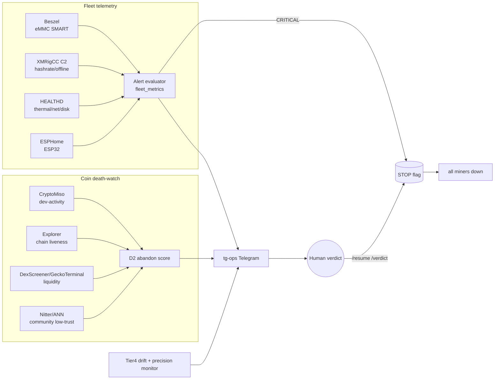

# لایه ۸ — پایش، تله‌متری و Death-watch

این لایه چشمِ سیستم است: هم **ناوگان** (سخت‌افزار) و هم **سبد** (کوین‌ها) را می‌بیند و به لایه‌ی حاکمیت گزارش می‌دهد. اصل راهنما = اصل ۴ (شکست حالتِ عادی است → antifragile، self-healing) و اصل ۶ (autonomy کسب می‌شود). قاعده‌ی بنیادین این لایه: **observe + propose، نه decide**. تنها عملِ خودکارِ مجازِ این لایه، عملِ *ایمنی‌مثبت* است — یعنی همان مجموعه‌ای که در بخش ۱۳ تعریف می‌شود: خاموش‌کردن (kill-switch)، quarantine/isolate، throttle، pause-recs، rollback، و self-healِ محدود و بازگشت‌پذیر (مثلِ یک‌بار restart/power-cycle). هر self-heal تابعِ fail-closed STOP است و هرگز نمی‌تواند مینینگی را که عمداً halt شده از سر بگیرد. ورود/خروج کوین، جابه‌جایی وجه، هر ACCUMULATE و هر بازگشت پس از STOPِ عمدی به gate انسانی می‌رود (R8) — رجوع به [[01 - GOVERNANCE-and-SAFETY]].

## ۱. دو دامنه‌ی پایش



- **Fleet telemetry** = آیا سخت‌افزار زنده، خنک، امن و پربازده است؟ نرخِ نمونه‌برداری ثانیه/دقیقه.
- **Coin death-watch** = آیا هر کوینِ داخل سبد هنوز زنده است؟ نرخِ ساعت/روز.
- هر دو در همان جدولِ `alerts` می‌ریزند و از همان کانالِ tg-ops عبور می‌کنند تا اپراتور **یک** سطحِ توجه داشته باشد.

## ۲. رژیم هزینه (Cost regime)

- **Regime A (پیش‌فرض، AUD 0):** کل estack پایش روی ناوگانِ خودِ اپراتور خودمیزبان است — Beszel-hub، XMRigCC server، HEALTHD و tg-ops همه روی همان Orange Pi 5 Plus هابِ [[07 - SUBSTRATE-Fleet-Hub-and-Infra]] اجرا می‌شوند. هیچ Grafana Cloud / Datadog / هیچ سرویسِ alertِ پولی. dead-man's-switch از یک دستگاهِ دومِ محلی (Pi یدکی یا تلفنِ اپراتور) پینگ می‌گیرد. [SPEC]
- **Regime B (owner-gated، پیش‌فرض OFF):** افزودنِ healthchecks/Grafana-Cloud میزبان‌شده برای پایش 24/7 مستقل از هاب. هر عنصرِ Regime-B اینجا صریحاً OFF است و نقض R1 محسوب می‌شود مگر با verdict مالک. رجوع به [[00 - MASTER-ARCHITECTURE]].

## ۳. Stack تله‌متریِ ناوگان

| مؤلفه | نقش | چه می‌سنجد | منبع |
|---|---|---|---|
| **Beszel** | مانیتورِ فوق‌سبک (agent+hub) | CPU/RAM/disk/net/temp هر host + **eMMC wear از SMART** (percentage-lifetime-used) | [FACT] Scout-B |
| **XMRigCC** | C2 ارمِ ماینرها | hashrate هر rig، online/offline، remote start/stop/reboot، آلارمِ تلگرام | [FACT] Scout-B |
| **HEALTHD** | daemonِ کنترل‌پلینِ هاب (asyncio) | thermal/net/disk؛ می‌نویسد به Postgres + MQTT | [FACT] Substrate |
| **ESPHome** | لایه‌ی ESP32 | سنسورها روی MQTT/native API + LWT برای offline-detect | [FACT] Scout-B |
| **systemd watchdog + PoE/smart-plug** | self-heal | ری‌استارتِ سرویس؛ power-cycleِ برقِ بورد | [FACT] Scout-B |

جریانِ داده: HEALTHD/Beszel/XMRigCC → `fleet_metrics` (TimescaleDB hypertable) → **alert evaluator** (یک worker RQ در slot-class XS که هر ۱۵ ثانیه بیدار می‌شود) → `alerts` + tg-ops. de-dup سه‌لایه‌ی substrate (idempotency_key + Redis SETNX + Postgres UNIQUE) از طوفانِ alert جلوگیری می‌کند.

## ۴. اسکیمای تله‌متری (Postgres 16 + TimescaleDB)

```sql
-- سریِ زمانیِ ناوگان
CREATE TABLE fleet_metrics (
  ts        timestamptz NOT NULL,
  host_id   text        NOT NULL,     -- opi5-07 / esp32-113 / hub
  metric    text        NOT NULL,     -- cpu_temp_c|hashrate_hs|mem_pct|disk_pct|
                                       -- emmc_life_pct|power_w|net_egress_unknown
  value     double precision NOT NULL
);
SELECT create_hypertable('fleet_metrics','ts');

CREATE TABLE host_state (
  host_id      text PRIMARY KEY,
  role         text,                   -- opi5|esp32|hub
  status       text,                   -- online|offline|throttled|stopped|quarantined
  current_coin text,                   -- کدام کوین را می‌کند
  last_seen    timestamptz,
  emmc_life_pct double precision
);

CREATE TABLE alerts (
  id          bigserial PRIMARY KEY,
  ts          timestamptz DEFAULT now(),
  severity    text,                    -- INFO|WARN|CRITICAL
  atype       text,                    -- thermal_crit|node_offline|unknown_egress|...
  scope       text,                    -- host_id یا coin_id
  detail      jsonb,
  idem_key    text UNIQUE,             -- de-dup: atype+scope+bucket
  ack_by      text, ack_ts timestamptz,
  resolved_ts timestamptz
);

-- تک‌منبعِ حقیقتِ کنترل (kill-switch و soft-halt)
CREATE TABLE system_flags (
  key        text PRIMARY KEY,         -- STOP | power_halt | recommendations_paused
  value      boolean NOT NULL,
  updated_by text, updated_ts timestamptz DEFAULT now()
);
```

retention: `fleet_metrics` خامِ ثانیه‌ای ۱۴ روز، سپس continuous-aggregate ساعتی برای ۱ سال (فشرده‌سازیِ Timescale). [SPEC]

## ۵. کاتالوگِ کاملِ شرایطِ Alert

هر ردیف = یک قاعده‌ی evaluator. severity: INFO (digest)، WARN (digestِ روزانه)، CRITICAL (push فوری + احتمال تریپِ kill-switch).

| Alert | آستانه‌ی trigger | severity | عملِ خودکار | tag |
|---|---|---|---|---|
| Thermal warn | `cpu_temp_c > 78` پایدار ۶۰s | WARN | governor→conservative | [EST] |
| Thermal critical | `> 85` یا رخدادِ throttle | CRITICAL | stopِ همان rig (محلی) | [EST] |
| Hashrate drop | rig `< 80%` از baselineِ ۱۰-دقیقه‌ای، ۵ دقیقه | WARN | tg + investigate | [SPEC] |
| Hashrate collapse | rig `< 30%` یا `0` | CRITICAL | rig را suspect علامت بزن | [SPEC] |
| **Node offline** | بی‌heartbeat `> 60s` | CRITICAL | یک‌بار PoE/smart-plug power-cycle | [FACT] |
| Node offline پایدار | بعد از power-cycle + ۵ دقیقه هنوز offline | CRITICAL | gate انسانی | [SPEC] |
| **Unknown outbound** | egress به IP/domainِ خارج از allowlist | CRITICAL | host را به no-egress ببر؛ کاندیدِ تریپِ kill-switch | [SPEC] |
| **AV/EDR warning** | هر آلارمِ AV روی ناوگان | CRITICAL | isolate host + انسان | [SPEC] |
| Binary checksum mismatch | hashِ باینریِ ماینر ≠ pinned | CRITICAL | refuse-start + quarantine (R3) | [SPEC] |
| eMMC wear | SMART life-used `> 80%` | WARN | برنامه‌ی تعویض | [EST] |
| Disk full | `disk_pct > 90` | WARN | چرخشِ log | [SPEC] |
| **Power regime breach** | برآوردِ effective `$/kWh > 0.05` | CRITICAL | HALT-candidate + انسان (R2) | [SPEC] |
| Coin D2 fired | `d2_score ≥ 0.6` | WARN | ABANDON_PROPOSED به انسان | [SPEC] |
| Trading halted | `vol_24h < MIN` یا halt `≥ 3` روز | CRITICAL | تغذیه‌ی liquidity_death در D2 | [FACT] |
| Data integrity | واگراییِ منابع `> 30%` | CRITICAL | DATA_INTEGRITY_ALERT، میانگین نگیر | [FACT] |
| Drift HIGH | هر محورِ Tier4 = HIGH | CRITICAL | `recommendations_paused=true` | [SPEC] |
| Precision drop | precision@6mo افتِ `> 20%` در پنجره‌ی ۳۰ روزه | CRITICAL | auto-rollbackِ آخرین self-mod | [FACT] |
| Monitoring dead-man | بی‌telemetry-heartbeat `> ۱۰ min` | CRITICAL | پینگِ خارجی به اپراتور | [SPEC] |

> **آستانه‌ی Thermal:** RK3588 معمولاً حولِ ~۸۵°C throttle می‌کند؛ ۷۸°C به‌عمد یک warnِ محافظه‌کارانه *زیرِ* آن است تا governor قبل از افتِ H/s واکنش دهد. اعداد [EST]، پیش از اتکا watt را بسنج (رجوع Scout-B).

## ۶. تشخیصِ cryptojacker — مهم‌ترین alert امنیتی (R3)

خطرِ شماره‌یکِ این دامنه *قیمت نیست، باینریِ مسموم است*. `Unknown outbound` هسته‌ی این دفاع است:

```python
# روی هابِ HEALTHD، هر نمونه‌ی net از هر host
ALLOWLIST = load_yaml("net_allowlist.yaml")   # poolها، explorer APIها، tg، NTP، بروزرسانیِ pinned
def check_egress(host_id, conns):
    for c in conns:                            # از /proc/net یا conntrack روی هر بورد
        if not matches(c.dst, ALLOWLIST):
            emit_alert("unknown_egress","CRITICAL",host_id,
                       {"dst":c.dst,"port":c.dport,"proc":c.proc})
            quarantine(host_id)                # drop به no-egress، ماینر را نگه‌دار برای forensics
            maybe_trip_killswitch(reason="cryptojacker_signature")
```

- ناوگان کدِ untrusted اجرا می‌کند؛ isolation غیرقابل‌مذاکره است (اصل ۵). هر daemonِ ناشناخته sandbox/VM، هرگز ماشینِ اصلیِ اپراتور (R3).
- checksum/signature هر باینریِ ماینر pin شده؛ mismatch = refuse-start. allowlistِ شبکه انسان‌ویرایش است (مثلِ `policies` در substrate).

## ۷. Kill-switch (تریپِ سراسری)

**تک‌منبعِ حقیقت:** ردیفِ `system_flags(STOP)` در Postgres. مسیرِ سریع + مسیرِ ایمن:

- **مسیرِ سریع:** ست‌شدنِ STOP یک `NOTIFY killswitch` صادر می‌کند؛ XMRigCC C2 روی MQTT فرمانِ stop به همه‌ی rigها می‌فرستد. SLA: کل ناوگان `< ۳۰s` خاموش. [SPEC]
- **مسیرِ ایمن (fail-closed):** هر بورد مستقل هر ۱۵s flag را poll می‌کند و هر systemd-unitِ ماینر پیش از (ری)استارت آن را چک می‌کند. اگر flag ناخوانا بود، حالت = STOP.

```python
def mining_allowed() -> bool:
    # fail-closed: اگر STOP==false را قطعی نکردیم، نمی‌کَنیم
    try:
        stop = read_flag("STOP")           # Postgres → Redis → FS fallback (/var/run/coinhunter/STOP)
    except Exception:
        return False                        # حالتِ نامعلوم → توقف
    if stop or read_flag("power_halt"):     # power_halt = نقضِ R2
        return False
    return True
```

- **triggerهای STOP:** دستیِ `/stop`؛ thermal-critical سراسری؛ `unknown_egress`؛ AV/EDR؛ و **master-halt** از لایه‌ی حاکمیت ([[01 - GOVERNANCE-and-SAFETY]]) — این لایه صرفاً honor می‌کند، مالکِ منطقِ halt نیست.
- **پاک‌کردنِ STOP فقط انسانی است** (`/resume` با تأیید، user IDِ whitelist). بازگشت به مینینگِ عمداً halt‌شده هرگز خودکار نیست: توقف می‌تواند خودکار باشد، اما resume همیشه gate انسانی می‌خواهد (R8). self-healِ خودکار (restart/power-cycle) فقط نودِ به‌طورِ اتفاقی offline را برمی‌گرداند و همچنان تابعِ همان fail-closed STOP است — تا وقتی STOP ست است، هیچ restart‌ای به مینینگ برنمی‌گردد.

## ۸. tg-ops — فرمان‌ها و alertها

نوشتن فقط برای user IDهای whitelist (مثلِ TG-OPS در substrate)؛ غیرِ whitelist = read-only یا ignore.

| فرمان | کار |
|---|---|
| `/status` | چک‌لیستِ ۲-دقیقه‌ای (بخش ۹) |
| `/fleet` | جدولِ per-rig: temp/hashrate/coin/status |
| `/coin <sym>` | سلامتِ کوین + evidenceِ D2 |
| `/alerts` | alertهای بازِ unack |
| `/ack <id>` | acknowledge |
| `/stop` , `/resume` | تریپ/پاک‌کردنِ kill-switch (تأیید لازم) |
| `/pause_recs` , `/resume_recs` | soft-halt مغز |
| `/verdict <pid> approve\|reject` | verdict انسانی روی ABANDON_PROPOSED یا ACCUMULATE |

routing: WARN → digestِ روزانه؛ CRITICAL → push فوری. cooldown per-atype و de-dup با `idem_key` جلوی alert-fatigue را می‌گیرد. dead-man's-switch: اگر خودِ پایش `> ۱۰ min` ساکت شد، دستگاهِ دومِ محلی به اپراتور پینگ می‌زند.

## ۹. Death-watch کوین و سیگنالِ D2

ورودی‌ها (هر ۶–۲۴ ساعت، dedup + cite هر منبع):

- **dev-activity:** CryptoMiso (رتبه‌بندیِ commit-activity = پراکسیِ بقا) + GitHub API. `last_commit_age_d > 30` = red-flagِ CORE_PRINCIPLES.
- **chain liveness:** block explorer — فاصله‌ی بلاک در بازه‌ی مورد انتظار؟ فروپاشیِ network hashrate؟ افولِ unique-miner-addresses؟
- **liquidity liveness:** DexScreener/GeckoTerminal — `vol_24h`، آیا trading halt شده؟ (کیسِ Wownero: ~۲۲ روز halt → ریسکِ exit-liquidity → «C64 veto») [FACT].
- **community liveness:** Nitter/bitcointalk-ANN/Discord — **کم‌اعتماد** (FLAW 5 preference-falsification): وزنِ پایین، فقط tie-breaker نه gate.

```python
# WEIGHTS و آستانه‌ی 0.6 = [SPEC]؛ heuristicِ اولیه، calibrate پس از اولین سبدِ واقعی
WEIGHTS = {"dev":0.30, "chain":0.30, "liquidity":0.30, "community":0.10}
def d2(c):
    dev   = 1.0 if c.last_commit_age_d > 30 else decay(c.commits_30d)
    chain = 1.0 if c.last_block_age_s > 20*c.target_block_s else hashrate_decay(c)
    liq   = 1.0 if (c.trading_halted_days >= 3 or c.vol_24h < MIN_VOL) else vol_decay(c)
    comm  = community_decay(c)                    # LOW trust
    score = sum(WEIGHTS[k]*v for k,v in dict(dev=dev,chain=chain,
                                             liquidity=liq,community=comm).items())
    conf  = confidence(sources_agree=..., data_age=...)   # LOW|MEDIUM|HIGH
    return score, conf
# score >= 0.6 → ABANDON_PROPOSED(evidence) ؛ هرگز auto-abandon (R8، verdict انسانی)
```

- **خروجی = فقط پیشنهاد.** D2 یک ردیفِ `abandon_proposals` با evidence-dossier (منبع‌دار، confidence صریح، دوزبانه) می‌سازد و به `/verdict` می‌فرستد. باتِ هرگز خودش کوین را ترک نمی‌کند و بگ را نمی‌فروشد.
- **اختیاریِ flag-gated (پیش‌فرض OFF):** با `D2_AUTOPAUSE_HASH=on` مینینگِ آن کوین موقتاً pause می‌شود (برگشت‌پذیر، loggedِ محافظه‌کارانه) تا رأی برسد؛ بازتخصیصِ hashpower به [[06 - ACT-Fleet-Execution-and-Orchestration]].
- **حلقه‌ی ضدِ survivorship (FLAW 1):** هر کوینی که انسان ABANDON را approve کند، snapshotِ کاملِ ۹۰-روزِ نخستش + timestampِ مرگ به دیتاستِ `dead_coins` بایگانی می‌شود که hidden-test-setِ [[04 - Adversarial-Defense-and-Antifragility]] از آن تغذیه می‌شود.

```sql
CREATE TABLE coin_health (
  ts timestamptz, coin_id text, commits_30d int, last_commit_age_d int,
  last_block_age_s int, net_hashrate double precision, vol_24h_usd double precision,
  trading_halted_days int, community_score double precision,
  d2_score double precision, d2_conf text );
SELECT create_hypertable('coin_health','ts');

CREATE TABLE abandon_proposals (
  id bigserial PRIMARY KEY, coin_id text, ts timestamptz DEFAULT now(),
  d2_score double precision, evidence jsonb,
  status text DEFAULT 'proposed',           -- proposed|approved|rejected
  verdict_by text, verdict_ts timestamptz );
```

## ۱۰. Drift-detection از Tier4

Tier4 (هفتگی) پنج محورِ drift را می‌سنجد و به این لایه می‌دهد؛ ما آن‌ها را به alert و soft-halt تبدیل می‌کنیم:

- **mission creep، hype contamination، confirmation bias، edge neglect، adversarial erosion.** هر محور LOW/MED/HIGH.
- هر HIGH → `DRIFT_ALERT` + ست‌کردنِ `recommendations_paused=true` (توقفِ ACCUMULATEهای **جدید** تا بازبینیِ انسانی). این soft-kill-switchِ مغز است، در برابرِ hard-kill-switchِ ماینرها.
- **precision monitor:** این لایه precision@6mo را در پنجره‌ی چرخانِ ۳۰ روزه محاسبه می‌کند؛ افتِ `> 20%` → **auto-rollbackِ آخرین self-mod** (قاعده‌ی immutableِ CORE) + tg CRITICAL. رجوع به [[05 - AGENT-BRAIN-Decision-Layer]].
- **regressِ بی‌نهایت (FLAW §5.1):** چیزی driftِ خودِ Tier4 را نمی‌بیند جز انسان — پس گزارشِ drift همیشه به اپراتور می‌رود و یک چکِ «Tier4 self-consistency» تجمعِ ویرایش‌های `tactics.yaml` را می‌سنجد؛ اگر آستانه‌ها در ۹۰ روز جمعاً `> X%` جابه‌جا شدند → flag برای انسان. [SPEC]

## ۱۱. چک‌لیستِ روزانه‌ی ۲-دقیقه‌ای

خروجیِ تک‌پیامِ `/status` — اپراتور فقط یک پیام می‌خواند و روی هر CRITICAL عمل می‌کند:

1. **Fleet:** X/Y rig online · بیشینه‌ی temp · hashrateِ کل vs baselineِ ۲۴h · تعدادِ CRITICALِ باز.
2. **Power:** برآوردِ effective `$/kWh` vs گیتِ ۰.۰۵ (R2).
3. **Basket:** N کوینِ در حالِ ماین · هر D2-fired / ABANDON_PROPOSEDِ منتظرِ رأیِ تو.
4. **Brain:** وضعیتِ drift · `recommendations_paused`? · روندِ precision@6mo · ACCUMULATEهای منتظرِ gate.
5. **Security:** شمارشِ `unknown_egress` (باید ۰) · هشدارِ AV/EDR (باید ۰) · حالتِ STOP.

اگر همه سبز و هیچ verdictِ معلق نبود → کاری لازم نیست. این طراحیْ ساعتِ ۱۰–۲۰ ساعت‌در‌هفته‌ی اپراتور را محترم می‌شمارد.

## ۱۲. Cadenceها

| کار | نرخ |
|---|---|
| ارزیابیِ alertِ ناوگان | هر ۱۵s |
| heartbeat/offline check | هر ۶۰s |
| نمونه‌ی fleet_metrics | ثانیه‌ای (temp/hashrate)، دقیقه‌ای (disk/eMMC) |
| Death-watch pull | هر ۶–۲۴h |
| ارزیابیِ D2 | روزانه |
| Drift + precision | هفتگی (پس از Tier4) |
| dead-man's-switch | پیوسته (external ping) |

## ۱۳. این لایه هرگز چه نمی‌کند

- هرگز trade/withdraw/جابه‌جاییِ وجه نمی‌کند و به سخت‌افزارِ مالی وصل نمی‌شود (R8).
- هرگز خودش کوین را وارد/خارجِ سبد نمی‌کند؛ D2 فقط **پیشنهاد** می‌دهد.
- هرگز CORE_PRINCIPLES / kelly / scout را ویرایش نمی‌کند.
- تنها عملِ خودکارش ایمنی‌مثبت است: **توقف** (kill-switch، quarantine، pause-recs، rollback) و **self-healِ محدود و بازگشت‌پذیر** (یک‌بار restart/power-cycle، تابعِ fail-closed STOP). بازگشت به فعالیت پس از STOPِ عمدی همیشه gate انسانی می‌خواهد.

## ۱۴. موارد باز [OPEN]

- محلِ اجرای orchestrator/evaluator: nodeِ اختصاصیِ Orange Pi vs همان هابِ همیشه‌روشن — [OPEN].
- منبعِ اندازه‌گیریِ واقعیِ برق برای گیتِ `$/kWh` (smart-plug metered vs برآوردِ config) — [OPEN].
- آستانه‌ی دقیقِ `MIN_VOL` و پنجره‌ی halt برای liquidity_death، کالibره پس از اولین سبدِ واقعی — [OPEN].
- شمار دقیقِ ناوگان (16–50 OPi، 50–200 ESP32) ناهمخوان است؛ host_state باید ground-truthِ کشف‌شده را نگه دارد نه عددِ فرض — [OPEN].

## منابع / Sources

- **Scout-B technical pipeline** (Beszel + eMMC SMART، XMRigCC، systemd watchdog + PoE power-cycle، ESPHome، CryptoMiso، MiningPoolStats، GeckoTerminal، caveatِ RandomX/ASIC).
- **Substrate = OPI Automation Hub** (HEALTHD thermal/net/disk، TG-OPS whitelisted IDs، PostgreSQL 16 + TimescaleDB، Redis SETNX، MQTT + LWT، LISTEN/NOTIFY، dedupِ سه‌لایه، جدولِ policies).
- **CORE_PRINCIPLES** (red-flagِ no-commit-30d، unique-miner-addresses، output discipline دوزبانه/منبع‌دار/confidence، auto-rollback با افتِ precision@6mo > 20%).
- **SIX design principles** (اصل ۴ antifragile/self-healing، اصل ۵ isolation، اصل ۶ autonomy earned).
- **Hard rules** R2 (گیتِ $0.05/kWh)، R3 (binary isolation/cryptojacker)، R4 (receive-only)، R8 (توقفِ autonomy، gate انسانی).
- **Tier4 drift axes** + **adversarial defenses** (DATA_INTEGRITY_ALERT، cross-source triangulation > 30%).
- **Seven structural flaws** (FLAW 1 survivorship → dead_coins dataset؛ FLAW 5 preference-falsification → تخفیفِ وزنِ social).
- **Handoff context** (Wownero trading-halt ~۲۲ روز → «C64 veto» / exit-liquidity).
- خواهرلایه‌ها: [[01 - GOVERNANCE-and-SAFETY]] · [[00 - MASTER-ARCHITECTURE]] · [[05 - AGENT-BRAIN-Decision-Layer]] · [[06 - ACT-Fleet-Execution-and-Orchestration]] · [[04 - Adversarial-Defense-and-Antifragility]] · [[07 - SUBSTRATE-Fleet-Hub-and-Infra]].
