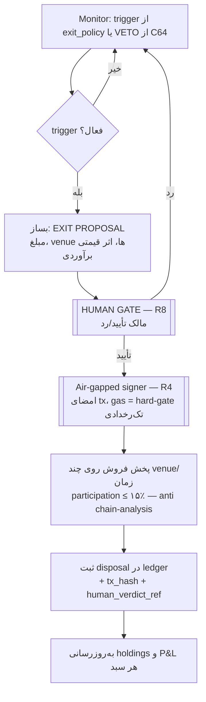

# لایه ۹ — خروج، نقدشوندگی و حسابداری (Exit, Liquidity & Accounting)

این لایه، انباشت را به **ارزش قابل‌تحقق** (realisable value) تبدیل می‌کند — بی‌آنکه هیچ قانون سختی نقض شود. اگر لایه‌های SENSE/SCORE/ACT سکه پیدا و ماین می‌کنند، این لایه پاسخ می‌دهد: «آیا اصلاً می‌شود از این دارایی بیرون آمد؟ چه‌وقت؟ چقدر؟ و مالیاتش از روز اول کجا ثبت شده؟». شعار لایه: **انباشت بدون مسیر خروج = زباله دیجیتال** — این مستقیماً بازتاب R6 و اصل «count is gameable» است. ([[01 - GOVERNANCE-and-SAFETY]])

> این لایه ماژول گم‌شده‌ی **«C64 veto / exit-feasibility»** را می‌سازد — همان قابلیتی که در handoff صریحاً MISSING علامت خورده بود: «سکه‌هایی که انباشتشان آسان اما خروج از آن‌ها ناممکن است، یک failure mode تأییدشده‌اند». [FACT]

---

## ۰. مرزهای سخت این لایه (خط قرمزها)

- **ربات هرگز نمی‌فروشد، هرگز وجه جابه‌جا نمی‌کند** (R8). خروجی این لایه فقط **پیشنهاد خروج (exit proposal)** است؛ اجرا فقط با human gate و روی **signer ایرگپ** (R4). [SPEC]
- هر disposal یک tx است و tx یعنی **gas = خروج نقدی** → با R1 برخورد می‌کند. راه‌حل: gasِ فروش یک **hard-gate تک‌رخدادی** است که از **عوایدِ همان فروش** تأمین می‌شود، نه از بودجه بازگشتی؛ باز هم owner-approved. این یک recurring cost نیست و **صفر برداشت از بودجه‌ی فیات AUD** دارد، پس ضمانت AUD-0 (Regime A) را نقض نمی‌کند اما باید صریحاً flag شود. [SPEC]
- کلید/سید هرگز در ledger، log یا چت نوشته نمی‌شود؛ آدرس‌های روی بردهای ماینر **receive-only** اند (R4). ledger فقط آدرس دریافت و مبلغ را می‌شناسد، نه هیچ کلید خصوصی. [FACT]
- مالیات AU = **[OPEN]** و **مشاوره مالی/مالیاتی نیست**؛ این لایه فقط **دفترِ شواهد** می‌سازد تا وقتی مشاور دارای مجوز آمد، داده خام آماده باشد (R8). [OPEN]

---

## ۱. جداسازی دو سبد — Income Basket در برابر Asymmetric-Tail

مهم‌ترین تصمیم معماری این لایه، مقابله با **نقص ساختاری #۳ (سقف اکسترموفیل / extremophile ceiling)** است: لبه‌ی برق ارزان یک **جریان درآمد پایدار** می‌سازد، نه یک شرط ۱۰۰x. اگر این دو را قاطی کنیم، خودمان را فریب داده‌ایم. پس هر دارایی در ledger یک `basket_class` اجباری دارد: [SPEC]

| سبد | هدف | منطق خروج | Sizing |
|---|---|---|---|
| `income` | نقد کردن منظم مازاد ماین‌شده برای پوشش هزینه‌های واقعی EV (سایش CPU/فن، ریسک امنیتی، زمان) | نردبان فروش نسبتاً تهاجمی؛ multipleهای پایین‌تر | سهم بزرگ‌تر از fleet hashrate |
| `tail` | شرط نامتقارن روی بقای بلندمدت (مثلاً Tari/XTM با hashpower حاشیه‌ای صفر) | نگه‌داری عبوری از multipleهای بالا؛ نردبان نازک‌تر | سهم کوچک، cap سخت‌تر |

قاعده‌ی ضدفریب: **هیچ‌گاه ضرر سبد tail را با درآمد سبد income جبران‌شده نشان نده**؛ P&L هر سبد جدا گزارش می‌شود تا «توهم سوددهی» (نقص #۳ + خوداغواگری اپراتور، نقص #۷) شکل نگیرد. [SPEC]

---

## ۲. Sizing آگاه به Reflexivity (نقص ساختاری #۴ Observer Effect)

خرید/فروش شما روی یک سکه‌ی کم‌عمق، **خودِ قیمت را حرکت می‌دهد** — مثال نقد: یک خرید ۵هزار دلاری روی mcap ۲۰۰هزار دلاری ≈ ۲.۵٪ از کل mcap. پس اندازه‌ی نهایی، **کمینه‌ی سه سقف** است: [SPEC]

```python
# sizing.py  — همه ورودی‌ها [EST] مگر خلاف آن ذکر شود
KELLY_FRACTION = 0.25          # ۲۵٪ از Kelly کامل            [FACT: CORE_PRINCIPLES]
HARD_CAP_CAPITAL = 0.02        # حداکثر ۲٪ سرمایه در هر سکه     [FACT]
REFLEXIVITY_MCAP_CAP = 0.01    # پوزیشن ≤ ۱٪ از mcap سکه       [EST placeholder → OQ]

def max_position_aud(edge_kelly_aud, capital_aud, coin_mcap_aud):
    kelly_25   = KELLY_FRACTION * edge_kelly_aud
    cap_2pct   = HARD_CAP_CAPITAL * capital_aud
    reflex_cap = REFLEXIVITY_MCAP_CAP * coin_mcap_aud   # اثر قیمتی خودِ ربات
    return min(kelly_25, cap_2pct, reflex_cap)          # binding constraint = کوچک‌ترین
```

- برای frontierهای micro-cap، تقریباً همیشه `reflex_cap` قید فعال (binding) است، نه Kelly — یعنی **نقدشوندگی، نه اطمینان، سقف را تعیین می‌کند**. [EST]
- Kelly در اینجا برای **بقا** تنظیم می‌شود نه رشد (non-ergodicity، نقص #۲): sub-Kelly عمدی + anti-correlation سبد. [SPEC]
- **هشدار R1/R8 روی خرید:** ساختن پوزیشن در مدل AUD-0 عمدتاً از **تخصیص hashrate رایگان** (R2) است، نه خرید فیات. هر **خریدِ واقعیِ سکه با پول فیات** یک **spendِ owner-gated Regime-B** است (R1) — هرگز default، هرگز خودکار — و اجرایش فقط توسط انسان انجام می‌شود (propose-only، R8). این `capital_aud` صرفاً سقفِ ارزش/ریسک را می‌بندد؛ **مجوز خرج خودکار نیست** و از بودجه‌ی سرمایه‌گذاریِ جدا از سرمایه‌ی ماینینگ تغذیه می‌شود. [SPEC]
- منطق sizing به‌عنوان propose-only اجرا می‌شود؛ ربات فقط عدد پیشنهادی و «سهم بازارِ خودت» را نشان می‌دهد. جزئیات reflexivity در [[04 - Adversarial-Defense-and-Antifragility]].

---

## ۳. Exit-Feasibility Gate (ماژول C64) — قبل از ورود، نه بعد از آن

خروج باید **قبل از انباشت** سنجیده شود؛ وگرنه C64 دوباره تکرار می‌شود. این gate بخشی از SURVIVAL filter است ([[03 - SCORE-Screening-and-Forensics]]) اما اجرای عددی‌اش اینجاست: [SPEC]

```yaml
# exit_feasibility.yaml — منابع همه FREE-tier (Regime A)  [SPEC]
sources:
  gecko_terminal:        # rug-checker + عمق استخر on-chain (رایگان)
    checks: [honeypot_flag, lp_locked, top_holder_share, pool_tvl_aud]
  coingecko_onchain:     # حجم ۲۴ساعته و تعداد صرافی/جفت‌ارز
    checks: [volume_24h_aud, num_venues, num_pairs]
  cross_venue:           # مثلث‌سازی: اگر واگرایی حجم دو منبع > ۳۰٪ → هشدار
    rule: DATA_INTEGRITY_ALERT_if_divergence_gt_30pct
thresholds:              # همه [OPEN]/owner-set — placeholderهای زیر [EST] پیشنهادی‌اند
  min_pool_tvl_aud:        <OPEN e.g. 20000>
  min_venues:              <OPEN e.g. 2>     # تک‌صرافی = ریسک exit-liquidity
  max_days_to_liquidate:   <OPEN e.g. 30>
verdict: LIMBO | PASS | VETO
```

**تعریف سه verdict (fail-safe، نه fail-open):**
- `PASS` = همه‌ی آستانه‌ها برآورده شدند.
- `VETO` = دست‌کم یک آستانه‌ی exit-liquidity نقض شد (پایین) → انباشت ممنوع.
- `LIMBO` = **داده ناکافی یا متناقض** (مثلاً هر دو منبع خطا دادند، یا divergence حجم > ۳۰٪، یا سکه هنوز هیچ بازاری ندارد) → نه PASS نه VETO؛ انباشت **معلق/متوقف** می‌ماند تا ابهام رفع شود. پیش‌فرض LIMBO محافظه‌کارانه است (fail-safe: بدون داده = ورود نکن)، نه fail-open. [SPEC]

**متریک کلیدی خروج — روزهای لازم برای نقد کردن:**

```
days_to_liquidate = holding_aud / (participation_rate * average_daily_volume_aud)
# participation_rate ≤ 0.15  [EST / owner-tunable]  → برای اینکه فروشِ خودت بازار را نکوبد (dominant-pool avoidance)
```

اگر `days_to_liquidate > max_days_to_liquidate` یا `min_realizable_exit_ratio` (نسبت وجهی که واقعاً می‌توان بیرون کشید به ارزش دفتری) زیر آستانه باشد → **VETO**. Wownero (WOW) دقیقاً به همین دلیل رد شد: ۲۲ روز trading halt، حجم ~صفر. [FACT]

---

## ۴. معیارهای خروج — Decision Template (OQ-4، همه [OPEN])

اعداد زیر **تصمیم مالک‌اند، نه ربات**؛ ربات فقط trigger را تشخیص می‌دهد و proposal می‌سازد. این یک **قالب تصمیم از پیش‌نوشته** است تا وقت خروج، احساسات جای قاعده را نگیرد (پادزهر break-even anchoring و نقص #۷). placeholderهای `<OPEN …>` باید در Weekly Review توسط مالک قفل شوند؛ اعداد نمونه صرفاً [EST] پیشنهادی‌اند. [OPEN]

```yaml
# exit_policy.template.yaml  — per-asset، append-only، owner-signed
asset: "<SYMBOL>"
basket_class: income | tail            # از بخش ۱
partial_sell_ladder:                   # کسری که در هر مضربِ cost-base فروخته می‌شود
  - {multiple: <OPEN e.g. 3x>,   sell_fraction: <OPEN e.g. 0.25>}
  - {multiple: <OPEN e.g. 10x>,  sell_fraction: <OPEN e.g. 0.25>}
  - {multiple: <OPEN e.g. 30x>,  sell_fraction: <OPEN e.g. 0.25>}
full_exit:
  multiple: <OPEN e.g. 100x>           # سقف تحقق سود
  hard_stop_reason: [survival_filter_flip, rug_signal, ToS_or_51pct_risk]
time_based_abandon:
  abandon_if_no_liquidity_after_months: <OPEN e.g. 6>   # اگر پس از N ماه هنوز non-exitable
  action_on_abandon: mark_dead + stop_hashrate_alloc     # zero cash، فقط توقف تخصیص
global_caps:
  weekly_review_budget_hours: <OPEN e.g. 2>   # سقف زمانِ مدیریت خروج در هفته
  min_realizable_exit_ratio:  <OPEN e.g. 0.5> # اگر فقط ۵۰٪ ارزش دفتری قابل‌خروج است → flag
owner_set: false                       # تا مالک امضا نکند، policy فعال نیست
updated: 2026-07-14
```

**سقف بودجه‌ی زمانی هفتگی (weekly-time-budget cap):** مالک ۱۰–۲۰ ساعت/هفته دارد [FACT]. اگر مدیریت دستی خروج‌ها از `weekly_review_budget_hours` عبور کند، سیاست auto-triage فعال می‌شود: پوزیشن‌های حاشیه‌ای (کوچک‌ترین `days_to_liquidate`-adjusted value) خودکار به صف abandon می‌روند تا توجه انسان صرف پوزیشن‌های واقعی شود. این مستقیماً پادزهر infinite-regress نقص #۷ است (خودِ اپراتور هم drift می‌کند). **این abandon یک عمل مدیریتیِ برگشت‌پذیر است: هیچ دارایی‌ای نمی‌فروشد، هیچ وجهی جابه‌جا نمی‌کند و هیچ ردیفی از ledger را حذف نمی‌کند (R7)؛ فقط تخصیص hashrate بعدی را متوقف می‌کند. موجودیِ ماین‌شده در آدرسِ receive-only باقی می‌ماند و هر disposalِ واقعی همچنان human-gate + signer ایرگپ می‌خواهد (R8/R4).** [SPEC]

---

## ۵. مسیر اجرای خروج (propose → human gate → air-gapped → ledger)



ربات هرگز از مرحله C فراتر نمی‌رود به‌صورت خودکار. [FACT/R8]

---

## ۶. اجتناب از استخر غالب و chain-analysis هنگام خروج

- **پخش فروش (venue splitting):** هرگز کل پوزیشن را روی یک DEX/CEX در یک tx نریز؛ هم بازار را می‌کوبد (reflexivity) هم یک الگوی قابل‌ردیابی می‌سازد. `participation_rate ≤ 0.15` روی هر venue/بازه. [SPEC] — هم‌راستا با قاعده‌ی «استخر کوچک بر استخر غالب» در [[06 - ACT-Fleet-Execution-and-Orchestration]].
- **خطر consolidation:** آدرس‌های receive-only پراکنده‌ی fleet اگر در یک sweep به یک آدرس جمع شوند، کل ناوگان را به هم **لینک زنجیره‌ای** می‌کنند. Mitigation: خروج per-address یا per-basket، segment نگه‌داشتن آدرس‌های income و tail، و پرهیز از sweep یک‌جا. [SPEC]
- خروج فقط از آدرس‌های receive-only انجام نمی‌شود؛ جابه‌جایی وجه صرفاً از مسیر signer ایرگپ رخ می‌دهد (R4). [FACT]

---

## ۷. دفتر حسابداری AU-Tax — از روز اول (append-only)

هر رخداد درآمد ماینینگ باید **در لحظه‌ی دریافت** ثبت شود؛ بعداً بازسازی‌اش ناممکن است. جدول‌ها در PostgreSQL + TimescaleDB زیرساخت ([[07 - SUBSTRATE-Fleet-Hub-and-Infra]]) می‌نشینند — بدون secret، پس نیازی به SQLCipher ندارند. Idempotency با `tx_hash` (سازگار با dedup سه‌لایه). مالیات AU = **[OPEN]، مشاوره نیست**. [SPEC]

```sql
-- receipts: هر بلاک/پرداختِ ماین‌شده یک ردیف. append-only.
CREATE TABLE receipts (
  id               BIGSERIAL PRIMARY KEY,
  ts               TIMESTAMPTZ NOT NULL,      -- زمان دریافت (UTC)
  asset            TEXT NOT NULL,             -- e.g. XMR, XTM, DIL
  amount           NUMERIC NOT NULL,
  wallet_addr      TEXT NOT NULL,             -- receive-only، بدون کلید
  source_pool      TEXT,                      -- استخر/سولو
  basket_class     TEXT CHECK (basket_class IN ('income','tail')),
  aud_value_at_receipt NUMERIC,               -- ممکن است NULL باشد → آبشار قیمت‌گذاری
  aud_price_source TEXT,                      -- coingecko_aud | usd_x_rba | btc_pair | NONE
  price_confidence TEXT,                      -- HIGH | MEDIUM | LOW | NONE
  tx_hash          TEXT UNIQUE,               -- کلید idempotency
  created_at       TIMESTAMPTZ DEFAULT now()
);

-- disposals: هر فروش/جابه‌جایی پس از human gate.
CREATE TABLE disposals (
  id               BIGSERIAL PRIMARY KEY,
  ts               TIMESTAMPTZ NOT NULL,
  asset            TEXT NOT NULL,
  amount           NUMERIC NOT NULL,
  aud_proceeds     NUMERIC,
  cost_base_aud    NUMERIC,                   -- روش در method
  method           TEXT,                      -- FIFO | spec_id  (تصمیم مالک/مشاور) [OPEN]
  venue            TEXT,
  gas_aud          NUMERIC,                   -- هزینه تحقق (hard-gate تک‌رخدادی)
  tx_hash          TEXT UNIQUE,
  human_verdict_ref TEXT NOT NULL             -- ارجاع به تأیید انسانی (R8)
);
```

**آبشار قیمت‌گذاری AUD** (بسیاری از micro-capها جفت فیات ندارند): [SPEC]

1. جفت مستقیم `…/AUD` روی CoinGecko (رایگان) → `HIGH`.
2. قیمت USD × نرخ روزانه‌ی RBA برای USD/AUD → `MEDIUM`.
3. فقط جفت BTC دارد → `price = amount·BTC_price × BTC/AUD` → `LOW`.
4. هیچ بازاری ندارد (ماین قبل از listing) → `aud_value_at_receipt = NULL`, `price_confidence = NONE`؛ در اولین رخداد نقدشوندگی بازبینی می‌شود. این ردیف‌ها با `[OPEN]` علامت می‌خورند تا مشاور مالیاتی تعیین تکلیف کند. [OPEN]

نمای مادّه‌شده‌ی `holdings` (avg cost-base، اولین/آخرین دریافت، basket، `days_to_liquidate` جاری) خوراک هم گزارش P&L دو-سبدی و هم trigger های exit_policy است. [SPEC]

---

## ۸. قلاب‌های خروجی این لایه به بقیه سیستم

- **TG-OPS / SENTINEL:** هشدار «trigger خروج فعال شد» + کارت proposal → تلگرام (فقط whitelisted user ID). SENTINEL هرگز autotrade نمی‌کند. [FACT]
- **Skin-in-the-game (نقص #۶):** هر disposal، پیش‌بینی‌های ۳۰/۶۰/۹۰ روزه‌ی verdict مربوطه را نمره می‌دهد؛ verdict های دقیق‌تر وزن بیشتری در [[05 - AGENT-BRAIN-Decision-Layer]] می‌گیرند. [SPEC]
- **Regime B (owner-gated, OFF):** اگر روزی VPS پولی فعال شود، این لایه بدون تغییر می‌ماند؛ فقط منبع قیمت و backup ledger می‌تواند به cloud رمزنگاری‌شده برود. Default = آفلاین، Regime A. ([[00 - MASTER-ARCHITECTURE]]) [SPEC]

---

## سؤالات باز (به AGENT_QUESTIONS/OQ منتقل شود)

- **OQ-4:** قفل کردن اعداد `exit_policy.template.yaml` (نردبان فروش، multiple خروج کامل، N ماه abandon، سقف زمان هفتگی، min_realizable_exit_ratio). [OPEN]
- روش cost-base (FIFO در برابر specific-identification) → نیازمند مشاور مالیاتی دارای مجوز AU. [OPEN]
- آستانه‌ی `REFLEXIVITY_MCAP_CAP` (۱٪ فعلی صرفاً [EST]) و `participation_rate` (۰.۱۵ فعلی صرفاً [EST]). [OPEN]
- رفتار مالیاتی درآمد ماینینگ در لحظه‌ی دریافت در برابر CGT هنگام disposal → [OPEN]، مشاوره نیست.

---

## منابع / Sources

- **PROJECT IDENTITY / LOCKED HARD RULES (R1–R8)** و **CONTROL LOOP** از بریف مشترک — به‌ویژه R1 (zero cash)، R4 (key hygiene / air-gapped signer)، R6 (survival filter)، R8 (bot autonomy limits / human gate).
- **SEVEN STRUCTURAL FLAWS** بریف مشترک: نقص #۲ non-ergodicity، #۳ extremophile ceiling (جداسازی income/tail)، #۴ reflexivity/price-impact، #۶ skin-in-the-game، #۷ operator self-deception / weekly-time-budget.
- **ADVERSARIAL DEFENSES** بریف مشترک: cross-source triangulation (>30% → DATA_INTEGRITY_ALERT)، 7-day delay، dominant-pool avoidance.
- **INGEST ingest:critique** — §2/§6: ماژول گم‌شده‌ی «C64 veto / exit feasibility»؛ هشدار نقدشوندگی Wownero (halt ~۲۲ روز، حجم صفر)؛ جداسازی سرمایه‌ی ماینینگ از سرمایه‌ی سرمایه‌گذاری؛ GeckoTerminal rug-checker + CoinGecko onchain به‌عنوان exit-risk gate.
- **INGEST ingest:roadmap-v3** — §6.2 reflexivity awareness (ردیابی سهم بازار خود؛ مثال $200k mcap)، §6.5 skin-in-the-game (افق‌های ۳۰/۶۰/۹۰ روز)، سقف Kelly ۲۵٪.
- **SECURITY/STORAGE** بریف مشترک: سه‌لایه رمزنگاری، receive-only addresses، cold backup آفلاین (Regime A).
- **SUBSTRATE = OPI AUTOMATION HUB** بریف مشترک: PostgreSQL + TimescaleDB برای ledger؛ dedup سه‌لایه (idempotency_key / SETNX / UNIQUE).

خواهر-داک‌ها: [[01 - GOVERNANCE-and-SAFETY]] · [[00 - MASTER-ARCHITECTURE]] · [[07 - SUBSTRATE-Fleet-Hub-and-Infra]] · [[05 - AGENT-BRAIN-Decision-Layer]] · [[06 - ACT-Fleet-Execution-and-Orchestration]] · [[04 - Adversarial-Defense-and-Antifragility]]
