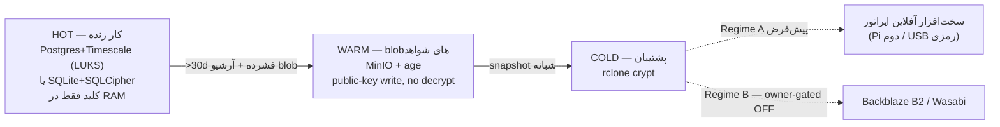
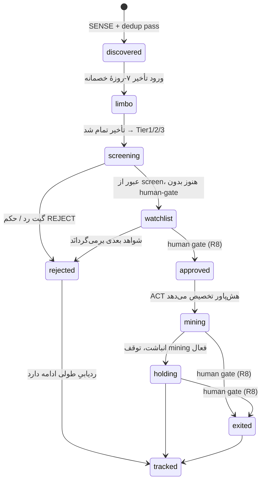

# لایه ۱۰ — داده، وضعیت و اسکیمای پایگاه (Data & Schema)

> **مرجعِ متعارف (single source of truth):** این سند ([[10 - DATA-STATE-and-SCHEMA]]) صاحبِ اصلیِ اسکیمای پایگاه‌داده و state-ENUM کاندیدا برای کلِ معماری است. هر لایهٔ دیگر که جدول یا وضعیت را بازتولید کند باید به همین‌جا اشاره دهد؛ تعریفِ متعارف اینجاست، جای دیگر بازنویسی نمی‌شود.

این لایه ستون‌فقرات و **moat** (خندق دفاعی) کل سیستم است. سنسورها ([[02 - SENSE-Discovery-Layer]]) کاندیدا کشف می‌کنند، مغز چندلایه ([[05 - AGENT-BRAIN-Decision-Layer]]) قضاوت می‌کند و ناوگان ([[06 - ACT-Fleet-Execution-and-Orchestration]]) اجرا می‌کند — اما همهٔ اینها **گذرا** هستند مگر اینکه در یک دیتاست ماندگارِ append-only ثبت شوند. ارزش انباشتیِ سیستم نه در هش‌ریت، بلکه در **تاریخچهٔ تصمیم‌ها + پیامدها** است: هر لانچی که دیدیم، سیگنالی که گرفتیم، حکمی که دادیم، و اینکه آن کوین بعداً **زنده ماند یا مُرد**. [SPEC]

این دیتاست هم‌زمان دو کار می‌کند: (۱) حافظهٔ عملیاتی سیستم، (۲) **مجموعهٔ آموزش/بک‌تستِ کوین‌های مُرده** که تنها پادزهر سوگیری بازماندگی (Flaw 1) است — رجوع به [[04 - Adversarial-Defense-and-Antifragility]]. اگر فقط بازمانده‌ها را ثبت کنیم، احتمال بقا را ۲۰۰–۴۰۰٪ بیش‌برآورد می‌کنیم [FACT، طبق نقد §1.3]. بنابراین **قانون شمارهٔ صفرِ این لایه: کوین رد‌شده حذف نمی‌شود — تا افق کامل ردیابی می‌شود.**

## ۰. اصول طراحی داده (Design Invariants)

1. **Append-only moat.** جدول `outcome_events` و `trajectory_snapshots` هرگز UPDATE/DELETE نمی‌شوند؛ اصلاح = رویداد جدید (event-sourcing). [SPEC]
2. **بدون راز (R4 hard gate).** هیچ seed/private key/xpriv/آدرسِ خرج‌شونده در هیچ جدول، لاگ یا blob وارد نمی‌شود. بوردهای mining فقط **آدرس receive-only** نگه می‌دارند. بند ۶ را ببینید و رجوع به [[01 - GOVERNANCE-and-SAFETY]]. [FACT — قانون]
3. **پادزهر سوگیری بازماندگی.** رجکت‌ها و کوین‌هایی که هرگز واردشان نشدیم هم ردیابی می‌شوند تا `dead_coins` test-set ساخته شود. [SPEC]
4. **Idempotent-by-design.** قرارداد dedup سه‌لایه (بند ۷)؛ پردازش دوباره هرگز رکورد تکراری نمی‌سازد. [SPEC]
5. **Regime-aware storage.** **Regime A (AUD 0، قفل‌شده — owner-confirmed 2026-07-18، D-006)** روی سخت‌افزار خودِ اپراتور؛ هر مؤلفهٔ ابری/API پولی = **Regime B، خفته و owner-gated OFF (فعال‌سازی = verdict جدید)**. محور هزینه در بند ۵. [FACT — منشور]
6. **بدون ویرایش مخرب (R7).** تغییر schema فقط با migration نسخه‌دار + کامیت تمیز؛ هیچ ستون/جدول انسانی بازنویسی نمی‌شود. [FACT — قانون]

## ۱. توپولوژی ذخیره‌سازی و آشتی دو مرجع

منابع بالادستی دو انتخاب متفاوت داشتند که این لایه **آشتی** می‌دهد (این دقیقاً همان فورکی است که باید حل شود، نه پنهان):

- زیرساخت OPI-hub: رجیستری+state روی **PostgreSQL 16 + TimescaleDB** + **Redis 7** (صف/قفل، AOF). [FACT — substrate]
- README ربات: hot-state روی **SQLite + SQLCipher**. [FACT — bot README]

**حل:** یک schema منطقیِ واحد، دو dialect فیزیکی:

| مسیر استقرار | Hot store | توضیح |
|---|---|---|
| **روی OPI-hub** (مسیر اصلی، [[07 - SUBSTRATE-Fleet-Hub-and-Infra]]) | PostgreSQL 16 + TimescaleDB روی والیوم رمزنگاری‌شده (LUKS) + اپ‌کلید session-scoped | Postgres همان «رجیستری+state» است؛ moat به قدرت SQL برای بک‌تست نیاز دارد |
| **بیلد سبکِ standalone** (بدون hub) | SQLite + SQLCipher (کلیدِ مشتق‌از-پسورد، **هرگز persist نمی‌شود**) | زیرمجموعه‌ای از همان DDL؛ برای یک Orange Pi تنها |

Postgres = dialect متعارف؛ SQLite = زیرمجموعه‌اش. warm/cold در هر دو یکسان‌اند. [SPEC]

> [OPEN — Round 2] نگاشتِ دقیقِ standalone از PostgreSQL به SQLite/SQLCipher تعریف‌نشده است: `ENUM`، `GENERATED ALWAYS AS IDENTITY`، `JSONB`، `TIMESTAMPTZ`، `hypertable` و `MATERIALIZED VIEW` همگی Postgres-only هستند و معادلِ صریحِ SQLite‌شان (CHECK-constraint، `INTEGER PRIMARY KEY AUTOINCREMENT`، `TEXT` JSON، `TEXT` ISO-8601، جدولِ rollup دستی، VIEW معمولی) باید مشخص شود.

## ۲. مدل ذخیره‌سازی سه‌لایه + محور رژیم هزینه



- **HOT** — state داغِ عملیاتی و تحلیلی. کلید SQLCipher از پسورد مشتق و **هرگز روی دیسک نمی‌نشیند** (per-session/env در بوت، فقط در حافظه). [FACT — README]
- **WARM** — blobهای بزرگ: HTML خامِ اسکرپ‌شده، dossier JSON کامل، snapshotها. **MinIO + age** با کلید عمومی: سرور می‌تواند **بنویسد ولی نمی‌تواند تاریخِ خودش را رمزگشایی کند** → سقفِ ذاتی روی شعاع انفجارِ self-modification. کلید خصوصی نزد اپراتور. [FACT]
- **COLD** — `rclone crypt`. **Regime A (پیش‌فرض، AUD 0):** مقصد = سخت‌افزار آفلاین اپراتور (Pi دوم یا دیسک USB رمزی)؛ رپلیکا/بکاپِ نسخهٔ v2 که یک VPS ماهانه ~$10 فرض می‌کرد **با Pi دوم محلی جایگزین می‌شود.** **Regime B (owner-gated OFF):** Backblaze/Wasabi — نیازمند حکم صریح مالک که Rule 1 را نقض کند. [FACT — منشور + substrate note]

MinIO و Postgres هر دو روی سخت‌افزار خودِ اپراتور اجرا می‌شوند؛ هیچ object-storage پولی در مسیر پیش‌فرض نیست. [SPEC]

## ۳. توپولوژی جداول (بازاستفاده + دامنهٔ کوین)

**بازاستفاده از OPI-hub بدون تغییر** (کوین‌هانتر یک workload روی hub است): `task_definitions`, `task_runs`, `task_checkpoints`, `host_state`, `policies`. مثلاً هر اجرای Tier1/Tier2 یک ردیف `task_runs` است؛ آستانه‌های زندهٔ این لایه (limbo_days، hashrate_cap، divergence، kwh_halt، قواعد برچسبِ dead) در `policies` به‌صورت JSON قابل‌ویرایشِ زنده می‌نشینند. [SPEC]

**جداول دامنهٔ کوین (جدید):**

| جدول | نقش | append-only؟ |
|---|---|---|
| `candidates` | رجیستر + حالتِ فعلیِ state machine | خیر (state جاری) |
| `candidate_aliases` | نگاشتِ نام‌های مستعارِ منابع به coin_uid | خیر |
| `evidence_dossiers` | dossier ۱۰-بُعدی Tier2 (A–J)، نسخه‌دار | بله (نسخه‌ها) |
| `verdicts` | حکم Tier3 + red-team + regime مدل | بله |
| `predictions` | پیش‌بینی‌های skin-in-the-game (§6.5) | افزودنی + resolve |
| `holdings` / `holdings_ledger` | آدرس receive-only + دفترِ انباشت | ledger = بله |
| `experiments` | self-mod های Tier4 (فرضیه/متریک/rollback) | افزودنی |
| `outcome_events` | **دیتاست پیامد — moat** (hypertable) | **بله، سخت** |
| `trajectory_snapshots` | ردیابیِ طولی همهٔ کوین‌ها (hypertable) | بله |
| `data_integrity_alerts` | واگراییِ >۳۰٪ بین منابع | بله |

## ۴. ماشین‌حالتِ رجیستر کاندیدا



- **`limbo`** = تأخیر ۷-روزهٔ خصمانه ([[04 - Adversarial-Defense-and-Antifragility]]): کوینِ جوان‌تر از ۷ روز از لیست/اولین کامیت در انتظار می‌مانَد تا پامپ مصنوعی تا روز ۷ خالی شود. `limbo_until = COALESCE(launch_date, first_commit_date, created) + 7d` — یعنی **سنِ کوین از مبدأ، نه از لحظهٔ کشف** (اگر کوین همان موقعِ کشف از ۷ روز پیرتر باشد، limbo بلافاصله می‌گذرد؛ `created` = اولین‌بار که ما ثبتش کردیم، جایگزینِ مبدأِ نامعلوم). [FACT — نقد خصمانه]
- **گیت‌های انسانی (R8):** گذارهای `approved` و `*→exited` **الزاماً** human-gate دارند؛ ربات هرگز خودکار وارد کوین جدید نمی‌شود یا موجودی جابه‌جا نمی‌کند. [FACT — قانون]
- **`rejected` پایانی نیست:** ردیف برای همیشه می‌ماند و `trajectory_snapshots` روی آن ادامه دارد (سوخت `dead_coins` set).
- **`tracked` (فقط در نمودار) وضعیتِ ذخیره‌شدنی نیست:** عضو ENUM نیست و هرگز در `candidates.state` نمی‌نشیند؛ برچسبِ نموداریِ «ردیابیِ طولی ادامه دارد» است که اجرایش از مسیر `trajectory_snapshots` انجام می‌شود، نه با گذارِ state.
- برچسب پیامد `outcome_label ∈ {unknown, survived, zombie, dead}` **متعامد** با state است و توسط labeler اعمال می‌شود (بند ۶.۲).

## ۵. DDL (dialect PostgreSQL — متعارف)

> [OPEN — Round 2] **واژگانِ verdict واگراست:** ENUM اینجا `ACCUMULATE | WATCH | REJECT` در برابرِ [[05 - AGENT-BRAIN-Decision-Layer]] (`STRONG_ACCUMULATE | CAUTIOUS_ACCUMULATE | WATCH | REJECT`) و [[03 - SCORE-Screening-and-Forensics]] (`ACCUMULATE | WATCHLIST | REJECT | ABANDON | LIMBO`). این سند مالکِ نهایی است؛ در Round 2 واژگانِ واحد + نگاشتِ مهاجرت باید همین‌جا قفل شود.

```sql
CREATE TYPE candidate_state AS ENUM
  ('discovered','limbo','screening','rejected','watchlist',
   'approved','mining','holding','exited');
CREATE TYPE outcome_label AS ENUM ('unknown','survived','zombie','dead');
CREATE TYPE verdict_kind AS ENUM ('ACCUMULATE','WATCH','REJECT');
CREATE TYPE conf_level  AS ENUM ('LOW','MEDIUM','HIGH');

-- رجیستر کاندیدا (state جاری)
CREATE TABLE candidates (
  coin_uid          TEXT PRIMARY KEY,             -- شناسهٔ داخلیِ پایدار (بند ۷)
  ticker            TEXT NOT NULL,
  name              TEXT,
  chain             TEXT,                          -- L1 بومی یا chain قرارداد
  contract_address  TEXT,                          -- شناسهٔ عمومی (بدون کلید) — مجاز
  algo              TEXT,                          -- RandomX/Yespower*/GhostRider/...
  launch_date       DATE,
  first_commit_date DATE,
  state             candidate_state NOT NULL DEFAULT 'discovered',
  state_since       TIMESTAMPTZ NOT NULL DEFAULT now(),
  limbo_until       TIMESTAMPTZ,                    -- = COALESCE(launch_date, first_commit_date, created) + 7d
  edge_zone_flag    BOOLEAN DEFAULT false,         -- «برای متوسط بی‌سود، برای اپراتور سودده»
  asic_risk_flag    BOOLEAN DEFAULT false,         -- RandomX دیگر مطلقاً ASIC-proof نیست
  first_source      TEXT,                          -- کدام سنسور SENSE
  outcome_label     outcome_label NOT NULL DEFAULT 'unknown',
  idempotency_key   TEXT NOT NULL UNIQUE,          -- dedup لایه ۳ (جدول عادی → UNIQUE مجاز)
  created           TIMESTAMPTZ NOT NULL DEFAULT now(),  -- «first_seen»: اولین ثبت
  updated           TIMESTAMPTZ NOT NULL DEFAULT now()
);
CREATE INDEX ON candidates (state);
CREATE INDEX ON candidates (outcome_label);

-- نگاشتِ نام‌های مستعارِ منابع → یک coin_uid متعارف (resolver بند ۷)
CREATE TABLE candidate_aliases (
  coin_uid    TEXT NOT NULL REFERENCES candidates,
  source      TEXT NOT NULL,                       -- CoinGecko | DexScreener | ...
  external_id TEXT NOT NULL,                       -- شناسهٔ همان منبع
  PRIMARY KEY (source, external_id)
);

-- dossier شواهدِ Tier2 (۱۰ بُعد A–J)، نسخه‌دار و immutable
CREATE TABLE evidence_dossiers (
  dossier_id      BIGINT GENERATED ALWAYS AS IDENTITY PRIMARY KEY,
  coin_uid        TEXT NOT NULL REFERENCES candidates,
  dossier_version INT  NOT NULL,
  dimensions      JSONB NOT NULL,                  -- A..J: spec/provenance/economics/...
  profitability   JSONB,                           -- [EST] در دو نرخ: $0.12 و $0.05/kWh
  sources         JSONB NOT NULL,                  -- استناد هر ادعا
  injection_sanitized BOOLEAN NOT NULL DEFAULT false, -- sanitiser خصمانه اجرا شد
  model           TEXT,                            -- qwen-2.5-14b (local, Regime A)
  content_hash    TEXT NOT NULL,                   -- dedup + tamper-evidence
  warm_blob_ref   TEXT,                            -- کلید object رمزیِ age در MinIO
  created         TIMESTAMPTZ NOT NULL DEFAULT now(),
  UNIQUE (coin_uid, dossier_version)
);

-- احکام Tier3 (+ red-team + regime)
CREATE TABLE verdicts (
  verdict_id      BIGINT GENERATED ALWAYS AS IDENTITY PRIMARY KEY,
  coin_uid        TEXT NOT NULL REFERENCES candidates,
  dossier_id      BIGINT NOT NULL REFERENCES evidence_dossiers,
  survival_score  NUMERIC(5,2),
  edge_zone       BOOLEAN DEFAULT false,
  verdict         verdict_kind NOT NULL DEFAULT 'REJECT', -- پیش‌فرض = رد
  confidence      conf_level  NOT NULL DEFAULT 'LOW',
  red_team_passed BOOLEAN NOT NULL DEFAULT false,  -- §6.4 فقط اگر از دادگاه خصمانه رد شود
  red_team_ref    TEXT,                            -- blob گفت‌وگوی مدعی‌العموم
  verdict_json    JSONB NOT NULL,                  -- طبق output_schema.json
  model           TEXT,                            -- local (Regime A، پیش‌فرض) | claude-opus (Regime B — owner-gated، API پولی، R1)
  regime          CHAR(1) NOT NULL DEFAULT 'A',    -- A=local پیش‌فرض / B=API پولی owner-gated
  created         TIMESTAMPTZ NOT NULL DEFAULT now()
);

-- پیش‌بینی‌های skin-in-the-game (§6.5) — ربات باید هزینهٔ خطای خود را بدهد
CREATE TABLE predictions (
  prediction_id   BIGINT GENERATED ALWAYS AS IDENTITY PRIMARY KEY,
  verdict_id      BIGINT NOT NULL REFERENCES verdicts,
  coin_uid        TEXT NOT NULL REFERENCES candidates,
  metric          TEXT NOT NULL,                   -- price_usd | holder_count | network_hashrate
  horizon_days    INT  NOT NULL CHECK (horizon_days IN (30,60,90)),
  predicted_value NUMERIC,
  predicted_ci    JSONB,
  due_at          TIMESTAMPTZ NOT NULL,
  resolved_value  NUMERIC,                         -- NULL تا سررسید
  resolved_at     TIMESTAMPTZ,
  error_rel       NUMERIC,                         -- برای وزن‌دهیِ calibration اسکورر
  created         TIMESTAMPTZ NOT NULL DEFAULT now()
);

-- موجودی: فقط آدرس receive-only (R4) — هیچ ستون کلید/seed
CREATE TABLE holdings (
  holding_id          BIGINT GENERATED ALWAYS AS IDENTITY PRIMARY KEY,
  coin_uid            TEXT NOT NULL REFERENCES candidates,
  receive_address     TEXT NOT NULL,               -- receive-only، عمومی — از no_secret_guard رد می‌شود
  status              candidate_state NOT NULL DEFAULT 'mining',
  our_est_market_share NUMERIC,                     -- §6.2 reflexivity: سهم بازارِ خودمان
  fleet_hashrate_share NUMERIC CHECK (fleet_hashrate_share <= 0.20), -- سقف ۲۰٪ (ضد-۵۱٪)
  first_accumulated_at TIMESTAMPTZ,
  created             TIMESTAMPTZ NOT NULL DEFAULT now()
  -- عمداً بدون: private_key, seed, xpriv, mnemonic
);
CREATE TABLE holdings_ledger (                      -- دفترِ انباشتِ append-only
  entry_id   BIGINT GENERATED ALWAYS AS IDENTITY PRIMARY KEY,
  holding_id BIGINT NOT NULL REFERENCES holdings,
  ts         TIMESTAMPTZ NOT NULL DEFAULT now(),
  delta_amount NUMERIC NOT NULL,                    -- انباشت از mining (بدون خرج/انتقال)
  source     TEXT,                                  -- pool/block-reward
  note       TEXT
);

-- self-mod های Tier4 (طبق گاردریل CORE_PRINCIPLES)
CREATE TABLE experiments (
  experiment_id     BIGINT GENERATED ALWAYS AS IDENTITY PRIMARY KEY,
  target            TEXT NOT NULL CHECK (target IN
                      ('tier1_prompt','tier2_prompt','tactics.yaml')), -- مجموعهٔ مجاز
  hypothesis        TEXT NOT NULL,
  metric            TEXT NOT NULL,
  rollback_condition TEXT NOT NULL,
  review_date       DATE NOT NULL,
  baseline_precision NUMERIC,
  current_precision  NUMERIC,
  state             TEXT NOT NULL DEFAULT 'active', -- active|rolled_back|adopted
  auto_rollback     BOOLEAN DEFAULT false,          -- precision@6mo افت >20٪ در پنجرهٔ ۳۰-روزه
  created           TIMESTAMPTZ NOT NULL DEFAULT now()
);

-- هشدارِ واگراییِ >۳۰٪ بین منابع (بدون میانگین‌گیری — §7 triangulation)
CREATE TABLE data_integrity_alerts (
  alert_id     BIGINT GENERATED ALWAYS AS IDENTITY PRIMARY KEY,
  coin_uid     TEXT NOT NULL REFERENCES candidates,
  field        TEXT NOT NULL,                       -- کدام فیلد واگرا شد
  values_json  JSONB NOT NULL,                      -- مقدارِ گزارش‌شده توسطِ هر منبع
  divergence   NUMERIC,                             -- نسبتِ واگرایی
  action       TEXT NOT NULL DEFAULT 'held_no_average',
  created      TIMESTAMPTZ NOT NULL DEFAULT now()
);
```

## ۶. دیتاست پیامد — moat (append-only)

### ۶.۱ رویدادهای پیامد و snapshotهای طولی

```sql
CREATE TABLE outcome_events (
  event_id        UUID NOT NULL DEFAULT gen_random_uuid(),
  ts              TIMESTAMPTZ NOT NULL DEFAULT now(),
  coin_uid        TEXT NOT NULL,
  event_type      TEXT NOT NULL,                   -- detected|limbo_enter|dossier|verdict|
                                                    -- decision|state_change|trajectory|
                                                    -- outcome_label|prediction_resolved|integrity_alert
  actor           TEXT NOT NULL,                   -- tier1..tier4|human|snapshotter
  payload         JSONB NOT NULL,
  idempotency_key TEXT NOT NULL,                   -- یکتاییِ سراسری در جدولِ همراهِ زیر (hypertable اجازهٔ UNIQUE بدون ستونِ پارتیشن نمی‌دهد)
  prev_hash       TEXT,                            -- زنجیرهٔ هش برای tamper-evidence
  event_hash      TEXT NOT NULL,
  PRIMARY KEY (event_id, ts)
);
SELECT create_hypertable('outcome_events','ts');

-- گاردِ dedup سراسری برای outcome_events (TimescaleDB روی hypertable یکتاییِ بدونِ ts نمی‌پذیرد):
CREATE TABLE outcome_events_idem (
  idempotency_key TEXT PRIMARY KEY,
  first_ts        TIMESTAMPTZ NOT NULL DEFAULT now()
);
-- writer اول کلید را اینجا claim می‌کند: INSERT ... ON CONFLICT DO NOTHING؛
-- اگر برخورد شد، درجِ رویداد skip می‌شود (پایپ‌لاین idempotent).

CREATE TABLE trajectory_snapshots (                 -- خوراکِ dead_coins backtest
  ts               TIMESTAMPTZ NOT NULL DEFAULT now(),
  coin_uid         TEXT NOT NULL,
  price_usd        NUMERIC,
  mcap_usd         NUMERIC,
  volume_24h       NUMERIC,
  holder_count     INT,
  unique_miner_addrs INT,                          -- >۱۰۰ در ۳۰ روز = سیگنال مثبت [EST]
  network_hashrate NUMERIC,
  commit_count_30d INT,                            -- CryptoMiso: پروکسیِ بقا
  contributors_active INT,                         -- تریگرِ washout هم از این می‌آید
  pool_count       INT,
  source           TEXT,
  content_hash     TEXT,
  PRIMARY KEY (coin_uid, ts, source)
);
SELECT create_hypertable('trajectory_snapshots','ts');
```

**تغییرناپذیریِ سخت:** پس از بوت، `REVOKE UPDATE, DELETE ON outcome_events, trajectory_snapshots, holdings_ledger FROM app_role;` + تریگرِ `BEFORE UPDATE/DELETE` که exception می‌اندازد. اصلاح فقط با append رویداد جدید. زنجیرهٔ `prev_hash→event_hash` هر دست‌کاریِ retroactive را آشکار می‌کند (الگوی ledger). [SPEC]

> [OPEN — Round 2] مشخصاتِ محاسبهٔ `event_hash` تعریف‌نشده است: فیلدهای ورودی، ترتیبِ سریال‌سازیِ canonical و الگوریتمِ هش برای زنجیرهٔ `prev_hash→event_hash` باید دقیق تعیین شود.

### ۶.۲ Snapshotter و برچسب‌گذاریِ پیامد (پادزهر بازماندگی)

**snapshotter همهٔ کوین‌ها را ردیابی می‌کند — از جمله رجکت‌ها** — با کادنسِ نزولی تا رکورد بی‌هزینه ساخته شود [EST]:

| گروه | کادنس snapshot |
|---|---|
| `mining` فعال | ساعتی |
| `watchlist` / `holding` | روزانه |
| `rejected` (تا ۹۰ روز) | روزانه |
| `rejected` (۹۰d–۱y) | هفتگی |
| `rejected` (>۱y) | ماهانه، تا افق کامل |

**برچسب‌گذاری** (قواعد در `policies`، قابل‌ویرایش زنده) [SPEC]:
- `dead` = volume_24h ≈ 0 برای ۳۰ روز **و** commit_count_30d = 0 برای ۹۰ روز.
- `zombie` = زنده اما بدون رشدِ holder/hashrate در ۱۸۰ روز.
- `survived` = عبور از افقِ ۱۸۰ روز با holder/hashrate صعودی.

### ۶.۳ نمای بک‌تستِ کوین‌های مُرده (§6.3)

```sql
CREATE MATERIALIZED VIEW dead_coins_testset AS
SELECT c.coin_uid,
       d0.dimensions->'positive_signals' AS signals_at_detection,
       v0.verdict AS our_verdict_at_time
FROM candidates c
JOIN LATERAL (SELECT * FROM evidence_dossiers e   -- اولین dossier
              WHERE e.coin_uid=c.coin_uid ORDER BY created LIMIT 1) d0 ON true
LEFT JOIN LATERAL (SELECT * FROM verdicts v
              WHERE v.coin_uid=c.coin_uid ORDER BY created LIMIT 1) v0 ON true
WHERE c.outcome_label='dead'
  AND jsonb_array_length(d0.dimensions->'positive_signals') >= 3; -- زمانی «صعودی» بود
```

معیار موفقیت اسکورر = **نرخِ REJECT روی این set** (چند کوینِ مُرده را که در لحظهٔ کشف صعودی به‌نظر می‌رسیدند، درست رد کردیم). این عدد به‌طور مستقیم precision@6mo را تغذیه می‌کند که تریگرِ auto-rollback در `experiments` است. [SPEC]

## ۷. قرارداد Idempotency / Dedup (سه‌لایه)

مطابق substrate — سه لایه [FACT]:

1. **content idempotency_key (قطعی).** برای هر رویداد کشف:
   `idem = sha256( canonical_source_id || '|' || chain || '|' || normalize(ticker|contract) )`.
2. **Redis SETNX (قفل کوتاه‌مدت).** `SETNX lock:{idem} 1 EX 300` پیش از پردازش؛ جلوگیری از پردازش هم‌زمانِ دوتایی. AOF روشن.
3. **Postgres UNIQUE (dedup ماندگار).** `candidates.idempotency_key` مستقیماً UNIQUE است؛ برای `outcome_events` (hypertable) یکتاییِ سراسری از طریقِ جدولِ همراهِ `outcome_events_idem` (کلیدِ اصلی) و `INSERT ... ON CONFLICT DO NOTHING` تضمین می‌شود — درجِ تکراری no-op است.

> [OPEN — Round 2] تضمینِ اتمیک‌بودنِ claim-then-insert تعریف‌نشده است: claimِ کلید در `outcome_events_idem` و درجِ رویداد در `outcome_events` باید در یک تراکنشِ واحد (single-transaction/atomic) انجام شود تا کرش میانِ دو مرحله رکوردِ یتیم یا تکراری نسازد.

**تحلیل هویتِ متعارف کوین (canonical identity):** یک کوین که هم روی CoinGecko و هم DexScreener دیده شود **یک** `coin_uid` است، نه دو. resolver با کلید (chain + normalized contract) یا (algo + genesis/first-commit) ادغام می‌کند و همهٔ نام‌های مستعار را در `candidate_aliases(coin_uid, source, external_id)` نگه می‌دارد. اگر دو منبع در فیلدی >۳۰٪ واگرا باشند **میانگین نمی‌گیریم** → یک ردیف `data_integrity_alerts` با `action='held_no_average'` و رویداد `integrity_alert` (رجوع به [[04 - Adversarial-Defense-and-Antifragility]]). [FACT — triangulation]

## ۸. اجرای R4 — هیچ راز/کلید/آدرسِ خرج‌شونده وارد نمی‌شود

- **no_secret_guard در زمان نوشتن:** یک هوکِ write-time روی هر payload اسکن regex می‌زند و درج را رد می‌کند اگر الگوی seed/mnemonic (۱۲/۲۴ کلمهٔ BIP39)، private key (hex ۶۴، WIF)، xpriv یا API-key ببیند. نقض = رویدادِ `security.write_blocked` + آلارم TG-OPS. [SPEC]

> [OPEN — Round 2] مجموعهٔ دقیقِ regexهای `no_secret_guard` تعریف‌نشده است: الگوهای واقعیِ seed/mnemonic (BIP39)، private key (hex-64/WIF)، xpriv و API-key باید به‌صورت مجموعهٔ مشخص و تست‌شده نوشته شود.
- **فقط receive-only:** `holdings.receive_address` عمومی است؛ خرج/انتقال فقط روی signerِ air-gapped بیرون از این سیستم رخ می‌دهد (R4). ربات هرگز کلید نمی‌بیند. [FACT — قانون]
- warm (age) و cold (rclone crypt) با کلید عمومی می‌نویسند؛ سرور تاریخِ خودش را رمزگشایی نمی‌کند → حتی اگر HOT کاملاً کامپرومایز شود، مهاجم فقط ciphertext می‌گیرد. [FACT — README]
- HANDOFF/لاگ‌ها هرگز secret echo نمی‌کنند (قانون امنیت vault).

## ۹. نگه‌داری، پشتیبان و مهاجرت

- **Retention:** `outcome_events` و `trajectory_snapshots` هرگز حذف نمی‌شوند (moat). فشرده‌سازی TimescaleDB پس از ۳۰ روز؛ continuous-aggregate برای rollupهای طولی. [SPEC]
- **Backup (محور رژیم):** snapshot شبانهٔ `rclone crypt`؛ **Regime A** → Pi دوم/دیسک آفلاین؛ **Regime B (OFF)** → B2/Wasabi. بازیابیِ power-loss از طریق `synchronous_commit=on` + AOF + checkpoints + recovery_worker (از substrate). [FACT]
- **Migration (R7):** هر تغییر schema = فایل migration نسخه‌دار + کامیت تمیز + حکم انسانی؛ rename/move ستون فقط با اسکریپت idempotent، هرگز drop مخرب.

## پیوند لایه‌های خواهر

[[01 - GOVERNANCE-and-SAFETY]] · [[02 - SENSE-Discovery-Layer]] · [[05 - AGENT-BRAIN-Decision-Layer]] · [[06 - ACT-Fleet-Execution-and-Orchestration]] · [[04 - Adversarial-Defense-and-Antifragility]] · [[07 - SUBSTRATE-Fleet-Hub-and-Infra]]

## منابع / Sources

- **Shared context — SUBSTRATE (OPI Automation Hub v2):** جداول `task_definitions/task_runs/task_checkpoints/host_state/policies`، Postgres 16 + TimescaleDB، Redis 7 AOF، dedup سه‌لایه (idempotency_key + SETNX + UNIQUE)، بازیابیِ power-loss، جایگزینیِ VPS با Pi محلی در Regime A.
- **Shared context — SECURITY/STORAGE (bot README):** سه لایهٔ رمزنگاری SQLCipher hot / MinIO+age warm / rclone-crypt cold؛ سرور می‌نویسد ولی رمزگشایی نمی‌کند؛ کلید never-on-VPS.
- **Shared context — LOCKED HARD RULES:** R4 (کلید/seed هرگز؛ آدرس receive-only)، R7 (بدون ویرایش مخرب، git mv)، R8 (گیت انسانی)، R1/Regime axis.
- **Shared context — ADVERSARIAL DEFENSES:** تأخیر ۷-روزهٔ خصمانه، triangulation >۳۰٪ → DATA_INTEGRITY_ALERT (بدون میانگین)، wallet_correlation_index، injection sanitiser.
- **Shared context — SEVEN STRUCTURAL FLAWS + §6 fixes:** §6.3 dead-coins test-set، §6.4 red-team، §6.5 skin-in-the-game predictions، §6.2 reflexivity/market-share، §6.6 sample-bias correction.
- **INGEST ingest:roadmap-v3 (Deep Critique):** اعداد سوگیری بازماندگی (>۱۴٬۰۰۰ مُرده از ~۲۴٬۰۰۰، +62.19٪ تورم)، افق‌های ۳۰/۶۰/۹۰ روز، تریگرِ `contributors_active`.
- **INGEST ingest:critique:** ماژول «C64 veto / exit-feasibility» (ردیابیِ نقدشوندگی/exit)، هش‌ریت و قیمت‌ها به‌طور پیش‌فرض [EST]، تفکیک سرمایهٔ mining از investing.
- **CORE_PRINCIPLES / SIX PRINCIPLES:** پیش‌فرض REJECT، گاردریل self-mod (hypothesis/metric/rollback/review + auto-rollback افت >۲۰٪)، سقف ۲۰٪ هش‌ریت، dossier ۱۰-بُعدی A–J، output_schema.json.
