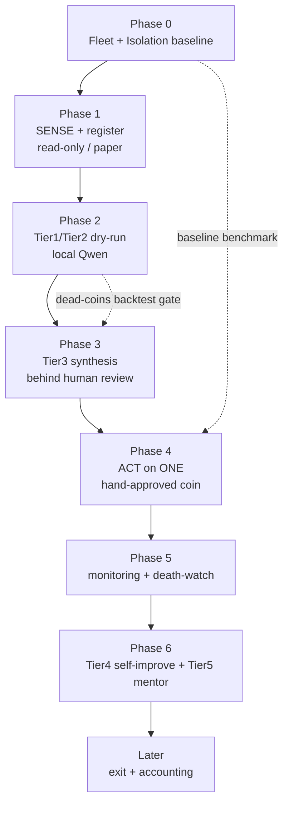

# لایه ۱۱ — نقشه‌راه ساخت و توالی (Build Roadmap)

این لایه، **ترتیبِ ساختِ قابل‌اجرا** را زیر رژیم پیش‌فرض **Regime A (AUD 0)** تعریف می‌کند: از یک baseline ایزوله تا حلقهٔ کامل SENSE → SCORE → ACT، و بعد death-watch، self-improvement و در نهایت exit. اصلِ حاکم بر کل توالی، اصل ششمِ [[00 - MASTER-ARCHITECTURE]] است: **autonomy is earned — backtest before you trust**. هیچ فازی فعال نمی‌شود تا فازِ قبل معیارِ خروجِ اندازه‌پذیرِ خودش را پاس کند. [SPEC]

دو خطِ قرمزِ غیرقابل‌عبور که در همهٔ فازها تکرار می‌شوند (منبع: [[01 - GOVERNANCE-and-SAFETY]]):

1. **هیچ باینریِ ناشناخته‌ای هرگز روی ماشین اصلی اجرا نمی‌شود** — فقط fleet ایزوله یا sandbox/VM، پس از verify چک‌سام/امضا یا build-from-source (R3). [FACT]
2. **هیچ کوینی بدون human verdict وارد basket نمی‌شود و هیچ وجهی جابه‌جا نمی‌شود** (R8). ربات trade نمی‌کند، funds را move نمی‌کند، و به سخت‌افزارِ کیف‌پول/امضا (hardware wallet / air-gapped signer) وصل نمی‌شود؛ ارکستراسیونِ نرم‌افزاریِ fleetِ ماینینگِ ازپیش‌راه‌اندازی‌شده (start/stop/reboot/self-heal از طریق XMRigCC) کارکردِ طراحی‌شدهٔ ربات است و «جابه‌جاییِ وجه» محسوب نمی‌شود، اما راه‌اندازیِ فیزیکیِ سخت‌افزارِ جدید انسانی است (R4/R8). [FACT]

---

## پرسش‌های باز که فازها را قفل می‌کنند (OQ-1 … OQ-8)

هر فاز به یک یا چند مورد از این‌ها گره خورده؛ تا پاسخ روشن نشود، فاز در حالت paper/dry می‌ماند.

| # | پرسش باز | وضعیت فعلی | فازی که آزاد می‌کند |
|---|---|---|---|
| OQ-1 | تعداد واقعی fleet (۱۶–۵۰ vs ۱۷ Orange Pi + ۵۰–۲۰۰ vs ۱۳۰ ESP32 — ناهم‌خوان بین منابع) | [OPEN] unreconciled | Phase 0/4 |
| OQ-2 | benchmark واقعی H/s هر بورد RandomX **بعد از** huge pages (measured، نه vendor) | [OPEN] باید اندازه‌گیری شود | Phase 0/4 |
| OQ-3 | آیا sandbox/VM ایزوله برای اجرای daemonهای ناشناخته آماده است؟ | [OPEN] | Phase 0/4 |
| OQ-4 | تأییدِ ساختاریِ برق < $0.05/kWh (measure watts، نه فرض) | [OPEN] verify | Phase 0 |
| OQ-5 | آیا wallet دریافت‌فقط + signer ایرگپ موجود است؟ | [OPEN] | Phase 4/exit |
| OQ-6 | برخوردِ مالیاتیِ AU برای mining/accumulation | [OPEN] نیازمند مشاور دارای مجوز | Phase exit |
| OQ-7 | آستانه‌های exit-feasibility («C64 veto»: نقدشوندگی، halt، top-holder) | [OPEN] باید عددی شود | Phase 5/exit |
| OQ-8 | حکمِ owner دربارهٔ رژیم هزینه (Regime A پیش‌فرض / Regime B خاموش) | [FACT] فعلاً A binding | همهٔ فازها (toggle) |

---

## نمای توالی (Phase DAG)

---

## Phase 0 — پایهٔ Fleet و ایزوله‌سازی (زیرساخت)

نخستین برد؛ کاملاً AUD-0 و بیشترش از SCOUT-B که [Verified] است.

**می‌سازیم:**
- شبکهٔ مش **Tailscale/Headscale** (نه SSH دستی) روی fleet؛ provisioning با **pyinfra** (agentless، idempotent). [SPEC]
- **XMRigCC** به‌عنوان C2 نیتیوِ ARM: start/stop/reboot ریموت + آلارم hashrate/offline در Telegram. [FACT]
- مانیتور **Beszel** (سبک) شامل خواندن eMMC wear از SMART. [FACT]
- خودترمیمی: **systemd watchdog** + power-cycle با PoE/smart-plug. [SPEC]
- بهینه‌سازیِ mining (همه رایگان): **huge pages** (تا **+۵۰٪** RandomX — بزرگ‌ترین بردِ تک) [EST]، self-compile با `-mcpu=cortex-a76`، pin روی ۴× A76، RAM OC LPDDR5→6400، `governor=performance` (اول watts را measure کن). [EST]
- **بخش ایزوله‌سازی (R3):** یک sandbox/VM جدا برای اجرای هر daemon؛ verify چک‌سام/امضا؛ در غیر این صورت build-from-source.

**معیارِ خروج (measurable):** N بورد روی مش قابل‌دسترس؛ XMRigCC ریموت کار می‌کند؛ Beszel سایشِ eMMC را نشان می‌دهد؛ یک minerِ **known-good** (XMRig روی Monero) در sandbox اجرا و **baseline H/s پس از huge pages ثبت** شد؛ watchdog یک miner کشته‌شده را خودکار برمی‌گرداند؛ **هیچ باینری ناشناخته‌ای ماشین اصلی را لمس نکرده**. [SPEC]

**قفل با:** OQ-1، OQ-2، OQ-3، OQ-4.
**Toggle هزینه:** پیش‌فرض Regime A (fleet خودی به‌عنوان control node). نقطهٔ Regime-B (owner-gated OFF): جایگزینیِ control node با Hetzner VPS.

---

## Phase 1 — SENSE + ثبت (read-only، paper)

**می‌سازیم (کالکتورهای discovery، همگی read-only):**
- CoinGecko new-listings + فیلتر market؛ **diff تغییراتِ SRBMiner** (killer: الگوریتم‌های تازهٔ CPU مثل randomalpha/yespowereqpay اینجا زودتر از بازار ظاهر می‌شوند)؛ releaseهای GitHub **XMRig/cpuminer-opt**؛ بردهای **bitcointalk 159/160**؛ **MiningPoolStats** `/newcoins` + `/calendar`؛ **minerstat API**؛ **CryptoMiso** (رتبهٔ commit = پروکسیِ survival)؛ **GeckoTerminal rug-checker** + CoinGecko onchain (exit-risk gate)؛ DexScreener/Nitter. [FACT]
- **Dedup سه‌لایه:** `idempotency_key` محتوایی + Redis `SETNX` + `UNIQUE` در Postgres. [SPEC]
- جداولِ registry: `task_definitions` / candidate-registry در Postgres+TimescaleDB (منبع: [[07 - SUBSTRATE-Fleet-Hub-and-Infra]]). [SPEC]
- **sanitiserِ prompt-injection پیش از ذخیره:** strip کردن HTML/markdown و کلیدواژه‌هایی مثل «ignore previous instructions» قبل از رسیدن متن scraped به هر لایهٔ بالاتر (منبع: [[04 - Adversarial-Defense-and-Antifragility]]). [SPEC]

**معیارِ خروج:** candidateها deduped وارد Postgres می‌شوند، هرکدام با **cite منبع**؛ sanitiser کلیدواژهٔ injection را حذف می‌کند؛ **صفر write action**؛ اجرا روی cadence ساعتی. [SPEC]

**قفل با:** OQ-8 (میزبان کالکتور). **Toggle:** Regime A = روی OPI hub؛ Regime B = cron روی VPS.

**BORROW NOW (زودترین بردها از SCOUT-B):** CryptoMiso، GeckoTerminal rug-checker، MiningPoolStats/newcoins، minerstat API، bitcointalk ANN — همگی رایگان و آمادهٔ اتصال. [FACT]

---

## Phase 2 — Tier1/Tier2 به‌صورت Dry-run (مدل‌های محلی)

**می‌سازیم:**
- **Tier1 Scout** = Qwen 2.5 7B محلی (Ollama)، ساعتی، triage سریع علیه hard filters (launch ≤۹۰d؛ $50k≤mcap≤$50M؛ CPU-mineable قابل‌تأیید؛ minerِ open-source؛ کوین‌های famous OUT). [SPEC]
- **Tier2 Forensics** = Qwen 2.5 14B محلی، هر ۶ ساعت روی survivors، **دُوسیهٔ ۱۰-بُعدی A–J**؛ mining-economics هم روی $0.12/kWh average و هم $0.05/kWh operator-edge (هر دو *assumption* تا verifyِ OQ-4)؛ **الزاماً شامل comparableهای مرده** (تصحیحِ survivorship — منبع: [[04 - Adversarial-Defense-and-Antifragility]]). فقط فکت جمع می‌کند، قضاوت نمی‌کند. [SPEC]
- `tactics.yaml` برای thresholdها؛ اعتبارسنجیِ سختِ `output_schema.json`.
- **dead-coins hidden test set:** دادهٔ ۹۰-روزِ اولِ کوین‌هایی که **حالا مرده‌اند** ولی آن‌زمان bullish بودند.

**معیارِ خروج:** Tier1 خروجیِ JSON ساختاریافته می‌دهد؛ هر dossierِ Tier2 دستِ‌کم **یک comparable مرده** دارد؛ scorer روی dead_coins اجرا و **نرخ reject ثبت** شد (backtest before trust). هنوز هیچ verdictای صادر نمی‌شود. [SPEC]

**قفل با:** OQ-8. **Toggle:** Regime A = Ollama محلی (پیش‌فرض)؛ Regime B (OFF) = API متری — هرگز پیش‌فرض نیست.

---

## Phase 3 — سنتز Tier3 پشتِ human review

**می‌سازیم:**
- **Tier3 Synthesis** = Claude Opus؛ زیر Regime A **مدلِ محلی (پیش‌فرضِ AUD-0) یا — اختیاری و human-in-the-loop — Claude تعاملیِ اپراتور روی اشتراکِ ازپیش‌موجودِ او (in-session، نه per-call متری و بدونِ هزینهٔ recurringِ جدید برای پروژه)**؛ روزانه روی survivors؛ محاسبهٔ survival score + **edge-zone flag** (average-unprofitable ولی operator-profitable = سیگنالِ مثبت)؛ باید به FAILED comparables نگاه کند. [SPEC]
- دفاع‌های adversarial (منبع: [[04 - Adversarial-Defense-and-Antifragility]]): **red-team دوم** که هر ACCUMULATE را می‌شکند؛ **too-good filter** (کوینِ بی‌عیب یک سطح downgrade)؛ **۷-روز LIMBO** (کوینِ زیر ۷ روز منتظر می‌ماند تا pump مصنوعی بخوابد)؛ **cross-source triangulation** (واگرایی >۳۰٪ → `DATA_INTEGRITY_ALERT`، میانگین نگیر).
- هر verdict یک **skin-in-the-game prediction قابل‌اندازه‌گیری** emit می‌کند: قیمت ۳۰d، holder ۶۰d، hashrate ۹۰d.

**معیارِ خروج:** Tier3 خروجیِ verdict-grade با confidence (LOW/MED/HIGH) + citation می‌دهد؛ **هر ACCUMULATE از red-team جان سالم به‌در می‌برد**؛ predictionها برای scoringِ بعدی log می‌شوند؛ **یک انسان هر verdict را review می‌کند**؛ هنوز صفر action روی fleet برای کوین جدید. [SPEC]

**قفل با:** OQ-8. **Human gate:** بازبینیِ اجباریِ تک‌تکِ verdictها.

---

## Phase 4 — ACT روی یک کوینِ تأییدشده با دست

**می‌سازیم:**
- `swarm_orchestrator` برای تخصیص hashpower با سقفِ **≤۲۰٪ کلِ fleet روی هر کوین** (عدمِ تمرکزِ hashpower + ضدِ ۵۱٪؛ هر device دقیقاً یک identity node، بدونِ sybil — R5). [FACT]
- miners فقط **آدرسِ دریافت‌فقط** نگه می‌دارند؛ هر daemon در sandbox؛ **dominant-pool avoidance** (pool کوچک/solo). [FACT]
- مسیرِ امنِ اول: کوینِ anchorِ known مثل Tari (XTM) merge-mine با Monero (دارایی جدید با hashpower نهاییِ صفر) به‌عنوان اولین تمرین؛ سپس **اولین کوینِ frontierِ تأییدشده با دست**. [EST]
- ردیابیِ reflexivity: **market-share خودِ ربات** (مثالِ توضیحیِ نازکیِ بازار: جابه‌جاییِ ~۵k روی mcapِ ۲۰۰k قیمت را حرکت می‌دهد؛ ربات از راهِ mining انباشت می‌کند، خرید نمی‌کند) در سایزینگ لحاظ شود (منبع: [[04 - Adversarial-Defense-and-Antifragility]]). [EST]

**معیارِ خروج:** دقیقاً **یک** کوین، تأییدشده با **human verdict**، روی ≤۲۰٪ fleet ماین می‌شود به آدرسِ دریافت‌فقط؛ daemon چک‌سام‌شده + sandboxed؛ hashrate و accumulation در monitor دیده می‌شود؛ **هیچ وجهی move نشده**. [SPEC]

**قفل با:** OQ-5 (wallet/signer)، OQ-3 (ایزولهٔ daemon جدید)، OQ-1/OQ-2 (ریاضیِ تخصیص).
**Human gate:** اجباری پیش از ورودِ کوین (R8)؛ هیچ باینری بدون verify + sandbox (R3).
**Toggle هزینه:** R1 — هر gas/withdraw fee یک hard-gate است؛ receive-only یعنی خروجیِ نقدیِ صفر.

---

## Phase 5 — مانیتورینگ + Death-watch

**می‌سازیم:**
- آلارم‌های XMRigCC (hashrate/offline در Telegram)؛ Beszel (حرارتی/eMMC)؛ HEALTHD (thermal/net/disk — منبع: [[07 - SUBSTRATE-Fleet-Hub-and-Infra]]).
- **ماژولِ C64 veto / exit-feasibility:** پایشِ نقدشوندگی، تشخیصِ trading-halt (مثل haltِ ~۲۲روزهٔ Wownero)، top-10 holders. [FACT]
- **death-watch:** تشخیصِ مرگِ کوین (توقفِ repo، فروپاشیِ difficulty، ناپدیدشدنِ pool، خشک‌شدنِ نقدینگی) و **flag برای انسان** — نه auto-sell.
- `wallet_correlation_index` (فلگِ کیف‌پول‌های زمانی-همبسته)؛ **backfillِ scoreِ predictionها** در ۳۰/۶۰/۹۰ روز (ربات‌های دقیق‌تر وزنِ بیشتر).

**معیارِ خروج:** آلارم روی بوردِ offline/overheat/سایشِ eMMC شلیک می‌شود؛ exit-monitor یک کوینِ halted/illiquid را flag می‌کند؛ یک مرگِ شبیه‌سازی‌شده تشخیص و به انسان surfaced می‌شود (بدون auto-sell)؛ دقتِ predictionها backfill شد. [SPEC]

**قفل با:** OQ-7 (آستانه‌های exit عددی شده باشند).

---

## Phase 6 — خودبهبودیِ Tier4 + منتورِ Tier5

**می‌سازیم:**
- **Tier4 Meta** (هفتگی، Claude Sonnet یا محلی): تشخیصِ drift (mission creep، hype contamination، confirmation bias، edge neglect، adversarial erosion)؛ driftِ HIGH → توقفِ توصیه‌های جدید. فقط مجاز به ویرایشِ prompts تیر۱/۲ + `tactics.yaml`؛ **هرگز CORE_PRINCIPLES / orchestrator core / output_schema / ساختارِ ۹-بخشی**. هر self-mod حاملِ `hypothesis/metric/rollback_condition/review_date`؛ **auto-rollback اگر precision@6mo در پنجرهٔ ۳۰روزِ غلتان >۲۰٪ افت کند**. [FACT]
- **Tier5 Mentor** (هفتگی، نقشِ D'Amato): بازخوانیِ Operator Vision Statement (immutable)، چالشِ ماهانهٔ Toynbee، ردیابیِ self-image gap. [SPEC]

**معیارِ خروج:** Tier4 یک self-modِ کران‌دار با متادیتای rollback پیشنهاد می‌دهد؛ یک افتِ اجباریِ >۲۰٪ در تست، auto-rollback را تریگر می‌کند؛ عدمِ دسترسیِ Tier4 به فایل‌های immutable اجرا-شده است؛ داشبوردِ drift زنده. [SPEC]

**قفل با:** نیازمندِ چند ماه تاریخچهٔ predictionِ فازهای ۳–۵ برای محاسبهٔ precision.
**Human gate:** self-modِ خودکار فقط پشتِ فلگِ صریحِ `ACTIVATION-SELF-IMPROVE-AUTO`؛ در غیر این صورت **propose-only**.

---

## بعداً — Exit + Accounting

- خروج/جابه‌جاییِ funds **فقط روی signerِ ایرگپ + human verdict**؛ هر cash-out حتی gas یک hard-gate است (R1، R8). [FACT]
- برخوردِ مالیاتیِ AU **[OPEN]** تا مشاورِ دارای مجوز؛ نه توصیهٔ مالی/حقوقی/مالیاتی.
- اتصالِ accounting؛ **سرمایهٔ mining کاملاً جدا از سرمایهٔ investment** (خط را blur نکن). [FACT]

**قفل با:** OQ-6، OQ-7، OQ-5.

---

## نقاطِ Toggle رژیم هزینه (خلاصه)

| فاز | Regime A (پیش‌فرض، AUD 0) | Regime B (owner-gated OFF) |
|---|---|---|
| 0 | control node روی fleet خودی؛ backup روی سخت‌افزارِ آفلاین | Hetzner VPS به‌عنوان control node |
| 1 | کالکتورها روی OPI hub | cron روی VPS + RunPod burst |
| 2 | Qwen 7B/14B محلی (Ollama) | مدلِ ابری متری |
| 3 | مدلِ محلی؛ یا Claude تعاملیِ اپراتور (in-session، اشتراکِ موجود، بدونِ هزینهٔ متریِ جدید) | Claude Opus API متری |
| 6 | Tier4 محلی | Claude Sonnet API متری |
| storage | cold = `rclone crypt` → سخت‌افزارِ آفلاین | Backblaze B2 / Wasabi |

قاعده: هرگز یک وابستگیِ پولی را به‌عنوان مسیرِ پیش‌فرض ارائه نکن؛ هر عنصرِ Regime-B به‌روشنی OFF و نیازمندِ حکمِ owner است که R1 را override کند (OQ-8). [FACT]

---

## اصلِ تکرارشونده: autonomy is earned

هر پیکان در DAG یک **gateِ اعتماد** است، نه صرفاً وابستگیِ فنی:
- Phase 2 → 3 قفل است تا scorer روی **dead-coins test set** backtest شود (وگرنه survivorship bias توصیه‌ها را ۲۰۰–۴۰۰٪ خوش‌بین می‌کند). [EST]
- Phase 3 → 4 قفل است تا **هر verdict** انسانی review و از **red-team** رد شود.
- Phase 4 تنها **یک** کوین را فعال می‌کند؛ گسترشِ basket فقط پس از چند دور predictionِ صحیح.
- Phase 6 (خودمختاریِ بیشتر) تنها پس از تاریخچهٔ اثبات‌شدهٔ precision و پشتِ فلگِ صریح.

هیچ‌جای این توالی، ربات trade نمی‌کند، funds را جابه‌جا نمی‌کند، به سخت‌افزارِ کیف‌پول/signer وصل نمی‌شود، یا فایل‌های immutable را ویرایش نمی‌کند (ارکستراسیونِ نرم‌افزاریِ fleet مستثنا و کارکردِ طراحی‌شدهٔ ربات است). جزئیاتِ حاکمیت در [[01 - GOVERNANCE-and-SAFETY]]، دفاع‌ها و mitigationِ هفت نقصِ ساختاری، هر دو در [[04 - Adversarial-Defense-and-Antifragility]].

---

## منابع / Sources

- **SCOUT-B technical pipeline** (huge pages، self-compile، Tailscale/Headscale، pyinfra، XMRigCC، Beszel، systemd watchdog، CryptoMiso، GeckoTerminal، MiningPoolStats، minerstat، Tari/RandomWOW) — «BORROW NOW» earliest wins.
- **CONTROL LOOP SENSE→SCORE→ACT** + tier definitions (Tier1 Qwen 7B / Tier2 Qwen 14B / Tier3 Opus / Tier4 Sonnet / Tier5 Mentor) و cadenceها.
- **CORE_PRINCIPLES** (hard filters، red flags، self-improvement guardrails، auto-rollback >20%).
- **LOCKED HARD RULES R1–R8** از operating charter + COWORK guardrails (AUD 0، CPU-only، binary isolation، key hygiene، ToS/sybil، survival filter، no destructive edits، bot autonomy limits).
- **ADVERSARIAL DEFENSES** (sanitiser، triangulation/DATA_INTEGRITY_ALERT، 7-day LIMBO، too-good filter، dominant-pool avoidance، wallet_correlation_index).
- **SEVEN STRUCTURAL FLAWS** — به‌ویژه survivorship bias (dead-coins test set) و reflexivity (market-share).
- **SUBSTRATE OPI Automation Hub v2** (Postgres+TimescaleDB، Redis SETNX، dedup سه‌لایه، HEALTHD، جداول).
- **SECURITY/STORAGE README** (SQLCipher hot / MinIO+age warm / rclone crypt cold؛ کلیدها هرگز روی سرور).
- `ingest:critique` (C64 veto / exit-feasibility، Wownero halt، DIL not audited، جداییِ سرمایهٔ mining/investment، AUD-0 conflict map).
- `ingest:roadmap-v3` (deep critique: skin-in-the-game predictions 30/60/90d، adversarial red-team، sample-bias correction).
