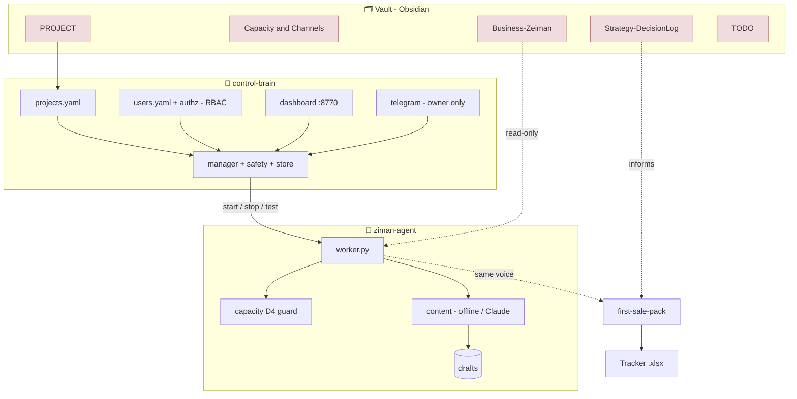
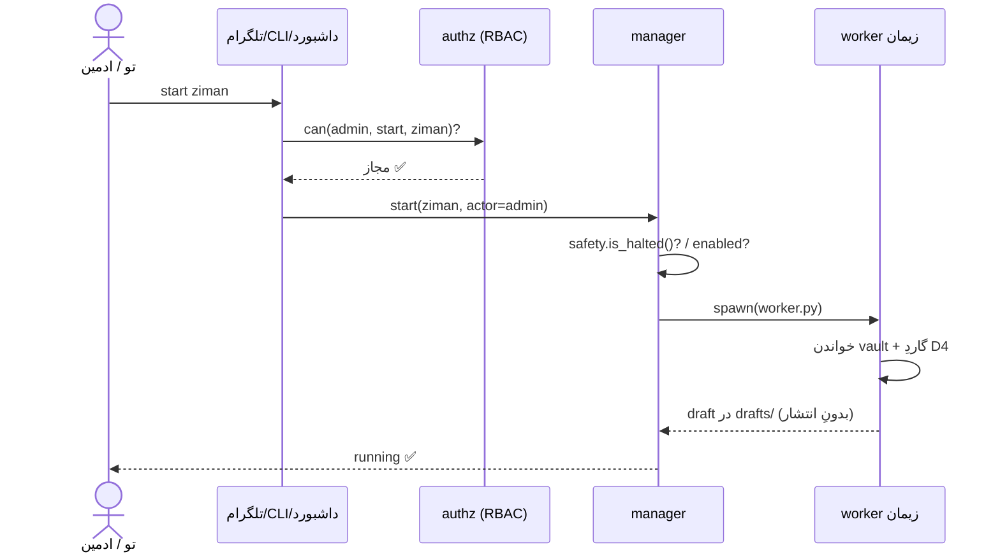

# 🗺️ گزارشِ کار و نقشهٔ سیستمِ زیمان (MOC / Home)

> [!summary] الان چه داریم؟
> زیمان از «چند نوتِ استراتژی» شد یک **سیستمِ زندهٔ تست‌شده**: **مغزِ کنترل** (روشن/خاموش/تست + RBAC چند-کاربره)، **ایجنتِ مارکتینگ** (تولیدِ محتوا زیرِ سقفِ ظرفیت، بدونِ انتشارِ خودکار)، **بستهٔ محتوای فروشِ اول** + **تراکرِ اکسل**، و **کیتِ همیشه‌روشن**. جمعاً **۲۱ تستِ سبز**. تلگرام یک‌پِیست فاصله دارد.

> [!tip]- 🚀 امروز چطور اجرا کنم؟ (کلیک کن)
> ```bat
> cd "…\Ziman Galerry\control-brain"
> python -m venv .venv && .venv\Scripts\activate && pip install -r requirements.txt
> python run_tests.py          REM باید ۲۱ سبز بدهد
> python app.py test ziman     REM ✅ سبز
> python app.py start ziman    REM زنده → drafts ساخته می‌شود
> python app.py                REM داشبورد: http://127.0.0.1:8770
> ```
> جزئیات کامل: [[ZIMAN-BRAIN-SETUP]]

## ✅ وضعیتِ گام‌ها
> [!info] راهنمای وضعیت: ✅ انجام‌شده/تست‌شده · 🟡 آماده، منتظرِ ورودیِ تو · ⏳ برنامه‌ریزی‌شده

| گام | چیست | وضعیت | سند |
|---|---|---|---|
| ۰ | زنده‌سازی + اتصال به مغز | ✅ | [[ZIMAN-BRAIN-SETUP]] |
| ۱ | محتوای فروشِ اول + `--dm`/`--posts` | ✅ | [[first-sale-pack]] |
| ۲ | همیشه‌روشن (autostart/لاگ/ری‌استارت) | ✅ | `control-brain/autostart/` |
| ۳ | کنترل از تلگرام | 🟡 منتظرِ توکن | [[ZIMAN-BRAIN-SETUP]] |
| ۴ | چند-کاربره (authz/RBAC) | ✅ ۸ تستِ RBAC | [[ARCHITECTURE-multiuser-admin]] |

## 🧩 نقشهٔ اتصال (Mermaid)



## 🔀 جریانِ یک فرمان (Sequence)



## 📦 اجزای سیستم (با لینک)

**نوت‌های تصمیم:** [[PROJECT]] · [[Capacity & Channels]] · [[Business-Zeiman]] · [[Strategy-DecisionLog]] · [[TODO]] · [[Zeiman-KB-note]]
**اسناد:** [[ZIMAN-BRAIN-SETUP]] (رانبوک) · [[ARCHITECTURE-multiuser-admin]] (معماری) · [[first-sale-pack]] (محتوا)
**بصری:** [[Ziman-System.canvas|🎨 بوردِ Canvas]]
**کد:** `control-brain/` (مغز) · `ziman-agent/` (ایجنت) · `content/` (خروجی‌ها)

## ⌨️ چیت‌شیتِ دستورها

```text
# مغزِ کنترل (در پوشهٔ control-brain)
python app.py status              # وضعیتِ همه
python app.py start|stop|test <id># کنترلِ یک پروژه
python app.py users               # کاربران و نقش‌ها (RBAC)
python app.py halt | resume       # توقفِ اضطراری / ادامه
python app.py secrets-check       # چکِ رمزها در KeePassXC
python run_tests.py               # ۲۱ تست

# ایجنتِ زیمان (در پوشهٔ ziman-agent)
python worker.py --dm 6           # ۶ پیامِ DM بازارِ گرم
python worker.py --posts 3        # ۳ کپشنِ پست
python worker.py --once           # یک draft
python worker.py --campaign 100   # تستِ گاردِ D4 (رد می‌شود)
python worker.py --selftest       # خودآزمایی
```

## 🌳 درختِ کد

```text
Ziman Galerry/
├─ control-brain/           # مغز
│  ├─ core/ (manager, registry, safety, store, runner, secrets, authz, models)
│  ├─ adapters/ (dashboard, telegram_bot)
│  ├─ config/ (projects.yaml, users.yaml)
│  ├─ autostart/ (کیتِ همیشه‌روشنِ ویندوز)
│  ├─ tests/ (۲۱ تست)  ·  app.py  ·  requirements.txt
├─ ziman-agent/            # ایجنتِ مارکتینگ
│  ├─ ziman/ (config, capacity[D4], content, brief)
│  ├─ worker.py  ·  ziman.yaml  ·  drafts/
└─ content/ (first-sale-pack.md, Ziman-FirstSale-Tracker.xlsx)
```

## 📊 KPIها و سنجه‌ها
- **قیفِ فروش:** در `content/Ziman-FirstSale-Tracker.xlsx` (نرخِ پاسخ/تبدیل/درآمد، زنده).
- **سفارش per کانال:** در [[Capacity & Channels]] ثبت کن.
- **قیدِ D4:** سفارش‌ها ≤ سقفِ ظرفیت (۳۰/هفته) — ورکر خودکار enforce می‌کند.
- **سلامتِ کد:** ۲۱/۲۱ تست سبز (۱۳ هسته + ۸ RBAC).

## 🧪 وضعیتِ تست
> [!success] ۲۱ سبز، ۰ قرمز
> هسته: manager (۶) · safety (۱) · registry (۱) · secrets (۴) · smoke (۱). RBAC: authz (۸). اجرا: `python run_tests.py`.

## 📖 واژه‌نامه
- **مغزِ کنترل (control-brain):** ارکستریتورِ پروژه‌ها (روشن/خاموش/تست/وضعیت/توقفِ اضطراری).
- **ایجنتِ زیمان (ziman-agent):** ورکرِ مارکتینگ که مغز اجرایش می‌کند.
- **قیدِ D4:** «اول ظرفیت، بعد کمپین» — هیچ کمپینی بالاتر از سقفِ ظرفیت مجاز نیست.
- **RBAC:** کنترلِ دسترسیِ نقش‌محور (admin / operator / viewer).
- **offline / live:** بدونِ کلید = draftِ قالبی؛ با `ANTHROPIC_API_KEY` = تولیدِ زندهٔ Claude.
- **KeePassXC:** انبارِ رمزها؛ کلید فقط لحظهٔ اجرا تزریق می‌شود.
- **MOC:** Map of Content — همین نوت، نقطهٔ ورودِ پروژه.

## 🗂️ ایندکسِ نوت‌ها
| نوت | نوع | نقش |
|---|---|---|
| [[PROJECT]] | manifest | منشور + قیدِ D4 |
| [[Capacity & Channels]] | reference | ظرفیت + لاگِ کانال |
| [[Business-Zeiman]] | reference | پروفایلِ کسب‌وکار |
| [[Strategy-DecisionLog]] | log | تصمیم‌های استراتژیک |
| [[TODO]] | tasks | اقداماتِ باز |
| [[first-sale-pack]] | content | محتوای فروشِ اول |
| [[ZIMAN-BRAIN-SETUP]] | runbook | راه‌اندازی |
| [[ARCHITECTURE-multiuser-admin]] | architecture | چند-کاربره |

> [!note]- 🔎 کوئریِ Dataview (اگر پلاگین Dataview داری، کلیک کن)
> ```dataview
> TABLE type, status FROM #ziman AND -"03 - Projects/Ziman Galerry/ZIMAN-SYSTEM-MAP"
> SORT type ASC
> ```

## ⏭️ قدم بعدی
1. **تلگرام:** توکنِ BotFather + آی‌دی را در `control-brain/.env` بگذار.
2. **Claude live:** کلید را در KeePassXC (`anthropic-key`) بگذار → `secrets-check`.
3. **اسپرینت:** با تراکر شروع کن؛ نتیجهٔ کانال‌ها را در [[Capacity & Channels]] بنویس.

## 🧾 Changelog
- **2026-07-04:** ساختِ مغز + ایجنت + محتوا + autostart + RBAC؛ ۲۱ تست سبز؛ بهینه‌سازیِ Obsidian (MOC + Canvas + frontmatter + لینک‌ها).
