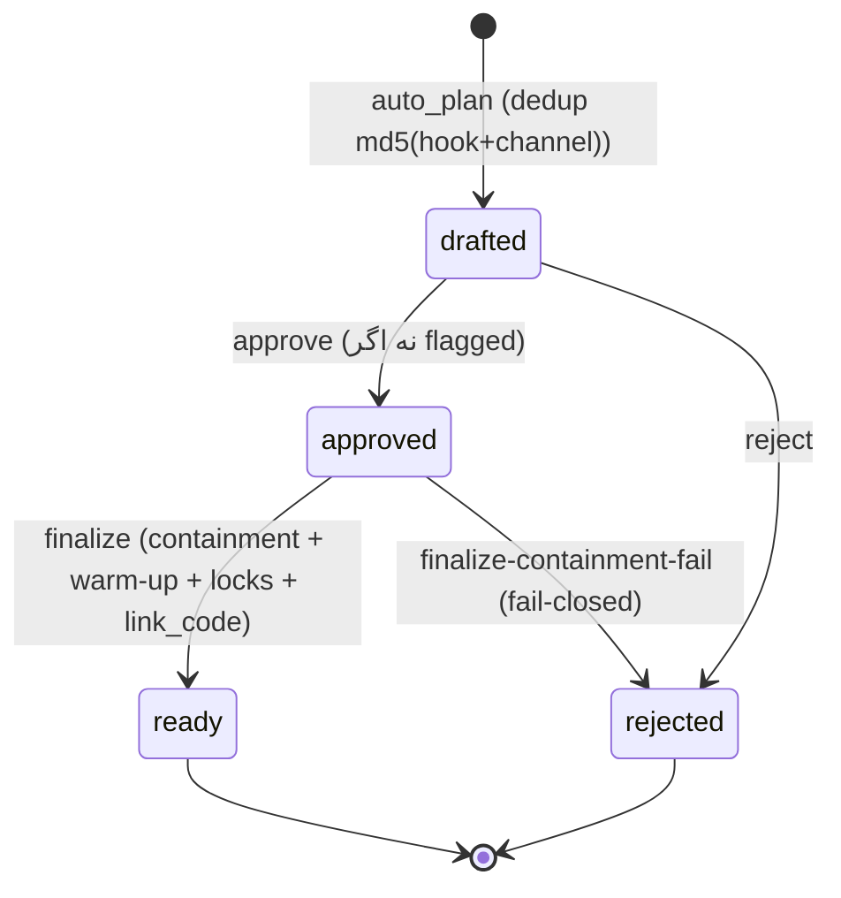
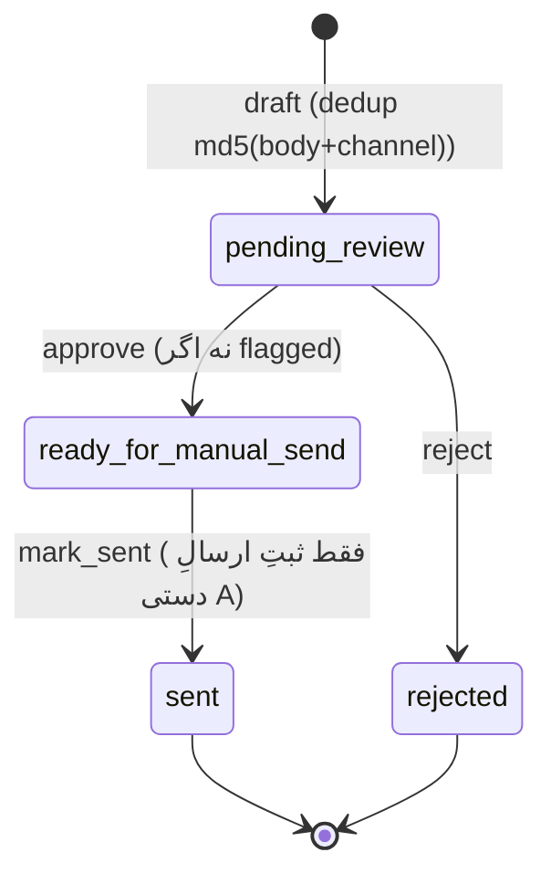
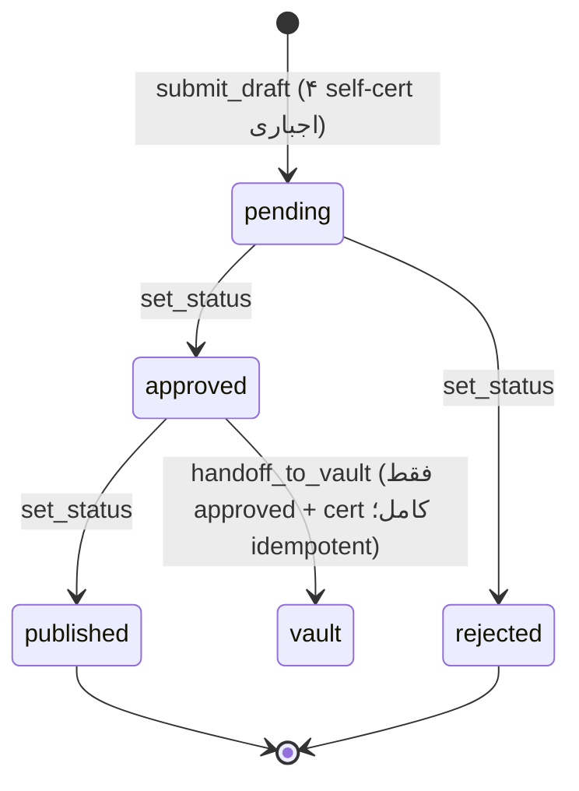

# 02 · STATE MACHINES — با گاردهای گذارِ غیرقانونی (تست: `tests/test_state_machines.py`)

## Acquisition (brain/acquisition_pipeline.py)

غیرقانونی (fail-closed، تست‌شده): `ready→approved` · `rejected→approved` · `drafted→ready`. ‏`dryrun` هیچ گذاری ندارد (صفر mutation).

## DM HITL (brain/dm_pipeline.py — بدون متد send)

غیرقانونی: `pending_review→sent` · `sent→ready_for_manual_send` · `rejected→ready_for_manual_send`.

## Studio Draft (studio/content_studio.py — ‏`_DRAFT_TRANSITIONS`)

غیرقانونی: `pending→published` · `approved→approved` · `published→*` · `rejected→*`.

## زنجیرهٔ join استودیو↔اکتساب (backlog #2 — بسته شد)

`C: submit_draft(channel/hook/caption)` → `A: set_status(approved)` → `handoff_to_vault` → `VaultBank asset (cert حفظ می‌شود)` → `AcquisitionPipeline.auto_plan (vault_id روی آیتم)` → `/pf_ok` → `/pf_ready (link_code)` → **پستِ دستی انسان**.
