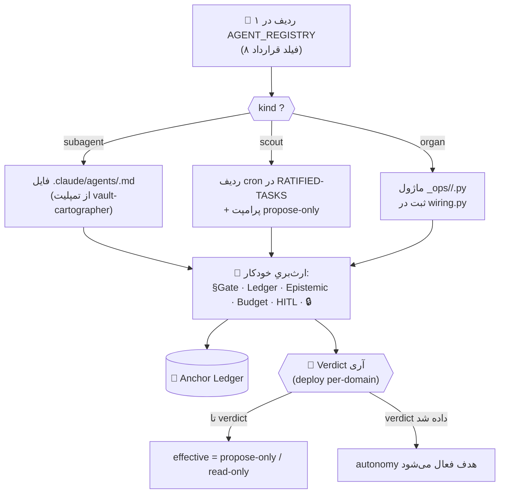
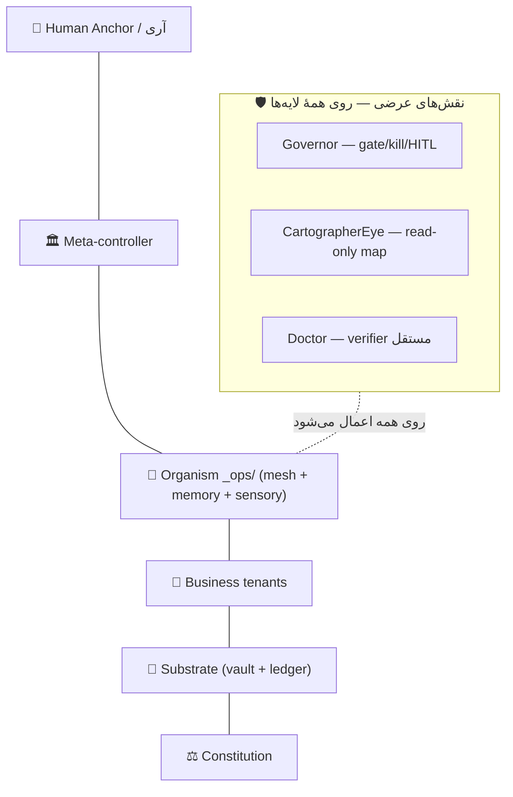

# ARACHNE RECONCILIATION — قرارداد ایجنت واحد (اسپاون با یک ردیف)

> **هدف این سند:** تطبیقِ سه معماریِ موجود (`MASTER-ARCHITECTURE` اجرایی، سند استعاریِ `ARACHNE-MALLEUS-NULL Ω`، و رجیستریِ ایجنت) طوری که **افزودن/ارتقای هر ایجنت = یک آپدیت ساده (یک ردیف رجیستری)** شود، نه جراحیِ اختصاصی.
> **این سند کد نیست و اجرا نمی‌کند.** فقط قرارداد و نگاشت را تعریف می‌کند. اجرا با پرامپتِ builder جداگانه + verdict آری.

---

## ۰) TL;DR

- سند آپلودیِ ARACHNE **معماریِ رقیب نیست**؛ یک **لایهٔ استعاری** روی همان ارگانیسمِ واقعیِ `_ops/` است. ~۷ ارگانِ آن تقریباً همه در کد موجودند. `[FACT]`
- سه مسیرِ اسپاونِ فعلی (subagent فایل‌محور · اسکات زمان‌بندی · organ در `_ops`) امروز **جدا و ناهماهنگ‌اند**. `[FACT: AGENT_REGISTRY]`
- راه‌حل = **Unified Agent Contract**: یک شِمای اعلانی که ایمنی/ledger/epistemic/بودجه را **ارث** می‌دهد؛ اسپاون = پُر کردنِ ~۸ فیلد + انتخابِ `kind`.
- تصمیمِ اسپاون = **hybrid**: `kind` خودش مسیر را تعیین می‌کند.
- بزرگ‌ترین تعارضِ باز: در ARACHNE، `Governor` و `Cartographer` «لایه»اند؛ در واقعیت **نقشِ عرضی‌اند**. حل‌شده در §۵.

---

## ۱) اصلِ تطبیق

دو سند، دو زبان، یک حقیقت:

- `ARACHNE-MALLEUS-NULL Ω` = **زبانِ زیستی/استعاری** (organism, organ, درد، چنبره). خوب برای شهود و طراحی.
- `MASTER-ARCHITECTURE-2026-07-09` = **حقیقتِ اجرایی** (کدِ `_ops/`, گیت‌ها, ledger). خوب برای ساخت. `[FACT]`

قاعدهٔ حاکم: **هرجا این دو تعارض داشتند، حقیقتِ اجرایی برنده است؛ سندِ ARACHNE فقط تا جایی معتبر است که به یک مؤلفهٔ واقعی گراند شود.**

---

## ۲) نگاشتِ ارگان ↔ واقعیت (grounded)

| ارگانِ ARACHNE | مؤلفهٔ واقعیِ موجود | تگ |
|---|---|---|
| `CartographerEye` (read-only, FACT/EST/OPEN) | `.claude/agents/vault-cartographer.md` | `[FACT]` |
| `ChronoHeart` (tick ۵دقیقه) | `_ops/organism.py` + `_ops/live_loop.py` | `[FACT]` |
| `Nociceptor` (درد معرفتی) | `_ops/neural/nociceptor.py` | `[FACT]` |
| `MycoLedger` (append-only hash-chain) | Anchor Ledger via `_ops/budget/opslib.py` | `[FACT]` |
| `DebateCortex` (ضدِ اجماعِ مصنوعی) | `_ops/debate/debate_loop.py` | `[FACT]` |
| `Governor` (gate/kill/HITL) | `_ops/budget/governor_epoch.py` + `organ_gate.py` + kill-switch D-06 | `[FACT]` |
| `Doctor` (verifier مستقل) | `_ops/doctor/doctor.py` | `[FACT]` |
| `PatternSeeker / Skeptic / Historian …` (adaptive) | ایجنت‌های DebateCortex + ناوگان اسکات | `[EST]` بخشی موجود |

**نتیجه:** «ارتقای موجود قبلی» ≠ ساختِ گونهٔ نو. = **رجیستر کردنِ همین ارگان‌ها زیر یک قرارداد واحد + پرکردنِ شکافِ adaptive-organs**.

---

## ۳) Unified Agent Contract (قرارداد ایجنت واحد)

هر ایجنت با پُر کردنِ این شِمای اعلانی متولد می‌شود. فیلدهای `inherits` **در ردیف تکرار نمی‌شوند** — به‌صورت پیش‌فرضِ ارثی از charter اعمال می‌شوند.

```yaml
# --- schema اعلانی (نه کد؛ فقط قرارداد) ---
agent:
  id:        string            # یکتا، kebab-case  (مثل: nociceptor-watch)
  kind:      subagent | scout | organ   # ← قاعدهٔ hybrid مسیر را تعیین می‌کند
  domain:    string            # tenant/حوزه (Project-F 🔒 قواعد قفل‌شده را تحمیل می‌کند)
  goal:      string            # یک‌خط
  reads:     [glob|note...]    # دامنهٔ مجازِ خواندن
  writes:    [glob|note...]    # دامنهٔ مجازِ نوشتن (پیش‌فرض: منطقهٔ propose خودش)
  autonomy:  propose-only      # پیش‌فرض؛ ارتقا فقط با verdict per-domain
  trigger:   cron | loop | on-demand
  forbidden: [string...]       # ممنوعیت‌های خاصِ همین ایجنت (علاوه بر ارثی)

  inherits:                    # ← ثابت، ارثی، غیرقابل‌دور‌زدن (از charter):
    - "§Security-Gate (ROTATION_CHECKLIST → تا CRITICAL باز است effective=read-only)"
    - "Anchor-Ledger: هر اکشن = یک ورودی append-only hash-chain"
    - "Epistemic: هر ادعا [FACT|EST|OPEN] + source"
    - "Budget: زیرِ سقفِ جمعی AU$30/ماه (D-25)"
    - "Kill-switch D-06 (fail-closed) + HITL برای هر اکشنِ برگشت‌ناپذیر/بیرونی"
    - "Project-F 🔒: صفر echo هویت/پلتفرم/محتوا"
```

### قاعدهٔ hybrid برای `kind` (تصمیم شما)

| `kind` | کجا زندگی می‌کند | مناسبِ | مثالِ ارگان |
|---|---|---|---|
| `subagent` | `.claude/agents/<id>.md` | read-only، on-demand، تحلیل | `CartographerEye`, `PatternSeeker`, `Skeptic` |
| `scout` | ردیف در `RATIFIED-TASKS` + cron | همیشه-روشن، دوره‌ای، رصد | یک اسکاتِ دامنهٔ جدید |
| `organ` | ماژول در `_ops/` (پشتِ wiring) | منطقِ هستهٔ زنده، tick-محور | `Nociceptor`, `ChronoHeart`, `DebateCortex`, `Doctor` |

> **«آپدیت ساده که بزنه یه ایجنت دیگه» = یک ردیف با این ۸ فیلد + (اگر `kind=subagent`) کپیِ تمپلیت از `vault-cartographer.md`.** بقیه ارثی است.

---

## ۴) جریانِ اسپاونِ یک‌ردیفی



**سه مثالِ اسپاون (هر کدام = یک ردیف):**

1. `Nociceptor` → `kind: organ` · trigger: `loop` · reads: belief-state bus · writes: `ProtectiveSignal` → ledger · forbidden: صدور verdict.
2. `PatternSeeker` → `kind: subagent` · trigger: `on-demand` · autonomy: propose-only · forbidden: **هرگز تنها تصمیم نگیرد** (ضدِ Malleus).
3. یک اسکاتِ دامنهٔ نو → `kind: scout` · cron در `RATIFIED-TASKS` · writes: فقط `scout-digests/`.

---

## ۵) تطبیقِ مدلِ لایه‌ها (رفعِ تنها تعارضِ واقعی)

| ARACHNE (سند آپلودی) | MASTER-ARCHITECTURE (اجرایی) | وضعیت |
|---|---|---|
| L6 Human Anchor | L5 Governance / آری (D-01) | ✅ هم‌ارز |
| L5 Governor | **مکانیزمِ عرضیِ ایمنی** (نه لایه) | ⚠️ حل‌شده ↓ |
| L4 Cartographer Mind | **ایجنتِ read-only داخلِ mesh** (نه لایه) | ⚠️ حل‌شده ↓ |
| L3 Agent Mesh · L2 Memory · L1 Sensory | L3 Organism (`_ops/`) | ✅ هم‌ارز |
| L0 Constitution | L0 Constitution (`CLAUDE.md`) | ✅ هم‌ارز |

**قاعدهٔ حل تعارض:** `Governor` و `Cartographer` **لایهٔ افقی نیستند، نقشِ عرضی‌اند** — دقیقاً مطابق §۲ مسترآرک («سه مکانیزمِ ایمنیِ عرضی روی همه‌چیز»). `[FACT: MASTER-ARCHITECTURE §۲]`



---

## ۶) ردیف‌های پیشنهادیِ رجیستری برای ارگان‌های ARACHNE (propose-only)

> این‌ها **پیشنهاد**اند؛ هیچ‌کدام تا verdict آری deploy نمی‌شوند و effective = propose-only می‌ماند.

| id | kind | goal | autonomy هدف | forbidden ویژه |
|---|---|---|---|---|
| `cartographer-eye` | subagent | نقشهٔ read-only + FACT/EST/OPEN | read-only (موجود) | صدور verdict → §۱۶.۴ سند |
| `nociceptor` | organ | تشخیصِ premature-collapse / witch-hunt | propose-only | freeze-only؛ هرگز اتهام |
| `debate-cortex` | organ | چند‌صدایی ضدِ اجماعِ مصنوعی | propose-only | consensus اجباری |
| `doctor` | organ | ممیزیِ مستقلِ apophenia/replication | propose-only | نوشتن در genome |
| `pattern-seeker` | subagent | تشخیصِ الگو (خوراکِ debate) | propose-only | **تصمیمِ تنها ممنوع** |
| `skeptic` | subagent | شکاکیتِ فعال روی الگوها | propose-only | — |
| `historian` | subagent | مقایسه با چرخه‌های تاریخی | propose-only | — |

---

## ۷) شکاف‌ها و تعارض‌های design↔reality (برای verdict)

- 🔴 **adaptive-organs** (`PatternSeeker/Skeptic/Historian`) در `_ops/debate` کامل نیستند. `[EST]` — نیازِ تأیید با اسکنِ واقعیِ کد (کارِ پرامپتِ builder).
- ⚠️ **AGENT_REGISTRY هنوز فاز ۴ / deploy-نشده** است؛ افزودنِ این ردیف‌ها = «اعلانِ نیت»، نه فعال‌سازی. `[FACT: AGENT_REGISTRY]`
- ⚠️ **دو فرمتِ اسپاون** (`scout` در RATIFIED-TASKS با cron ↔ `organ` در wiring) هنوز شِمای مشترک ندارند؛ Unified Contract این را یکی می‌کند اما نیازِ ادغامِ رسمی در charter دارد.
- 🟡 **numbering لایه‌ها** بین دو سند فرق داشت (§۵ حل شد؛ نیازِ ثبت در مسترآرک).

---

## ۸) مسیرِ ارتقا و گام‌های بعدی (propose-only)

1. **verdict آری** روی «پذیرشِ Unified Agent Contract به‌عنوان شِمای رسمیِ اسپاون».
2. ادغامِ §۳ (Contract) در `ARCHITECT_CHARTER` + §۵ (نگاشتِ لایه) در `MASTER-ARCHITECTURE`.
3. بازآراییِ `AGENT_REGISTRY` تا هر ردیف صریحاً `kind` داشته باشد.
4. اجرای پرامپتِ builder (سندِ جدا) برای سیم‌کشیِ کاملِ سیستمِ عصبی — **پس از** ۱–۳.

> تا گام ۱، این سند فقط **نقشه** است، نه اجرا. هیچ ردیف واقعی فعال نشده.

---

## Sources

- [[06 - Architecture Maps/MASTER-ARCHITECTURE-2026-07-09]] — استکِ لایه‌ای + §۲ مکانیزم‌های عرضی + نگاشتِ `_ops/`
- [[05 - Agents/AGENT_REGISTRY]] — رجیستریِ فعلی + ناوگان اسکات + لایهٔ ارکستراسیون
- [[05 - Agents/RATIFIED-TASKS]] — مسیرِ اسپاونِ scout (cron + پرامپت)
- `.claude/agents/vault-cartographer.md` — تمپلیتِ subagentِ read-only
- [[04 - Architect System/architect/ARCHITECT_CHARTER]] — سطوحِ autonomy + §Security Gate
- upload: `ARACHNE-MALLEUS-NULL Ω` — سندِ استعاریِ ارگان‌ها (منبعِ نگاشتِ §۲)
