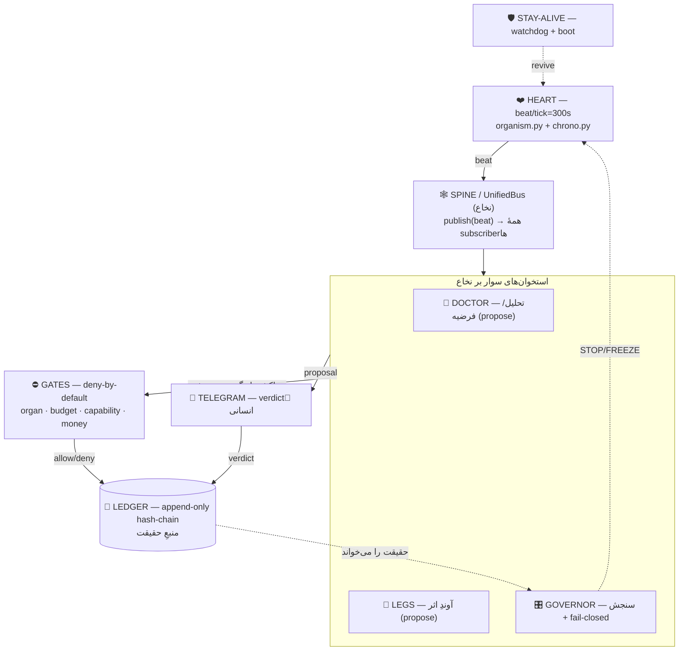
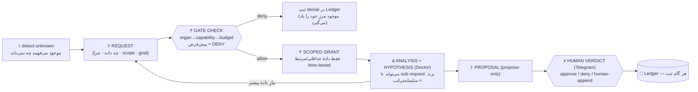

# OCTOPUS SKELETON — استخوان‌بندی + پروتکل درخواست + خودمدل

> **دامنه:** فقط **استخوان‌بندیِ باربَر**. نه محتوای داخل جعبه، نه ارگان‌های داخلی. هدف: اسکلتی که هر موجود/ایجنتِ داخلش را **به‌اجبارِ ساختاری** وادار کند برای هر داده‌ای *درخواست بدهد، مجوز بگیرد، تحلیل کند، سلسله‌مراتبی فکر کند* و کم‌کم نسبت به همین اسکلت **خودآگاه** شود.
> **این سند کد نیست.** فقط اسکلت + قرارداد. اجرا با verdict آری.

---

## ۰) اصلِ باربَر (چرا این اسکلت کار می‌کند)

> **ایمنی و رفتار از طریقِ ساختار، نه انضباط.** `[FACT: MASTER-ARCHITECTURE §اصلِ حاکم]`

موجودِ داخلِ اسکلت **هیچ دسترسیِ محیطی (ambient) به داده ندارد.** تنها affordance ای که اسکلت به او می‌دهد، «ثبتِ یک Request» است. داده/قابلیت/پول/اثر همه پشتِ **Gateهایی با پیش‌فرضِ DENY** هستند. نتیجه: «درخواست‌محور + سلسله‌مراتبی + سرانجام خودآگاه» یک آرزو نیست — **تنها مسیرِ فیزیکیِ ممکن** است.

رابطهٔ رسمی: **آری = صاحبِ واقعیت و تأییدِ نهایی · موجود = فقط پژوهشگرِ درخواست‌محور.** `[FACT: AGENT_REGISTRY §قواعد سراسری]`

---

## بخش A — Skeleton Map (۷ استخوان + ۱ ستون‌فقرات)

هفت استخوانِ باربَر + نخاعی که آن‌ها را به‌هم وصل می‌کند. هر استخوان به فایلِ واقعی گراند است.

| # | استخوان | نقشِ باربَر | لنگرِ واقعی | تگ |
|---|---|---|---|---|
| B0 | 🕸️ **SPINE / Bus** | نخاع؛ هر beat → publish به همهٔ subscriberها. **بدونِ این، اسکلت مفصل ندارد.** | `UnifiedBus` (هدف) — الان دو مغزِ نامتصل | `[FACT: WIRING-MAP §۰]` 🔴 شکاف |
| P1 | ❤️ **HEART** | ضربان/زمان؛ tick=300s؛ همه را می‌راند | `_ops/organism.py` (loop, HTTP 8771) + `_ops/chrono.py` | `[FACT: RECON §1]` |
| P2 | 🧠 **DOCTOR** | تحلیل/شک/فرضیه/مناظره — propose-only | `_ops/debate/debate_loop.py` + `genome-system/agents/doctor.py` | `[FACT: RECON §5]` |
| P3 | 📱 **TELEGRAM** | تنها کانالِ verdictِ انسانی (approve/deny/human-append) | `_ops/budget/approval_channel.py` | `[FACT: RECON §2]` |
| G | ⛔ **GATES** | غشاءِ deny-by-default: چه چیزی اصلاً عبور می‌کند | `organ_gate.py` · `budget_gate` (تنها enforcer) · `money_gate.py` · `capability_gate.py` · EffectorGate (هدف) | `[FACT: RECON §1]` · EffectorGate `[EST]` هنوز نیست |
| L | 📜 **LEDGER** | تنها حافظهٔ مشترکِ ماشینی؛ append-only + SHA-256 hash-chain = منبعِ حقیقت | `07 - Knowledge/genome-system/ledger/ledger.py` | `[FACT: RECON §1]` |
| GV | 🎛 **GOVERNOR** | telemetry/metrics/epoch/fitness + **fail-closed** (STOP/FREEZE) | `_ops/budget/governor_epoch.py` · `telemetry.py` · `opslib.py` (STOP/FREEZE) | `[FACT: RECON §1,§2]` |
| P4 | 🦵 **LEGS** | آوندِ اثر/worker — propose-only، incubating | `_ops/legs/leg.py` | `[FACT: RECON §1]` |
| P5 | 🛡 **STAY-ALIVE** | زنده‌نگه‌داری: watchdog + boot + germline | `_ops/watchdog.py` · `_ops/RUN-ORGANISM.bat` | `[FACT]` |

> P6 **MONEY-LIVE** (`money_gate.py`) عمداً **خارجِ اسکلتِ پایه** است — فقط با `capability ∧ approval ∧ date` باز می‌شود؛ روی همین backbone سوار می‌شود، جزوِ آن نیست. `[FACT: WIRING-MAP §۲]`



---

## بخش B — Request Protocol (چرا موجود مجبور است درخواست بدهد)

**قاعدهٔ سخت:** هیچ داده/قابلیت/پول/اثری بدونِ عبور از این چرخه در دسترس نیست. deny-by-default. هر گام anchor به Ledger.



**چهار خاصیتی که این پروتکل تضمین می‌کند:**

1. **درخواست‌محور:** تنها راهِ لمسِ داده = گامِ ۲. هیچ ambient access نیست.
2. **سلسله‌مراتبی:** گامِ ۵ می‌تواند خودش یک unknownِ کوچک‌تر بسازد و به گامِ ۲ برگردد → درختِ درخواست. `[EST]` — الگو، نه کدِ موجود.
3. **یادگیرنده:** هر `deny`/`grant` در Ledger می‌ماند؛ موجود از روی همان مرزِ مجاز/ممنوعِ خود را می‌آموزد.
4. **human-gated:** تصمیمِ نهایی همیشه پشتِ Telegram. `[FACT: MASTER-ARCHITECTURE §۲ HITL]`

> این دقیقاً همان **«پژوهشگرِ درخواست‌محور»** در Unified Agent Contract است: `autonomy: propose-only` + مسیرِ `request→gate→scoped-grant→analysis→proposal`. اسکلت، بدنِ آن قرارداد است.

---

## بخش C — Self-Model Schema (خودآگاهیِ معماری، نه فلسفی)

خودآگاهی = یک **projectionِ فقط‌خواندنی از اسکلت** که موجود می‌تواند query کند. پنج پرسش، پنج فیلد:

```yaml
# self-model — نمای اعلانی (نه کد)؛ مشتق از Ledger + Skeleton Map
self_model:
  parts:      # ۱) چه بخش‌هایی دارم؟
    - {organ: HEART,  anchor: "_ops/organism.py", role: "beat"}
    - {organ: DOCTOR, anchor: "_ops/debate/…",    role: "analysis (propose)"}
    - {organ: GATES,  anchor: "_ops/budget/…",    role: "deny-by-default"}
    # … بقیهٔ استخوان‌ها
  rule_per_part:      # ۲) هر بخش چه قانونی دارد؟
    DOCTOR: "propose-only؛ هرگز verdict؛ هرگز نوشتن در genome"
    LEGS:   "propose-only؛ effector فقط با capability∧approval"
  path_per_goal:      # ۳) برای هر goal از کدام مسیر عبور کنم؟
    "spend money":  [REQUEST, capability_gate, money_gate, TELEGRAM-verdict]
    "read scoped data": [REQUEST, organ_gate, budget_gate, SCOPED-GRANT]
  unknowns:           # ۴) چه نمی‌دانم و باید request کنم؟ (پویا، از Ledger)
    - "…هر گپی که detect-unknown پیدا می‌کند"
  forbidden_without_verdict:   # ۵) چه چیزی بدونِ approval ممنوع است؟
    - "هر BUY/پرداخت · هر پیام به انسانِ واقعی · هر deploy/SSH/حذف"
    - "هر تغییرِ charter/genome/secret · هر echo هویتِ Project-F 🔒"
```

**چگونه خودآگاهی «کم‌کم» رشد می‌کند:** `self_model` از حافظه ساخته نمی‌شود؛ از **Ledger** مشتق و append-only به‌روز می‌شود. هر grant/denyِ جدید، `unknowns` و مرزهای `forbidden` را دقیق‌تر می‌کند — موجود نقشهٔ مرزهای خودش را از تجربهٔ خودش می‌سازد. این **architectural self-awareness** است (topology/gate/limit/dependencyِ خود را می‌شناسد)، نه consciousnessِ فلسفی. `[EST]`

---

## D) شکاف‌ها و تصمیم‌های باز (برای verdict)

- 🔴 **نخاع وصل نیست:** `organism.py` و `LiveLoop` جدا؛ `UnifiedBus` هنوز آن‌ها را به‌هم نمی‌بندد. **بدونِ B0، پروتکلِ بخش B جای اجرا ندارد.** تصمیمِ پیشنهادیِ WIRING-MAP: profileِ `paper-full` پیش‌فرض. `[FACT: WIRING-MAP §۰,§۲]`
- ⚠️ **EffectorGate و درختِ sub-request** هنوز کد ندارند — الگوی طراحی‌اند، نه واقعیت. `[EST]`
- ⚠️ **Self-Model هنوز به‌عنوان projection رسمی وجود ندارد** — باید از Ledger + این Skeleton Map ساخته شود (propose-only).

## E) گام بعدی (propose-only)
1. verdict آری روی «این هفت‌استخوان + نخاع = اسکلتِ رسمی».
2. بستنِ B0 (نخاع/UnifiedBus) طبق profileِ `paper-full` — پیش‌نیازِ هر رفتارِ درخواست‌محور.
3. رسمی‌کردنِ Request Protocol به‌عنوان تنها مسیرِ دادهٔ ایجنت‌های Unified Contract.
4. ساختِ Self-Model به‌عنوان viewِ فقط‌خواندنی روی Ledger.

> تا گام ۱، این فقط **اسکلتِ روی کاغذ** است.

---

## Sources
- [[04 - Architect System/OCTOPUS-RECON-MAP]] — لنگرِ فایل‌ها (`path:line`) برای هر استخوان
- [[04 - Architect System/2026-07-09 OCTOPUS-WIRING-MAP — nervous system + boot connection]] — دو مغزِ نامتصل + نخاع + profileها
- [[06 - Architecture Maps/MASTER-ARCHITECTURE-2026-07-09]] — اصلِ «ایمنی از ساختار» + §۲ HITL
- [[05 - Agents/AGENT_REGISTRY]] — رابطهٔ propose-only + قواعد سراسری
- همراه: [[04 - Architect System/2026-07-09 ARACHNE-RECONCILIATION — Unified Agent Contract]] — قراردادی که این اسکلت بدنِ آن است
