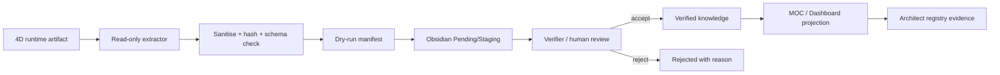

# طراحی نظری Information Architecture در Obsidian

## 1. تصمیم پایه

ساختار فعلی Vault حفظ می‌شود. پوشه‌ی top-level جدید ساخته نمی‌شود. 4D به‌عنوان **brain/tool** در لایه Architect مستند می‌شود و خروجی‌های آینده با لینک به Knowledge و Dashboard نمایش داده می‌شوند.

## 2. ساختار هدف پیشنهادی — فقط پس از تأیید مالک

```text
04 - Architect System/4D-Obsidian/
├── 00-Home.md                 # MOC زیر ۲۰۰ خط
├── PROJECT.md                 # Active Context / Progress / gates
├── Architecture/
│   ├── System Boundary.md
│   ├── Data Flow.md
│   ├── TCB Map.md
│   └── ADR/
├── Research/
│   ├── SOG/
│   ├── Brain-OS/
│   └── Hypotheses/
├── Evidence/
│   ├── Experiments/
│   ├── Verifications/
│   └── Provenance/
├── Reviews/
│   ├── Pending/
│   ├── Accepted/
│   └── Rejected/
├── Operations/
│   ├── Runbooks/
│   ├── Incidents/
│   └── Evaluations/
└── Prompts/
    ├── Phase Prompts.md
    └── Master Completion Prompt.md
```

این ساختار در این جلسه ساخته نشده است؛ چون ایجاد ساختار گسترده در Architect/Architecture یک تصمیم Orange و نیازمند approval است. بسته‌ی حاضر نقش blueprint دارد.

## 3. نوع نوت‌ها با Property Schema موجود

| مفهوم 4D | type موجود | status آغازین | محل نظری |
|---|---|---|---|
| صفحه ورود | `moc` | `active` | `00-Home.md` |
| سند مرز/جریان | `architecture` یا `design` | `draft` | Architecture |
| فرضیه | `research` | `draft` | Research/Hypotheses |
| نتیجه آزمایش | `report` | `inbox` یا `draft` | Evidence/Experiments |
| evidence synthesis | `research` | `ready` | Evidence/Verifications |
| تصمیم | `proposal` تا verdict | `draft`/`ready` | Reviews/Pending |
| راه‌اندازی | `runbook` | `draft` | Operations/Runbooks |
| handoff | `handoff` | بدون status اضافی در الگوی کانونی | PROJECT/HANDOFF |
| prompt ایجنت | `prompt` | `ready` | Prompts |

ایجنت آینده حق ندارد property جدید اختراع کند. اگر provenance machine-readable بیشتری لازم شد، ابتدا proposal برای Property Schema بدهد.

## 4. Navigation و MOC

`00-Home.md` باید تنها لینک و وضعیت کوتاه داشته باشد:

- هدف‌های SOG و Brain-OS
- آخرین evidence پذیرفته‌شده
- فرضیه‌های باز
- review queue
- وضعیت G0–G7
- لینک runbook و risk map

Dashboard نباید log خام یا نتیجه‌ی unverified را حقیقت نشان دهد.

## 5. Data Lifecycle



### قواعد lifecycle

- Artifact خام در runtime می‌ماند.
- Export شامل summary، hash، source pointer، timestamp و روش است.
- hash/source یکسان ⇒ skip یا update idempotent، نه duplicate.
- reject حذف نمی‌شود؛ reason و نسخه حفظ می‌شود.
- canonical knowledge فقط بعد از review.

## 6. Link Contract

هر نوت ماشینی آینده حداقل در بدنه داشته باشد:

```markdown
## Source Evidence
- Runtime source: `<relative path or artifact id>`
- Content hash: `<hash, no secret>`
- Generated at: `<ISO timestamp>`
- Generator version: `<adapter version>`
- Verification: unverified | reproduced | human-reviewed

## Claim Boundary
- Observed:
- Derived:
- Interpretation:
- Unknowns:
```

این‌ها بخش‌های بدنه‌اند و Property Schema را تغییر نمی‌دهند.

## 7. Naming

- گزارش ماشینی: `YYYY-MM-DD HHmm <artifact-slug>.md`
- سند curated: عنوان کوتاه و توصیفی
- نسخه: `v2` یا suffix تاریخ؛ هرگز `Copy` یا `(1)`
- قبل از ساخت، hash/artifact id و نام جستجو شود.

## 8. Views پیشنهادی

- **4D Pulse:** آخرین heartbeat/evaluation معتبر، نه اجرای مستقیم.
- **SOG Evidence Board:** observed/derived/verified جدا.
- **Brain-OS Hypothesis Board:** فرضیه، معیار ابطال، شواهد له/علیه.
- **Approval Queue:** self-code/run/export/canonical promotion.
- **Risk & Unknowns:** stale، unknown channel، schema mismatch، missing evidence.

## 9. Anti-patternها

- کپی SQLite/Chroma یا log کامل داخل Vault
- ثبت API response خام یا secret
- تبدیل هر tick به یک نوت و انفجار graph
- لینک‌دادن به فایل حدسی/غایب
- ادغام SOG evidence با تفسیر شناختی در یک claim
- استفاده از Obsidian به‌عنوان command bus اجرایی
- نوشتن مستقیم 4D در Knowledge canonical

## 10. Prompt این بخش برای ایجنت بعدی

```text
You are the Obsidian Information Architect for 4D. Treat this blueprint as proposal-only. First verify the existing vault conventions, templates, Property Schema, and whether a 4D project/MOC already exists. Produce a minimal additive file plan, exact wikilink graph, note-type mapping, naming rules, staging/review lifecycle, dedup strategy, and rollback. Do not create the full folder tree until the owner approves the plan. Do not add frontmatter keys. Keep MOCs under 200 lines. Never copy databases, raw logs, secrets, PII, or sensitive payloads into Markdown. Separate observed, derived, interpreted, and unknown claims. Stop after G2 design evidence and request verdict.
```
