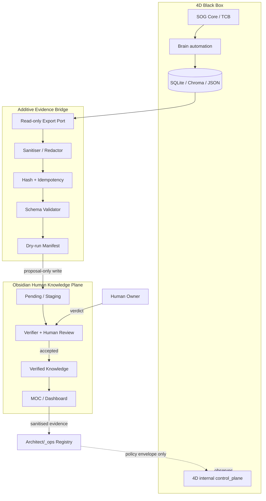

# طراحی نظری سیستم 4D × Obsidian

## 1. معماری هدف



## 2. Adapter به‌جای بازنویسی

پیشنهاد: اگر `brain/vault_sync.py` قرارداد قابل‌استفاده دارد، آن را حفظ و یک adapter/port کنار آن اضافه کنید. اگر ندارد، ابتدا interface بیرونی فعلی را مستند کنید و فقط extension کوچک بسازید. جایگزینی کامل ممنوع است.

### ورودی‌های مجاز نظری

- evaluation report
- conclusions summary
- frontier summary
- decision packet metadata sanitised
- control-plane health snapshot
- experiment aggregate با pointer/hash

### ورودی‌های ممنوع

- `.env` و credential
- DB کامل، Chroma binary، raw API payload
- Telegram token/chat data
- self-code content بدون review صریح
- PII، financial/private cross-domain data

## 3. Export Envelope پیشنهادی

این schema فقط برای design است و هنوز قرارداد کد نیست:

```yaml
schema_version: "4d.obsidian.export.v0"
artifact_id: "stable-id"
artifact_type: "experiment|conclusion|hypothesis|evaluation|incident|health"
source_ref: "relative-pointer"
source_hash: "sha256:..."
generated_at: "ISO-8601"
generator_version: "..."
sensitivity: "public|internal|restricted"
epistemic_state: "observed|derived|interpreted|hypothesis|verified"
summary: "sanitised text"
claims: []
evidence_refs: []
unknowns: []
requires_review: true
```

قبل از پیاده‌سازی، این schema باید با Property Schema و قرارداد registry تطبیق و به‌عنوان فایل runtime جدا از frontmatter Obsidian نگه داشته شود.

## 4. جریان‌های اصلی

### F1 — Experiment → Evidence

`experiment artifact → aggregate → redact → hash → pending note → verifier → accepted/rejected`

### F2 — Hypothesis Loop

`research agenda → hypothesis note → falsification criteria → linked experiments → evidence balance → owner/research review`

### F3 — Monthly Evaluation

`evaluation output → reproducibility check → curated report → MOC pulse`

### F4 — Incident/Invariant

`anchor drift or guard event → incident candidate → no automatic fix → owner-visible alert`

### F5 — Self-improvement Proposal

`self-code/strategy proposal metadata → review queue → diff/evidence outside public note → explicit owner verdict`; Vault هرگز apply نمی‌کند.

## 5. State Machine نظری

```text
DISCOVERED
  → EXTRACTED
  → SANITISED
  → VALIDATED
  → STAGED
  → REVIEWED_ACCEPTED | REVIEWED_REJECTED | BLOCKED
  → PUBLISHED_TO_MOC (accepted only)
```

هر خطا ⇒ `BLOCKED` با reason؛ fallback به fabricated content ممنوع.

## 6. Non-functional Requirements

- Local-first و offline-capable
- Deterministic dry-run
- Idempotent export
- Atomic note write (temp + replace در صورت پیاده‌سازی)
- Bounded batch size
- Backpressure؛ هر tick نوت نسازد
- Structured log بدون payload حساس
- Rebuildable dashboard
- Versioned schema
- Kill/disable switch در adapter، default-off

## 7. Failure Modes و fallback

| خطا | رفتار امن |
|---|---|
| مسیر source غایب | BLOCKED + unknown؛ نوت جعلی نساز |
| hash تکراری | skip و ledger محلی |
| schema mismatch | staging ممنوع؛ report |
| secret/PII detection | quarantine محلی + no write |
| Vault unavailable | runtime ادامه؛ export queue bounded |
| malformed Markdown | fail before replace |
| review conflict | هر دو دیدگاه حفظ؛ tension record |
| stale evidence | Dashboard برچسب stale؛ نه verified |
| registry unavailable | export داخلی ممکن، coupling به HEAD متوقف |

## 8. Test Strategy نظری

1. **L0 Pure:** sanitiser، schema، hash، naming، state transitions.
2. **L1 Adapter:** fixtureهای مصنوعی؛ temp Vault؛ no secret leakage؛ atomicity.
3. **L2 Replay:** artifact cassette → همان Markdown/hash.
4. **Safety mutation:** redactor یا idempotency شکسته شود، تست باید fail کند.
5. **Vault validation:** frontmatter + broken links پس از write آزمایشی.
6. **Negative paths:** missing source، bad encoding، collision، stale version.

## 9. Milestones

- M0: boundary audit و canonical path
- M1: export schema + fixtures، بدون write
- M2: read-only extractor + dry-run manifest
- M3: temp-vault staging writer، نه Vault واقعی
- M4: owner-approved real staging folder
- M5: verifier/review workflow
- M6: MOC/dashboard read model
- M7: sanitised registry evidence adapter
- M8: operational hardening و runbook

## 10. Definition of Done

- TCB و رفتار runtime تغییر نکرده است.
- هیچ secret/PII در export و test fixture نیست.
- export deterministic/idempotent و rollbackable است.
- accepted/rejected/unknown از هم جداست.
- Dashboard فقط accepted/verified را به‌عنوان حقیقت نشان می‌دهد.
- owner می‌تواند adapter را خاموش کند بدون آسیب به 4D.
- هیچ control-plane یا ledger رقیب ساخته نشده است.

## 11. Prompt این بخش برای ایجنت بعدی

```text
You are the Integration Design Agent. Validate this architecture against current 4D code, especially brain/vault_sync.py, events, evaluation, conclusions, frontier, guardrails, and the internal control_plane registry. Do read-only code archaeology first. Produce an interface contract, threat model, export schema proposal, source allowlist/denylist, state machine, test matrix, and an additive implementation work order. Prefer adapter/facade/anti-corruption-layer patterns; do not rewrite vault_sync or cross TCB boundaries. No live Vault write, no daemon, no Telegram, no cloud call, no self-code execution. Any interface change or >30% module change is rewrite risk: stop and ask. End at a measurable gate with evidence and rollback.
```
