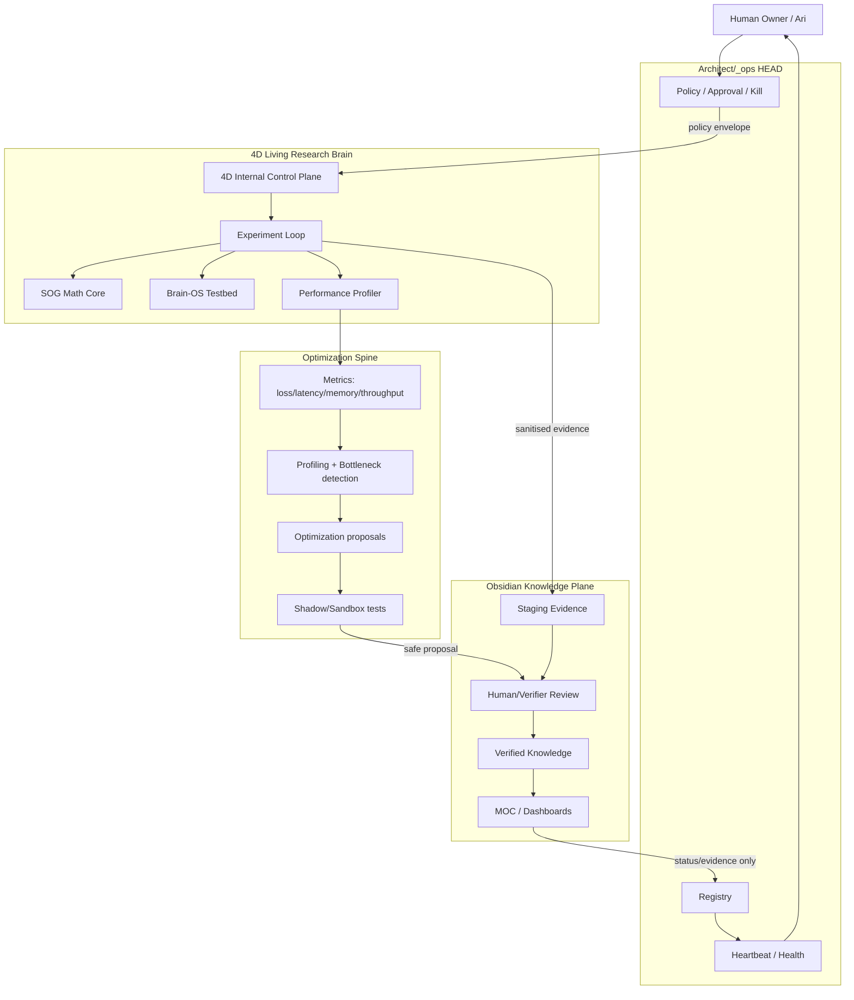

# End-State Target — سیستم زنده و بهینه

> هدف نهایی مالک: «در آخر یک سیستم زنده و بهینه می‌خواهم.» این سند این جمله را از حالت شعار به قرارداد مهندسی تبدیل می‌کند. این هنوز design است؛ هیچ runtime یا code path را فعال نمی‌کند.

## 1. تعریف کوتاه

سیستم نهایی باید یک **Living Optimized Cognitive-Operational System** باشد:

```text
زنده = stateful + self-observing + heartbeat + memory + feedback + recovery
بهینه = measurable + profiled + vectorized + resource-aware + continuously improved
انسان‌همسو = human-gated + transparent + reversible + no secret/PII leakage
واقعی = runs on local machine + uses actual evidence + fails closed + survives restart
```

## 2. تفاوت «زنده» با «اتوماتیک»

اتوماتیک یعنی کاری را تکرار کند. زنده یعنی:

- وضعیت خودش را می‌فهمد؛
- health و drift و budget را اندازه می‌گیرد؛
- خطا را incident می‌کند، نه اینکه پنهان کند؛
- memory و provenance دارد؛
- قبل از جهش، خودش را در sandbox/shadow تست می‌کند؛
- با فرمان انسان متوقف، محدود یا بازگردانده می‌شود؛
- با هر چرخه کمی بهتر می‌شود، بدون اینکه نسخه قبلی را نابود کند.

## 3. ستون‌های End-State

| ستون | معنی | معیار پذیرش |
|---|---|---|
| Pulse | heartbeat واقعی، نه ادعا | آخرین tick، freshness، status، incident count قابل مشاهده باشد |
| Memory | حافظه خام/episodic/semantic/canonical | هر claim pointer و provenance داشته باشد |
| Control | policy، approval، kill، rollback | اکشن حساس بدون verdict غیرممکن باشد |
| Optimization | profiling، throughput، latency، memory، vectorization | هر بهبود با metric قبل/بعد سنجیده شود |
| Learning | hypothesis → experiment → evidence → update | هر یادگیری trace و معیار ابطال داشته باشد |
| Human Interface | dashboard/Telegram/Obsidian review | انسان در ۳۰ ثانیه بفهمد چه باید تصمیم بگیرد |
| Resilience | fail-closed، replay، backup، stale detection | crash یا mismatch باعث action خطرناک نشود |
| Coupling | `_ops`، 4D، Obsidian و NBB جدا ولی هماهنگ | registry/evidence bridge، نه merge |

## 4. معماری نهایی مطلوب



## 5. Optimization Spine

متن MLP/ReLU ارسالی مالک به‌عنوان الگوی بهینه‌سازی عددی و سیستمی استفاده می‌شود. پیام اصلی آن برای کل سیستم:

- عملیات سنگین باید batch/vectorized باشد، نه loop روی نمونه‌ها؛
- bottleneck باید با MACs، memory و throughput اندازه‌گیری شود؛
- هر مدل یا pipeline باید dimension contract داشته باشد؛
- بهینه‌سازی بدون profiling، ادعاست؛
- هر تغییر performance باید قبل/بعد داشته باشد؛
- عددها باید reproducible باشند؛
- float32، C-contiguous، batch-level compute، BLAS threads و gradient/metric logging باید در work orderها لحاظ شوند.

این فقط برای MLP نیست؛ یک روش فکر کردن است:

```text
spec → baseline → profile → bottleneck → small optimization → test → compare → keep/rollback
```

## 6. Living Loop نهایی

```text
Observe
  → Measure
  → Diagnose
  → Propose improvement
  → Shadow test
  → Human review if sensitive
  → Apply additive patch only if approved
  → Record provenance
  → Update dashboard
  → Continue
```

هیچ مرحله‌ای نباید مستقیم از Diagnose به Apply بپرد.

## 7. What Good Looks Like

سیستم وقتی «زنده و بهینه» است که بتواند این گزارش را مرتب تولید کند:

```yaml
system_state:
  pulse: fresh | stale | down
  current_goal: "..."
  last_safe_run: "..."
  open_incidents: 0
  pending_approvals: []
  budget_state: ok | warning | exhausted
  performance:
    samples_per_sec: measured
    epoch_time: measured
    memory_usage: measured
    bottleneck: named
    last_optimization_delta: measured
  knowledge:
    new_observed: n
    verified: n
    rejected: n
    unknowns: n
  safety:
    secrets_leaked: false
    external_actions_without_verdict: false
    rollback_available: true
```

## 8. فازهای تکامل به سمت سیستم زنده

| فاز | هدف | نتیجه |
|---|---|---|
| Life-0 | Baseline reality | بدانیم دقیقاً چه داریم |
| Life-1 | Read-only pulse | وضعیت بدون اجرای خطرناک دیده شود |
| Life-2 | Evidence bridge | خروجی‌ها وارد Obsidian staging شوند |
| Life-3 | Review loop | انسان truth promotion را کنترل کند |
| Life-4 | Optimization profiler | bottleneckها با metric دیده شوند |
| Life-5 | Proposal engine | سیستم بهبود پیشنهاد دهد، نه اجرا |
| Life-6 | Shadow self-improvement | patch/parameter changes در sandbox تست شوند |
| Life-7 | Controlled live | فقط action classهای تأییدشده و برگشت‌پذیر live شوند |
| Life-8 | Autonomous rhythm | چرخه پایدار، budget-aware، self-healing، human-aligned |

## 9. خط قرمزها

- زنده بودن به‌معنی اجرای بدون اجازه نیست.
- بهینه بودن به‌معنی حذف guardrail نیست.
- هوشمند بودن به‌معنی ادعای consciousness نیست.
- سرعت بیشتر اگر safety کمتر کند، بهبود نیست.
- integration اگر control-plane جدید بسازد، بهبود نیست.
- هر optimization باید rollback داشته باشد.

## 10. Prompt مخصوص ایجنت End-State Architect

```text
You are the End-State Architect for a living optimized 4D × Obsidian system. Translate the owner's goal — “I want a living and optimized system” — into measurable engineering gates. Read this file, the MLP/ReLU optimization doctrine, the foundation docs, current 4D code, and tri-plane reconciliation. Produce an end-state scorecard, living-loop design, performance metrics, optimization backlog, safety gates, and phased roadmap. Do not implement code. Do not start runtime. Do not weaken safety for speed. Every optimization must have baseline metric, proposed delta, preserved behavior, test, rollback, and human-gate classification.
```
