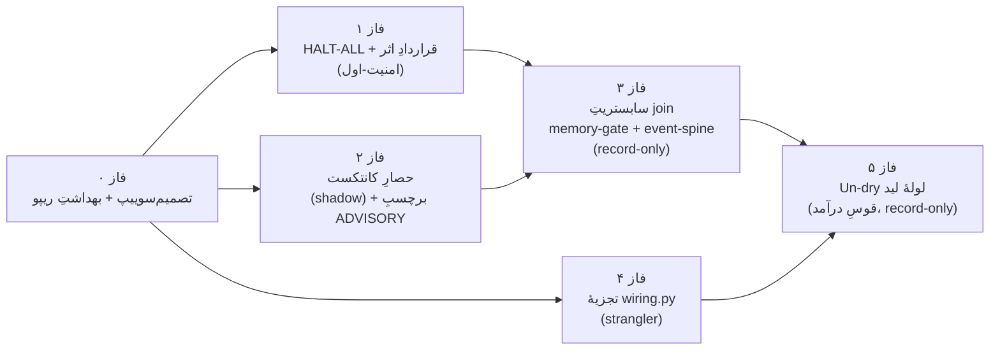

# نقشهٔ راهِ موازیِ OCTOPUS — آمادهٔ بازبینیِ ایجنتِ ارشد

> **وضعیت: PROPOSAL / read-only planning.** صفر تغییرِ کد. HEAD=23a696a، STOP-ORGANISM byte-identical، ارگانیسم خاموش (8771 free). ۸ workstream موازی (هر کدام گراند در کدِ واقعی) + سنتزِ متخاصم.

این سند = خروجیِ برنامه‌ریزی برای رأیِ ارشد **قبل از هر اجرا**. هیچ فازی نباید STOP را بردارد یا LIVE/پول را روشن کند؛ امنیت/STOP قبل از «هوشمندترکردن».

# گزارش بازبینیِ ارشد — تجمیعِ ۸ کارجریان به یک نقشه‌راهِ وابستگی‌مرتب

**پایه (ground-truth، تأییدشده @ HEAD `23a696a`، برنچ `backup/before-cleanup-2026-07-19`)**
master = `f5ed513`؛ HEAD **۱۵ جلو / ۰ عقب** نسبت به master → fast-forward خالصِ خطی. همهٔ ادعاها علیه HEAD وارسی شد، نه حافظه/HANDOFF.

---

## ۰. خلاصهٔ اجرایی — چه انجام شده، چه مانده

### DONE این جلسه (وارسی‌شده روی دیسک — دوباره برنامه‌ریزی نکن)
| قلم | شاهد (path) | وضعیت |
|---|---|---|
| Stage-1 امنیت P1/P2/P3 | commits `52eb091`/`dd07bab`/`d414d77`؛ guard_post در ۴ سرور | ✅ default-on/fail-closed، P2 ساختاری، P3 shadow |
| ستون فقراتِ outcome | `_ops/outcomes/outcome_store.py` + `paper_mvo.py` (`09b35ac`) | ✅ SQLite/WAL، idempotent، replayable |
| Decision Receipt | `_ops/outcomes/decision_receipt.py` (`23a696a`) | ✅ immutable + append-only + join |
| Remote آفلاین `germline` | E:\germline\octopus.git | ✅ فقط ratify |

### مانده — ۴ گپِ ساختاریِ تأییدشده (لنگرِ نقشه‌راه)
1. **kill-switch باطل‌شونده**: `watchdog.py:31` STOP_FLAGS فقط `[parent/STOP, STOP-ORGANISM]` — **HALT-ALL را نمی‌بیند**؛ ضمناً «architect STOP» آن = `parent/STOP` است نه مسیرِ opslib «04 - Architect System/STOP» (taxonomy drift، شاخهٔ مرده). زیر HALT-ALL حلقه‌ها clean-exit می‌کنند ولی watchdog هر ۵دقیقه احیا می‌کند → thrash.
2. **دابل-فایرِ E4**: `chrono.py:372` هر فراخوان `request()` یک `uuid4` تازه می‌زند و `release_gated_effects` **همهٔ** pendingها را releasable می‌کند (chrono.py:382) → دو فراخوانِ منطقاً یکسان می‌توانند دوبار settle شوند. تستِ اسپکِ `request_idempotent` به‌عنوان phantom در `run_all.py:113` کنار گذاشته شده.
3. **حلقهٔ خودتقویت‌کنندهٔ doctor**: `self_knowledge.py:239` خروجی خامِ LLM را بی‌هیچ برچسبِ trust به‌عنوان `PREVIOUS_UNDERSTANDING` به پرامتِ دورِ بعد برمی‌گرداند (persist در :404) → ادعای LLM «مرجع» می‌شود.
4. **join backbone بی‌تولیدکننده**: `memories_used` فقط توسط `decision_receipt.py` (خواننده) ارجاع می‌شود، **صفر تولیدکننده**؛ `state/outcomes/` و `state/legs/lead-inbox/` روی دیسک **وجود ندارند** → spine و لولهٔ لید هر دو خشک.

**اصلِ ترتیب (owner):** امنیت/STOP (HALT-ALL) پیش از «باهوش‌ترکردن». Decision-receipt + outcome-spine همین حالا ستونِ join هستند.

---

## ۱. نقشه‌راهِ فازبندی (هر فاز با organism خاموش قابل‌عرضه؛ بدون پاک‌کردن STOP، بدون LIVE/paid)

### فاز ۰ — تصمیم‌سوییپ + بهداشتِ ریپو (قفلِ همه‌چیز را باز می‌کند)
- **کارجریان‌ها:** `owner-ballot` (تولیدِ سندِ رأی) · `wiring-decomp` فاز A (حذفِ `RUNNER_APPLY` مرده + دو flag تکراری + خوانندهٔ **strip-safe** `flag()` — نیمهٔ ماندگارِ tracked) · FF مستر.
- **ورود:** worktree سبز روی `23a696a`. **خروج:** رأی‌ها ثبت؛ master FF به `23a696a` (B03)؛ merge `chord-phase-c 0059014` (B04) و `lead-leg-backend 951db3c` (B05) طبق رأی؛ `flag()` strip-safe + تست سبز؛ CoA-red (B01) → re-bless CAPABILITY (B02).
- **flagها:** فقط نام — `OCTOPUS_WIRE_CHORD_SHADOW`، `OCTOPUS_WIRE_LEAD_INBOX` (هر دو default-off).
- **تست:** `test_journal_bridge` t_a..t_h سبز؛ full `run_all` روی live-tree در پنجرهٔ organism-off (معیارِ پایانِ re-bless).
- **Rollback:** FF برگشت‌پذیر (`git reset --keep`)؛ mergeها `--no-ff` قابل‌revert؛ strip-safe صرفاً حالتِ فضای‌خالیِ آسیب‌زا را می‌بندد.
- **دموی تلگرام (owner-visible):** کارتِ «مستر اکنون canonical است (۱۵ کامیت)، chord + lead-backend مرج شد، CAPABILITY دوباره سبز» + شمارشِ تست.

### فاز ۱ — HALT-ALL / قراردادِ STOP + قراردادِ اثر (امنیت-اول، پیش از باهوش‌شدن)
- **کارجریان‌ها:** `stop-security` (سندِ canon کنترل‌پلین + `stop_probe.py` + honorِ watchdog/cockpit در **shadow** + طراحیِ توکنِ P4) · `effect-routing` (ماتریسِ E0–E4 اسپک + کتابخانهٔ `IdempotentEffectorGate` + احیای تستِ phantom + carve-outِ TINV-7 در ORGANISM-SPEC).
- **ورود:** فاز ۰. **خروج:** سندِ canon (رفعِ ارجاعِ dangling `opslib.py:288`)؛ `stop_probe` سبز؛ watchdog/cockpit در shadow «would-yield» لاگ می‌کنند (byte-identical)؛ `IdempotentEffectorGate` + تست در `run_all`؛ carve-out نوشته.
- **flagها (همه default-off):** `OCTOPUS_STOP_CONTRACT_ENFORCE`، `OCTOPUS_CONTROL_TOKEN`. `OCTOPUS_WIRE_EFFECT_TAXONOMY` **حذف شود از v1** (رجوع به نقد).
- **تست:** `should_revive()` زیر HALT-ALL = False؛ `request_idempotent` همان effect_id؛ concurrency = یک chrono row؛ shadow byte-identical؛ chrono `request()` legacy دست‌نخورده.
- **Rollback:** همه additive/inert؛ برگشت = خاموش‌ماندنِ flag (پیش‌فرض). chrono.py **دست‌نخورده** (subclass).
- **دموی تلگرام:** «probe: HALT-ALL → YIELD (watchdog/cockpit در حالتِ مشاهده تسلیم می‌شوند)»؛ «تستِ دابل‌فایرِ E4 اکنون سبز».

### فاز ۲ — حصارِ کانتکست (shadow) + برچسبِ ADVISORYِ doctor
- **کارجریان‌ها:** `context-fencing` v1 (`context_fence.py` + هوکِ shadow در ۴ نقطهٔ ورودیِ بیرونی: web synthesis، snapshot doctor، tg intent، lead desc) · **جدا‌شدهٔ** `OCTOPUS_MEMORY_SELFKNOW_ADVISORY` از memory-gate (رجوع به نقد — رفعِ حلقهٔ سمّی ارزان است و باید در موجِ امنیت بیاید).
- **ورود:** فاز ۰. **خروج:** ماژول + تست؛ shadow ledger `context-fence-shadow.jsonl`؛ برچسبِ ADVISORY روی رکوردِ persistِ doctor (loop بازنویسی‌نشده).
- **flagها:** `OCTOPUS_WIRE_CONTEXT_FENCE`، `OCTOPUS_CONTEXT_FENCE_ENFORCE` (هر دو off)، `OCTOPUS_MEMORY_SELFKNOW_ADVISORY` (off).
- **تست:** REGRESSION — `ask(task,prompt)` بدون kwarg **byte-identical** در **همهٔ** callsiteها (نه فقط یکی)؛ screen پرچمِ INSTR_OVERRIDE/EXFIL؛ shadow پرامتِ ارسالی را تغییر نمی‌دهد.
- **Rollback:** kwargِ اختیاری None = مسیرِ امروز؛ flag-off = صفر import cost.
- **دموی تلگرام:** «۳ تلاشِ تزریق در ورودیِ web/log این هفته شناسایی شد (shadow) — بدونِ تغییرِ رفتار».

### فاز ۳ — سابستریتِ join (record-only): memory-gate + event-spine
- **کارجریان‌ها:** `memory-gate` v1 (`memory_store.py`+`gate.py`+`adapters.py`، FTS5/SQLite، تولیدکنندهٔ واقعیِ `memories_used`) · `ops-event-spine` v1 (`_ops/spine/event_spine.py`+`reconcile.py`، trace_id اجباری، domain fail-closed به {decision,outcome,mission}).
- **ورود:** فاز ۱+۲ (taxonomy امنیت‌شده). **خروج:** دو استور inert (flag-off = صفر DB)؛ `as_memories_used` از `decision_receipt._validate` عبور می‌کند؛ `reconcile` mismatch=0 روی مجموعهٔ کلید.
- **flagها:** `OCTOPUS_WIRE_MEMORY_GATE`، `OCTOPUS_WIRE_SPINE` (هر دو off).
- **تست:** idempotency (INSERT OR IGNORE)؛ raw-LLM → trust=ADVISORY هرگز OWNER_CONFIRMED؛ empty trace_id → ValueError؛ replay قطعی؛ rebuild قطعیِ سبکِ acct_memory؛ flag-off byte-identical.
- **Rollback:** flag-off؛ DBها گِیت‌ایگنور (رأیِ owner).
- **دموی تلگرام:** «اولین تصمیم با memories_used واقعی (graded, trust-stamped) ثبت شد» + «تایم‌لاینِ mission سرتاسری از spine».
- **⚠️ وابستگیِ سخت:** memory-gate + context-fencing هر دو `self_knowledge.py` را additive لمس می‌کنند → **سریالی** کن (fencing اول، سپس memory adapter).

### فاز ۴ — تجزیهٔ wiring.py (strangler façade، به‌ازای دامنه)
- **کارجریان:** `wiring-decomp` فاز 0–5 (`_core` → ziman → cartographer → lead → acct[BLACK-adjacent] → heart). فقط move + re-export؛ `organism.py` byte-identical.
- **پیش‌نیازِ سخت:** **اول** تست‌های orphan (test_ziman_wiring/test_acct_beat/test_heart_loop/…) به لیستِ hardcoded `run_all.py:13` اضافه شود، وگرنه شکستِ extraction نامرئی است.
- **ورود:** فاز ۰. **خروج:** wiring.py به façade نازک؛ full `run_all` پس از **هر** فاز سبز؛ تستِ هویتِ شیء (`wiring._X is beats.mod._X`).
- **flagها:** هیچ (inert-by-construction).
- **Rollback:** هر فاز یک commitِ move؛ revert مستقل.
- **دموی تلگرام:** «wiring.py از ۲۳۵۴ خط به façade + ۶ ماژولِ دامنه؛ RED-zone tick دست‌نخورده».

### فاز ۵ — Un-dry لولهٔ لید (قوسِ درآمد، record-only، $۰/no-send/no-auto-approve)
- **کارجریان:** `lead-mvo` (merge backend + `lead_inbox_adapter.py` + `lead_outcome_recorder.py` + تولیدکننده + هوکِ `lead_outcome_beat` بیرونِ `_protective_skip`).
- **ورود:** spine/decision-receipt (موجود) + backend merge (B05، فاز ۰) + memory-gate (فاز ۳، برای memory-on-next-lead؛ v1 لازم ندارد). `record_proposal_outcome` **در HEAD موجود است** (`live_loop.py` — تصحیحِ note پلن).
- **خروج:** لیدِ واقعی intake→score→quote→draft→outcome row + immutable receipt، **verdict = PENDING** تا تصمیمِ انسانیِ واقعی link شود.
- **flagها:** `OCTOPUS_WIRE_LEAD`, `_LEAD_DISCOVERY`, `_LEAD_DRAFT`, `_LEAD_OUTCOME` (جدید), یک تولیدکننده (`_HARVEST` یا `_LEAD_INBOX`+adapter) — همه owner-gated.
- **تست:** یک draft → دقیقاً یک `delivered` row (idempotent)؛ backend+sense روی یک فایلِ flat نجنگند؛ protective_skip روشن → discovery فریز ولی recorder ثبت می‌کند؛ all-off byte-identical.
- **Rollback:** flag-off = no-op؛ delivery=sandbox؛ confirmed_revenue=0 تا reconcile.
- **دموی تلگرام:** «۳ لیدِ واقعی → کارتِ کوت؛ اولین سنجشِ $۰ از accept_rate + AUD-claimed» + دکمه‌های آره/نه/بعداً.

---

## ۲. خلاصهٔ تک‌خطیِ هر کارجریان

| کارجریان | تلاش/ریسک | باز می‌کند | وابستگی‌ها |
|---|---|---|---|
| **owner-ballot** | M/L | یک نشستِ ~۱۵دقیقه‌ای کلِ بک‌لاگِ تصمیم را پاک می‌کند (FF، مرج‌ها، re-bless) | ریشهٔ همهٔ فازها |
| **stop-security** | M/L | یک kill-switch که کلِ کنترل‌پلین (حلقه/watchdog/cockpit/launcher) اطاعت می‌کند | P2 (done)، scaffoldهای موجود |
| **effect-routing** | M/L | ماتریسِ E0–E4 + پرایمیتیوِ exactly-once برای E4 + carve-outِ TINV-7 | decision_receipt، outcome_store (done)، chrono read-only |
| **context-fencing** | M/L | یک درزِ auditشدهٔ DATA_NOT_INSTRUCTION روی همهٔ ورودی‌های بازیابی‌شده | هیچ‌کدام برای v1 (self-contained) |
| **memory-gate** | L/L | `memories_used` را واقعی می‌کند + حلقهٔ سمّیِ doctor را می‌کشد + FTS5 substrate | outcome/receipt vocab، model_router، consolidate/acct |
| **ops-event-spine** | M/L | تایم‌لاینِ replayable/idempotent/trace-mandatory بین decisions+outcomes+missions | outcome/receipt/mission_contract (reuse)، unified_bus (جدا) |
| **wiring-decomp** | L/M | RED-zone tick را از داخلِ beat جدا می‌کند + کلاسِ باگِ فضای‌خالیِ flag را می‌بندد | تأییدِ owner، رفعِ گپِ پوششِ run_all |
| **lead-mvo** | L/M | لولهٔ ساخته‌شده‌ولی‌خشکِ #۱ leg درآمد را زنده و human-attributed می‌کند | outcome-spine، merge backend، تولیدکننده |

---

## ۳. برگهٔ رأیِ تجمیعیِ owner (≤۱۴ قلم؛ پیش‌پرکرده؛ default اگر ۷روز سکوت)

| # | تصمیم | توصیه (تلاش/ریسک) | ریسکِ تعویق | default@7d سکوت |
|---|---|---|---|---|
| B01 | CoA-red: rent→5200 vs default 6000 | (a) fixtureِ hermetic تست‌محور (S/L) | re-bless بلاک؛ هر ران قرمز | تست قرمز؛ نگاشتِ پول دست‌نخورده |
| B02 | re-bless CAPABILITY (پس از B01) | فقط بعد از سبزیِ B01 (S/L) | مارکر revoked | unblessed (fail-closed) |
| B03 | FF master → 23a696a | FF (۱۵/۰ خطی) (S/L) | master ۱۵ عقب؛ split-brain | master@f5ed513 |
| B04 | merge chord-phase-c | بعد از B03، additive flag-off (M/L) | لایهٔ shadow استرند | روی برنچ |
| B05 | merge lead-leg-backend **+ adapter** | merge با adapter (M/M) | لولهٔ لید خشک | روی برنچ |
| B06 | `CHRONO_RETAIN_BEATS` | =30000 (env، اثر بعد restart) (S/L) | رشدِ نامحدودِ ۳ جدولِ per-beat | 0 (نامحدود، data-safe) |
| B07 | فعال‌سازیِ P3 (secret + flag + restart TG) | defense-in-depth (S/L) | فقط is_owner، بی‌لایهٔ replay/expiry | flag-off |
| B08 | carve-outِ TINV-7 owner-card | فقط **document** در ORGANISM-SPEC، بی‌بایپسِ کد (S/L) | ابهامِ گِیتینگ | گِیت سفت |
| B09 | ساختِ honorِ HALT-ALL (watchdog+cockpit) | additive/opt-in، جدا (M/M) | watchdog زیر panic احیا می‌کند | بدون تغییر (partial) |
| B10 | ratify remote germline + push دوره‌ای | ratify + schtask اختیاری (S/L) | remote بیات | فقط snapshotِ یک‌باره |
| **B11**★ | **enum مشترکِ trust_grade/namespace** (memory-gate + decision-receipt + spine باید یکی باشند) | یک enum امضا کن (S/H اگر fork) | driftِ خاموشِ join | تعویقِ memory-gate v1 |
| **B12**★ | flip `OCTOPUS_STOP_CONTRACT_ENFORCE` shadow→enforce | بعد از پنجرهٔ مشاهده (S/M) | **shadow خودش residual است** | shadow (نامحدود = ناامن) |
| **B13** | gitignore کردنِ DBهای runtime (memory/spine/outcomes/effect_idem + -wal/-shm) | افزودن به .gitignore (S/L) | commitِ اتفاقیِ state churn | DBها tracked (خطر) |
| **B14** | تولیدکنندهٔ لید فعال (AusTender / tg /lead / email / manual) | AusTender keyless (M/M) | لوله خشک | هیچ (خشک) |

★ = اقلامِ **جدیدِ** فراتر از برگهٔ اولیه که سنتز آشکار کرد.

---

## ۴. بزرگ‌ترین ریسک‌ها
۱ · **forkِ تاکسونومیِ trust/effect**: سه کارجریان (memory-gate، event-spine، decision-receipt/effect-routing) هرکدام enumِ trust/E-class تعریف می‌کنند؛ بی‌یکسان‌سازیِ B11، joinِ `memories_used` و spine خاموش drift می‌کنند.
۲ · **تصادمِ ویرایشِ `self_knowledge.py`**: هم context-fencing هم memory-gate آن را additive لمس می‌کنند → باید سریالی شوند (fencing اول).
۳ · **امنیتِ کاذبِ shadow**: watchdogِ shadow زیر HALT-ALL **هنوز احیا می‌کند**؛ shadow خودش سوراخِ باقی‌مانده است تا B12 flip شود.
۴ · **تلهٔ schema/lifecycleِ backend↔lead_sense**: merge بدونِ adapter هر لید را خاموش به `rejected/` می‌راند (خشکیِ نقاب‌دار).
۵ · **RED-zone creep**: چند کارجریان به wiring.py/organism.py هوک می‌افزایند؛ حتی single-call additive انباشته می‌شود؛ decomp نباید با هوکِ جدیدِ lead-mvo مسابقه دهد.
۶ · **بدهیِ عملیاتیِ ۵ WAL DB** (memory/spine/effect_idem/outcomes/receipts) روی Windows daemonِ بلندعمر بی‌سیاستِ checkpoint/retention واحد.

## ۵. آنتی-گل‌ها (کاری که نمی‌کنیم)
- بدونِ vector/graph DB (Qdrant/Neo4j/Chroma) به‌عنوان primary — فقط SQLite/FTS5 تا benchmark. بدونِ heavy dep.
- بدونِ commitِ خروجیِ خامِ LLM؛ LLM PROPOSE می‌کند نه commit؛ self_knowledge سقف=ADVISORY.
- دستِ RED-zone فقط با هوکِ additive تک‌فراخوان؛ **بازنویسیِ** wiring.py/organism.py هرگز.
- BLACK zone (money path/genome ledger/chrono/journals) **بدونِ ویرایش**؛ effect idempotency در DBِ جدا، نه chrono.db؛ پول در genome fold نمی‌شود.
- هیچ فاز نیازمندِ پاک‌کردنِ STOP یا فعال‌سازیِ LIVE/paid نیست؛ همه flag-off/inert/$۰/fail-soft.
- v1 هر قابلیت = record/observe؛ بدونِ تغییرِ runner/policy بدونِ گامِ جداگانهٔ owner-gated.
- بدونِ حذفِ فیزیکی (vault §1) — انقضا با valid_to + archive.
- بدونِ enforce شدنِ context-fence، بدونِ ارسالِ واقعیِ لید، بدونِ auto-approve یا شبیه‌سازیِ verdictِ owner روی لیدِ واقعی.

---

# ضمیمهٔ ۱ — نقدِ متخاصمِ سنتز (شفافیتِ گپ‌ها)

SEQUENCING: (1) رفعِ حلقهٔ سمّیِ self_knowledge (برچسبِ ADVISORY) در پلنِ memory-gate درونِ فاز۳ دفن شده، اما این یک ریسکِ زندهٔ خودتقویت‌کننده است و flagِ مستقلِ OCTOPUS_MEMORY_SELFKNOW_ADVISORY دارد؛ باید به موجِ امنیت (فاز۲) جدا شود — که در این سنتز اصلاح شد. (2) wiring-decomp گپِ پوششِ run_all (لیستِ hardcoded) را «باید اضافه شود» توصیف می‌کند، اما این پیش‌نیازِ سخت است نه توصیه: بدونش شکستِ extractionِ acct/heart نامرئی است؛ باید blocking شمرده شود.

OVER-REACH / dead-flag antipattern: effect-routing یک flagِ OCTOPUS_WIRE_EFFECT_TAXONOMY «RESERVED/unused» اعلام می‌کند — این دقیقاً همان RUNNER_APPLYِ مرده‌ای است که wiring-decomp پاک می‌کند (تأییدشده: صفر خوانندهٔ production). افزودنِ flag بی‌خواننده در همان جلسه‌ای که flag مرده حذف می‌کنیم متناقض است؛ تا وجودِ تولیدکننده باید حذف شود. مشابهاً stop-security پیشنهادِ STOP-EXTERNAL به‌عنوان یک لِوِلِ کاملاً جدیدِ L2 که هر connector چک کند = scope creep برای v1؛ درست است که خودِ پلن آن را open-question گذاشته — دفع شود.

MIS-GROUNDING (اصلاح‌شده با کد): lead-mvo وابستگیِ record_proposal_outcome را «UNVERIFIED، شاید فقط master» علامت زده؛ گرپ نشان می‌دهد در HEAD `live_loop.py` موجود است → step-7 owner-verdict link در HEAD قابل‌سیم‌کشی است (نه بلاک به FF). event-spine reconcile علیه mission.py JSON نیازمندِ idempotency_key پایدارِ per-transition است که mission.py امروز emit نمی‌کند → derive-key یک couplingِ پنهان است که باید در تستِ dual-write پوشش یابد.

DOUBLE-COUNT: owner-ballot اقلامِ DONE (P1/P2، remote germline) را می‌آورد؛ درست است که آنها را «ratify only» قاب می‌کند، اما ریسکِ re-litigate دارد — باید صریحاً «تأیید، نه بازتصمیم» برچسب بخورد. هیچ پلنی outcome_store/decision_receipt را بازنمی‌سازد (تأییدشده موجود) — این درست است و همه به‌عنوان backbone رفتار می‌کنند.

REGRESSION-SURFACE OPTIMISM: context-fencing «byte-identical when unused» را روی مسیرِ default-None بنا می‌کند اما kwargِ context/data به model_router.ask که در دِه‌ها callsite صدا زده می‌شود می‌افزاید؛ ادعای byte-identical باید با تست در **هر** callsite قفل شود نه یکی — پلن فقط یک regression نمونه دارد.

MISSING CROSS-CUTTING TASK: پنج WAL SQLite DB بدونِ مالکِ واحدِ سیاستِ checkpoint/retention/gitignore؛ باید یک زیرکارِ «بهداشتِ state/ DB» (B13 + wal_checkpoint دوره‌ای) صریح شود، وگرنه هر استور جداگانه همان اشتباه را تکرار می‌کند. در مجموع پلن‌ها منسجم، به‌درستی flag-off/additive، و با قیودِ سختِ owner سازگارند؛ اصلاحاتِ بالا عمدتاً ترتیب و حذفِ دو over-reach است، نه بازطراحیِ بنیادی.

# ضمیمهٔ ۲ — رأی‌های کلیدیِ مالک (بالاترین لِوِرِیج)

- B03/B04/B05 — FF master→23a696a سپس مرجِ chord-phase-c و lead-leg-backend(+adapter): پایهٔ canonical که همهٔ کارجریان‌ها روی آن branch می‌زنند؛ بدونِ آن split-brain و re-conflict
- B11 (جدید، بالاترین لِوِرِیج) — یک enumِ واحدِ trust_grade/namespace که memory-gate + decision-receipt + event-spine همه بخوانند؛ fork اینجا = drift خاموشِ کلِ join backbone
- B12 — flip کردنِ OCTOPUS_STOP_CONTRACT_ENFORCE از shadow به enforce پس از پنجرهٔ مشاهده: بستنِ واقعیِ kill-switch (watchdogِ shadow زیر panic هنوز احیا می‌کند، پس shadow خودش سوراخ است)
- B01→B02 — رفعِ CoA-red journal_bridge (fixture hermetic) و سپس re-bless CAPABILITY: تنها قرمزِ isolated-worktree و تنها بلاک‌کنندهٔ مارکرِ سبز
- B08 — نوشتنِ carve-outِ TINV-7 owner-card در ORGANISM-SPEC (بدونِ بایپسِ کد): رفعِ ابهامِ گِیتینگِ دایره‌ای که سیم‌کشیِ بعدیِ تولیدکنندهٔ E4 را باز می‌کند

# ضمیمهٔ ۳ — بزرگ‌ترین ریسک‌ها

- forkِ تاکسونومی: memory-gate + event-spine + effect-routing/decision-receipt هرکدام enumِ trust/E-class جدا می‌سازند؛ بی‌یکسان‌سازیِ B11 joinِ memories_used و spine خاموش drift می‌کنند (تأییدشده: memories_used صفر تولیدکننده دارد)
- تصادمِ ویرایشِ self_knowledge.py: هم context-fencing (fence روی PREVIOUS_UNDERSTANDING) هم memory-gate (stamp ADVISORY) additive لمسش می‌کنند → باید سریالی شوند وگرنه یکدیگر را overwrite می‌کنند
- امنیتِ کاذبِ shadow: watchdog.py:31 زیر HALT-ALL هنوز احیا می‌کند؛ حالتِ shadow خودش residual hole است تا enforce flip شود — owner ممکن است نامحدود در shadow بماند
- تلهٔ backend↔lead_sense: lead_leg_inbox raw_text می‌نویسد ولی lead_sense description الزامی می‌خواهد؛ merge بدونِ adapter هر لید را خاموش به rejected/ می‌راند و خشکی را wired جلوه می‌دهد
- RED-zone creep: lead-mvo + stop-security + effect enforcement همه هوکِ additive به wiring.py/organism.py می‌افزایند؛ انباشتِ single-call hookها + مسابقه با wiring-decomp façade
- بدهیِ ۵ WAL DB روی Windows daemonِ بلندعمر (memory/spine/effect_idem/outcomes/receipts) بی‌سیاستِ checkpoint(TRUNCATE)/retention واحد + خطرِ commitِ state churn اگر B13 gitignore نشود

# ضمیمهٔ ۴ — نقشهٔ راهِ فازبندی‌شده (خلاصه)

- فاز ۰ — تصمیم‌سوییپ + بهداشتِ ریپو (owner-ballot + wiring-decomp فاز A strip-safe/dead-flag + master FF + مرج chord & lead-backend) — ورود: worktree سبز @23a696a؛ خروج: رأی‌ها ثبت، master FF، CoA-red→re-bless — تلاش M / ریسک L
- فاز ۱ — HALT-ALL/قراردادِ STOP + قراردادِ اثر E0–E4 (stop-security shadow + effect-routing IdempotentEffectorGate + TINV-7 carve-out) [امنیت-اول] — ورود: فاز۰؛ خروج: canon doc + stop_probe + honor در shadow + phantom test احیا — تلاش M / ریسک L
- فاز ۲ — حصارِ کانتکست shadow + برچسبِ ADVISORYِ doctor (context-fencing v1 + OCTOPUS_MEMORY_SELFKNOW_ADVISORY جدا) — ورود: فاز۰؛ خروج: ماژول+shadow ledger، regression byte-identical در همهٔ callsite — تلاش M / ریسک L
- فاز ۳ — سابستریتِ join record-only (memory-gate v1 + ops-event-spine v1) — ورود: فاز۱+۲ (taxonomy B11 امضا)؛ خروج: memories_used واقعی + spine reconcile mismatch=0، flag-off byte-identical؛ self_knowledge سریالی بعد از fencing — تلاش L / ریسک L
- فاز ۴ — تجزیهٔ wiring.py strangler façade (core→ziman→cartographer→lead→acct→heart) — پیش‌نیاز: افزودنِ تست‌های orphan به run_all؛ ورود: فاز۰؛ خروج: façade نازک، organism.py byte-identical، run_all بعد هر فاز سبز — تلاش L / ریسک M
- فاز ۵ — Un-dry لولهٔ لید record-only (merge backend+adapter + lead_outcome_recorder + producer + hook بیرونِ protective_skip) — ورود: spine + B05 + تولیدکننده؛ خروج: لیدِ واقعی→outcome+receipt، verdict=PENDING، $۰/no-send — تلاش L / ریسک M

# ضمیمهٔ ۵ — پلنِ هر workstream (effort/risk/flags/deps)

## Memory Gate v1 — write-path FSM + self_knowledge advisory/graded fix  —  effort=L · risk=L

- **هدف:** Add ONE additive, flag-off Memory Gate (candidate→classify→dedupe→trust/grade→TTL→store→index→retrieve) over stdlib SQLite+FTS5 as the single graded, trust-stamped write path for derived memory (semantic reflections, doctor self-knowledge, self-claims); copy acct_memory's owner-confirmed→deterministic-rebuild→trust discipline; and stop self_knowledge from committing-then-re-ingesting raw LLM output as authoritative. v1 = record/observe only, zero runner/policy change.
- **فایل‌های نو:** _ops/memory/__init__.py, _ops/memory/memory_store.py, _ops/memory/gate.py, _ops/memory/adapters.py, _ops/tests/test_memory_gate.py, _ops/state/memory/memory.db (runtime, gitignored — owner vote)
- **فلگ‌ها (همه پیش‌فرض خاموش):** OCTOPUS_WIRE_MEMORY_GATE, OCTOPUS_MEMORY_SELFKNOW_ADVISORY
- **قرارداد/schema:** MemoryRecord (SQLite row, INSERT-only): memory_id TEXT PK ('mem_'+sha256(namespace|key|content_sha256)[:16]); namespace TEXT ∈{procedural,self_claim,self_knowledge,semantic,owner_fact}; key TEXT null; content TEXT (already scrubbed for semantic/self_*); content_sha256 TEXT hex64 (dedupe + receipt join); trust TEXT ∈{OWNER_CONFIRMED,DETERMINISTIC,GRADED,ADVISORY,UNVERIFIED}; trust_grade TEXT (mirror string decision_receipt reads); provenance_json (source∈owner|rebuild|llm:tier|consolidate|external, producer, model?, cost_usd?, inputs_sha); confidence REAL 0..1; salience REAL null; valid_from TE
- **تست‌ها:** flag-off: no DB file created, zero reads/writes (mirror consolidate no-op test); idempotency: same content_sha256 within namespace+key inserts once (INSERT OR IGNORE); secret candidate -> rejected by secret-scan; phenomenal-claim self/semantic text -> guard_review block -> rejected; self_knowledge raw-LLM candidate -> stored trust=ADVISORY, never OWNER_CONFIRMED/DETERMINISTIC; feedback base carries ADVISORY label; procedural/owner_fact candidate from non-owner source -> refused (routed to proposal jsonl, not committed); FTS5 search: key lookup + bm25+recency ranking; min_trust filter excludes ADVISORY when asked; as_memories_used output passes decision_receipt._validate (hex64 content_sha256, trust_grade, no raw-content key); TTL: expired record excluded from get/search but row physically retained (archive-not-delete, vault §1)
- **وابستگی‌ها:** outcome_store.py + decision_receipt.py (EXIST, 23a696a) — trust_grade/content_sha256 vocab must match; Decision Receipt workstream — align trust_grade string set so memories_used joins cleanly; model_router.ask(quality=) grading hook (EXISTS); consolidate.py semantic producer + acct_memory pattern (EXIST); epistemics guard_review + contracts confidence/authoritative gate (EXIST)
- **رأیِ مالک:** Namespace taxonomy sign-off: {procedural, self_claim, self_knowledge, semantic, owner_fact}; Trust ladder vocabulary + exact trust_grade strings that decision_receipt.memories_used will read (must be one shared enum); gitignore the runtime DB: _ops/state/memory/memory.db + -wal/-shm (config change; DB currently NOT ignored); Which channel counts as 'owner-confirmed' for the procedural/owner_fact stores (approval_channel? /review card? TG cockpit?); Approve that actually wiring adapters into organism/wiring is a SEPARATE later step (v1 stays observe-only)
- **نکن:** No Chroma/Qdrant/Neo4j/vector as primary — stdlib SQLite+FTS5 only in phase 1; benchmark before any vector; No auto-commit of raw LLM output — LLM may PROPOSE, never commit; self_knowledge output caps at ADVISORY until graded; No vault-as-authoritative — vault notes are not a trust source; derived memory is scrubbed/graded, never echoed as fact; Do NOT rewrite self_knowledge's loop, consolidate, or acct_memory — additive adapters only; Do NOT touch organism.py/wiring.py in v1 (RED zone), and never fold memory into money path/genome ledger/chrono (BLACK zone)
- **unlocks:** Makes decision_receipt.memories_used real (its validator has zero producers today) — decisions can cite graded, trust-stamped, provenance-tracked memory instead of nothing. Kills the self_knowledge self-reinforcing raw-LLM loop by forcing an ADVISORY label that can't launder into a decision as fact. Gives the existing but un-queryable semantic layer (consolidate's semantic_memory.jsonl, retrievable only by tail today) a graded key+FTS5 read path. Establishes the first FTS5 retrieval substrate + one shared trust taxonomy for all downstream memory consumers, deferring any vector DB until benchmarked.

## Context assembly fencing (DATA_NOT_INSTRUCTION)  —  effort=M · risk=L

- **هدف:** Structurally (not just by soft label) separate retrieved data from instructions in every LLM prompt assembled in _ops, and screen untrusted retrieved input (Vault/web/Telegram/state/logs) for prompt-injection — additive, flag-off, shadow/observe-only in v1, byte-identical when unused.
- **فایل‌های نو:** _ops/cortex/context_fence.py, _ops/tests/test_context_fence.py
- **فلگ‌ها (همه پیش‌فرض خاموش):** OCTOPUS_WIRE_CONTEXT_FENCE, OCTOPUS_CONTEXT_FENCE_ENFORCE
- **قرارداد/schema:** ContextPackage fields (all optional lists/strings): constraints[], verified_state{}, verified_facts[], procedures[], episodes[], candidate_beliefs[], contradictions[], untrusted_data[{source,text}]. Fence marker: `⟦DATA_NOT_INSTRUCTION source=<src> id=<int>⟧\n<text>\n⟦/DATA_NOT_INSTRUCTION⟧`. screen flag taxonomy: {code: INSTR_OVERRIDE|ROLE_CHANGE|EXFIL|TOOL_FORGE|FENCE_FORGE|IMPERATIVE_DENSITY, risk: low|med|high, span}. validate_output contract: (text, allowed_keys:set, clamps:dict{key:(lo,hi)}) → dict|None. Caps (owner-tunable): per-item 800 chars, total untrusted 3000 chars, ~1200 toke
- **تست‌ها:** fence() strips forged ⟦DATA_NOT_INSTRUCTION⟧ and ‹‹‹/››› tokens from data and enforces per-item + total caps (oversize → truncate+REDACTED, never full); screen() flags INSTR_OVERRIDE/ROLE_CHANGE/EXFIL/TOOL_FORGE on hostile retrieved text and returns no flags on clean text; render() places untrusted_data ONLY inside fenced blocks; trusted fields (constraints/verified_state/facts) never fenced and never mixed; validate_output() rejects non-whitelist keys, clamps numeric ranges, and rejects output that echoes an injection marker; REGRESSION: model_router.ask(task, prompt) with no context/data kwarg is byte-identical to current output (poisoned + clean prompts); SHADOW: synthesize() with a poisoned web hit records a HIGH flag to context-fence-shadow.jsonl but the prompt actually sent is unchanged; SHADOW: doctor _ask_llm fences a poisoned recent_errors line; persisted self-knowledge understanding is unaffected in v1; flag-off = zero import cost / zero shadow writes (byte-identical, no state churn)
- **وابستگی‌ها:** Stage-1 server auth (already done) fronts the cortex HTTP /ask door (cortex.py:529) — enforcement phase for that site rides on it; outcome_store/decision_receipt (done) — optional later sink for screening verdicts; not required for v1; None blocking for v1 module+shadow — self-contained, stdlib-only
- **رأیِ مالک:** Approve fence marker format + GUARD_SYSTEM wording as the single shared canon (replacing/absorbing topics.GUARD_SENTENCE); Per-site verdict on which call sites graduate shadow→enforce, order (proposed: cortex HTTP /ask + tg_intent first, then synthesis web, doctor, lead); Policy: should a screen() HIGH flag ever hard-block/drop retrieved data, or only annotate? (v1 never blocks); Confirm char/token cap values (per-item 800 / total 3000 / ~1200 tok); Confirm doctor self-reinforcing loop treatment: fence PREVIOUS_UNDERSTANDING as candidate_beliefs (proposed) vs verified
- **نکن:** Don't change ask() default behavior — omitting context/data kwarg must be byte-identical to today (regression-locked); Don't drop/block/mutate legitimate retrieved data in v1 — observe/record only; Don't rewrite the debate topics guard — generalize+reuse it as one canon, no second dialect; Don't fold txn scrub_pii or chord scrub_summary into this — compose them, keep PII/secret redaction separate concerns; Don't touch money app / genome ledger / chrono (BLACK); don't route money-journal text through the fence
- **unlocks:** A single audited seam where all retrieved memory/Vault/web/Telegram/state/log text is provably fenced as DATA_NOT_INSTRUCTION and injection-screened before reaching any model, closing the soft-label gap that today exists everywhere except debate — and specifically breaking the self-reinforcing doctor loop where poisoned log/state text could shape persisted self-knowledge. Shadow ledger gives owner real evidence (which sites see injection attempts, how often) to decide enforcement per-site with zero behavior risk.

## Operational event SoT spine (decisions / outcomes / missions), additive + flag-off  —  effort=M · risk=L

- **هدف:** Stand up ONE append-only, replayable operational event log as the cross-domain source-of-truth for decisions+outcomes+missions, with a mandatory trace_id invariant and a canonical envelope, joined to (not replacing) the existing domain stores via gradual dual-write. v1 = record/observe only, inert until flag-on; no producer, runner, or policy behavior changes.
- **فایل‌های نو:** _ops/spine/__init__.py, _ops/spine/event_spine.py, _ops/spine/reconcile.py, _ops/tests/test_event_spine.py, 06 - Architecture Maps/EVENT-SPINE-SOT-MATRIX.md
- **فلگ‌ها (همه پیش‌فرض خاموش):** OCTOPUS_WIRE_SPINE
- **قرارداد/schema:** Envelope (spine `events` table columns), reconciling task-spec ⇄ mission_contract ⇄ outcome_store:
 event_id TEXT PK (sha of identity tuple) · idempotency_key TEXT UNIQUE NOT NULL · type TEXT NOT NULL (domain verb: decision.recorded | outcome.{delivered,deferred,accepted-measurement,rejected,failed} reused from outcome_store.EVENT_TYPES | mission.{created,running,blocked,needs_approval,done,failed} reused from mission_contract.STATUS) · domain TEXT NOT NULL CHECK IN ('decision','outcome','mission') · occurred_at TEXT NOT NULL (UTC ISO) · recorded_at TEXT NOT NULL (UTC ISO) · producer TEXT NOT 
- **تست‌ها:** mandatory trace_id: empty trace_id → ValueError (fail-fast), non-empty accepted; idempotency: same idempotency_key twice → one row, record() returns False on 2nd; domain fail-closed: unknown domain → ValueError; only decision/outcome/mission accepted; replay determinism: rebuild read-model twice from spine rows → byte-identical; producer_sequence gap: a missing sequence number is flagged by the read-model, not silently ignored; dual-write parity (Phase-1 test): after a domain record + spine publish, reconcile mismatch = 0 drift for that idempotency_key set; flag-off inertness: OCTOPUS_WIRE_SPINE unset → publish() no-op, zero spine rows, producer behavior byte-identical; content-free: payload with banned-echo string or forbidden CoT/secret key → scrubbed/rejected (parity with events._scrub_str + decision_receipt._FORBIDDEN_*)
- **وابستگی‌ها:** outcome_store.py + decision_receipt.py already merged this session (both proven, idempotent, replayable) — spine reuses their SQLite/WAL/single-writer pattern; mission_contract.py (envelope/id/trace/hash helper) + mission.py (Mission Genome) already exist — spine reuses mission_contract generators; events.py mint_correlation_id() convention (oct-YYYYMMDD-hex6) reused for correlation_id consistency; Phase-1 dual-write depends on wiring.make_* pattern (wiring.py:204-214) and an owner flag OCTOPUS_WIRE_SPINE
- **رأیِ مالک:** Confirm module name + location: _ops/spine/event_spine.py (recommended) vs folding into _ops/outcomes/ alongside the sibling SQLite spines; Ratify v1 domain enum = exactly {decision, outcome, mission} (money/genome/chrono explicitly excluded); Ratify trust taxonomy values {owner, system, llm, sensor, import}; Approve reuse of mission_contract envelope + trace generator for the spine (vs a spine-local envelope); Approve that mandatory trace_id is enforced fail-fast (empty trace_id → ValueError) rather than minted-and-flagged
- **نکن:** Do NOT reuse/rename/repurpose unified_bus.py — it is the live-flagged genome+chrono write bridge, a different concern; new spine gets its own module; Do NOT declare events.jsonl the SoT (it is lossy/capped/non-idempotent, dashboard-only) — spine is separate; only a one-directional spine→events UI mirror is allowed; Do NOT replace or write to genome ledger, money app/journals, or chrono.db (all BLACK); spine may REFERENCE a ledger hash, never append one; Do NOT fold money into genome, nor fold confirmed revenue into the spine — spine carries value_aud_claimed (claim) only, never confirmed revenue; Do NOT wire any producer, runner, or policy read in v1 — record/observe only; dual-write + read-model consumption are separate owner-gated phases
- **unlocks:** One replayable, idempotent, trace_id-mandatory timeline across decisions+outcomes+missions — end-to-end mission tracing and a deterministic cross-domain read-model without touching any BLACK store; a mismatch metric that proves the spine is trustworthy BEFORE any consumer switches to reading from it; closes the events.jsonl 'not-replayable, lossy, no-idempotency' gap and the current split where trace_id/mission_id barely propagate (organism.py has only 4 references).

## wiring.py decomposition (strangler façade) + flag-registry cleanup  —  effort=L · risk=M

- **هدف:** Shrink the 2354-line _ops/wiring.py by moving cohesive beat/factory groups into a new _ops/beats/ package behind a re-export façade, so organism.py (RED zone) stays byte-identical and behavior is unchanged; plus dedupe/kill the flag registry (dead RUNNER_APPLY, duplicated lines, strip-unsafe reads).
- **فایل‌های نو:** _ops/beats/__init__.py, _ops/beats/_core.py, _ops/beats/ziman.py, _ops/beats/cartographer.py, _ops/beats/lead.py, _ops/beats/acct.py, _ops/beats/heart.py, _ops/flags.py (optional, observe-only v1)
- **قرارداد/schema:** Façade contract (wiring.py post-refactor) = re-export the SAME symbols consumers already bind: 48 public names used by organism.py (apply_profile, wire_summary, make_* factories, enrich_state_with_germline, *_beat, protective_override, publish_tick_signals, flag, wire_proposal_buttons) + private state dicts tests mutate in place (_EPOCH_STATE, _HEART_STATE, _NUDGE_STATE, _ACCT_STATE, _ZIMAN_STATE, _DISCOVERY_STATE) + private helpers tests call (_epoch_fire, _observations_from_snapshot). Named imports only (no star — underscores skipped + tests need privates). Object identity of state dicts MUS
- **تست‌ها:** Phase 0/core: test_cadence_aliasing + test_epoch stay green (both in run_all; verify wiring._EPOCH_STATE.clear() still resets the live gate object via re-export); Phase 1 ziman: run test_ziman_wiring + test_ziman_leg + smoke_ziman_wire.py directly (NOT in run_all); Phase 2 cartographer: test_cartographer_wiring + smoke_cartographer_virtual.py; Phase 3 lead: test_leg + test_panel_lead (in run_all) + test_acquisition; Phase 4 acct: test_acct_beat + test_business_legs_shape + test_reconcile* run directly; Phase 5 heart: test_heart_loop + test_heart_control run directly; Full run_all.py green after EVERY phase (no regression in the gated set); Add a façade-identity assertion test: wiring.<sym> is beats.<mod>.<sym> for each moved state dict (guards against accidental copy/reassignment)
- **وابستگی‌ها:** Owner approval to create _ops/beats/ package and convert wiring.py to a re-export shim (structural change adjacent to RED-zone organism.py) — but organism.py itself is NOT edited; flags.cmd cleanup depends on owner because the file is GITIGNORED (runtime-only, not a versioned commit) and .cmd edits must re-assert CRLF (Edit-tool converts to LF → boots flagless); run_all.py hardcoded TESTS list should be extended with the ungated domain tests (test_ziman_wiring, test_acct_beat, test_heart_loop, test_business_legs_shape, test_cartographer_wiring, test_reconcile) before/with acct+heart+ziman phases, else run_all cannot catch a broken extraction
- **رأیِ مالک:** Approve strangler-façade refactor of wiring.py + new _ops/beats/ package (pure move, organism.py untouched); Approve strip-safe flag() change — behavior change ONLY for the pathological trailing-space case (a flag with a trailing space currently reads OFF, would read ON); no flag found intentionally space-disabled, but owner confirms none is; Verdict on stale tests/test_runner_apply_gate.py (references removed funcs, not in run_all) — leave inert / archive; never delete; Explicit go for Phase 4 acct extraction (financial/BLACK-adjacent beats: acct_beat/reconcile_beat/business_legs_beat); Approve adding the orphaned domain tests to run_all's TESTS list
- **نکن:** No big-bang delete or one-shot split of wiring.py — one cohesive group per phase, each behind the façade; Do NOT edit organism.py (RED zone) — the import `import wiring as _w` + 48 `_w.` call sites stay byte-identical; No behavior change: extraction is a pure move + re-export; no logic edits, no new default-on flag, no cadence/gate tweaks; Do NOT star-import in the shim (drops underscore names tests need) and do NOT reassign the state dicts (breaks object identity mutation tests rely on); Do NOT fold acct/reconcile money-app logic into anything, do NOT touch money journals/genome ledger/chrono (BLACK zone) — only relocate the beat wrappers verbatim
- **unlocks:** wiring.py drops from ~2354 lines toward a thin façade + focused domain modules, each independently testable and reviewable; the RED-zone tick (organism.py) is decoupled from beat internals so future beat work stops mutating a 2.3k-line hot file; strip-safe reads + a deduped registry remove the silent trailing-space flag-disable class of bug; extraction pattern (façade + per-domain module + gated tests) generalizes to the remaining neural/consolidation/cockpit clusters and to closing the run_all coverage gap.

## Effect routing E0–E4 + idempotent EffectorGate producers + TINV-7 owner-card carve-out  —  effort=M · risk=L

- **هدف:** Make the E0–E4 effect taxonomy an explicit, spec-written gate matrix; ship an additive, chrono-BLACK-safe idempotent request path for E4 (fixing the phantom `request_idempotent`); and formally carve the E2 owner-DM approval card out of TINV-7 so soliciting a human append is not circularly gated. All additive/inert; zero external send enabled; no gate weakened.
- **فایل‌های نو:** _ops/effects/__init__.py, _ops/effects/effect_idem.py (idempotency store + idempotent_request() + IdempotentEffectorGate subclass), _ops/effects/EFFECT-TAXONOMY-E0-E4.md (the gate matrix reference; or fold as ORGANISM-SPEC §2.5.1 instead)
- **فلگ‌ها (همه پیش‌فرض خاموش):** OCTOPUS_WIRE_EFFECT_TAXONOMY (default off, RESERVED — record/observe-only enforcement layer if a producer later stamps/enforces E-class; v1 unused so library is inert by construction)
- **قرارداد/schema:** effect_idem.db table: effect_idem(idempotency_key TEXT PRIMARY KEY, effect_id TEXT, kind TEXT, payload_ref TEXT, status TEXT, created_at TEXT). API: idempotent_request(gate, kind:str, payload_ref:str, idempotency_key:str) -> (effect_id:str, is_new:bool); empty key -> ValueError; dedup solely on idempotency_key. IdempotentEffectorGate(chrono.EffectorGate).request_idempotent(kind,payload_ref,key) -> (effect_id,is_new); inherits request/release_gated_effects/settle/status_of unchanged. Effect classes: E0 compute, E1 durable-write, E2 owner-notification (carve-out), E3 external-reversible, E4 exte
- **تست‌ها:** legacy chrono.request() unchanged: two calls -> two distinct effect_ids (proves chrono byte-identical); request_idempotent: same key -> same effect_id; is_new True then False; different key -> different effect_id; is_new True; empty idempotency_key -> ValueError; dedup purely on idempotency_key regardless of kind/payload_ref; inherited release_gated_effects + settle + status_of work on an idempotent effect_id (settled); replay after settle returns the SAME already-settled effect_id (is_new False), visible via status_of; CONCURRENCY: two threads request_idempotent same key -> exactly ONE gate.request / ONE chrono pending row, both callers get identical effect_id (reserve-first proof)
- **وابستگی‌ها:** decision_receipt.effect_class (_ops/outcomes/decision_receipt.py) is the natural producer-side stamp the enforcement layer reads — already ships this session (23a696a), additive; outcome_store idempotency pattern (_ops/outcomes/outcome_store.py) reused verbatim as the store design — already in the durable spine (09b35ac); chrono EffectorGate.request/release/settle/status_of must remain the inherited primitives (BLACK, read-only) — subclass depends on their current signatures
- **رأیِ مالک:** Approve re-enabling test_effector_idempotency by re-adding to run_all.py:113 once it targets IdempotentEffectorGate (currently listed as intentional phantom); Verdict on whether E3 producers (ps_writeback labels, telegram_center group send, langar reply) should ALSO route through EffectorGate in a LATER step, or keep the current per-leg flag+cap+own-idempotency model — v1 only documents them, changes nothing; FINDING for owner (chrono BLACK, do NOT touch here): release_gated_effects marks ALL pending→releasable (chrono.py:384), so one owner approval can release an unrelated concurrently-pending effect; scoping release to the approved effect_id is a separate chrono-owner decision; Confirm E2 owner-card carve-out wording before it is written into ORGANISM-SPEC (spec is owner-canon)
- **نکن:** Do NOT edit chrono.py — add request_idempotent via subclass/wrapper, never a method on EffectorGate (chrono is BLACK); Do NOT modify the money app: path — capability_gate/money_gate/organ_gate, the app:* callback scheme, _do_approve, or gate.settle stay byte-identical; Do NOT weaken any gate: settle() fail-closed, kill/FREEZE force-close, and release-all-pending semantics stay as-is; carve-out only removes a requirement that never applied (sending the solicitation card); Do NOT enable any external send or flip any flag; ship an inert library + spec + test only; Do NOT wire the idempotency helper into any live producer in v1 (adoption = separate owner-gated step)
- **unlocks:** A spec-authoritative E0–E4 gate matrix that makes 'which controls apply to this effect' unambiguous for every future producer; a proven exactly-once E4 request primitive (closing the double-fire risk that was structurally possible via uuid-per-call) that any future financial/irreversible producer can adopt behind one flag; and a written TINV-7 carve-out that removes the circular-gating ambiguity around owner-approval cards — together the missing contract layer that lets E3/E4 producers be wired later without re-litigating the safety model.

## Lead MVO un-drying — close the REAL loop (intake→score→quote→card→owner-decision→durable-outcome→memory-on-next-lead)  —  effort=L · risk=M

- **هدف:** Un-dry the Lead-نقاشی pipeline end-to-end with NO real send / no money / no auto-approve. Seed a producer into the empty lead-inbox, let the already-wired pure discovery chain mint proposals + persist drafts, then bind those REAL drafts into the durable outcome spine (OutcomeStore + DecisionReceipt) as RECORD-ONLY events, leaving owner verdict PENDING until a real human decision links in. paper_mvo stays the CI/reference harness and becomes the template for the record-only real driver.
- **فایل‌های نو:** _ops/outcomes/lead_outcome_recorder.py (record-only: draft→OutcomeStore delivered + DecisionReceipt, verdict PENDING; dead-letter sidecar), _ops/legs/lead_inbox_adapter.py (backend raw_text→sense description schema+lifecycle reconciler), _ops/tests/test_lead_outcome_recorder.py, _ops/tests/test_lead_inbox_adapter.py, (merge from branch) _ops/legs/lead_leg_inbox.py + _ops/tests/test_lead_leg_inbox.py
- **فلگ‌ها (همه پیش‌فرض خاموش):** OCTOPUS_WIRE_LEAD, OCTOPUS_WIRE_LEAD_DISCOVERY, OCTOPUS_WIRE_LEAD_DRAFT, OCTOPUS_WIRE_LEAD_OUTCOME, OCTOPUS_WIRE_LEAD_INBOX, OCTOPUS_WIRE_HARVEST, OCTOPUS_WIRE_TRADEQUOTE
- **قرارداد/schema:** Shared IDs across the loop (already the OutcomeStore contract): correlation_id / mission_id / proposal_id / leg_id / lead_id. OutcomeStore event_types = delivered|deferred|accepted-measurement|rejected|failed (outcome_store.py:27); value_aud_claimed = asking-price CLAIM (NOT revenue), confirmed_revenue_aud pinned 0 until reconcile (:143). DecisionReceipt: objective≤300, reason_codes/assumptions structured (no CoT — forbidden keys rejected recursively), memories_used = content_sha256 + refs only, effect_class E0..E1 for record-only, approval_ref/verdict = reference NOT authorization, missing jo
- **تست‌ها:** seed lead-inbox with a draft-tier lead → discovery mints proposal + persists lead-drafts/<aid>.json (deterministic score≥70); lead_outcome_recorder writes exactly one 'delivered' OutcomeStore row per draft; re-run is idempotent (no dup); DecisionReceipt recorded per draft is immutable + verdict/outcome resolve to PENDING (never fabricated success); backend register_lead → adapter → lead_sense.read_inbox picks it up with a non-empty description (schema bridge); backend+sense do NOT both consume the same flat file (no silent reject / no lost list_leads); corrupt inbox JSON → rejected/ + sidecar (DLQ) and beat survives; all-flags-off → byte-identical no-op (zero new rows, zero files); OutcomeStore.metrics(): confirmed_revenue_aud==0, value_aud_claimed reflects claim, accept_rate 0 until a real verdict links
- **وابستگی‌ها:** outcome spine 09b35ac + decision receipt 23a696a (present at HEAD); MERGE of claude/lead-leg-backend@951db3c into HEAD (D-H) — currently branch-only; a live PRODUCER feeding lead-inbox (harvest_austender OR backend+adapter OR email OR manual); existing proposal-button reward arc (record_proposal_outcome) for the owner-verdict link step — reported on master 76ab9e8 in memory, UNVERIFIED against this HEAD
- **رأیِ مالک:** AUD targets (OWNER-VOTE): weekly lead volume, quote-conversion %, and lead→quote→paid AUD goal — no target exists in code, success metric needs your numbers; Approve MERGE of claude/lead-leg-backend + accept the schema/lifecycle adapter reconciliation (backend and lead_sense currently conflict); Approve turning ON OCTOPUS_WIRE_LEAD_DISCOVERY + OCTOPUS_WIRE_LEAD_DRAFT (deliberately excluded from paper-full — they mint REAL proposals); Pick the producer to activate: AusTender harvest vs telegram /lead vs email vs manual drop; Approve NEW flag name OCTOPUS_WIRE_LEAD_OUTCOME and that the recorder is strictly record-only (no policy/score change)
- **نکن:** No real customer message/send — delivery stays sandbox/manual, verdict stays human-gated; No money/spend; confirmed_revenue stays 0 until reconcile; do NOT touch money app path / genome ledger / chrono (BLACK zone); No auto-approve and NO simulating an owner verdict on a REAL lead (paper_mvo simulation is CI-only); No rewrite of wiring.py/organism.py — additive hook + single call site only (RED zone); Recorder must not change scoring/policy/memory (v1 record/observe only)
- **unlocks:** Turns a fully-built-but-inert pipeline into a live, durable, human-attributed Lead loop: real leads flow intake→score→quote→persisted draft→durable outcome row + immutable decision receipt, with owner verdict PENDING until a real decision links in. Gives the first end-to-end, replayable, $0 measurement of the #1 revenue leg (accept_rate + AUD-claimed) WITHOUT any send/money/auto-approve — and makes 'memory-on-next-lead' possible because outcomes are finally persisted and joined. Every downstream learning axis (conversion metrics, reward-nerve, reconcile→confirmed_revenue) becomes reachable behind one more owner-gated step.

## STOP contract v1 + close delta-scan gap D-G (watchdogs/cockpit honor HALT-ALL) + P4 local-script control-plane auth (design)  —  effort=M · risk=L

- **هدف:** Formalize a multi-level STOP contract as canon, then make the supervisors that today ignore the global kill-switch (all watchdogs + the cockpit control endpoints) additively honor opslib.master_halted() — closing the kill-switch-invalidation chain (owner raises HALT-ALL → loops clean-exit → watchdogs revive within 5 min → thrash). Ship the honor-check in shadow (observe-only) first, owner-gated flip to enforce. Design (not build) a per-boot file-bound control token for the P4 no-Origin residual. Zero rewrite of STOP; zero restart; P1/P2 untouched.
- **فایل‌های نو:** 06 - Architecture Maps/CONTROL-PLANE-HALT-2026-07-20.md, _ops/stop_probe.py, _ops/tests/test_stop_contract.py
- **فلگ‌ها (همه پیش‌فرض خاموش):** OCTOPUS_STOP_CONTRACT_ENFORCE, OCTOPUS_CONTROL_TOKEN
- **قرارداد/schema:** STOP-LEVEL CONTRACT v1 (severity ascending; senior wins). Flag path | scope | who must honor | allowed automated write-set:
L1a STOP-CORTEX (_ops/STOP-CORTEX) | brain only | cortex.py loop(557) + cortex-watchdog | ALL writes EXCEPT cortex map/state; body+legs+connectors run.
L1b STOP-ORGANISM (_ops/STOP-ORGANISM) | body loop only | organism.py(338), cortex watch-only(77), organism-watchdog+watchdog.py, cockpit restart-refuse | cortex OBSERVE-only + external connectors' own loops; body loop halted.
L2 STOP-EXTERNAL (_ops/STOP-EXTERNAL, NEW) | all outbound effects | every connector (tg send, ema
- **تست‌ها:** watchdog.py should_revive() yields False when HALT-ALL present (was: revives); yields on opslib.STOP_ARCHITECT path (not dead root path); stop_probe.py prints YIELD:<level> for each flag and OK when clean; ordering = HALT-ALL senior; cockpit do_action + dashboard _do_restart refuse ALL control actions under master_halted when ENFORCE=1; SHADOW mode (ENFORCE unset): watchdog/cockpit behavior byte-identical to today (logs only) — regression guard; P4: guard_control rejects control-plane POST without valid X-Octopus-Control when OCTOPUS_CONTROL_TOKEN=1; allows /api/state + /api/ask ungated; flag-off → byte-identical (no-Origin still allowed); dashboard _do_restart no longer writes STOP-ORGANISM (RESTART-REQUESTED-only) — does not brick under P2 launcher; regression: existing test_master_halt.py + S1-04 + test_httpauth stay green
- **وابستگی‌ها:** P2 already landed+verified (dd07bab / 52eb091) — dashboard _do_restart P2 residual is a coupled fix in this workstream; Existing scaffolding to extend: _ops/tests/test_master_halt.py (ordering), S1-04_test_cockpit_stop_guard.py, watchdog.py should_revive() testable contract, existing delegation pattern (both organism-watchdog.ps1 already call watchdog.py); Owner D-G/D-F verdicts already recorded (HANDOFF:29,31): 'formal multi-level STOP + cockpit no revocation right'; P4 depends on P1 (done, all 4 guard_post) as the browser-CSRF layer it sits behind — no dependency on P3 approval-token HMAC
- **رأیِ مالک:** Approve CONTROL-PLANE-HALT doc as canon + confirm renaming to fix opslib:288 dangling ref (or keep dated 07-13 name); Flip OCTOPUS_STOP_CONTRACT_ENFORCE shadow→enforce: THIS is the actual safety close — a shadow watchdog still revives under panic, so shadow is itself a residual hole; owner must decide how long to observe before enforcing; STOP-EXTERNAL: introduce as a real new L2 level (new flag every connector checks) or defer? scope of connectors in-scope (tg send / email / ps_writeback / harvest); Architect-STOP canonical path: unify on opslib's '04 - Architect System/STOP' (recommended — probe centralizes it) vs the watchdogs' root 'F:\backup\STOP'; the root path is currently dead; P4: approve file-bound control-token design + accept same-OS-user residual as out-of-scope (documented); no secret to provision (token auto-minted, satisfies 'never require secret')
- **نکن:** Do NOT remove/rewrite/reorder STOP, HALT-ALL, master_halted, or halted (opslib.py:284-306); Do NOT restart the organism, and do NOT create or clear STOP-ORGANISM / HALT-ALL / any STOP flag; Do NOT weaken P1 (guard_post fail-closed, httpauth secure-by-default) or P2 (launcher never deletes STOP; cockpit refuses restart under owner STOP); Do NOT fold cockpit revival into the organism watchdog or register a 2nd scheduled task — that is the split-brain the code comments forbid (live-watchdog.ps1:12-16, _ops organism-watchdog.ps1:11-22); Do NOT require enabling LIVE/paid or clearing any STOP for this work to be valid; enforce must default OFF
- **unlocks:** One authoritative kill-switch the WHOLE control plane obeys — loops (already), watchdogs, cockpit, launcher, connectors — so an owner panic (HALT-ALL) actually stops everything instead of triggering 5-min revive thrash; closes the proven kill-switch-invalidation chain and the taxonomy-drift dead architect-STOP; P4 raises the bar against different-user/SSRF local control-plane callers without breaking owner curl. Gives every future STOP-related change one canon doc + one probe to key on.

## Consolidated owner ballot + operational open items (single decision sweep)  —  effort=M · risk=L

- **هدف:** One ≤14-item owner ballot (YES/NO/NUMBER, pre-filled recommendation + risk-if-deferred + default-if-silent-7d) that clears every owner-only decision surfaced this session — journal_bridge CoA red, CAPABILITY re-bless, master fast-forward, chord-phase-c + lead-leg-backend merges, CHRONO_RETAIN_BEATS, P3 activation, TINV-7 carve-out, HALT-ALL kill-switch gap, germline remote ratify. Planning only; decide nothing money/LIVE; implement nothing.
- **فایل‌های نو:** (proposed, owner-gated later) 01 - Dashboard/OWNER-BALLOT-2026-07-20.md — the consolidated ballot doc; not created in this read-only planning pass
- **فلگ‌ها (همه پیش‌فرض خاموش):** OCTOPUS_WIRE_CHORD_SHADOW, OCTOPUS_WIRE_LEAD_INBOX, OCTOPUS_WIRE_CB_TOKEN
- **قرارداد/schema:** Ballot row = {id, decision_type: Y/N|NUMBER|CHOICE, evidence(path:line), recommendation(pre-checked), effort S/M/L, risk L/M/H, risk_if_deferred, default_if_silent_7d}. Default-if-silent policy = always the safest/most-inert branch (test stays red, master unmoved, branches on-branch, flags off, gate strict, capability unblessed) — silence never enables money/LIVE/paid, never weakens a gate, never mutates the ledger. Flag names referenced (all default-off): OCTOPUS_WIRE_CHORD_SHADOW, OCTOPUS_WIRE_LEAD_INBOX, OCTOPUS_WIRE_CB_TOKEN; env value: CHRONO_RETAIN_BEATS; secret env: OCTOPUS_CB_SECRET.
- **تست‌ها:** No new tests (read-only planning). Referenced existing gates that must stay green before the dependent votes execute: test_journal_bridge t_a..t_h (B01/B02), S1-05 ap-binding 15/15 (B07), test_chord_shadow 5/5 (B04), full run_all on live tree in organism-off window as the re-bless end-criterion (B02)
- **وابستگی‌ها:** B02 (re-bless) depends on B01 (CoA red green); B04+B05 (merges) depend on B03 (master fast-forward) for clean linear history + avoiding re-conflict with live uncommitted advance_rfcs hunk; B07 (P3) depends on owner provisioning OCTOPUS_CB_SECRET out-of-band (I never write secrets, §10); All execution needs an owner-STOP/organism-off window or an isolated worktree — never clear the live STOP-ORGANISM; Flag/value effects (B06 chrono, B07 P3) need one owner restart of the specific process
- **رأیِ مالک:** B01 CoA: choose rent→5200 canonical (seed/hermeticize test) vs accept 6000 default — money/CoA semantics, owner-only; B02 approve CAPABILITY re-bless once green; B03 approve master fast-forward to 23a696a; B04 approve merge chord-phase-c; B05 approve merge lead-leg-backend
- **نکن:** Do NOT decide the CoA mapping myself or edit journal_bridge.py / ledger_core.py / any money app / genome ledger / chrono code (BLACK zone); Do NOT implement any ballot item now — this is read-only planning; the ballot doc itself is created only under a later owner-gated step; Do NOT clear or create STOP-ORGANISM/HALT-ALL, and never make a decision require clearing STOP or enabling LIVE/paid; Do NOT write OCTOPUS_CB_SECRET or any secret value anywhere (chat/note/HANDOFF/.cmd) — owner provisions out-of-band; Do NOT merge/push to any external host or fold money journals into the genome
- **unlocks:** One owner sitting (~15 min, pre-checked recommendations) clears the entire session decision backlog in a single pass: canonical master (B03), unstranded chord shadow + lead-intake backend (B04/B05), the journal_bridge red closed → CAPABILITY re-bless unblocked (B01→B02), bounded chrono growth (B06), P3 HMAC defense-in-depth live (B07), TINV-7 policy-gap documented (B08), and a real single-control global panic (B09). Removes the largest owner-gated bottleneck so downstream workstreams (lead income arc, capability-gated flows) can proceed.

