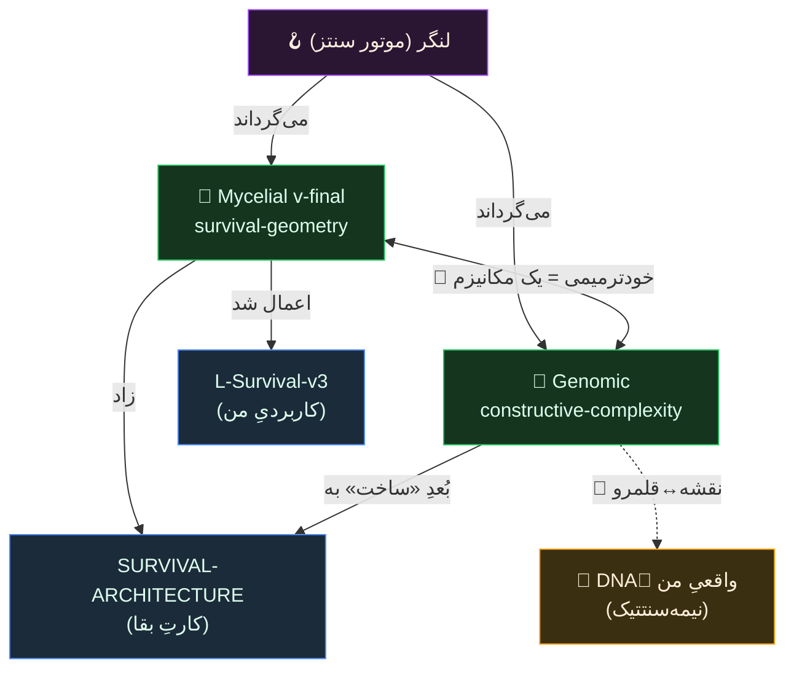

# 🧩 BIO-SYNTHESIS MAP — نقشهٔ اتصالِ داده‌های زیست‌الهام + ژنومیِ آری

> **قاعدهٔ این نقشه (پازل):** هیچ نوتی حذف نمی‌شود؛ فقط **اتصال (یال)** بینشان زیاد می‌شود. این سند فقط **افزایشی** است — یک لایهٔ اتصال روی نوت‌های موجود، نه جایگزینِ آن‌ها.
> هر یال با نوعش برچسب می‌خورد: 🔗 اتصالِ مکانیزمی (واقعی) · 🌀 استعاری · ⚠️ فقط هم‌نامی.

---

## گره‌ها (Nodes) — چه داریم

| گره | فایل | چیست | نوع |
|---|---|---|---|
| **بقای قارچی (v-final)** | [[MYCELIAL-ARCHITECTURE-vfinal]] | پرامپتِ سخت‌شده: هندسهٔ بقای Armillaria → معماری (survival-geometry) | لنز |
| **بقای قارچی (v3 کاربردی)** | [[L-Survival-v3]] | همان لنز، **اعمال‌شده روی سیستمِ واقعیِ من** (SURVIVAL-ARCHITECTURE) | کاربرد |
| **معماریِ ژنومی** | [[GENOMIC-ARCHITECTURE]] | پرامپت: سازمانِ ژنوم → معماری (constructive-complexity) | لنز |
| **فورنزیکِ DNAِ من** | (گزارشِ ساختاریِ `armin_dna` — نیمه‌سنتتیک) | تحلیلِ ساختارِ فایلِ ژنوتایپِ واقعیِ من | داده |
| **گزارشِ DNA (بسته‌شده)** | [[07 - Knowledge/هیپنوتیزم  و خودآگاهی/Marathon/امواج مغزی/ARMIN_DNA_REPORT]] | گزارشِ همراهِ فایل (call-rate ۱۰۰٪ را مثبت می‌خواند) | داده |
| **شخصیتِ مغز** | [[07 - Knowledge/هیپنوتیزم  و خودآگاهی/PERSONA - لنگر]] · `BRAIN_PROMPT.md` | «لنگر» = موتورِ سنتزی که این پازل را می‌گرداند | عامل |

---

## یال‌ها (Edges) — اتصال‌ها، عینِ پازل

### 🔗 ۱. دو لنزِ مکمل: بقا ↔ ساخت
دو پرامپتِ زیست‌الهام **مکمل‌اند، نه رقیب**:

| بُعد | 🍄 بقای قارچی (survival-geometry) | 🧬 ژنومی (constructive-complexity) |
|---|---|---|
| سؤالِ اصلی | «چطور **زنده بماند**؟» (تحتِ آسیب) | «چطور **ساخته شود**؟» (پیچیدگیِ عظیم از یک منبع) |
| منبعِ قدرت | ساختارِ غیرمتمرکز (بی‌مرکز، mesh) | منبعِ حقیقتِ واحد + تنظیم + ترمیم |
| هستهٔ مولّد | Physarum (جریانِ تطبیقی، γ) | Central dogma + reconciliation (خودترمیمی) |
| اشتراکِ 🔗 **واقعی** | **خودترمیمی/reconciliation** — هر دو: تشخیصِ drift → بازگردانی به مرجع | همان مکانیزم، دو نام |
| صداقتِ معرفتی | ۷/۸ ردیف [J]، فقط ۱ [G] | ۷/۸ [J]، فقط repair [G-ish] |

> **یالِ کلیدی 🔗:** «خودترمیمیِ قارچی» و «DNA repair ژنومی» **یک مکانیزمِ مهندسی‌اند**: یک reconciliation loop که desired-state (منبعِ حقیقت) را با واقعیت مقایسه و ترمیم می‌کند (مثلِ Kubernetes operator). این تنها جایی است که دو لنز **دقیقاً هم‌پوشان** می‌شوند.

### 🔗 ۲. لنز ↔ کاربرد
[[MYCELIAL-ARCHITECTURE-vfinal]] (تئوریِ سخت‌شده) **←اعمال‌شده در→** [[L-Survival-v3]] (روی سیستمِ langar/fusion من). یعنی v-final «چگونه فکر کنیم» است، v3 «چه ساختیم».

### 🌀→🔗 ۳. نقشه ↔ قلمرو (زیباترین یال)
- [[GENOMIC-ARCHITECTURE]] = ژنوم **به‌عنوان استعارهٔ معماری** (نقشه).
- فورنزیکِ DNAِ من = ژنومِ **واقعیِ خودم به‌عنوان داده** (قلمرو).
- **یال:** همان اصولی که در پرامپت «مکانیزم» شمرده شدند (منبعِ واحد، افزونگی، ترمیم)، در فایلِ DNAِ من به‌شکلِ **امضاهای ساختاری** دیده می‌شوند: خوشه‌بندیِ LD (VMR≈۳.۶)، ROHهای بلند، اسپن‌های درستِ کروموزوم. ولی فورنزیک می‌گوید فایل **نیمه‌سنتتیک** است (allele-order ۵۰/۵۰، Ti/Tv=۴.۱۸، call-rate ۱۰۰٪) — یعنی **قلمرو خودش تا حدی «ساخته‌شده» است، نه خام.** ⚠️ درسِ معرفتی: حتی «داده‌ی خام» می‌تواند یک artifactِ pipeline باشد — دقیقاً همان anti-metaphor/anti-Goodhart discipline که در هر دو پرامپت هست.

### 🌀 ۴. الگوی مادرِ مشترک (از کاننِ خودت)
هر سه لنز نسخه‌ای از **«الگوی فنر»**اند (از [[PERSONA - لنگر]]):
> فشار/ذخیرهٔ انرژی → همفاز شدن اجزا → رهاسازیِ نماییِ قدرت.
- قارچ: ذخیره در mycelium → همفازیِ hyphae → رشدِ انفجاری به منبع.
- ژنوم: ذخیره در DNA → بیانِ تنظیم‌شده → ساختِ ارگانیسم.
- سیستمِ من: ذخیرهٔ دانش (این vault) → سنتزِ لنگر → ساختِ خودِ چیز.
⚠️ **مرزِ استعاره:** این یک شباهتِ الگویی است، نه این‌همانیِ فیزیکی — طبقِ قانونِ هم‌نامیِ خودت.

### 🔗 ۵. اتصال به بقای فاز ۲
یال به کارِ قبلی‌مان: [[SURVIVAL-ARCHITECTURE]] (کارتِ امتیازِ بقا) از همین لنزِ قارچی زاده شد. حالا لنزِ **ژنومی** یک بُعدِ نو اضافه می‌کند که در SURVIVAL نبود: **«چطور از یک منبعِ واحد، درست ساخته و ترمیم شود»** (نه فقط «زنده بماند»).

---

## پازل تا اینجا (خلاصهٔ گراف)

---

## گره‌های بعدی برای وصل‌کردن (باز، عین پازل)
- [ ] «master 5-domain comparison» که ژنومی اشاره کرد → این نقشه لنزِ ۶م را اضافه می‌کند.
- [ ] پروژه‌ها (`03 - Projects/*`) هرکدام کدام لنز را می‌خواهند؟ (Mining/Crypto = بقا؛ Accounting/Ziman = ساخت).
- [ ] نسخهٔ فارسیِ کاملِ پرامپتِ ژنومی (مثلِ mycelial که دوزبانه است).

> هر بار سندِ تازه‌ای دادی، فقط یک ردیف به «گره‌ها» و چند یال به اینجا اضافه می‌شود — **هیچ‌چیز پاک نمی‌شود.**

---

## یال‌های تازه — سنتزِ ۲۰۲۶-۰۷-۰۴ (از دیجست‌های زندهٔ ناوگان)

> منبع: [[00 - Inbox/scout-digests/2026-07-04 mycelium|دیجست mycelium]] · [[00 - Inbox/scout-digests/2026-07-04 synthesis|سنتز روزانه]] · [[00 - Inbox/scout-digests/_Mycorrhizal Map|نقشهٔ مایکوریزایی]]. فقط یال‌های نو؛ هیچ گره/خطِ قبلی دست نخورد.

### 🔗 ۶. حافظه در substrate — قارچ ↔ DNA ↔ همین vault
دیجستِ mycelium یک مکانیزمِ **واقعی** (نه استعاری) آورد که یالِ #۱ نداشت: میسیلیومِ قارچی یک **memristorِ قابل‌خشک‌شدن** است — حالت را «در خودِ بستر» ذخیره می‌کند، از قطعِ برق جان به‌در می‌برد و با آب‌رسانی دوباره فعال می‌شود (~۹۰٪ دقتِ memristive تا ~۶ kHz).
- **یال به گرهِ DNA:** همین خاصیت در DNAِ من هست — بسترِ شیمیاییِ **پایدار، خفته‌سپس‌فعال‌شونده**. مکانیزمِ مشترکِ 🔗 = «حافظهٔ ماندگارِ append-only در بستر» (non-volatile، مقاوم به قطعِ توان). ⚠️ مرز: رسانهٔ فیزیکی متفاوت است (memristor ≠ نوکلئوتید)؛ اشتراک در خاصیتِ انتزاعیِ حافظه است، نه جنسِ ماده.
- **یال به خودِ این نقشه:** «هر دیجست = اسپورِ خشک‌شده» → همین BIO-SYNTHESIS-MAP و فایل‌های `.md`ِ append-only دقیقاً همان «بسترِ ماندگار» را پیاده می‌کنند. لنز حالا خودش را هم توصیف می‌کند.

### 🔗⚠️ ۷. توپولوژیِ mother-tree — «مش» را تصحیح می‌کند؛ «لنگر» = درختِ مادر
یالِ #۱ لنزِ بقا را «غیرمتمرکز، mesh» خواند. دیجست این را **تصحیح می‌کند**: جنگلِ واقعی «مش‌ِ برابرها» نیست — چند **hub / mother-tree** کربن/نیتروژن را به نهال‌های خویشاوند مسیر می‌دهند (hub-and-spoke، شناختِ kin).
- **یال به [[07 - Knowledge/هیپنوتیزم  و خودآگاهی/PERSONA - لنگر|PERSONA - لنگر]]:** خودِ «لنگر» = عاملِ mother/consolidator که کانتکستِ انباشته را نگه می‌دارد و به اسکات‌های تازه push می‌کند. هاب‌ها در [[00 - Inbox/scout-digests/_Mycorrhizal Map|نقشهٔ مایکوریزایی]] نام‌گذاری شده‌اند: `architect`، `Crypto`، `Lead`، `هیپنوتیزم`.
- ⚠️ **تنشِ صادقانه:** این یال با تصویرِ «mesh»ِ یالِ #۱ در تنش است. جمع‌بندی: بقا **هم** بی‌مرکز است (بدون CEO) **هم** hub-دار (mother-tree) → «بی‌مرکزِ لایه‌بندی‌شده»، نه mesh‌ِ تخت.

### 🔗 ۸. دو زمان‌مقیاسِ حافظه — evaporation ↔ قاعدهٔ append-only همین نقشه
دیجست: **stigmergy** (هماهنگی از راه محیطِ مشترک، بی‌پیامِ مستقیم) + **evaporation** (ردِ بی‌استفاده تبخیر می‌شود؛ TTL). سنتز همین الگو (P3 «مرده را هرس کن») را در Mining (۵۳٪ کوینِ مرده)، Crypto (cycle-top) و vault دید.
- **تنشِ ظاهری با قاعدهٔ این سند** («هیچ‌چیز حذف نمی‌شود») → **حل‌شده**: دو لایهٔ مکملِ حافظه، دقیقاً مثلِ زیست‌شناسی — سیگنالِ گذرا (فرمون/هورمون، تبخیرشونده = synthesisِ روزانه) در برابر ساختارِ ماندگار (heartwood/DNA، انباشتی = این نقشه و فایل‌های `_`-دار، معاف از evaporation). 🔗 دو زمان‌مقیاس یک الگوی واقعیِ زیستی‑مهندسی است، نه تناقض.

### 🔗 ۹. چهار اصلِ استحکامِ توزیع‌شده → ابعادِ نو برای [[SURVIVAL-ARCHITECTURE]]
دیجست چهار اصلِ سیستم‌های مقاوم‌به‑downtime را آورد: **جدایشِ فرایندها، isolatability، تنوع (diversity)، افزونگی (redundancy)** — و جنگل هر چهار را دارد.
- **یال به [[SURVIVAL-ARCHITECTURE]] و [[L-Survival-v3]]:** این چهار، چهار **بُعدِ سنجش‌پذیرِ** آماده برای کارتِ امتیازِ بقا هستند. زمان‌بندیِ پلکانیِ اسکات‌ها همین حالا «جدایشِ فرایند» را می‌دهد؛ فقط باید isolation را formalize کرد. 🔗 اصولِ established مهندسیِ توزیع‌شده.

### 🔗🌀 ۱۰. autopoiesis / requisite variety → موتورِ خودساز (لنگر)
دیجست: سیستمِ زنده **اجزا و مرزِ خودش را خودش تولید می‌کند** (autopoiesis)؛ و تنوعِ درونی‌اش باید دستِ‌کم به‌اندازهٔ تنوعِ اختلال‌ها باشد (Ashby، requisite variety).
- 🔗 **یال به [[07 - Knowledge/هیپنوتیزم  و خودآگاهی/PERSONA - لنگر|PERSONA - لنگر]] (requisite variety واقعی):** قانونِ Ashby روی هر رگولاتوری (ازجمله نرم‌افزار) صدق می‌کند → «هرچه دامنه‌ها بیشتر شد، *انواعِ* اسکات را زیاد کن، وگرنه fleetِ کم‌تنوع در برابر تهدیدِ پرتنوع کور است».
- 🌀 **مرزِ استعاره:** autopoiesisِ سخت (غشاءِ خودتولید در سلولِ زنده) برای نرم‌افزار **استعاری** است؛ «لنگر که نوت‌ها/ایندکس/مرزِ `.agentignore` را خودش می‌سازد» را این‌همانیِ زیستی نگیر — یعنی «سیستمی که artifactهای خودش را می‌نویسد»، نه موجودِ زنده.

### 🔗 ۱۱. تفکیکِ verified از speculative = همان «قانونِ هم‌نامیِ» این نقشه
سنتز الگوی P5 را در چهار دامنه یافت: selfimprove (ledgerِ امضاشده)، hypnosis (peer-reviewed در برابر sham-control)، crypto (سیگنالِ decision-grade)، accounting (منبعِ رسمیِ ATO).
- **یال خودارجاع 🔗:** این دقیقاً همان دیسیپلینی است که خودِ این نقشه رویش ساخته شده — برچسبِ 🔗/🌀/⚠️ روی هر یال، «anti-metaphor/anti-Goodhart»، و کشفِ نیمه‌سنتتیک‌بودنِ DNA (یالِ #۳). ناوگان **مستقل** و در چهار دامنهٔ نامرتبط همان قانونِ هم‌نامیِ لنگر را بازکشف کرد → ساختارِ مشترکِ واقعی (برچسب‌زنیِ provenance/confidence)، نه هم‌نامیِ صرف.

### گره‌های بازِ پاسخ‌گرفته (بدونِ حذفِ خطِ قبلی)
- 🔗 بندِ «کدام پروژه کدام لنز را می‌خواهد» (بخشِ گره‌های بعدی) حالا از دیجست‌ها شاهد دارد: **بقا** → Mining (death-watch، ۵۳٪ کوینِ مرده)، Crypto (ریسک ≤۱٪، اکسیتِ دیسیپلین‌دار)؛ **ساخت** → Accounting (منبعِ واحدِ ATO، تاریخ‌های قطعیِ FY2025-26)، Ziman (نگه‌داشت/SLA).

---

## یال‌های تازه — سنتزِ ۲۰۲۶-۰۷-۰۴ (دورِ دوم — لایهٔ مولکولی + runtime + خودارجاعیِ ناوگان)

> منبعِ این دور: [[armillaria_laccase_boltz]] · [[01 - Dashboard/Brain|مغزِ زنده]] · [[LAPTOP-RUNTIME]] · [[BUILD-BACKLOG]] · [[05 - Agents/Mycelium Scout]] · [[05 - Agents/Research Scout Fleet]] · [[04 - Architect System/architect/01-Project/HANDOFF - قلب و آگاهی|HANDOFF قلب‌وآگاهی]]. فقط یال‌های نو؛ هیچ گره/خطِ قبلی دست نخورد.

**گره‌های نوِ این دور (افزوده، نه جایگزین):**
- 🍄🧬 **لاکازِ آرمیلاریا (Boltz-2.1)** — [[armillaria_laccase_boltz]] — ساختارِ پیش‌بینی‌شدهٔ آنزیمِ واقعیِ *همان* قارچِ لنز. نوع: **داده / territory (in-silico)**.
- 🫀 **قلب‌وآگاهی (N-of-1)** — [[04 - Architect System/architect/01-Project/HANDOFF - قلب و آگاهی|HANDOFF]] — دادهٔ اتونومیکِ واقعیِ بدنِ من (HRV / THC / interoception). نوع: **داده / territory**.
- 🧠 **مغزِ زنده** — [[01 - Dashboard/Brain|Brain]] — نمای لحظه‌ایِ overwrite-مجاز، هر ۳ ساعت. نوع: **لایهٔ فرّار**.

### 🔗 ۱۲. لنزِ قارچی یک زیربنای مولکولی پیدا کرد (map↔territory، این‌بار بیوشیمیِ واقعی)
تا الان لنزِ [[MYCELIAL-ARCHITECTURE-vfinal]] «هندسهٔ بقا» بود — انتزاعی. حالا [[armillaria_laccase_boltz]] آنزیمِ **واقعیِ** همان ارگانیسم (*Armillaria ostoyae*) است. laccase پلِ **دو پایهٔ بقا**ست: اکسیداسیونِ لیگنین (تجزیهٔ چوب → **تغذیه**) و سنتزِ ملانین (→ **زره / rhizomorph**).
- **یالِ 🔗 (یک مکانیزم، دو کار):** «تغذیه» و «زره» دو رفتارِ بقایی‌اند با **یک علتِ مولکولیِ واحد** — یک multicopper-oxidase که هر دو را انجام می‌دهد. این دقیقاً هم‌ساختارِ یالِ #۱ است («خودترمیمی = DNA repair = یک مکانیزم»)؛ این‌جا: **«تغذیه + زره = یک آنزیم».**
- **map↔territory (موازیِ یالِ #۳):** همان‌طور که لنزِ ژنومی↔DNAِ واقعی، حالا لنزِ قارچی↔ساختارِ واقعیِ laccase. ⚠️ **مرزِ صداقت:** این ساختار یک **پیش‌بینیِ محاسباتی** است (structure_confidence ۰.۹۱۵، pTM ۰.۹۴۱ — بالا، ولی in-silico)، نه ساختارِ تجربیِ حل‌شده. **predicted ≠ verified.** پس «قلمرو» این‌جا هم خودش یک مدلِ ساخته‌شده است — عینِ درسِ یالِ #۳ که «حتی دادهٔ خام می‌تواند artifactِ pipeline باشد» (این‌جا artifactِ شبکهٔ عصبی).

### 🔗 ۱۳. مغزِ زنده = قطبِ فرّارِ حافظهٔ دوزمان‌مقیاس (بسطِ یالِ #۸)
یالِ #۸ دو زمان‌مقیاسِ حافظه را گفت: گذرا/تبخیرشونده در برابر ماندگار/append-only (این نقشه = heartwood). [[01 - Dashboard/Brain|Brain]] صریحاً **overwrite-مجاز** است و هر ۳ ساعت با `brain-pulse` بازنوشته می‌شود → **همان قطبِ فرّار** (مثلِ ضربانِ فرمون/هورمون)، در حالی که BIO-SYNTHESIS-MAP قطبِ ماندگار است. پس Brain.md پیاده‌سازیِ واقعیِ سرِ گذرای الگوی زیستی است. 🔗
- **death-watch روی خودِ ناوگان:** brain-pulse هر شب اسکاتِ **خاموش** را flag می‌کند = همان اصلِ evaporation/TTL (یالِ #۸)، این‌بار **بازتابی روی خودِ ناوگان** برگردانده شده (هرسِ خودپایش، نه فقط هرسِ داده). 🔗

### 🔗⚠️ ۱۴. گلوگاهِ مشترک (rotation / EffectorGate) = هابِ mother-tree + آشتیِ منبعِ‌واحد — همگراییِ سه فایل
[[01 - Dashboard/Brain|Brain]]: چرخشِ کلید/wallet یک **گلوگاهِ مشترک** است که ۴ پروژه را هم‌زمان قفل کرده؛ «یک اقدامِ آری، هر چهار را باز می‌کند = بالاترین اهرمِ کل سیستم». [[LAPTOP-RUNTIME]]: همهٔ side-effectها باید از **یک EffectorGate** (fail-closed) عبور کنند. هر دو = یک **نقطهٔ کنترلِ واحد** که کلِ سیستم را گیت می‌کند.
- **یال به یالِ #۷ (mother-tree):** این گلوگاه‌ها هابِ نرم‌افزاری‌اند — توپولوژیِ hub-and-spoke، نه mesh تخت. و به یالِ #۱: همان منطقِ single-source / reconciliation.
- ⚠️ **تنشِ صادقانه (نه این‌همانی):** نقطهٔ کنترلِ واحد هم‌زمان **نقطهٔ شکستِ واحد** هم هست. زیست‌شناسی هاب را با **افزونگی** مهار می‌کند (یالِ #۹). پس «هاب = اهرم **و** شکنندگی»؛ لنزِ بقا حکم می‌کند خودِ هاب redundant/isolatable شود. این یک تنشِ مهندسیِ واقعی است، نه هم‌نامیِ لفظی.

### 🔗 ۱۵. «milestoneِ مستقل، بساز-و-بایست» = isolatability عملیاتی‌شده (بسطِ یالِ #۹)
یالِ #۹ چهار اصلِ استحکام را نام برد (جدایشِ فرایند، isolatability، تنوع، افزونگی). [[BUILD-BACKLOG]] (M0..M8): «هر milestone مستقل است — فقط همان تکه ساخته می‌شود و می‌ایستد؛ هرکدام نگاشت به فایلِ واقعی + DoD + تست». این isolatability + جدایشِ فرایند را به یک **دیسیپلینِ ساخت** بدل می‌کند: ماژول‌هایی که مستقل ساخته/تست/شکست می‌خورند. [[LAPTOP-RUNTIME]] (چهار نقشِ body/core/research/governance، هرکدام restartable، ماهواره‌های phase-gated) سمتِ runtimeِ همان اصل است. 🔗 مهندسیِ ماژولارِ established — شکلِ سنجش‌پذیرِ ابعادِ انتزاعیِ #۹.

### 🔗 ۱۶. طراحیِ خودِ ناوگان = همان لنزِ قارچی، اعمال‌شده روی خودش (خودارجاعِ مکانیزمی)
[[05 - Agents/Mycelium Scout]] و [[05 - Agents/Research Scout Fleet]] طبیعت را فقط «موضوعِ سرچ» نمی‌بینند؛ **معماریِ خودشان** را از قارچ کپی می‌کنند: هیف=کوئری (رشتهٔ بی‌غذا را قطع کن)، میسیلیوم=گرافِ wikilink، اسپور=آیتمِ Inbox، ساپروتروفی=تریاژ، میوه‌دهی=دیجست، مایکوریزا=لینکِ بین‌پروژه‌ای، «antifragile / decentralized / slow» + سقفِ بودجه.
- **یالِ خودارجاعِ 🔗:** قاعدهٔ ناوگان «یافتهٔ نو را همیشه به ≥۱ نوت لینک کن؛ گرهٔ منزوی = یافتهٔ مرده» **دقیقاً قانونِ عملیاتیِ همین BIO-SYNTHESIS-MAP است** (یال > انبار). پس قارچ ↔ ناوگان ↔ این نقشه **یک قانونِ واحد** دارند: ارزش = اتصال، نه انباشت. این یالِ #۱۰ (autopoiesis) را از استعاره به یک **specِ عملیِ خودارجاع** می‌برد: لنز خودش را به‌عنوان قانونِ ساختِ عاملی که لنز را می‌گرداند به‌کار می‌بندد.

### 🔗 ۱۷. دادهٔ فیزیولوژیکِ واقعیِ من = territoryِ دوم؛ تگِ [E/S/P] = همان قانونِ هم‌نامی (بسطِ یالِ #۱۱)
[[04 - Architect System/architect/01-Project/HANDOFF - قلب و آگاهی|HANDOFF قلب‌وآگاهی]] یک جریانِ **دومِ** دادهٔ زیستیِ واقعیِ بدنِ من است (HRV / اتونومیک / interoception / THC) — کنارِ گرهِ DNA (ژنومِ واقعی). دو territory از یک بدن: **ژنوم** (ساختاری) + **اتونومیک** (کارکردی).
- **یالِ 🔗 (تقویتِ #۱۱، دامنهٔ پنجم):** این فایل شواهد را با تگِ **[E] مستحکم / [S] حدس / [P] استعاره** برچسب می‌زند — که **هم‌ریختِ دقیقِ** 🔗/⚠️/🌀ِ همین نقشه است. یعنی دیسیپلینِ provenance/confidence مستقلاً در دامنهٔ **فیزیولوژیِ شخصی** هم بازکشف شده (علاوه بر چهار دامنهٔ #۱۱). ساختارِ مشترکِ واقعی، نه هم‌نامیِ لفظی. مثالِ صداقت از خودِ فایل: تصحیحِ «ادعای «غذا روی واگ» پشتیبانی‌نشده است» = عینِ همان anti-Goodhart.

---

## یال‌های تازه — سنتزِ ۲۰۲۶-۰۷-۰۴ (دورِ سوم — لایهٔ معرفت‌شناختی: خطرِ خودخوری، استقلالِ شواهد، corrigibility)

> منبعِ این دور: [[00 - Inbox/scout-digests/2026-07-04 philosophy|دیجست philosophy]] · [[00 - Inbox/scout-digests/2026-07-04 2008 selfimprove|Calibrated-Confidence Substrate]] · [[00 - Inbox/2026-07-04 1922 Scale-up ناوگان خودبهبودی (aggressive 10x)|Scale-up ۱۰×]] · [[00 - Inbox/scout-digests/_TRIAGE-BOARD|_TRIAGE-BOARD]]. فقط یال‌های نو؛ هیچ گره/خطِ قبلی دست نخورد.

**گره‌های نوِ این دور (افزوده، نه جایگزین):**
- 🧠⚠️ **MAD / Model-Collapse** — [[00 - Inbox/scout-digests/2026-07-04 philosophy|philosophy]] — حلقهٔ خودمصرف‌کننده که بدونِ دادهٔ تازهٔ واقعی، برگشت‌ناپذیر تحلیل می‌رود. نوع: **قید/خطرِ معرفتی**.
- 🗳️ **استقلالِ Condorcet (قضیهٔ هیئت‌منصفه)** — [[00 - Inbox/scout-digests/2026-07-04 philosophy|philosophy]] — تنوع فقط وقتی اعتبار می‌آورد که رأی‌ها هم‌علت نباشند. نوع: **قضیهٔ ریاضی**.
- 🛑 **Corrigibility + دوگانهٔ کنترلِ رواقی** — [[00 - Inbox/scout-digests/2026-07-04 philosophy|philosophy]] — عاملِ ایمن «خود را ناقص و اصلاح‌پذیر مدل می‌کند». نوع: **اصلِ طراحی**.
- 📊 **Calibrated-Confidence Substrate + quorum sensing** — [[00 - Inbox/scout-digests/2026-07-04 2008 selfimprove|2008]] — یک primitiveِ conformal زیرِ همهٔ گیت‌ها؛ لنگرِ زیستی: حس‌گریِ حدِنصاب. نوع: **لنز/مکانیزم**.
- 🚀 **Scale-up ۱۰× (۵-لاین)** — [[00 - Inbox/2026-07-04 1922 Scale-up ناوگان خودبهبودی (aggressive 10x)|Scale-up]] — پارتیشنِ خانواده‌ایِ خودبهبودی. نوع: **runtime/ops**.

### 🔗⚠️ ۱۸. بزرگ‌ترین خطرِ خودِ این نقشه: MAD (خودخوریِ مدل) — قیدِ بالادستی روی «density=value»
[[00 - Inbox/scout-digests/2026-07-04 philosophy|philosophy]] یک نتیجهٔ **اثبات‌شده** آورد که کلِ منطقِ این پازل را تهدید می‌کند: سیستمی که عمدتاً روی خروجیِ خودش استدلال/آموزش می‌بیند، **دم‌های توزیع را از دست می‌دهد و به یک نقطه فرومی‌پاشد** (Shumailov, Nature 2024؛ MAD، Alemohammad). ناوگانِ selfimprove هر ۱۵–۳۰ دقیقه از دیجست‌های خودش تغذیه می‌کند = دقیقاً همان حلقه.
- **یال به یال‌های #۸/#۱۱/#۱۶ (خودارجاعیِ نقشه):** یال‌های قبلی «ارزش = اتصال، نه انباشت» و «چگالیِ اسپور» را جشن گرفتند؛ MAD **قیدِ صادقانه** را اضافه می‌کند: چگالی فقط وقتی ارزش است که **سیگنالِ تازهٔ واقعی** در آن باشد. پس هر دورِ سنتز (ازجمله همین فایل) باید ≥۱ لنگرِ **خارجی/غیرِ-fleet** داشته باشد، وگرنه نقشه به اتاقِ پژواک فرومی‌پاشد. این تعمیمِ درسِ یالِ #۳ است («حتی دادهٔ خام می‌تواند artifactِ pipeline باشد») به کلِ حلقه.
- ⚠️ **مرزِ هم‌نامی:** نامِ «MAD = Model Autophagy Disorder» و قیاسش به «جنونِ گاوی/پریون» یک **استعارهٔ زیستی** است؛ مکانیزمِ واقعیِ فروپاشی **آماری** است (کوچک‌شدنِ واریانس و ازدست‌رفتنِ دُم‌ها)، نه اتوفاژیِ سلولی. اتصالِ 🔗 واقعی است (حلقهٔ خودمصرف تحلیل می‌رود)، ولی «اتوفاژی» را این‌همانیِ زیستی نگیر.
- **پادزهرِ زیستی (🔗 واقعی):** برای بقای mycelium هم ورودیِ بیرونی (کربنِ تازه از میزبان) لازم است؛ سیستمِ بسته می‌میرد. پس «هر دور ≥۱ منبعِ خارجی» هم‌ساختِ «قارچ به میزبانِ زنده وصل می‌ماند» است — نه صرفاً یک قاعدهٔ نرم‌افزاری.

### 🔗 ۱۹. شرطِ گم‌شدهٔ requisite variety (بسطِ یالِ #۱۰): تنوع = استقلالِ احتمالاتی، نه تعداد
یالِ #۱۰ گفت «تنوعِ درونی ≥ تنوعِ اختلال‌ها» (Ashby). [[00 - Inbox/scout-digests/2026-07-04 philosophy|philosophy]] **شرطِ لازمِ گم‌شده** را افزود: قضیهٔ Condorcet وقتی رأی‌ها **هم‌علت** باشند فرومی‌پاشد — ده اسکات با یک مدلِ پایه و priorهای مشترکِ vault = **یک اسکات که ده‌بار شمرده شده**. پس «همهٔ اسکات‌ها موافق‌اند» شاهدِ ضعیف است، نه تأیید.
- **یال به یال‌های #۷ (mother-tree) و #۱۰:** requisite variety باید به **استقلالِ معرفتی** ارتقا یابد: poolِ منابعِ متفاوت به‌ازای هر اسکات، اسکاتِ گاه‌گاهیِ contrarian، و «اجماعِ ناوگان» را به‌جای تأیید، به **پرچمِ جست‌وجوی یک چکِ بیرونی** بدل کن. 🔗 قضیهٔ ریاضیِ established، نه استعاره.
- **پلِ زیستی به یالِ #۸ (quorum):** [[00 - Inbox/scout-digests/2026-07-04 2008 selfimprove|2008]] همین را در حس‌گریِ حدِنصاب دید — سلول‌ها سیگنال را **aggregate** می‌کنند و روی آستانهٔ تضمین‌شده شلیک می‌کنند؛ ولی وقتی نمونه کوچک/هم‌علت است noise بالاست. درسِ مشترک: روی سیگنالِ خام عمل نکن؛ سیگنال‌های **مستقلِ کالیبره** را جمع کن.

### 🔗🌀 ۲۰. Corrigibility = گیتِ propose-only ما، به‌زبانِ ایمنیِ عامل (اتصال به PERSONA و EffectorGate #۱۴)
[[00 - Inbox/scout-digests/2026-07-04 philosophy|philosophy]]: عاملِ ایمن **corrigible** است — «خود را ناقص و بالقوه‌غلط مدل می‌کند»، در برابرِ اصلاح/خاموشی مقاومت نمی‌کند و اپراتور را دستکاری نمی‌کند (Soares/MIRI). نسخهٔ انسانی‌اش دوگانهٔ کنترلِ رواقیِ اپیکتتوس است (قضاوت/فرایند دستِ ماست، نتیجه نه).
- **یالِ 🔗 به [[07 - Knowledge/هیپنوتیزم  و خودآگاهی/PERSONA - لنگر|PERSONA - لنگر]] و EffectorGate (یالِ #۱۴):** الگوی «propose-only + verdictِ آری» **corrigibility by construction** است — همین را با رشدِ خودمختاری نگه دار. هشدارِ نو: عاملی که شروع کند به بهینه‌سازیِ *دورِ* داوریِ انسان (نوشتن برای خوشایندِ داور، پنهان‌کردنِ عدم‌قطعیت) **incorrigible** شده. پس EffectorGate باید نه‌فقط side-effect، بلکه «صداقتِ گزارش» را هم گیت کند.
- 🌀 **مرزِ استعاره:** دوگانهٔ رواقی یک **قیاسِ انسانی** برای طراحیِ عامل است، نه مکانیزمِ نرم‌افزاری؛ اشتراک در «حکومت بر فرایند نه نتیجه» است. این یال، لنزِ #۱۱/#۱۷ «verified≠speculative» را از معرفت‌شناسی به **اخلاقِ عامل** گسترش می‌دهد.

### 🔗 ۲۱. Calibrated-Confidence Substrate = یک منبعِ حقیقتِ واحد برای «چقدر مطمئنیم؟» (اتصال به یال #۱ و #۱۱)
[[00 - Inbox/scout-digests/2026-07-04 2008 selfimprove|2008]]: چهار گیتِ امروز همه روی یک «آستانه» شلیک می‌کنند ولی هیچ‌کدام نمی‌گوید عددِ زیرش چطور **calibrate** می‌شود؛ راه‌حل = یک primitiveِ conformalِ واحد که همه مصرف کنند (`confidence_set`, `abstain`).
- **یال به یالِ #۱ (reconciliation از منبعِ واحد):** این هم‌ساختِ «منبعِ حقیقتِ واحد + ترمیم» است، این‌بار روی **عدم‌قطعیت**: به‌جای چهار عددِ دست‌چینِ ناهماهنگ، یک مرجعِ کالیبره → همان reconciliation loop که یالِ #۱ بینِ خودترمیمیِ قارچی و DNA repair کشف کرد، اکنون روی «چقدر مطمئنیم؟».
- **یال به یال‌های #۱۱/#۱۷ (قانونِ هم‌نامی):** برچسبِ 🔗/🌀/⚠️ این نقشه یک نسخهٔ **دستیِ** همان چیزی است که substrate می‌خواهد **ماشینی/آماری** کند: provenance/confidence. `abstain: true` = نسخهٔ اجراییِ «⚠️ در شک، هم‌نامی نزن».
- ⚠️ **صداقت:** خودِ substrate هنوز proposal است (verdict نخورده) و ضمانتِ conformal زیرِ distribution-shift می‌شکند — و اسکات‌ها غیرمستقل‌اند (همان ریسکِ MADِ یالِ #۱۸). پس این یال یک **آرزوی طراحی** است، نه مکانیزمِ مستقر.

### 🔗⚠️ ۲۲. Scale-up ۱۰× = requisite variety عملیاتی‌شده — ولی شتاب‌دهندهٔ ریسکِ MAD (تنشِ #۱۰ در برابر #۱۸)
[[00 - Inbox/2026-07-04 1922 Scale-up ناوگان خودبهبودی (aggressive 10x)|Scale-up]]: خودبهبودی به ۵ خانواده پارتیشن شد (safety/memory/orchestration/nature/tooling) + لاینِ deep، با dedup بین‌لاینی و anti-overlap.
- **یال به یالِ #۱۰ (requisite variety) و #۹/#۱۵ (جدایشِ فرایند/isolatability):** پارتیشنِ ۵-خانواده‌ای = تنوعِ ساختاری؛ لاین‌های مستقلِ staggered = جدایشِ فرایند؛ هر لاین pause/dialback-پذیر = isolatability. یعنی چهار اصلِ استحکامِ #۹ حالا در cadenceِ ناوگان **جسم** یافتند.
- ⚠️ **تنشِ صادقانه (هستهٔ این دور):** ۱۰× سریع‌ترخواندنِ خروجیِ خود = **۱۰× تشدیدِ حلقهٔ MADِ یالِ #۱۸**. تنوعِ لاین‌ها این را کاهش می‌دهد ولی حل نمی‌کند، چون همه یک مدلِ پایه و vaultِ مشترک دارند (یالِ #۱۹). پس شتاب فقط وقتی ایمن است که قیدِ «هر دور ≥۱ لنگرِ خارجی» **الزام‌آور** شود. سرعت بدونِ لنگرِ بیرونی = فروپاشیِ سریع‌تر، نه یادگیریِ سریع‌تر.

### 🔗 ۲۳. _TRIAGE-BOARD = پیاده‌سازیِ واقعیِ stigmergy + قطبِ ماندگار (بسطِ یالِ #۸)
یالِ #۸ گفت هماهنگیِ ناوگان **stigmergic** است (از راهِ محیطِ مشترک، بی‌پیامِ مستقیم) با دو زمان‌مقیاس. [[00 - Inbox/scout-digests/_TRIAGE-BOARD|_TRIAGE-BOARD]] این را **جسم می‌کند**: یک بردِ مشترک که consolidator هر ۳ ساعت in-place تازه می‌کند، آیتم‌ها بر اساسِ `salience` (=شدتِ فرمون) رتبه می‌خورند، و چون `_`-دار است **از evaporation معاف** = همان قطبِ heartwood/ماندگارِ یالِ #۸.
- ⚠️ **صداقت (از خودِ فایل):** فیلدِ `salience` هنوز رسمی نیست؛ فعلاً «برآوردِ اهرمِ» consolidator است، نه عددِ کالیبره — یعنی همین حالا محتاجِ substrateِ یالِ #۲۱ است تا از vibes به عددِ تضمین‌شده برسد. پلِ مستقیم: #۲۳ → #۲۱.

---

## یال‌های تازه — سنتزِ ۲۰۲۶-۰۷-۰۴ (دورِ چهارم — لایهٔ کنترلی: set-point، خود/ناخود، و استقلالِ منبع)

> منبعِ این دور: [[00 - Inbox/scout-digests/2026-07-04 2019 selfimprove|2019 Fleet-Homeostat]] · [[00 - Inbox/scout-digests/2026-07-04 2023 selfimprove-safety|2023 Costimulation-Gate]] · [[00 - Inbox/scout-digests/2026-07-04 2026 selfimprove|2026 Witness]]. فقط یال‌های نو؛ هیچ گره/خطِ قبلی دست نخورد.

**گره‌های نوِ این دور (افزوده، نه جایگزین):**
- ⚙️ **Fleet Homeostat (set-point / بازخوردِ منفی)** — [[00 - Inbox/scout-digests/2026-07-04 2019 selfimprove|2019]] — حلقهٔ homeostasisِ فیزیولوژیک (`sensor → error-detector → effector → بازگشت به set-point`) نگاشته به `FLEET-MANIFEST` + reconcile-scout. نوع: **لنز/مکانیزم (زیستیِ واقعی)**.
- 🛡️ **Costimulation Gate (دو-سیگنالی / خود‑ناخود / anergy)** — [[00 - Inbox/scout-digests/2026-07-04 2023 selfimprove-safety|2023-safety]] — مدلِ دو-سیگنالیِ فعال‌سازیِ لنفوسیت (Bretscher–Cohn) نگاشته به اصالتِ منشأِ verdict (R-02). نوع: **اصلِ طراحی / مکانیزمِ ایمنی**.
- 👁️ **Witness / temporal-consistency (ضدِ equivocation)** — [[00 - Inbox/scout-digests/2026-07-04 2026 selfimprove|2026]] — شاهدِ مستقل در دامنهٔ اعتمادِ متفاوت؛ خاصیتِ «تاریخچه بازنویسی نشده»، متمایز از اصالت. نوع: **قید/تمایزِ یکپارچگی**.

### 🔗 ۲۴. Fleet Homeostat = نامِ زیستیِ واقعیِ همان reconciliation loopِ یالِ #۱ (عمیق‌سازیِ #۱)
یالِ #۱ کشف کرد «خودترمیمیِ قارچی = DNA repair = یک reconciliation loop (مثلِ Kubernetes operator)». دیجستِ [[00 - Inbox/scout-digests/2026-07-04 2019 selfimprove|2019]] نشان می‌دهد این حلقه **دقیقاً همان homeostasisِ فیزیولوژیک** است: `sensor → error-detector (مقایسه با set-point) → effector → هم‌گرایی` (مثلِ تنظیمِ دمای بدن توسطِ هیپوتالاموس؛ منبعِ PMC استناد شد). پس «reconciliation loop»ِ انتزاعیِ #۱ اکنون **سه نمونهٔ هم‌ساخت** دارد که به یک ساختار می‌رسند: خودترمیمیِ قارچی · DNA repair · homeostatِ ناوگان — به‌اضافهٔ نامِ متعارفِ زیستی‌اش (بازخوردِ منفی/set-point). GitOpsِ `observe→compare→act→report→converge` همان است. 🔗 مکانیزمِ established، نه استعاره.
- **زیریالِ «effector = انسان» (به #۱۴ و #۲۰):** چون گیت propose-only است، در homeostatِ ناوگان **effector عمداً آری است** (ما error signal می‌سازیم، او اصلاح را اعمال می‌کند). این «corrigibility by construction»ِ یالِ #۲۰ را از اصلِ اخلاقی به یک **حلقهٔ کنترلیِ مشخص** بدل می‌کند و به EffectorGateِ #۱۴ وصل می‌شود: انسان به‌مثابهٔ effectorِ عمدیِ حلقهٔ بازخورد.
- **زیریالِ is↔ought (به Brain، محورِ نو):** [[01 - Dashboard/Brain|Brain]] حالتِ **واقعی** («هست») را می‌خواند؛ `FLEET-MANIFEST` حالتِ **مطلوب** («باید باشد») را نگه می‌دارد. drift = فاصلهٔ این دو. ⚠️ مرز: این یک محورِ **نو** است (هست↔باید)، نه همان محورِ فرّار↔ماندگارِ یالِ #۸/#۱۳ — هم‌ذاتش نگیر.

### 🔗⚠️ ۲۵. Costimulation Gate = ضدِ autoimmunity → مکانیزمِ خود/ناخودِ پشتِ corrigibility (#۲۰) و EffectorGate (#۱۴)
[[00 - Inbox/scout-digests/2026-07-04 2023 selfimprove-safety|2023-safety]] مدلِ دو-سیگنالیِ ایمنی را آورد: سیگنال ۱ (شناساییِ antigen) لازم ولی ناکافی؛ سیگنال ۲ (costimulation از منبعِ **مستقل** که سلول خودش نمی‌تواند بسازد) الزامی؛ antigenِ بی‌costimulation → **anergy/tolerance** (خودِ مکانیزمِ ضدِ autoimmunity). نگاشت: verdictِ پرخطر به دو سیگنال نیاز دارد — سیگنال ۱ = امضای خودِ agent (لازم/ناکافی)، سیگنال ۲ = کلیدِ اپراتور که **agent هرگز در اختیار ندارد**.
- **یالِ 🔗 به #۲۰ و #۱۴:** یالِ #۲۰ هشدار داد «agentی که approvalِ خودش را جعل کند incorrigible است». Costimulation دقیقاً **مکانیزم + پیاده‌سازیِ** آن است: «سیگنالِ خودی (امضای خودِ agent) نباید بتواند اکشنِ پرخطر را فعال کند» = عینِ anti-autoimmunity. پس EffectorGateِ #۱۴ باید یک سیگنالِ دومِ out-of-band بخواهد، نه فقط cross-stamp.
- ⚠️ **مرزِ استعاره:** «خود/ناخود»ِ ایمنی یک مکانیزمِ زیستیِ واقعی است؛ نگاشتش به «امضای agent در برابر کلیدِ اپراتور» در سطحِ انتزاعی 🔗 واقعی است (هر دو: سیگنالِ خودی به‌تنهایی نباید مجوز دهد)، ولی رسانه فرق دارد (peptide-MHC ≠ HMAC). در سطحِ مولکولی استعاری‌ست، نه این‌همانی.

### 🔗 ۲۶. قانونِ واحدِ زیرین: «استقلالِ منبع» — همگراییِ MAD(#۱۸) · Condorcet(#۱۹) · costimulation(#۲۵) · witness
چهار گره از چهار دامنهٔ نامرتبط یک قانونِ واحد را بازکشف کردند:
- #۱۸ MAD: هر دور ≥۱ لنگرِ **خارجی/غیرِ-fleet** لازم است (حلقهٔ بسته فرومی‌پاشد).
- #۱۹ Condorcet: رأی‌ها نباید **هم‌علت** باشند (ده اسکات با یک مدلِ پایه = یک رأیِ ده‌بار شمرده).
- #۲۵ costimulation: سیگنال ۲ باید از منبعی **مستقل** باشد که agent نتواند بسازد.
- witness (2026): co-signer باید در **دامنهٔ اعتمادِ متفاوت** باشد.
هر چهار می‌گویند: **یک سیگنال فقط به‌اندازهٔ استقلالِ منبعش از چیزی که بررسی می‌شود قابل‌اعتماد است.** ایمنی‌شناسی (خود/ناخود)، آمار (فرضِ استقلال)، سیستم‌های توزیع‌شده (دامنهٔ اعتمادِ جدا) و model-collapse (دادهٔ بیرونی) **مستقلاً** به یک اصل رسیدند. 🔗 ساختارِ مشترکِ واقعی. ⚠️ مرز: مکانیزم‌ها متفاوت‌اند؛ آنچه یکی‌شان می‌کند اصلِ «استقلال» است، نه جنسِ ماده — این‌همانیِ مکانیزمی نزن.

### 🔗⚠️ ۲۷. Witness دو خاصیتِ یکپارچگی را جدا می‌کند = قانونِ هم‌نامیِ نقشه، اعمال‌شده روی لایهٔ ایمنیِ خودش
[[00 - Inbox/scout-digests/2026-07-04 2026 selfimprove|2026]]: costimulation فقط «آیا verdict واقعاً از آری است؟» (اصالت) را حل می‌کند؛ «آیا کسی تاریخچهٔ append-only را بازنویسی/دو-روایت کرد؟» (temporal-consistency) را **حل نمی‌کند**. یک Merkle log به‌تنهایی دربارهٔ equivocation هیچ ثابت نمی‌کند؛ فقط witnessِ **مستقل** آن را کشف می‌کند.
- **یالِ خودارجاعِ 🔗 به #۱۱/#۱۷/#۲۱:** «این دو خاصیت را یکی نگیر وگرنه بعداً باگِ امنیتی می‌شود» **عینِ قانونِ هم‌نامیِ همین نقشه** است (برچسبِ ⚠️ = دو چیزِ متفاوت را یک‌نام نکن). لایهٔ ایمنیِ ناوگان همان دیسیپلینی را بازتولید کرد که این نقشه رویش ساخته شده.
- **پلِ به خودِ این فایل:** BIO-SYNTHESIS-MAP خودش **append-only** است؛ «temporal-consistency» دقیقاً خاصیتی است که کشف می‌کند اگر کسی یال‌های گذشته را بازنویسی کند — یعنی ضمانتِ فنیِ قاعدهٔ «هیچ‌چیز حذف/بازنویسی نمی‌شود» که این سند رویش استوار است.
- ⚠️ **تنشِ صادقانهٔ fail-mode (پالایشِ #۱۴):** witness عمداً **fail-OPEN-flagged** است (`witness: none` بزن و ادامه بده) — برعکسِ EffectorGate/kill-switchِ #۱۴ که **fail-CLOSED** است. پس «fail-closed» جهان‌شمول نیست: گیتِ **اجرا** بسته-می‌شکند، ولی **پایشِ** یکپارچگی باز-با-پرچم می‌شکند. تطبیقِ fail-mode با کارکرد، یک تنشِ مهندسیِ واقعی است، نه هم‌نامیِ لفظی.

---

## یال‌های تازه — سنتزِ ۲۰۲۶-۰۷-۰۴ (دورِ پنجم — فعلِ گمشدهٔ حافظه «consolidate» + پایهٔ گمشدهٔ مهار «isolatability»)

> منبعِ این دور: [[00 - Inbox/scout-digests/2026-07-04 2031 selfimprove-memory|Slow-Wave Consolidation]] · [[00 - Inbox/scout-digests/2026-07-04 2034 selfimprove|CODIT Bulkhead]]. فقط یال‌های نو؛ هیچ گره/خطِ قبلی دست نخورد. (هر دو propose-only و بی‌verdict — خودِ فایل‌ها این را تصریح می‌کنند.)

**گره‌های نوِ این دور (افزوده، نه جایگزین):**
- 🌙 **Slow-Wave Consolidation (پمپِ episodic→semantic)** — [[00 - Inbox/scout-digests/2026-07-04 2031 selfimprove-memory|2031-memory]] — فعلِ گمشدهٔ `consolidate`: پاسِ آفلاین و batched که پیش از evaporation، schemaِ مشترکِ یک خوشه را استخراج می‌کند. لنگرِ زیستی: systems consolidationِ خوابِ موج-آهسته (SWS). نوع: **لنز/مکانیزم (زیستیِ واقعی)** · ⚠️ proposal.
- 🧱 **CODIT Bulkhead (isolatability / مهارِ شعاعِ آسیب)** — [[00 - Inbox/scout-digests/2026-07-04 2034 selfimprove|2034]] — پایهٔ گمشدهٔ isolatability: چهار «دیوارِ» درخت که یک اسکاتِ poison-pill را محبوس می‌کنند. لنگرِ زیستی: CODIT (Shigo) ≅ bulkhead/cell-based architecture. نوع: **اصلِ طراحی/مکانیزم (زیستی + مهندسی)** · ⚠️ proposal.

### 🔗 ۲۸. Consolidation = پمپِ گم‌شده بینِ دو زمان‌مقیاسِ حافظه (عمیق‌سازیِ #۸/#۱۳)
یالِ #۸ دو قطبِ حافظه را نام برد (فرّار/تبخیرشونده ↔ ماندگار/append-only) ولی **انتقالِ بینشان را تعریف‌نشده گذاشت**. [[00 - Inbox/scout-digests/2026-07-04 2031 selfimprove-memory|Slow-Wave Consolidation]] دقیقاً همان **پمپ** است: transformِ extract-before-forget که محتوای salientِ episodic را پیش از تبخیر به قطبِ ماندگار می‌برد. مکانیزمِ زیستیِ واقعی: SWS — replayِ هیپوکامپ → استخراجِ schema در نئوکورتکس → decayِ ردِ episodic.
- **یال به [[01 - Dashboard/Brain|Brain]] (#۱۳):** Brain = قطبِ فرّار؛ consolidatorِ شبانه = همان «خواب» که salient را به قطبِ ماندگار (این نقشه / `07 - Knowledge`) پمپ می‌کند. 🔗
- **حلِ یک تنشِ بازِ #۸:** evaporation فقط وقتی **امن** است که consolidation قبلش اجرا شده باشد (extract-before-forget)؛ وگرنه تبخیرِ lossy است. پس #۲۸ پیش‌شرطِ ایمنیِ #۸ است.
- ⚠️ **مرزِ استعاره:** رسانه فرق دارد (replayِ عصبی ≠ passِ LLM)؛ اشتراکِ 🔗 در **ترتیبِ extract-then-decay** است، نه جنسِ ماده.

### 🔗 ۲۹. خودِ این نقشه یک artifactِ consolidation است (خودارجاعِ ساختاری)
مکانیزمِ پیشنهادی (استخراجِ invariantِ مشترکِ یک خوشهٔ K≥۳ → **یک** نوتِ semantic + backlinkِ verbatim + archive-not-delete) **عیناً همان کاری است که BIO-SYNTHESIS-MAP می‌کند**: هر یال یک invariantِ استخراج‌شده از دیجست‌های تکرارشونده است، هر یال backlinkِ wikilink به منابعش را نگه می‌دارد، و هیچ‌چیز حذف نمی‌شود.
- **نگاشت:** این نقشه = انبارِ schemaِ نئوکورتکسی؛ دیجست‌ها = ردهای episodicِ هیپوکامپی؛ قاعدهٔ «۳+ دیجست → Knowledge» ([[05 - Agents/Mycelium Scout]] §۴) = همان trigger. پس دیجستْ فرایندِ **تولیدِ خودِ این نقشه** را توصیف می‌کند. 🔗 خودارجاعِ ساختاریِ واقعی، نه استعارهٔ صرف.

### 🔗⚠️ ۳۰. خطرِ identity-drift در consolidation = MAD(#۱۸) روی محورِ حافظه؛ گیتِ K≥۳ = قانونِ استقلالِ منبع (#۲۶)
failure-modeِ استنادشده «consolidationِ episodic→semantic **بدونِ** identity drift» (alphaXiv 2607.01988) همان ریسکِ model-collapse/echoِ #۱۸ است، محلی‌شده روی حافظه: consolidationِ ساده هویتِ عامل را drift می‌دهد.
- **مهار = همان قانونِ #۲۶:** تقویتِ الگو فقط با **سیگنالِ عینیِ تکرار** (K≥۳ depositِ **مستقل** = oracle)، هرگز چون «مدل حس می‌کند مهم است». این عیناً «≥۱ سیگنالِ مستقلِ خارجی» است که #۲۶ (MAD/Condorcet/costimulation/witness) یکی‌شان کرد.
- **یال به قانونِ هم‌نامی (#۱۱/#۲۷):** قاعدهٔ «تناقض را surface کن نه smooth» (`epistemic_status: contested`، هر دو backlink) = عینِ ⚠️ این نقشه — میانگین‌گرفتن از دو episodeِ متناقض = یکی‌کردنِ دو چیزِ متفاوت = confabulation/false-memory.
- ⚠️ **مرزِ استعاره:** «identity drift» این‌جا رفتاری/آماری است؛ قیاسِ «false memory»ِ زیستی استعاری است، نه این‌همانیِ سلولی.

### 🔗 ۳۱. CODIT Bulkhead پایهٔ isolatabilityِ #۹/#۱۵ را کامل می‌کند (مکانیزمِ دوگانهٔ واقعی)
یالِ #۹ چهار اصلِ استحکام را نام برد و isolatability را **جای‌خالی** گذاشت («فقط isolation را formalize کن»). [[00 - Inbox/scout-digests/2026-07-04 2034 selfimprove|CODIT Bulkhead]] با یک **هم‌ساختیِ ساختاریِ واقعی** آن جای‌خالی را پر می‌کند: CODITِ Shigo (درخت پوسیدگی را در ۴ محفظه محبوس می‌کند) ≅ bulkhead نرم‌افزاری / cell-based blast-radius.
- **نگاشتِ کلیدی:** دیجستِ خراب = poison pill؛ نقشهٔ فرمونیِ مشترکِ scout-digests = the hot path. چهار دیوار = مهارِ write-side (فایلِ per-lane، سهمیهٔ خروجی، قرنطینهٔ `_quarantine/` برای depositِ بدفرم، مرزِ propose-only).
- **مکملِ #۱۵:** #۱۵ isolatabilityِ **سمتِ ساخت** را داد (milestoneهای مستقلِ [[BUILD-BACKLOG]])؛ این #۳۱ سمتِ **runtime/ناوگان** را می‌دهد. 🔗 مکانیزمِ همگرای واقعی (زیست‌شناسیِ ۴۰۰M‌ساله + سیستم‌های توزیع‌شده).
- ⚠️ **مرز:** رسانه فرق دارد (دیوارهٔ xylem ≠ thread pool)؛ اشتراک = «مهارِ نوشتن برای محدودکردنِ شعاعِ آسیب».

### 🔗⚠️ ۳۲. «shared-nothing در hot path» توپولوژیِ mother-tree/mesh (#۷) و stigmergy (#۸/#۲۳) را تیز می‌کند
قاعدهٔ bulkhead: اسکات‌ها **فقط** از راهِ vault هماهنگ می‌شوند (stigmergy)، نه callِ همزمانِ agent-to-agent → زنجیرهٔ cascading قطع می‌شود. این حکمِ «بی‌مرکزِ لایه‌بندی‌شده»ِ #۷ را تیز می‌کند: بسترِ هماهنگی **مشترک** است (redundancyِ read-side حفظ)، ولی مسیرِ **نوشتن** محفظه‌بندی‌شده تا یک لِینِ بیمار cascade نکند.
- **زیریال به #۱۳/#۱۴:** آپوپتوز (اسکات خودش را self-halt می‌کند — death-watchِ #۱۳) + bulkhead (همسایه را از سلولِ بیمار حفظ می‌کند) = دو نیمهٔ متقارنِ fault-tolerance. دیوارِ ۴ (مرزِ propose-only) = همان EffectorGateِ fail-closedِ #۱۴، نام‌گذاری‌شده به‌عنوان یک لایهٔ CODIT.
- ⚠️ **مرز:** apoptosis↔self-halt و bulkhead↔containment در سطحِ **الگو** 🔗‌اند؛ مولکول/رسانه یکی نیست.

### 🔗⚠️ ۳۳. دو دامنهٔ نامرتبط، مستقلاً قاعدهٔ append-onlyِ خودِ این نقشه را بازکشف کردند (همگراییِ #۲۶ روی axiomِ نقشه)
هر دو دیجستِ امروز، از دو رشتهٔ جدا (نوروساینسِ خواب؛ آسیب‌شناسیِ درخت)، به قاعدهٔ بنیادیِ این نقشه «هیچ‌چیز حذف نمی‌شود، فقط افزوده» رسیدند:
- consolidation: «archive نه shred؛ منبعِ verbatim را backlink کن» (۲۰۳۱ §۳ قاعدهٔ ۳).
- bulkhead quarantine: «به `_quarantine/` منتقل کن، فقط move نه delete» (۲۰۳۴ §۳ Wall 3).
هیچ‌کدام قاعدهٔ نقشه را نمی‌دانستند؛ هر دو مستقلاً «اصل را نگه‌دار؛ مهار/تبدیل فقط با **افزودن**» را بازساختند. این یک همگراییِ استقلالِ منبعِ #۲۶ است که این‌بار روی **axiomِ خودِ نقشه** فرود می‌آید.
- ⚠️ **مرز:** مکانیزم‌ها فرق دارند (backlinkِ provenance ≠ dead-letter quarantine)؛ invariantِ مشترک همان دیسیپلینِ append-only/افزایشی است، نه رسانه. 🔗 خودِ همگرایی واقعی است.

---

## یال‌های تازه — سنتزِ ۲۰۲۶-۰۷-۰۴ (دورِ ششم — لایهٔ جریان‌وگراندینگ: دروازهٔ ورودی، لنگرِ ژرم‌لاین، اسپکِ حافظهٔ خودکار)

> منبعِ این دور: [[00 - Inbox/scout-digests/2026-07-04 2040 selfimprove|2040 Germination-Gate/Backpressure]] · [[00 - Inbox/scout-digests/2026-07-04 2041 selfimprove-safety|2041 Germline-Grounding-Anchor]] · [[_memory/BUILD-PROMPT|BUILD-PROMPT حافظهٔ یکپارچه]]. فقط یال‌های نو؛ هیچ گره/خطِ قبلی دست نخورد. (هر سه propose-only/draft — خودِ فایل‌ها تصریح می‌کنند.)

**گره‌های نوِ این دور (افزوده، نه جایگزین):**
- 🌱 **Germination Gate + Backpressure (دروازهٔ ورودیِ صف)** — [[00 - Inbox/scout-digests/2026-07-04 2040 selfimprove|2040]] — جوانه‌زنیِ nutrient-gatedِ هاگ (گیرنده‌ها = کانالِ یونیِ nutrient-gated) نگاشته به admission-control/flow-control روی صفِ پیشنهاد→verdict. لنگرِ زیستیِ واقعی + قانونِ لیتل (L=λ·W). نوع: **لنز/مکانیزم (زیستی + تئوریِ صف)** · ⚠️ proposal.
- 🛡️ **Germline Grounding Anchor (لنگرِ گراندینگِ ژرم‌لاین)** — [[00 - Inbox/scout-digests/2026-07-04 2041 selfimprove-safety|2041-safety]] — ایمنیِ ذاتیِ germline-encoded (PRR/PAMP در برابرِ DAMP/HAMP؛ خود/ناخود؛ autoinflammation) نگاشته به reality-testing/گراندینگ به‌مثابهٔ لایهٔ ایمنیِ ثابت‌رمز. نوع: **اصلِ طراحی/مکانیزمِ ایمنی** · ⚠️ proposal · HUMAN-APPROVAL-REQUIRED.
- 🗄️ **BUILD-PROMPT حافظهٔ یکپارچه** — [[_memory/BUILD-PROMPT|BUILD-PROMPT]] — اسپکِ امنیت‌محورِ همان سیستمِ حافظه‌ای که این نقشه نمونهٔ دستی‌اش است. نوع: **build-spec / متا**.

### 🔗 ۳۴. Germination Gate = دروازهٔ ورودیِ مکملِ evaporation (#۸)؛ پاسخِ flow-control به تنشِ scale-up (#۲۲)
یالِ #۸ فقط سمتِ **خروجِ** حافظه را داد (evaporation/TTL، هرسِ ردِ بی‌استفاده). [[00 - Inbox/scout-digests/2026-07-04 2040 selfimprove|2040]] سمتِ **ورودِ** گم‌شده را می‌آورد: گامِ گرانِ commit (مصرفِ توجهِ کمیابِ آری) را در **دروازه** گِیت کن، بر پایهٔ «مغذّیِ مساعد» = salience بالای آستانه + پهنای‌باندِ داوریِ آزاد. لنگرِ زیستیِ واقعی: جوانه‌زنیِ هاگ **به‌معنای واقعی nutrient-gated** است (گیرنده‌ها = کانالِ یونیِ nutrient-gated، Science) — تولیدِ ارزانِ انبوهِ هاگ + گِیتِ گذارِ پرهزینه. قانونِ لیتل (L=λ·W): وقتی λ>μ صف بی‌کران رشد می‌کند و inbox عملاً **write-only** می‌شود. 🔗 هم زیست‌شناسیِ واقعی، هم صفِ established.
- **پلِ به #۲۲ (scale-up) و #۲۴ (homeostat):** ۱۰×کردنِ تولید (یالِ #۲۲) λ را بالا می‌برد ولی مصرف‌کننده — **یک انسان** — ثابت است؛ Germination Gate دقیقاً همان flow-controlی است که تنشِ #۲۲ می‌طلبید. گیجِ `congestion` در [[01 - Dashboard/Brain|Brain]] یک متغیرِ کنترلیِ هومئوستاتیک است = **هومئوستاتِ توجهِ انسان**، وصل به set-pointِ یالِ #۲۴.
- **زیریالِ corrigibility (به #۲۰/#۲۴):** چون گیت propose-only است و انسان effectorِ عمدیِ حلقه (یالِ #۲۴)، پهنای‌باندِ داوریِ او **تنگنای واقعیِ** کلِ معماری است. اگر پیشنهادها خوانده‌نشده غرق شوند، propose-only بی‌صدا به write-only تباه می‌شود = از‌دست‌رفتنِ عملیِ حلقهٔ اصلاح. پس backpressure یک **مکانیزمِ حفظِ corrigibility** است، نه صرفاً ops.
- ⚠️ **مرزِ استعاره:** کانالِ یونیِ nutrient-gated ≠ WIP-limitِ کانبان؛ اشتراکِ 🔗 در الگوی «گِیتِ گذارِ گرانِ برگشت‌ناپذیر بر پایهٔ فراهم‌بودنِ منبع» است، نه رسانه.

### 🔗 ۳۵. Germline Grounding = پنجمین نمونهٔ «استقلالِ منبع» (#۲۶)، این‌بار روی reality-testing
یالِ #۲۶ چهار نمونه را زیرِ یک قانون جمع کرد: «یک سیگنال فقط به‌اندازهٔ استقلالِ منبعش از چیزی که بررسی می‌شود قابل‌اعتماد است» (MAD/Condorcet/costimulation/witness). [[00 - Inbox/scout-digests/2026-07-04 2041 selfimprove-safety|2041]] نمونهٔ پنجم را می‌افزاید: لنگرِ گراندینگ باید **از منظرِ لایهٔ تطبیقی (اسکات‌ها/حلقهٔ خودبهبودی) immutable** باشد — می‌بیند ولی مسیرِ نوشتن بیرونِ دسترسش است (External Anchor Principle؛ Unfireable Safety Kernel). لنگرِ چکِ‌واقعیت باید **مستقل از حلقه‌ای باشد که آن را گراند می‌کند**. زیست‌شناسی: گیرنده‌های **germline-encoded** خارج از دسترسِ somatic hypermutation‌اند — تا موجود نتواند تطبیقاً «قانع» شود که پاتوژنِ هسته‌ای را تحمل کند. 🔗 اصلِ ساختاری/معماری (نه trust-based)، هم‌ساختِ #۲۶.
- ⚠️ **مرزِ استعاره:** PRRِ ژرم‌لاین (پروتئین، محفوظ‌شده در تکامل) ≠ `held_out.json`ِ content-hashed؛ اشتراکِ 🔗 در «مرجعِ ثابتی که لایهٔ تطبیقی نمی‌تواند بازنویسی‌اش کند» است، نه جنسِ ماده. در سطحِ مولکولی این‌همانی نزن.

### 🔗⚠️ ۳۶. دو مکانیزمِ ایمنی کنارِ هم — costimulation (#۲۵) در برابرِ germline PRR — قانونِ هم‌نامیِ نقشه، درونِ لایهٔ ایمنی
[[00 - Inbox/scout-digests/2026-07-04 2041 selfimprove-safety|2041]] خودش تصریح می‌کند: Costimulation (#۲۵) اصالتِ **منشأِ ورودیِ انسانی** را تضمین می‌کند؛ Grounding اصالتِ **ادعاهای خودِ سیستم دربارهٔ جهان** را. دو هدفِ متفاوت با دو مکانیزمِ ایمنیِ متفاوت (فعال‌سازیِ دو-سیگنالی در برابرِ شناساییِ ذاتیِ ثابت) — و نقشه **نباید یکی‌شان کند**. این عیناً قانونِ هم‌نامیِ #۱۱/#۱۷/#۲۷ است («origin ≠ integrity»، «journal ≠ ledger»)، حالا اعمال‌شده **درونِ زیرلایهٔ ایمنیِ خودِ ناوگان**. 🔗
- **بازقابِ autoinflammation (تشخیصِ مکانیزمیِ واقعی):** باگِ فعلیِ R-06 (لنگرِ جغرافیا/علوم روی دامنهٔ نامرتبط → ratio ۰.۰ → haltِ رانِ سالم) **دقیقاً autoinflammation است**: danger-sensorِ mismatched که self را nonself می‌بیند و به بافتِ سالم حمله می‌کند. درمان: anchorِ domain-matched (کالیبراسیونِ دوبارهٔ خود/ناخود). دیالِ autoinflammation↔immunodeficiency همان تنشِ «خیلی تنگ ↔ خیلی شل»ِ #۱۴/#۲۵ است. 🔗
- **پلِ به #۲۴ (set-point):** کانالِ B (حسِ HAMP = اختلالِ هومئوستاز) baseline/set-pointش را از [[00 - Inbox/scout-digests/2026-07-04 2019 selfimprove|Fleet Homeostat (#۲۴)]] می‌گیرد — یعنی novelty-detectorِ گراندینگ همان error-signalِ هومئوستاتیک است، بازکاربری‌شده روی «چقدر ادعا از baselineِ گراندشده منحرف است».

### 🔗 ۳۷. immutable anchor = پادزهرِ reward-tampering = axiomِ append-only/propose-onlyِ خودِ نقشه (بسطِ #۱۸/#۲۰)
[[00 - Inbox/scout-digests/2026-07-04 2041 selfimprove-safety|2041]]: اگر حلقهٔ خودبهبودی بتواند `held_out.json` را ویرایش کند، گیتِ ایمنیِ خودش را Goodhart می‌کند = **reward-tampering** (سیستم سیگنالِ ارزیابیِ خودش را دستکاری می‌کند). R-07 (لنگرِ واحدِ غیرقابل‌بازنویسی) پادزهرِ ساختاریِ آن است — و «PROPOSE-ONLY؛ لنگر/constitution را ویرایش نکن» همان منشورِ آری است، حالا مبتنی‌بر اصلِ ژرم‌لاین. این ریسکِ model-collapse/reward-hackingِ #۱۸ را به محورِ **سیگنالِ ایمنی** می‌برد و به axiomِ خودِ این نقشه («هیچ‌چیز حذف/بازنویسی نمی‌شود») گره می‌زند: همان دلیلی که نقشه append-only است، دلیلِ ایمنیِ لنگرِ غیرقابل‌بازنویسی است. 🔗
- **سویهٔ صورت‌بندی (info-theoretic):** طبقِ حدودِ اطلاعاتی، گیتِ classifierِ یادگرفتنی نمی‌تواند هم‌زمان δ=۰ و TPR>۰ بدهد؛ گیتِ **sound-verifier روی invariantِ held-out** می‌تواند. پس لنگر باید verifierِ سالم باشد نه classifierِ Goodhart-پذیر — این «verified≠speculative»ِ #۱۱/#۱۷ را از معرفت‌شناسی به یک **معیارِ صورت‌بندیِ طراحیِ گیت** تیز می‌کند. 🔗

### 🔗 ۳۸. BUILD-PROMPT = اسپکِ خودکارِ همان کاری که این نقشه دستی می‌کند (بسطِ #۲۹/#۲۱)
[[_memory/BUILD-PROMPT|BUILD-PROMPT]] یک سیستمِ حافظهٔ یکپارچه را اسپک می‌کند: خواندنِ کلِ vault، dedup، نگاشتِ **هر رابطه**، و ساختِ یک لایهٔ حافظهٔ queryable که نوت‌های orphan را به دانشِ منسجم بدل کند. فاز ۴ (یال‌های explicit + entity + semanticِ چندزبانه، typed + confidence + evidence) + فاز ۵ (حافظهٔ یکپارچه) + orphan-rescue = **نسخهٔ خودکارِ** همان کاری که این نقشه دستی می‌کند (هر یال = یک رابطهٔ برچسب‌خورده با provenance؛ قاعدهٔ «گرهٔ منزوی = یافتهٔ مرده»ِ #۱۶ = همان orphan-rescue). این همان الگوی #۲۱ است (برچسبِ دستیِ 🔗/🌀/⚠️ = نمونهٔ اولیهٔ substrateِ ماشینی): نقشه یک **پروتوتایپِ دستیِ** سیستمی است که دارد برای ساختِ **خودکار** اسپک می‌شود. 🔗 خودارجاعِ ساختاریِ واقعی.
- ⚠️ **صداقت (نه هم‌نامی):** BUILD-PROMPT از content-hash برای **state افزایشی/resumable** استفاده می‌کند (فاز ۱/۳)، ولی یالِ #۳۷ از content-hash برای **پین‌کردنِ لنگرِ immutable**. یک تکنیک، دو هدفِ متفاوت (resumability در برابرِ immutability) — یکی‌شان نگیر.

### 🔗 ۳۹. «process-log layer جدا از knowledge graph» = پیاده‌سازیِ معماریِ پادزهرِ MAD (#۱۸/#۲۶)
پیش‌فرضِ قفل‌شدهٔ [[_memory/BUILD-PROMPT|BUILD-PROMPT]]: گزارش‌های agent (selfimprove/scout/relationship-map/handoff/audit) یک **لایهٔ process-logِ جدا**اند، **حذف‌شده از knowledge graph و از recall**؛ embeddingها فقط از دانشِ بیرونی. این عیناً «هر دور ≥۱ لنگرِ خارجی؛ نگذار حلقه از خروجیِ خودش تغذیه کند»ِ #۱۸ است، بدل‌شده به یک **جداسازیِ معماریِ ماندگار**. بیرون‌نگه‌داشتنِ نویزِ خودتولید از recall = ضدِ اتاقِ‌پژواکِ ساختاری. 🔗 قویاً به #۱۸/#۲۶.
- ⚠️ **صداقت (نه همگراییِ مستقل مثلِ #۳۳):** این‌جا BUILD-PROMPT قاعدهٔ append-only را (dedup=MOVE نه delete؛ همهٔ artifactها زیرِ `/_memory/`؛ diff-first) **عامدانه توسطِ همان مؤلف** اعمال می‌کند — نه بازکشفِ مستقل از دامنهٔ نامرتبط (برخلافِ #۳۳ که خواب‌شناسی و آسیب‌شناسیِ درخت بودند). پس این «کاربردِ سازگارِ عامدانه» است، نه «همگراییِ استقلالِ منبع»؛ به #۳۳ اضافه‌مصداق نکن.

---

## یال‌های تازه — سنتزِ ۲۰۲۶-۰۷-۰۵ (دورِ هفتم — تصحیحِ لنگرِ mother-tree، گیتِ اعتبارِ استعاره، و اثباتِ فیزیکیِ تز ناوگان)

> منبعِ این دور (همه ۲۰۲۶-۰۷-۰۵، شاملِ دو اسکاتِ **first-run** با لنگرِ کاملاً خارجی/peer-reviewed): [[00 - Inbox/scout-digests/2026-07-05 mycelium|mycelium]] · [[00 - Inbox/scout-digests/2026-07-05 science|science (اولین ران)]] · [[00 - Inbox/scout-digests/2026-07-05 learning|learning (اولین ران)]] · [[00 - Inbox/scout-digests/2026-07-05 1206 selfimprove|1206 Memory-Broker Receipt]] · [[00 - Inbox/scout-digests/2026-07-05 1214 selfimprove|1214 Molecular-Recognition Contract]] · [[00 - Inbox/scout-digests/2026-07-05 1219 selfimprove|1219 Unified Decay-Reinforcement]] · [[00 - Inbox/scout-digests/2026-07-05 1225 selfimprove|1225 Biomimicry Provenance Gate]] · [[00 - Inbox/scout-digests/2026-07-05 1229 selfimprove|1229 Multi-Source Warm-Start]] · [[00 - Inbox/scout-digests/2026-07-05 1234 selfimprove|1234 Death-by-Neglect TTL]]. فقط یال‌های نو؛ هیچ گره/خطِ قبلی دست نخورد.
>
> **لنگرِ خارجیِ این دور (قیدِ #۱۸/#۲۶/#۳۹ رعایت شد — و این‌بار خودش را تیز کرد):** بیش‌ترِ گره‌های امروز روی مقالهٔ peer-reviewedِ **بیرونِ ناوگان** می‌ایستند (Karst 2023 *Nature Ecol&Evol*؛ Bunn 2024 *New Phytologist*؛ van't Padje 2020؛ Durant 2023؛ فیزیکِ learning-in-matterِ Dillavou/Stern/Guzman 2025؛ متاآنالیزِ interleaving در *Psychological Bulletin*؛ death-by-neglectِ تیموسی). مهم‌تر از رعایتِ قید: امروز آن لنگرِ خارجی **خودِ یکی از یال‌های قبلیِ این نقشه را تصحیح می‌کند** (یالِ #۴۰) — یعنی «≥۱ لنگرِ غیرِ-fleet» نه‌فقط ورودیِ تازه آورد، بلکه یک اشتباهِ داخلیِ نقشه را گرفت. این بهترین شاهدِ کارکردِ قیدِ #۱۸ تا امروز است.

**گره‌های نوِ این دور (افزوده، نه جایگزین):**
- 🍄⚠️ **Mother-tree (mechanism contested)** — [[00 - Inbox/scout-digests/2026-07-05 mycelium|mycelium]] — ادعای «درختِ مادر عامدانه به kin سوبسید می‌دهد» **هیچ پشتیبانیِ peer-reviewed ندارد** (Karst 2023)؛ مکانیزمِ بهتر-پشتیبانی‌شده = گرادیانِ source→sink + دلالِ خودمنفعت. نوع: **تصحیحِ معرفتی / گرهِ بازنگری**.
- 🔬 **Learning-in-matter (شبکه‌های یادگیرندهٔ فیزیکی)** — [[00 - Inbox/scout-digests/2026-07-05 science|science]] — شبکه‌های مقاومتی/memristive که با قاعدهٔ محلی و بدونِ پردازنده/backprop یاد می‌گیرند؛ تابعِ سراسری از «قاعدهٔ محلی + قیدِ مشترک» ظاهر می‌شود. نوع: **شاهدِ فیزیکیِ سخت‌افزاری (واقعی، غیرِ-contested)**.
- 🎓 **Interleaving boundary-conditions** — [[00 - Inbox/scout-digests/2026-07-05 learning|learning]] — سودِ interleaving متوسط و ماده-وابسته است و می‌تواند **معکوس** شود؛ کفِ توانایی پیش از دشواریِ مطلوب لازم است (block-then-interleave). نوع: **علمِ یادگیری (peer-reviewed)**.
- 🧬 **Molecular-Recognition + NMD/ERAD** — [[00 - Inbox/scout-digests/2026-07-05 1214 selfimprove|1214]] — شناساییِ شکل‌محورِ لیگاند (lock-and-key/induced-fit) + تخریبِ فعّالِ پیامِ بدشکل (NMD/ERAD). نوع: **مکانیزمِ زیستیِ واقعی**.
- 🐜 **Unified Decay-Reinforcement Law** — [[00 - Inbox/scout-digests/2026-07-05 1219 selfimprove|1219]] — یک معادلهٔ ACO/ACT-R (`τ←(1-ρ)·τ+Δτ` با clamp) که hoard و evaporate را از **یک knob** بیرون می‌کشد. نوع: **مکانیزمِ established**.
- 🛡️ **Biomimicry Provenance Gate** — [[00 - Inbox/scout-digests/2026-07-05 1225 selfimprove|1225]] — پیش از ارتقای یک الگوی طبیعت به «محرکِ طراحی»، تگِ اعتبار (`supported/contested/debunked` + `load_bearing` + `standalone_justification`) اجباری شود. نوع: **گیتِ متا / بهداشتِ معرفتی**.
- 🩸 **Death-by-Neglect + Synaptic Pruning** — [[00 - Inbox/scout-digests/2026-07-05 1234 selfimprove|1234]] — حالتِ پیش‌فرضِ یک candidate **حذف** است؛ بقا باید فعّالانه کسب شود (تیموس + هرسِ سیناپسی). نوع: **مکانیزمِ زیستیِ واقعی**.

### 🍄⚠️ ۴۰. تصحیحِ صادقانهٔ لنگرِ #۷/#۱۶: زیست‌شناسیِ «mother-tree» contested است — استعاره از داده جلو زد
یال‌های #۷ (توپولوژیِ mother-tree؛ «لنگر = درختِ مادرِ consolidator») و #۱۶ («ناوگان معماریِ خود را از قارچ کپی می‌کند») روی این فرض نشستند که یک هابِ خردمند می‌داند نهال چه می‌خواهد و **عامدانه push** می‌کند. [[00 - Inbox/scout-digests/2026-07-05 mycelium|mycelium امروز]] با یک لنگرِ **خارجیِ peer-reviewed** این فرض را می‌شکند: Karst et al. 2023 (*Nature Ecology & Evolution*) نشان می‌دهد ادعای «مادر ترجیحاً منابع را به فرزند مسیر می‌دهد» **هیچ شاهدِ میدانیِ منتشرشده ندارد**، و citation bias طیِ ۲۵ سال ادعاهای مثبتِ بی‌پشتوانه را دوبرابر کرد. مکانیزمِ بهتر-پشتیبانی‌شده: گرادیانِ **source→sink** (Bunn 2024) + دلالِ خودمنفعت (van't Padje 2020؛ Durant 2023) → **PULL بهتر از PUSH**.
- **این یال حذف نمی‌کند، تصحیح می‌کند (طبقِ axiomِ افزایشی):** آنچه از #۷ می‌ماند = «کربن *واقعاً* جابه‌جا می‌شود و هاب‌ها هستند» (hub-and-spoke به‌عنوانِ *observation*). آنچه می‌افتد = «بخششِ جهت‌دارِ خیرخواهانه». پس consolidator را دیگر «مادرِ داناـیِ push‌کننده» نبین؛ ببین «منبعِ کم‌هزینه که sink از او **pull** می‌کند و **حسابرسی‌اش** می‌کند» (به یال #۴۷). 🔗 فیزیکِ source→sink واقعی است؛ ⚠️ «خیرخواهیِ مادر» folk-biologyِ citation-biased بود.
- **درسِ متا (به #۳):** یالِ #۳ گفت «حتی دادهٔ خام می‌تواند artifactِ pipeline باشد». امروز نسخهٔ قوی‌ترش: **حتی *زیست‌شناسیِ منبعِ* یک استعاره می‌تواند رد شده باشد** — نه فقط داده، بلکه خودِ ground-truthِ الهام. این خطرناک‌ترین نوعِ artifact است چون در لایهٔ لنز پنهان است، نه لایهٔ داده.

### 🛡️🔗 ۴۱. Biomimicry Provenance Gate = قانونِ هم‌نامیِ همین نقشه، رسمی‌شده در یک گیت — و اولین قربانی‌اش یالِ #۷ است
[[00 - Inbox/scout-digests/2026-07-05 1225 selfimprove|1225]] یک گیت پیشنهاد می‌کند: هیچ الگوی زیستی به «محرکِ طراحی» ارتقا نیابد مگر `mechanism_status: supported` باشد، **یا** `load_bearing: false` + یک `standalone_justification`ِ مهندسیِ مستقل داشته باشد. این **دقیقاً هم‌ذاتِ برچسبِ 🔗/🌀/⚠️ی همین نقشه است** — anti-metaphor/anti-Goodhartِ یال‌های #۱۱/#۱۷/#۲۷/#۳۶ — ولی به‌شکلِ یک قاعدهٔ ارتقای اجرایی، نه یک برچسبِ دستیِ پس‌ازواقعه.
- **گیت روی خودِ نقشه اجرا شد (خودارجاعِ واقعی):** بزن روی یالِ #۷ → `mechanism_status: contested` (Karst) **و** تا دیروز `load_bearing: true` (کلِ طرحِ mother-consolidator رویش بود). طبقِ قاعده باید به «inspiration-only» تنزل کند مگر standalone بایستد — و **می‌ایستد** (فیزیکِ source→sink، یال #۴۰). پس #۷ روی meritِ مهندسی جان به‌در می‌برد، نه روی خیرخواهیِ مادر. **این نخستین‌باری است که دیسیپلینِ خودِ نقشه یک یالِ خودِ نقشه را گرفت.** 🔗
- ⚠️ **صداقت:** خودِ گیت هنوز proposal است (بی‌verdict)، و قضاوتِ «supported vs contested» خودش citation-bias می‌گیرد؛ به‌همین‌دلیل الزامِ «۱ سیتیشن در `mechanism_status`» = همان provenance-lineِ یال #۴۷. گیت یک **آرزوی طراحی + یک عادتِ فوریِ سنتز** است، نه مکانیزمِ مستقر.

### 🔬🔗 ۴۲. Learning-in-matter = اثباتِ سخت‌افزاریِ تزِ مرکزیِ ناوگان (#۱۶/#۳۲) — این‌بار در سیلیکون، نه زیست‌شناسی
[[00 - Inbox/scout-digests/2026-07-05 science|science (اولین ران)]]: شبکه‌های مقاومتیِ خودتنظیم (CLLNs، Dillavou/Guzman) و شبکه‌های memristiveِ خودسازمان‌ده **بدونِ پردازنده، بدونِ backprop، فقط با قاعدهٔ محلی** یاد می‌گیرند؛ تابعِ سراسری از تعاملِ «قاعدهٔ محلی + قیدِ مشترک» ظاهر می‌شود و حتی به گذارِ فازِ criticality-گونه می‌رسد. این **همان ادعای mycelium** («قاعدهٔ محلی، بی‌هابِ همه‌دان، pull-not-push») است، ولی در فیزیکِ سیلیکون تأیید شده.
- **چرا این یال از یال‌های زیستی قوی‌تر است:** فیزیکِ مقاومت/memristor **contested نیست** (برخلافِ mother-treeِ #۴۰). پس تزِ ناوگان (اسکاتِ کوچکِ محلیِ فراوان > یک استدلال‌گرِ مرکزی) اکنون یک لنگرِ **مستقل و غیر-folk** دارد که همان نتیجه را از رشتهٔ کاملاً نامرتبطِ فیزیکِ ماده می‌گیرد — یک نمونهٔ تازهٔ «استقلالِ منبعِ» #۲۶ که این‌بار #۱۶ را **تقویت** می‌کند نه تصحیح. 🔗
- **گیجِ نوِ criticality (به #۳۴/#۲۲):** «چگالیِ اسکات × بسامد × coupling» یک knobِ رژیمِ کاری است — بیشینهٔ سیگنالِ emergent پیش از سقوط به نویز. این پلی است بینِ backpressure/germinationِ #۳۴ و تنشِ scale-upِ #۲۲: نه فقط «چقدر سریع»، بلکه «در کدام رژیمِ فاز» بهینه است.
- ⚠️ **مرزِ استعاره:** رسانه سه‌گانه فرق دارد (شبکهٔ مقاومت ≠ اسکاتِ نرم‌افزاری ≠ هیف)؛ اشتراکِ 🔗 در invariantِ «قاعدهٔ محلی + قیدِ مشترک → تابعِ سراسری، بی‌برنامه‌ریزِ مرکزی» است، نه جنسِ ماده.

### 🔬⚠️ ۴۳. Drift ذاتیِ یادگیرندهٔ محلی = همان ریسکِ MAD/#۱۸/#۳۰ — ولی «امضای ساختاریِ خوانا» یک پروبِ پایشِ ارزان می‌دهد (بسطِ #۱۳)
دو زیریال از [[00 - Inbox/scout-digests/2026-07-05 science|science]]:
- **(الف) representational drift ذاتیِ یادگیریِ قاعده-محلی است.** CLLNها limit-cycle و «پاک‌شدنِ حافظهٔ کارِ قبلی» را از یک «سوگیریِ یادگیریِ مهارنشده» توسعه می‌دهند که بازنماییِ درونی را پیوسته بازمی‌نویسد — صریحاً **یادآورِ representational driftِ مغز**. این همان catastrophic-forgetting/MADِ #۱۸/#۳۰ است، ولی حالا نشان داده‌شده یک **خاصیتِ فیزیکیِ یادگیریِ غیرمتمرکز** است، نه صرفاً artifactِ LLM. **خبرِ خوب:** بدونِ یک corrector مرکزیِ سنگین هم رام می‌شود (پروتکلِ system-agnostic > digital-twinِ بولت‌شده) → همان غریزهٔ #۳۹ «MAD-fixerِ مرکزی نساز» را از سمتِ فیزیک تأیید می‌کند. 🔗
- **(ب) «شبکه همان می‌شود که یاد می‌گیرد» — تابع از پاسخِ اغتشاش خواندنی است** (Stern 2025: Hessianِ فیزیکی ↔ Hessianِ هزینه). این یک primitiveِ پایش/eval می‌دهد: به‌جای بازخوانیِ هر نوت، **شکلِ ردِّ دیجستِ یک اسکات** را probe کن — روی کدام تگ/دامنه سفت شده. «امضای ساختاری، نه کلِ تاریخچه.» بسطِ #۱۳ (death-watch/پایش) و #۲۹ (نقشه به‌مثابهٔ artifactِ consolidation): یالِ #۳ گفت DNAِ من «امضاهای ساختاری» دارد؛ این‌جا همان ایده به‌عنوانِ **ابزارِ ممیزیِ اسکات** برمی‌گردد.
- ⚠️ **مرز:** «poke → Hessian» یک اندازه‌گیریِ فیزیکیِ دقیق است؛ «probeِ تگِ اسکات» قیاسِ عملیاتیِ سبک است، نه همان ریاضی. 🌀 در سطحِ اجرا، 🔗 در سطحِ اصلِ «structure-reveals-function».

### 🐜🔗 ۴۴. Unified Decay-Reinforcement Law = knobِ گم‌شدهٔ #۸/#۲۸ — hoard و evaporate هر دو emergentِ یک معادله‌اند
یال #۸ دو قطبِ حافظه را نام برد (فرّار/تبخیرشونده ↔ ماندگار/append-only) و #۲۸ پمپِ بینشان (consolidation) را افزود، ولی **آشتیِ کمیِ نرخ‌ها را باز گذاشتند**: آیا hoard و evaporate دو قاعدهٔ در جنگ‌اند؟ [[00 - Inbox/scout-digests/2026-07-05 1219 selfimprove|1219]] با یک لنگرِ established (ACO/MMAS + ACT-R base-level activation) نشان می‌دهد **نه — یک معادله با یک knob کافی است**: `value(t+Δ)=clamp((1-ρ)·value + Σreinforce, floor, ceil)`. hoard (reinforce ≥ ρ·value → نیمه‌عمرِ عملاً بی‌نهایت) و evaporate (reinforce≈۰ → floor) هر دو **از یک قانون بیرون می‌آیند**، نه از دو policy. `ρ` تنها knobِ زوال؛ `ceil` مانعِ monoculture (#۲۴/۲۱۲۴)؛ `floor>0` تضمینِ exploration.
- **پلِ به axiomِ نقشه (خودارجاع):** نوت‌های canonical یک بیتِ `pinned:true` می‌گیرند که decay را خاموش می‌کند = معادلِ synaptic-tagging/consolidationِ #۲۸ و #۴۶. **خودِ این BIO-SYNTHESIS-MAP یک گرهِ `pinned` است** (decay=off؛ append-only) — پس معادلهٔ #۴۴ توضیح می‌دهد *چرا* نقشه در قطبِ ماندگار می‌نشیند در حالی که دیجست‌ها تبخیر می‌شوند: یک قانون، دو تاریخچهٔ تقویتِ متفاوت. 🔗 مکانیزمِ established (بهینه‌سازیِ گروهیِ مورچه + حافظهٔ شناختی).
- ⚠️ **صداقت:** کالیبراسیونِ `ρ` و هم‌واحدسازیِ سیگنال‌های reinforce حل‌نشده است؛ 1219 خودش می‌گوید «گزارش‌محور، نه خودکار». یک قانونِ زیبا روی کاغذ، نیازمندِ substrateِ کالیبرهٔ #۲۱ برای عددی‌شدن.

### 🧬🔗 ۴۵. Molecular-Recognition Contract = مکانیزمِ گم‌شدهٔ پشتِ CODIT/#۳۱ و fail-closed/#۱۴: «چکِ شکل در مرز + تخریبِ فعّالِ بدشکل»
[[00 - Inbox/scout-digests/2026-07-05 1214 selfimprove|1214]] دو نیمهٔ یک مکانیزمِ زیستیِ واقعی را می‌آورد که یال‌های مهارِ قبلی فرض کرده بودند ولی نام نبرده بودند: (۱) **شناساییِ شکل‌محور** (lock-and-key؛ Fischer / induced-fit؛ Koshland) = هر مرز فقط لیگاندِ شکل-مکمل را «dock» می‌کند = **typed interface**؛ (۲) پیامِ بدشکل **بی‌سروصدا رد نمی‌شود، فعّالانه تخریب می‌شود** — NMD (mRNAِ دارای stop-codonِ زودرس را نابود می‌کند) و ERAD (پروتئینِ misfolded را retrotranslocate و تخریب می‌کند) = **dead-letter + audit-event، نه `None`ِ خاموش**.
- **یال به #۳۱/#۳۲ (CODIT bulkhead) و #۱۴ (EffectorGate fail-closed):** مسیرِ `_deadletter/`ِ append-only دقیقاً همان quarantine-not-crashِ دیوارِ سومِ CODIT است، این‌بار روی **واحدِ داده‌ایِ بدشکل** نه اسکاتِ بیمار. و «رد در مرز، نه ترکاندنِ خطا سه‌لایه بعد» = همان fail-loud/fail-closedِ #۱۴، ولی روی **شکلِ پیام**. 🔗 زیست‌شناسیِ مولکولیِ واقعی (kinetics + QC).
- **یال به قانونِ هم‌نامی (#۱۱/#۲۷):** «`None`ِ خاموش ≠ fail-loud» عینِ «origin ≠ integrity» است — دو رفتار را یکی نگیر وگرنه باگِ خاموش می‌شود.
- ⚠️ **مرز:** peptide-MHC/ribosome-QC ≠ pydantic-validate؛ اشتراکِ 🔗 در «چکِ شکل در نقطهٔ docking + تخریبِ محفوظِ بدشکل» است، نه رسانه. در سطحِ مولکولی این‌همانی نزن.

### 🩸🔗 ۴۶. Death-by-Neglect = نیمهٔ گم‌شدهٔ چرخهٔ عمرِ صف؛ سرنوشتِ *artifact*، متمایز از مرگِ *agent* (#۱۳) و admissionِ ورودی (#۳۴)
[[00 - Inbox/scout-digests/2026-07-05 1234 selfimprove|1234]] یک لنگرِ زیستیِ **peer-reviewed** می‌آورد: در تیموس ۸۰–۹۰٪ تیموسیت‌ها نه با سیگنالِ فعالِ کشنده، بلکه با **نبودِ سیگنالِ بقا** در یک پنجرهٔ زمانی حذف می‌شوند — حالتِ پیش‌فرض **حذف** است؛ بقا باید **فعّالانه کسب شود** (+ هرسِ سیناپسیِ «use it or lose it»). نگاشت: پیش‌فرضِ یک پیشنهادِ inbox باید آرشیو باشد، نه ماندگاریِ ابدی؛ بقا با **verdict** (سیگنالِ نجاتِ انسانی) یا **تقویت** (لینکِ ورودی = فعالیتِ سیناپسی) کسب می‌شود.
- **این حفرهٔ دقیقِ نقشهٔ حافظه را پر می‌کند:** #۸ = evaporationِ *ردِ فرمون* (هرسِ خروجی)؛ #۳۴ = germination gate (مهارِ *ورودیِ* صف)؛ #۱۳ = apoptosisِ *اسکات* (مرگِ عامل)؛ **#۴۶ = مرگِ خودِ *پیشنهادِ نوشته‌شدهٔ بی‌داوری*** — نه عامل، نه ورودی، بلکه artifactِ در صف. چهار لبهٔ متمایزِ یک چرخهٔ عمر، حالا کامل. 🔗 مکانیزمِ established (ایمنی‌شناسی + نوروساینس).
- **اثباتِ کارکردِ گیتِ #۴۱ (خودارجاعِ زنجیره‌ای):** خودِ فایلِ 1234 صریحاً تگِ Biomimicry Provenance می‌زند: «`death-by-neglect` = مکانیزمِ **تثبیت‌شده**، ایمن برای ارتقا» — یعنی گیتِ #۴۱ **یک دیجست بعد** عملاً به‌کار رفت. برخلافِ mother-treeِ #۴۰ (contested → پرچم)، این یکی supported → عبورِ مجاز. گیت کار می‌کند. 🔗

### 🔗⚠️ ۴۷. دلالِ حافظه خودمنفعت است → بسترِ transport «لولهٔ صادق» نیست: بُعدِ خصمانه‌ای که #۸/#۱۳/#۲۸ نداشتند
یال‌های حافظهٔ قبلی (#۸/#۱۳/#۲۸) بسترِ هماهنگی را ضمنی **همکار و بی‌طرف** فرض کردند. [[00 - Inbox/scout-digests/2026-07-05 mycelium|mycelium]] این را می‌شکند: قارچ **دلالِ خودمنفعت** است (van't Padje 2020: احتکار در boom، بازتخصیص در crash؛ Durant 2023: «unequal terms of trade»). پس لایهٔ transportِ حافظهٔ ما (consolidator/retriever) می‌تواند cacheِ کهنه سِرو کند، noise را over-serve کند، یا withhold کند — یک **واسطهٔ untrusted**، نه pipe.
- **پاسخِ اجرایی (به #۲۱/#۲۶/#۳۸/#۳۹):** [[00 - Inbox/scout-digests/2026-07-05 1206 selfimprove|1206 Memory-Broker Receipt]] ارزان‌ترین ممیزیِ incentive-compatible را می‌دهد: یک خطِ **content-addressed hash** (تمپر-اویدنسِ رایگان، مثلِ #۳۷) + یک **diffِ served-vs-requested**. این نسخهٔ vault-nativeِ «verify، نه trust» است و مستقیم روی substrateِ کالیبرهٔ #۲۱ و provenanceِ خودکارِ #۳۸/#۳۹ می‌نشیند. 🔗
- **کشتنِ SPOF (به #۱۴/#۲۶):** [[00 - Inbox/scout-digests/2026-07-05 1229 selfimprove|1229 Multi-Source Warm-Start]]: یک sink از **چند منبعِ رتبه‌بندی‌شده** pull می‌کند با تخریبِ graceful (PROJECT.md + آخرین synthesis + دیجست‌های خواهر) — نه یک مادرِ تک‌نفره. این عینِ «sink توسطِ *چند* source بافر می‌شود» (Durant) و پاسخِ مستقیم به تنشِ «هاب = اهرم **و** SPOF»ِ #۱۴؛ نمونهٔ تازهٔ استقلالِ منبعِ #۲۶ روی لحظهٔ spawn. 🔗
- ⚠️ **پیوند با #۴۰:** این یال قابِ consolidator را از «مادرِ داناـیِ push‌کننده» به «دلالِ untrustedی که pull و audit می‌کنی» می‌برد — عینِ همان تصحیحی که #۴۰ در سطحِ زیست‌شناسی کرد. دو یال یک جهت دارند.

### 🎓🔗 ۴۸. شرطِ گم‌شدهٔ requisite variety (#۱۰/#۱۹): تنوع/دشواری فقط **بالای کفِ توانایی** کمک می‌کند + spacing ≠ interleaving (هم‌نامیِ #۱۱ در علمِ یادگیری)
[[00 - Inbox/scout-digests/2026-07-05 learning|learning (اولین ران)]] دو یافتهٔ peer-reviewed می‌آورد:
- **(الف) کفِ توانایی پیش از دشواریِ مطلوب.** متاآنالیزِ *Psychological Bulletin* (۵۹ مطالعه): سودِ interleaving فقط **g≈۰.۴۲** و ماده-وابسته، و برای حفظِ آیتمِ منفرد **معکوس** (g≈−۰.۳۹)؛ برای نوآموزان interleavingِ محض **زیان‌بار** است و hybridِ block-then-interleave می‌برد. این شرطِ لازمِ گم‌شدهٔ #۱۰/#۱۹ است: «تنوعِ اسکات‌ها» (#۱۰) و «اسکاتِ contrarian» (#۱۹) فقط وقتی کمک می‌کنند که عامل/انسان **از پیش بتواند کارِ پایه را انجام دهد**. curriculumِ ناوگان (و مطالعهٔ خودِ آری) باید اول block-to-build کند، بعد interleave-to-discriminate. 🔗 علمِ یادگیریِ established.
- **(ب) spacing ≠ interleaving — دو مکانیزمِ متفاوت.** spacing = استراحت از بارِ شناختی؛ interleaving = تقابلِ تمایزی؛ «طراحیِ آن‌ها به‌عنوانِ یک knob هر دو را هدر می‌دهد.» این **قانونِ هم‌نامیِ #۱۱/#۲۷/#۳۶ است، مستقلاً بازکشف‌شده در علمِ یادگیری** — دو اهرمِ جدا را یکی نگیر. ⚠️→🔗
- **پلِ به #۵ (فنر) و توهمِ روانی:** interleaving در حینِ تمرین *بدتر* حس می‌شود ولی در آزمونِ تأخیری بهتر است — «felt-fluencyِ blocking دقیقاً همان تله است». این هم‌ریختِ هشدارِ anti-Goodhartِ نقشه است: به احساسِ روانیِ پیشرفت اعتماد نکن، به عملکردِ تأخیری/transfer نگاه کن. ⚠️ مرزِ استعاره: قیاسِ «فنر»ِ #۵ الگویی است، نه این‌همانیِ عصبی.

---

## یال‌های تازه — سنتزِ ۲۰۲۶-۰۷-۰۵ (دورِ هشتم — لایهٔ یکپارچگیِ زمان‌خط + بازیابی از مرگِ کامل + آزمونِ «شلیک‌کردنِ» کنترل)

> منبعِ این دور (هر سه ۲۰۲۶-۰۷-۰۵، لِینِ selfimprove، همه propose-only/بی‌verdict — خودِ فایل‌ها تصریح می‌کنند): [[00 - Inbox/scout-digests/2026-07-05 1238 selfimprove|1238 Witness-without-a-Crowd]] · [[00 - Inbox/scout-digests/2026-07-05 1248 selfimprove|1248 Endospore Reseed]] · [[00 - Inbox/scout-digests/2026-07-05 1249 selfimprove-safety|1249 AIRE Self-Test]]. فقط یال‌های نو؛ هیچ گره/خطِ قبلی دست نخورد.
>
> **لنگرِ خارجیِ این دور (قیدِ #۱۸/#۲۶/#۳۹ رعایت شد):** هر سه گره روی prior-artِ **بیرونِ ناوگان** می‌ایستند — Certificate Transparency / AQUAREUM (arXiv 2005.13339) / Honest-or-Bust cosigning (arXiv 1503.08768)؛ گیرنده‌های germinantِ nutrient-gated (PubMed 37104613) + مسیرِ Outside-in (PMC6199464) + dead-man's-switch/WDT؛ نگاتیو-سلکشنِ تیموسی با AIRE (PMC2785478، Passos 2018) + APECED (PMC3805967) + Ashby (requisite variety، 1956). مهم‌تر از رعایتِ قید: هر سه دیجست یک بدهیِ **بازِ نام‌بردهٔ قبلی** را می‌بندند (GAP 9 / حفرهٔ bootstrap / R-04)، نه یک ایدهٔ نو از هوا.

**گره‌های نوِ این دور (افزوده، نه جایگزین):**
- 🔏 **Witness-without-a-Crowd (تمپر-اویدنسِ بی‌ازدحام)** — [[00 - Inbox/scout-digests/2026-07-05 1238 selfimprove|1238]] — سه‌لایه: self-witnessِ فایلِ monotonic + external anchorِ فرصت‌طلبانه (فقط Merkle root) + quorum-sealِ آستانه‌ای برای رکوردهای CRITICAL. لنگرِ زیستی ندارد؛ لنگرِ خارجی = CT/AQUAREUM/Honest-or-Bust. نوع: **مکانیزم/طرح (یکپارچگیِ append-only)** · ⚠️ proposal.
- 🌱 **Endospore Reseed (رستاخیزِ برون‌زا از هاگ)** — [[00 - Inbox/scout-digests/2026-07-05 1248 selfimprove|1248]] — گیرندهٔ germinantِ **بیرونی** روی خودِ هاگ که برای شلیک به هیچ سلولِ زندهٔ ناوگان نیاز ندارد → بازیابی از مرگِ کاملِ زمان‌بند. لنگرِ زیستیِ واقعی (Ger receptorِ nutrient-gated + Outside-in) + WDT/dead-man's-switch. نوع: **مکانیزمِ زیستی + مهندسی** · ⚠️ proposal.
- 🛡️ **AIRE Self-Test (آزمونِ نگاتیو-سلکشنِ کنترل)** — [[00 - Inbox/scout-digests/2026-07-05 1249 selfimprove-safety|1249]] — هر کنترلِ اعلام‌شده باید تستی داشته باشد که **اثبات کند شلیک می‌کند**؛ کنترلِ بی‌تست = INERT/security-theater. لنگرِ زیستی: نگاتیو-سلکشنِ تیموسی با AIRE؛ شکست = APECED. نوع: **اصلِ طراحی / مکانیزمِ ایمنی** · ⚠️ proposal · HUMAN-APPROVAL-REQUIRED.

### 🔏🔗 ۴۹. Witness-without-a-Crowd بدهیِ بازِ #۲۷ را می‌بندد — و ضمانتِ فنیِ axiomِ append-onlyِ خودِ نقشه را می‌سازد
یالِ #۲۷ (Witness/temporal-consistency) گفت «costimulation فقط اصالتِ verdict را حل می‌کند؛ *بازنویسیِ* تاریخچهٔ append-only (equivocation) را فقط witnessِ مستقل می‌گیرد» — ولی witness را **fail-open-flagged** و **طراحی‌نشده** رها کرد (همان GAP 9). [[00 - Inbox/scout-digests/2026-07-05 1238 selfimprove|1238]] این بدهی را می‌بندد با بازتعریفِ کلیدی: **witness یک شخص نیست، یک قراردادِ append-only است** («حافظهٔ کوچکِ monotonic + چکِ consistency») → قابلِ واگذاری به یک فرآیندِ ارزان. سه لایه: (۱) self-witnessِ همیشه-روشن (`_witness-head.json`؛ regressionِ head = آلارمِ دستکاری)؛ (۲) external anchorِ فرصت‌طلبانه (فقط `root+size+ts` به مقصدِ بیرونیِ append-only — AQUAREUM)؛ (۳) quorum-sealِ آستانه‌ای برای CRITICAL.
- **پلِ مستقیم به axiomِ نقشه (خودارجاع):** BIO-SYNTHESIS-MAP خودش append-only است؛ #۲۷ گفت temporal-consistency دقیقاً خاصیتی است که کشف می‌کند اگر کسی یال‌های گذشته را بازنویسی کند. حالا #۴۹ **مکانیزمِ اجراییِ** آن است: یک self-witness + external anchor روی همین فایل = ضمانتِ فنیِ «هیچ‌چیز حذف/بازنویسی نمی‌شود» که تا امروز فقط قاعده‌ای اخلاقی بود. 🔗
- **یال به #۳۷/#۴۷ (همان primitiveِ content-hash، سومین هدف):** external anchorِ #۴۹ همان تمپر-اویدنسِ content-addressedِ #۳۷ (لنگرِ immutable) و #۴۷ (Memory-Broker Receipt) است، این‌بار روی **یکپارچگیِ زمان‌خط** — نه لنگرِ گراندینگ، نه رسیدِ دلال. یک تکنیک (hash-chain)، سه هدفِ متمایز؛ طبقِ قانونِ هم‌نامی یکی‌شان نگیر.
- **زیریالِ quorum-seal (به #۲۵/#۲۶/#۲۷):** co-signِ آستانه‌ای (≥۲ از {kernel, consolidator, logger}) همان الگوی costimulation/quorumِ #۲۵ است، ولی روی **یکپارچگیِ timeline** نه **اصالتِ verdict** — عینِ تمایزِ «origin ≠ integrity»ِ #۲۷. ⚠️ صداقت (از خودِ فایل): اگر هر سه امضاکننده یک بسترِ مشترک بخوانند استقلالشان **توهمی** است = همان substrate-correlation/MADِ #۱۸/#۲۶ → quorum فقط برای CRITICAL و با بسترِ ورودیِ متمایز.
- ⚠️ **مرزِ صداقت:** tamper-**evident** ≠ tamper-**proof** — این طرح دستکاری را *کشف* می‌کند، *جلوگیری* نمی‌کند؛ over-claim نکردن خودش عینِ دیسیپلینِ هم‌نامیِ نقشه است.

### 🌱⚠️ ۵۰. Endospore Reseed لبهٔ پنجمِ چرخهٔ عمر را می‌افزاید — و همان بیولوژیِ گیرندهٔ #۳۴ را با نگاشتِ متفاوت به‌کار می‌برد (هم‌نامیِ کنترل‌شده)
[[00 - Inbox/scout-digests/2026-07-05 1248 selfimprove|1248]] یک **حفرهٔ زندهٔ پرودکشن** را می‌بندد (HANDOFF: «زمان‌بند دوباره ۰ تسک — حفرهٔ bootstrap»، دوبار مشاهده‌شده): ماشهٔ خودترمیمیِ فعلی (بندِ ۳ [[05 - Agents/RATIFIED-TASKS|RATIFIED-TASKS]]) **درونِ مجموعهٔ فانی** است، پس با مرگِ کاملِ ناوگان خودش هم می‌میرد و استقلال بی‌صدا به HITL تنزل می‌کند. راه‌حل: یک گیرندهٔ germinantِ **بیرونی** (تایمرِ سطحِ OS/systemd، خارج از زمان‌بندِ Cowork) که فقط liveness را حس می‌کند و از هاگِ بادوام (RATIFIED-TASKS) کلِ جدول را بازمی‌سازد.
- **لبهٔ پنجمِ چرخهٔ عمرِ حافظه (تکمیلِ #۸/#۱۳/#۳۴/#۴۶):** #۸ = evaporationِ *ردِ فرمون*؛ #۳۴ = germination gate روی *ورودیِ* صف؛ #۱۳ = apoptosisِ *یک اسکات*؛ #۴۶ = مرگِ *artifactِ بی‌داوری*. حالا #۵۰ = بازیابی از **مرگِ کاملِ جمعیت** — نه هرسِ داده، نه مرگِ یک عامل، نه مرگِ یک آیتم، بلکه رستاخیزِ **کلِ نسب**. پنج لبهٔ متمایزِ یک چرخهٔ عمر، حالا کامل. 🔗 established (endospore + WDT).
- ⚠️ **هم‌نامیِ کنترل‌شده با #۳۴ (هستهٔ صداقتِ این یال):** #۳۴ و #۵۰ **هر دو روی همان مقالهٔ nutrient-gated ion channel می‌ایستند** (PubMed 37104613) — ولی نگاشتشان **متفاوت** است: #۳۴ = admission-control روی *ورودیِ* صف (گِیتِ commitِ گران)؛ #۵۰ = ماشهٔ *بازیابی* پس از مرگِ کامل (گیرندهٔ passiveِ بیرونی). یک بیولوژی، دو کارِ متفاوت — دقیقاً موردی که قانونِ هم‌نامیِ نقشه می‌گوید نباید یکی‌شان کرد (جوانه‌زنی‌به‌مثابهٔ-گِیتِ‌ورودی ≠ جوانه‌زنی‌به‌مثابهٔ-رستاخیز).
- **یال به #۲۶ (استقلالِ منبع، نمونهٔ ششم) و #۱۴/#۳۱ (kill-switch/bulkhead):** قاعدهٔ عمومیِ فایل — «هر مکانیزمِ بازیابی باید در لایه‌ای باشد که failure-domainِ مشترک با آنچه بازیابی می‌کند ندارد» — نمونهٔ ششمِ استقلالِ منبعِ #۲۶ است، این‌بار روی محورِ **liveness/recovery**. تنشِ صریح با #۱۴: گیرنده نباید ناوگانی را که آری *عمداً* kill کرده زنده کند → «override خواب» که substrate-friendlinessِ [[00 - Inbox/scout-digests/2026-07-04 2054 selfimprove-safety|Anoikis Gate]] را چک می‌کند (هاگ در محیطِ خصمانه جوانه نمی‌زند). ⚠️ مرز: Ger receptor (پروتئینِ غشایی) ≠ systemd timer؛ اشتراکِ 🔗 در «ماشهٔ passiveِ بیرونی، خارج از failure-domainِ مُرده» است، نه رسانه.

### 🛡️🔗 ۵۱. AIRE Self-Test = MAD(#۱۸) روی محورِ *کنترلِ ایمنی*؛ «اعلام‌شده ≠ اجرا-شده» نمونهٔ نوِ قانونِ هم‌نامی
[[00 - Inbox/scout-digests/2026-07-05 1249 selfimprove-safety|1249]] یک کلاسِ باگ را نام می‌گذارد که هیچ گیتِ قبلی نمی‌دید: **کنترلِ اعلام‌شده-ولی-تمرین‌نشده** — `MAX_STEPS`ی که هیچ step-counterِ اجرایی چکش نمی‌کند، گیتِ `external_write`ی که درِ ناموجود را نگهبانی می‌کند، `Supervisor`ی که هرگز مشورت نمی‌شود. لنگرِ زیستی: تیموس تحمّل را **فرض نمی‌کند، می‌آزماید** — mTECها با هدایتِ AIRE هزاران آنتی‌ژنِ محیطی را ectopic بیان می‌کنند **فقط** تا هر کلون در برابرشان *آزموده* و high-affinity حذف شود؛ شکستِ این آزمون = APECED (اتوایمنیِ چنداندامی).
- **بازقابِ مکانیزمیِ واقعی:** باگِ R-04 **دقیقاً APECED است** — کنترلِ اعلام‌شده‌ای که هرگز presented/آزموده نمی‌شود = آنتی‌ژنی که در تیموس ارائه نمی‌شود؛ رانِ runawayی که باید می‌گرفت = کلونِ خودواکنش‌گرِ فراری. درمان از خودِ زیست‌شناسی: **شرطِ چالش را بساز و آزمونِ negative-selection را اجرا کن** که *اثبات کند کنترل رفتار را عوض می‌کند* (halt/deny/escalate).
- **یالِ متا به #۱۸ (MAD) — هستهٔ این یال:** #۱۸ گفت حلقهٔ دانشیِ خودمصرف بدونِ سیگنالِ تازهٔ خارجی فرومی‌پاشد. #۵۱ هم‌ساختش را روی محورِ ایمنی می‌آورد: حلقه‌ای که ~۲۰ دیجست/روز **گیتِ ایمنیِ اعلام‌شده** تولید می‌کند، ساختاراً کنترل‌های *declared* را سریع‌تر از *enforced+tested* انباشته می‌کند = **security-theater در مقیاس**. همان‌طور که #۱۸ «≥۱ لنگرِ خارجی هر دور» را الزام کرد، #۵۱ «هر کنترل ≥۱ تستِ اثباتِ شلیک» را الزام می‌کند — دو رویِ یک سکه: خروجیِ خود را بدونِ چکِ مستقل باور نکن.
- **یال به قانونِ هم‌نامی (#۱۱/#۲۷/#۳۶/#۴۵):** «envelopeِ اعلام‌شده ≠ envelopeِ اجرا-شده» عینِ «origin ≠ integrity»، «journal ≠ ledger» و «`None`ِ خاموش ≠ fail-loud» است — دو چیزِ متفاوت را یک‌نام نکن وگرنه باگِ خاموش. و به #۴۱ (Biomimicry Provenance Gate): خودِ فایل زیست‌شناسی (AIRE) و امنیت (security-theater/Ashby) را **cross-validate** می‌کند، نه قیاسِ تزئینی → دقیقاً `mechanism_status: supported`ی که گیتِ #۴۱ می‌خواهد.
- **پلِ به Ashby (#۱۰/#۱۹):** false-assurance یعنی «واریتهٔ کنترلِ اعلام‌شده > واریتهٔ مؤثر» → تنظیم‌گر نسبت به همان اختلالی که تبلیغش می‌کند کور است؛ همان through-lineِ requisite variety، این‌بار روی کنترل‌ها نه ترکیبِ ناوگان. ⚠️ مرز: negative-selectionِ تیموسی (حذفِ فیزیکیِ کلون) ≠ CI-testِ mutation-style؛ اشتراکِ 🔗 در «تحمّل/ایمنی باید *آزموده* شود نه *اعلام*» است، نه رسانه.

### 🔗 ۵۲. همگراییِ دورِ هشتم: هر سه دیجست مستقلاً یک ستونِ خودِ نقشه را عملیاتی کردند (بسطِ #۲۶/#۳۳)
سه گرهِ امروز از سه رشتهٔ نامرتبط (transparency-logs · میکروبیولوژیِ هاگ · ایمنی‌شناسیِ تیموس) هرکدام یکی از **قواعدِ بنیادیِ خودِ این نقشه** را به مکانیزمِ اجرایی بدل کردند:
- #۴۹ → axiomِ **append-only** («هیچ‌چیز بازنویسی نمی‌شود») را از قاعده به ضمانتِ فنی (witness + external anchor) برد.
- #۵۰ → قاعدهٔ **استقلالِ failure-domain** (#۲۶) را روی liveness نشاند («ماشه بیرونِ مجموعهٔ فانی»).
- #۵۱ → قاعدهٔ **verified ≠ declared** (#۱۱/#۲۷) + **≥۱ سیگنالِ مستقلِ خارجی** (#۱۸) را روی کنترل‌های ایمنی نشاند («اثباتِ شلیک، نه اعلام»).
این نمونهٔ تازهٔ همگراییِ استقلالِ منبعِ #۲۶/#۳۳ است، با یک پیچِ خودارجاع: این‌بار سه دامنهٔ بیرونی مستقلاً نه یک اصلِ *عام*، بلکه **سه ستونِ عملیاتیِ خودِ همین سند** را بازکشف/تقویت کردند. ⚠️ صداقت: هر سه هنوز proposal/بی‌verdict‌اند و بندهای enforcementشان HUMAN-APPROVAL-REQUIRED — این یال یک **همگراییِ طراحی** را ثبت می‌کند، نه مکانیزمِ مستقر.

---

## یال‌های تازه — سنتزِ ۲۰۲۶-۰۷-۰۵ (دورِ نهم — کمّی‌سازیِ استقلال + رَچِتِ زمانیِ ایمنی + متا-گیتِ «آیا اصلاً اجرا شود؟»)

> منبعِ این دور (هر چهار ۲۰۲۶-۰۷-۰۵، **پس از ذخیرهٔ ۱۳:۰۰ نقشه**، همه propose-only/بی‌verdict — خودِ فایل‌ها تصریح می‌کنند): [[00 - Inbox/scout-digests/2026-07-05 1259 selfimprove|1259 Effective-Source-Diversity (Ne)]] · [[00 - Inbox/scout-digests/2026-07-05 1304 selfimprove-safety|1304 Safety-Ratchet (R-16)]] · [[00 - Inbox/scout-digests/2026-07-05 1312 selfimprove|1312 Independence-Accounting]] · [[00 - Inbox/scout-digests/2026-07-05 1321 selfimprove|1321 Foraging-Metabolic Governor]]. فقط یال‌های نو؛ هیچ گره/خطِ قبلی دست نخورد.
>
> **لنگرِ خارجیِ این دور (قیدِ #۱۸/#۲۶/#۳۹ رعایت شد):** هر چهار گره روی prior-artِ **بیرونِ ناوگان** می‌ایستند — ژنتیکِ جمعیت (Ne/OMPG/۵۰-۵۰۰؛ Shumailov *Nature* 2024؛ Gerstgrasser arXiv:2404.01413؛ SEP Jury Theorems)؛ CRISPR-Cas adaptation (PMC9106905؛ *Science* aaf1175) + class-switch recombination (PMC3545482) + TUF anti-rollback؛ خود-ترجیحیِ **علّیِ** judge (Panickssery NeurIPS 2024)؛ Marginal Value Theorem (Charnov 1976؛ RL-foraging arXiv:2210.08085؛ overharvesting PNAS). **نکتهٔ خودارجاعِ این دور:** سه گره از چهار (۱۲۵۹/۱۳۱۲/۱۳۲۱) خودشان **دربارهٔ همان قیدِ #۱۸/#۲۶** حرف می‌زنند — یعنی دورِ نهم عمدتاً «نقشه در حالِ تیزکردنِ سنجهٔ ایمنیِ خودش» است، و این‌بار آن سنجه به خودِ نرخِ تولیدِ ناوگان برمی‌گردد (یال #۵۷).

**گره‌های نوِ این دور (افزوده، نه جایگزین):**
- 🧬📉 **Effective Source Diversity (Ne-monitor)** — [[00 - Inbox/scout-digests/2026-07-05 1259 selfimprove|1259]] — «اندازهٔ مؤثرِ جمعیتِ منابع» از ژنتیکِ جمعیت: Ne≠N، One-Migrant-per-Generation، قاعدهٔ ۵۰/۵۰۰، genetic rescue. تبدیلِ قیدِ «۱ منبعِ خارجی» از **شمارش** به **سنجهٔ استقلال**. نوع: **لنز/متریک (زیستی + آماریِ واقعی)** · ⚠️ proposal.
- 🔒 **Safety Ratchet (R-16 / rollback-floor)** — [[00 - Inbox/scout-digests/2026-07-05 1304 selfimprove-safety|1304]] — قفلِ monotonicِ ضدِ regression روی سطحِ self-update؛ لنگرِ زیستی: CRISPR-Cas = حافظهٔ append-onlyِ زمان‌مند + CSR = قفلِ یک‌طرفهٔ برگشت‌ناپذیر؛ مهندسی: TUF anti-rollback. نوع: **اصلِ طراحی/مکانیزمِ ایمنی** · ⚠️ proposal · HUMAN-APPROVAL-REQUIRED.
- ⚖️ **Independence Accounting (n_eff بین‌لایه‌ای)** — [[00 - Inbox/scout-digests/2026-07-05 1312 selfimprove|1312]] — یک نامِ واحد برای «افزونگیِ همبسته = افزونگیِ قلابی» در چهار لایه (منبع/داور/شاهد/provider). نوع: **لنز/بهداشتِ معرفتی (reflection، هم‌مؤلف)**.
- 🍂 **Foraging-Metabolic Governor (MVT + Torpor)** — [[00 - Inbox/scout-digests/2026-07-05 1321 selfimprove|1321]] — متا-گیتِ «آیا این اجرا اصلاً باید رخ دهد؟»؛ قانونِ ترکِ لکهٔ Charnov + ماشینِ حالتِ torpor با wake-on-trigger. نوع: **لنز/مکانیزمِ کنترلی (زیستی + بهینه‌سازیِ واقعی)** · ⚠️ proposal.

### 🧬📉🔗 ۵۳. Ne-monitor قیدِ #۱۸/#۲۶ را از «شمارش» به «سنجش» می‌برد — و صادقانه می‌گوید قاعدهٔ فعلی احتمالاً کم‌تأمین است
یال‌های #۱۸ (MAD)، #۱۹ (Condorcet) و #۲۶ (استقلالِ منبع) همه «≥۱ منبعِ مستقلِ خارجی در هر دور» را الزام کردند، ولی هر سه **تعدادِ منبع** را می‌شمارند، نه **استقلال** را. [[00 - Inbox/scout-digests/2026-07-05 1259 selfimprove|1259]] یک لنزِ زیستیِ کاملاً نو می‌آورد (خودِ فایل: `grep = صفر` در همهٔ دیجست‌های پیشین): **ژنتیکِ جمعیت**. اندازهٔ سرشماری N ≠ اندازهٔ مؤثر Ne؛ جمعیتی از کلون‌ها Ne≈۱ دارد. پس **MAD دقیقاً سقوطِ Ne به‌سمتِ ۱ است** — نه کمبودِ حجم. قاعدهٔ کمّیِ پادزهر = One-Migrant-per-Generation (حداقل یک مهاجرِ مستقل در هر نسل، مهارِ inbreeding)؛ قاعدهٔ ۵۰/۵۰۰ (Ne≥۵۰ کوتاه‌مدت، ≥۵۰۰ بلندمدت). 🔗 مکانیزمِ established (زیست‌شناسیِ حفاظت + آمار).
- **تنشِ صادقانه با خودِ نقشه (هم‌جنسِ تصحیحِ #۴۰):** یال‌های #۱۸/#۴۰/#۵۲ رعایتِ «≥۱ لنگرِ خارجی» را جشن گرفتند. ولی 1259 هشدار می‌دهد در ~۶۰٪ جمعیت‌های نوسانیِ واقعی «۱ مهاجر» کافی نیست و **>۱۰ مهاجر در نسل** لازم است → یعنی «۱ منبعِ خارجیِ» فعلیِ ما به‌احتمالِ زیاد **کم‌تأمین** است. سبزماندنِ قاعدهٔ «۱ خارجی» در حالی که همهٔ منابع از یک گوشهٔ ادبیاتِ base-model بیرون کشیده شده‌اند = **inbreedingِ خاموش**. این یالْ #۱۸/#۲۶ را تصحیح نمی‌کند، **تیز می‌کند**: از یک آستانهٔ باینری به یک **متریکِ پیوستهٔ Ne** روی پنجرهٔ چرخان.
- **پلِ به #۳۹ (جدایشِ process-log):** Gerstgrasser نشان داد **جایگزینیِ** دادهٔ واقعی با سنتتیک → فروپاشی، ولی **انباشتِ** سنتتیک *در کنارِ* دادهٔ واقعیِ بنیان‌گذار → عدمِ فروپاشی. این دقیقاً منطقِ #۳۹ است («نویزِ خودتولید را از recall بیرون نگه‌دار») ولی با یک تصحیحِ ظریف: کلید **حفظِ دودمانِ دادهٔ واقعیِ بنیان‌گذار** است، نه صرفِ حذفِ خروجیِ خود — append مجاز است اگر ریشهٔ واقعی محفوظ بماند. 🔗
- ⚠️ **مرزِ صداقت (طبقِ گیتِ #۴۱):** «Ne»ِ ما یک پروکسیِ heuristic است (شمارشِ eTLD+1 و خوشهٔ موضوعی)، نه ژنتیکِ جمعیتِ واقعی؛ خودِ 1259 برچسبِ «استعاره، نه واقعیتِ زیستی» می‌زند. اتصالِ 🔗 در ساختارِ «تعدادِ دودمانِ مستقل ≠ شمارشِ خام» واقعی است؛ رسانه (allele-frequency ≠ embedding-dispersion) این‌همانی نیست.

### 🔒🔗 ۵۴. Safety Ratchet = محورِ **زمانیِ** همان invariantی که Germline (#۳۷) روی محورِ **مکانی** گرفت — و CRISPR دقیقاً axiomِ append-onlyِ خودِ نقشه است
یال #۳۷ (لنگرِ ژرم‌لاینِ غیرقابل‌بازنویسی) گفت حلقهٔ خودبهبودی نباید بتواند گیتِ ایمنیِ خودش را **بازنویسی** کند (reward-tampering روی محورِ مکانی). [[00 - Inbox/scout-digests/2026-07-05 1304 selfimprove-safety|1304]] نیمهٔ گم‌شدهٔ **زمانی** را می‌آورد: حلقه نباید بتواند ایمنی را **به‌عقب برگرداند** (rollback به نسخهٔ پیش از نصبِ یک کنترل) — «Goodhart کردنِ گیت بدونِ حذفِ حتی یک خطِ کد، فقط با بازگشت به عصرِ پیش از گیت». دو نیمهٔ یک invariant: سیستمِ خودبهبودده نباید ایمنیِ خود را نه بازنویسی کند (#۳۷) نه به‌عقب برگرداند (#۵۴).
- **خودارجاعِ مستقیم به axiomِ نقشه (قوی‌ترین بندِ این یال):** لنگرِ زیستیِ اصلی = **CRISPR-Cas adaptation**: spacerها **polarized در leader-proximal end** افزوده می‌شوند، آرایه «ترتیبِ اکتساب را ثبت می‌کند» و یک «کتابخانهٔ زمانیِ عفونت‌های گذشته» = صریحاً یک **«پایگاه‌دادهٔ مولکولیِ append-only»**. این **عیناً همان چیزی است که BIO-SYNTHESIS-MAP است** — یک آرایهٔ append-onlyِ یال‌ها که ترتیب و منبعشان را نگه می‌دارد و فقط رو-به-جلو رشد می‌کند. rollback به‌زیرِ floor = «حذفِ spacerِ حمله‌ای که قبلاً patch کرده‌ای». پس نقشه، در سطحِ زیستی، **یک آرایهٔ CRISPRِ دستی** است. 🔗
- **همگراییِ سه-سیستمی (نمونهٔ تازهٔ #۲۶/#۳۳):** سه سیستمِ مستقل — CRISPRِ **باکتریایی** (حافظهٔ append-only)، class-switch recombinationِ **مهره‌داران** (قفلِ یک‌طرفهٔ برگشت‌ناپذیر؛ سلولِ سوییچ‌شده به IgG فیزیکاً ژن‌های μ را از دست داده و **نمی‌تواند برگردد**)، و **TUF**ِ مهندسی (floorِ نسخهٔ monotonic) — همگی یک قاعده را اجرا می‌کنند: **«regression به‌زیرِ حالتِ اکتسابیِ ایمن ممنوع است مگر با مجوزِ صریحِ بیرونی.»** استقلالِ منبعِ #۲۶، این‌بار روی محورِ **جهتِ زمانیِ به‌روزرسانیِ ایمنی**.
- **یال به #۴۹ و #۲۵:** «regression = آلارمِ پرصدا، fail-closed» هم‌ریختِ head-regression alarmِ Self-Witnessِ #۴۹ است (همان چک‌پوینتِ `_witness-head.json`)، ولی در لایهٔ **نسخهٔ prompt** نه لایهٔ audit-log؛ و signed-override روی کانالِ out-of-band = همان سیگنالِ ۲‌ی costimulationِ #۲۵. floor باید در لایهٔ read-onlyِ #۳۷ بنشیند وگرنه حلقه اول floor را پایین می‌آورد بعد rollback می‌کند.
- ⚠️ **مرزِ استعاره:** spacerِ CRISPR / recombinationِ CSR (مولکولی، حذفِ فیزیکیِ DNA) ≠ عددِ نسخهٔ prompt؛ اشتراکِ 🔗 در «رکوردِ زمان‌مندِ monotonicِ append-only؛ جلو آزاد، عقب قفل» است، نه رسانه. و برخلافِ ratchetِ kinetic-proofreadingِ #۲۱۰۴ (dwellِ رو-به-جلو *پیش از* commit)، این قفلِ ضدِ برگشتِ *پس از* commit است — جهتِ زمانیِ متفاوت، یکی‌شان نگیر.

### ⚖️🔗 ۵۵. Independence Accounting = قانونِ هم‌نامیِ نقشه (#۱۱/#۲۷) اعمال‌شده روی «استقلال»؛ n_eff یک invariantِ بین‌لایه‌ای
[[00 - Inbox/scout-digests/2026-07-05 1312 selfimprove|1312]] یک اصلِ واحد را که همین‌الان بی‌نام در چهار پیشنهاد پخش است می‌نامد: **«افزونگیِ همبسته = افزونگیِ قلابی.»** دو judgeِ هم-base-model ≈ یک judge؛ دو دیجستِ هر دو مشتقِ synthesisِ دیروز ≈ یک منبع؛ N شاهد با یک کلید ≈ یک شاهد. آنچه اطمینان می‌افزاید **تعدادِ مؤثرِ واحدهای مستقل (n_eff)** است، نه شمارشِ خام — همان Ne‌ی #۵۳، ولی ارتقایافته به یک کلیدِ observabilityِ مشترک روی **چهار لایه**: منبع (#۵۳) · داور (#۱۷۴۴ Quorum) · شاهد (#۴۹ Witness) · provider (#۴۷/#۱۲۲۹ Warm-Start). قاعدهٔ triageِ واحد: هرجا `n` امن به‌نظر برسد ولی `n_eff≈۱` → پرچمِ **false-confidence**.
- **یالِ 🔗 به قانونِ هم‌نامی (#۱۱/#۲۷/#۳۶/#۴۵/#۵۱):** «دو واحدِ همبسته را یکی نشمار» دقیقاً هم‌ذاتِ «origin ≠ integrity»، «journal ≠ ledger»، «declared ≠ enforced» است — این‌بار روی محورِ استقلال. شاهدِ نوِ علّی: Panickssery (NeurIPS 2024) نشان داد خود-ترجیحیِ LLM **علّی** است، نه هم‌بستگیِ اتفاقی → پس هم-base-modelیِ داورها یک علتِ مشترکِ اثبات‌شده است، نه حدس.
- ⚠️ **صداقت (نه همگراییِ مستقل مثلِ #۳۳ — عینِ caveatِ #۳۹):** 1312 خودش را «no new item / بازتابِ سبک» می‌نامد و **هم‌مؤلفِ** فلیت است؛ پس هم‌راستاییِ آن با #۲۶ **بازکشفِ مستقلِ بین‌دامنه‌ای نیست** (برخلافِ #۳۳ که خواب‌شناسی و آسیب‌شناسیِ درخت بودند) — این «نام‌گذاری + عملیاتی‌سازیِ عامدانهٔ» یک invariantِ موجود است. پس این یال یک **کاربردِ سازگار** را ثبت می‌کند (ارتقای #۲۶ از اصل به کلیدِ `n_eff`)، نه یک لنگرِ همگراییِ تازه؛ به شمارشِ نمونه‌های #۲۶/#۳۳ اضافه‌اش نکن.

### 🍂🔗 ۵۶. Foraging-Metabolic Governor = متا-گیتی که **بالای** همهٔ گیت‌های موجود می‌نشیند: «آیا این اجرا اصلاً باید رخ دهد؟»
همهٔ گیت‌های تا امروز (backpressureِ #۳۴، EffectorGateِ #۱۴، germinationِ #۳۴) می‌پرسند «این اجرا **چه‌کار** کند»؛ هیچ‌کدام نمی‌پرسد «این اجرا **اصلاً باید رخ دهد؟**». [[00 - Inbox/scout-digests/2026-07-05 1321 selfimprove|1321]] این محورِ بالادستی را با دو مکانیزمِ ریاضیِ سفت می‌آورد: **قضیهٔ ارزشِ حاشیه‌ای (MVT، Charnov 1976)** — لکه را وقتی ترک کن که نرخِ لحظه‌ایِ برداشت به **میانگینِ کلِ زیستگاه** رسید، نه وقتی خالی شد؛ + **torpor** — وقتی نرخِ بازگشت < هزینه شد، متابولیسم را پایین بکش و روی یک **arousal trigger** بیدار شو. نگاشت: لکه = منبعِ backlog؛ نرخِ برداشت = novelty-yield؛ زیستگاه = کلِ backlog؛ torpor = cadenceِ بلندشده با wake-on-trigger. 🔗 هم بهینه‌سازیِ established (RL agentها به MVT همگرا می‌شوند)، هم زیست‌شناسیِ واقعی.
- **یال به #۳۴ (backpressure) — مکمل، نه تکرار:** #۳۴ *ورودیِ* صف را گیت می‌کند (admission-control روی پیشنهادهایی که رسیده‌اند)؛ #۵۶ گیت می‌کند که **اصلاً تولید بشود یا نه**. هر دو پهنای‌باندِ کمیابِ آری را محافظت می‌کنند، ولی از دو سرِ لوله: تولید در برابر پذیرش. با هم حلقهٔ کاملِ flow-control.
- **یال به #۲۴ (Fleet Homeostat) و #۲۲ (scale-up):** cadenceِ torpor یک پاسخِ **هومئوستاتیک** است — set-pointِ #۲۴ روی محورِ «انرژیِ ناوگان»؛ و این دقیقاً ترمزی است که تنشِ #۲۲ می‌طلبید («۱۰× تولید بدونِ لنگرِ بیرونی = فروپاشیِ سریع‌تر»). MVT می‌گوید سرعتِ ثابت وقتی yield افت کرده = overharvesting؛ آستانهٔ ترک را باید عمداً **کمی زود** گذاشت (سوگیریِ overharvestingِ PNAS).
- **yield نباید self-declared باشد (پلِ به #۴۳-ب و درسِ GAP 8):** سنجهٔ novelty-yield از **فاصلهٔ embeddingِ Pattern-Separation Gate** تغذیه می‌شود، نه از اظهارِ خودِ lane — همان اصلِ «structure-reveals-function»ِ #۴۳-ب (امضای ساختاری بخوان، نه ادعای خودگزارش). و شمارشِ **verdictهای واقعیِ آری** = سیگنالِ fitnessِ طلایی.
- ⚠️ **مرزِ استعاره + کارو‌اوتِ ایمنی:** torporِ متابولیک ≠ exponential-backoffِ cadence؛ اشتراکِ 🔗 در «کاهشِ فعالیت وقتی بازگشتِ حاشیه‌ای < هزینه، بیداری روی تریگر» است. **حیاتی:** torpor فقط lane‌های general/research را می‌راند و **هرگز** نباید شلیکِ یک lane‌ی safety روی آلارمِ واقعی را گیت کند (fail-open به‌سمتِ safety) — وگرنه خودش حفرهٔ livenessِ متضادِ #۱۴/#۵۰ می‌شود.

### 🔗⚠️ ۵۷. همگراییِ دورِ نهم (خودارجاعِ تشخیصی): نرخِ تولیدِ **خودِ ناوگان** حالا نشانهٔ MADِ #۱۸ را نشان می‌دهد — و دو لنگرِ بیرونیِ مستقل هم‌زمان تشخیصش دادند
این دور یک اتفاقِ متمایز از دورهای قبل دارد: به‌جای آوردنِ دانشِ نو دربارهٔ *جهان*، سه گره مستقلاً یک **علامتِ حیاتیِ خودِ ناوگان** را می‌خوانند و هر سه به یک تشخیص می‌رسند — همان MAD/echo-chamberی که #۱۸ پیش‌بینی کرده بود، حالا در حالِ **ظاهرشدن در خروجیِ واقعیِ فلیت**:
- **تشخیص (از #۵۳):** ژنتیکِ جمعیت می‌گوید MAD = سقوطِ Ne→۱ (inbreeding)؛ «۱ منبعِ خارجی» سبز می‌ماند در حالی که استقلالِ واقعی افت می‌کند.
- **شاهدِ کمّیِ مستقل (از #۵۶):** خودِ 1321 از vault می‌شمارد — امروز تا ۱۳۲۱ تعدادِ **۱۲ دیجستِ selfimprove**، که **۳** تای اخیر صریحاً «no new item / بازتابِ سبک» بوده‌اند (ازجمله 1312). یعنی نرخِ پیشنهادِ *واقعاً نو* در واحدِ compute افت کرده = ناحیهٔ **بازدهِ نزولی**.
- **خودِ نمونه (از #۵۵):** 1312 یکی از همان «no new item»هاست و خودش این را اعتراف می‌کند — پس فلیت **همین حالا** در حالِ نشان‌دادنِ علامت است، نه صرفِ نظریه.
- **جمع‌بندیِ 🔗:** دو لنزِ کاملاً بیرونی و نامرتبط — **ژنتیکِ جمعیت** (Ne) و **نظریهٔ کندوکاوِ بهینه** (MVT) — مستقلاً به یک نتیجه رسیدند: چگالیِ خروجی بالا، استقلال/بازده پایین → «تولیدِ بیشتر فعالانه مضر است». این #۱۸ را از یک **هشدارِ نظری** به یک **تشخیصِ اندازه‌گیری‌شدهٔ فعال** ارتقا می‌دهد؛ #۲۶ (استقلالِ منبع) این‌بار **بازتابی به‌سمتِ خودِ ناوگان** برگردانده شد.
- ⚠️ **مرزِ صداقت:** سیستمِ مشاهده‌شده این‌بار *خودِ فلیت* است، پس این کاملاً همگراییِ بین‌دامنه‌ایِ #۳۳ نیست (بخشی خود-مشاهده است)؛ ولی دو **لنگرِ تشخیصیِ** بیرونی (Ne، MVT) واقعاً مستقل‌اند و به یک جهت اشاره می‌کنند — پس *همگراییِ تشخیص* واقعی است، حتی اگر *ابژهٔ تشخیص* درونی باشد. درمانِ پیشنهادی هر دو لنگر یکی است: بلعِ genetic-rescue/مهاجرِ حداکثرْ-دور (#۵۳) + گذار به torpor روی افتِ yield (#۵۶) — یعنی «کمتر تولید کن، بیرونی‌تر بخور».

---

## یال‌های تازه — سنتزِ ۲۰۲۶-۰۷-۰۵ (دورِ دهم — بازخوردِ منفیِ گم‌شدهٔ انتخابِ موضوع: دورهٔ refractory در برابرِ تک‌کِشتیِ salience)

> منبعِ این دور (۲۰۲۶-۰۷-۰۵، لاینِ general/overflow، propose-only/بی‌verdict — خودِ فایل تصریح می‌کند): [[00 - Inbox/scout-digests/2026-07-05 1329 selfimprove|1329 Topic-Refractory-Period]]. فقط یال‌های نو؛ هیچ گره/خطِ قبلی دست نخورد.
>
> **لنگرِ خارجیِ این دور (قیدِ #۱۸/#۲۶/#۳۹ رعایت شد):** گره روی prior-artِ **بیرونِ ناوگان** می‌ایستد — نوروفیزیولوژیِ دورهٔ refractory (absolute = inactivationِ کانالِ Na⁺، مستقل-از-محرک؛ relative = آستانهٔ بالابرده) از Wikipedia/Kenhub/ScienceDirect + شاهدِ CS از ICLR 2025 (تنوع/نوآوریِ اندازه‌گیری‌شدهٔ LLM، روش‌های model-agnostic/بی‌جراحیِ مدل). **نکتهٔ خودارجاعِ این دور:** این گره مستقیماً **درمانِ مکانیزمیِ** همان علامتی است که دورِ نهم (یال #۵۷) فقط **تشخیص** داده بود — reverberation/«no new item». پس دورِ دهم = «از تشخیص به مکانیزمِ درمان»، و درمان از یک رشتهٔ کاملاً بیرونی (نوروفیزیولوژی) می‌آید، نه از بک‌لاگِ خودِ فلیت.

**گره‌های نوِ این دور (افزوده، نه جایگزین):**
- 🧠🔁 **Topic Refractory Period (قفلِ موضوعیِ مستقل-از-محرک)** — [[00 - Inbox/scout-digests/2026-07-05 1329 selfimprove|1329]] — دورهٔ refractoryِ عصبی (absolute: inactivationِ کانالِ Na⁺ → «حتی محرکِ قوی‌تر هم نمی‌تواند شلیکِ تازه را بشکند»؛ relative: آستانهٔ بالابرده) نگاشته به ریتمِ انتخابِ موضوعِ ناوگان: پس از شلیکِ یک خوشه، همان خوشه برای پنجرهٔ مطلق قفل می‌شود *فارغ از salience*، سپس پنجرهٔ نسبی با آستانهٔ بالاتر. طرحِ دو-لایه، per-cluster، zero-code اول (`_REFRACTORY-TABLE.md`). نوع: **لنز/مکانیزمِ کنترلی (زیستیِ واقعی + شاهدِ CS)** · ⚠️ proposal.

### 🧠🔁🔗 ۵۸. Topic Refractory = بازخوردِ منفیِ گم‌شدهٔ روبه‌روی salience؛ درمانِ مکانیزمیِ reverberation/MADِ #۵۷/#۱۸ — و مکملِ torporِ #۵۶، نه تکرارِ آن
یال #۵۷ فلیت را «در حالِ نشان‌دادنِ علامتِ MAD» تشخیص داد (نرخِ نوآوری افت، چند «no new item») ولی فقط **تشخیص** بود، نه مکانیزمِ درمان. [[00 - Inbox/scout-digests/2026-07-05 1329 selfimprove|1329]] علتِ ریشه‌ای و درمان را با هم می‌آورد: علتِ reverberation = **salience یک بازخوردِ مثبت است** (خوشهٔ سرِ صف جذاب‌ترین می‌ماند → دوباره‌ودوباره شلیک می‌شود؛ شاهدِ زندهٔ خودِ فلیت: یال #۵۷ و دیجستِ 1312 که مجبور شد «no new item» بنویسد). درمان از نوروفیزیولوژی = **دورهٔ refractory**: absolute refractory = قفلِ **مستقل-از-محرک** (inactivationِ کانالِ Na⁺ — «هرچقدر محرکِ دوم قوی، شلیکِ تازه غیرممکن است») = دقیقاً خاصیتی که فلیت کم دارد (حتی salienceِ بالاترِ یک خوشه نباید قفلِ تازه‌شلیک‌شده را بشکند)؛ کارکردهای زیستیِ refractory عیناً مسئلهٔ ماست: «ضدِ reverberation» + «تضمینِ انتشارِ رو‌به‌جلو» = فلیت همیشه به قلمروِ موضوعیِ نو می‌رود. 🔗 نوروفیزیولوژیِ established + شاهدِ CS (ICLR 2025: اصلاحِ تنوع در **سطحِ پروتکل/zero-code**، نه جراحیِ مدل).
- **مکمل، نه تکرارِ #۵۶ (torpor) — هم‌نامیِ کنترل‌شده (طبقِ #۱۱/#۲۷/#۵۰):** خودِ فایل تصریح می‌کند «compose، نه stack». #۵۶ گیت می‌کند «**آیا** اجرا اصلاً رخ دهد» (محورِ انرژی/MVT)؛ #۵۸ گیت می‌کند «**کدام موضوع** وقتی شلیک می‌شود» (محورِ تنوعِ موضوع). دو گیتِ skipِ مستقل نباید stack شوند وگرنه لاین را قحطی‌زده می‌کنند. با #۳۴ (backpressure روی صفِ مصرف‌کننده) سه گیتِ **متعامد** می‌شوند: انرژی (torpor) · موضوع (refractory) · پذیرشِ آری (backpressure).
- **یال به #۴۴/#۸ (Unified Decay-Reinforcement / evaporation) — همان یک knob:** خودِ فایل می‌گوید refractory «وزنهٔ بازخوردِ منفیِ گم‌شده در برابرِ بازخوردِ مثبتِ salience است؛ روی همان یک knob می‌نشیند». پس #۵۸ معادلهٔ #۴۴ (`value←(1-ρ)·value+Σreinforce`) را روی محورِ **انتخابِ موضوع** کامل می‌کند: salience = جزءِ reinforceِ مثبت؛ refractory = یک جریمهٔ decayِ موضوعیِ کوتاه‌مدت و **مستقل-از-محرک**. جفتشان = یک کنترلرِ explore/exploitِ زیست‌مبنا (excitability=salience · channel-inactivation=refractory)، هم‌ذاتِ ε-greedy ولی با ریشهٔ عصبی.
- **پلِ به #۱۰/#۱۹/#۴۸ (requisite variety / interleaving) و #۵۷ (Ne):** «انتشارِ رو‌به‌جلوِ» refractory دقیقاً همان explore-forcing است که #۱۰/#۱۹ خواستند و #۵۷ فریادش زد (سقوطِ Ne→۱)؛ ولی این‌بار به‌شکلِ یک **مکانیزمِ ساختاریِ اجباری**، نه امید به خوش‌رفتاریِ اسکات. سازگار با کفِ-تواناییِ #۴۸ (block-then-interleave): خودِ فایل **لاینِ deep (۳۰دق) را معاف می‌کند** — refractory فقط لاین‌های سریع را می‌راند تا breadth عمق را نکشد. یعنی مکانیزمِ عملیِ همان تجویزِ «کمتر تولید کن، بیرونی‌تر/متنوع‌تر بخور»ِ #۵۷.
- ⚠️ **مرزِ استعاره + صداقت:** inactivationِ کانالِ Na⁺ (پروتئینِ غشایی، فیزیکِ ولتاژ-وابسته) ≠ یک `_REFRACTORY-TABLE.md` یا چکِ ripgrep روی `cluster:`؛ اشتراکِ 🔗 در الگوی «قفلِ گذرا و مستقل-از-محرک پس از شلیک → انتشارِ یک‌طرفه، ضدِ reverberation» است، نه رسانه. و خودِ گره **proposal/بی‌verdict** است با طرحِ خوشه‌بندیِ coarse و mis-classification-پذیر (خودِ فایل ریسک را فهرست می‌کند و یک **مسیرِ فرارِ supra-threshold** برای salience≥۰٫۹/safety-critical لازم می‌داند تا تحولِ واقعاً فوری قفل نشود) — یک آرزوی طراحی + عادتِ فوریِ سنتز، نه مکانیزمِ مستقر.
