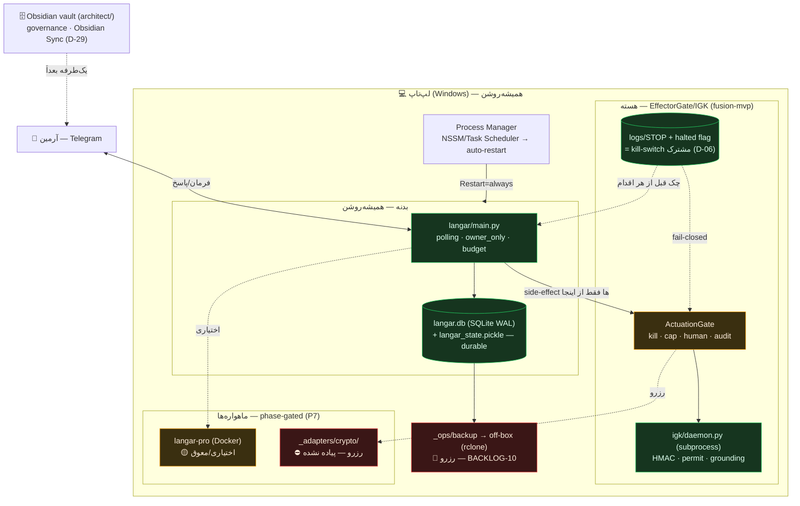

# LAPTOP RUNTIME — اجرای «همیشه‌روشن» روی لپ‌تاپ (نه VPS)

> **proposal.** طبق D-12 (اول لپ‌تاپ، اسموکِ ۷روزه، بعد VPS). fusion-mvpِ موجود **بازاستفاده** می‌شود به‌عنوان هستهٔ effector — نه بازنویسی از صفر.
> **قاب:** بقا-محور. هر انتخابِ runtime با «کدام کلاسِ شکست را زنده می‌ماند» توجیه شده (§۶).
> **این سند چیزی نصب/اجرا نکرد.** فقط نمودارِ اجرا + آناتومیِ دایرکتوری + «چطور روشن می‌شود».

---

## ۱. مدلِ اجرا — چه چیزهایی روی لپ‌تاپ می‌چرخند

چهار نقش، طبق D-24 (سه‌لایهٔ ناهمگام = یک سیستم):

| نقش | پروسه | چیست | وضعیت امروز |
|---|---|---|---|
| **بدنه (Body)** | `langar/main.py` (polling تلگرام) | تنها رابطِ انسان↔سیستم؛ SQLite v8، ~۵۰ فرمان، `halted` flag | ✅ زنده، `python main.py` |
| **هسته (Core/Effector)** | `fusion-mvp` + `igk/daemon.py` (subprocess) | EffectorGate/IGK: kill/cap/audit/grounding fail-closed | ✅ زنده ولی **جدا** از langar (G-10) |
| **پژوهش (Research)** | `langar-pro` (Docker: FastAPI+Postgres+Redis) | بک‌اندِ RAG؛ اختیاری/سنگین | 🟡 اسکلت، معوق (G-02/G-16) |
| **حاکمیت (Governance)** | Obsidian vault (`architect/`) | منبع حقیقت؛ سینک با Obsidian Sync (D-29) | ✅ همین vault |

**نکتهٔ کلیدیِ طراحی (بازاستفاده، نه از صفر):** بدنه (langar) side-effectهایش را باید از **EffectorGateِ هستهٔ fusion-mvp** عبور دهد. الان دو مکانیزمِ جدا دارند (langar: `halted` در DB؛ fusion: STOP + IGK). هدفِ runtime، **یکی‌کردنِ آن‌ها روی یک choke-point** است — این سیم‌کشی، milestoneِ فاز ۴ است (§۸).

---

## ۲. نمودارِ اجرا (تک‌لپ‌تاپ)



---

## ۳. آناتومیِ دایرکتوریِ نهایی (target)

merge-friendly: کدِ موجود دست‌نخورده؛ فقط سه پوشهٔ **افزودنی** (`_ops/`, `_adapters/`, `agent-outbox/`) به‌عنوان جای خالی. علائم: موجود ✅ / پیشنهادِ نو 🆕 / رزرو ⛔.

```
ai-farm/                              # ریشهٔ runtime (فعلاً زیرِ architect/_code/)
│
├── langar/                    ✅ بدنه — باتِ همیشه‌روشن
│   ├── main.py                       # نقطهٔ ورود (config→db→core→polling)
│   ├── bot.py  db.py  migrations.py  # ~۵۰ فرمان · SQLite v8 · halted flag
│   ├── core/ brain/ agents/ researcher/ safety/ observability/
│   ├── langar.db  langar_state.pickle   # state پایدار (روی دیسک)
│   └── .env                          # secretها (خارج از git)
│
├── fusion-mvp/                ✅ هسته — EffectorGate/IGK (بازاستفاده)
│   ├── src/  (orchestrator, budget, hitl, killswitch, tracing, ...)
│   ├── igk/  (kernel.py, daemon.py, client.py — کرنلِ جدا)
│   └── logs/STOP  logs/igk_state/    # kill-switch مشترک + audit امضاشده
│
├── langar-pro/                🟡 پژوهش — Docker (اختیاری، معوق)
│   └── app/ db/schema.sql docker-compose(.unified).yml
│
├── _ops/                      🆕 رزرو — عملیاتِ runtime (خالی، طراحی‌شده)
│   ├── process/                      # NSSM/Task-Scheduler/compose configs
│   ├── backup/                       # rclone off-box + restore test (BACKLOG-10)
│   └── secrets/                      # اشاره‌گرِ کلیدِ off-box (P10) — نه خودِ کلید
│
├── _adapters/                 🆕 رزرو — Tenant Adapters (read-only، D-25/G-11)
│   ├── accounting/                   # اولین adapter (BACKLOG-13)
│   ├── lead/                         # Lead-نقاشی (D-26)
│   └── crypto/                ⛔ جای خالیِ «وبِ رمزها/APIها» — پیاده نشده
│                                     #   قرارداد فقط: INFORM (D-10)، کلید off-box (P10)
│
└── agent-outbox/              🆕 رزرو — سینکِ یک‌طرفه به VPS بعداً (D-29)
```

> جداسازیِ vault: `architect/` (governance/Obsidian) از `ai-farm/` (کد) جداست. VPS **هرگز کل vault** را نمی‌گیرد؛ فقط `agent-outbox` (D-29، منشور §۶).

---

## ۴. چطور روشن می‌شود (boot sequence)

```
۰) روشن‌شدن/لاگینِ لپ‌تاپ
      ↓
۱) Process Manager (NSSM/Task Scheduler) بدنه را بالا می‌آورد:
      python langar/main.py
      ├─ config.validate(.env)  → اگر ناقص: exit(1) (fail-safe)
      ├─ db.init_db()           → SQLite v8 بازخوانده می‌شود (recover از دیسک)
      └─ چکِ kill-switch (halted flag + logs/STOP) پیش از سرویس‌دهی
            ├─ اگر STOP/halted فعال → بالا می‌آید در حالتِ HALTED (read-only، منتظر /resume)
            └─ وگرنه → app.run_polling() شروع
      ↓
۲) هستهٔ IGK: هر بار که اقدامِ حساس لازم شد، orchestrator یک
   igk/daemon.py را به‌صورت subprocess بالا می‌آورد؛ side-effect فقط با permitِ
   مصرف‌شده اجرا می‌شود (fail-closed).
      ↓
۳) jobهای روزانه: بازتابِ خودبهبودی ساعتِ ping_hour:30 (اگر داده کم باشد خودش رد می‌کند).
      ↓
۴) (رزرو) job بکاپِ ساعتی: rclone → off-box.
      ↓
۵) (اختیاری) اگر پژوهشِ سنگین لازم شد: docker compose up (langar-pro).
```

**recover بعد از کرش/خواب/ری‌استارت:** Process Manager با `Restart=always` بدنه را دوباره بالا می‌آورد → state از SQLite/pickle بازخوانده می‌شود → **kill-switch دوباره چک می‌شود (fail-closed)** → اقدامِ خطرناکِ نیمه‌تمام خودکار ادامه نمی‌یابد. این هستهٔ «بقای کلاسِ سخت‌افزار/میزبان» است (§۶).

---

## ۵. Process Manager — مقایسه و توصیه

روی لپ‌تاپِ ویندوز، `langar_bot.service` (systemd) کار نمی‌کند (مسیرهای Linux/ubuntu). سه گزینه:

| گزینه | Cost | Complexity | Auto-restart | Always-on (بدون لاگین) | ملاحظه |
|---|---|---|---|---|---|
| **NSSM** (سرویسِ ویندوزیِ native) | رایگان | ۳ | ✅ قوی | ✅ | `python main.py` را مستقیم می‌پیچد؛ سبک — **پیشنهادی برای هسته** |
| **Task Scheduler** (on-logon + restart) | رایگان | ۲ | 🟡 ضعیف‌تر | 🟡 وابسته به لاگین | داخلی، بدون نصب؛ برای شروعِ سریع |
| **Docker Desktop** (`restart: unless-stopped`) | رایگان* | ۶ | ✅ | ✅ (اگر Desktop اجرا شود) | compose آماده است؛ سنگین — برای langar-pro مناسب، نه هستهٔ سبک |

**توصیه (P7 = بودجهٔ پیچیدگی):**
- **هستهٔ همیشه‌روشن (langar + IGK) → NSSM** به‌صورت native و سبک.
- **langar-pro → Docker، فقط on-demand** (نه در بوتِ پیش‌فرض).
- این دقیقاً «۵ core همیشه‌روشن + satelliteهای phase-gated» است.

*Docker Desktop برای استفادهٔ شخصی رایگان است؛ vendor lock-in پایین (compose استاندارد).

---

## ۶. این runtime چطور سه کلاسِ شکست را زنده می‌ماند

| کلاسِ شکست | مکانیزمِ runtime | وضعیت |
|---|---|---|
| **منابع** | budget hard-stop (AU$30، D-25) + (رزرو) گاردِ اندازهٔ `langar.db-wal`/`audit.jsonl` روی دیسک | 🟡 بودجه فقط AILab (G-06) |
| **شبکه/API** | قطع اینترنت → polling صرفاً پیام نمی‌گیرد (بی‌کرش)؛ کلید نبود → **تنزلِ امن** (نه جعل). circuit-breaker = رزرو | 🟡 «تنزل به mock» باید به «سکوت/read-only» تبدیل شود |
| **سخت‌افزار/میزبان** | `Restart=always` + state پایدار روی دیسک + چکِ fail-closed در بوت + (رزرو) بکاپِ off-box | 🟡 auto-restart ✅، ولی **بکاپِ off-box هنوز نیست** (BACKLOG-10) |

> کلاسِ امنیت/یکپارچگی طبق تصمیمت باز نشد؛ لنگر: چرخشِ کلید (G-01) + fail-closed کردنِ IGK (G-10).

---

## ۷. جای خالیِ رزرو — «وبِ رمزها / APIها» (پیاده نمی‌شود)

پوشهٔ `_adapters/crypto/` یک **placeholderِ مستند** است، بدونِ کد:

- **قرارداد (فقط طراحی):** فقط `status()/report()/audit()` خواندنی؛ خروجیِ **INFORM** (تحلیل/گزارش)، اجرای مالی هرگز — **HARD_STOP** (D-10).
- **کلید:** هیچ private key روی لپ‌تاپ؛ signer **off-box + human co-sign** (P10, D-11).
- **چرا الان نه:** بدون trigger و بدون خطرِ اجرا، ساختش over-engineering است (منطقِ survival-filter، SURVIVAL-ARCHITECTURE §۶). جاش رزرو می‌ماند تا بعد.

---

## ۸. چه چیزی هنوز سیم‌کشی نشده (صادقانه)

1. **بدنه↔هسته (langar → EffectorGate/IGK):** الان جدا اجرا می‌شوند. یکی‌کردنِ side-effectها روی choke-pointِ fusion-mvp = **milestoneِ اصلیِ فاز ۴** (مرتبط با G-10).
2. **langar-pro:** به‌خاطر G-02 (مسیرِ LLM مرده) و G-16 (schema اغلب مرده) روی لپ‌تاپ فعلاً بالا نمی‌آید؛ معوق تا رفعِ آن‌ها.
3. **بکاپِ off-box:** بزرگ‌ترین حفرهٔ بقای این runtime؛ `_ops/backup/` خالی است (BACKLOG-10).
4. **NSSM/Task-Scheduler configs:** `_ops/process/` خالی؛ در فاز ۴ ساخته می‌شود.

---

## ۹. Next (آخرش بایست)

این سند proposal بود؛ هیچ فایلِ دیگری تغییر نکرد و چیزی نصب/اجرا نشد.

- **فاز ۴** — `BUILD-BACKLOG.md`: شکستنِ همین حفره‌ها به milestoneهای کدنویس. اولین (M0، کم‌ریسک، لوکال): **بستنِ fallbackِ بی‌صدای IGK + EffectorGateِ یکپارچه**، سپس بکاپِ off-box و گاردِ بودجهٔ سراسری.
