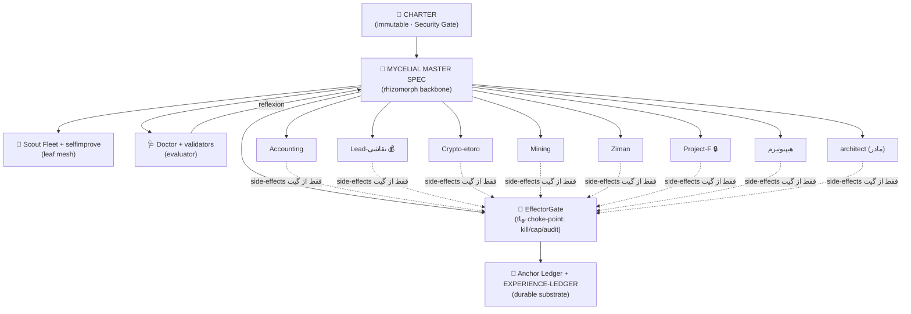

# MYCELIAL MASTER SPEC — ستون فقراتِ ساختِ سیستم (Build Spine) · v0.1

> **این سند رکنِ اصلیِ ساخت است (the rhizomorph backbone).** یک منبعِ‌حقیقتِ واحد که همهٔ ماژول‌ها/پروژه‌ها به آن وصل می‌شوند، هر ایجنتی که می‌خواندش آن را **نقد و بهترش می‌کند** (§7)، و ~۸۰٪ طراحی را قفل می‌کند تا **Fable 5** بیاید و ۲۰٪ باقی + خودِ ساخت را انجام دهد (§10).
>
> **متدولوژی:** Spec-Driven Development (SDD) — spec منبعِ حقیقت است، کد «جزئیاتِ پیاده‌سازیِ» آن. Living document؛ با هر تصمیم آپدیت می‌شود.
> **زیست‌الگو:** هندسهٔ بقای *Armillaria ostoyae* — یک موجودِ کلونالِ واحد که **کیلومترها** خاک را به‌صورت یک شبکهٔ leaderless و خودترمیم می‌پوشاند ([[MYCELIAL-ARCHITECTURE-vfinal]]). این همان «قارچیِ کیلومترها» است.
> **قیدِ حاکم:** تا §Security Gate باز نشود ([[ROTATION_CHECKLIST]])، همه‌چیز **propose-only** است. این سند چیزی را زنده نمی‌کند؛ **داربستِ بامبو** را می‌سازد.

---

## ۰. META — به ایجنتی که این را می‌خوانی (Read-Me-First)

تو (هر مدل/ایجنت، از جمله Fable 5) وقتی این سند را باز می‌کنی، **این نقش را داری:**

1. **این سند یک proposal است، نه وحی.** قبل از هر ساختی، آن را در برابر معیارهای پذیرشِ §9 و [[04 - Architect System/architect/ARCHITECT_CHARTER|CHARTER]] **نقد کن**.
2. **حلقهٔ خودبهبودیِ §7 را اجرا کن:** نقد → پیشنهادِ diff → ثبت در [[_memory/EXPERIENCE-LEDGER|EXPERIENCE-LEDGER]] → بالا بردنِ `version`.
3. **قواعدِ سختی که به ارث می‌بری (نقض‌ناپذیر):**
   - CHARTER برای ایجنت **immutable** است؛ خودت، مجوزهایت یا لایهٔ امنیت را تغییر نمی‌دهی.
   - **§Security Gate:** تا یک ردیفِ CRITICAL در [[ROTATION_CHECKLIST]] باز است، autonomy مؤثرِ همه = `read-only` (fail-closed).
   - **هیچ اقدامِ مخرب (delete/build/deploy) و هیچ اقدامِ مالی، بدون verdictِ انسانی + dry-run + نقطهٔ بازگردانی.** (§5)
   - در شک: **سکوت/read-only**، نه جعل (P8).
4. **صداقتِ استعاری (anti-metaphor):** هر ارجاعِ زیستی باید به یک مکانیزمِ مهندسیِ نام‌دار گره بخورد و `[G]` (مولّد) یا `[J]` (یادیار) برچسب بخورد. اگر مکانیزم ندارد، حذفش کن.

---

## ۱. CHARTER این سند (Problem · Goal · Constraints · Assumptions · Risks)

**Problem.** ماژول‌ها/پروژه‌ها (اندام‌های «فرانکنشتاین») ساخته یا نیمه‌ساخته‌اند ولی یک **ستونِ اتصالِ واحد** ندارند که از رویش build/test/delete شوند و خود سند هم رشد کند → drift میان اسناد و میان اسناد↔زمان‌بندِ زنده (دقیقاً یافتهٔ [[00 - Inbox/SYSTEM-STATE-2026-07-05|SYSTEM-STATE]]).

**Goal.** یک spec ماژولار، نسخه‌دار، خودبهبوددهنده که (الف) همهٔ پروژه‌ها را رسماً به یک ستون وصل کند، (ب) چرخهٔ امنِ build/test/delete بدهد، (ج) ۸۰٪ طراحی را قفل کند و ۲۰٪ + ساخت را به Fable 5 بسپارد.

**Non-Goals (عمداً بیرون).** فعال‌سازیِ autonomy · اجرای مالیِ زنده · چرخشِ اعتبارنامه‌ها (کارِ انسان) · L1-distributed و holobiont-ISR (over-engineering فعلی — [[SURVIVAL-ARCHITECTURE]] §۶).

**Constraints.** بودجهٔ API سخت = **AU$30/ماه** (D-25) · لوکال، Windows، تک‌میزبان ([[LAPTOP-RUNTIME]]) · تا rotation فقط کدِ لوکالِ read-only در **MOCK** · CHARTER و Property Schema حاکم‌اند.

**Assumptions (صریح — طبق قاعدهٔ «هرگز فرضِ خاموش»).**
- A1: «قارچیِ امیل کیلومترها» = مدلِ *Armillaria* که کیلومترها گسترده است (تأییدشده در [[MYCELIAL-ARCHITECTURE-vfinal]] و `armillaria_laccase_boltz`). اگر منظورِ دیگری داشتی، این فرض را اصلاح کن.
- A2: خروجیِ نهایی یک **سیستمِ نرم‌افزاریِ ایجنتی** است که ایجنت‌ها می‌خوانند و اجرا می‌کنند، نه سازهٔ فیزیکی.
- A3: «Fable 5 همه را می‌سازد» = Fable 5 نقشِ **builder** دارد؛ runtimeِ اجرا لزوماً Fable 5 نیست (§6).

**Risks + مهار.**
| ریسک | شدت | مهار (در همین spec) |
|---|---|---|
| delete/build بدون rollback (vault خارج از git) | 🔴 بالا | §5: dry-run + verdict + بکاپِ off-box (M5) پیش‌شرطِ فعال‌سازیِ delete |
| drift دوباره (سند↔زنده) | 🟡 | این سند تک‌منبع؛ §7 هر ایجنت را به آشتی با زمان‌بندِ زنده وادار می‌کند |
| هزینهٔ پنهانِ Fugu از سقف بزند | 🟡 | §6: Fugu فقط escalationِ پشتِ budget-gate، نه پیش‌فرض |
| biomimicry-as-decoration | 🟢 | برچسبِ [G]/[J] اجباری (§0.4) |

---

## ۲. معماریِ مایسیلیایی (Mycelial Architecture — the organism)

اندامِ واحد، بدونِ مغزِ مرکزیِ روی مسیرِ بحرانی؛ بقا از **ساختار**. نگاشتِ بارگذاری‌شده (نه تزئینی) روی همین vault:

| اندامِ قارچی | معادلِ مهندسی در این سیستم | G/J |
|---|---|---|
| موجودِ کلونالِ واحد، کیلومترها | یک هویت، چند node (این vault + fleet + بدنه) — CRDT/eventual-consistency | J |
| مِشِ بدون‌مرکز (mycelium) | ناوگانِ اسکات + اندامِ پروژه‌ها، هماهنگیِ leaf-levelِ P2P | J |
| بزرگراهِ رهیزومورف (rhizomorph) | **همین ستون (این spec) + EffectorGate**: backbone و priority-lane | J |
| آناستوموز (هم‌جوشیِ هایفی) | service-discovery / gossip / اتصالِ پروژه‌ها به ستون | J |
| سِپتا (دولیپور/پارِنتِزوم) | bulkhead / circuit-breaker میان دامنه‌ها (جداسازیِ خطا) | J |
| رشد به‌سوی منبع / پس‌کشیدن | **Physarum γ-knob**: مسیریابیِ تطبیقیِ توجه/بودجه میان پروژه‌ها | **G** |
| اندامِ میوه‌دهیِ گذرا (fruiting body) | خروجیِ deployِ هر پروژه: stateless روی substrateِ durable | J |
| خودترمیمیِ بی‌امان | bootstrap-watchdog + reconciliation ناوگان ([[05 - Agents/RATIFIED-TASKS|RATIFIED-TASKS]]) | J |

> **نکتهٔ استراتژیک (از تحقیقِ ۲۰۲۶):** مِشِ کاملاً leaderless «سخت‌ترین برای debug» است و supervisorِ متمرکز = SPOF. best-practiceِ production = **هیبرید: حاکمیتِ سلسله‌مراتبی + مِشِ محلی در برگ‌ها.** خوشبختانه خودِ *Armillaria* هیبرید است (رهیزومورفِ backbone + مِشِ محلی) → این سیستم هم: **ستون/CHARTER/EffectorGate = ستونِ حاکمیت**، **ناوگان و اندامِ پروژه‌ها = مِشِ برگ.**



---

## ۳. رجیستریِ اتصال (Connection Registry) — اتصالِ رسمیِ همهٔ پروژه‌ها

**این جدول = اتصالِ رسمی.** ستون همهٔ اندام‌ها را می‌شناسد؛ هر پروژه یک node با interfaceِ شفاف. (وضعیت/ریسک از [[00 - Inbox/SYSTEM-STATE-2026-07-05|SYSTEM-STATE]]؛ بات از [[05 - Agents/AGENT_REGISTRY|AGENT_REGISTRY]].)

| # | اندام (پروژه) | status/risk | autonomy مؤثر | بات (propose-only) | اتصال به ستون (nutrient/signal) | بلاکرِ فعلی |
|---|---|---|---|---|---|---|
| 1 | [[03 - Projects/Accounting/PROJECT\|Accounting]] | active/high | read-only ⛔ | accounting-clerk | اسکات `accounting` → دیجست → ledger | رجیستر انطباق خالی |
| 2 | [[03 - Projects/Lead-نقاشی/PROJECT\|Lead-نقاشی]] 💰 | active/medium | read-only ⛔ | lead-pipeline | اسکات `lead` · pipeline/weekly-report | چرخشِ ۵ کلید |
| 3 | [[03 - Projects/Crypto - etoro/PROJECT\|Crypto-etoro]] | active/critical | read-only ⛔ | crypto-watcher (→bounded-auto SELL طبقِ rule) | Portfolio Registry · exit_rules · alerts | کلیدِ exchange؛ بی‌مسیرِ اجرا |
| 4 | [[03 - Projects/Mining/PROJECT\|Mining]] | active/medium | read-only ⛔ | mining-deathwatch | اسکات `mining` · death-watch | چرخشِ عبارت‌بازیابی؛ سلامتِ نودها |
| 5 | [[03 - Projects/Ziman Galerry/PROJECT\|Ziman]] | active/low | read-only ⛔ | ziman-capacity-guard | Capacity & Channels · SLA | عددِ ظرفیت (by design) |
| 6 | [[03 - Projects/اونلی فنز/PROJECT\|Project-F]] 🔒 | active/high | read-only ⛔ | projectF-reporter (ماسکِ حریم) | فقط PROJECT.md · گزارشِ کدشده | GATE 0 + verdict «Persian/Sydney» |
| 7 | [[07 - Knowledge/هیپنوتیزم  و خودآگاهی/PROJECT\|هیپنوتیزم]] | active/low | read-only | knowledge-indexer | اسکات `hypnosis` · epistemic-tag | O-04 (دادهٔ لپ‌تاپ) |
| 8 | [[04 - Architect System/architect/PROJECT\|architect]] (مادر) | active/critical | read-only ⛔ | architect-researcher | **میزبانِ ستون**؛ Gate/Ledger/Doctor | گیت بسته؛ vault خارج از git |

**اندام‌های افقیِ مشترک (shared organs — سرویس‌های ستون):**

| اندام | فایل/محل | نقش | وضعیت |
|---|---|---|---|
| EffectorGate | `fusion-mvp/` + `igk/daemon.py` | تنها choke-pointِ side-effect (kill/cap/audit) | 🟡 فقط `finalize` را می‌بندد (G-10) |
| Anchor Ledger | DB `halted` + `audit.jsonl` | لاگِ تغییرناپذیرِ verdictها | 🟡 پیش‌نیازِ Phase 4 |
| Budget guard | `langar/budget.py` | سقفِ AU$30 + alert ۵۰/۸۰٪ | 🟡 فقط AILab (G-06) |
| Kill-switch | `halted` flag + `STOP` file | توقفِ سه‌سطحی (Pause/Kill/Revert) | ✅ |
| Scout Fleet | [[05 - Agents/AGENT_REGISTRY|registry]] | مِشِ ادراکِ برگ (۱۹ اسکات + ۶ selfimprove) | ✅ زنده (پشتِ گیت) |
| Doctor + validators | `04 - Architect System/scripts/` | Evaluator (frontmatter/link/health) | ✅ |

---

## ۴. پلنِ ساخت (Build Plan) — زنده‌کردنِ دست‌وپای فرانکنشتاین

طراحی ~۸۰٪ قفل است (این spec + interfaceها + DoDها). ساختِ واقعی = کارِ Fable 5. پلنِ milestone از [[BUILD-BACKLOG]] (M0..M8) گرفته و برچسب‌گذاری شده:

**داربستِ قفل‌شده (۸۰٪ — این spec تضمین می‌کند):** رجیستریِ اتصال (§3) · چرخهٔ امنِ lifecycle (§5) · طراحیِ مدل/حافظه/ابزار (§6) · پروتکلِ خودبهبودی (§7) · معیارهای پذیرش (§9) · و خودِ M0..M8 که هرکدام **فایلِ هدف + DoD + تستِ MOCK + پرامپتِ کدنویس** دارند (در [[BUILD-BACKLOG]]).

**۲۰٪ + ساخت → `[→F5]` (به Fable 5 سپرده):**

| کد | اندام ناقص | فایلِ هدف | DoD (خلاصه) | موج |
|---|---|---|---|---|
| `[→F5]` M0 | سبز کردنِ سوئیت | `fusion-mvp/src/evals.py` | سوئیت ۴۰/۴۰ · injection همچنان رد | ۱ |
| `[→F5]` M1 | fail-closedِ IGK | `orchestrator.py`+`config.py` | کرنل بالا نیامد → halt صریح | ۱ |
| `[→F5]` M2 | EffectorGateِ یکپارچه | `orchestrator.py`+`tools.py` | هر side-effect permit بگیرد | ۱ |
| `[→F5]` M3 | تنزلِ امن به‌جای جعل | `llm.py`+`config.py` | خروجیِ MOCK برچسبِ `[DEGRADED]` | ۱ |
| `[→F5]` M4 | بودجهٔ سراسری+دیسک | `langar/budget.py` | همهٔ callها زیرِ سقف؛ halt در AU$30 | ۲ |
| `[→F5]` M5 | **بکاپِ off-box + restore** | `_ops/backup/` | backup→restore→`integrity_check` سبز | ۳ (پیش‌شرطِ delete §5) |
| `[→F5]` M6 | observability | `langar/observability/tracer.py` | ۴ span واقعی در event_log | ۲ |
| `[→F5]` M7 | پنلِ واقعی | `fusion-mvp/src/panel.py` | رأی از providerِ واقعی، نه هیوریستیک | ۳ |
| `[→F5]` M8 | L1.5 stress-gate | `self_update.py` | promote فقط با نمره+سیگنالِ استرس | ۳ |

**تصمیم‌های طراحیِ بازِ ۲۰٪ (نیازمند Fable 5 یا verdict):** مکانیزمِ دقیقِ plane-separation enforcement · توپولوژیِ L3 mesh برای تستِ خودترمیمی · رفعِ G-02/G-16 برای احیای `langar-pro` · طراحیِ Tenant-Adapterِ Crypto (با D-10/P10). ترتیب: **موج۱ (fusion، کم‌ریسک) → موج۲ (بدنهٔ langar) → موج۳ (تابِ بقا).** هر milestone «آخرش می‌ایستد».

---

## ۵. چرخهٔ Build / Test / Delete (با guardrail) — «بتونیم حذف/بساز/تست کنیم»

این بخش خواستهٔ «delete/build/test» را به یک قابلیتِ **امن و برگشت‌پذیر** تبدیل می‌کند. ماشینِ حالت:

```
PROPOSE ──► DRY-RUN ──► [VERDICT انسانی] ──► APPLY(MOCK) ──► TEST ──► PROMOTE
   ▲                                                          │
   └──────────────────── ROLLBACK/REVERT ◄────────────────────┘   (STOP در هر لحظه = fail-closed)
```

**BUILD.** یک milestone در هر نوبت، در MOCK (بی کلید/شبکه/پول). خروجیِ کدنویس تا verdict فقط proposal. سبزیِ تست + Doctor/validators = گیتِ CI.

**TEST.** هر ماژول DoD + تستِ MOCK دارد (§4). گیتِ کیفیت: rubric ≥۱۲/۱۶ با judgeِ کورِ خانوادهٔ متفاوت + anti-Goodhart (گیت را «کف» بگیر، هدف نه) — طبق [[MYCELIAL-ARCHITECTURE-vfinal]] §۵/۷.

**DELETE (خطرناک‌ترین — سخت‌ترین گارد).**
1. **هرگز hard-delete نکن.** حذف = `mv` به `_Duplicates/` یا بکاپ، نه `rm` (برگشت‌پذیر by-default؛ طبق [[_PROJECT_INSTRUCTIONS|قانون اساسی]]).
2. **dry-run manifest اجباری:** فهرستِ دقیقِ آنچه پاک می‌شود، پیش از هر اقدام.
3. **verdictِ انسانیِ صریح** برای هر حذف.
4. **پیش‌شرطِ سخت:** تا **M5 (بکاپِ off-box)** ساخته و restore-tested نشده، قابلیتِ delete فعال نمی‌شود. (چون vault خارج از git است، این تنها rollbackِ واقعی است.)

**گاردهای سراسری.** `STOP`/`halted` = توقفِ آنی · §Security Gate روی همه‌چیز حاکم · timeout = DENY (D-13) · هیچ اقدامِ مالی خودکار.

---

## ۶. طراحیِ Agent / Tool / Model (برای پروژهٔ ایجنتی)

**انتخابِ مدل (Model Selection) — استراتژیِ توصیه‌شده.**

| نقش | مدل | چرا | هزینه/lock-in |
|---|---|---|---|
| **Builder** (می‌سازد و درست می‌کند) | **Fable 5** | همان نقشی که خواستی؛ ساختِ کد/رفعِ باگ | per-token؛ lock-in کم (spec قابل‌حمل) |
| **Runtimeِ ادراک/روتین** | Claude Haiku | ارزان؛ همین‌حالا در `askClaude` آرتیفکت wired | ارزان؛ lock-in کم |
| **Runtimeِ تحلیلِ سخت** | Claude Sonnet/Opus | تصمیمِ جهش، نقدِ معماری | متوسط |
| **Escalationِ اختیاری** | **Fugu (Sakana)** | چندایجنتی؛ فقط سخت‌ترین کارها | ⚠️ multiplierِ پنهانِ توکن؛ **پشتِ budget-gate** |

> **چرا Fugu پیش‌فرض نیست:** Fugu Ultra هر درخواست را پشت‌صحنه به چند مدل می‌دهد (ضریبِ ~۵–۱۵× توکن) → با سقفِ سختِ **AU$30/ماه** (D-25) خطرناک. ضمناً Fugu خودش Claude/Fable را صدا می‌زند، پس «Fugu یا Claude» دوگانهٔ مطلق نیست. **توصیه: Fable=سازنده، Claude=runtime، Fugu فقط escalationِ بودجه‌دار.** قیمت‌ها را build-time از vendor بخوان، hard-code نکن ([[MYCELIAL-ARCHITECTURE-vfinal]] §۶).

**Memory strategy (دوزمانه).** durable = append-only [[_memory/EXPERIENCE-LEDGER|EXPERIENCE-LEDGER]] + Anchor Ledger؛ volatile = scout-digestهای تبخیرشونده (TTL). مسیرِ بازیابی: FTS5 اول، بعد لایهٔ وکتور (طبق `_memory/REVIEW`). این همان قطبِ دوگانهٔ [[BIO-SYNTHESIS-MAP]] edge #13 است.

**Tool design.** EffectorGate = تنها دروازهٔ side-effect؛ هر `ToolGateway.call` قبل از اجرا permit می‌گیرد و مصرف می‌کند (fail-closed)؛ آداپترهای MOCK برای تست بی‌کلید.

**Cost / Monitoring / Eval (الزامِ پروژهٔ AI).** سقفِ AU$30 + alert ۵۰/۸۰٪ + cacheِ prefixِ ثابت · Monitoring: Anchor Ledger + tracer (M6) + Doctor + [[_memory/HEARTBEAT|HEARTBEAT]] · Eval: rubric ≥۱۲/۱۶، judgeِ کور، + DoDِ هر ماژول.

---

## ۷. پروتکلِ خودبهبودی (Self-Improvement) — «هر ایجنتی که می‌خواندش، خودش را بهتر کند»

الگوی canonicalِ ۲۰۲۶ = **Reflexion / Evaluator-Optimizer**: Actor تولید → Evaluator نمره → Self-Reflection درس را در حافظهٔ episodic می‌نویسد → دفعهٔ بعد باهوش‌تر. نگاشت روی این سیستم:

1. **READ** — این spec را به‌چشمِ proposal بخوان.
2. **CRITIQUE (Evaluator)** — در برابرِ §9 + CHARTER نقدِ **adversarial** کن: چه چیزی می‌شکند؟ چه چیزی over-engineer است؟ کجا با زمان‌بندِ زنده drift دارد ([[00 - Inbox/SYSTEM-STATE-2026-07-05|SYSTEM-STATE]])؟
3. **PROPOSE diff (Optimizer)** — نسخهٔ بهتر را با دلیل پیشنهاد بده؛ ارجاعِ زیستی را [G]/[J] بزن. **اعمال نکن.**
4. **LOG (Self-Reflection)** — یک ردیف در [[_memory/EXPERIENCE-LEDGER|EXPERIENCE-LEDGER]] (append-only) + `version` را در frontmatter بالا ببر (v0.1 → v0.2).
5. **GATE** — هیچ تغییرِ canonical/charter/task بدون verdictِ انسانی.

> **بلوکِ پرامپتِ قابل‌حمل (این را می‌توان به هر مدل داد):**
> ```text
> نقش: تو منتقدِ معمارِ این Build Spine هستی.
> ورودی: کلِ MYCELIAL-MASTER-SPEC.
> کار: (۱) در برابر §9 و CHARTER نقدِ adversarial کن؛ ۳ ضعفِ برتر را با blast-radius نام ببر.
> (۲) برای هرکدام یک diffِ مشخص و کم‌ریسک پیشنهاد بده (فایل/بخش/متنِ قبل→بعد).
> (۳) هر ارجاعِ زیستی را [G] مولّد یا [J] یادیار برچسب بزن؛ بی‌مکانیزم را حذف کن.
> (۴) drift با زمان‌بندِ زنده را فهرست کن.
> قیود: propose-only؛ CHARTER immutable؛ در شک سکوت. خروجی: diff + منطق + یک خط برای ledger. آخرش بایست.
> ```

---

## ۸. Trade-offs (نمره ۱–۱۰) — چرا این رویکرد

سه رویکرد برای «رکنِ ساخت»:

| رویکرد | Cost | Complexity | Scalability | Maintainability | Security | Time-to-Impl | مناسبِ |
|---|---|---|---|---|---|---|---|
| A) meta-promptِ غول‌پیکرِ واحد | 3 | 8 | 3 | 3 | 4 | 8 | پروژهٔ یک‌بارمصرف |
| **B) spec ماژولارِ SDD (این سند)** | **8** | **5** | **9** | **9** | **8** | **7** | **✅ اتصال به کل + build/test/delete** |
| C) runtime orchestrator زنده | 5 | 8 | 7 | 5 | 5 | 3 | وقتی ناوگان همزمان زنده کار می‌کند |

**توصیه: B (بالاترین ROI).** spec منبعِ حقیقت، کد مشتق؛ با الگوی CLAUDE.md/SDDِ همین vault جور است؛ نسخه‌دار و نقدپذیر. (C بعداً روی B سوار می‌شود، نه جایگزینش.)

---

## ۹. معیارهای پذیرش (Acceptance / DoD)

**برای این spec:** (۱) هر ۸ پروژه در §3 node دارند · (۲) هر آیتمِ `[→F5]` فایلِ هدف + DoD + تستِ MOCK دارد · (۳) مسیرِ delete بدونِ M5 مسدود است · (۴) صفر مقدارِ محرمانه/PII در متن · (۵) همهٔ wikilinkها resolve می‌شوند · (۶) validatorها سبز.

**برای هر ماژولِ متصل:** DoD در [[BUILD-BACKLOG]] + تستِ MOCK سبز + گیتِ rubric ≥۱۲/۱۶ + ثبت در Anchor Ledger.

---

## ۱۰. Handoff به Fable 5 (کارِ باز + verdictهای انسانی)

**Fable 5 می‌سازد (به‌ترتیب):** موج۱ M0→M1→M2→M3 (fusion، کم‌ریسک) → موج۲ M4,M6 (بدنهٔ langar) → موج۳ M5,M7,M8. هر milestone مستقل، MOCK، «آخرش بایست». + ۴ تصمیمِ طراحیِ بازِ §4.

**فقط انسان (آری) تصمیم می‌گیرد — ایجنت نمی‌تواند:**
1. **Security Gate:** lift رسمی (ویرایشِ دستیِ CHARTER §۲ + [[ROTATION_CHECKLIST]]) — تا این نشود همه‌چیز read-only می‌ماند.
2. **`git init` روی vault:** پیش‌شرطِ سختِ L2 + تنها rollbackِ واقعیِ SDD. (باز از جلسهٔ ۷.)
3. **DNA/PII (~۶۰MB×۲):** مقصدِ cold-storage + مجوزِ حذف از vault.
4. **wiring به هر PROJECT.md:** ✅ **اعمال شد (2026-07-05)** — بک‌لینکِ ستون بعد از H1 هر ۸ PROJECT.md درج شد (افزایشی/برگشت‌پذیر)؛ اتصالِ §۳ حالا دوطرفه است.
5. verdictهای بازِ [[00 - Inbox/SYSTEM-STATE-2026-07-05|SYSTEM-STATE]] §۵ (تسک‌های هسته، cron-drift، Radar).

---

## ۱۱. Changelog / Version

| version | تاریخ | تغییر | توسط |
|---|---|---|---|
| v0.1 | 2026-07-05 | ساختِ اولیه: ۸۰٪ داربست؛ §3 اتصالِ ۸ پروژه؛ §5 چرخهٔ امن؛ §7 حلقهٔ خودبهبودی؛ §10 handoff به Fable 5. | Cowork (P0-lineage) |
| v0.2 | — | *(اولین ایجنتِ خواننده: طبق §7 نقد کن، diff بزن، اینجا ثبت کن، version را بالا ببر.)* | — |

> **پایان.** این سند زنده است: هر عبور، طبق §7 یک درجه بهترش کن. هیچ‌چیز canonical بدون verdict تغییر نمی‌کند.

