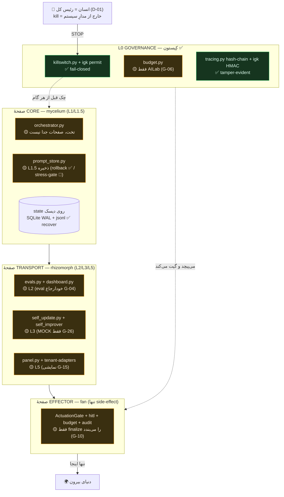

# SURVIVAL ARCHITECTURE — نگاشتِ «بقای Armillaria (v3)» به سیستمِ واقعی

> **این یک overlay است، نه معماریِ جدید.** لایه‌های بقای v3 روی همان ۵ core از [[SYSTEM-BLUEPRINT-v2]] §۲ می‌نشینند؛ v2 و منشور دست‌نخورده‌اند.
> **قاب:** ستون فقرات = بقا. هر لایه با «کدام کلاسِ شکست را زنده می‌ماند + با کدام مکانیزم» توجیه شده.
> **قرارداد معرفتی (از L-Survival-v3):** `established` (کد تست‌شده) / `partial` (نیمه‌سیم) / `missing` (نساخته). تعارض‌ها پنهان نمی‌شوند.
> **منبع حقیقت:** کد واقعی > سند. علائم: هست ✅ / نیمه 🟡 / نیست 🔴.

---

## ۰. کراکسِ ماجرا (از خودِ سندِ قارچ)

L-Survival-v3 §A یک جملهٔ کلیدی دارد: بقای Armillaria عمدتاً از **کم‌تغییری (conservatism)** است، نه ترمیمِ فعال. قارچ «شکست‌ناپذیر» نیست؛ **غیرمتمرکز، دیرپا، و زیرِ استرس می‌خوابد به‌جای اینکه فشار بیاورد.**

ترجمهٔ مهندسی برای ما: **بقا = fail-safe + دوامِ state + تنزلِ امن**، نه هوشِ بیشتر. این دقیقاً هم‌راستا با D-01 (انسان=رئیس) و P8 («در شک: سکوت») است. → هر چیزی که در این سند اضافه می‌کنیم **robustness است، نه autonomy**.

---

## ۱. نگاشتِ لایه‌به‌لایهٔ v3 → جزءِ واقعی

| لایهٔ v3 | نقشِ زیستی (قارچ) | جزءِ واقعیِ من (فایل) | وضعیت | شاهد / gap |
|---|---|---|---|---|
| **L0** kill-switch | اسپور/قطع هنگام استرس | `killswitch.py` (STOP+soft) + `igk/kernel.py` permit fail-closed + `halted` flag (D-06) | ✅ | ۳ تست سبز + redteam ۸/۸ |
| **L0** per-action cap | متابولیسمِ کراندار | `budget.py` (BudgetLedger، قطع خودکار) + AU$30 hard-stop (D-25) | 🟡 | فقط MVP/AILab را می‌پوشد (G-06) |
| **L0** tamper-evident audit | حافظهٔ دست‌نخورده | `tracing.py` (hash-chain) + `igk/kernel.py` (HMAC) | ✅ | تستِ صحت زنجیره + امضا |
| **EffectorGate** (کِیستون) | تنها نقطهٔ side-effect (fan) | `igk/client.py::ActuationGate` + `hitl.py` + `budget.py` + `tracing.py` | 🟡 | **فقط `finalize`ِ no-op را می‌بندد؛ call‌های واقعی LLM/tool از permit نمی‌گذرند** (G-10) |
| EffectorGate — anomaly-gate | تشخیصِ محلیِ تهدید | `guardrails.py` (کیورد ساده) | 🔴 | سیگنالِ anomaly واقعی وجود ندارد که گیت را تغذیه کند |
| **L1** core توزیع‌شده (secret-share، کلید/حافظهٔ غیرمحلی) | mycelium بی‌مرکز | — (تک‌process، تک‌لپ‌تاپ، کلید لوکال) | 🔴 | تک‌میزبان؛ off-box key فقط طراحی (P10, D-11) |
| **L1.5** stress-gated reserve (LOH-analog) | ذخیرهٔ هتروزیگوسِ نهفته | `prompt_store.py` (نسخه‌دار + rollback) | 🟡 | ذخیره هست، ولی promotion **امتیازی** است نه **استرس‌گِیتد** |
| **L2** syndrome monitoring | anomaly/eval بی‌توقفِ mission | `evals.py` + `dashboard.py` + Langfuse hook | 🟡 | eval خودارجاع (G-04)؛ `@trace` در langar مرده (G-08) |
| **L3** self-healing (قانونِ Physarum) | reinforce/recycle/reconnect | `self_update.py` (fix + rollback خودکار) + `core/self_improver.py` (وزن، زندهٔ روزانه) | 🟡 | فقط prompt/وزن؛ **MOCK** اثبات (G-26)؛ ترمیمِ توپولوژی نیست |
| **L5** holobiont / helper-mesh + ISR | ensembleِ اورکستره + ایمنیِ القایی | `orchestrator.py` + `panel.py` + قراردادِ Tenant-Adapter (v2 §۲) | 🟡 | پنل **نمایشی** (G-15)؛ meshِ دامنه‌ای نساخته (G-11)؛ ISR نیست |
| **Compute-on-machinery** (Boltz-analog) | وارسیِ جزء پیش از deploy | eval-gate + `igk` grounding + ۳۹ تستِ سبز + canary (D-28) | 🟡 | canary طراحی؛ digital-twin/formal نه |
| **Planes** core/transport/effector | جداسازیِ سه‌صفحه | orchestrator تخت؛ effector ≈ ActuationGate | 🔴 | صفحات به‌صراحت جدا نیستند |

**جمع‌بندیِ نگاشت:** L0 (حاکمیت) قوی‌ترین و تقریباً کامل است؛ EffectorGate و L1.5/L2/L3/L5 **نیمه‌سیم**؛ L1 توزیع‌شده و جداسازیِ صفحات **نساخته**.

---

## ۲. سازمان‌دهیِ بقا حول سه کلاسِ شکست

برای هر کلاس: کدام لایه دفاع می‌کند، مکانیزم (fail-safe / self-heal / recover)، حفرهٔ فعلی، و حکمِ بقا.

### کلاس ۱ — منابع (اتمام بودجه، حلقهٔ فراریِ هزینه، پرشدنِ دیسک)

- **لایه‌های دفاع:** L0 per-action cap (`budget.py` → `BudgetExceeded` → قطع خودکار) + سقف AU$30 (D-25) + $60/ماه (v2 §۵).
- **مکانیزم:** **fail-safe** — عبور از سقف = پرتاب استثنا و halt، نه ادامه.
- **حفره:** بودجه فقط مسیرِ MVP/AILab را می‌پوشد (**G-06**)؛ call‌های روزانه/researcher/pro خارج از حساب‌اند. هیچ گاردِ **پرشدنِ دیسک** (رشدِ `langar.db-wal`/`audit.jsonl`) نیست.
- **حکم:** 🟡 **نیمه‌زنده** — فراریِ هزینه در مسیرِ MVP گرفته می‌شود، ولی سقفِ **سراسری** enforce نیست و دیسک بی‌گارد است.
- **کمینه‌کارِ بقا:** گسترشِ `BudgetLedger` به همهٔ call‌ها + alert پلکانی ۵۰٪/۸۰٪ + گاردِ اندازهٔ دیسک/WAL. (= BACKLOG-03)

### کلاس ۲ — شبکه و API بیرونی (قطع اینترنت، outage/rate-limit کلود)

- **لایه‌های دفاع:** L1 fallback — `llm.py` (بدون کلید → MOCK)، `providers.py`/`brain_router` (anthropic→openai-compat→offline).
- **مکانیزم:** **graceful degradation** — به‌جای کرش، به مسیرِ جایگزین می‌افتد.
- **حفره (مهم):** «افتادن به MOCK» در production یعنی **تولیدِ پاسخِ ساختگیِ بی‌صدا** — این تنزل هست ولی **امن نیست**؛ با P8 («در شک: سکوت») تعارض دارد. + هیچ **circuit-breaker/retry** روی outageِ API نیست (FM-2، BACKLOG-17).
- **حکم:** 🟡 **نیمه‌زنده** — نمی‌کرشد، ولی «تنزل به mock» یک ریسکِ صحت است، نه بقای امن.
- **کمینه‌کارِ بقا:** تعریفِ **حالتِ تنزلِ امن** = read-only/سکوت به‌جای جعل + circuit-breaker با backoff. (نگاشت به L1.5/L2)

### کلاس ۳ — سخت‌افزار / میزبان (قطع برق، کرش، OOM، ری‌استارتِ لپ‌تاپ)

- **لایه‌های دفاع:** دوامِ state روی دیسک — SQLite WAL (`langar.db`)، `audit.jsonl` (append-only)، `prompts.json`، `igk` audit + `.kernel_key`. + `langar_bot.service` (systemd → auto-restart).
- **مکانیزم:** **recover** — state بعد از ری‌استارتِ تمیز بازخوانده می‌شود؛ سرویس دوباره بالا می‌آید.
- **حفره (بزرگ‌ترین حفرهٔ بقا):**
  1. **بکاپِ off-box + restore تستی وجود ندارد** (BACKLOG-10) → مرگِ دیسک = نابودیِ کامل. قارچ «حافظهٔ دیرزی در خاک» دارد؛ ما یک نسخه بیشتر نداریم.
  2. اجرای **میان‌کار** checkpoint نمی‌شود (run در حافظه است) → کرشِ وسطِ کار = گم‌شدنِ آن اجرا (durable execution/journaling در v2 معوق، D-15).
  3. روی لپ‌تاپ (D-12) ممکن است systemd فعال نباشد.
- **حکم:** 🟡 **نیمه‌زنده** — state از ری‌استارتِ تمیز جان‌به‌در می‌برد، ولی **بدونِ بکاپِ off-box هیچ تابِ خرابیِ دیسک ندارد** و اجرای میان‌کار بازیابی‌پذیر نیست.
- **کمینه‌کارِ بقا:** بکاپِ ساعتیِ off-box (rclone) + **یک restoreِ واقعیِ تستی** + auto-restart تأییدشده روی لپ‌تاپ.

> **کلاسِ امنیت/یکپارچگی** (لو رفتنِ کلید، self-updateِ مخرب، دستکاری) طبقِ تصمیمِ تو **باز نشد**؛ از قبل لنگر خورده: چرخشِ کلید (**G-01**/ROTATION) و fail-closed کردنِ IGK (**G-10**). فقط ارجاع — این سند بازش نمی‌کند.

---

## ۳. کارتِ امتیازِ بقا (۵+۱)

| # | خاصیتِ بقای قارچ | معادلِ مهندسی | وضعیت | حفرهٔ مسدودکننده |
|---|---|---|---|---|
| ۱ | mycelium بی‌مرکز | No-SPOF / decentralization | 🔴/🟡 | پنل نمایشی (G-15) + تک‌میزبان (L1) |
| ۲ | خوابِ ایمن هنگام کمبود | dormancy / تنزلِ امن | 🟡 | read-only enforce نیست (G-25) + تنزل به mock ناامن |
| ۳ | متابولیسمِ تنظیم‌شده | budget homeostasis | 🟡 | بودجه فقط AILab (G-06) |
| ۴ | بازتولید از قطعه | self-heal + rollback | 🟡 | فقط MOCK اثبات (G-26) |
| ۵ | حافظهٔ دیرزی در خاک | durable backup/restore | 🔴 | بکاپِ off-box نیست (BACKLOG-10) |
| **+۱** | **خطرِ خاص** | **fallbackِ بی‌صدا** | 🔴 | اگر کرنلِ IGK بالا نیاید، **بی‌صدا به cooperative برمی‌گردد** (G-10 بند ۳) — عکسِ fail-closed |

مورد **+۱** خطرناک‌ترین است چون «قارچی است که هنگام آسیب، در سکوت محافظش را خاموش می‌کند». اولین چیزی که باید بسته شود.

---

## ۴. دیاگرامِ سه‌صفحه (نگاشت به فایل‌های واقعی)

---

## ۵. v3 چه چیزی اضافه می‌کند که فعلاً نیست

| افزودهٔ v3 | چرا برای بقا مهم است | آیا buildable امروز؟ |
|---|---|---|
| **EffectorGate یکپارچه** (تنها choke-pointِ enforced) | الان kill/cap/audit پخش‌اند و ActuationGate واقعی گیت نمی‌کند (G-10) | ✅ بله — consolidation، نه اختراع. **بالاترین ROI.** |
| **L1.5 stress-gated promotion** (LOH-analog) | ذخیرهٔ نسخهٔ دوم که فقط زیرِ استرس، به‌اندازهٔ شدتِ تهدید فعال شود | 🟡 نیمه — روی `prompt_store` + feature-flag که gateش سیگنالِ L2 است |
| **L3 Physarum self-healing** (reinforce/recycle/reconnect) | ترمیمِ **توپولوژی/مسیر**، نه فقط prompt | 🟡 نیمه — نیازمند یک mesh که ترمیم شود (فعلاً mesh نیست) |
| **L5 holobiont ISR** (تشخیصِ محلی → سخت‌سازیِ سراسری) | ایمنیِ القاییِ اکوسیستمی؛ الان helperها سیگنالِ ایمنی رد و بدل نمی‌کنند | 🔴 speculative فعلاً — بعد از mesh واقعی |
| **Compute-on-machinery** (digital-twin/canary پیش از deploy) | وارسیِ جزءِ حیاتی پیش از استقرار (Boltz در ~۴۷ ثانیه ساختار داد) | 🟡 نیمه — canary D-28 طراحی؛ eval/تست هست |
| **جداسازیِ صفحات** core/transport/effector | side-effect فقط از یک نقطه؛ core هرگز مستقیم اثر نمی‌گذارد | ✅ بله — بازچینشِ orchestrator |
| **L1 توزیع‌شده** (secret-share، کلید غیرمحلی) | mycelium بی‌مرکز، بی‌SPOF | 🔴 **سنگین** — پایین ببین |

---

## ۶. توصیه (منطقِ survival-filter خودِ v3)

L-Survival-v3 §C صراحتاً می‌گوید: **«v3 فقط برای auto-executionِ high-stake توجیه دارد؛ برای low-stake، over-engineering است. EffectorGate بی‌قید توصیه می‌شود.»**

سیستمِ تو الان **تک‌اپراتوره، لپ‌تاپ‌محور، و عمدتاً read-only** (Security Gate بسته، D-01). پس:

**بساز (ROI بالا، هم‌راستا با backlog):**
1. **EffectorGate یکپارچه** + بستنِ fallbackِ بی‌صدای IGK (کارت +۱) — کِیستون.
2. سه کمینه‌کارِ بقا برای سه کلاسِ شکست: بودجهٔ سراسری (G-06)، تنزلِ امن به‌جای mock (کلاس ۲)، بکاپِ off-box + restore (کلاس ۳، BACKLOG-10).
3. جداسازیِ صفحات + stress-gated promotion (L1.5) روی زیرساختِ موجود.

**فعلاً نساز (over-engineering برای این مقیاس):**
- **L1 توزیع‌شدهٔ کامل** (secret-sharing، multi-host) و **L5 holobiont ISR** — تا وقتی auto-executionِ high-stake و ≥۲ میزبان نداشته باشی، هزینه‌اش توجیه ندارد. جاشان در طرح **رزرو** می‌ماند.

**Trade-off (۱–۱۰، از v3):** v3 کامل → Security ۹، Scalability ۹، ولی Complexity ۲ و Time ۲ (یعنی سخت و کند). مسیرِ پیشنهادی = **EffectorGate + سه کمینه‌کار**: Security ~۸، Complexity ~۶، Time ~۷ — بیشترِ سودِ بقا با کسری از هزینه.

---

## ۷. هشدارِ ایمنی (نباید گم شود)

L-Survival-v3 §C خودش هشدار می‌دهد: **همان خواصی که قارچ را ریشه‌کن‌ناپذیر می‌کنند، یک AIِ misaligned را هم بادوام می‌کنند** (dormancy، detox-into-fuel، اینوکولومِ عمیق). پس:

- هر سخت‌سازیِ بقا باید **kill-switch و human-gate را مرکزی نگه دارد**، نه ضعیف. EffectorGate دقیقاً همین کار را می‌کند (kill/human در قلبِ choke-point).
- این‌ها **robustness‌اند، نه intelligence و نه autonomy**. بقا ⟂ خودمختاری. D-01 و منشور بالادست می‌مانند.
- «kill-switchِ تنها کافی نیست» → دفاعِ لایه‌ای (L0..L5) + مهارِ محیطی، نه یک تک‌قفل.

---

## ۸. Next (آخرش بایست)

این سند **proposal/overlay** است؛ هیچ فایلِ دیگری تغییر نکرد. قدمِ بعدی طبق پلن:

- **فاز ۳** — `LAPTOP-RUNTIME.md`: آناتومیِ اجرا روی لپ‌تاپ با بازاستفاده از fusion-mvp به‌عنوان هسته + رزروِ جای L1-توزیع‌شده.
- **فاز ۴** — `BUILD-BACKLOG.md`: شکستنِ همین حفره‌ها به milestoneهای کدنویس، با M0 = EffectorGate یکپارچه + بستنِ fallbackِ بی‌صدا (کم‌ریسک‌ترین، لوکال).
