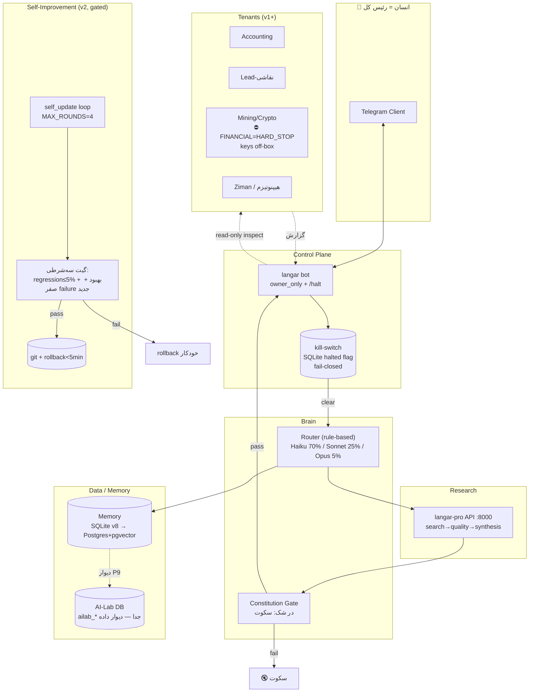

# SYSTEM BLUEPRINT v1 — architect (لایهٔ مادر)

> **منبع حقیقت واحد.** سنتز ۱۰۰٪ vault (اسناد `01`–`04`، سه Master Export، کد واقعی `_code/ai-farm`) طبق [[PROMPT-A-absorb-synthesize]].
> قانون حل تناقض: **کد واقعی > سند جدیدتر > سند قدیمی‌تر**. جزئیات هر تصمیم در [[DECISIONS]]، حفره‌ها در [[GAPS]]، مرجع کامل فایل‌به‌فایل در `_meta/knowledge-inventory.md`.
> هدف سند: کسی که فقط همین را بخواند، بتواند کل سیستم را بفهمد و بسازد.

---

## ۱. هدف، اصول طراحی، Non-goals

### هدف

یک سیستم agentic «همیشه‌روشن» برای **یک اپراتور تک‌نفره** (آرمین، سیدنی) که:

1. **محقق/طراح** — تحقیق خودکار و بهبود تدریجی خودِ سیستم (فقط در سطح prompt/skill، هرگز weight) — منبع: [[PROJECT]]، AI-Lab در کد `_code/ai-farm/AI-sume/langar/ailab.py`
2. **کنترل‌پلین** — بازرسی و کنترل همهٔ پروژه‌ها (Accounting، Crypto، Mining، Lead-نقاشی، Ziman، هیپنوتیزم) از طریق Telegram — منبع: [[PROJECT]]، [[03 - Projects/Lead-نقاشی/AiFarm-Lead/SERVER_ARCHITECTURE|SERVER-ARCHITECTURE]]

**تصحیح مهم نسبت به [[PROJECT]]:** «رئیس کل» نرم‌افزار نیست — **انسان است**. تصمیم نهایی چت مادر: «کلید اجرا همیشه دست انسان» ([[architect-chat-export]] ~خط 6751). نرم‌افزار فقط جمع‌آوری، تحلیل و پیشنهاد می‌دهد؛ هر action برگشت‌ناپذیر gate انسانی دارد.

### اصول طراحی (غیرقابل مذاکره)

| # | اصل | منبع |
|---|------|-------|
| P1 | Human-gate روی هر action برگشت‌ناپذیر؛ autonomy matrix چهارسطحی، `final = max(autonomy_floor, safety_result)` | [[10-research-safety-governance]] |
| P2 | Fail-closed همه‌جا: kill-switch باید قبل از هر action چک شود؛ timeout = DENY | [[10-research-safety-governance]]، `fusion-mvp/src/killswitch.py` |
| P3 | Constraints خارج از context مدل (gateway/kernel)، نه داخل prompt — compaction آن‌ها را می‌خورد | [[12-research-failure-modes-blind-spots]] |
| P4 | هر self-edit = git commit + eval gate + rollback < ۵ دقیقه؛ سطح C (weight update) ممنوع | [[07-research-self-improvement-loops]]، [[14-research-theoretical-foundations]] |
| P5 | Isolation سخت per-tenant (schema جدا، credential جدا)؛ هیچ framework ای این را default نمی‌دهد | [[06-research-memory-architecture]] |
| P6 | Measure-first: هیچ optimization قبل از instrument کردن هزینه/کیفیت | [[11-research-cost-infra-routing]] |
| P7 | MVP-first: ~۵ جزء، نه ~۱۵ — red-team ثابت کرد ظرفیت یک نفر ~۵ جزء است | [[AI-FARM-MASTER-EXPORT]] (حملهٔ #۸) |
| P8 | «در شک: سکوت» — خروجی مشکوک حذف می‌شود، نه اصلاح | `langar-pro/app/research/constitution.py`، [[سیستم-همیشه-روشن-پرامپت-و-دستورالعمل]] |
| P9 | دیوار داده: دادهٔ شخصی (HRV/دفترچه) بدون اجازه وارد AI-Lab یا tenantها نمی‌شود | [[architect-chat-export]]، جداول `ailab_*` در `langar/db.py` |
| P10 | هیچ private key کریپتو روی VPS/سیستم agentic — signer کاملاً off-box با human co-sign | [[LANGAR-MASTER-EXPORT]]، [[10-research-safety-governance]] |

### Non-goals (صریحاً نمی‌سازیم)

- ❌ Weight update / fine-tune خودکار (سطح C) — خط قرمز ([[14-research-theoretical-foundations]]؛ ردِ fine-tune در [[architect-chat-export]] ~خط 4571)
- ❌ اجرای trade خودکار — FINANCIAL = HARD_STOP؛ فقط تحلیل و پیشنهاد ([[10-research-safety-governance]])
- ❌ CrewAI / AutoGen / microservice / k8s در این فاز ([[13-research-framework-landscape]]، [[03 - Projects/Lead-نقاشی/AiFarm-Lead/SERVER_ARCHITECTURE|SERVER-ARCHITECTURE]])
- ❌ Wilson score، execution rings، hash-chain برای MVP — «governance تئاتری برای یک نفر» ([[AI-FARM-MASTER-EXPORT]] بخش red-team؛ hash-chain فقط در فاز v2 برای audit مالی برمی‌گردد)
- ❌ A2A protocol، Temporal، OPA (allowlist table کافی است)، Letta، Graphiti — تا trigger مشخص ([[05-research-shared-engineering-lane]]، [[06-research-memory-architecture]])
- ❌ Self-host مدل زیر ۵۰M توکن/ماه ([[11-research-cost-infra-routing]])

---

## ۲. معماری کلان

### کامپوننت‌ها (۵ جزء core + ۲ satellite، طبق P7)

1. **Telegram Bot (langar)** — تنها رابط انسان↔سیستم. `owner_only` (غریبه = سکوت مطلق)، ~۵۰ فرمان، kill-switch `/halt` در SQLite. — کد: `_code/ai-farm/AI-sume/langar/bot.py`
2. **Brain + Router** — انتخاب مدل rule-based (نه LLM): ساده→Haiku، متوسط→Sonnet، پیچیده→Opus؛ زنجیرهٔ fallback anthropic→openai-compat→offline بدون crash. — کد: `langar/brain/providers.py`، `langar/brain/brain_router.py` (نوشته شده، هنوز wire نشده — [[GAPS]])
3. **Research Engine (langar-pro)** — FastAPI + Postgres/pgvector: search → source_quality (امتیاز ۰–۱۵) → uncertainty → synthesis → constitution gate. — کد: `langar-pro/app/research/engine.py`
4. **Memory** — الان: SQLite ۲۳جدولی (v8)؛ هدف v2: Postgres + pgvector + Mem0 OSS با isolation per-tenant. — کد: `langar/core/memory.py`، [[06-research-memory-architecture]]
5. **Safety Kernel** — constitution (گیت خروجی) + kill-switch + PatchManager (سطح ۳ عمداً `NotImplementedError`) + الگوی IGK از fusion برای v2. — کد: `langar/core/constitution.py`، `langar/safety/patch_manager.py`، `fusion-mvp/igk/kernel.py`

Satellite ها:

6. **Self-Improvement Lab** (فاز v2) — الگوی اثبات‌شدهٔ `fusion-mvp/self_update.py` (promotion gate + rollback + نسخه‌بندی PromptStore) با eval واقعی به‌جای rubric کیواژه‌ای
7. **Tenant Adapters** — هر پروژه (Accounting و…) یک adapter جدا با credential و schema جدا؛ registry مرکزی `projects.yaml` ([[03 - Projects/Lead-نقاشی/AiFarm-Lead/SERVER_ARCHITECTURE|SERVER-ARCHITECTURE]])

### دیاگرام جریان داده

### مرزها

- **Trust boundary ۱:** Telegram ↔ bot — فقط `OWNER_ID`؛ بات‌های تلگرام E2E ندارند، پس هیچ secret در چت رد نمی‌شود ([[architect-chat-export]] ~خط 2808).
- **Trust boundary ۲:** سیستم ↔ tenantها — bot به tenantها **read-only** بازرسی می‌کند؛ هر write از مسیر deploy gate شده ([[03 - Projects/Lead-نقاشی/AiFarm-Lead/SERVER_ARCHITECTURE|SERVER-ARCHITECTURE]]: «AI فقط از طریق repo، نه SSH»).
- **Trust boundary ۳:** دادهٔ وب (تحقیق) ↔ instruction — بلاک `<external_data>` + sanitize؛ ورودی وب هرگز instruction نمی‌شود ([[12-research-failure-modes-blind-spots]]).
- **Trust boundary ۴:** کریپتو — کلیدها روی هیچ ماشین agentic نیستند (P10).

---

## ۳. حافظه

### وضعیت واقعی کد (ground truth)

سه لایه در `langar/core/memory.py`:

| لایه | طراحی | وضعیت واقعی |
|------|--------|---------------|
| L1 short-term | dict در RAM | موجود ولی هیچ producer ای ندارد — عملاً خالی |
| L2 structured | SQLite: ۷ log آخر + ۵ reflection آخر → context سؤال روزانه | ✅ تنها لایهٔ زنده |
| L3 semantic | HybridRetriever: BM25 (k1=1.5, b=0.75) + TF-IDF cosine، fusion min-max با α=0.5، top-k=3، فارسی‌آگاه | پیاده شده ولی **هیچ call-site در runtime ندارد** (dormant) |

نکته: `ARCHITECTURE.md` کد می‌گوید «لایه ۳ غیرفعال/vector» — واقعیت: پیاده‌سازی محلی بدون embedding کامل موجود است. کد > سند ([[DECISIONS]] D-07).

### معماری هدف (v2) — از [[06-research-memory-architecture]]

- تاکسونومی CoALA: Working / Episodic / Semantic / Procedural
- **یک Postgres واحد + pgvector + Mem0 OSS**؛ isolation با `user_id = project_name` + schema-per-tenant (P5)
- **Procedural memory = CLAUDE.md/SKILL.md per-project** — دست‌کم‌گرفته‌شده؛ filesystem ساده ۷۴٪ می‌زند
- Episodic verbatim برای دفترچه (write-once verdict — الگوی موجود در `langar/db.py`: `AlreadyJudged` + `verdict_log` append-only)
- Cascade سرریز context: compress tool-output → sliding window → LLM summarization (آخرین راه)
- Graphiti+FalkorDB فقط اگر factهای temporal لازم شد؛ Letta فقط برای agent چندروزه — فعلاً نه

### مسیر مهاجرت

1. **v1:** همان SQLite + وصل‌کردن HybridRetriever موجود به `/research` و سؤال روزانه (کد آماده است، فقط call-site می‌خواهد)
2. **v2:** Postgres+pgvector (همین الان در `docker-compose.unified.yml` هست: `pgvector/pgvector:pg15`) + Mem0؛ مهاجرت L2 با اسکریپت یک‌باره

---

## ۴. حلقهٔ خودبهبودی

### دو پیاده‌سازی موجود در کد

**الف) ACE loop** — `langar/core/ace.py` (قاعده‌محور، بدون LLM):
- Reflector: نرخ شکست per-label از جدول Outcome ها
- Curator: گیت‌ها `MIN_SAMPLES=5`، `MIN_LABEL_SAMPLES=3`، `FAILURE_RATE_GATE=0.3` → تولید playbook-diff به‌صورت `improvement_report(pending)`
- `applied_automatically=False` همیشه — اعمال فقط با تأیید انسان
- ⚠️ وضعیت: **حلقه هرگز در runtime صدا زده نمی‌شود** — هیچ producer ای برای Outcome نیست ([[GAPS]] G-03)

**ب) حلقهٔ fusion-mvp** — `fusion-mvp/self_update.py` (تنها حلقهٔ **اثبات‌شده در اجرا**: نمره 0.6→0.8→1.0 و rollback خودکار — [[LANGAR-MASTER-EXPORT]] ~خط 3583):
- فقط متن system prompt؛ حداکثر `MAX_ROUNDS=4`
- score → propose_fix → گیت guardrail (`validate_prompt`: طول 20–2000، حفظ نشانهٔ نقش، denylist ۹عبارتی injection) → promotion فقط اگر `new_score > score` → PromptStore نسخه‌دار با active-pointer و rollback
- ⚠️ ضعف شناخته‌شده: `score_prompt` کیواژه‌ای و optimizer خودارجاع = Goodhart by construction ([[GAPS]] G-04)

### طراحی هدف (سنتز کد + [[07-research-self-improvement-loops]] + [[14-research-theoretical-foundations]])

1. **سطح‌بندی:** A (in-context reflection) = الان؛ B (skill library با gate) = v2؛ C (weight) = **ممنوع همیشه**
2. **هر skill/prompt پیشنهادی = proposal** → عبور از **گیت سه‌شرطی کمّی** ([[09-research-evaluation-observability]]):
   - regression روی anchor set (۵۰–۱۰۰ case دستی) ≤ ۵٪
   - بهبود متریک هدف روی held-out **unseen** (ضد gaming)
   - صفر failure category جدید
3. pass → git commit (هرگز مستقیم به main)؛ fail → rejected-buffer برای یادگیری
4. **شرط توقف:** MAX_ROUNDS=4 (از کد fusion) + قانون توقف PROMPT-B (دو دور متوالی بهبود < 0.5)
5. **مرز مطلق:** حلقه هرگز به policy gate، kill-switch، secrets، مسیر مالی دست نمی‌زند (`FORBIDDEN_IN_PROMPT` در کد + [[AI-FARM-MASTER-EXPORT]])
6. **Judge بین‌خانواده‌ای:** داور از خانوادهٔ مدل production نباشد (Gemini برای Claude)؛ kappa ≥ 0.7 با انسان روی ≥۵۰ case
7. شروع حلقه فقط با ≥۵۰ trajectory واقعی per-project؛ cold-start محدودیت نظری است نه bug ([[14-research-theoretical-foundations]])

---

## ۵. روتینگ مدل و هزینه

### وضعیت واقعی کد

- انتخاب مدل = factory استاتیک در startup: `BRAIN_PROVIDER` → Anthropic (`claude-haiku-4-5-20251001` hardcode، max_tokens=300) یا OpenAI-compat (`deepseek-reasoner`) یا Offline (بانک سؤال) — `langar/brain/providers.py`
- `BrainRouter` (tier: simple/react/plan/deliberate + downgrade امن هنگام اتمام بودجه) نوشته و تست شده ولی **wire نشده** ([[GAPS]] G-05)
- Budget فقط در AILab enforce می‌شود: $1/روز، $30/ماه — `langar/budget.py`؛ بقیهٔ مصرف خارج از حسابداری ([[GAPS]] G-06)

### طراحی هدف — [[11-research-cost-infra-routing]]

- Router **rule-based** (نه LLM). توزیع هدف: ~۷۰٪ Haiku / ۲۵٪ Sonnet / ۵٪ Opus → کاهش ۴۰–۸۶٪
- دو lever اصلی: **prompt caching (۹۰٪ تخفیف)** + routing؛ Batch API (۵۰٪) برای کارهای async؛ استک هر دو ≈ ۲۵٪ نرخ استاندارد
- قیمت‌های مرجع (ژوئن ۲۰۲۶): Opus 4.8 = $5/$25، Sonnet 4.6 = $3/$15، Haiku 4.5 = $0.80/$4، DeepSeek = $0.14/$0.28 (فقط batch غیرحساس؛ برای production ماینینگ ممنوع — uptime)
- «cheaper per token ≠ cheaper per task» — routing تهاجمی فقط با eval gate، وگرنه retry هزینه را بدتر می‌کند ([[12-research-failure-modes-blind-spots]])
- Circuit breaker سه‌سطحی: per-action / per-run / daily — الگوی موجود: `fusion-mvp/src/budget.py` (global $0.50، per-agent $0.10–0.20، max ۳ call/agent)
- زیرساخت: VPS Hetzner CX22 (~€4.35/ماه) یا معادل ~AUD 35–70/ماه ([[03 - Projects/Lead-نقاشی/AiFarm-Lead/SERVER_ARCHITECTURE|SERVER-ARCHITECTURE]])؛ self-host مدل: نه (زیر آستانه)

### بودجهٔ عملیاتی v1 (سقف‌ها در allowlist table، نه در prompt — P3)

| قلم | سقف |
|-----|-----|
| API روزانه (کل) | $3/روز، alert در ۷۰٪ |
| هر run | $0.50 (الگوی fusion) |
| ماهانه کل | $60 hard-stop → halt خودکار + پیام تلگرام |
| Mining tenant | $50/روز cap تحلیل، صفر دلار execution (HARD_STOP) |

---

## ۶. ایمنی و Governance

### لایه‌ها (execution → policy → audit، از [[10-research-safety-governance]])

**۱. Autonomy matrix** — `action_policy(tenant_id, domain, max_amount, requires_approval, hard_stop)` در DB (allowlist table، نه OPA):

| سطح | معنی | مثال |
|------|------|------|
| AUTONOMOUS | بدون تأیید | خواندن log، تولید گزارش |
| INFORM | اجرا + اطلاع | تحقیق وب، تحلیل |
| APPROVE_FIRST | منتظر تأیید تلگرام | ارسال ایمیل/پست، deploy |
| HARD_STOP | هرگز | هر action مالی، حذف داده، تغییر policy |

قانون ترکیب: `final = max(autonomy_floor, safety_result)`. حل پارادوکس HARD_STOP ماینینگ ([[DECISIONS]] D-10): تحلیل/گزارش آزاد، **execution مالی هرگز** — نه HITL real-time (غیرعملی برای یک نفر).

**۲. Kill-switch** — تصمیم یکسان‌سازی ([[DECISIONS]] D-06): دو مکانیزم موجود در کد ادغام می‌شوند:
- منبع حقیقت: flag `halted` در DB (`/halt` و `/resume` فقط OWNER_ID) — الگوی langar
- mirror فایلی `STOP` برای processهای غیر-bot (الگوی fusion، fail-closed: نبود دسترسی به DB = halt)
- چک اول هر handler و هر call مدل؛ تست ماهانه؛ timeout = DENY

**۳. Constitution** — گیت روی هر خروجی قبل از ارسال. واقعیت کد: از «۱۴ قانون» فقط ۴ الگوی regex enforce می‌شود (پزشکی، علیت بی‌hedge، نشخوار، عادی‌سازی خودتخریبی) — بقیه aspirational ([[GAPS]] G-07). ناقض → جایگزینی با خروجی امن یا سکوت (P8).

**۴. Self-modification governance** — بخش ۴ + PatchManager: سطح ۱/۲ فقط diff در `patches/` با تأیید انسان؛ سطح ۳ (کد core) عمداً `NotImplementedError` — `langar/safety/patch_manager.py`

**۵. Audit** — MVP: `verdict_log` append-only + event_log (باید فعال شود — G-08)؛ v2 برای مسیر مالی/deploy: hash-chain (الگوی `fusion-mvp` audit sha256) و در صورت نیاز HMAC-signed (الگوی `igk/kernel.py` — کلید فقط داخل kernel process، fail-closed permit با nonce یک‌بارمصرف و انقضای ۳۰s)

**۶. Secrets** — SOPS + age، رمزشده داخل git ([[03 - Projects/Lead-نقاشی/AiFarm-Lead/SERVER_ARCHITECTURE|SERVER-ARCHITECTURE]])؛ gitleaks در CI. ⚠️ همین حالا سه `.env` واقعی + `langar.db` + IP واقعی VPS در repo/backup نشت کرده‌اند — اولین آیتم BACKLOG ([[GAPS]] G-01).

**۷. ورودی خارجی** — هر دادهٔ وب داخل `<external_data>` + sanitize + log hash؛ MCP tool results هم validate می‌شوند نه فقط input ([[08-research-tool-interoperability]] — MCPTox: رد <۳٪ حملات).

**۸. Compliance** — EU AI Act از 2026-08-02 binding؛ log retention ≥۶ ماه ([[10-research-safety-governance]]).

---

## ۷. کنترل‌پلین Telegram + استقرار VPS

### Telegram (کد موجود: `langar/bot.py`)

- `owner_only`: پیام غیر از `OWNER_ID` = سکوت مطلق (نه حتی error)
- فرمان‌های هسته: `/halt`، `/resume`، `/status` (دو تای آخر از halt معاف‌اند)، `/research`، لاگ روزانه، verdict write-once
- v1 اضافه می‌کند (از [[03 - Projects/Lead-نقاشی/AiFarm-Lead/SERVER_ARCHITECTURE|SERVER-ARCHITECTURE]]): `/deploy <project>`، `/logs <project>`، `/kill <project>`، `/kill --all` — همه APPROVE_FIRST و با audit
- Userbot (Telethon) اگر لازم شد: ایزوله، least-privilege، **هرگز برای کنترل زیرساخت**

### VPS ([[03 - Projects/Lead-نقاشی/AiFarm-Lead/SERVER_ARCHITECTURE|SERVER-ARCHITECTURE]] v1.0، 2026-06-30)

- یک VPS واحد (Ubuntu، Hetzner CX22 4GB یا Oracle Free ARM) با Docker Compose؛ **GitHub منبع حقیقت**؛ ufw فقط SSH؛ پورت DB بسته
- سرویس‌ها: Traefik (TLS/routing با label) · `stackctl` (CLI: up/down/restart/status/logs/deploy/kill) · Telegram control bot · Uptime Kuma + Dozzle
- Repoها: `infra-control` (مغز) · `brushline`/Lead-نقاشی · `mono-misc`؛ registry: `projects.yaml`
- **قرارداد deploy:** push به main → tests → gitleaks → build → GHCR → webhook → `stackctl deploy` → health-check → rollback خودکار + alert تلگرام
- استک فعلی قابل‌استقرار: `docker-compose.unified.yml` = bot + api (:8000، تنها پورت host) + db (pgvector:pg15) + redis (فعلاً بلااستفاده)
- ⚠️ باگ‌های شناخته‌شدهٔ deploy که v1 باید ببندد: requirements.txt langar-pro کتابخانهٔ anthropic/openai ندارد → مسیر LLM در Docker مرده؛ `one-liner-vps-setup.sh` سورس را نمی‌آورد؛ تضاد pg15/pg16 ([[GAPS]] G-02)
- **تصمیم ترتیب:** اول لپ‌تاپ (smoke ۷ روزه) بعد VPS ([[LANGAR-MASTER-EXPORT]] — تصمیم کاربر)

---

## ۸. ارزیابی و Observability

از [[09-research-evaluation-observability]] + وضعیت کد:

- **Eval سه‌لایه:** L1 outcome / L2 trajectory (مهم‌ترین) / L3 component؛ چهار span: model_call، tool_call، reasoning، handoff
- **استک:** OpenTelemetry (OpenLLMetry) + **MLflow** self-host روی همان Postgres. Langfuse نه (acquisition توسط ClickHouse، ژانویه ۲۰۲۶ + ۵+ سرویس) — این تصمیم، توصیهٔ قدیمی‌تر [[05-research-shared-engineering-lane]] را override می‌کند ([[DECISIONS]] D-04)
- **LLM-as-judge:** خانوادهٔ متفاوت از مدل production؛ kappa ≥ 0.7 با انسان روی ≥۵۰ case؛ sample ۵–۲۰٪ + ۱۰۰٪ خطاها
- **Anchor set:** ۵۰–۱۰۰ case دستی؛ ماهانه +۱۰ production failure؛ anchor ثابت + رشد (نه rotation)
- **Drift:** eval هفتگی؛ افت ≥۵٪ → investigate؛ >۱۰۰ run/روز → daily + alert
- **Silent failure:** pass@1 واقعیت را ۲۰–۴۰٪ overestimate می‌کند → spot-check هفتگی ۱۰ خروجی توسط انسان ([[12-research-failure-modes-blind-spots]])
- **وضعیت کد:** `observability/tracer.py` + event_log ساخته شده ولی هیچ تابعی `@trace` ندارد → `/events` خالی ([[GAPS]] G-08). v1: فعال‌سازی روی چهار span.
- Monitoring عملیاتی: Uptime Kuma (health) + Dozzle (logs) + alert تلگرام؛ بکاپ روزانهٔ DB خارج از VPS

---

## ۹. نقشهٔ اجرا: MVP → v1 → v2

> Build order از [[LANGAR-MASTER-EXPORT]]: tenancy+secrets اول؛ orchestration پیچیده نه؛ self-improvement آخر. افق کل: ~۳–۵ ماه part-time.

### MVP (فاز ۰) — «باتِ زنده روی لپ‌تاپ» (۱–۲ هفته)

Scope: langar bot + SQLite + سؤال روزانه + `/research` (با fallback آفلاین) + kill-switch.

- پاک‌سازی نشت secrets (rotate کلیدها، حذف `.env` و `langar.db` از repo، اضافه به .gitignore) — G-01
- اجرای اسموک ۷ روزه روی لپ‌تاپ؛ تست عملی `/halt` و `/resume`
- بکاپ روزانهٔ SQLite به مقصد خارج از ماشین

**معیار «تمام»:** ۷ روز uptime بدون crash؛ kill-switch در تست واقعی زیر ۵ ثانیه اثر کرد؛ یک restore واقعی از بکاپ انجام شد.

### v1 — «استقرار + سیم‌کشی مغز» (۳–۶ هفته)

1. رفع باگ‌های deploy (requirements langar-pro، pg15، اسکریپت setup) — G-02
2. استقرار `docker-compose.unified.yml` روی VPS + ufw + بکاپ خودکار + Uptime Kuma/Dozzle
3. wire کردن BrainRouter به مسیر پیام (کد آماده) + گسترش budget به **همهٔ** callهای LLM — G-05/G-06
4. فعال‌سازی tracer روی چهار span + داشبورد MLflow حداقلی — G-08
5. وصل HybridRetriever به `/research` (کد آماده) — G-03
6. anchor set ۵۰ case دستی + اولین baseline eval
7. فرمان‌های `/deploy`، `/logs`، `/status` برای tenant اول (Accounting — کم‌ریسک‌ترین)

**معیار «تمام»:** pipeline سبز push→deploy→health→rollback در یک تست واقعی؛ ۱۰۰٪ callهای LLM در budget و trace دیده می‌شوند؛ گزارش هفتگی هزینه در تلگرام؛ baseline eval ثبت شده.

### v2 — «خودبهبودی gated + چند-tenant» (۲–۳ ماه)

1. حلقهٔ self-improvement با الگوی fusion ولی eval واقعی: گیت سه‌شرطی + held-out unseen + judge بین‌خانواده‌ای (بخش ۴)
2. `GROUNDING_REQUIRED=True` با held-out واقعی (بستن خلأ IGK — `fusion-mvp/config.py`)
3. مهاجرت حافظه به Postgres+pgvector+Mem0 با schema-per-tenant (بخش ۳)
4. onboard کردن tenantهای بعدی: Lead-نقاشی → Ziman → Mining (فقط تحلیل، HARD_STOP مالی)
5. MCP gateway به‌عنوان chokepoint واحد — فقط وقتی trigger رسید: «≥N action/روز روی ≥۲ tenant» ([[DECISIONS]] D-05)
6. audit hash-chain برای مسیر مالی/deploy

**معیار «تمام»:** یک دور کامل self-improvement روی یک نقش با گیت سه‌شرطی pass شد و بهبود روی unseen ثابت ماند؛ ۳+ tenant فعال با isolation تست‌شده (تلاش cross-tenant read باید fail شود)؛ گزارش ماهانهٔ drift.

### پیش‌نیاز داده (یادآوری cold-start)

حلقهٔ خودبهبودی بدون ≥۵۰ trajectory واقعی شروع نمی‌شود؛ گلوگاه واقعی از روز اول **جمع‌آوری دادهٔ کار واقعی** است، نه زیرساخت ([[05-research-shared-engineering-lane]] If-I'm-wrong، [[AI-FARM-MASTER-EXPORT]]).

---

## پیوست: نگاشت vault به ساختار کلان

این vault (`04 - Architect System/architect`) مغز است؛ پروژه‌های تحت نظارت در `backup/03 - Projects/` زندگی می‌کنند (Accounting، Crypto-etoro، Lead-نقاشی، Mining، Ziman Gallery، اونلی فنز، هیپنوتیزم — طبق اسکرین‌شات ساختار، 2026-07-03). Adapterهای tenant (بخش ۲) به همین فولدرها/repoهای متناظرشان وصل می‌شوند. جزئیات دقیق‌تر خارج از دسترس این vault است → [[GAPS]] G-11.

---

*ساخته‌شده در اجرای PROMPT-A، 2026-07-03. نسخهٔ بعدی فقط با PROMPT-B (red-team) ساخته می‌شود — این فایل دست‌نخورده می‌ماند.*

## مرتبط

<!-- Tier A · CONNECTIONS-MAP (_memory) · اعمال 2026-07-04 -->
- [[03 - Projects/Accounting/Accounting|Accounting]]
- [[03 - Projects/Lead-نقاشی/Lead-نقاشی|Lead-نقاشی]]
- [[03 - Projects/اونلی فنز/اونلی فنز|اونلی فنز]]
