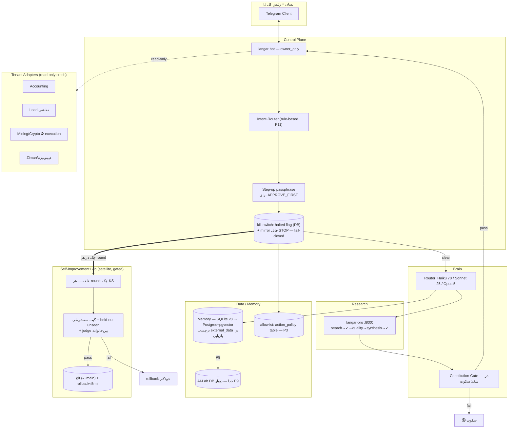

# SYSTEM BLUEPRINT v2 — architect (لایهٔ مادر)

> **منبع حقیقت واحد.** v1 + اعمال کامل یافته‌های تأیید مستقل (~۵۷ ادعای چک‌شده) و red-team (نمرهٔ ۵.۷/۱۰). تغییرات در [[CHANGELOG]]؛ اقدام‌ها در [[BACKLOG]]؛ تصمیم‌ها در [[DECISIONS]]؛ حفره‌ها در [[GAPS]]. v1 دست‌نخورده باقی است.
> قانون حل تناقض: **کد واقعی > سند جدیدتر > سند قدیمی‌تر**.

---

## ۱. هدف، اصول طراحی، Non-goals

### هدف

یک سیستم agentic «همیشه‌روشن» برای **یک اپراتور تک‌نفره** (آرمین، سیدنی) که:

1. **محقق/طراح** — تحقیق خودکار و بهبود تدریجی خودِ سیستم (فقط سطح prompt/skill، هرگز weight مدل) — [[PROJECT]]، `_code/ai-farm/AI-sume/langar/ailab.py`
2. **کنترل‌پلین** — بازرسی و کنترل پروژه‌ها (Accounting، Crypto، Mining، Lead-نقاشی، Ziman، هیپنوتیزم) از طریق Telegram — [[PROJECT]]، [[03 - Projects/Lead-نقاشی/AiFarm-Lead/SERVER_ARCHITECTURE|SERVER-ARCHITECTURE]]

**«رئیس کل» = انسان.** نرم‌افزار جمع‌آوری/تحلیل/پیشنهاد می‌دهد؛ هر action برگشت‌ناپذیر gate انسانی دارد ([[architect-chat-export]] ~خط 6751).

### اصول طراحی (غیرقابل مذاکره)

| # | اصل | منبع |
|---|------|-------|
| P1 | Human-gate روی هر action برگشت‌ناپذیر؛ autonomy matrix چهارسطحی، `final = max(autonomy_floor, safety_result)` | [[10-research-safety-governance]] |
| P2 | Fail-closed: kill-switch قبل از هر action **و هر round حلقهٔ خودبهبودی** چک می‌شود؛ timeout = DENY | [[10-research-safety-governance]]، `fusion-mvp/src/killswitch.py` |
| P3 | Constraints خارج از context مدل (allowlist table / kernel)، نه داخل prompt | [[12-research-failure-modes-blind-spots]] |
| P4 | هر self-edit = git commit + eval gate + rollback < ۵ دقیقه؛ سطح C ممنوع | [[10-research-safety-governance]] (SLA، خط ~313)، [[LANGAR-MASTER-EXPORT]]؛ چارچوب سطح‌ها: [[07-research-self-improvement-loops]]، [[14-research-theoretical-foundations]] |
| P5 | Isolation per-tenant (schema + credential جدا)؛ **توجه: schema-جدا روی یک Postgres = isolation منطقی، نه failure-domain جدا** — جبران با بکاپ off-box (بخش ۷) | [[06-research-memory-architecture]]، red-team v1 محور ۴ |
| P6 | Measure-first: هیچ optimization قبل از instrument | [[11-research-cost-infra-routing]] |
| P7 | **بودجهٔ پیچیدگی: ۵ جزء core همیشه‌روشن**؛ satelliteها phase-gated اند و جزء بودجهٔ همیشه‌روشن حساب نمی‌شوند | [[AI-FARM-MASTER-EXPORT]] (حملهٔ #۸) |
| P8 | «در شک: سکوت» | `langar-pro/app/research/constitution.py`، [[سیستم-همیشه-روشن-پرامپت-و-دستورالعمل]] |
| P9 | دیوار داده: دادهٔ شخصی بدون اجازه وارد AI-Lab/tenantها نمی‌شود | [[architect-chat-export]]، جداول `ailab_*` در `langar/db.py` |
| P10 | هیچ private key کریپتو روی ماشین agentic؛ signer off-box + human co-sign | [[LANGAR-MASTER-EXPORT]]، [[10-research-safety-governance]] |
| P11 | **(جدید در v2)** هیچ LLM در مسیر فرمان: نگاشت متن→فرمان rule-based است؛ ورودی ناشناخته → درخواست فرمان صریح | red-team v1 (S1)، الگوی BrainRouter regex |

### Non-goals

بدون تغییر نسبت به v1: ❌ weight update/fine-tune خودکار · ❌ اجرای trade خودکار (FINANCIAL=HARD_STOP) · ❌ CrewAI/AutoGen/k8s · ❌ Wilson/rings/hash-chain عمومی در MVP · ❌ A2A/Temporal/OPA/Letta/Graphiti تا trigger · ❌ self-host مدل زیر ۵۰M توکن/ماه. (منابع در [[SYSTEM-BLUEPRINT-v1]] §۱.)

---

## ۲. معماری کلان

### کامپوننت‌ها — ۵ core همیشه‌روشن + satellites (P7)

1. **Telegram Bot (langar)** — تنها رابط انسان↔سیستم. `owner_only` (غریبه=سکوت)، ~۵۰ فرمان، kill-switch `/halt`. **جدید v2: (الف) Intent-Router rule-based** — نگاشت متن آزاد فارسی/انگلیسی به فرمان/adapter با regex (الگوی موجود `brain_router.py`)؛ نگاشت‌نشدنی → «فرمان صریح بده»؛ **(ب) Step-up auth**: هر فرمان APPROVE_FIRST/مخرب (`/deploy`، `/kill`، تغییر بودجه) passphrase دوم می‌خواهد (دفاع در برابر session hijack/SIM-swap — red-team محور ۲). — کد پایه: `langar/bot.py`
2. **Brain + Router** — rule-based: ساده→Haiku، متوسط→Sonnet، پیچیده→Opus؛ fallback anthropic→openai-compat→offline. `BrainRouter` موجود، wire آن آیتم BACKLOG-04. — `langar/brain/providers.py`، `langar/brain/brain_router.py`
3. **Research Engine (langar-pro)** — FastAPI+Postgres/pgvector: search → source_quality (۰–۱۵) → uncertainty → synthesis → constitution. **جدید v2: دو checkpoint میانی** (schema-check بعد از source_quality، sanity-check ارزان بعد از synthesis) — دفاع FM-1 error compounding (0.95^20=36٪، [[12-research-failure-modes-blind-spots]]). پل bot↔pro: `langar/pro_client.py` (timeout 8s، fallback به researcher محلی) — در v1 جا افتاده بود. — `langar-pro/app/research/engine.py`
4. **Memory** — الان SQLite ۲۳جدولی (v8)؛ هدف Postgres+pgvector+Mem0 (بخش ۳). **جدید v2:** محتوای وب‌منشأ هنگام **بازیابی** هم برچسب `<external_data>` نگه می‌دارد (دفاع persistence-poisoning، FM-3).
5. **Safety Kernel** — constitution + kill-switch + PatchManager (سطح ۳ عمداً `NotImplementedError`) + allowlist table + الگوی IGK برای v2. — `langar/core/constitution.py`، `langar/safety/patch_manager.py`، `fusion-mvp/igk/kernel.py`

Satelliteها (phase-gated، نه همیشه‌روشن): **۶. Self-Improvement Lab** (v2-فاز، بخش ۴) · **۷. Tenant Adapters** (قرارداد پایین).

### قرارداد Tenant Adapter (جدید v2 — بستن G-11 در سطح طراحی)

هر tenant در `projects.yaml` ثبت می‌شود با: `name`، `repo`، `autonomy_floor`، `budget_subcap`، `adapter`. هر adapter فقط این interface خواندنی را expose می‌کند: `status()`، `logs(n)`، `report(period)`، `audit()` — **با credential جداگانهٔ read-only** (ادعای read-only باید enforced باشد نه قراردادی — red-team محور ۲). هر write فقط از مسیر deploy pipeline گیت‌شده (D-20). Crypto/Mining: adapter فقط دادهٔ عمومی/گزارش محلی می‌خواند؛ کلید هیچ‌جا (P10).

### دیاگرام جریان داده (v2)

### مرزها (Trust boundaries)

۱. **Telegram↔bot:** `OWNER_ID` + step-up passphrase برای فرمان مخرب؛ هیچ secret در چت (بات‌ها E2E ندارند — [[architect-chat-export]] ~خط 2808). ۲. **سیستم↔tenant:** بازرسی با creds read-only جدا؛ write فقط repo+deploy gate ([[03 - Projects/Lead-نقاشی/AiFarm-Lead/SERVER_ARCHITECTURE|SERVER-ARCHITECTURE]]). ۳. **دادهٔ وب↔instruction:** `<external_data>` + sanitize + log hash، در نوشتن **و بازیابی** ([[12-research-failure-modes-blind-spots]]). ۴. **کریپتو:** کلید off-box (P10).

---

## ۳. حافظه

بدون تغییر ساختاری نسبت به v1 §۳ (وضعیت سه‌لایه: L1 خالی، L2 SQLite زنده، L3 HybridRetriever dormant — `langar/core/memory.py`، `langar/core/retrieval.py`؛ هدف: CoALA چهارلایه، Postgres+pgvector+Mem0، procedural=CLAUDE.md/SKILL.md، cascade سرریز — [[06-research-memory-architecture]]).

**اضافات v2:**
- برچسب‌گذاری provenance: هر رکورد memory فیلد `origin` دارد (`user`/`web`/`self_generated`)؛ رکوردهای `web` در بازیابی داخل `<external_data>` می‌آیند (FM-3 persistence).
- مسیر مهاجرت همان است؛ **RPO/RTO حافظه در بخش ۷ عددی شد** (red-team S3).

---

## ۴. حلقهٔ خودبهبودی

### سه پیاده‌سازی موجود در کد (v1 دو تا را می‌گفت — تأیید مستقل سومی را یافت)

| # | ماژول | چه می‌کند | وضعیت |
|---|--------|-----------|--------|
| الف | `langar/core/ace.py` — ACE loop | Reflector/Curator قاعده‌محور؛ گیت‌ها MIN_SAMPLES=5، MIN_LABEL_SAMPLES=3، FAILURE_RATE_GATE=0.3؛ همیشه `applied_automatically=False` | dormant — بدون producer برای Outcome (G-03) |
| ب | `fusion-mvp/self_update.py` | حلقهٔ prompt-only، `MAX_UPDATE_ROUNDS=4`، گیت `validate_prompt` (طول 20–2000، denylist ۹عبارتی)، promotion فقط `new_score>score`، PromptStore نسخه‌دار + rollback | **فقط در MOCK اجرا شده**؛ scorer کیواژه‌ای = Goodhart (G-04، G-15) |
| ج | `langar/core/self_improver.py` | تنظیم خودکار وزن دامنه‌ها (bounded، MIN_DATA=7، clamp) — تنها self-improvement ای که الان واقعاً هر روز اجرا می‌شود (job 8:30) | زنده؛ فقط وزن داخلی، نه prompt/کد |

⚠️ ابهام واژگانی ثبت‌شده (G-24): قانون ۱۲ constitution کد می‌گوید «تغییر خودکار فقط وزن» — منظور `agent_weights` داخلی است، نه weight مدل؛ با Non-goal سطح C تعارض ندارد ولی نام‌گذاری باید در کد اصلاح شود.

### طراحی هدف (بدون تغییر منطق نسبت به v1، + دو enforcement جدید)

1. سطح A الان؛ B در v2-فاز با gate؛ C ممنوع همیشه ([[07-research-self-improvement-loops]]، [[14-research-theoretical-foundations]])
2. **گیت سه‌شرطی کمّی:** regression روی anchor (۵۰–۱۰۰ case) ≤۵٪ + بهبود متریک روی held-out **unseen** + صفر failure category جدید ([[09-research-evaluation-observability]])
3. pass → git commit (هرگز main)؛ fail → rejected-buffer
4. توقف: `MAX_UPDATE_ROUNDS=4` + دو دور متوالی بهبود <۰.۵ ([[PROMPT-B-test-improve]])
5. مرز مطلق: policy gate/kill-switch/secrets/مسیر مالی دست‌نخوردنی (`FORBIDDEN_IN_PROMPT`)
6. Judge بین‌خانواده‌ای (Gemini برای Claude)؛ kappa ≥0.7 روی ≥۵۰ case
7. شروع فقط با ≥۵۰ trajectory واقعی (D-17)
8. **جدید v2 (red-team محور ۵):** چک kill-switch (`halted` + `STOP`) در **ابتدای هر round** و **قبل از هر git commit** — حلقهٔ فراری نمی‌تواند بین halt و commit کاری بکند.
9. **جدید v2:** گیت ساختاری prompt از denylist به **allowlist ساختار** ارتقا می‌یابد (denylist ۹عبارتی paraphrase‌پذیر است — red-team محور ۲)؛ + سهم ~۲۵٪ از anchor set هر فصل refresh می‌شود (ضد overfit تدریجی، FM-10) — بخش ثابت هسته می‌ماند (D-18).
10. **پیش‌شرط LIVE:** هیچ دور LIVE قبل از وجود `held_out.json` واقعی (BACKLOG-11) — «اثبات ۰.۶→۰.۸→۱.۰» فقط MOCK بود و اعتبار promotion ندارد.

---

## ۵. روتینگ مدل و هزینه

### وضعیت واقعی کد

مثل v1: مدل استاتیک `claude-haiku-4-5-20251001` (max_tokens=300) با fallback؛ `BrainRouter` unwired (G-05)؛ budget فقط AILab (G-06) — `langar/brain/providers.py`، `langar/budget.py`.

### قیمت‌های مرجع — با تفکیک منبع (اصلاح v2)

| مدل | قیمت in/out per M | منبع |
|------|-------------------|-------|
| Opus 4.8 | $5 / $25 | [[11-research-cost-infra-routing]] |
| Sonnet 4.6 | $3 / $15 | [[11-research-cost-infra-routing]] |
| Haiku **3.5** | $0.80 / $4 | [[11-research-cost-infra-routing]] (جدول قیمت) |
| Haiku **4.5** (مدل واقعی کد) | **در اسناد vault نیست** — قبل از تخمین نهایی verify شود (G-23) | `providers.py` + D-08 |
| DeepSeek | $0.14 / $0.28 — فقط batch غیرحساس | [[11-research-cost-infra-routing]] |

Leverها: routing 70/25/5 (شروع 50/50 — D-16) + prompt caching (~۹۰٪) + Batch API (۵۰٪)؛ «cheaper per token ≠ cheaper per task»؛ routing تهاجمی فقط با eval gate ([[12-research-failure-modes-blind-spots]]).

### مدل بودجهٔ منسجم (بازنویسی کامل — رفع تناقض کشندهٔ v1)

دو mode، سقف‌ها هم‌تراز (روزانه×۳۰ = ماهانه)، همه در `action_policy`/config نه در prompt (P3):

| پارامتر | **Normal mode** (پیش‌فرض) | **Growth mode** (فقط با فرمان صریح + passphrase) |
|----------|---------------------------|--------------------------------------------------|
| هر run | $0.50 (الگوی `fusion-mvp/src/budget.py`) | $1 |
| روزانه کل | **$2** — alert پلکانی در ۵۰٪/۸۰٪ | $10 |
| ماهانه کل | **$60 hard-stop** → halt + پیام تلگرام | $300 |
| زیرسقف Mining (تحلیل) | $0.50/روز | $2/روز |
| زیرسقف حلقهٔ خودبهبودی | ۰ (خاموش در Normal) | $2/روز |

### تخمین سه سناریو (از red-team، تأییدشده با قیمت‌های بالا)

| سناریو | حجم | API/ماه | سرور | جمع | در سقف؟ |
|---------|------|----------|-------|------|----------|
| سبک | ~۲۰ تعامل/روز، عمدتاً Haiku | ~$۲.۵ | ~$۵–۷ | **~$۸–۱۰** | ✅ Normal |
| متوسط | ~۱۰۰/روز + تحقیق هفتگی | ~$۲۳–۲۵ | ~$۷ | **~$۳۰** | ✅ Normal (به‌شرط caching فعال) |
| سنگین | ~۵۰۰/روز + حلقه + ۳ tenant | ~$۱۸۰+ | ~$۱۰ | **~$۱۹۰+** | ❌ Normal — فقط Growth با تصمیم انسان |

نکتهٔ صریح: **در Normal mode سناریوی سنگین عمداً fail می‌شود** — این feature است نه bug؛ رشد مصرف = تصمیم آگاهانهٔ انسان، نه خزش خاموش (D-22: $500 = خط فاجعه، نه سقف).

زیرساخت: VPS 4GB ~AUD 35–70/ماه ([[03 - Projects/Lead-نقاشی/AiFarm-Lead/SERVER_ARCHITECTURE|SERVER-ARCHITECTURE]])؛ گزینه‌های عملی Hetzner CX22 (~€4.35) یا Oracle Free ARM (`_code/ai-farm/AI-sume/CHECKLIST_VPS_FA.md` خطوط ۱۶–۱۷ — اصلاح citation نسبت به v1).

---

## ۶. ایمنی و Governance

ساختار سه‌لایه execution→policy→audit ([[10-research-safety-governance]])، مثل v1 با این تغییرات:

**۱. Autonomy matrix** — جدول `action_policy(tenant_id, domain, max_amount, requires_approval, hard_stop)`؛ ⚠️ صریح: **این جدول هنوز در schema موجود نیست** (نه در ۲۳ جدول langar نه ۱۴ جدول langar-pro) — ساختنش BACKLOG-08. سطوح AUTONOMOUS/INFORM/APPROVE_FIRST/HARD_STOP؛ `final=max(autonomy_floor, safety_result)`؛ Mining: تحلیل=INFORM، execution=HARD_STOP (D-10).

**۲. Kill-switch (D-06):** flag `halted` در DB = منبع حقیقت + mirror فایل `STOP` (⚠️ mirror فقط در fusion موجود است؛ افزودنش به langar = BACKLOG-07)؛ چک: اول هر handler، هر call مدل، **هر round حلقه، قبل از هر commit**؛ تست ماهانه؛ timeout=DENY (D-13).

**۳. Constitution:** واقعیت کد = ۴ الگوی regex از ۱۴ قانون (G-07). v2 هدف: قوانین enforce-پذیر به کد اضافه شوند یا صادقانه «aspirational» برچسب بخورند.

**۴. Self-modification governance:** PatchManager سطح۱/۲ فقط diff با تأیید انسان؛ سطح۳ `NotImplementedError`؛ + بند ۸/۹ بخش ۴.

**۵. Audit:** MVP: `verdict_log` append-only + event_log فعال‌شده؛ v2-فاز: hash-chain برای مسیر مالی/deploy (الگوی fusion) و HMAC kernel (الگوی igk) — با ثبت صریح محدودیت: کلید HMAC از همان OS-user محافظت نمی‌شود؛ ارتقای واقعی = OS-user جدا برای kernel (G-10).

**۶. Secrets:** SOPS+age + gitleaks در CI ([[03 - Projects/Lead-نقاشی/AiFarm-Lead/SERVER_ARCHITECTURE|SERVER-ARCHITECTURE]])؛ **جدید v2: کلید age هرگز روی VPS نیست** (off-box، در password manager/USB — وگرنه breach VPS = رمزگشایی کل secrets — red-team محور ۲)؛ rotate فوری همهٔ کلیدهای نشت‌کرده = BACKLOG-01 (G-01).

**۷. ورودی خارجی:** `<external_data>` + sanitize + hash در نوشتن و بازیابی؛ validation روی tool **results** نه فقط input ([[08-research-tool-interoperability]]).

**۸. Retry/tool misuse (جدید v2، FM-2):** همان arguments سه بار → circuit-break آن tool + گزارش؛ max retry=3 ([[12-research-failure-modes-blind-spots]]).

**۹. Compliance:** EU AI Act binding از 2026-08-02؛ retention ≥۶ ماه؛ عملیاتی‌سازی = آیتم BACKLOG (G-19).

---

## ۷. کنترل‌پلین Telegram + استقرار VPS

### Telegram

مثل v1 (owner_only، `/halt` `/resume` `/status`، verdict write-once) + **step-up passphrase** برای APPROVE_FIRST + intent-router (بخش ۲). فرمان‌های v1-فاز: `/deploy` `/logs` `/kill` `/kill --all` (همه APPROVE_FIRST + audit). فرمان جدید: `/budget growth on|off` (با passphrase). Userbot Telethon: فقط با use-case مشخص (O-03).

### VPS ([[03 - Projects/Lead-نقاشی/AiFarm-Lead/SERVER_ARCHITECTURE|SERVER-ARCHITECTURE]] v1.0)

مثل v1: یک VPS، Docker Compose، GitHub منبع حقیقت، Traefik (D-19)، `stackctl`، `projects.yaml`، deploy contract (push→test→gitleaks→build→GHCR→deploy→health→rollback+alert)؛ استک فعلی `docker-compose.unified.yml` (bot+api:8000+pgvector:pg15+redis[بلااستفاده — G-17])؛ باگ‌های G-02 قبل از استقرار بسته می‌شوند؛ ترتیب: لپ‌تاپ اول (D-12). ⚠️ صریح: `stackctl`/`infra-control`/`projects.yaml` هنوز **کد ندارند** — فقط طراحی‌اند.

### Recovery عددی (جدید v2 — red-team S3)

| پارامتر | هدف | مکانیزم |
|----------|------|----------|
| RPO جداول حیاتی (`log`، `verdict_log`، `insight`) | **≤ ۱ ساعت** | بکاپ ساعتی off-box (rclone به object storage خارج از VPS) |
| RPO بقیه (memory عمومی، event_log) | ≤ ۲۴ ساعت | بکاپ روزانهٔ کامل DB |
| RTO کل سیستم | **≤ ۴ ساعت** | runbook مکتوب restore + تمرین restore ماهانه (نه فقط بکاپ — restore تست‌شده) |
| State in-flight | از دست می‌رود تا v2-فاز | DBOS-style journaling (D-15) — **جلو کشیده شد: طراحی در v1-فاز، اجرا اولویت بالای v2-فاز** |

مسیر بکاپ واحد: `langar/data/langar.db` (حل G-22 به‌نفع SETUP_PROMPT/volume mount — کد compose > سند checklist).

---

## ۸. ارزیابی و Observability

مثل v1 (eval سه‌لایه L1/L2/L3، چهار span، OpenLLMetry+MLflow — D-04، judge بین‌خانواده kappa≥0.7، anchor ۵۰–۱۰۰ + رشد ماهانه +۱۰ production failure، drift هفتگی ≥۵٪→investigate) با این اصلاح‌ها:

- **اصلاح citation:** نرخ sampling طبق [[09-research-evaluation-observability]] = «تا ۲۰٪ از runها + کل production failureها» (عدد «۵–۲۰٪ + ۱۰۰٪ خطاها»ی v1 دقیق نبود).
- **اصلاح وضعیت کد:** sink tracer در `langar/main.py` (~خط 100) **واقعاً wire شده** (trace→event_log)؛ آنچه غایب است call-siteهای `@trace` روی توابع است — یعنی فعال‌سازی ارزان‌تر از تصور v1 است (BACKLOG-05).
- Judge سبک روی نمونهٔ خروجی‌های **تحقیق روزمره** هم اعمال می‌شود، نه فقط مسیر مالی/حلقه (FM-4 silent failure؛ pass@1 واقعیت را ۲۰–۴۰٪ overestimate می‌کند).
- Monitoring عملیاتی: Uptime Kuma + Dozzle + alert تلگرام؛ گزارش هفتگی هزینه/مصرف در تلگرام (اتصال به بودجهٔ بخش ۵).

---

## ۹. نقشهٔ اجرا: MVP → v1-فاز → v2-فاز

> Build order: secrets/tenancy اول، self-improvement آخر ([[LANGAR-MASTER-EXPORT]])؛ افق ~۳–۵ ماه part-time. آیتم‌های شماره‌دار = [[BACKLOG]].

### MVP (فاز ۰) — «امن‌سازی + باتِ زنده روی لپ‌تاپ» (۱–۲ هفته)

1. **BACKLOG-01 (فوری، قبل از هر چیز):** rotate همهٔ کلیدها/توکن نشت‌کرده؛ حذف `.env`ها و `langar.db` از repo؛ `.gitignore`؛ کلید age off-box (G-01)
2. BACKLOG-02: رفع G-02 (requirements langar-pro + pg15 + اسکریپت setup)
3. BACKLOG-07: چک kill-switch در حلقه + mirror فایل STOP در langar
4. اسموک ۷روزه روی لپ‌تاپ؛ تست عملی `/halt`؛ بکاپ ساعتی جداول حیاتی + **یک restore واقعی**

**معیار «تمام»:** ۷ روز uptime؛ kill-switch <۵s در تست واقعی؛ restore موفق از بکاپ ساعتی؛ صفر secret در repo (اسکن gitleaks پاس).

### v1-فاز — «استقرار + سیم‌کشی مغز» (۳–۶ هفته)

1. استقرار unified compose روی VPS + ufw + Uptime Kuma/Dozzle + بکاپ off-box خودکار
2. BACKLOG-03: گسترش budget به همهٔ callها + مدل دو-mode بخش ۵ + alert پلکانی
3. BACKLOG-04: wire کردن BrainRouter (+ tier→model map) + prompt caching
4. BACKLOG-05: `@trace` روی چهار span + داشبورد MLflow حداقلی
5. BACKLOG-06: call-site برای HybridRetriever در `/research`
6. BACKLOG-08: جدول `action_policy` + enforcement در مسیر فرمان
7. BACKLOG-09: step-up passphrase + intent-router
8. BACKLOG-10: anchor set ۵۰ case دستی + baseline eval
9. adapter اول: Accounting (read-only creds + `status/logs/report/audit`)
10. طراحی DBOS-style journaling (اجرا در v2-فاز)

**معیار «تمام»:** pipeline سبز push→deploy→health→rollback در تست واقعی؛ ۱۰۰٪ callهای LLM در budget و trace؛ گزارش هفتگی هزینه در تلگرام؛ baseline eval ثبت؛ تلاش فرمان مخرب بدون passphrase → reject شود (تست).

### v2-فاز — «خودبهبودی gated + چند-tenant» (۲–۳ ماه)

1. BACKLOG-11: `held_out.json` واقعی + scorer غیرخودارجاع → اولین دور **LIVE** حلقه با گیت سه‌شرطی + judge بین‌خانواده
2. `GROUNDING_REQUIRED=True` + ActuationGate روی مسیرهای واقعی نه فقط finalize (G-10)
3. مهاجرت حافظه به Postgres+pgvector+Mem0 + فیلد `origin`
4. DBOS-style journaling (state in-flight)
5. onboard: Lead-نقاشی → Ziman → Mining (تحلیل فقط؛ execution=HARD_STOP)
6. MCP gateway فقط با trigger «≥N action/روز روی ≥۲ tenant» (D-05)
7. audit hash-chain مسیر مالی/deploy + عملیاتی‌سازی EU AI Act (G-19)

**معیار «تمام»:** یک دور LIVE کامل حلقه pass با بهبود پایدار روی unseen؛ ۳+ tenant با تست isolation (cross-tenant read → fail)؛ گزارش ماهانهٔ drift؛ restore درill ماهانه سبز.

### یادآوری cold-start (G-20)

حلقه بدون ≥۵۰ trajectory واقعی شروع نمی‌شود؛ گلوگاه = جمع‌آوری دادهٔ کار واقعی از روز اول، نه زیرساخت ([[05-research-shared-engineering-lane]]، [[14-research-theoretical-foundations]]).

---

## پیوست: نگاشت به ساختار کلان

vault فعلی = مغز (`backup/04 - Architect System/architect`)؛ tenantها در `backup/03 - Projects/` (Accounting، Crypto-etoro، Lead-نقاشی، Mining، Ziman Gallery، اونلی فنز، هیپنوتیزم — اسکرین‌شات 2026-07-03). Adapterها (بخش ۲) به repo/فولدر متناظر وصل می‌شوند؛ spec دقیق هر tenant هنوز خارج از دسترس این vault است (G-11).

---

*v2 ساخته‌شده در اولین اجرای PROMPT-B، 2026-07-03. نمرهٔ v1: ۵.۷/۱۰. این فایل تا red-team بعدی دست‌نخورده می‌ماند؛ نسخهٔ بعد = v3.*

## مرتبط

<!-- Tier A · CONNECTIONS-MAP (_memory) · اعمال 2026-07-04 -->
- [[03 - Projects/Accounting/Accounting|Accounting]]
- [[03 - Projects/Lead-نقاشی/Lead-نقاشی|Lead-نقاشی]]
- [[03 - Projects/اونلی فنز/اونلی فنز|اونلی فنز]]
