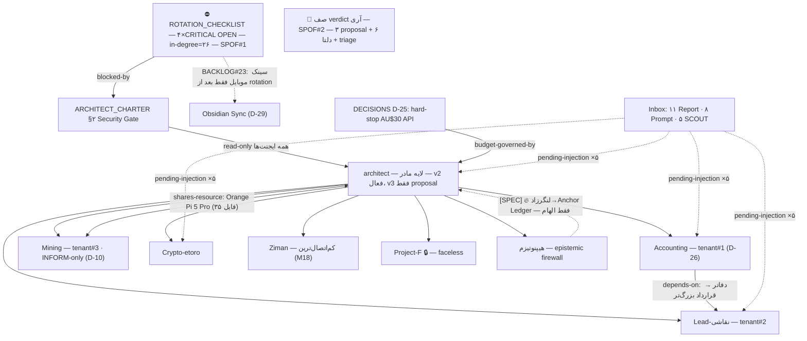

> [!success] نسخه canonical — verdict آری 2026-07-04. جایگزین v1/v2 (در `_superseded`).

# Report — نقشه روابط Vault — 2026-07-04 (v3، بازاجرای مستقل)

> اجرای [[04 - Architect System/architect/02-Research/Prompt - Vault Relationship Discovery 2026-07-04|پرامپت کشف روابط]] در MODE=**REPORT-ONLY** — گیت فعال: هر ۴ ردیف CRITICAL در [[ROTATION_CHECKLIST]] با خواندن مستقیم جدول (خطوط ۲۴–۲۷) OPEN تایید شد. هیچ نوت موجودی ویرایش نشد؛ خروجی فقط این گزارش + یک خط در HANDOFF.
>
> **چرا v3:** [[04 - Architect System/architect/02-Research/_superseded/Report - Self-Audit - Relationship Map 2026-07-04|Self-Audit]] روی v1 حکم «مشروط» داد و صریحاً «بازاجرا در جلسه تازه» خواست (بند آینه ۱). این جلسه همان بازاجراست: ایجنتِ این گزارش **نویسنده هیچ‌کدام از v1/v2/آدیت نیست** (استقلال آدیتور↔نویسنده برقرار). هر ۷ پچ پیشنهادی آدیت (F10) اعمال شد: اسکریپت تک-pass، کانال `project:`، تعریف صریح orphan، کسر متافایل‌ها از شمارش‌ها، نمونه‌گیری تصادفی recall، بدون کوتای ثابت لینک، جمله scope.
> ⚠️ **در حین Preflight معلوم شد یک [[04 - Architect System/architect/02-Research/_superseded/Report - Vault Relationship Map 2026-07-04 v2|v2 کامل]] هم از جلسه موازی وجود دارد** که v1 را «بریده در §۳» فرض کرده. راستی‌آزمایی دوسویه همین جلسه: v1 روی **دیسک واقعی کامل است** (۱۷۴ خط، §۱–§۹؛ دوبار مستقیم خوانده شد)، اما نمای فایل‌سیستم سندباکس ایجنت‌ها همان فایل را ۶۵خطی (snapshot ساعت 07:40) نشان می‌دهد — یعنی premise v2 (و خط تازه HANDOFF) **artifact تاخیر همگام‌سازی نمای سندباکس** است، نه واقعیت دیسک. جزئیات: M1 و §۵-C5. ادعاهای بازمصرفی v2 تک‌تک از نو verify شدند.
>
> **جمله scope (پچ آدیت #4):** این سند «نقشه ستون‌فقرات روابط» است، نه سرشماری همه یال‌های نوت‌سطح — برآورد recall در §۹.
> محدوده منفی (نه باز شد، نه echo): `_Archive` · `_Duplicates` · `.git` · `09 - People` · `secrets-export/` · `**/_code/` · الگوهای `*.env`/`*wallet*`/`*seed*`/`*key*`/`*.pem`. قاعده هویت: در سراسر گزارش فقط **Project-F** و مسیرهایش `[Project-F]/…` ماسک شده؛ نام پارتنر هیچ‌جا نیامده (چک برنامه‌ای بدون literal — §۶).

## ۱. متریک‌های Baseline (snapshot صبح 2026-07-04، پیش از افزودن این گزارش)

| متریک | مقدار | توضیح |
|---|---|---|
| نوت md پارس‌شده | **۲۸۴** | + ۳ pointer-note با الگوی secret در نام که طبق `.agentignore` باز نشد (§۶)؛ فایل >1.5MB: **صفر** (محدودیت v1 دیگر برقرار نیست) |
| مخرج orphan | **۲۷۸** | منهای ۶ نوت `_Templates` (جدا گزارش شد — پچ آدیت) |
| wikilink حل‌شده | **۶۳۱** | + ۱۳ placeholder قالب‌ها + ۲ embed دارایی + ۱ به محدوده منفی |
| یال `project:` (frontmatter) | **۷۱ نوت پر** | کانال دوم گراف (پچ آدیت #3)؛ ۴۶ در Projects، ۸ در Inbox، ۷ در Knowledge، ۵ در Architect، ۵ template |
| لینک مبهم | ۱۸ | خانواده اصلی: `[[PROJECT]]` bare ×۸ (۸ فایل هم‌نام + ۱ template)، `[[INDEX]]` ×۲، `[[HANDOFF]]` ×۲ |
| هدف stale واقعی | **۲** (+۲ کم‌اهمیت) | `Mining/Ai bots/ARCHITECTURE` در `Mining/PROJECT.md:74` و `_Index - Projects.md:24` (فایل واقعی: `Mining/02 - Code/Ai bots/ARCHITECTURE.md`) · `Atlas/Home MOC` ×۱ (بقایای vault قدیمی) · لینک نسبی `../../../01 - Dashboard/HANDOFF` ×۱ |
| **orphan — تعریف صریح (پچ آدیت):** بدون wikilink ورودی/خروجی **و** بدون `project:` پر (دوطرفه) | **۱۲۷ از ۲۷۸ ≈ ۴۶٪** | فقط-wikilink (تعریف v1): ۱۳۸ ≈ ۵۰٪؛ کانال `project:` دقیقاً ۱۱ نوت را نجات داد — هر ۱۱، `[Project-F]/research-results` (P1–P10 + exec-summary) |
| ترکیب orphanها | ۹۹ عضو ۳ doc-pack + ۲۸ پراکنده | فیوژن هیپنوتیزم **۴۹** · brushline **۴۳** · کاریابی **۷**؛ پراکنده‌ها شامل: **fusion-audit PASS-1…8 (۸ نوت)**، ۵ سند سطح‌بالای AiFarm-Lead، ARMIN_DNA_REPORT، CLAUDE.md، ۲ نوت «مغز دوم» |
| هاب #۱ (in-degree خالص wikilink) | [[ROTATION_CHECKLIST]] = **۲۶** | بعدی‌ها: SERVER_ARCHITECTURE (AiFarm) ۲۲ · DECISIONS ۱۹ · research-safety-governance ۱۹ · GAPS ۱۸ · Crypto PROJECT ۱۸ |
| هاب ترکیبی (wikilink + `project:`) | Crypto PROJECT **۳۱** | سپس ROTATION ۲۶ · هیپنوتیزم PROJECT ۲۶ · architect PROJECT ۲۴ — کانال project: رتبه‌بندی هاب‌ها را عوض می‌کند (پیش‌بینی آدیت ✅) |
| جریان بین‌پوشه‌ای غالب | architect→Projects ۲۲ · Dashboard→Inbox ۱۷ · Inbox→architect ۱۱ | جریان Projects→Knowledge ≈ صفر: دانش بازمصرف از پروژه‌ها استخراج نمی‌شود (فرصت) |
| Inbox در لحظه snapshot | **۱۱ Report · ۸ Prompt · ۵ SCOUT · AGENT_QUESTIONS** | (تصحیح خطای High #1 آدیت روی برچسب Mermaid v1) |

> نکته سیالیت: vault در همین روز زنده بوده — شمارش‌های v1/آدیت/v2/v3 (۲۸۶→۲۸۹→۲۸۲→۲۸۴) به‌خاطر ساخته‌شدن فایل‌های جدید بین snapshot ها متفاوت‌اند، نه خطا (زیر آستانه ۵٪).

## ۲. راستی‌آزمایی جدول Seed (۱۳ ردیف — همه با evidence مستقیم همین جلسه)

| # | یال | نتیجه | Evidence (مسیر + نقل‌قول ≤۱ خط) | اطمینان | وضعیت |
|---|---|---|---|---|---|
| 1 | ROTATION → کل اکوسیستم (blocked-by) | ✅ هاب #۱ و گیت چهارگانه | `ARCHITECT_CHARTER.md:26,28` «تا وقتی … حتی یک ردیف CRITICAL … OPEN دارد: autonomy مؤثر همه ایجنت‌ها = read-only» + `AGENT_REGISTRY.md:30` (گیت deploy) + `BACKLOG.md:41` (گیت سینک، M8) | [FACT] | already-linked |
| 2 | D-25 → ≥۳ پروژه (budget-governed-by) | ✅ دامنه واقعی: **۹ فایل محتوایی** (پس از کسر ۷ متافایل — پچ #8) | `DECISIONS.md:36` «معماری بودجه v1 … کل هزینه AI ماهانه ≈ ۲۰۰–۳۰۰ AUD» + `AGENT_REGISTRY.md:29` «بودجه API جمعی: hard-stop AU$30/ماه (D-25)» + `Lead-نقاشی/PROJECT.md:31` | [FACT] | نیمه‌لینک‌شده → پیشنهاد #9 |
| 3 | Langar-zād ↔ Anchor Ledger (bridges-fiction↔reality) | ✅ پل صریح متنی، بدون wikilink | `07 - Knowledge/هیپنوتیزم  و خودآگاهی/knowledge_base.md:35` «موجودِ لنگرزاد … هستهٔ انسانیِ میرا به‌عنوان root-of-trustِ غیرقابل‌جعل و append-only» ↔ `ARCHITECT_CHARTER.md:43` «Anchor Ledger: لاگ append-only همه verdictها» | **[SPEC]** 🔥 فایروال: جهت مجاز فقط الهام→spec؛ داستان هرگز evidence تصمیم واقعی نیست | new-discovery → پیشنهاد #7 |
| 4 | Adversarial Review → v3-proposal (evidences) | ✅ تایید | `SYSTEM-BLUEPRINT-v3-proposal.md:5` «status: proposal — منتظر verdict آری (v2 دست‌نخورده و active می‌ماند)» + §۶ Task E (دلتاها، خط ۱۱۸–۱۲۰)؛ architect PROJECT ✅ به گزارش لینک دارد | [FACT] | already-linked — منتظر verdict |
| 5 | P2 ⟷ P8 + track-BC (contradicts — برنامه «ACC» در X) | ✅ تناقض زنده، با تشدید | `[Project-F]/research-results/P2…:24-25` «[EST] چند وب‌سایت سئویی (auditsocials.com…) … هشدار اطلاعات جعلی» **vs** `…/P8…:21` «[FACT — auditsocials.com] نیازمند ثبت‌نام در برنامه ACC با احراز هویت (ID)» — **P8 دقیقاً همان سایتی را [FACT] گرفته که P2 جعلی می‌داند** + `…track-BC…:93` [FACT] | [FACT] وجود تناقض | already-flagged (exec-summary:95 «مهم‌ترین ابهام») → §۵-C1 |
| 6 | Orange Pi 5 Pro (shares-resource: Mining + architect) | ✅ تایید | «orange pi» در **۳۵ فایل محتوایی**؛ watchdog/lease: `04 - Architect System/architect/02-Research/SCOUT-DEEP-Governance.md:27` «⑤ lease/watchdog … (تست /dev/watchdog روی برد)» (تصحیح استناد آدیت #5) + `Mining/Hardware Registry & Runbook.md:16` ردیف OPI-1 — ولی همه ستون‌ها `[To measure]` | [FACT] | نیمه‌لینک‌شده — نوت مرجع سخت‌افزار placeholder است |
| 7 | Cardew (same-entity + evidences) | ✅ تایید | ۷ فایل محتوایی (پس از کسر متافایل‌ها؛ تصحیح تورم «۸» — پچ #8)؛ گزارش ↔ چک‌لیست مجهول‌ها متصل؛ نام کامل/تاریخ‌ها همچنان مجهول (Trove/BDM قابل کوئری نبود) | [FACT] | already-linked |
| 8 | Tax Map → Accounting + Lead-نقاشی (constrained-by) | ✅ رابطه هست، **هیچ لینکی نیست** — و رقم در خود سند اولیه است | `Report - Accounting - Tax Map FY2025-26.md:25` «**instant asset write-off < $20,000 per asset until 30 June 2026 (law); drops to $1,000 from 1 July 2026** … time major tool/equipment purchases accordingly» + `:61` «last day of IAWO $1,000 regime year» — با ۴ لینک منبع ATO/PwC | **[FACT]** (برچسب [EST] پیشنهادی آدیت لازم نیست — §۵-C7) | new-discovery → پیشنهادهای #1، #4 |
| 9 | AiFarm-Lead ← AiFarm-Lead1/2 (duplicates) | ⚠️ **قبلاً حل شده** | `_Index - Projects.md:32` «AiFarm-Lead1 و AiFarm-Lead2 نسخه‌های قدیمی‌تر … به _Duplicates منتقل شد» | [FACT] | resolved — seed از حافظه چت بود؛ vault جلوتر است |
| 10 | یافته DNCR → SEGMENT-DISCOVERY + bot کاریابی (constrained-by) | ✅ تایید | `Lead-نقاشی/Outreach Compliance.md:23` «شماره بیزنسی قابل ثبت در رجیستر نیست → تماس B2B واقعی (builder/strata …) عملاً خارج از پوشش DNCR» + `:24` (wash ۳۰روزه شماره شخصی) | [FACT] | already-linked |
| 11 | گزارش‌های Inbox → PROJECT.md مقصد (pending-injection) | ✅ دقیق‌شده: **۵ گزارش بی‌لینک، ۳ تزریق‌شده** | بی‌لینک: Tax Map→Accounting · Sydney Lead Channels→Lead · Data Stack→Crypto · Open Questions→architect · **20 AGI Architectures→architect (جدید امروز)** ✅ تزریق‌شده: Adversarial v3→architect · Cardew + HRV→هیپنوتیزم | [FACT] | new-discovery → پیشنهادهای #1–#3، #14 |
| 12 | BLUEPRINT v1 → v2 (فعال) → v3-proposal (evolves-into، با تاریخ) | ✅ تایید | v1 (2026-07-03) → v2 active → v3-proposal (2026-07-04) `v3-proposal.md:5`؛ الگوی proposal در حال تکثیر است (M17) | [FACT] | already-linked |
| 13 | Accounting → پروژه‌های درآمدی (depends-on) | ✅ با evidence جایگزین | نقل‌قول seed («پیش‌نیاز کارهای بزرگ») عیناً در vault نیست؛ evidence واقعی: `Accounting/PROJECT.md:18` «دفاتر audit-ready … تا آری بتواند قراردادهای بزرگ‌تر بگیرد. tenant #1 … (ترتیب D-26)» + `DECISIONS.md:37` | [FACT] | already-linked |

## ۳. کشف‌ها — ۱۹ مورد (هرکدام با «اقدام مشخص» — پچ آدیت)

| # | کشف | نوع یال | Evidence | اطمینان | اقدام مشخص |
|---|---|---|---|---|---|
| M1 | **سه نسخه نقشه در یک روز + ریشه فنی سوءتفاهم:** v1 (کامل، آدیت «مشروط») + v2 (کامل، بر فرض «v1 بریده در §۳») + این v3. علت فرض غلط: **نمای فایل‌سیستم سندباکس ایجنت‌ها از دیسک واقعی عقب می‌ماند** — سندباکس همین جلسه v1 را ۶۵خطی/۹۷۴۸بایت (07:40) نشان می‌دهد، دیسک واقعی ۱۷۴ خط کامل؛ خط HANDOFF جلسه v2 هم دیرتر، وسط همین جلسه روی دیسک نشست (برخورد Edit ثبت شد) — race جلسات موازی | near-duplicate + evolves-into + contradicts (نما⟷دیسک) | خوانش مستقیم v1 (دوبار، §۱–§۹ کامل) vs `stat` سندباکس؛ Self-Audit (07:53) هم §۴–§۹ v1 را آدیت کرده بود — پس فایل کامل وجود داشت؛ `HANDOFF.md:71` vs `:73` الان دو canonical متضاد پیشنهاد می‌دهند | [FACT] | verdict آری: canonical=v3؛ بنر v1/v2 (#15، #16)؛ **قاعده جدید پیشنهادی:** ادعای «فایل بریده» فقط با خوانش مستقیم تایید شود نه stat؛ در روزهای چندجلسه‌ای، HANDOFF فقط append شود |
| M2 | **خود Self-Audit هم خطا داشت (ایراد #6):** ادعا کرد رقم write-off «در هیچ خط TaxMap نیست»، ولی TaxMap:25 و :61 صریحاً دارند (با منبع ATO) | contradicts (آدیت⟷سند) | نقل کامل خط ۲۵ در seed 8 | [FACT] | برچسب Seed8 = [FACT] برمی‌گردد؛ درس: شمارش regex-محور خطاپذیر است (خود آدیت در «آینه» بند ۲ همین را گفته بود) |
| M3 | **کانال `project:` دقیقاً ۱۱ orphan را نجات می‌دهد (نه ۱۴)** و هر ۱۱ در `[Project-F]/research-results` اند؛ headline درست: **۴۶٪** | metric-fix | شمارش §۱ | [FACT] | پذیرش تعریف جدید orphan در اجراهای بعدی پرامپت |
| M4 | **چهار فضای شماره‌گذاری موازی و ناسازگار:** `D-xx` (DECISIONS) ≠ `(D2…D5)` قدیمی در ۴ PROJECT.md ≠ `G-xx` (GAPS) ≠ `GAP n` (SCOUT-SUMMARY/Open Questions) — مثلاً D2 (survival ماینینگ) ≠ D-02 (معماری ۵جزئی)؛ «GAP 7» در GAPS.md وجود ندارد، در Open Questions است | same-entity (ابهام سیستمی) | `Mining/PROJECT.md:18` «(D2)» vs `DECISIONS.md:13` D-02 · `Open Questions…md:11` «GAP 7 — KILLBENCH ✅ RESOLVED» vs GAPS.md (فقط G-01…G-18، بدون KILLBENCH) | [FACT] | پیشنهاد #10 (ردیف نگاشت در DECISIONS + یادداشت در GAPS) |
| M5 | **جزیره fusion-audit:** PASS-1…PASS-8 (۸ گزارش پشتوانه TOP-5) صفر لینک ورودی/خروجی — در حالی که TOP-5 گام رسمی بعد از rotation است | island + evidences | فهرست orphanها + `HANDOFF.md:13` (REFACTOR_PLAN=TOP-5) | [FACT] | پیشنهاد #20 (پل از REFACTOR_PLAN) |
| M6 | **AGENT_REGISTRY فقط آینده را می‌بیند:** ۹ ایجنت planned، ولی ≥۶ بات legacy موجود (brushline، QuantumAlphaBot، sentinel، langar، silabi، کاریابی — ردیف ۶ ROTATION) هیچ ردیف/شناسنامه‌ای در `05 - Agents` ندارند | same-entity (پوشش ناقص) | `AGENT_REGISTRY.md:13-23` vs `ROTATION_CHECKLIST.md:29` | [FACT] | پیشنهاد #12 |
| M7 | **ECOSYSTEM.md صفر wikilink دارد** — «نقشه کامل» قانون اساسی در گراف نامرئی است | island (هابِ بی‌یال) | grep `[[` = ۰؛ ارجاع از `_PROJECT_INSTRUCTIONS.md:27` | [FACT] | پیشنهاد #11 |
| M8 | **rotation سینک موبایل را هم قفل کرده:** BACKLOG #23 (Obsidian Sync، D-29) «فقط بعد از #1» — چهارمین کلاس اثر گیت (autonomy، deploy، triage، سینک) | blocked-by | `BACKLOG.md:41` + `DECISIONS.md:40` | [FACT] | در برنامه‌ریزی rotation لحاظ شود؛ گیت را وارد Weekly Review کن (پیشنهاد #19) |
| M9 | **تنش ساختار مالیاتی:** Accounting PROJECT «Pty Ltd (D3) [Assumption]» vs Tax Map با scope «sole trader» و بخش «Sweetener for staying sole trader» | contradicts | `Accounting/PROJECT.md:18,24` vs `Tax Map…:15-16` | [FACT] | §۵-C4 — تعیین وضعیت واقعی توسط مالک + حسابدار |
| M10 | **فایروال fiction محکم ولی ارجاعش غلط:** ۵۵/۵۷ نوت حوزه هیپنوتیزم `epistemic_status` دارند (۲ استثنا: PROJECT.md و PROJECT.v2-proposal.md — طنز: خود سند قاعده!)؛ اما `PROJECT.md:24` فایروال را به «charter §۶» حواله می‌دهد که §Privacy است | evidences + ارجاع نادرست | شمارش frontmatter + `ARCHITECT_CHARTER.md:52-56` (§۶=Privacy) · خانه واقعی قاعده: `Property Schema` §۲ + `AGENT_REGISTRY.md:23` | [FACT] | پیشنهاد #8 |
| M11 | **نقطه‌کور validator:** `find_broken_links.py` صفر لینک شکسته می‌گوید، ولی ۲ لینک stale مسیر-کامل واقعی‌اند (resolve بر اساس basename) | contradicts (ابزار⟷واقعیت) | §۱ ردیف stale + خروجی validator همین جلسه (§۱۰) | [FACT] | پیشنهادهای #5، #6 + test-case برای اسکریپت (با verdict) |
| M12 | **نام پارتنر Project-F در ۴ فایل خارج از پوشه‌اش** — ناقض charter §۶؛ لیست v1 مستقلاً بازتولید شد؛ فایل پنجم ادعایی v2 (لاگ تلگرام Lead) **بازتولید نشد** | contradicts (قاعده⟷عمل) | چک برنامه‌ای token بدون literal؛ مسیرها فقط در §۶ | [FACT] (لیست ۴تایی) · [EST] (مورد پنجم v2) | ویرایش تک‌کلمه‌ای ۴ فایل بعد از گیت (§۵-C3) |
| M13 | **یک `.env` هنوز داخل vault است:** `کاریابی/bot/.env` + ۷ مسیر دیگر با الگوی secret در نام — ناسازگار با ادعای Phase 0 («همه secretها به secrets-export منتقل شد») | security | مسیرها فقط در §۶؛ هیچ فایلی باز نشد | [FACT] وجود مسیر / [EST] محتوا | بازبینی مالک؛ در صورت مقداردار بودن → ردیف ROTATION |
| M14 | **«لنگر» سه موجودیت متمایز:** بات langar (تلگرام، بودجه D-25، langar.db شخصی) ≠ Anchor Ledger (charter §۴) ≠ لنگرزاد (fiction) — ۸۱ فایل این واژه را دارند | same-entity (ابهام) | `DECISIONS.md:36` (بات) + `charter:43` (Ledger) + `knowledge_base.md:54-55` (فیکشن) | [FACT]؛ پل فیکشن [SPEC] 🔥 | پیشنهاد #7 (پل برچسب‌دار)، زیرنقشه ۳ |
| M15 | **گزارش‌ها تندتر از PROJECT.md ها حرکت می‌کنند:** بین v1 و v3 (همین روز)، ۳ تزریق انجام شد (Adversarial، Cardew، HRV) ولی ۵ گزارش هنوز بی‌لینک‌اند — از جمله «Report - 20 AGI Architectures 2026» که امروز ساخته شده و در هیچ نسخه قبلی نبود | pending-injection | جدول seed 11 | [FACT] | پیشنهادهای #1–#3، #14 |
| M16 | **پرامپت‌های اجرانشده = صف pending-execution:** پرامپت‌های تحقیق Mining / Ziman / Project-F + «آدیت و بازسازی PROJECT هیپنوتیزم» + «Security Ops G-01» (اولویت اول طبق HANDOFF:74) | pending-execution | `HANDOFF.md:39,74` + وجود ۸ Prompt در Inbox | [FACT] | اجرای زمان‌بندی‌شده بعدی؛ اول Security Ops |
| M17 | **صف verdict متورم:** ۳ فایل با `status: proposal` (v3-proposal، MAP.proposal، PROJECT.v2-proposal — هر سه خطای schema چون status مجاز نیست) + ۶ دلتای adversarial + triage ~۱۶ آیتم Inbox — همه سریال روی یک انسان | evolves-into + گلوگاه انسانی (SPOF#2) | grep `status:.*proposal` = ۳ فایل + `HANDOFF.md:53` | [FACT] | یک «جلسه verdict» یکجا بعد از rotation؛ تصمیم schema (افزودن proposal یا تغییر status) |
| M18 | **Ziman کم‌اتصال‌ترین گره:** ۲ نوت md، بدون گزارش/کانال ورودی؛ + **۲۰ عکس WhatsApp و files.zip داخل پوشه پروژه** — ناقض مسیریابی قانون اساسی (عکس→08، باینری→_Archive) | گره ضعیف + نقض routing | `ls "Ziman Galerry/"` | [FACT] | اجرای پرامپت Ziman (M16) + انتقال عکس‌ها بعد از گیت |
| M19 | **«مغز دوم» پوسته خام Obsidian است** و تصمیمش از ingest باز مانده | pending-decision | `INGEST-INVENTORY.md:31` «پوستهٔ خام Obsidian … هیچ محتوایی ندارد» + `:46` (سوال باز حذف/ثبت) — استناد در-vault، تصحیح آدیت #11 | [FACT] | تصمیم مالک: حذف یا ثبت در REDUNDANT-SOURCES |

## ۴. تحلیل گراف

- **SPOF#1 — ROTATION_CHECKLIST (in-degree ۲۶):** یک جدول انسانی، چهار کلاس اثر (autonomy همه ایجنت‌ها، deploy رجیستری، triage Inbox، سینک موبایل — M8). تا بسته‌شدن ۴ ردیف CRITICAL همه‌چیز read-only است.
- **SPOF#2 — صف verdict آری (M17):** بعد از گیت هم، هر تغییر ساختاری منتظر یک نفر است؛ ریسک: انباشت proposal ها و کهنه‌شدنشان.
- **زنجیره وابستگی فعال:** rotation → TOP-5 آدیت fusion (پشتوانه‌اش جزیره M5!) → Phase 4 → tenantها به ترتیب D-26 (Accounting → Lead → Mining). حلقه مخرب یافت نشد؛ evolves-into ها خطی‌اند.
- **جزیره‌ها:** ۳ doc-pack (۹۹ نوت) + fusion-audit (۸) — الگوی درمان: **یک پل per جزیره**، نه لینک‌باران؛ طبق قانون اساسی §۱۱ بسته‌های سند داخلی «قرارداد خودشان را دارند».
- **عدم‌تقارن جریان:** architect→Projects پرتراکم‌ترین (۲۲) ولی Projects→Knowledge ≈ ۰ — یعنی درس‌های پروژه‌ها به دانش ماندگار تبدیل نمی‌شوند (درخت تصمیم شاخه c عملاً بی‌استفاده).
- **ریسک ابهام لینک:** ۸ لینک bare `[[PROJECT]]` با ۸ فایل هم‌نام + template — Obsidian ممکن است به فایل ناخواسته resolve کند؛ قاعده «لینک مسیر-کامل» (قانون اساسی §۵) در نوت‌های قدیمی رعایت نشده.

## ۵. تناقض‌ها + کوتاه‌ترین مسیر حل

| # | تناقض | Evidence | کوتاه‌ترین مسیر حل |
|---|---|---|---|
| C1 | برنامه «ACC/ID» در X: جعلی ([EST] P2) vs واقعی ([FACT] P8/track-BC) — هر دو سمت به **auditsocials.com** می‌رسند؛ یک منبع مشکوک، دو برچسب متضاد | seed 5 | چک دستی ۵–۱۰ دقیقه‌ای تنظیمات X / help.x.com (خود exec-summary:95 همین را خواسته)؛ تا آن موقع P8:21 و track-BC:93 → [EST]؛ هیچ قدم اجرایی متکی به X برداشته نشود |
| C2 | validator: «صفر لینک شکسته» vs ۲ stale مسیر-کامل واقعی | M11 | فیکس ۲ لینک (پیشنهاد #5، #6) + test-case مسیر-کامل به `find_broken_links.py` (تغییر کد فقط با verdict) |
| C3 | قاعده هویت Project-F ⟷ عمل: نام پارتنر در ۴ فایل بیرون پوشه | M12، مسیرها §۶ | جایگزینی تک‌کلمه‌ای با «پارتنر» بعد از گیت؛ چک مورد پنجم ادعایی v2 هنگام ویرایش |
| C4 | Pty Ltd (Accounting PROJECT، [Assumption]) vs sole trader (Tax Map) | M9 | یک خط از مالک درباره وضعیت ثبت واقعی + تایید حسابدار؛ سپس اصلاح فایل ناسازگار |
| C5 | **سه نسخه نقشه + HANDOFF خودمتناقض:** خط ۷۱ (v1 با آمار کامل §۴–§۹اش) ⟷ خط ۷۳ (ادعای «v1 در §۳ قطع شده» + canonical=v2) — ریشه: stale-view سندباکس (M1). C7 خود v2 («HANDOFF به بخش‌های ناموجود v1 ارجاع می‌دهد») هم با کامل‌بودن v1 روی دیسک منتفی است | M1 + خوانش مستقیم | verdict آری: **پیشنهاد canonical = v3** (تنها نسخه‌ای که Self-Audit را جذب کرده و artifact نما را توضیح می‌دهد)؛ بنر v1/v2 (#15، #16)؛ بازنویسِ بعدی HANDOFF خطوط ۷۱/۷۳ را یکدست کند؛ هر سه نسخه حفظ — حذف ممنوع |
| C6 | فایروال fiction به «charter §۶» حواله شده که §Privacy است | M10 | پیشنهاد #8 — ارجاع درست: Property Schema §۲ |
| C7 | Self-Audit #6 ⟷ TaxMap: آدیت گفت رقم write-off در سند نیست؛ هست (:25، :61 با منبع ATO) | M2 | برچسب Seed8 در مصرف آینده = [FACT]؛ چک خارجی ato.gov.au فقط به‌عنوان تایید دوره‌ای (رقم قانونی تغییرپذیر است) |

## ۶. Security & Privacy Flags (فقط مسیر — هیچ فایلی باز/echo نشد)

- **الگوی secret در نام (۸ مسیر):** `03 - Projects/Lead-نقاشی/کاریابی/MOVED - 05_راهنمای_API_keys.md.md` (pointer) · `03 - Projects/Lead-نقاشی/کاریابی/bot/.env` ⚠️ (M13) · `03 - Projects/Lead-نقاشی/کاریابی/bot/harvesters/keywords.py` (احتمالاً false-positive) · `03 - Projects/Mining/02 - Code/Ai bots/QuantumAlphaBot/check_keys.py` · `03 - Projects/Mining/02 - Code/Ai bots/sentinel/wallet_tracker.py` · `03 - Projects/Mining/02 - Code/Robo-data/robots/sentinel/wallet_tracker.py` · `03 - Projects/Mining/03 - Rigs/Mining-1/Mining Q/MOVED - GUI Wallet.lnk.md` (pointer) · `03 - Projects/Mining/03 - Rigs/Mining-1/Mining Q/MOVED - monero wallet.txt.md` (pointer)
- **نام پارتنر خارج از Project-F (۴ — C3):** `01 - Dashboard/HANDOFF.md` · `03 - Projects/_Index - Projects.md` · `07 - Knowledge/هیپنوتیزم  و خودآگاهی/هیپنوتیزم و خودآگاهی.md` · `AUDIT-PHASE3.md`
- **داده حساس شخصی orphan:** `07 - Knowledge/هیپنوتیزم  و خودآگاهی/Marathon/امواج مغزی/ARMIN_DNA_REPORT.md` — مشمول روح O-04؛ حداقل به ایندکس Knowledge لینک شود تا گم نشود (با verdict)
- **دیده و رد شد:** `secrets-export/` · `INGEST-EXCLUDED-SECRETS.md` (باز نشد) · `09 - People/` · `_Archive` · `_Duplicates` · هر `_code/`

## ۷. Proposed Wikilink Diff — ۲۰ پیشنهاد رتبه‌بندی‌شده (⛔ اعمال نشده — همه منتظر verdict آری بعد از گیت)

```
 1. 03 - Projects/Accounting/PROJECT.md ← زیر بخش نوت‌های مرتبط (یا انتهای فایل):
    + - [[03 - Projects/Accounting/Report - Accounting - Tax Map FY2025-26|Report - Tax Map FY2025-26]] — نقشه مالیاتی FY2025-26؛ ورودی رجیستر انطباق
 2. 03 - Projects/Lead-نقاشی/PROJECT.md ← همان‌جا:
    + - [[03 - Projects/Lead-نقاشی/Report - Lead-نقاشی - Sydney Lead Channels 2026|Report - Sydney Lead Channels 2026]] — کانال‌های لید؛ ورودی آزمایش #۱
 3. 03 - Projects/Crypto - etoro/PROJECT.md ← همان‌جا:
    + - [[03 - Projects/Crypto - etoro/Report - Crypto - etoro - Data Stack under AU30|Report - Data Stack under AU30]] — استک داده free-API زیر سقف D-25
 4. 03 - Projects/Lead-نقاشی/PROJECT.md ← زیر Open blockers: ⭐ حساس به زمان — بالاترین ارزش عملی
    + - قید خرید ابزار: [[03 - Projects/Accounting/Report - Accounting - Tax Map FY2025-26|Tax Map]] — write-off از 1 Jul 2026 فقط $1,000/دارایی (TaxMap:25)
 5. 03 - Projects/Mining/PROJECT.md:74 ← فیکس stale (M11):
    - [[03 - Projects/Mining/Ai bots/ARCHITECTURE|Ai bots ARCHITECTURE]]
    + [[03 - Projects/Mining/02 - Code/Ai bots/ARCHITECTURE|Ai bots ARCHITECTURE]]
 6. 03 - Projects/_Index - Projects.md:24 ← همان فیکس ردیف ۵
 7. 07 - Knowledge/هیپنوتیزم  و خودآگاهی/knowledge_base.md ← انتهای بخش پل (~خط ۳۵):
    + > پل مهندسی [SPEC] 🔥: [[04 - Architect System/architect/ARCHITECT_CHARTER|charter §۴ — Anchor Ledger]] · جهت مجاز فقط الهام→spec؛ fiction هرگز evidence نیست
 8. 07 - Knowledge/هیپنوتیزم  و خودآگاهی/PROJECT.md:24 ← اصلاح ارجاع فایروال (C6):
    - (charter §۶ هم‌راستا)
    + (مرجع: [[06 - Architecture Maps/Property Schema|Property Schema §۲]]؛ charter §۶ فقط privacy)
 9. 03 - Projects/Lead-نقاشی/PROJECT.md:31 ← «(D-25)» → ([[04 - Architect System/architect/01-Project/DECISIONS|D-25]])
10. 04 - Architect System/architect/01-Project/DECISIONS.md ← ذیل جدول، ردیف نگاشت (append-only، M4):
    + > نگاشت شماره‌گذاری‌های قدیمی/موازی: (D2…D5) در PROJECT.mdها = تصمیم‌های AI-FARM-EXPORT، ≠ D-0x این جدول · «GAP n» در SCOUT/Open Questions ≠ G-xx در GAPS
11. 06 - Architecture Maps/ECOSYSTEM.md ← انتها: بلوک ## Related با ۸ لینک PROJECT (متن آماده در جدول §۱ قانون اساسی) — رفع M7
12. 05 - Agents/AGENT_REGISTRY.md ← ذیل جدول (M6):
    + > باتهای legacy (پیش از charter): brushline · QuantumAlphaBot · sentinel · langar · silabi · کاریابی — خاموش تا rotation ([[ROTATION_CHECKLIST]] ردیف ۶)؛ شناسنامه: TODO
13. 03 - Projects/Lead-نقاشی/AiFarm-Lead/SERVER_ARCHITECTURE.md ← انتها: پل جزیره brushline (M-جزیره):
    + - doc-pack کامل brushline: [[03 - Projects/Lead-نقاشی/AiFarm-Lead/Ai farm- sister Painting/brushline/00_governance/PROJECT_OVERVIEW|PROJECT_OVERVIEW]]
14. 04 - Architect System/architect/PROJECT.md ← زیر بخش نوت‌های مرتبط (M15):
    + - [[04 - Architect System/architect/02-Research/Report - Architect - Open Questions 2026-07-04|Open Questions]] (GAP 7 KILLBENCH بسته شد) · [[04 - Architect System/architect/02-Research/Report - 20 AGI Architectures 2026|20 AGI Architectures]]
15. 04 - Architect System/architect/02-Research/_superseded/Report - Vault Relationship Map 2026-07-04.md ← بنر خط اول (C5):
    + > 📌 نسخه‌شناسی: این v1 است؛ آدیت‌شده با حکم «مشروط». نسخه canonical پیشنهادی: [[04 - Architect System/architect/02-Research/Report - Vault Relationship Map 2026-07-04 v3|v3]]
16. 04 - Architect System/architect/02-Research/_superseded/Report - Vault Relationship Map 2026-07-04 v2.md ← بنر خط اول (C5):
    + > 📌 نسخه‌شناسی: premise این نسخه («v1 بریده») artifact نمای سندباکس بود — v1 روی دیسک کامل است. نسخه canonical پیشنهادی: [[04 - Architect System/architect/02-Research/Report - Vault Relationship Map 2026-07-04 v3|v3]]
17. 07 - Knowledge/هیپنوتیزم  و خودآگاهی/PROJECT.md ← پل جزیره فیوژن (۴۹ نوت): یک لینک به ایندکس/Architecture داخل «فیوژن هیپنوتیزم/00_Knowledge_Base» (انتخاب فایل ایندکس با مالک)
18. 03 - Projects/Mining/PROJECT.md ← زیر بخش نوت‌های مرتبط:
    + - [[03 - Projects/Mining/01 - Docs/Orange Pi Automation System - 20 Projects/ARCHITECTURE_v1_SelfAdaptive|Orange Pi Automation v1]] (+ نسخه v2 Hybrid همان پوشه) — اسناد معماری orphan
19. 02 - Life OS/Weekly Review.md ← ردیف چک‌لیست جدید (M8):
    + - [ ] وضعیت گیت: [[ROTATION_CHECKLIST]] — چند ردیف CRITICAL هنوز OPEN؟
20. 04 - Architect System/architect/04-Docs/fusion-audit/REFACTOR_PLAN.md ← انتها (M5):
    + - پشتوانه این TOP-5: گزارش‌های PASS-1 تا PASS-8 در همین پوشه (fusion-audit)
```

## ۸. نقشه Mermaid — سطح ۱ (مقصد نهایی پیشنهادی: `06 - Architecture Maps/` کنار [[06 - Architecture Maps/SYSTEM_MAP|SYSTEM_MAP]]؛ فعلاً طبق پرامپت اینجا)



**زیرنقشه ۱ — صف‌های pending:** گزارش‌های بی‌لینک (Tax Map→Accounting، Sydney Leads→Lead، Data Stack→Crypto، Open Questions + 20 AGI→architect) و پرامپت‌های اجرانشده (Security Ops اول، سپس Mining/Ziman/Project-F، آدیت هیپنوتیزم).
**زیرنقشه ۲ — جزیره‌ها و پل پیشنهادی:** brushline(۴۳)→#13 · فیوژن(۴۹)→#17 · research-results(۱۱، نجات‌یافته با project:)→ در پوشه خودش · fusion-audit(۸)→#20.
**زیرنقشه ۳ — سه رفرنت «لنگر» (M14):** بات langar (واقعی، D-25) ⟂ Anchor Ledger (واقعی، charter §۴) ⟵[SPEC]🔥 لنگرزاد (fiction) — فقط هم‌نامی، مرز epistemic برقرار.

## ۹. نمونه‌گیری تصادفی و برآورد recall (پچ آدیت — seed=20260704، n=۱۰)

| نوت نمونه | in/out/proj | پوشش در این نقشه |
|---|---|---|
| brushline/OPS-09 · brushline/CONSISTENCY_REPORT · brushline/KB-00 · brushline/DEDUP_NOTE | 0/0/N | سطح خوشه ✅ (جزیره brushline + قیدهای Spam Act/DNCR) |
| فیوژن/DecisionLog · fusion-audit/PASS-7 | 0/0/N | سطح خوشه ✅ (جزیره فیوژن M-جزیره؛ fusion-audit M5) |
| [Project-F]/research-results/P9 | 0/0/**Y** | ✅ نجات‌یافته کانال project: (M3) + خوشه C1 |
| ARMIN_DNA_REPORT | 0/0/N | ✅ نوت‌سطح (پرچم §۶) |
| Accounting/Accounting.md (لاگ تلگرام) | 2/2/Y | ✅ متصل — خارج از orphanها |
| scripts/README | 0/2/Y | سطح خوشه ✅ (بحث validator M11) |

**برآورد recall:** پوشش خوشه‌سطح ۱۰/۱۰؛ حضور نوت‌سطح در جدول یال‌ها ~۳/۱۰ — یعنی این سند همچنان «نقشه ستون‌فقرات» است و برای سرشماری نوت‌سطح، اجرای embedding-محور لازم است (خارج از scope این اجرا).

## ۱۰. اعتبارسنجی پایان جلسه + معیار پذیرش

| چک | نتیجه |
|---|---|
| `find_broken_links.py` | ✓ «۲۹۱ نوت، لینک شکسته‌ای نیست» (اجرای پایان همین جلسه) — به‌علاوه M11: دو stale مسیر-کامل که ابزار نمی‌بیند |
| `validate_frontmatter.py` | **۵۹ خطا = ۵۴ پیش‌موجود schema-drift** (SCOUT-*×۱۵، گزارش‌های type:report/status:inbox، «۱۰ رویکرد»، INDEX ماینینگ و…) **+ ۵ از فایل‌های امروزِ جلسات موازی** (MAP.proposal ×۱ · PROJECT.v2-proposal ×۱ · research-track-BC ×۳)؛ **این گزارش و خط HANDOFF: صفر خطای جدید** |
| معیار پذیرش پرامپت | یال بدون evidence: **۰** · secret در خروجی: **۰** (فقط مسیر) · تفکیک new-discovery/already-linked: ✅ ستون وضعیت · کشف جدید معنادار: **۱۹ ≥ ۱۵** ✅ هرکدام با اقدام · یال‌های fiction↔reality: همه [SPEC] + پرچم فایروال ✅ |
| استقلال | نویسنده این گزارش ≠ نویسنده v1/v2/آدیت (توصیه آینه ۱ آدیت اجرا شد) |
| فایل‌های لمس‌شده | ساخته: همین گزارش · ویرایش: فقط یک خط HANDOFF §کانتکست · حذف/بازنویسی: هیچ |
| artifact محیط | متریک‌های §۱ روی نمای سندباکس محاسبه شد؛ v1/v2 در آن نما کوتاه‌تر از دیسک واقعی‌اند (۶۵/۱۷۸ خط vs ۱۷۴/۲۰۱) — هر دو متافایل‌اند و از sweepها مستثنا؛ اثر فقط بر in-degree چند هاب و جزئی است (M1) |

## Related

- [[04 - Architect System/architect/02-Research/Prompt - Vault Relationship Discovery 2026-07-04|پرامپت مولد]] · [[04 - Architect System/architect/02-Research/_superseded/Report - Self-Audit - Relationship Map 2026-07-04|Self-Audit (پچ‌های اعمال‌شده)]]
- نسخه‌های قبلی: [[04 - Architect System/architect/02-Research/_superseded/Report - Vault Relationship Map 2026-07-04|v1]] · [[04 - Architect System/architect/02-Research/_superseded/Report - Vault Relationship Map 2026-07-04 v2|v2]] — verdict canonical: §۵-C5
- [[06 - Architecture Maps/SYSTEM_MAP|SYSTEM_MAP]] · [[06 - Architecture Maps/ECOSYSTEM|ECOSYSTEM]] · [[01 - Dashboard/HANDOFF|HANDOFF]]
