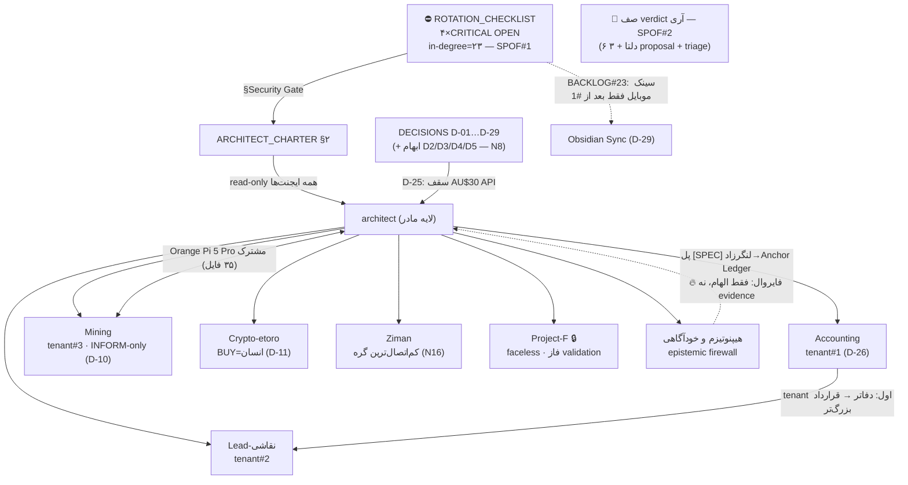
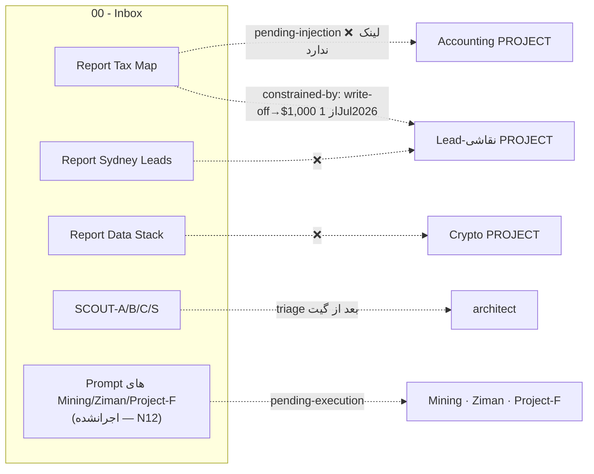
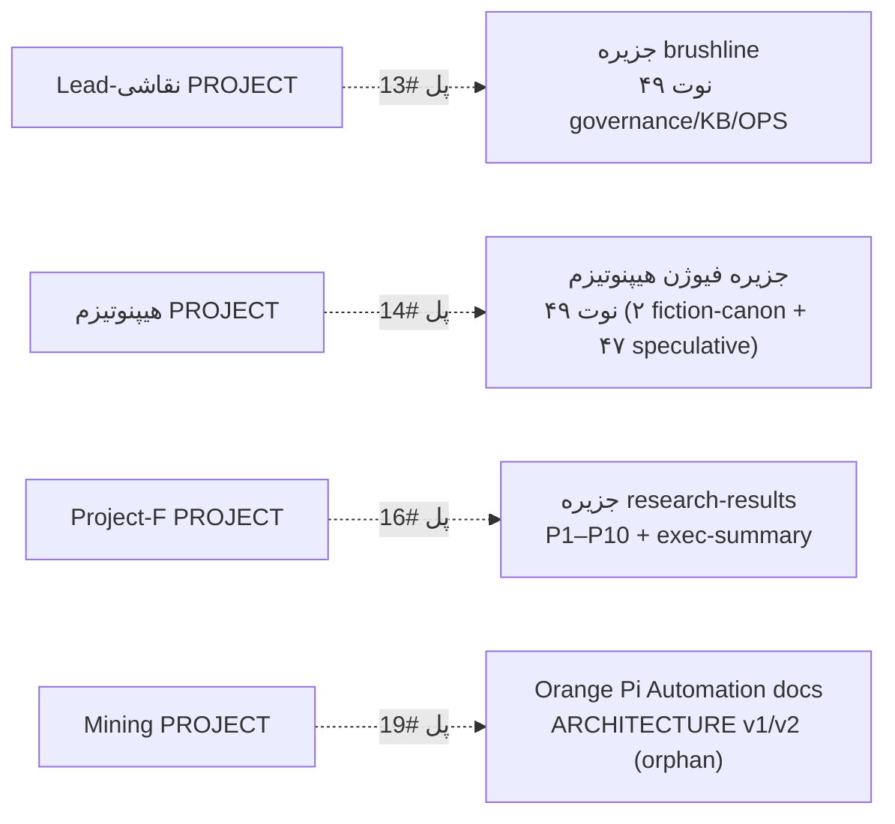
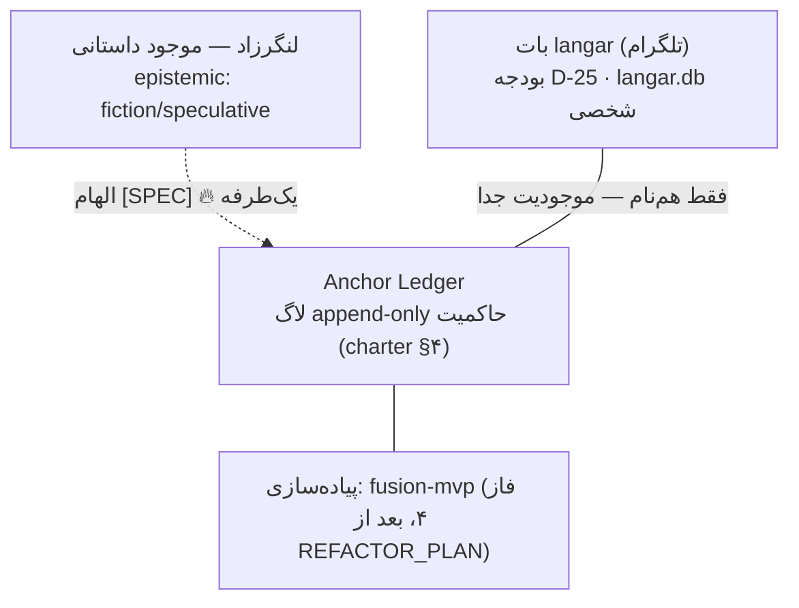

> [!warning] superseded — canonical: [[Report - Vault Relationship Map 2026-07-04 v3]] (verdict آری 2026-07-04).

# Report — نقشه روابط Vault — 2026-07-04 (v2)

> اجرای [[04 - Architect System/architect/02-Research/Prompt - Vault Relationship Discovery 2026-07-04|پرامپت کشف روابط]] در MODE=**REPORT-ONLY** — گیت فعال: هر ۴ ردیف CRITICAL در [[ROTATION_CHECKLIST]] هنوز OPEN (charter §۲). هیچ نوت موجودی ویرایش نشد؛ خروجی فقط این گزارش + یک خط در HANDOFF.
>
> **چرا v2:** فایل [[04 - Architect System/architect/02-Research/_superseded/Report - Vault Relationship Map 2026-07-04|Report - Vault Relationship Map 2026-07-04]] (ساعت 07:40) وسط بخش §۳ قطع شده — به §۴/§۵/§۶ و «پیشنهاد #1–#6» ارجاع می‌دهد که در فایل وجود ندارند، صفر لینک ورودی دارد و خط HANDOFF آن هرگز نوشته نشد (جلسه موازی ناتمام مانده). طبق قاعده نام‌گذاری قانون اساسی («نسخه جدید = suffix v2»)، این نسخه کامل و مستقل است؛ **پیشنهاد canonical: این فایل (v2)** — تعیین تکلیف نسخه بریده با آری (ردیف C5 و پیشنهاد #18).
>
> **نسبت با Self-Audit همان روز:** [[04 - Architect System/architect/02-Research/_superseded/Report - Self-Audit - Relationship Map 2026-07-04|Report - Self-Audit]] (ساعت 07:53) روی نسخه بریده ۱۲ ایراد یافت و صراحتاً «بازاجرا در جلسه تازه (آدیتور≠نویسنده)» را توصیه کرد — **این v2 همان بازاجرای مستقل است** (جلسه تازه، pipeline جدا، همه seedها از نو). وضعیت ۳ اصلاح الزامی آن آدیت در v2: (۱) خطاهای عددی Mermaid/N2 اینجا موضوعیت ندارند (ادعاهایشان تکرار نشده؛ شمارش‌ها از snapshot خودم)؛ (۲) orphan با هر دو تعریف گزارش شده (§۱)؛ (۳) ایراد #6 آن آدیت (Seed8) **رد شد** — رقم در منبع اولیه هست (§۲ ردیف ۸). یعنی خود Self-Audit هم خطا داشت، همان‌طور که در «آینه»اش پیش‌بینی کرده بود.
>
> روش: پارس کامل wikilinkها با اسکریپت (یک pass روی همه نوت‌ها) + sweepهای هدفمند ripgrep برای هر ادعا. **همه ادعاهای کلیدی نسخه بریده مستقلاً از نو راستی‌آزمایی شدند؛ هیچ ردیفی بدون evidence مستقیم خودم نیامده.** حد روش (به‌تبع ایراد #4 آدیت، پذیرفته): این نقشه «ستون فقرات روابط» است نه سرشماری نوت‌به‌نوت — نوت‌های کم‌تکرار ممکن است در هیچ یالی نیامده باشند.
>
> محدوده منفی (نه باز شد، نه echo): `_Archive` · `_Duplicates` · `.git` · `09 - People` · `secrets-export/` · `**/_code/` · الگوهای `*.env`/`*wallet*`/`*seed*`/`*key*`/`*.pem`. قاعده هویت: پروژه مربوطه در سراسر این گزارش فقط **Project-F** و مسیرش `03 - Projects/[Project-F]/…` ماسک شده؛ نام پارتنر هیچ‌جا نیامده.

## ۱. متریک‌های Baseline

| متریک | مقدار |
|---|---|
| نوت md اسکن‌شده (پس از حذف محدوده منفی) | **۲۸۲** (اسکریپت رسمی vault با دامنه بازتر: ۲۸۹) |
| wikilink حل‌شده | **۶۲۸** |
| هدف حل‌نشده واقعی | ۳ (جزئیات §۴؛ ۲ مورد دیگر embed های `.base` است) |
| نوت orphan — تعریف گرافی (صفر wikilink ورودی/خروجی) | **۱۴۲ ≈ ۵۰٪** — عمدتاً دو جزیره ۴۹تایی (§۴) |
| نوت orphan — تعریف سخت‌گیرانه Self-Audit (کسر دارندگان `project:` پر) | **~۱۳۴ ≈ ۴۷٪** — اما دقت: `project:` در ۱۱ orphan (P1–P10 و exec-summary) **متن ساده «Project-F» است نه wikilink schema-compliant** → در گراف Obsidian واقعاً orphan اند؛ هر دو عدد درست‌اند، تعریف فرق دارد |
| مسیر پرچم‌خورده الگوی secret (باز نشد) | ۸ (§۸) |
| نوت per پوشه (نزولی) | Projects ۱۲۱ · Knowledge ۵۹ · Architect ۴۹ · Inbox ۲۲ · ریشه ۶ · Templates ۶ · بقیه ≤۴ |

**هاب‌ها (in+out):** SYSTEM-BLUEPRINT-v1 (۷۸) · DECISIONS (۶۱) · SYSTEM-BLUEPRINT-v2 (۵۴) · HANDOFF (۳۸) · SCOUT-SUMMARY (۳۷) · architect 00-Home (۳۴) · GAPS (۳۲) · Home (۲۸) · Crypto PROJECT (۲۷) · **ROTATION_CHECKLIST (۲۵؛ بیشترین in-degree کل vault = ۲۳، از همه پوشه‌ها)**.

## ۲. راستی‌آزمایی جدول Seed (۱۳ ردیف — همه داخل vault چک شد)

| # | یال | نتیجه | Evidence (مسیر + نقل‌قول ≤۱ خط) | اطمینان | وضعیت |
|---|---|---|---|---|---|
| 1 | ROTATION_CHECKLIST → کل اکوسیستم (blocked-by) | ✅ تایید — هاب #۱ | `ARCHITECT_CHARTER.md:28` «autonomy مؤثر همه ایجنت‌ها = read-only — فارغ از هر autonomy_level» + in-degree ۲۳ از ۷ پوشه | [FACT] | already-linked |
| 2 | D-25 → ≥۳ پروژه (budget-governed-by) | ✅ تایید — دامنه واقعی **۱۳ فایل (۹ محتوایی + ۴ متافایل: ۲ پرامپت، HANDOFF، گزارش بریده)** | `DECISIONS.md:36` «API متری بات langar = hard-stop AU$30/ماه» · ارجاع در Lead PROJECT:31، Report Data Stack، charter §۵، AGENT_REGISTRY:29، OBSIDIAN-SYNC، v3-proposal | [FACT] | نیمه‌لینک‌شده — اکثر اشاره‌ها متن‌اند نه wikilink → پیشنهاد #9 |
| 3 | Langar-zād (fiction) ↔ Anchor Ledger (bridges-fiction↔reality) | ✅ پل صریح در متن هست، wikilink نیست | `07 - Knowledge/هیپنوتیزم  و خودآگاهی/knowledge_base.md:35` «در فیکشن، موجودِ لنگرزاد… root-of-trust… در واقعیت، در fusion-mvp… Anchor Ledger (langar)» ↔ `ARCHITECT_CHARTER.md:43` (تعریف واقعی Ledger) | **[SPEC]** 🔥 پرچم فایروال: داستان مبنای تصمیم واقعی نیست؛ جهت مجاز فقط الهام→spec | new-discovery → پیشنهاد #7 |
| 4 | Report Adversarial Review v3 → v3-proposal §۶.۵ (evidences) | ✅ تایید | `architect/PROJECT.md:32` «۶ دلتای اصلاحی به v3-proposal §۶.۵ افزوده شد (status=proposal دست‌نخورده، verdict با آری)» | [FACT] | already-linked — منتظر verdict |
| 5 | P2 ⟷ P8/track-BC (contradicts — برنامه «ACC» در X) | ✅ تناقض زنده و مستند | `[Project-F]/research-results/P2-x-growth-engine.md:24–25` «هشدار اطلاعات جعلی … [EST]… احتمال بالا: محتوای content-farm ساختگی» **vs** `[Project-F]/research-results/P8-s4s-network.md:21` «[FACT — auditsocials.com…] نیازمند ثبت‌نام در برنامه ACC با احراز هویت» **vs** `[Project-F]/research-track-BC-2026-07-04.md:93` «[FACT] … ثبت‌نام با ID» | [FACT] وجود تناقض | already-flagged — `00-executive-summary.md:95` خودش آن را «مهم‌ترین ابهام» نامیده؛ حل در §۵-C1 |
| 6 | Orange Pi 5 Pro (shares-resource) | ✅ تایید | «orange pi» در **۳۵ فایل** از ۴ بخش (Mining docs · architect research · Inbox SCOUT/Reports · Knowledge) — شامل چند متافایل؛ هسته محتوایی ~۳۰ | [FACT] | نیمه‌لینک‌شده — سخت‌افزار نوت مرجع واحد ندارد (رجیستری Mining خالی) |
| 7 | Cardew (same-entity + evidences) | ✅ تایید | ۱۱ فایل (۷ محتوایی + ۴ متافایل)؛ `Report - هیپنوتیزم - Cardew….md` ↔ `برنامه_تحقیق_و_چک‌لیست_مجهول‌ها.md` §یافته‌های 2026-07-04؛ نام کامل هنوز یافت‌نشده (Trove/BDM از محیط قابل کوئری نبود) | [FACT] | already-linked |
| 8 | Report Tax Map → Lead-نقاشی (constrained-by خرید ابزار) | ✅ رابطه هست، **هیچ لینکی نیست** | `Report - Accounting - Tax Map FY2025-26.md:25` «instant asset write-off < $20,000 … until 30 June 2026; **drops to $1,000 from 1 July 2026** — time major tool/equipment purchases accordingly» — از ۳ روز پیش فعال شده. توجه: ایراد #6 Self-Audit مدعی بود این رقم در TaxMap نیست — **رد شد**: نقل‌قول بالا عیناً از خط ۲۵ همان فایل grep شد (2026-07-04، این جلسه) | [FACT] | new-discovery → پیشنهاد #4 |
| 9 | AiFarm-Lead (canonical) ← AiFarm-Lead1/2 (duplicates) | ⚠️ **قبلاً حل شده** — seed از حافظه چت بود | `_Index - Projects.md:32` «AiFarm-Lead1 و AiFarm-Lead2 نسخه‌های قدیمی‌تر…به _Duplicates منتقل شد»؛ `ls Lead-نقاشی/` فقط AiFarm-Lead دارد | [FACT] | resolved — vault از چت جلوتر است |
| 10 | یافته DNCR → آزمایش SEGMENT-DISCOVERY + bot کاریابی (constrained-by) | ✅ تایید | `Outreach Compliance.md:23` «شماره بیزنسی قابل ثبت در رجیستر نیست → تماس B2B واقعی (builder/strata…) عملاً خارج از پوشش DNCR» | [FACT] | already-linked (PROJECT→Outreach Compliance) |
| 11 | همه `Report - *` در Inbox → PROJECT.md مقصد (pending-injection) | ✅ تایید دقیق: **فقط ۲ از ۵ پروژه گزارش‌دار لینک دارند** | گراف: architect ✅ (Adversarial v3) · هیپنوتیزم ✅ (Cardew + HRV) · Accounting ❌ Tax Map · Lead-نقاشی ❌ Sydney Lead Channels · Crypto ❌ Data Stack | [FACT] | new-discovery → پیشنهادهای #1–#3 |
| 12 | BLUEPRINT v1 → v2 (فعال) → v3-proposal (evolves-into) | ✅ تایید | HANDOFF:71 «فقط proposal، منتظر verdict آری؛ v2 فعال»؛ degree ها: v1=۷۸، v2=۵۴ | [FACT] | already-linked |
| 13 | Accounting → پروژه‌های درآمدی (depends-on) | ✅ تایید با evidence جایگزین | نقل‌قول seed («پیش‌نیاز کارهای بزرگ») در vault یافت نشد؛ evidence واقعی: `Accounting/PROJECT.md:18` «دفاتر audit-ready … تا آری بتواند قراردادهای بزرگ‌تر بگیرد. tenant #1 (D-26)» | [FACT] | already-linked (D-26) |

## ۳. کشف‌های جدید — ۱۶ مورد

| # | کشف | نوع یال | Evidence | اطمینان |
|---|---|---|---|---|
| N1 | **نام پارتنر Project-F در ۴ فایل خارج از پوشه خودش** — ناقض charter §۶ («هرگز هویت پارتنر در خروجی cross-domain») | contradicts (قاعده⟷عمل) | مسیرها فقط در §۸؛ متن عمداً نقل نمی‌شود. جالب‌ترین مورد: لاگ تلگرام یک پروژه غیرمرتبط | [FACT] |
| N2 | **۲ لینک stale با مسیر کامل به `Mining/Ai bots/ARCHITECTURE`** — پوشه از بازسازی به `02 - Code/Ai bots/` رفته؛ لینک path-محور در Obsidian می‌شکند | stale-path (duplicates خانواده) | `Mining/PROJECT.md:74` + `_Index - Projects.md:24`؛ `ls Mining/` پوشه‌ی `Ai bots` ندارد؛ فایل واقعی: `Mining/02 - Code/Ai bots/ARCHITECTURE.md` | [FACT] → پیشنهاد #5، #6 |
| N3 | **نقطه‌کور validator:** `find_broken_links.py` روی همین vault «صفر لینک شکسته» می‌دهد (اجرای امروز، ۲۸۹ نوت) در حالی که N2 واقعی است — resolve بر اساس basename، مسیر را چک نمی‌کند | contradicts (ابزار⟷واقعیت) | خروجی اجرای 2026-07-04 همین جلسه: «✓ لینک شکسته‌ای نیست» + evidence ردیف N2 | [FACT] → §۵-C2 |
| N4 | **دو جزیره ۴۹تایی کاملاً orphan:** (الف) doc-pack brushline زیر `AiFarm-Lead/Ai farm- sister Painting/brushline/` (KB/OPS/governance) (ب) `07 - Knowledge/هیپنوتیزم  و خودآگاهی/فیوژن هیپنوتیزم/` — غنی‌ترین محتوای vault، صفر اتصال گراف | island | گروه‌بندی orphanها: ۴۹+۴۹ از ۱۴۲ | [FACT] → پیشنهاد #13، #14 |
| N5 | **جزیره research-results در Project-F:** ۱۱ نوت P1–P10 + exec-summary بدون هیچ wikilink داخلی — exec-summary به «P2/P4/P8» فقط متنی ارجاع می‌دهد. فرانت‌مترشان هم خارج از schema است: `type: research-report`، `status: draft-for-human-review`، `project: Project-F` (متن، نه wikilink)، کلید ابداعی `prompt:` | island + pending-injection | گروه orphan «[Project-F]/research-results ×۱۱» + `head P1-channel-map.md` | [FACT] → پیشنهاد #16 |
| N6 | **رجیستری ایجنت‌ها فقط آینده را می‌بیند:** AGENT_REGISTRY ۹ ایجنت برنامه‌ریزی‌شده دارد ولی ≥۶ بات موجود (brushline، QuantumAlphaBot، sentinel، langar، silabi، کاریابی — ردیف ۶ ROTATION) هیچ ردیف/شناسنامه‌ای در `05 - Agents` ندارند | same-entity (پوشش ناقص) | `AGENT_REGISTRY.md:13-23` (۹ ردیف planned، «هیچ‌کدام deploy نشده») vs `ROTATION_CHECKLIST.md:29` (≥۶ ربات زنده) | [FACT] → پیشنهاد #12 |
| N7 | **ECOSYSTEM.md صفر wikilink دارد** — «نقشه کامل» قانون اساسی در گراف نامرئی است | island (هابِ بی‌یال) | `grep -c "[[" ECOSYSTEM.md` = 0؛ ارجاع از `_PROJECT_INSTRUCTIONS.md:27` و Home | [FACT] → پیشنهاد #11 |
| N8 | **دو سیستم شماره‌گذاری تصمیم:** PROJECT.md ها به (D2)/(D3)/(D4)/(D5) ارجاع می‌دهند (Mining:18، Accounting:18، Ziman:18، Lead:27) ولی جدول DECISIONS فقط D-01…D-29 دارد — D2≠D-02 (D2=survival-based ماینینگ، D-02=معماری ۵جزئی) | same-entity (ابهام خطرناک) | `Mining/PROJECT.md:18` «معیار مرگ survival-based (D2)» vs `DECISIONS.md:13` «D-02: معماری ۵ جزء core» | [FACT] → پیشنهاد #10 |
| N9 | **تنش ساختار مالیاتی:** Accounting PROJECT «Pty Ltd (تصمیم D3) [Assumption]» vs گزارش Tax Map با scope «NSW sole trader» + بخش «Sweetener for staying sole trader» | contradicts | `Accounting/PROJECT.md:24` vs `Report - Tax Map FY2025-26.md:9,16` | [FACT] → §۵-C3 |
| N10 | **فایروال fiction سالم است ولی ارجاعش دقیق نیست:** ۵۵/۵۷ نوت حوزه هیپنوتیزم epistemic_status دارند (۲ استثنا: PROJECT.md و PROJECT.v2-proposal.md)؛ Fusion-World فقط ۲ نوت fiction-canon + ۴۷ نوت speculative در بقیه زیرپوشه‌ها. اما `PROJECT.md:24` فایروال را به «charter §۶» حواله می‌دهد که §Privacy است نه فایروال fiction (خانه واقعی قاعده: Property Schema §۲) | evidences + ارجاع نادرست | شمارش grep + `هیپنوتیزم…/PROJECT.md:24` vs `ARCHITECT_CHARTER.md:52-56` | [FACT] → پیشنهاد #8 |
| N11 | **خوشه «منتظر verdict» در حال تکثیر:** v3-proposal + `PROJECT.v2-proposal.md` + `MAP.proposal.md` (هر دو امروز در هیپنوتیزم) + ۶ دلتای adversarial — صف تصمیم آری گلوگاه دوم بعد از rotation است. ضمناً `status: proposal` در schema مجاز نیست (۲ خطای جدید validator) | evolves-into + گلوگاه انسانی | خروجی validator امروز؛ HANDOFF:52 «verdict ۶ دلتا فقط با آری» | [FACT] |
| N12 | **پرامپت‌های اجرانشده = یال‌های pending-execution:** از پک تحقیقاتی، پرامپت‌های Mining / Ziman / Project-F هنوز اجرا نشده‌اند؛ `Prompt - هیپنوتیزم - آدیت و بازسازی…` هم در Inbox منتظر است | pending-execution | `HANDOFF.md:39` «پرامپت‌های باقیمانده پک: … Mining / Ziman / Project-F» | [FACT] |
| N13 | **rotation فقط گیت autonomy نیست — سینک موبایل را هم قفل کرده:** BACKLOG #23 (Obsidian Sync، D-29) صراحتاً «فقط بعد از #1» | blocked-by | `BACKLOG.md:41` «راه‌اندازی سینک گوشی↔لپ‌تاپ … — فقط بعد از #1» | [FACT] |
| N14 | **«لنگر» سه موجودیت متمایز است:** بات langar (architect، دارای DB و بودجه D-25) ≠ Anchor Ledger (لاگ حاکمیتی charter §۴) ≠ لنگرزاد (موجود fiction) — نام مشترک، سه رفرنت؛ knowledge_base فقط دوتای آخر را صریح پل زده | same-entity (ابهام) | `knowledge_base.md:35,54` + `ARCHITECT_CHARTER.md:43` + `DECISIONS.md:36` (بات) | [FACT]؛ پل fiction با پرچم [SPEC] |
| N15 | **`مغز دوم` در ریشه = بقایای scaffold ابسیدین** (Welcome.md، create a link.md، Untitled.md/base/canvas + یک دیلی‌نوت) — خارج از نقشه پوشه‌های قانون اساسی، ۲ orphan | pending-decision | `ls "مغز دوم/"` + `INGEST-INVENTORY.md:31` «پوستهٔ خام Obsidian… هیچ محتوایی ندارد… SKIP (کاندید حذف مالک — vault تودرتو)» | [FACT] |
| N16 | **Ziman ضعیف‌ترین گره شبکه پروژه‌هاست:** فقط ۲ لینک خروجی، بدون گزارش تحقیقاتی (پرامپتش اجرا نشده — N12)، بدون نوت compliance/دانش — کل پوشه ۲ فایل md است؛ blocker خودش هم انسانی است (عدد ظرفیت) | گره کم‌اتصال | خروجی گراف + `ls "Ziman Galerry/"` (۲ فایل md) | [FACT] |

## ۴. تحلیل گراف

- **SPOF #۱ — ROTATION_CHECKLIST:** بیشترین in-degree (۲۳)؛ همزمان گیت autonomy (charter §۲)، گیت deploy همه ۹ ایجنت (AGENT_REGISTRY §قواعد ۴)، گیت سینک موبایل (N13) و گیت triage گزارش‌ها (HANDOFF). یک ردیف انسانی، چهار کلاس اثر.
- **SPOF #۲ — صف verdict آری:** ۶ دلتای v3 + ۳ فایل proposal + triage ۸+ گزارش Inbox + ۴ ردیف CRITICAL — همه سریال روی یک انسان (N11).
- **زنجیره وابستگی فعال:** rotation → گیت باز → TOP-5 آدیت fusion → Phase 4 → tenantها به ترتیب D-26 (Accounting → Lead → Mining). حلقه (cycle) مخربی بین اسناد یافت نشد؛ v1→v2→v3 خطی است.
- **کیفیت orphanها:** ۱۴۲ orphan خام، اما ~۱۱۶ تای آن عضو ۴ doc-pack داخلی‌اند (brushline ۴۹، فیوژن ۴۹، research-results ۱۱، کاریابی ۷) که طبق قانون اساسی §۱۱ «قرارداد خودشان را دارند» — مشکل واقعی نبودِ **یک** لینک پل به هر جزیره است، نه ۱۱۶ لینک. orphanهای سطح‌بالای واقعی: ~۱۲ (از جمله CLAUDE.md، ۲ نوت مغز دوم، SETUP_GUIDE حسابداری، README اسکرپر lunarcrush).
- **اهداف حل‌نشده واقعی — ۳ نوع، ۵ رخداد:** `Atlas/Home MOC` و `...`×۲ در لاگ تلگرام Lead-نقاشی (ردپای ساختار vault قدیمی «Atlas» — پیش از مهاجرت) + `...`×۱ در `PROMPT-A-absorb-synthesize.md` + `[[wikilink]]` نمونه‌ای در `scripts/README.md`. هیچ‌کدام بحرانی نیست.
- **پرتراکم‌ترین جریان بین‌پوشه‌ای:** architect → Projects و Inbox → architect (گزارش‌ها/SCOUTها)؛ جریان معکوس Projects → Knowledge تقریباً صفر است — دانش بازمصرف از پروژه‌ها استخراج نمی‌شود (فرصت، نه خطا).

## ۵. تناقض‌ها + کوتاه‌ترین مسیر حل

| # | تناقض | Evidence | کوتاه‌ترین مسیر حل |
|---|---|---|---|
| C1 | برنامه «ACC/ID» در X: جعلی ([EST] در P2) vs واقعی ([FACT] در P8:21، P4، track-BC:93,117) — **هر دو از یک منبع auditsocials.com** | §۲ ردیف ۵ | ۵ دقیقه داخل اپ/تنظیمات X + help.x.com رسمی (طبق پیشنهاد خود exec-summary:95) → سپس یکسان‌سازی برچسب همه فایل‌ها به [FACT] یا [EST]؛ تا آن موقع هیچ قدم Track-A متکی به X برداشته نشود |
| C2 | «صفر لینک شکسته» (validator، امروز) vs ۲ لینک stale واقعی N2 | N2 + N3 | فیکس دو لینک (پیشنهاد #5، #6) + یک خط به `find_broken_links.py`: اگر target مسیر کامل دارد، وجود همان مسیر را چک کن (تغییر کد = verdict آری) |
| C3 | ساختار مالیاتی: Pty Ltd (PROJECT، [Assumption]) vs sole trader (scope گزارش Tax Map) | N9 | مالک وضعیت واقعی ACN/ثبت شرکت را در رجیستر انطباق بنویسد → فایل ناسازگار اصلاح شود؛ تایید نهایی با حسابدار |
| C4 | Seed #9 (AiFarm-Lead1/2) هنوز duplicate فرض می‌شد | §۲ ردیف ۹ | هیچ اقدامی لازم نیست — حافظه چت‌ها عقب‌تر از vault است؛ درس: seed های چت-محور همیشه اول verify شوند (همین کار شد) |
| C5 | دو گزارش هم‌نام Relationship Map (بریده vs این v2) | سرآغاز گزارش | verdict آری: v2 = canonical؛ نسخه بریده → `_Duplicates` (طبق قانون «حذف نکن، منتقل کن») یا حذف ارجاع‌هایش؛ تا آن موقع فقط این v2 مصرف شود |
| C6 | فایروال fiction به «charter §۶» حواله شده که §Privacy است | N10 | یک خط اصلاحی در `هیپنوتیزم…/PROJECT.md` (پیشنهاد #8) — ارجاع درست: Property Schema §۲ + خود PROJECT §قاعده معرفت‌شناختی |
| C7 | **HANDOFF به بخش‌های ناموجود ارجاع می‌دهد:** خطوط ۵۱ و ۷۱ (نسخه فعلی) به «§۵–۷» و «۲۰ لینک پیشنهادی» گزارش بریده اشاره می‌کنند که در آن فایل وجود ندارند (فایل در §۳ قطع شده — stat: ۹۷۴۸ بایت، بدون تغییر از 07:40) | `HANDOFF.md:51,71` vs ساختار واقعی فایل (فقط §۱–۳) | جلسه بعدیِ بازنویس HANDOFF، هر دو اشاره را به این v2 بدهد (§۵ و §۷ اینجا واقعاً وجود دارند)؛ verdict C5 با آری |

## ۶. نقشه Mermaid — سطح ۱ (پروژه‌ها و گیت‌ها)

مقصد نهایی پیشنهادی: `06 - Architecture Maps/` کنار [[06 - Architecture Maps/SYSTEM_MAP|SYSTEM_MAP]] (SYSTEM_MAP جریان حاکمیت را دارد؛ این نقشه لایه روابط دانشی/وابستگی را می‌دهد). فعلاً طبق پرامپت داخل گزارش می‌ماند.

### زیرنقشه ۱ — جریان‌های pending (گزارش → پروژه، پرامپت → اجرا)

### زیرنقشه ۲ — جزیره‌های orphan و پل پیشنهادی

### زیرنقشه ۳ — سه رفرنتِ «لنگر» (N14)

## ۷. Proposed Wikilink Diff — ۲۰ پیشنهاد رتبه‌بندی‌شده (⛔ اعمال نشده — همه منتظر verdict آری بعد از گیت)

قالب: فایل هدف → خط دقیق قابل‌افزودن (زیر heading مشخص‌شده). گزارش‌های Inbox بعد از triage جابه‌جا می‌شوند؛ در آن صورت مسیر لینک هم‌زمان با انتقال اصلاح شود.

1. **`03 - Projects/Accounting/PROJECT.md`** زیر `## نوت‌های مرتبط`: `- [[03 - Projects/Accounting/Report - Accounting - Tax Map FY2025-26|Report - Tax Map FY2025-26]] — نقشه مالیاتی؛ ورودی رجیستر انطباق` — گزارش آماده، پروژه بی‌خبر (seed 11).
2. **`03 - Projects/Lead-نقاشی/PROJECT.md`** زیر `## نوت‌های مرتبط`: `- [[03 - Projects/Lead-نقاشی/Report - Lead-نقاشی - Sydney Lead Channels 2026|Report - Sydney Lead Channels 2026]] — کانال‌های لید؛ ورودی آزمایش #۱`
3. **`03 - Projects/Crypto - etoro/PROJECT.md`** زیر `## نوت‌های مرتبط`: `- [[03 - Projects/Crypto - etoro/Report - Crypto - etoro - Data Stack under AU30|Report - Data Stack under AU30]] — استک داده free-API زیر سقف D-25`
4. **`03 - Projects/Lead-نقاشی/PROJECT.md`** زیر `## Open blockers`: `- قید مالیاتی خرید ابزار: [[03 - Projects/Accounting/Report - Accounting - Tax Map FY2025-26|Tax Map]] — write-off از 1 Jul 2026 فقط $1,000/دارایی` — **حساس به زمان؛ بالاترین ارزش عملی.**
5. **`03 - Projects/Mining/PROJECT.md:74`** فیکس: `[[03 - Projects/Mining/Ai bots/ARCHITECTURE|Ai bots ARCHITECTURE]]` → `[[03 - Projects/Mining/02 - Code/Ai bots/ARCHITECTURE|Ai bots ARCHITECTURE]]` (N2).
6. **`03 - Projects/_Index - Projects.md:24`** همان فیکس ردیف ۵.
7. **`07 - Knowledge/هیپنوتیزم  و خودآگاهی/knowledge_base.md`** انتهای §پل (خط ~۳۵): `> پل مهندسی: [[04 - Architect System/architect/ARCHITECT_CHARTER|charter §۴ — Anchor Ledger]] · [[04 - Architect System/architect/04-Docs/fusion-audit/REFACTOR_PLAN|REFACTOR_PLAN]] — جهت مجاز: فقط الهام→spec [SPEC]؛ fiction هرگز evidence نیست` — پل fiction↔reality با پرچم فایروال، یک‌طرفه از سمت Knowledge.
8. **`07 - Knowledge/هیپنوتیزم  و خودآگاهی/PROJECT.md:24`** اصلاح ارجاع: «(charter §۶ هم‌راستا)» → «(مرجع: [[06 - Architecture Maps/Property Schema|Property Schema §۲]]؛ charter §۶ فقط privacy)» (C6).
9. **`03 - Projects/Lead-نقاشی/PROJECT.md:31`** متن «(D-25)» → `([[04 - Architect System/architect/01-Project/DECISIONS|D-25]])` — تصمیم بودجه lookup-پذیر شود (seed 2).
10. **`04 - Architect System/architect/01-Project/DECISIONS.md`** ذیل جدول، یک ردیف نگاشت: `> نگاشت شماره‌های قدیمی: D2=survival ماینینگ · D3=Pty Ltd · D4=سقف ظرفیت Ziman · D5=پیش‌ثبت آزمایش — از AI-FARM-MASTER-EXPORT؛ ≠ D-0x این جدول` (N8؛ append-only سازگار).
11. **`06 - Architecture Maps/ECOSYSTEM.md`** انتها: بلوک `## Related` با ۸ لینک PROJECT (همان ۸ ردیف جدول اکوسیستم در §۱ قانون اساسی) — نقشه در گراف دیده شود (N7).
12. **`05 - Agents/AGENT_REGISTRY.md`** ذیل جدول: `> باتهای legacy (پیش از charter): brushline · QuantumAlphaBot · sentinel · langar · silabi · کاریابی — وضعیت: خاموش تا rotation ([[ROTATION_CHECKLIST]] ردیف ۶)؛ شناسنامه: TODO` (N6).
13. **`03 - Projects/Lead-نقاشی/knowledge-base.md`** انتها: `- doc-pack کامل brushline: [[03 - Projects/Lead-نقاشی/AiFarm-Lead/Ai farm- sister Painting/brushline/00_governance/PROJECT_OVERVIEW|brushline PROJECT_OVERVIEW]]` — پل جزیره ۴۹تایی (N4-الف).
14. **`07 - Knowledge/هیپنوتیزم  و خودآگاهی/PROJECT.md`** زیر `## نوت‌های مرتبط`: یک لینک به ایندکس/README اصلی `فیوژن هیپنوتیزم/00_Knowledge_Base` — پل جزیره ۴۹تایی (N4-ب؛ انتخاب فایل ایندکس با مالک).
15. **`01 - Dashboard/HANDOFF.md` §کانتکست**: لینک به همین گزارش — ✅ **در همین جلسه انجام شد (تنها ویرایش مجاز).**
16. **داخل پوشه Project-F** — `research-results/00-executive-summary.md` بند ۹۵: افزودن دو لینک داخلی به P2 §هشدار و P8 جدول کانال‌ها (مسیرها داخل همان پوشه؛ اینجا ماسک شده) — تناقض C1 پیمایش‌پذیر شود (N5).
17. **`03 - Projects/Mining/PROJECT.md`** زیر `## نوت‌های مرتبط`: `- [[03 - Projects/Mining/01 - Docs/Orange Pi Automation System - 20 Projects/ARCHITECTURE_v2_Hybrid_Final|Orange Pi Automation v2]]` — سند معماری orphan به پروژه وصل شود (N4/N16 خانواده).
18. **`04 - Architect System/architect/02-Research/_superseded/Report - Vault Relationship Map 2026-07-04.md`** (نسخه بریده) خط اول: `> ⚠️ ناتمام — نسخه کامل: [[04 - Architect System/architect/02-Research/_superseded/Report - Vault Relationship Map 2026-07-04 v2|v2]]` — تا verdict C5، خواننده گمراه نشود.
19. **`07 - Knowledge/هیپنوتیزم  و خودآگاهی/Report - هیپنوتیزم - HRV و خودهیپنوتیزم.md`**: لینک صریح به `[[04 - Architect System/architect/01-Project/DECISIONS|O-04]]` — قید «داده HRV فقط لپ‌تاپ» از خود گزارش پیمایش‌پذیر شود.
20. **`02 - Life OS/Weekly Review.md`**: یک ردیف چک‌لیست: `- [ ] وضعیت گیت: [[ROTATION_CHECKLIST]] — تعداد CRITICAL باز؟` — گیت SPOF#1 وارد ریتم مرور هفتگی شود.

## ۸. Security-flags (فقط مسیر — هیچ فایلی باز/echo نشد)

**الگوی secret در نام (۸):**
- `03 - Projects/Lead-نقاشی/کاریابی/MOVED - 05_راهنمای_API_keys.md.md` (pointer)
- `03 - Projects/Lead-نقاشی/کاریابی/bot/.env` ⚠️ — یک `.env` هنوز داخل vault است؛ با ادعای Phase 0 در `.agentignore` («همه فایل‌های secret به secrets-export منتقل شدند») ناسازگار به‌نظر می‌رسد `[EST — شاید placeholder خالی برای مقادیر جدید باشد؛ فقط مالک باز کند]`
- `03 - Projects/Lead-نقاشی/کاریابی/bot/harvesters/keywords.py` (اسم شامل «key» — احتمالاً کلیدواژه‌های جستجو، false-positive محتمل)
- `03 - Projects/Mining/02 - Code/Ai bots/QuantumAlphaBot/check_keys.py`
- `03 - Projects/Mining/02 - Code/Ai bots/sentinel/wallet_tracker.py`
- `03 - Projects/Mining/02 - Code/Robo-data/robots/sentinel/wallet_tracker.py`
- `03 - Projects/Mining/03 - Rigs/Mining-1/Mining Q/MOVED - GUI Wallet.lnk.md` (pointer)
- `03 - Projects/Mining/03 - Rigs/Mining-1/Mining Q/MOVED - monero wallet.txt.md` (pointer)

**نام پارتنر Project-F خارج از پوشه پروژه (۴ — N1):** `01 - Dashboard/HANDOFF.md` · `03 - Projects/Lead-نقاشی/Lead-نقاشی.md` (لاگ تلگرام) · `03 - Projects/_Index - Projects.md` · `AUDIT-PHASE3.md` — اصلاح متن این ۴ فایل با آری (این جلسه REPORT-ONLY بود).

**دیده و رد شد (طبق قاعده):** `secrets-export/` · `INGEST-EXCLUDED-SECRETS.md` (فهرست مسیرهای مستثنا — باز نشد) · `09 - People/` · `_Archive` · `_Duplicates` · هر `_code/`.

## ۹. اعتبارسنجی پایان جلسه + معیار پذیرش

| چک | نتیجه |
|---|---|
| `find_broken_links.py` | ✓ «۲۸۹ نوت، لینک شکسته‌ای نیست» — اما N3: دو stale-path واقعی را نمی‌بیند (نقطه‌کور basename) |
| `validate_frontmatter.py` | **۵۹ خطا = ۵۴ پیش‌موجود schema-drift** (SCOUT-* research/draft، گزارش‌های type:report، «۱۰ رویکرد»، INDEX ماینینگ و…؛ یکی از ۵۵ی HANDOFF ظاهراً بین‌جلسه‌ای رفع شده) **+ ۵ خطای فایل‌های proposal امروزِ جلسات موازی** (`MAP.proposal` ×۱، `PROJECT.v2-proposal` ×۱، `research-track-BC` ×۳). **این گزارش (v2) و خط HANDOFF: صفر خطای جدید** |
| معیار پذیرش پرامپت | یال بدون evidence: ۰ · secret در خروجی: ۰ · تفکیک new-discovery/already-linked: ✅ (ستون وضعیت §۲ و §۳) · کشف جدید معنادار: **۱۶ ≥ ۱۵** ✅ · یال‌های fiction↔reality: همه [SPEC] + پرچم فایروال (seed 3، N14، پیشنهاد #7) ✅ |
| فایل‌های لمس‌شده | ساخته: همین گزارش · ویرایش: فقط یک خط HANDOFF §کانتکست · حذف/بازنویسی: هیچ |
